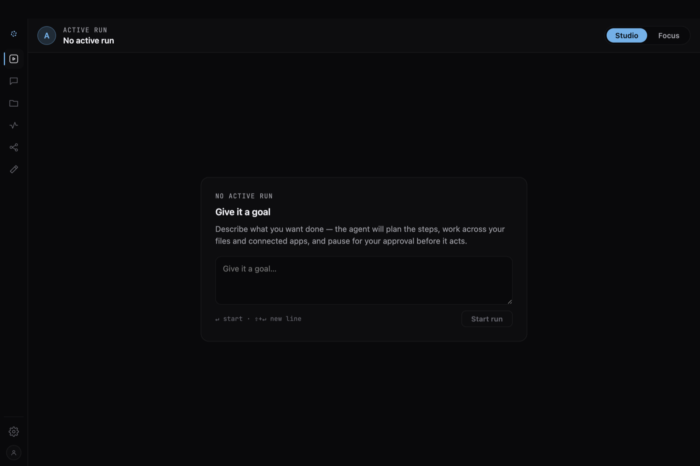

# 0xCopilot

**Put your day on autopilot.**

[](https://github.com/0x-copilot-dev/0x-copilot/actions/workflows/ci-cli.yml)
[](https://www.npmjs.com/package/@0x-copilot/cli)
[](LICENSE)
[](tools/cli#requirements)
[](#local-first-by-design)

Copilot lives on your machine, moves through your files and tools, and quietly
takes care of the work. You can check in, change direction, or leave it running
while you focus on what matters.

**Consider your day handled.**

```bash
npm install -g @0x-copilot/cli
copilot
```

Requires Node.js 20+ on macOS (Apple Silicon or Intel) or Windows x64. Prefer
Bun? Install with `bun add -g @0x-copilot/cli`.



## How Copilot handles your day

- **Works where you work.** Copilot moves across connected files, tools, and
  apps instead of stopping at an answer.
- **Keeps moving.** Hand off multi-step work and let it continue while you
  focus elsewhere.
- **Keeps you in control.** Check progress, change direction, stop a run, or
  approve sensitive actions before they happen.

### Local-first by design

The desktop runtime, database, and activity history stay on your machine. When a
task uses a model provider or external connector, the relevant prompts and
context are sent to the services you configure.

Bring your own OpenAI, Anthropic, or Google Gemini key. Self-hosted deployments
can also connect to local models through Ollama.

## Get started

1. **Install and launch.** Run the two commands above. The first launch stages
   the local runtime; later launches start directly.
2. **Sign in.** Connect a wallet, or use Google when it is enabled for your
   deployment.
3. **Choose a model.** Open **Settings → Models & keys → Provider keys** and add
   the provider you want to use.

For diagnostics, updates, data locations, and uninstall instructions, see the
[`@0x-copilot/cli` guide](tools/cli/README.md).

## Self-host

Run the web stack on your own host with Docker Compose:

```bash
curl -fsSL https://raw.githubusercontent.com/0x-copilot-dev/0x-copilot/main/deploy/self-host/install.sh | bash
```

Open <http://127.0.0.1:8080> when the installer finishes. See the
[self-hosting guide](deploy/self-host/README.md) for domains, TLS, authentication,
model providers, local models, upgrades, and operations.

## Documentation

- [Desktop and supervised runtime](apps/desktop/README.md)
- [CLI installation and troubleshooting](tools/cli/README.md)
- [Self-hosting](deploy/self-host/README.md)
- [Architecture](docs/architecture/workspace-topology.md) and
  [service boundaries](docs/architecture/service-boundaries.md)
- [Development](CLAUDE.md) and [API testing](docs/dev-testing.md)
- [Security policy](SECURITY.md) and
  [control mapping](docs/security/control-mapping.md)
- [Product use cases](docs/use-cases/README.md)

## Community and support

Join the [Discord community](https://discord.gg/NhCv7zDkmX) for questions,
support, and feature requests. Follow reported work on
[GitHub Issues](https://github.com/0x-copilot-dev/0x-copilot/issues).

Please report vulnerabilities privately as described in the
[security policy](SECURITY.md).

## License

[MIT](LICENSE) © 0xCopilot
