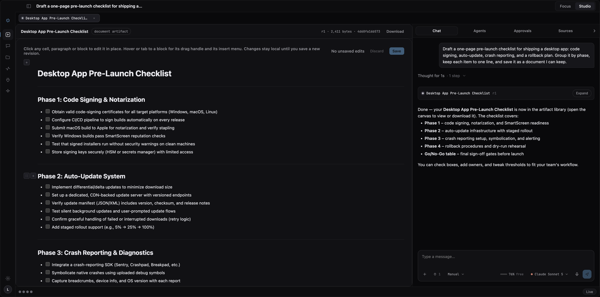

# 0xCopilot

**A local-first desktop agent that runs on your own API keys.** The runtime, the
database, and every conversation stay on your machine. Bring a key from any of
eight providers — or run a model locally and use no key at all.

**The cheapest task is the one that finishes.** You buy inference at your
provider's list price — no seat, no markup, nobody reselling you tokens — you
can see what a task will cost before you run it, and the harness is tuned so
runs finish instead of dying at eighty percent.<sup>\*</sup> An unfinished run
costs full price and delivers nothing.

_Put your day on autopilot._

[](https://github.com/0x-copilot-dev/0x-copilot/actions/workflows/ci-cli.yml)
[](https://www.npmjs.com/package/@0x-copilot/cli)
[](LICENSE)
[](tools/cli#requirements)

```bash
npm install -g @0x-copilot/cli
copilot
```

Node.js 20+, macOS (Apple Silicon or Intel) or Windows x64. Prefer Bun?
`bun add -g @0x-copilot/cli`.



- **Nothing is hosted.** An embedded PostgreSQL and three local services run on
  `localhost`. No account of ours sits between you and your model provider.
- **Your keys, your choice of model.** OpenAI, Anthropic, Google, Groq, xAI,
  OpenRouter, Virtuals compute, or **any OpenAI-compatible endpoint**. Local
  models run on your own GPU through Ollama.
- **Connects to real tools over MCP**, with OAuth handled for servers that
  support it and consequential writes held at an approval gate.
- **Work lands as artifacts you keep** — documents, code, and datasets, editable
  in place, revisioned, and downloadable.
- **You can see the bill forming.** A context meter in the composer, and a model
  catalogue carrying real per-million-token pricing — so cost is a decision you
  make up front, not a surprise you read afterwards.
- **Runs that finish.** An inherited step ceiling was quietly terminating live
  work mid-task; removing it raised task completion for **+0.1% tokens**.<sup>\*</sup>

<sup>\*</sup> Measured on internal benchmarks, driven against the packaged app and
scored from the same records the product bills from. Method, results, and the
claims that did not survive: [`tools/harness-bench/FINDINGS.md`](tools/harness-bench/FINDINGS.md).

## Local-first by design

Prompts and context leave your machine only for the model provider or connector
a task actually uses, and go nowhere else.

Provider keys are encrypted at rest in a local vault. Local run history can be
encrypted too, and the app can require Touch ID to open and lock itself when
idle.

## Bring your own compute

The model picker is built from the provider's own live catalogue, so it is
discovered rather than hardcoded:

|               |                                                              |
| ------------- | ------------------------------------------------------------ |
| Direct        | OpenAI · Anthropic · Google Gemini · Groq · xAI              |
| Gateways      | Virtuals compute · OpenRouter                                |
| Local         | Ollama — install, run, and set a default from inside the app |
| Anything else | any OpenAI-compatible endpoint                               |

**Virtuals compute** is the reason that matters in practice: it fronts roughly
sixty models from ten vendors behind one endpoint and publishes its own live
inventory, priced per million tokens, so a model added upstream appears here
without a release. **Local models** run on your own GPU or CPU through Ollama —
private, offline, and no key at all.

## Connect your tools

Copilot speaks MCP, with OAuth handled for servers that support discovery and
dynamic client registration, and per-server credentials for those that do not.
Connector tokens live in the same encrypted local vault as your provider keys.
Writes through a connector are gated: a consequential action waits for your
approval on the surface it affects.

You can also give Copilot reusable skills, group work into projects, and review
everything it did from the activity destination.

## Get started

1. **Install and launch.** Run the two commands above. The first launch stages
   the local runtime; later launches start directly.
2. **Sign in.** Connect a wallet, or use Google when it is enabled for your
   deployment.
3. **Choose a model.** Open **Settings → Models & keys → Provider keys** and add
   the provider you want to use, or install a local model instead.

For diagnostics, updates, data locations, and uninstall instructions, see the
[`@0x-copilot/cli` guide](tools/cli/README.md).

## Measured, in public

[`tools/harness-bench/FINDINGS.md`](tools/harness-bench/FINDINGS.md) is the
harness benchmark. Every number in it comes from the packaged app running
against a real model, scored from the same records the product bills from.

It also carries the correction of an earlier version of itself, which had
declared its own headline finding falsified on the strength of a metric that was
structurally blind to the failure it existed to detect.

Claims that did not survive are retracted there rather than quietly dropped —
which is the point of publishing it at all.

## From Kleos Research

0xCopilot is built by [Kleos Research](https://kleosresearch.xyz), which works on
the layer between agents and the models they run on. Its other project is
[Kaleidoscope](https://memory.kleosresearch.xyz), filesystem-native memory for
agents — user-owned files, no database server, and no model of its own.
Held-out results are published in
[Optimising for memory recall](https://kleosresearch.xyz/research/optimising-for-memory-recall.pdf).

## Contributing

Pull requests target **`dev`**, never `main`.

```
feature ──PR──▶ dev ──promote-to-main.yml──▶ main ──release-cli.yml──▶ npm
```

`dev` is the integration branch: every change lands there first and CI runs on
it. `main` is the released branch and moves only when the promotion workflow is
dispatched, which refuses to promote a `dev` commit whose checks are not all
green and all finished.

So work from `dev`, not `main` — `main` is a release pointer and is usually the
older of the two:

```bash
git checkout dev && git pull    # start here
git checkout -b feat/your-change
gh pr create --base dev
```

Three checks must pass on every PR: `lint-and-secrets`, `tenants-lint` and
`repo-gates` (about 45 seconds total). Merging requires write access, which is
held by the maintainers — anyone may fork and open a PR, and a maintainer merges
it after review. Outside contributions need two approvals.

Use [Conventional Commit](https://www.conventionalcommits.org) subjects
(`feat:`, `fix:`, `feat!:`, a `BREAKING CHANGE:` footer). They are not
decoration: the CLI changelog and the next version number are both derived from
them, and a subject that is not conventional is skipped rather than guessed at.

Releases are manual and dry-run by default. While the CLI is `0.x`, a breaking
change bumps the **minor** digit (`0.1.4 → 0.2.0`) and everything else bumps
patch, because npm resolves `^0.1.4` as `>=0.1.4 <0.2.0`. Full detail, including
how promotion and publishing are run:
[branching and release](docs/ci-cd/branching-and-release.md).

## Documentation

- [Branching, protection and release](docs/ci-cd/branching-and-release.md)
- [Desktop and supervised runtime](apps/desktop/README.md)
- [CLI installation and troubleshooting](tools/cli/README.md)
- [Architecture](docs/architecture/workspace-topology.md) and
  [service boundaries](docs/architecture/service-boundaries.md)
- [Development](CLAUDE.md) and [API testing](docs/dev-testing.md)
- [Security policy](SECURITY.md) and
  [control mapping](docs/security/control-mapping.md)
- [Product use cases](docs/use-cases/README.md)

## Community and support

Questions, bug reports, and feature requests belong on
[GitHub Issues](https://github.com/0x-copilot-dev/0x-copilot/issues).

Please report vulnerabilities privately as described in the
[security policy](SECURITY.md).

## License

[MIT](LICENSE) © 0xCopilot
