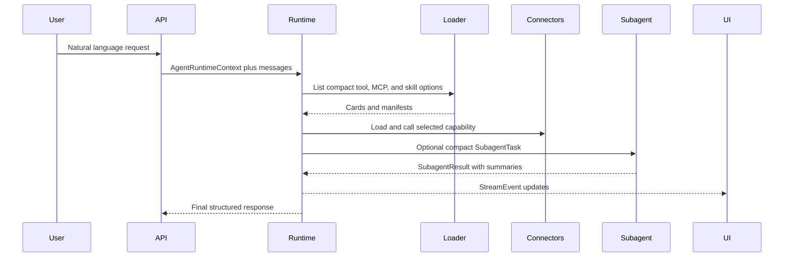

# Data Flow

## Request Flow

## Dynamic Capability Loading

The runtime should show the LLM compact descriptions first. Heavy descriptions, argument schemas, and connector clients should load only after the model chooses a capability.

This pattern applies to:

- Tools: `ToolCard` to `LoadedToolSpec`.
- MCP servers: `McpServerCard` to discovered tools/resources.
- Skills: `SKILL.md` frontmatter to full skill instructions and assets.

## Context Flow

Deep Agents should own short-term context compression by default:

- Large tool inputs/results are offloaded to the configured filesystem backend.
- Old message history is summarized near the model context limit.
- Full source material remains searchable via filesystem references.

Custom code should expose metrics and policy hooks, not duplicate SDK compression logic.

## Subagent Flow

Subagents receive compact tasks, not raw conversation dumps. A subagent input should include:

- Objective.
- Relevant summary.
- Constraints and permissions.
- Allowed tools, MCP servers, and skills.
- Required result format.

Subagents return a concise response plus execution and plan summaries so the supervisor preserves intent without absorbing every subagent tool call.

