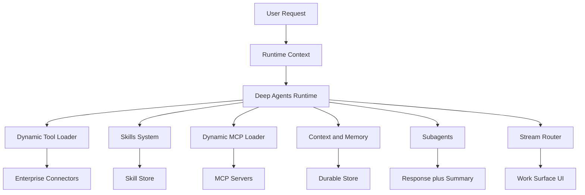

# System Overview

## Product Direction

The AI backend powers an enterprise work surface for executives and employees who are not power users or engineers. The system should answer questions, coordinate work, and act across Slack, Google Workspace, Atlassian, internal APIs, MCP servers, and enterprise search indexes without exposing users to connector complexity.

The backend is not just search. It is an agentic orchestration layer that can select capabilities, load deeper instructions, manage context, delegate work, and stream progress in a way that feels trustworthy inside a product UI.

## Runtime Architecture

## Staff-Level Design Tenets

- Put typed boundaries around every untrusted or external surface: user input, connector payloads, MCP descriptors, model outputs, subagent results, memories, and stream events.
- Use Pydantic models for parse, validate, normalize, and serialize steps. Avoid untyped dictionaries for domain state.
- Keep orchestration separate from side effects. Agent runtime modules decide what should happen; connector modules perform external IO.
- Prefer explicit invariants over defensive sprawl. Invalid state should fail early with typed errors.
- Use dependency inversion for registries, stores, tool loaders, and subagent runners so tests can use fakes.
- Apply DRY only when it removes meaningful duplication. Do not force a shared abstraction across features that evolve differently.
- Design interfaces so implementations are substitutable: fake MCP clients, remote MCP clients, local subagents, and remote async subagents should satisfy the same contracts.

## Primary Feature Areas

- Runtime foundation: Deep Agents harness, LangGraph execution, runtime context, model configuration, and dependency injection.
- Dynamic tool loading: small tool cards first, full LangChain tool definitions only after the model chooses a tool.
- Skills middleware: Agent Skills-compatible `SKILL.md` folders with progressive disclosure.
- Dynamic MCP loading: discover MCP servers and expose selected tools/resources at runtime.
- Context and memory: use Deep Agents offloading and summarization, with scoped durable memory for users, agents, and organizations.
- Subagents and async agents: delegate heavy work without sending full conversation history.
- Streaming and observability: normalize LangGraph v2 events for product UI and traces.

## Non-Goals for the Spec Phase

- No production Slack, Google Workspace, Atlassian, or internal API integration.
- No final database choice.
- No custom replacement for Deep Agents built-in context compression before measuring SDK behavior.
- No implementation code until PRDs/specs/rules are accepted.

