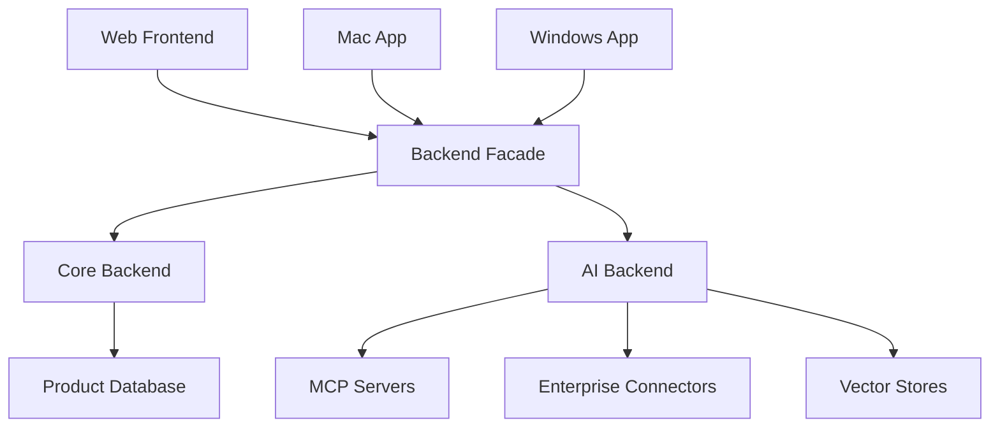

# Workspace Topology

## Architecture Model

Enterprise Search should be developed as one GitHub monorepo with multiple deployable services and apps. The code lives together so product changes can move coherently, but services still have clear runtime boundaries.



## Target Layout

```text
enterprise-search/
  apps/
    frontend/
    mac/
    windows/
  services/
    backend-facade/
    backend/
    ai-backend/
  packages/
    api-types/
    shared-config/
    design-system/
  infra/
    docker/
    compose.yaml
  docs/
    architecture/
    ci-cd/
    decisions/
```

`ai-backend-src` is the current transitional AI backend path. Do not move it casually. Rename or move it to `services/ai-backend` only in a deliberate migration that updates docs, rules, CI paths, imports, and setup commands together.

## Allowed Call Direction

- Apps call `backend-facade`.
- `backend-facade` calls `backend` and `ai-backend`.
- `backend` owns product state and may emit events/jobs for other services.
- `ai-backend` may call MCP servers, enterprise connectors, vector stores, and LLM providers through typed ports.
- Shared packages provide contracts and generated clients, not hidden runtime coupling.

## Disallowed Shortcuts

- Apps must not call `ai-backend` directly unless a future approved spec creates an exception for streaming.
- `ai-backend` must not own tenant auth, billing/admin workflows, or product persistence.
- `backend-facade` must not absorb AI orchestration logic.
- Shared packages must not become dumping grounds for business logic.

