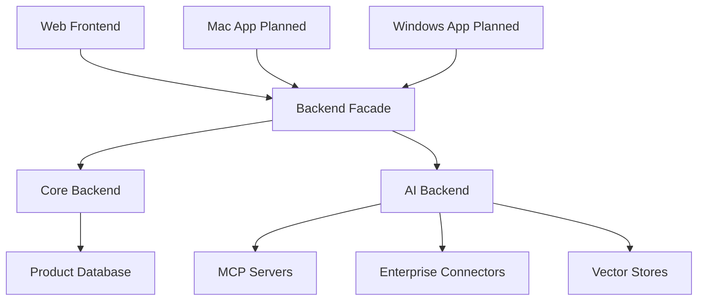

# Workspace Topology

## Architecture Model

Enterprise Search should be developed as one GitHub monorepo with multiple deployable services and apps. The code lives together so product changes can move coherently, but services still have clear runtime boundaries.



## Current And Target Layout

The target architecture includes clients and shared packages that are not all
implemented yet. Planned paths should stay out of builds and imports until they
exist on disk.

```text
enterprise-search/
  apps/
    frontend/        # implemented
    mac/             # planned
    windows/         # planned
  services/
    backend-facade/  # implemented
    backend/         # implemented
    ai-backend/      # implemented
  packages/
    api-types/       # implemented
    design-system/   # implemented
    shared-config/   # planned
  infra/
    docker/
    compose.yaml
  docs/
    architecture/
    ci-cd/
    decisions/
```

`services/ai-backend` is the canonical AI backend service path. Do not move service directories casually; any future service move must update docs, rules, CI paths, imports, and setup commands together.

## Allowed Call Direction

- Apps call `backend-facade`.
- `backend-facade` calls `backend` and `ai-backend`.
- `backend` currently owns MCP registration, OAuth/token state, user skills, and
  audit events. It is the target home for product state and may emit events/jobs
  for other services as those concerns are implemented.
- `ai-backend` may call MCP servers, enterprise connectors, vector stores, and LLM providers through typed ports.
- Shared packages provide contracts and generated clients, not hidden runtime coupling.

Allowed call direction means runtime calls over APIs, queues, or documented events.
It does not permit direct imports across app/service implementation packages.
It also does not permit running a component with a sibling service's `.venv` or
adding another deployable component's `src` directory to `PYTHONPATH`.

## Disallowed Shortcuts

- Apps must not call `ai-backend` directly unless a future approved spec creates an exception for streaming.
- Apps and services must not import code from sibling apps or services.
- Apps and services must not share local virtual environments or dependency manifests.
- `ai-backend` must not own tenant auth, billing/admin workflows, or product persistence.
- `backend-facade` must not absorb AI orchestration logic.
- Shared packages must not become dumping grounds for business logic.

