# 0xCopilot — Architecture Audit Overview

The front door to a full-repository architecture audit of the 0xCopilot enterprise
agent platform. Every one of the **18 clusters** and **6 end-to-end flows** below was
audited, adversarially verified, and merged into a knowledge graph and a findings
synthesis — there is no coverage caveat. Start here, then follow the links into the
cluster and flow reports for evidence.

Audit date: **2026-07-20**. Base commit: worktree `worktree-arch-audit-v2` at HEAD.

---

## Executive summary

**What the system is.** 0xCopilot is an enterprise agent platform: a user types a goal, an
LLM-driven agent (LangGraph + Deep Agents) plans and executes it across real SaaS surfaces via
MCP connectors, and every observable step streams back to a chat/timeline UI where irreversible
actions pause for human approval. It ships two ways — a hosted web app and a **fully-local
Electron desktop app** that supervises an embedded PostgreSQL plus the three backend services on
the user's own machine (BYOK provider keys, no cloud dependency required).

**Architectural shape.** The repo is a monorepo of independently deployable components with a
**hard boundary rule: no component imports another's `src/`** — cross-component integration is
HTTP, generated/mirrored contracts, or constants-only packages. Three tiers:

- **The agent runtime** (`services/ai-backend`) — a ports-and-adapters domain core (execution,
  capabilities, persistence) fronted by an HTTP/SSE API and driven by a queued worker. This is
  the best-engineered part of the system: frozen Pydantic contracts, dependency inversion at
  every port, a single event-producer chokepoint, integer-only money math, PII-safe observability.
- **The product backend** (`services/backend`) — MCP registration + OAuth token vault, identity
  (six sign-in ramps), and the product destinations (todos, projects, memory, inbox, connectors,
  webhooks, …). Fronted by a stateless **facade** (`services/backend-facade`) that is the *only*
  surface the apps may call.
- **The clients** — a Vite/React web app and the Electron desktop app, both meant to mount a
  single **substrate-agnostic interaction layer** (`packages/chat-surface`) through their own host
  adapters, with wire contracts carried by a hand-written TypeScript mirror (`packages/api-types`).

**Scale.** ~3,200 tracked source files, **~745k LOC** (708,449 claimed by exactly one cluster,
95.1%; the 4.9% orphan remainder is service chassis — root metadata, migrations, per-service docs
— plus one real gap covered by the *backend-core* cluster). See [coverage.md](coverage.md).

**Overall health verdict.** *The engines are strong; the wiring and the contracts are the debt.*
Per-module engineering discipline is genuinely high across almost every cluster — reviewers
repeatedly found "staff-level" domain code, honest docstrings, and fail-closed security seams. But
the system is in a **build-ahead phase**, and the gap between what the code *claims* and what
actually *executes in a shipped configuration* is now the dominant risk class:

- **~95k LOC of production-dead code** (dominated by two folded front-end destination subtrees),
  all exported/tested/documented as if live — which actively misleads compliance and refactor
  reviews. See [findings/dead-code.md](findings/dead-code.md).
- **Product persistence is in-memory in every shipped composition** — desktop and self-host users
  lose todos/projects/memory/inbox on restart ([RISK-product-inmemory](findings/risks.md)).
- **Compliance controls are marketed but wired in no deployment**: RBAC runs in log-only mode,
  the SIEM export pump is never started, legal hold is settable nowhere, `retention_days` has zero
  callers, audit list/export return nothing under the Postgres stores production actually uses.
- **The declared SSOT interaction layer is untested in CI** and its lint is red; a chat-surface
  regression can ship to both hosts unobserved ([RISK-no-ci-tests](findings/risks.md)).
- **The "pure domain" and "generated contracts" stories are fiction at the import graph**: the
  agent runtime imports its own HTTP layer in a package cycle ([BND-1](findings/boundary-violations.md)),
  and `api-types` is a 9.6k-LOC hand-mirror with drift tests for four enum tuples ([SSOT-1](findings/ssot-violations.md)).

None of this is rot — it is scaffolding running ahead of integration. The highest-leverage fixes
are mechanical and well-scoped (delete the dead subtrees, break the import cycle, generate the
contracts, wire the compliance loops, add the missing CI). The [Top 10](#top-10-risks--opportunities)
below ranks them.

---

## System context

**Users.** End users sign in through one of six ramps — dev IdP (dev only), Google OAuth, SIWE
wallet login (EIP-4361), local password + magic-link, SAML / per-org OIDC SSO, and `atlas_pk_*`
API keys — and land in a solo 6-destination shell (Run, Chats, Activity, Connectors/Tools,
Settings, ⌘K palette). Admin/workspace/billing surfaces exist but are gated off for the
`single_user_desktop` deployment profile. See [flows/auth-identity.md](flows/auth-identity.md).

**External systems** the platform talks to (33 external nodes in the graph):

| Category | Systems |
|---|---|
| LLM providers | OpenAI (native + OpenRouter/Ollama gateways via base_url), Anthropic, Google Gemini, local Ollama, Hugging Face (GGUF size lookup) |
| Agent tools | Third-party **MCP servers** (reached only via the backend RPC proxy with a vault-decrypted token) |
| Identity providers | Google OAuth/OIDC, per-org SAML/OIDC IdPs, EIP-6963 browser wallets |
| Data & crypto | PostgreSQL (RLS, LISTEN/NOTIFY), SQLite (desktop file-store catalog + LangGraph checkpoints), AWS KMS (envelope-encrypted DEKs) |
| Ops | OTel collector (fails closed in prod), LangSmith (lazy remote sandbox), LiteLLM (vendored pricing data) |
| Supply chain | GitHub / python-build-standalone (pinned CPython 3.13), Maven Central (zonky embedded Postgres 17), GHCR (service images) |

**Deploy targets.**

1. **Hosted web** — browser → nginx → facade `:8200` → `backend:8100` / `ai-backend:8000`;
   Postgres shared store, 4-worker gunicorn images. Self-host variant via Docker + GHCR
   (`deploy/self-host/`).
2. **Desktop** — `npm i -g @0x-copilot/cli && copilot` stages a pinned runtime and supervises
   embedded Postgres + the three services locally; auth posture forced to production; file-store
   or postgres backend. See [flows/desktop-boot.md](flows/desktop-boot.md).
3. **Marketing site** — `apps/website` (Astro) → GitHub Pages.

---

## The cluster map

Cluster-level architecture (module edges collapsed; external systems omitted; the primary
request path is left-to-right). The full 681-edge graph is in
[graph/knowledge-graph.md](graph/knowledge-graph.md).

```mermaid
graph LR
  subgraph clients[Clients]
    frontend_web["frontend-web"]
    desktop_app["desktop-app"]
  end
  subgraph surface[Interaction layer · chat-surface SSOT]
    chat_surface_core["chat-surface-core"]
    chat_surface_destinations["chat-surface-destinations"]
    chat_transport["chat-transport / api-types<br/>(shared-packages)"]
  end
  subgraph facade_t[Gateway]
    backend_facade["backend-facade :8200"]
  end
  subgraph backend_t[Product backend :8100]
    backend_identity["backend-identity"]
    backend_product["backend-product"]
    backend_platform["backend-platform"]
    backend_core["backend-core<br/>(vault · MCP OAuth · chassis)"]
  end
  subgraph ai_t[Agent runtime :8000]
    ai_runtime_api["ai-runtime-api"]
    ai_runtime_worker["ai-runtime-worker"]
    ai_runtime_execution["ai-runtime-execution"]
    ai_runtime_capabilities["ai-runtime-capabilities"]
    ai_runtime_persistence["ai-runtime-persistence"]
  end
  subgraph meta[Cross-cutting]
    shared_packages["shared-packages"]
    build_deploy["build-deploy"]
    desktop_distribution["desktop-distribution"]
    docs_corpus["docs-corpus"]
  end

  frontend_web --> chat_surface_core
  frontend_web --> chat_surface_destinations
  desktop_app --> chat_surface_core
  desktop_app --> chat_surface_destinations
  chat_surface_core --> chat_transport
  chat_surface_destinations --> chat_transport
  chat_transport -->|http,sse| backend_facade
  desktop_app -->|spawn| backend_facade
  backend_facade -->|http,sse| ai_runtime_api
  backend_facade -->|http| backend_identity
  backend_facade -->|http| backend_product
  backend_facade -->|http| backend_platform
  ai_runtime_api --> ai_runtime_worker
  ai_runtime_api --> ai_runtime_execution
  ai_runtime_api --> ai_runtime_persistence
  ai_runtime_worker --> ai_runtime_execution
  ai_runtime_worker --> ai_runtime_capabilities
  ai_runtime_worker --> ai_runtime_persistence
  ai_runtime_execution --> ai_runtime_capabilities
  ai_runtime_capabilities -->|http /internal/v1| backend_platform
  ai_runtime_api -->|http /internal/v1| backend_product
  backend_product --> backend_identity
  backend_platform --> backend_core
  backend_identity --> backend_core
  shared_packages -.contracts.-> chat_transport
  shared_packages -.contracts.-> ai_runtime_api
  desktop_distribution -.stages.-> desktop_app
  build_deploy -.builds.-> backend_facade
  docs_corpus -.documents.-> ai_runtime_api
```

| Cluster | Role | ~LOC | Health | Report |
|---|---|---:|---|---|
| ai-runtime-execution | Domain heart of the runtime: the factory that assembles a Deep Agents/LangGraph harness from injected ports — model resolution, depth budgets, prompt assembly, tool-error policy, in-process subagent delegation, memory routing, run budgets, vendored pricing, deployment-profile toggles. | 56.1k | Well-engineered contract-first core; **medium** risk from ~1k LOC dead machinery + prompt-vs-enforcement SSOT drift. | [01](clusters/01-ai-runtime-execution.md) |
| ai-runtime-capabilities | The agent's capability layer: MCP dynamic load/dispatch, skills, built-in tools, three code-execution subsystems, desktop workspace/browser bridges, and per-call middleware (budget, error policy, retry, citations). | 33.5k | Careful, fail-closed security posture; **~16%** (3.1k LOC) production-dead + a domain→API boundary violation. | [02](clusters/02-ai-runtime-capabilities.md) |
| ai-runtime-persistence | Durable-state substrate: typed records, satellite store ports, field-level envelope encryption, migrations, retention resolver, and three swappable adapters (in-memory, Postgres, desktop file/JSONL). | 35.2k | Strong contracts but **drifting**: 90-method god port, Postgres missing 3 live methods, file/in-memory duplicated verbatim. | [03](clusters/03-ai-runtime-persistence.md) |
| ai-runtime-api | FastAPI ingress: conversations/runs/approvals/usage/budgets/retention/shares/drafts routes, SSE run + inbox streaming with `sequence_no` reconnect, coordinator/service layer, observability toolkit. | 48.3k | Healthy core with strong invariants; soft RBAC/readiness defaults + a process-local inbox bus under a 4-worker image. | [04](clusters/04-ai-runtime-api.md) |
| ai-runtime-worker | The queued run executor: claim → stream → project → persist; run/cancel/approval handlers, LangGraph chunk mapping, background jobs (rollup, retention, recurrence, extraction). | 29.4k | Strong hot path; **~3.2k LOC dormant jobs**, run/approval handler drift (unmetered resumes), serial dispatch. | [05](clusters/05-ai-runtime-worker.md) |
| backend-identity | Six sign-in ramps, session/bearer minting + touch, MFA/SAML/SCIM, SIWE wallet linking, BYOK provider keys, RBAC scope machinery. | 31.1k | Most disciplined code in the repo; debt is **wiring**: RBAC advisory, SIWE store unwired, EIP-4361 template hand-mirrored 3×. | [06](clusters/06-backend-identity.md) |
| backend-product | The product destinations: todos, projects, memory, library (vector search), inbox, connectors read model, palette, routines, webhooks, agents, tools, team. | 68.3k | High per-module discipline; **every destination store is in-memory** (data loss on restart) + several stub/unwired features. | [07](clusters/07-backend-product.md) |
| backend-platform | Security-critical platform primitives: token vault adapters, audit chain, observability stack, migration runner, SIEM export pump, internal API auth. | 4.2k | Registry/vault/chain healthy; **audit egress is facade-only** (SIEM unstarted, export empty on Postgres); `create_app` overgrown. | [08](clusters/08-backend-platform.md) |
| backend-facade | The product-facing gateway: authenticates bearers, drops caller-supplied identity, forwards `/v1/*` to backend/ai-backend with trusted service headers, SSE passthrough. | 19.6k | Good trust-boundary discipline; accretion left 3 forwarding kernels + oldest routes on the weakest (no-expiry) auth. | [09](clusters/09-backend-facade.md) |
| frontend-web | The Vite/React web host: auth state machine, transport singleton, legacy chat + reducer family, Settings, and the (mostly folded) destination features. | 106.3k | Disciplined host; **~17.8k LOC dead destinations** awaiting sweep + Settings/run implemented twice vs the chat-surface SSOT. | [10](clusters/10-frontend-web.md) |
| chat-surface-core | The substrate-agnostic interaction shell: ports contract, destination/shortcut/settings-nav registries, composer, thread-canvas projector, notification center. | 38.0k | Deliberately architected SSOT layer; but its lint+186-file test suite run in **no CI** and the "one projector" cockpit has forked. | [11](clusters/11-chat-surface-core.md) |
| chat-surface-destinations | The destination implementations (Run cockpit, Chats, Activity, Connectors, Settings pages, and nine unmounted families) plus the Settings surface. | 79.9k | Live sixth is staff-level; **~68% (39k LOC) unmounted-but-exported**; web keeps parallel Settings/run/connectors. | [12](clusters/12-chat-surface-destinations.md) |
| desktop-app | The Electron main process: supervisor (Postgres + 3 services), boot secrets, IPC transport bridge, capability broker, AC8 browser, auth posture, renderer bootstrap. | 38.0k | One of the **healthiest** clusters; security-serious but over-provisioned — AC8 browser + AC5 broker built, not wired. | [13](clusters/13-desktop-app.md) |
| desktop-distribution | The distribution tooling: `stage.mjs` runtime stager, the `copilot` CLI, payload assembly, mac branded shell, headless smoke harness. | 4.2k | Well-crafted systems glue; SSOT debt at seams + an **Electron major skew** (CLI 42.1 vs app 43.1) shipping to users. | [14](clusters/14-desktop-distribution.md) |
| shared-packages | The cross-cutting packages: `api-types` (TS wire mirror), `service-contracts` (constants), `audit-chain`, `design-system`, `chat-transport`, `surface-renderers`. | 19.0k | Disciplined; central risk is **api-types** — a 9.6k-LOC hand-mirror with drift tests for only four enum tuples. | [15](clusters/15-shared-packages.md) |
| build-deploy | CI/CD + Docker: path-filtered workflows, SHA-pinned actions, SBOMs, keyless signing, deploy manifest, self-host installer, branch-protection + staged-rollout gates. | 8.4k | Unusually mature CI/CD; **safety-critical parts least exercised** — branch protection can't run, SSOT layer untested in CI. | [16](clusters/16-build-deploy.md) |
| docs-corpus | The documentation + planning corpus: living contracts (CLAUDE.md, deployment/security runbooks), architecture diagrams, PRDs, prior-art audits. | 88.9k | Living-contract stratum strong; **prior-art stratum has landmines** (wrong-service dead-code audit, index rot, mirror drift). | [17](clusters/17-docs-corpus.md) |
| backend-core | The unmodularized `backend_app` chassis that no per-feature cluster owns: `app.py`, `store.py`, `service.py`, `token_vault.py`, `mcp_oauth.py`, `auth.py`, `contracts.py` — MCP registration, token vault, SSRF guard, audit reader, app wiring. | 9.9k | **FUNCTIONAL BUT AT RISK** — API-key pepper fails open in prod, SSRF DNS-rebind TOCTOU, broken audit pagination, a 1,620-line `create_app`. | [18](clusters/18-backend-core.md) |

*LOC per [coverage.md](coverage.md) (source-text extensions; tests attributed to the cluster
owning the code under test). backend-core's ~9.9k LOC is the "one real source gap" the coverage
pass flagged — the security-critical top-level modules that otherwise no cluster reviews.*

---

## Request paths

Four canonical traces. Each is a compressed walk; the linked flow report has the full numbered
steps, a sequence diagram, the contracts involved, and the failure modes.

### 1. Web chat run (the hot path) — [flows/run-lifecycle-streaming.md](flows/run-lifecycle-streaming.md)

1. **Client** — the Run cockpit goal composer (`chat-surface`) POSTs `{conversation_id, user_input}`
   to `/v1/agent/runs` through the Transport port.
2. **Facade** — authenticates the bearer, drops caller-supplied identity, forwards to ai-backend
   with server-stamped trusted service headers.
3. **RunCoordinator** (ai-runtime-api) — resolves connector scopes, workspace model, and BYOK
   policies concurrently; splits plaintext keys out before persist; seals `AgentRuntimeContext`,
   emits `RUN_QUEUED`, enqueues a `RuntimeRunCommand`.
4. **Worker** (ai-runtime-worker) — claims the command, preflights budgets, flips to `RUNNING`,
   builds the deep-agent harness (ai-runtime-execution) and streams `harness.agent.astream`.
5. **Event pipeline** — every step funnels through the single `RuntimeEventProducer` chokepoint,
   which redacts, computes the presentation projection (`activity_kind`/`display_title`), and
   appends with a monotonic `sequence_no`; Postgres fires `NOTIFY runtime_events_v1`.
6. **SSE** — `RuntimeSseAdapter` replays-after-cursor then waits on the bus; frames pass through
   the facade to the client, which projects them into chat/timeline/approvals **once** via the
   `eventProjector`. Irreversible tool calls surface as `APPROVAL_REQUESTED` and pause the graph.

*Known rims:* worker dispatch is effectively serial (cancel can't preempt an in-flight run in a
one-worker deployment), and the client has **three** parallel stream-projection pipelines
([DUP-1](findings/duplication.md), [RISK-worker-serial](findings/risks.md)).

### 2. Desktop install & boot — [flows/desktop-boot.md](flows/desktop-boot.md)

1. **CLI** (`copilot`) resolves layout, verifies a build, and stages a **sha256-pinned runtime**
   (CPython 3.13, zonky Postgres 17, per-service `site-packages`, the built web dist), ad-hoc
   signing every Mach-O on macOS.
2. **Branded shell** clones Electron.app, sets `COPILOT_PRODUCTION=1` (since `app.isPackaged` is
   false for a directory launch), and spawns the app in **production posture**.
3. **Supervisor** (Electron main) generates per-install boot secrets, allocates four free ports,
   `initdb`s embedded Postgres, runs migrations, and spawns the three uvicorn children with
   curated envs (`RUNTIME_STORE_BACKEND`, `SIWE_ORIGIN`, `FACADE_WEB_DIST_DIR`, …).
4. **Health gate** polls `/v1/health` on all three, emits `phase:"ready"`, resolves `{facadeUrl}`.
5. **Renderer** wires `WebTransport → TransportBridge → IpcTransport` (the real bearer never
   crosses IPC), the `SignInGate` completes wallet/Google/local auth, and `ChatShell` mounts with
   `destinationBinders` fetching over IPC.

*Known gaps:* the AC5 capability-broker token/URL never reaches the ai-backend child
([RISK-broker-unwired](findings/risks.md)); packaged builds drop the staged web assets so wallet
sign-in 404s ([RISK-wallet-assets](findings/risks.md)); the boot env contract is ~30 unregistered
string literals ([SSOT-7](findings/ssot-violations.md)).

### 3. MCP tool call — [flows/mcp-connectors.md](flows/mcp-connectors.md)

1. **Install/auth** — a catalog entry or custom server is registered in `McpRegistryService`
   (backend); OAuth walks RFC 9728/8414 discovery → RFC 7591 dynamic registration or a
   pre-registered client → PKCE authorization → token exchange → **`TokenVault` encryption**.
2. **Cards for the runtime** — `GET /internal/v1/mcp/cards` returns enabled servers with an
   *effective* auth state (a usable vault token upgrades stale state).
3. **Tool exposure** — the worker composes a `DynamicMcpRegistry`; the deep-agent factory wires
   four builtins (`load_mcp_server`, `call_mcp_tool`, `auth_mcp`, `suggest_mcp_connector`), gated
   by `McpPermissionPolicy` on paused ids / org-user scopes.
4. **Load + call** — `McpLoader` re-checks permissions uncached, then `BackendMcpClient` opens a
   client-session and speaks JSON-RPC (`initialize`/`tools/list`/`tools/call`) through the backend
   RPC proxy, which **decrypts the token and forwards it — plaintext never reaches ai-backend**.

*Known gaps:* the web Connectors "Connect" flow is a stub end-to-end (fake URL, callback 503s, no
writer) while the real state lives one screen away in the MCP settings grid
([RISK-connectors-stub](findings/risks.md)); ~10 MCP-server representations and 3 enum copies
([SSOT-5](findings/ssot-violations.md)); the OAuth/JSON-RPC clients are hand-rolled on blocking
`urllib` with a DNS-rebind SSRF window ([LIB-1](findings/replace-with-libraries.md),
[RISK-ssrf](findings/risks.md)).

### 4. Auth & identity — [flows/auth-identity.md](flows/auth-identity.md)

1. Every ramp exits as the same artifact: a compact **HMAC-signed bearer**
   (`base64url(JSON).base64url(HMAC-SHA256)`) presented to the facade.
2. The facade verifies the signature/claims and, for bearers carrying a `sid`, POSTs
   `/internal/v1/auth/sessions/touch` (cached 30s) to pick up revocation/role/MFA state, then
   forwards trusted `x-enterprise-*` headers to backend/ai-backend.
3. Each downstream service independently verifies the service token and rebinds caller identity;
   in dev with no service token they fall back to caller-supplied identity (three independent env
   vars gate this).

*Known holes:* bearer `exp` is never checked on the HMAC path, and the highest-value facade
surface (all `app.py` handlers) uses the static verifier that **skips the session touch entirely**
— so revoked/expired bearers keep working there ([RISK-bearer-exp](findings/risks.md)); dev-mint
bearers are session-less 365-day tokens ([DUP-11](findings/duplication.md)); PyJWT is already a
dependency and would fix expiry by construction ([LIB-2](findings/replace-with-libraries.md)).

---

## Cross-cutting concerns

**Contracts & SSOT.** — [flows/contracts-and-types.md](flows/contracts-and-types.md). App-facing
payloads travel Pydantic → facade (byte-forwarder) → **hand-written `api-types` TS mirror** →
`chat-transport` → `chat-surface` → hosts. Nothing is generated (the root CLAUDE.md's "generated
contracts" wording is wrong); the mirror is 9,231 LOC with automated drift detection for only four
enum tuples, and the strict SSE guard silently drops unknown event types — the highest-blast-radius
silent-failure vector in the product ([SSOT-1](findings/ssot-violations.md)). Six `_*-stub.ts`
contract copies have already drifted ([SSOT-2](findings/ssot-violations.md)).

**Auth.** — [flows/auth-identity.md](flows/auth-identity.md). Six ramps converge on one HMAC bearer
and one facade verification path; downstream services trust only server-stamped headers behind a
service token, with production fail-closed. The discipline is real, but enforcement is soft at the
edges: RBAC ships log-only in every deployment, `exp` is unchecked, and the strongest routes use the
weakest verifier.

**Streaming.** — [flows/run-lifecycle-streaming.md](flows/run-lifecycle-streaming.md). Events are
persisted with a per-run monotonic `sequence_no`; clients open
`GET /runs/{id}/stream?after_sequence=N` and reconnect from the highest received seq. The backend
pipeline (producer → sequence-numbered store → LISTEN/NOTIFY → SSE replay-loop) is genuinely
single-sourced and well-built. The client side is not: three parallel projection pipelines, a dead
second SSE subscription in `TcSwimlanes`, and no keepalive/auto-reconnect on idle runs.

**Persistence.** — [flows/data-persistence-retention.md](flows/data-persistence-retention.md). Nine
distinct stores (backend Postgres, in-memory product stores, ai-backend Postgres, desktop file
store, LangGraph checkpoints, token vault, four audit chains, desktop userData, browser
localStorage). Runtime data at rest is C7 envelope-encrypted on Postgres; the desktop file store is
plaintext-by-design behind OS perms. The debt: product stores are volatile everywhere, retention/
deletion semantics diverge per backend with no capability signal, checkpoints are in-memory on
Postgres, and legal-hold/`retention_days` gates are unreachable.

---

## Top 10 risks & opportunities

Ranked by blast radius × likelihood, drawn from the seven synthesis reports under
[findings/](findings/). "R" = a behavioral/compliance risk to fix; "O" = a high-leverage structural
opportunity.

1. **[R] RBAC ships default-permissive and is enforced in no deployment.** `RBAC_MODE=audit`
   (log-and-pass) is the default in both `backend` and `ai-backend`, and `enforce` appears in no
   deploy config — every `RequireScopes` annotation is advisory in every shipped configuration.
   → [RISK-rbac](findings/risks.md). *high/high, 2 auditors.*
2. **[R] Bearer `exp` is never verified and the core facade surface skips the session touch.** All
   ~65 `app.py` handlers (agent/MCP/skills/usage) use a static verifier — revoked, logged-out, and
   expired bearers keep working there; dev bearers are effectively eternal.
   → [RISK-bearer-exp](findings/risks.md) (adopt PyJWT, [LIB-2](findings/replace-with-libraries.md)).
   *high/high, 2 auditors.*
3. **[R] All product data is in-memory in every shipped composition.** No `Postgres*Store` exists
   for todos/projects/memory/inbox/connectors/routines/…; desktop and self-host lose product data
   on restart. → [RISK-product-inmemory](findings/risks.md). *high/high, 2 auditors.*
4. **[R] Audit egress is facade-only.** The SIEM export pump is instantiated nowhere (and its SQL
   doesn't match the tables), audit list/export return nothing under the Postgres stores production
   uses, and deploy audit has no persistent adapter — per the repo's own rules, audit export must be
   marked *not implemented* for production. → [RISK-audit-egress](findings/risks.md). *high/high, 3 auditors.*
5. **[O] Break the `agent_runtime → runtime_api/runtime_worker` package cycle.** The "pure domain"
   is fiction: 27 domain files import the HTTP layer and the worker in a circular graph, and the
   boundary test doesn't catch it. This is the structural keystone — several duplication findings
   exist only to route around the cycle. → [BND-1](findings/boundary-violations.md). *high/high, 5 auditors.*
6. **[O] Delete ~50k LOC of folded, still-exported destination code.** Two dead front-end subtrees
   (web `features/*` + nine chat-surface `destinations/*` families) are exported, tested, and
   documented as if live, halving the barrel and misleading every refactor/compliance pass.
   → [DEAD-1](findings/dead-code.md). *high/high, 3 auditors.*
7. **[O] Generate `api-types` from the Pydantic/OpenAPI source (or extend the drift test).** A
   9.6k-LOC hand-mirror with drift tests for four tuples, plus a strict SSE guard that drops unknown
   event types, is the highest-likelihood silent front-end failure. → [SSOT-1](findings/ssot-violations.md).
   *high/high, 2 auditors.*
8. **[R] The worker is serial, cancel can't preempt, and terminal states overwrite each other.**
   Runs process one-at-a-time; a cancel can't be claimed until the run finishes; approval-resume
   completion skips usage/budget/audit/reconciliation and has no timeout (unmetered, unbilled,
   can hang forever). → [RISK-worker-serial](findings/risks.md), [RISK-approval-resume](findings/risks.md). *high/high.*
9. **[R] Persistence god-port has already drifted into runtime 500s.** The ~90-method structural
   `PersistencePort` let Postgres ship missing three approval methods (live `AttributeError` on the
   assigned-approvals inbox), and citation wiring is split-brain off Postgres (Sources feed always
   empty). Splitting it into role ports + a conformance test turns this class of drift into an
   import-time error. → [RISK-postgres-approval](findings/risks.md), [RISK-citation-split-brain](findings/risks.md),
   [REF-5](findings/refactor-simplify.md). *high/high.*
10. **[R+O] CI does not test the SSOT interaction layer, and the deploy gates can't run.** Frontend
    + chat-surface + chat-transport + surface-renderers run no tests in CI (the layer both apps
    mount), chat-surface's own lint is red, branch protection can never apply (SyntaxError), and the
    staged-rollout gate always fails non-canary — normalizing `force_deploy=true`.
    → [RISK-no-ci-tests](findings/risks.md), [RISK-branch-protection](findings/risks.md). *high/high, 2 auditors.*

*Honorable mentions:* converge the three run-stream pipelines and the dual web/desktop Settings
([DUP-1](findings/duplication.md), [DUP-2](findings/duplication.md)); wire legal hold + `retention_days`
([RISK-legal-hold](findings/risks.md), [RISK-retention-days](findings/risks.md)); the desktop AC8
browser subsystem is ~3.4k LOC that executes nowhere while docs claim it does
([DEAD-5](findings/dead-code.md)); the Electron major skew ships an untested runtime to every npm
install ([SSOT-11](findings/ssot-violations.md)).

---

## How to use this audit

Everything lives under `docs/audit/`. Read order for a newcomer: this file → the two or three
cluster reports for your area → the flow report for the behavior you're changing → the relevant
findings file.

| Path | What it is |
|---|---|
| [`00-overview.md`](00-overview.md) | This file — the front door: system context, cluster map, request paths, top risks. |
| [`README.md`](README.md) | The index + methodology + a full annotated listing of every file under `docs/audit/`. |
| [`coverage.md`](coverage.md) | The coverage proof: every tracked file classified to exactly one cluster, per-cluster LOC, and the orphan/junk report. Read this to trust the scope. |
| [`clusters/01..18-*.md`](clusters/) | The 18 per-cluster reports. Each has Purpose, a node/edge inventory, a Health Assessment (strengths/weaknesses/risks), and numbered findings with evidence paths. |
| [`flows/*.md`](flows/) | The 6 end-to-end flow reports (auth, run+streaming, MCP, desktop boot, contracts, data). Each has an overview, a numbered cross-cluster trace, a sequence diagram, contracts, and failure modes. |
| [`findings/risks.md`](findings/risks.md) | Behavioral defects: security/access-control gaps, non-durable compliance controls, wiring shipped UI-first, docs that misdescribe reality. |
| [`findings/boundary-violations.md`](findings/boundary-violations.md) | Layering/dependency-direction breaks (the import graph vs the documented architecture). |
| [`findings/ssot-violations.md`](findings/ssot-violations.md) | One fact maintained in many places — silent semantic drift vectors (contracts, enums, catalogs, config). |
| [`findings/duplication.md`](findings/duplication.md) | Copy-pasted logic to DRY out, ranked by LOC saved / drift blast-radius. |
| [`findings/dead-code.md`](findings/dead-code.md) | Shipped-but-unreachable surface to delete or park (~95k LOC total). |
| [`findings/refactor-simplify.md`](findings/refactor-simplify.md) | God-modules, overlapping abstractions, split-brain interfaces — complexity that taxes every change. |
| [`findings/replace-with-libraries.md`](findings/replace-with-libraries.md) | Bespoke implementations of solved problems (OAuth, JWT, rrule, SSE, checkpointer) a maintained library does better. |
| [`graph/knowledge-graph.md`](graph/knowledge-graph.md) | The merged architecture knowledge graph in human-readable form: 367 nodes, 681 edges, per-cluster node/edge tables, the cluster-level mermaid, and external systems. |
| [`graph/knowledge-graph.json`](graph/knowledge-graph.json) | **The same graph as machine-readable JSON** — nodes (with `id`/`kind`/`path`/`summary`) and edges (with `from`/`to`/`kind`/`label`). Use this for programmatic queries: "what imports X", "who calls this route", impact analysis, or feeding an agent that needs the dependency graph. |
| [`graph/partials/*.json`](graph/partials/) | The 24 per-cluster/flow graph fragments the merged graph was built from (provenance). |
| [`_verify/*.json`](_verify/) | The 24 adversarial-verification records — one per cluster/flow — capturing which findings were confirmed/refuted during the per-cluster verify pass. |
| [`_meta/findings-raw.json`](_meta/) | The raw pre-synthesis finding set (provenance for the seven findings reports). |

**Provenance & confidence.** Every finding carries a severity, a confidence, a verification state
(confirmed / accepted / plausible), the auditor count where merged, and repo-relative evidence
paths with line numbers. Treat *confirmed* findings as load-bearing; *accepted* items are
low-severity acknowledged-as-written; re-verify anything marked *plausible* at current HEAD before
acting. See [README.md](README.md) for the full methodology.
