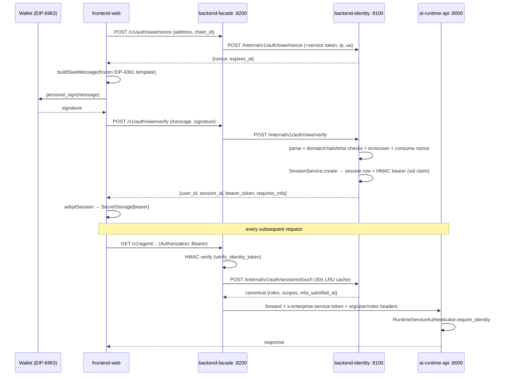

# Flow: Auth & Identity end-to-end

## Overview — what this flow does, its entry and exit points

Every identity in the product enters through one of six ramps and exits as the same artifact: a compact HMAC-signed bearer (`base64url(JSON).base64url(HMAC-SHA256)`) presented to `backend-facade`, verified there, and translated into trusted service headers (`x-enterprise-service-token`, `x-enterprise-org-id`, `x-enterprise-user-id`, roles/permission-scopes/connector-scopes) for `backend` and `ai-backend`.

Entry ramps:

1. **Dev IdP** (dev-only) — persona mint, no password (`services/backend/src/backend_app/dev_idp/`).
2. **Google OAuth** (deployment-global OIDC) — web redirect + desktop loopback PKCE (`backend_app/identity/google.py`, `oidc.py`).
3. **SIWE wallet login** (EIP-4361) — web EIP-6963 wallets, desktop wallet page, desktop "use locally" self-signed key (`backend_app/identity/siwe.py`).
4. **Local password + magic-link email-first** (`backend_app/identity/login_email_first.py`, facade `/v1/auth/login`, `/v1/auth/magic-link/*`).
5. **SAML / per-org OIDC SSO** (`backend_app/identity/saml.py`, `oidc.py`).
6. **API keys** (`atlas_pk_*` bearers verified server-side, `backend_app/api_keys/`).

Except for the dev IdP, all real login paths mint a **session row** (`SessionService.create`, `identity/sessions.py:211`) whose `sid` claim rides in the bearer; the facade re-touches that row (cached 30 s) on every request to pick up revocation, role changes, and MFA state. BYOK provider keys are a satellite of this flow: the bearer-authenticated user stores per-provider API keys encrypted via `TokenVault`, and `ai-backend` pulls the decrypted map over the service-token lane at run time.

Exit points: verified `AuthenticatedIdentity` inside the facade; `ScopedIdentity` in backend; `TrustedRequestIdentity` in ai-backend; `AuthSession` in the desktop main process (bearer kept out of the renderer).

## End-to-end trace — numbered steps

### A. Dev IdP: mint → signed bearer → shared verification path

1. **frontend-web** — `AuthProvider` mounts and probes `GET /v1/auth/session` (`apps/frontend/src/features/auth/AuthContext.tsx:269-314`). On a 401 (typed `UnauthorizedError` thrown by `assertOk`, `apps/frontend/src/api/http.ts:52-54`) the registered unauthorized handler runs `_devReauthAndRestoreSession` (`AuthContext.tsx:225-267`), which calls `_devEnsureBearer` (`AuthContext.tsx:67-76`) — dev builds only (`import.meta.env.DEV`); production tree-shakes it.
2. **frontend-web** — persona slug read from the substrate KV store (`features/auth/devIdp.ts:17-23`, key `enterprise.dev.persona_slug` via `storageKeys.ts`; default `sarah_acme`), then `mintDevBearer` POSTs `/v1/dev/identity/mint` (`api/devIdpApi.ts`).
3. **backend-facade** — unauthenticated dev proxy registered only when `FACADE_ENVIRONMENT=development` AND the deployment profile allows dev auth (`services/backend-facade/src/backend_facade/app.py:206-222`, gate at `app.py:1378-1400`); forwards to backend `/v1/dev/identity/mint`.
4. **backend-identity** — dev IdP routes exist only when `BACKEND_ENVIRONMENT=development` (`services/backend/src/backend_app/dev_idp/routes.py:75-76,169-190`). Mint loads the persona from `dev_personas.yaml`, idempotently seeds org+user rows in the identity store (`routes.py:134-139,193-233`), and signs `{org_id,user_id,roles,permission_scopes,connector_scopes,iat,exp}` with `ENTERPRISE_AUTH_SECRET` via `dev_idp/_sign.py:26-38`. TTL is 365 days (`routes.py:35-38`). **No `sid` claim and no session row** — see Findings 1/2/4.
5. **frontend-web** — bearer stored via the `SecretStorage` port (`AuthContext.tsx:204-217`, key from `storageKeys.ts`) and attached to every request by `configureAuthBearerProvider` (`AuthContext.tsx:200-202`).
6. **backend-facade** — the minted bearer is verified by the exact same `FacadeAuthenticator.verify_identity_token` used for production bearers (`services/backend-facade/src/backend_facade/auth.py:382-412`): split on `.`, constant-time HMAC compare, JSON claims → `AuthenticatedIdentity`. The "no separate bypass code" claim in CLAUDE.md is accurate.
7. **CLI parity** — `make dev-bearer PERSONA=...` curls the backend mint directly and prints `bearer` (`Makefile:119-128`).

### B. Per-request verification and service-to-service forwarding

8. **backend-facade** — most product routes call `verify_with_touch` (`auth.py:215-301`): HMAC verify locally → if the bearer carries `sid`, POST `/internal/v1/auth/sessions/touch {session_id, token_hash}` to backend with the service token (`auth.py:267-276`), memoized in a per-process TTL-bucketed LRU (30 s / 128 entries, `auth.py:95-172`). Sensitive routes pass `cache_bypass=True` (revoke `auth_routes.py:77-82`, logout `:97-102`, password change `:456-461`). **Bearers without `sid` skip the touch entirely** (`auth.py:253-259`).
9. **backend-identity** — touch resolves the session row and enforces revocation + expiry at the store (`routes/sessions.py:66-89`; `identity/session_store.py:99-111` returns `None` on `revoked_at`/`expires_at<=now`/hash mismatch); response carries canonical roles/scopes/`mfa_satisfied_at`, which **override the bearer claims** (`facade auth.py:286-301`).
10. **backend-facade → backend / ai-backend** — upstream calls attach `service_headers` (`auth.py:367-379`): `x-enterprise-service-token` + org/user + CSV roles/permission-scopes + JSON connector-scopes; header names are constants from `packages/service-contracts/src/copilot_service_contracts/headers.py:1-11`. Example consumer: every agents route (`backend_facade/agents_routes.py:45-124`).
11. **backend-product/identity** — `BackendServiceAuthenticator` verifies the service token and reads the identity headers (`services/backend/src/backend_app/auth.py:31-116`); in dev with no `ENTERPRISE_SERVICE_TOKEN` it falls back to caller-supplied query identity (`auth.py:49,66`); production (`BACKEND_ENVIRONMENT=production`) fails closed with 503 when the token is unset (`auth.py:83-87`).
12. **ai-runtime-api** — `RuntimeServiceAuthenticator` does the same dance independently (`services/ai-backend/src/runtime_api/auth.py:35-165`): strict `require_identity` behind the `Identity` dependency (`runtime_api/identity.py:30-36`) for new routes, and a lenient legacy path where **query params supply identity in dev** (`runtime_api/http/routes.py:477-493`). Env gate is a third variable, `RUNTIME_ENVIRONMENT` (`runtime_api/auth.py:127`).
13. **API keys** — `atlas_pk_*` bearers bypass HMAC and session machinery; the facade POSTs `/internal/v1/auth/api-keys/verify` (constant-time hash+pepper server-side) and mints `roles=("api_key",)` claims from the row (`facade auth.py:207-211,304-352`).
14. **Step-up MFA** — `requires_recent_mfa` gates sensitive routes on `mfa_satisfied_at` freshness from the touch (`facade auth.py:601-635`; used at `auth_routes.py:462`); returns `WWW-Authenticate: x-step-up` on 403.

### C. Google OAuth (web + desktop PKCE)

15. **frontend-web** — `LoginScreen` fetches `/v1/auth/providers` and renders "Continue with Google" only when the list advertises id `google` (`apps/frontend/src/features/auth/LoginScreen.tsx:102-126`).
16. **backend-facade** — `/v1/auth/providers`, `/v1/auth/oidc/{provider}/start`, `/v1/auth/oidc/callback` are unauthenticated public ramps that still authenticate to backend with the service token plus placeholder identity headers (`_anonymous_service_headers`, `auth_routes.py:127-213,911-924`).
17. **backend-identity** — the global provider is synthesized from `GOOGLE_OAUTH_CLIENT_ID`/`GOOGLE_OAUTH_CLIENT_SECRET` at boot (`identity/google.py:71-111`); the client secret is TokenVault-encrypted onto the provider record (`google.py:108-110`); Google endpoints are pinned constants (`google.py:60-64`); an FK anchor row is upserted under sentinel org `org_global_google` (`google.py:114-152`). The OIDC callback validates state, exchanges the code (PKCE verifier server-side), and mints a real session via `SessionService.create` (`identity/oidc.py:348,816-851`).
18. **desktop-app** — `runGoogleLogin` binds an ephemeral loopback, GETs `/v1/auth/oidc/google/start?redirect_uri=<loopback>&format=json`, arms the loopback with the returned `state`, opens the system browser, then GETs `/v1/auth/oidc/callback?state&code` for a JSON bearer handoff; `requires_mfa` sessions are refused (no desktop MFA surface) (`apps/desktop/main/auth/google-login.ts:68-171`). Display claims come from a best-effort `GET /v1/me/profile` (`profile-claims.ts`).

### D. SIWE wallet login (web, desktop wallet page, desktop local key)

19. **frontend-web** — `WalletSignIn`: EIP-6963 discovery → `POST /v1/auth/siwe/nonce {address, chain_id}` → `buildSiweMessage` from the frozen template (`features/auth/siweMessage.ts:30-41,74-87`) → `personal_sign` (`WalletSignIn.tsx:120-151,300-304`) → `POST /v1/auth/siwe/verify {message, signature}` → `auth.adoptSession` (`AuthContext.tsx:446-473`). `LoginScreen`'s v2 sign-in card re-implements the same ramp inline (`LoginScreen.tsx:237-283`, acknowledged mirror at `:722`).
20. **backend-facade** — forwards nonce/verify bodies verbatim plus `ip`/`user_agent` so backend detail codes (`nonce_invalid`, `domain_mismatch`, `chain_not_allowed`, …) reach the frontend intact (`auth_routes.py:313-372`).
21. **backend-identity** — `/internal/v1/auth/siwe/{nonce,verify}` require the service token (`routes/siwe.py:1-84`). `SiweService.verify` (`identity/siwe.py:565-639`): strict template parse (`siwe.py:315-451`), statement equality, chain allowlist (`SIWE_ALLOWED_CHAIN_IDS` parsed at app boot, `backend_app/app.py:732-734`; default `1,8453,42161,4663`), domain+URI binding against `SIWE_ORIGIN` (`siwe.py:511-518,642-664`), validity window with 5-min skew (`siwe.py:666-694`), `eth_account` signature recovery matched against the claimed address (`siwe.py:696-718`), single-use nonce consumption, link-or-provision (self-signup gated by the deployment profile toggle, `siwe.py:791`, wired at `app.py:737`), then session mint. Nonce minting is rate-limited per IP and per address (`siwe.py:544-562`).
22. **desktop-app (wallet page)** — `runWalletLogin` opens `{facade}/wallet.html?handoff=http://127.0.0.1:<port>/wallet/cb?state=<state>` in the system browser (`apps/desktop/main/auth/wallet-login.ts:92-108`). The page is the *built frontend artifact* (`apps/frontend/src/walletEntry.tsx` → `WalletHandoffPage`), served same-origin by the facade when `FACADE_WEB_DIST_DIR` is set (`backend_facade/wallet_page_routes.py:36-72`) — this closes the earlier "wallet.html 404 in packaged app" bug. The page validates the handoff target as loopback-only (`WalletHandoffPage.tsx:36-57`), mounts `<WalletSignIn>`, and redirects the minted bearer to the loopback with OIDC-handoff field names.
23. **desktop-app (local login)** — "Use locally, no account": a per-install secp256k1 key (viem, kept in `SecretStorage`) drives the same nonce→sign→verify ramp in-process with chain id 4663, using a third copy of the EIP-4361 template (`apps/desktop/main/auth/local-login.ts:27-91,101-188`).
24. **desktop supervisor** — pins `SIWE_ORIGIN` to the facade origin (`apps/desktop/main/services/service-env.ts:191`) and `FACADE_WEB_DIST_DIR` to the staged web dist (`service-env.ts:242`), so the message domain, the API origin, and the page origin agree by construction.

### E. BYOK provider keys

25. **frontend-web** — Settings → `ProviderKeys.tsx` → facade `/v1/settings/provider-keys` (`backend_facade/settings_routes.py:14-16,41-42`).
26. **backend-identity** — `provider_keys/routes.py` (GET/PUT/DELETE) requires the trusted facade envelope + `RequireScopes(RUNTIME_USE)`; responses carry `key_hint` only, plaintext never leaves (`provider_keys/routes.py:1-60`); storage is TokenVault-encrypted (`provider_keys/service.py`).
27. **ai-runtime-api / ai-runtime-worker** — at run-create the runtime fetches `GET {backend}/internal/v1/policies/runtime` (service-token lane) whose snapshot may carry decrypted `provider_keys`; `ProviderKeysParser.split` removes them before anything is persisted (in-memory only, excluded from `model_dump`) and `ProviderKeysHydrator` re-fetches them in the worker after deserialization (`agent_runtime/api/user_policies_resolver.py:80-211`; `runtime_worker/handlers/run.py:176-179,809-811`; `agent_runtime/execution/contracts.py:346-455`).

### F. Desktop posture (packaged vs dev)

28. **desktop-distribution** — the `copilot` CLI launches Electron pointed at a directory, so `app.isPackaged` is false for real installs; the CLI sets `COPILOT_PRODUCTION=1` (`tools/cli/lib/launch.mjs:69`).
29. **desktop-app** — `isProductionPosture` = `isPackaged || COPILOT_PRODUCTION=1`, with explicit dev overrides (`COPILOT_AUTH_MODE=dev-mint`, `COPILOT_DEV=1`) (`apps/desktop/main/posture.ts:24-28`); production posture forces mode `oidc` and `allowDevMint=false` (`posture.ts:45-51`) so `OidcClient` can never dev-mint (`auth/oidc-client.ts:69-74,112-137`). This closes the earlier "phantom Sarah Chen" bug.
30. **desktop-app** — the supervisor generates per-install `ENTERPRISE_AUTH_SECRET` + `ENTERPRISE_SERVICE_TOKEN` (`services/boot-secrets.ts:9-13`) and injects them plus `BACKEND_ENVIRONMENT=production`, `RUNTIME_ENVIRONMENT=production`, `FACADE_ENVIRONMENT=production` into the supervised services (`services/service-env.ts:161-162,174,195,236`). Bearers live only in the main process (`SecretStorage` on `safeStorage`); the renderer sees display claims.

## Sequence diagram — happy path (SIWE web login, then an authenticated request)

## Contracts involved

| Contract | Definition side(s) | Consumers |
| --- | --- | --- |
| Bearer wire format `b64url(JSON).b64url(HMAC-SHA256(secret, payload_b64))` | facade `auth.py:382-412,501-513`; backend `identity/sessions.py:88-141` (`_BearerCodec`); backend `dev_idp/_sign.py:26-38` — **three hand-kept copies** | every authenticated caller |
| Claim names (`org_id`, `user_id`, `roles`, `permission_scopes`, `connector_scopes`, `sid`, `exp`) | `packages/service-contracts/src/copilot_service_contracts/auth_claims.py:9-21` (constants only, by design) | facade + backend |
| Service headers (`x-enterprise-service-token`, `-org-id`, `-user-id`, `-roles`, `-permission-scopes`, `-connector-scopes`) | `packages/service-contracts/src/copilot_service_contracts/headers.py:1-11` | facade emits (`auth.py:367-379`); backend parses (`backend_app/auth.py:31-116`); ai-backend parses (`runtime_api/auth.py:35-165`) — parsing logic duplicated per service |
| Session touch request/response (`{session_id, token_hash}` → roles/scopes/mfa) | backend `routes/sessions.py:66-89` + `contracts.py` (`SessionTouchResult`) | facade `auth.py:267-299` (re-parses the JSON by hand) |
| EIP-4361 message template + statement `"Sign in to Copilot"` | frontend `siweMessage.ts:16,30-41`; backend `siwe.py:271-302` (+ strict parser `:315-451`); desktop `local-login.ts:27,78-91` — **three byte-identical hand-kept copies** | wallet page, LoginScreen, local login, backend verifier |
| SIWE nonce/verify + OIDC-callback-shaped session handoff (`user_id, session_id, bearer_token, expires_at, requires_mfa, return_to`) | `packages/api-types` (`SiweNonceRequest/Response`, `SiweSessionResponse` — `apps/frontend/src/api/siweApi.ts:8-13`); mirrored as local interfaces in desktop `local-login.ts:55-62`, `google-login.ts:49-56`, loopback handoff query params (`WalletHandoffPage.tsx:61-77`) | frontend, desktop, facade, backend |
| SIWE env knobs `SIWE_ORIGIN`, `SIWE_ALLOWED_CHAIN_IDS` | backend `siwe.py:80-81` (parse `:455-474`); set by desktop supervisor `service-env.ts:191` and self-host compose `deploy/self-host/docker-compose.prod.yml:126-127` | backend verifier; desktop local-login assumes facade origin = SIWE_ORIGIN (`local-login.ts:112-116`) |
| Google provider constants (id `google`, pinned Google endpoints) | backend `identity/google.py:51-64` | frontend keys the button off provider id `google` (`LoginScreen.tsx:117-126`) |
| Dev mint request/response (`persona_slug` → `{bearer, expires_at, identity}`) | backend `dev_idp/routes.py:55-72` | frontend `api/devIdpApi.ts`; desktop `oidc-client.ts:217-229` (own interface copy); Makefile `dev-bearer` |
| Provider-keys surface (`GET/PUT/DELETE /v1/settings/provider-keys`, `key_hint` only) | backend `provider_keys/routes.py:1-60`; facade re-exposes (`settings_routes.py:41-42`) | frontend `ProviderKeys.tsx` |
| Runtime policies snapshot w/ optional top-level `provider_keys` | backend `/internal/v1/policies/runtime`; ai-backend `user_policies_resolver.py:100-211` | run/approval workers |
| Env gates: `BACKEND_ENVIRONMENT` / `FACADE_ENVIRONMENT` / `RUNTIME_ENVIRONMENT`, `ENTERPRISE_AUTH_SECRET`, `ENTERPRISE_SERVICE_TOKEN`, `REQUIRE_SESSION_BINDING` | read at `backend_app/auth.py:99`, facade `auth.py:469-490`, `runtime_api/auth.py:118-127` | set by `deploy/self-host/docker-compose.prod.yml:116,157,222` and desktop `service-env.ts:174,195,236`; `REQUIRE_SESSION_BINDING` set nowhere (see Findings) |

## Failure modes — as implemented

- **Missing/invalid bearer** → 401 `Missing bearer token` / `Invalid bearer token` (facade `auth.py:203-212,392-399`). Frontend converts any 401 into `UnauthorizedError` (`api/http.ts:43-54`); in dev the unauthorized handler silently re-mints and re-probes (`AuthContext.tsx:250-267`); in prod it drops to `anonymous`.
- **Expired bearer** — *not* rejected by the HMAC path: `verify_identity_token` never reads `exp` (no expiry logic anywhere in `facade auth.py`). Expiry is only enforced when a `sid` touch hits the session store (`session_store.py:109-110`). Routes that use `authenticate_request` alone (all `/v1/auth/mfa/*`, `/v1/auth/session`, `/v1/session`, `/v1/auth/me/login-attempts`) accept an expired-but-signed bearer indefinitely. See Finding 1.
- **Revoked session** → touch returns 401 → facade raises `SessionRevoked` (401) and invalidates the token's cache entries (`auth.py:277-279,154-161`). Within the 30 s cache window a *revoked* session still passes on cached routes unless the route sets `cache_bypass=True`. Bearers without `sid` are never revocable (`auth.py:256-259`).
- **Backend touch upstream error** (non-401 ≥400) → 502 `Backend session-touch upstream returned an error` (`auth.py:280-284`); timeout 5 s on touch, 10-15 s on auth proxies.
- **Dev mint failures** — unknown persona → 404; missing `ENTERPRISE_AUTH_SECRET` → 503 (`dev_idp/routes.py:114-126`); missing persona YAML fails loud at registration (`routes.py:184-186`). Frontend swallows mint failures and lands anonymous (`AuthContext.tsx:72-75`).
- **SIWE rejections** — typed detail codes forwarded verbatim through the facade: `nonce_invalid`, `nonce_expired`, `signature_invalid`, `domain_mismatch`, `chain_not_allowed`, `expired_message`, `self_signup_disabled` (facade comment `auth_routes.py:326-330`; backend mapping `routes/siwe.py:39-49`); nonce minting rate-limits per-IP (min) and per-address (hour) with `retry_after_seconds` (`siwe.py:544-562`); lockout service check before session mint (`siwe.py:605-606`).
- **OIDC/IdP error callback** → facade surfaces `error_description` as 400 without minting (`auth_routes.py:189-198`). Desktop distinguishes stages (`start`/`redirect`/`handoff`/`mfa`) with state-replay messaging on 400 (`google-login.ts:173-182`).
- **Desktop MFA-required accounts** — wallet, Google, and local logins all *refuse* the minted session (`wallet-login.ts:120-127`, `google-login.ts:140-147`, `local-login.ts:162-167`): the bearer would carry `mfa:pending` scope and every call would 403; the user is told to finish MFA on the web.
- **Desktop loopback** — 5-min timeout bound to user cancellation; a second sign-in cancels the first via `onCancelAvailable` (`wallet-login.ts:50-56,90`); wallet page refuses non-loopback `?handoff=` targets (`WalletHandoffPage.tsx:36-57`).
- **wallet.html not staged** — facade logs a warning and registers no route (fails closed to 404) when `FACADE_WEB_DIST_DIR` is set but the file is missing (`wallet_page_routes.py:52-58`).
- **Anti-enumeration** — password-reset request always 202 regardless of upstream (`auth_routes.py:400-422`); magic-link start masks 4xx as 202 except 429/422 (`auth_routes.py:533-545`); cross-tenant session revoke 404s are swallowed as success (`auth_routes.py:861-865`).
- **Anonymous ramps with empty service token** — `_anonymous_service_headers` sends whatever `ENTERPRISE_SERVICE_TOKEN` holds, including empty string in dev (`auth_routes.py:911-924`); backend then falls into its dev branch. In production both sides fail closed (facade 503 `auth.py:477-482`; backend 503 `backend_app/auth.py:83-87`; ai-backend 503 `runtime_api/auth.py:58-62`).
- **Touch-cache staleness** — role/scope changes propagate within ≤30 s; logout/revoke invalidate the caller's own entry immediately (`auth_routes.py:86-91,111-113`).

## Findings

### 1. Bearer `exp` is never verified on the HMAC path (risk, high, high confidence)

`FacadeAuthenticator.verify_identity_token` checks the signature and claim shape only — there is no expiry logic anywhere in `services/backend-facade/src/backend_facade/auth.py` (grep `exp`/`EXPIRES`: zero hits) even though every minted bearer carries `exp` (`identity/sessions.py:373`, `dev_idp/routes.py:148-149`). Expiry is enforced solely by the session-store row during a touch (`session_store.py:109-110`), so: (a) routes that use `authenticate_request` alone — all MFA routes, `/v1/auth/session`, `/v1/session`, `/v1/auth/me/login-attempts` (`auth_routes.py:45,622,634,648,664,681,697,731,758,783,818`) — accept expired bearers forever; (b) any bearer *without* a `sid` claim (dev-IdP mints, or anything signed by a leaked secret) is accepted on **every** route with no expiry or revocation check, because `verify_with_touch` silently falls back (`auth.py:256-259`). Remediation: check `exp` in `verify_identity_token` (one clock comparison) — or adopt a JWT library that does it by construction (Finding 6).

### 2. `REQUIRE_SESSION_BINDING` kill-switch is implemented but enabled nowhere (risk, medium, high confidence)

The facade rejects sid-less bearers when `REQUIRE_SESSION_BINDING=true` (`auth.py:401-411,489-490`; contract `auth_claims.py:19-24`), but no deployment artifact sets it: not `deploy/self-host/docker-compose.prod.yml`, not `docker-compose.dev.yml`, not the desktop supervisor (`apps/desktop/main/services/service-env.ts`) — repo-wide the string appears only in the contract, the facade, and tests. Every real login flow now mints `sid` bearers, so the flag could be on in the packaged desktop and self-host stacks; leaving it off keeps the "externally-minted-token back-door" (the code's own words, `auth.py:401-405`) open in every production-posture deployment.

### 3. Two parallel dev-mint implementations with divergent security semantics (duplication, medium, high confidence)

`POST /v1/dev/identity/mint` (`dev_idp/routes.py:111-164`) signs a bearer directly — no session row, no `sid`, 365-day TTL — while `POST /internal/v1/auth/sessions/dev-mint` → `SessionService.dev_mint` (`routes/sessions.py:132-160`, `identity/sessions.py:257-280`) mints a real 24-h session gated by the deployment profile. The frontend, desktop (`oidc-client.ts:112-137`), and Makefile all use the former, so all dev bearers are unrevocable and (per Finding 1) effectively eternal. Folding the dev IdP onto `SessionService.create` would delete `dev_idp/_sign.py` and give dev bearers sid/touch semantics for free.

### 4. HMAC bearer codec hand-implemented three times, twice in the same service (duplication, medium, high confidence)

Facade `_sign`/`_b64encode`/`verify_identity_token` (`backend_facade/auth.py:501-513,382-412`), backend `_BearerCodec` (`identity/sessions.py:88-141`), and backend `dev_idp/_sign.py:26-44`. The facade/backend split is the documented boundary trade-off, but two copies inside `services/backend` is a straight DRY violation (`_sign.py`'s own docstring points at the facade, not at `_BearerCodec` ten files away). Drift risk is real: the codecs must agree on canonical JSON (`sort_keys`, separators) and padding rules for tokens to interoperate.

### 5. SIWE EIP-4361 template is an SSOT violation across three files and two languages (ssot-violation, medium, high confidence)

`apps/frontend/src/features/auth/siweMessage.ts:30-41`, `services/backend/src/backend_app/identity/siwe.py:290-302`, `apps/desktop/main/auth/local-login.ts:78-91` — each carries "keep byte-identical / change all three together" comments, and the backend parser rejects any drift (`siwe.py:315-451`), so a single-side edit bricks wallet + local login at runtime with `SiweMessageInvalid`. The statement constant `"Sign in to Copilot"` is likewise triplicated (`siweMessage.ts:16`, `siwe.py` SIWE_STATEMENT, `local-login.ts:27`). A conformance test that pins all three to one fixture (or generating the TS from the Python constant at build time) would turn silent runtime breakage into CI failure; none exists today (`siweMessage.test.ts` pins only the frontend copy).

### 6. Hand-rolled token + SIWE primitives where maintained libraries exist (bespoke-replaceable, medium, medium confidence)

The bearer scheme is a bespoke near-JWT (base64url JSON + HMAC-SHA256, claims incl. RFC-7519-style `exp` — `auth_claims.py:18`). PyJWT would provide `exp`/`nbf`/`iat` validation (fixing Finding 1 by construction), `kid`-based secret rotation, and collapse Findings 4's three codecs into a dependency. Similarly, the ~140-line strict EIP-4361 parser (`siwe.py:315-451`) re-implements the maintained `siwe` PyPI package, and the TTL-bucketed LRU touch cache (`facade auth.py:95-172`) duplicates `cachetools.TLRUCache`. Each copy is well-tested, so this is a leverage/maintenance finding, not a correctness one.

### 7. Dev-mode identity fallbacks trust caller-supplied identity (risk, low in dev / by design, high confidence)

With no `ENTERPRISE_SERVICE_TOKEN`: ai-backend's legacy routes take `org_id`/`user_id` from query params (`runtime_api/http/routes.py:477-493`) and its lenient path promotes bare `x-enterprise-org-id` headers into `TrustedRequestIdentity` without any token (`runtime_api/auth.py:63-78`); backend falls back to query identity (`backend_app/auth.py:49,66`). All three fail closed under `*_ENVIRONMENT=production` (503), so this is a dev-only hole — but it contradicts the repo's own "treat caller-supplied identity as untrusted" rule in dev, and the strict-vs-lenient dual path inside `runtime_api` (`identity.py` docstring: "routes that predate this dependency still use scoped_identity") invites new routes onto the wrong one.

### 8. One deployment fact, three env vars (inconsistency, low-medium, high confidence)

The dev/production trust posture is keyed off three independently-read variables: `BACKEND_ENVIRONMENT` (`backend_app/auth.py:99`), `FACADE_ENVIRONMENT` (`backend_facade/auth.py:486`), `RUNTIME_ENVIRONMENT` (`runtime_api/auth.py:127`). Both production artifacts set all three (`docker-compose.prod.yml:116,157,222`; `service-env.ts:174,195,236`), but nothing validates consistency — omitting one silently flips that service into the Finding-7 dev trust posture while the rest of the stack looks production. A single `DEPLOYMENT_ENVIRONMENT` constant in `service-contracts` (or a boot-time cross-check) would remove the failure mode.

### 9. Frontend SIWE orchestration duplicated between WalletSignIn and LoginScreen (duplication, low, high confidence)

`LoginScreen`'s v2 sign-in card re-implements the nonce→build→personal_sign→verify→adoptSession ramp and the hex-encoding `personal_sign` helper rather than mounting `<WalletSignIn>` (`LoginScreen.tsx:237-283,722-754` — the comment admits it "Mirrors WalletSignIn's private" helper; compare `WalletSignIn.tsx:120-151,300-304`). Shared building blocks (siweApi, siweMessage, eip6963) are factored, but the stateful flow logic and its error mapping now evolve in two places (`WalletHandoffPage` correctly reuses `WalletSignIn`, `WalletHandoffPage.tsx:31,130`).

### 10. `auth_routes.py` is a 974-line hand-proxy with three per-route auth conventions (complexity, low, medium confidence)

Each route hand-assembles `settings_for` + `http_client` + one of three auth calls (`authenticate_request` / `verify_with_touch` / `_anonymous_service_headers`) + `_raise_for_upstream`; generic helpers (`_backend_get`/`_backend_post`) exist but only some routes use them (`auth_routes.py:869-908` vs e.g. `:813-832`). The choice of the weaker `authenticate_request` on the MFA routes (`:622-803`) means MFA verify itself skips the revocation touch — consistent with Finding 1's HMAC-only gaps. A single route-table-driven forwarder with an explicit auth-level enum would shrink the file by half and make the per-route auth level reviewable at a glance.

### Minor notes (no separate findings)

- `/v1/session` and `/v1/auth/session` are duplicate endpoints kept "for one release" (`app.py:224-234`, `auth_routes.py:43-49`) — check before it fossilizes.
- Desktop `oidc-client.ts` re-declares the DevMintResponse and OIDC token/handoff interfaces locally instead of importing `api-types` (`oidc-client.ts:210-229`) — consistent with the no-cross-import rule but another small mirror to keep in sync.
- The 30 s touch cache means role revocations propagate with up to 30 s lag on non-`cache_bypass` routes (`auth.py:40-41`) — documented in the spec (A2 §2.4), acceptable.
- `ENTERPRISE_AUTH_SECRET` is handed to ai-backend in self-host compose (`docker-compose.prod.yml:167`) although runtime auth only needs the service token — worth confirming it is used (share tokens) or dropping to shrink the blast radius of a compromise.
