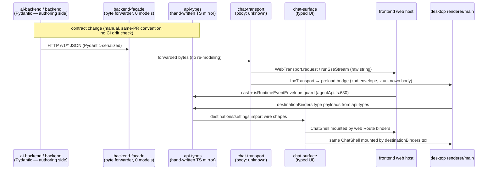

# Flow: Contract & type propagation (SSOT audit)

## Overview — what this flow does, its entry and exit points

This flow traces how every app-facing payload shape travels from its producer to its consumers:

**Pydantic (Python producers)** → **facade (byte-forwarder)** → **`packages/api-types` (hand-written TS mirror)** → **`packages/chat-transport` (untyped envelope carrier)** → **`packages/chat-surface` (typed UI, imports api-types)** → **host apps** (`apps/frontend` web binders; `apps/desktop` renderer binders over Electron IPC).

Entry points are the schema modules of the two producing services — `services/ai-backend/src/runtime_api/schemas/*` (conversations, runs, events, approvals, drafts, inbox-stream, local models, workspace) and `services/backend/src/backend_app/*/` per-domain contract models (MCP `contracts.py`, provider keys `store.py`, settings, todos, identity). Exit points are the React surfaces in `chat-surface` and the two host apps.

**Authoring direction (verified):** the server is the declared source of truth and **nothing is generated**. `packages/api-types/CLAUDE.md` ("Server is the source of truth — types here mirror what the server actually serves") and `packages/api-types/SPEC.md:76-78` ("If OpenAPI or another contract generator becomes canonical…") confirm the mirror is 100% hand-maintained — **9,231 LOC of hand-written TS across 20+ files** (3,978 LOC in `index.ts` alone). **No CI job diffs the TS mirror against the Pydantic source**: `.github/workflows/ci-frontend.yml:49` only runs `tsc` on the package; the only cross-language contract checks in CI are `tools/check_route_scopes.py` (RBAC annotations, not payload shapes, `.github/workflows/ci-ai-backend.yml:63`) and api-types' own vitest value/type-consistency tests. Note the root `CLAUDE.md` calls this layer "generated contracts (`packages/api-types`)" — it is not generated; the package's own docs are correct and the root doc is misleading.

The mirror discipline is currently *holding* for the core enums — a scripted diff of `RuntimeApiEventType` found 44/44 values identical between `runtime_api/schemas/common.py` and `api-types/index.ts`, and `AgentRunStatus` (8) and `RuntimeActivityKind` (11) also match — but it is enforced only by review habit, and it has **already failed** where review lapsed (the `_*-stub.ts` island, Finding 1).

## End-to-end trace — numbered steps

1. **[ai-runtime-api]** Pydantic contracts are authored as `StrEnum`s + `RuntimeContract` models: `AgentRunStatus` (`services/ai-backend/src/runtime_api/schemas/common.py:34`), `RuntimeActivityKind` (`common.py:63`), `RuntimeApiEventType` (`common.py:81` ff., 44 values), `RuntimeEventEnvelope` (`services/ai-backend/src/runtime_api/schemas/events.py:1065`), local models (`schemas/local_models.py:22-69`). Backend-owned domains do the same in `services/backend/src/backend_app/contracts.py` (MCP enums at :148-175, `McpServerRecord` :257, catalog/install shapes :571-640), `provider_keys/store.py:32-40` (`ProviderName`), `todos/store.py:71-81`, `settings/*`.
2. **[backend-facade]** The facade forwards bytes without re-modeling: `settings_routes.py` docstring "thin authenticator + forwarder" and **zero** `BaseModel` response classes across sampled route files (`settings_routes.py`, `me_routes.py`, `auth_routes.py`, `home_routes.py`, `inbox_routes.py`, `agents_routes.py` — all grep-count 0). So each public payload legitimately exists in exactly two authored places: producer Pydantic and the TS mirror.
3. **[shared-packages/api-types]** Hand-written TS mirrors: `RuntimeEventEnvelope` (`packages/api-types/src/index.ts:1379-1404`, ~24 fields), `RuntimeActivityKind`/`RuntimeApiEventType` unions (`index.ts:232`, `:253` ff.) plus runtime-enumerable `as const` tuples (`index.ts:357-369`) and guards (`isRuntimeEventEnvelope` `index.ts:2369`, `isRuntimeActivityKind` `index.ts:2571`). Domain files mirror per-destination contracts (`activity.ts`, `todos.ts`, `inbox.ts`, `settings.ts`, `providerKeys.ts:32-36`, `siwe.ts`, `localModels.ts:1-30` "Mirrors the ai-backend schemas…", `connectors.ts`, `connectors-desktop.ts`).
4. **[shared-packages/chat-transport]** The transport is deliberately payload-agnostic: `TypedRequest.body: unknown` (`packages/chat-transport/src/types.ts:5-13`), no dependency on api-types (`packages/chat-transport/package.json` deps = zod only). SSE is a bearer-carrying streaming-fetch reader (`src/web/sse.ts:28`) that hands the raw string up; the caller owns the reconnect cursor.
5. **[chat-surface-core]** `chat-surface` re-exports the transport port (`packages/chat-surface/src/ports/Transport.ts:1-11`) and consumes typed shapes directly from api-types (`package.json:19-20`; e.g. `ActivityDestination.tsx:29-41` imports `ActivityRunRow`; settings pages import provider-key shapes). One declaration site — clean.
6. **[frontend-web]** The web host constructs a singleton `WebTransport` (`apps/frontend/src/api/transport.ts:16-19`) and its api modules import contract types from api-types (`apps/frontend/src/api/agentApi.ts:1-30`); SSE frames are validated at the edge with `isRuntimeEventEnvelope` and malformed frames surface as typed protocol errors (`agentApi.ts:630-646`). **Exception:** the six folded-destination api modules still import local `_*-stub.ts` contract copies instead of api-types (Finding 1).
7. **[desktop-app]** The Electron renderer constructs `IpcTransport` (`apps/desktop/renderer/bootstrap.tsx:32,118`); requests cross IPC as zod-validated envelopes with `body: z.unknown()` (`packages/chat-transport/src/ipc/rpc-protocol.ts:73-88`). The channel allowlist `CHANNELS` is a genuine SSOT — preload (`apps/desktop/preload/bridge.ts:3`), main (`apps/desktop/main/ipc/handlers.ts:31,144`) and renderer all import it — extended by two documented app-local sets (`bridge.ts:16-22`: `isCapabilityChannel`, `isConnectorChannel`). Boot status crossing main→renderer is zod-schema'd in the same file (`rpc-protocol.ts:201-209`). The renderer binders type their payloads from api-types (`apps/desktop/renderer/destinationBinders.tsx:14-18` "wire types from `@0x-copilot/api-types`; no `apps/*` import").
8. **[desktop-app → services]** A second, unversioned contract rides the boot path: `apps/desktop/main/services/service-env.ts:154-237` sets ~20 env names (`ENTERPRISE_DEPLOYMENT_PROFILE`, `ENTERPRISE_AUTH_SECRET`, `RUNTIME_STORE_BACKEND`, `MCP_BACKEND_REGISTRY_URL`, `SIWE_ORIGIN`, …) as string literals that must match each Python service's settings loader. `packages/service-contracts` holds the Python-side names but is unreachable from TS. The `BACKEND_BASE_URL` omission that broke BYOK runs end-to-end (fixed in commit `bcc65dbb`) is this contract failing in production.
9. **[backend-identity ↔ frontend-web ↔ desktop-app]** The SIWE EIP-4361 message template — a byte-exact wire contract — is maintained in **three** places: `services/backend/src/backend_app/identity/siwe.py:291`, `apps/frontend/src/features/auth/siweMessage.ts:31`, and `apps/desktop/main/auth/local-login.ts:79`. Root `CLAUDE.md` documents only two.
10. **[cross-service Python]** `packages/service-contracts` (constants-only) is the one shared Python contract package: deployment profile values/toggle keys (`deployment_profile.py:14-63`), internal header names (`headers.py`), RBAC scope catalog (`scopes.py`). Each service then re-implements a ~200-line profile→toggles **loader** ("The same module exists (with identical surface) in each of the three Python services" — `services/backend-facade/src/backend_facade/deployment_profile.py:7-9`; also `services/backend/src/backend_app/deployment_profile.py` (196 LOC), `services/ai-backend/src/agent_runtime/deployment/profile.py` (215 LOC)).
11. **[shared-packages/adapter-allowlist — the good pattern]** The tier-2 adapter sandbox constraints live in ONE JSON file (`packages/service-contracts/src/copilot_service_contracts/adapter_allowlist.json`) loaded by Python via `importlib.resources` (`adapter_allowlist.py:30-37`) and by TS via a direct relative import (`packages/api-types/src/adapterAllowlist.ts:10`). One fact, two thin loaders — the model the rest of the flow lacks.
12. **[shared-packages/audit-chain]** The HMAC chain primitive was properly consolidated: the legacy ai-backend copy was deleted and `copilot_audit_chain` became the single home, with byte-compat signature fixtures guarding history (`services/ai-backend/tests/unit/agent_runtime/observability/test_audit_chain_compat.py:1-16`). Note: the package is Python-only (`git ls-files packages/audit-chain` = 5 Python files); root `CLAUDE.md`'s "shared Python + TS" is aspirational.

## Sequence diagram

## Contracts involved

| Contract | Producer definition | TS mirror(s) | Extra hand copies | SSOT verdict |
|---|---|---|---|---|
| Run/event enums (`AgentRunStatus` 8, `RuntimeActivityKind` 11, `RuntimeApiEventType` 44) | `runtime_api/schemas/common.py:34,63,81` | `api-types/index.ts:210-375` (union + `as const` tuple) | — | Hand-mirrored; verified in sync today; no automation |
| `RuntimeEventEnvelope` (~24 fields) | `runtime_api/schemas/events.py:1065` | `api-types/index.ts:1379-1404` + guard `:2369` | — | Hand-mirrored |
| SIWE EIP-4361 message template | `backend_app/identity/siwe.py:291` (re-parses) | `apps/frontend/src/features/auth/siweMessage.ts:31` | **3rd copy** `apps/desktop/main/auth/local-login.ts:79` | Triplicated byte-contract; docs say 2 |
| SIWE wire shapes / error details | `identity/siwe.py` | `api-types/siwe.ts` (incl. `SiweVerifyErrorDetail` string union) | — | Hand-mirrored |
| Deployment profile values + toggles | `service-contracts/deployment_profile.py:14-63` | UI profile is a distinct 2-value type `"single_user_desktop" \| "team"` (`chat-surface/src/providers/DeploymentProfileProvider.tsx:15`) — `"team"` is not a backend profile; mapped from `VITE_DEPLOYMENT_PROFILE` at `apps/frontend/src/app/App.tsx:286-290` and pinned in `apps/desktop/renderer/bootstrap.tsx:77` | loader logic ×3 services (196/230/215 LOC) | Constants shared (py), loader triplicated, TS value re-hardcoded |
| MCP enums (`McpTransport`/`McpAuthMode`/`McpAuthState`/`McpServerHealth`) | `backend_app/contracts.py:148-175` | `api-types/index.ts:16-28` | **3rd copy** `ai-backend/agent_runtime/capabilities/mcp/cards.py:45-79` (internal `/internal/v1` consumer) | Triplicated |
| MCP server/card/catalog payloads | `backend_app/contracts.py:257-640` | `api-types/index.ts` (`McpServer` :30 ff.) | `McpServerCard` mirror `mcp/cards.py:119` | Hand-mirrored ×3 |
| BYOK provider slugs | `provider_keys/store.py:32-40` + DB CHECK (migrations 0034/0036) | `api-types/providerKeys.ts:32-36` | display catalog + hardcoded model lists `chat-surface/src/settings/data/providerKeys.ts:63-91` | 4 places |
| Model catalogs (ids/labels) | `ai-backend/agent_runtime/api/model_catalog.py:46-122` | — | `apps/desktop/renderer/composer/desktopModelCatalog.ts:32-42`, `chat-surface/src/composer/ModelPicker.tsx:35`, `apps/frontend/src/features/chat/ChatScreen.tsx:2561-2574`, `backend_app/agents/service.py:66`, `chat-surface/settings/data/providerKeys.ts:63-91` | ≥6 divergent hardcoded lists |
| Todos wire shape | `backend_app/todos/store.py:71-81` (`status`, `parent_id`, `recurrence`) | `api-types/todos.ts:114-134` (matches server) | **drifted stub** `apps/frontend/src/api/_todos-stub.ts:58-78` (`done: boolean`, no recurrence) — consumed by dead `TodosRoute.tsx:82` which also sends unrecognized `filter[done]` (`todosApi.ts:211`) vs server's `filter[status]` (`todos/routes.py:165`) | Violated (stub island) |
| Home/Inbox/Library/Routines/Agents contracts | backend per-domain modules | `api-types/{home,inbox,library,routines,agents}.ts` | 6 `_*-stub.ts` copies in `apps/frontend/src/api/` — each headed "TODO(merge): delete this file"; `_home-stub.ts` is fully dead; the other 5 are consumed only by unmounted legacy routes | Violated (stub island) |
| Local-models shapes | `runtime_api/schemas/local_models.py:22-69` | `api-types/localModels.ts` (header cites the mirror) | — | Hand-mirrored |
| Settings JSONB namespaces | `backend_app/settings/{service,store}.py` | `api-types/settings.ts` | — | Hand-mirrored |
| Error shape | FastAPI `{"detail": ...}`; `runtime_api/schemas/errors.py:22` adds `details` object | parsed by convention in `apps/frontend/src/api/http.ts:47-70` (`parseErrorMessage`) | MCP "setup required" classified by **regex on the human message** `apps/frontend/src/api/mcpErrors.ts:11-12` | No typed error-code contract |
| IPC channel allowlist + envelopes | `chat-transport/src/ipc/rpc-protocol.ts:5-60` (both sides import) | — | app-local extensions `apps/desktop/main/{capabilities,connectors}/channels.ts` composed in `preload/bridge.ts:16-22`; `WindowBridge` interface declared 2× (`preload/window-bridge-types.ts:5-9` untyped `string` channels vs `chat-transport/src/ipc/window-bridge.ts:13-18` typed `ChannelName`) | Mostly SSOT; bridge iface duplicated |
| Desktop→services env contract | Python settings loaders per service | — | string literals `apps/desktop/main/services/service-env.ts:154-237` | No shared registry; proven failure (`BACKEND_BASE_URL`, fixed bcc65dbb) |
| Internal headers / RBAC scopes | `service-contracts/{headers,scopes}.py` | apps never send `x-enterprise-*` (verified: zero TS matches) — facade adds them; scope strings appear in `meApi.ts`/`workspaceMfaApi.ts` only as display | — | Good (Python SSOT + CI `check_route_scopes.py`) |
| Adapter allowlist | `service-contracts/.../adapter_allowlist.json` | `api-types/adapterAllowlist.ts:10` imports the same JSON | — | **Genuine SSOT** (model pattern) |
| Audit-chain signing | `packages/audit-chain` (`copilot_audit_chain`) | none (docs claim TS exists) | compat fixtures pin the legacy byte format | Consolidated; docs stale |
| Dev personas | `backend_app/dev_idp/personas.py` (YAML fixture, served via `GET /v1/dev/personas`) | frontend fetches the list (`devIdpApi.ts:43-47`) | default slug `"sarah_acme"` hardcoded ×4 (`frontend devIdp.ts:14`, `desktop main/index.ts:497`, `desktop oidc-client.ts:56`, `Makefile:122`) | Good (catalog); default-slug literal ×4 |

## Failure modes

- **Drift is silent until runtime.** With no generated types and no CI diff, a Pydantic change that misses the same-PR api-types update ships a stale mirror; TS still compiles. The only runtime tripwires are the SSE-edge guards (`isRuntimeEventEnvelope` — unknown envelope → `RuntimeStreamProtocolError("invalid_envelope")`, `agentApi.ts:638-646`), which cover the event stream only; plain REST payloads are cast, not validated.
- **The stub island shows the end-state of un-policed mirrors.** `_todos-stub.Todo` (`done: boolean`) vs server `status` field; `TodosRoute.tsx:82` reads `t.done` (always `undefined`) and `todosApi.ts:211` sends `filter[done]` the server never reads (`todos/routes.py:165` parses `filter[status]`). Harm is currently contained only because the entire island is unmounted (routes.ts:19-21 folds those destinations; no live importer of the 6 Route components — verified by import grep).
- **SIWE template drift = login outage.** The backend re-parses the signed text and rejects any byte difference (`siweMessage.ts` header: "rejects any drift (whitespace, field order, casing)"). Three hand-synced copies mean a wording tweak in one place bricks wallet login on the other surface; only frontend↔backend have a shared fixture test, the desktop copy has its own local test but no cross-copy fixture.
- **Env-contract drift = desktop boot/runtime breakage.** `service-env.ts` literals vs Python loaders already produced the shipped BYOK breakage (`BACKEND_BASE_URL` unset → Null policies resolver; fixed bcc65dbb). Nothing prevents a recurrence when a service adds a required env var.
- **Error handling is convention, not contract.** FE parses `{"detail"}` by shape-sniffing (`http.ts:60-70`, non-JSON bodies fall through verbatim) and classifies MCP OAuth-setup failures by regexing prose (`mcpErrors.ts:11-12`) — a backend copy-edit of the error message breaks the "Setup required" CTA silently.
- **Enum additions are one-directionally safe only.** api-types documents "new enum values on a payload the server already tolerates are non-breaking" — but TS narrowing on the *closed* unions (e.g. `RuntimeApiEventType`) means a server-added event type arrives as a value outside the union; the SSE guard admits the envelope (event_type checked? — the guard checks `activity_kind` membership at `index.ts:2369`), so unknown event types flow to reducers that must default-handle them.
- **IPC failure paths are explicit**: preload rejects non-allowlisted channels (`bridge.ts:49-58`); malformed IPC params fail zod validation in main handlers; stateful channels replay the latest boot/update snapshot to late-attaching renderers (`bridge.ts:26-45`) — a deliberate fix for the boot-status race.

## Findings

1. **[ssot-violation / dead-code, HIGH]** Six `_*-stub.ts` contract copies in `apps/frontend/src/api/` were never rewired to api-types ("TODO(merge): delete this file" in each header) and have materially drifted — `_todos-stub.ts:58-78` models `done: boolean` while the server (`backend_app/todos/store.py:71`) and canonical `api-types/todos.ts:114-134` use `status` + recurrence/subtask fields; `_home-stub.ts:71-78` `AgentActivityKind` shares zero values with canonical `HomeActivityKind` (`api-types/home.ts:178-186`). The whole consuming island — `{Home,Todos,Inbox,Library,Routines,Agents}Route` + their api modules — is dead (no importer outside itself; `routes.ts:19-21` folds those slugs), so this is ~simultaneously the repo's largest contract-drift instance and a large dead-code cluster. Delete the island + stubs, or remount on api-types.
2. **[ssot-violation, HIGH]** The SIWE EIP-4361 byte-exact template exists in **three** hand-synced copies — `backend_app/identity/siwe.py:291`, `apps/frontend/src/features/auth/siweMessage.ts:31`, `apps/desktop/main/auth/local-login.ts:79` — while root `CLAUDE.md` documents two. A drift bricks wallet login. Minimum fix: document the third copy + a shared cross-copy fixture; better: serve the template/params from the backend nonce response.
3. **[ssot-violation, HIGH]** ≥6 divergent hardcoded model catalogs: `agent_runtime/api/model_catalog.py:46-122`, `desktopModelCatalog.ts:32-42`, `ModelPicker.tsx:35`, `ChatScreen.tsx:2561-2574`, `backend agents/service.py:66` (default `anthropic:claude-sonnet-4-7-1m`), `chat-surface/settings/data/providerKeys.ts:63-91`. Confirms the first-run-review finding; the decided models.dev-catalog direction would collapse these into one server-served catalog.
4. **[ssot-violation / risk, MEDIUM]** The entire public wire contract (9,231 LOC TS mirroring Pydantic) is hand-synchronized with zero automated drift detection; core enums verified in sync today (44/44 event types) but nothing but reviewer discipline keeps them so; root `CLAUDE.md` incorrectly calls the package "generated". Cheapest guard: a CI script that exports the Pydantic enums/field lists (e.g. from FastAPI's openapi.json) and diffs them against api-types' `as const` tuples.
5. **[duplication, MEDIUM]** MCP enums + card shapes are triplicated across `backend_app/contracts.py:148-175`, `agent_runtime/capabilities/mcp/cards.py:45-119` (internal-consumer mirror), and `api-types/index.ts:16-28`. The internal `/internal/v1` MCP contract has no shared constants module even though `service-contracts` exists for exactly this.
6. **[duplication, MEDIUM]** The ~200-LOC deployment-profile loader (profile→toggles derivation) is triplicated per service (196/230/215 LOC; self-documented at `backend_facade/deployment_profile.py:7-9`). The constants-only rule pushes *behavior* duplication; the toggle-derivation table itself is a fact that could live as data in `service-contracts` (like `adapter_allowlist.json`) with per-service thin loaders.
7. **[risk, MEDIUM]** Desktop→services env contract is ~20 string literals in `service-env.ts:154-237` with no shared name registry reachable from TS; the pattern already shipped one breakage (`BACKEND_BASE_URL`, fixed bcc65dbb). A JSON env-name manifest in `service-contracts` (consumable from TS like the adapter allowlist) would make omissions lint-detectable.
8. **[bespoke-replaceable / risk, MEDIUM]** Error contracts are prose, not codes: `http.ts:47-70` shape-sniffs `{"detail"}`; `mcpErrors.ts:11-12` regexes the backend's human-readable message to detect "OAuth setup required". A machine-readable `code` field (the backend already has structured `ErrorResponse.details`, `runtime_api/schemas/errors.py:22`) would remove the regex coupling.
9. **[duplication, LOW]** `WindowBridge` interface declared twice — `apps/desktop/preload/window-bridge-types.ts:5-9` (loose `string` channels) and `chat-transport/src/ipc/window-bridge.ts:13-18` (typed `ChannelName`); the preload should import the canonical one. Also `rpc-protocol.ts:5` claims "there is no other source" for channels while `preload/bridge.ts:16-22` composes two app-local channel sets — stale comment, though the composition itself is documented and sound.
10. **[inconsistency, LOW]** Docs-vs-code: root `CLAUDE.md` describes `packages/audit-chain` as "shared Python + TS" — the package contains only Python (5 files); and calls api-types "generated contracts". Both mislead refactorers about what safety nets exist.
11. **[inconsistency, LOW]** Default persona slug `"sarah_acme"` hardcoded ×4 (`frontend devIdp.ts:14`, `desktop main/index.ts:497`, `desktop oidc-client.ts:56`, `Makefile:122`); the persona *catalog* itself is properly served from the backend YAML (`dev_idp/personas.py`). Dev-only blast radius.
12. **Positive patterns worth propagating:** the adapter allowlist (one JSON, two thin loaders — `adapterAllowlist.ts:10`, `adapter_allowlist.py:30-37`); the IPC channel allowlist SSOT with zod envelopes; audit-chain consolidation with byte-compat fixtures; personas served not mirrored; the facade's zero-model byte-forwarding; SSE-edge envelope guards; RBAC scope catalog + `check_route_scopes.py` CI enforcement.
