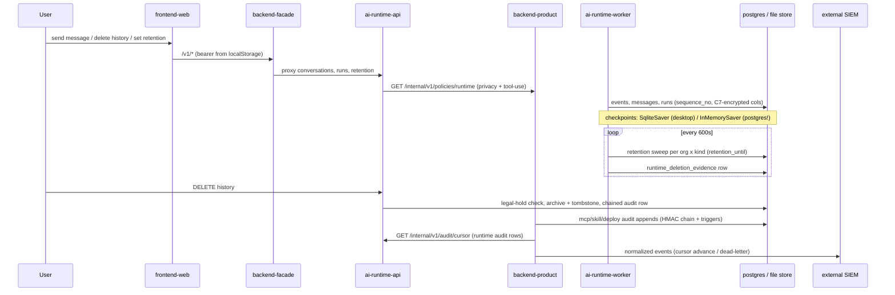

# Flow: Data at rest, retention & audit trail

## Overview — what this flow does, its entry and exit points

This flow inventories every durable (and supposedly-durable) store in the platform, who writes and reads each, and how data leaves them: retention sweeps, user-initiated deletion, legal holds, and tamper-evident audit export to SIEM.

**Entry points:** user actions (send message, delete conversation, "delete my history", set retention policy, privacy panel `retention_days`, install MCP server, save BYOK key), plus background writers (runtime worker persisting events, usage rollups, audit appends).
**Exit points:** retention sweeper hard-deletes + `runtime_deletion_evidence` rows, physical session erasure on desktop, SIEM export pump pushing normalized audit events to a customer collector, conversation export archives, and CSV audit export routes.

### Store inventory (verified)

| # | Store | Location | Writers | Readers | Encrypted at rest? |
|---|-------|----------|---------|---------|--------------------|
| 1 | backend Postgres | `services/backend/migrations/0001..0036` via yoyo (`services/backend/src/backend_app/db/migrate.py:26-56`, `MANIFEST.lock` checksummed) | `Postgres*Store` classes in `backend_app` (identity, sessions, oidc, saml, scim, mfa, lockout, invitations, me/avatars, settings, privacy, tool-use policies, api keys, provider keys, mcp, skills, siwe, adapter registry) | same stores; `audit_reader.py`; SIEM pump | Token/provider-key columns via TokenVault; rest plaintext |
| 2 | backend **in-memory-only** product stores | `backend_app/{todos,memory,library,inbox,palette,routines,webhooks,agents,tools,connectors,projects,team}/store.py` | product routes/services | same | n/a — **volatile**; each ships a `schema.sql` that nothing applies |
| 3 | ai-backend Postgres | `services/ai-backend/migrations/0001..0032` via own yoyo runner (`agent_runtime/persistence/schema/migrate.py:28-30`) | `runtime_adapters/postgres/*` (conversations, messages, runs, events, outbox, approvals+batches, audit log, drafts, citations, shares, usage, budgets, retention policies) | runtime_api, worker, SIEM cursor route | C7 envelope AES-256-GCM per column (`agent_runtime/persistence/encryption.py:1-23`, migration `0011_field_encryption.sql`) |
| 4 | ai-backend file store (desktop) | `<userData>/agent-data/v1` — `workspaces/<ws>/sessions/<conv>/{conversation.json,events.jsonl,messages.jsonl,runs.jsonl,subagents/}`, `state/<table>.jsonl`, `objects/sha256/`, `index/catalog.sqlite3` (`runtime_adapters/file/_paths.py:9-23`) | `FileRuntimeApiStore` (single-writer, fsync) | same + Deep Agents composite backends | **Plaintext JSONL by design** (`file/runtime_api_store.py:5`); 0700/0600 perms, OS user = tenant boundary |
| 5 | LangGraph checkpoints | desktop: `index/checkpoints.sqlite3` `AsyncSqliteSaver` (`agent_runtime/execution/deep_agent_builder.py:339-349`); **postgres/web: process-local `InMemorySaver`** (`deep_agent_builder.py:301-310`) | LangGraph | LangGraph resume | No |
| 6 | Token vault | `backend_app/token_vault.py` — `LocalTokenVault` (Fernet, legacy-XOR read fallback) / `AwsKmsTokenVault` (`kms_v1:` envelope); ciphertext in `mcp_auth_connections`, `provider_api_keys` (+ `kms_key_id`, migration 0013) | mcp_oauth, provider_keys service | same | Yes (Fernet or KMS envelope) |
| 7 | Audit chains | backend: `mcp_audit_events`, `skill_audit_events`, `deploy_audit_events` (HMAC chained, `store.py:658-710`), `identity_audit_events` (**unchained**, `identity/store.py:1266-1290`); ai-backend: `runtime_audit_log` (chained); desktop file store: signed manifest (`runtime_adapters/file/_audit_manifest.py:1-25`) — all on `packages/audit-chain` (`copilot_audit_chain/signer.py`) | audit-emitting services | `audit_reader.py`, `routes/audit_list.py`, `routes/audit_export.py`, SIEM pump | Chain HMAC; runtime metadata columns C7-encrypted |
| 8 | Desktop userData | `<userData>/pgdata` embedded Postgres (`apps/desktop/main/services/desktop-supervisor.ts:99`), `<userData>/logs/*.log` rotating, `<userData>/secrets/boot-env.bin` (safeStorage-encrypted, plaintext-marker fallback, `boot-secrets.ts:44-47`), `<userData>/agent-data/v1` (`service-env.ts:91-116,205`) | supervisor + services | services | pg: password auth; secrets: OS keychain when available |
| 9 | Browser localStorage | `enterprise.auth.bearer`, `enterprise.dev.persona_slug` (`apps/frontend/src/features/auth/storageKeys.ts:6-7`), `enterprise.discoverable.*`, chat-depth/pinned-conversation KV; desktop renderer uses the same `LocalStorageKeyValueStore` (`apps/desktop/renderer/bootstrap.tsx:81`) | frontend/chat-surface via `KeyValueStore` port | same | No (bearer token in localStorage) |

`backend-facade` is stateless — no DB imports (`apps/desktop/main/services/migrations.ts:4` "Facade is stateless"; no psycopg in `backend_facade`).

## End-to-end trace — numbered steps

1. **[desktop-app]** Supervised boot generates once-only secrets (pg password, `ENTERPRISE_AUTH_SECRET`, `MCP_TOKEN_VAULT_SECRET`, `AUDIT_HMAC_KEY`) into `<userData>/secrets/boot-env.bin` via safeStorage (`apps/desktop/main/services/boot-secrets.ts:11-27`), initdb's `<userData>/pgdata` (`apps/desktop/main/services/postgres.ts:156-180`), then runs each stateful service's `scripts/migrate.py` gate (`apps/desktop/main/services/desktop-supervisor.ts:117-133`), skipping ai-backend when the file store flag is on.
2. **[backend-product]** Backend schema is applied by the yoyo `MigrationRunner` from `services/backend/migrations/` with `MANIFEST.lock` checksum enforcement (`services/backend/src/backend_app/db/migrate.py:26-56,98-115`); prod sets `BACKEND_MIGRATIONS_AUTO_APPLY=false` and migrates as a deploy step.
3. **[ai-runtime-persistence]** ai-backend applies its own parallel yoyo runner over `services/ai-backend/migrations/` (`agent_runtime/persistence/schema/migrate.py:28-56`); the 19 initial tables are enumerated in `agent_runtime/persistence/schema/postgres.py:19-39`.
4. **[ai-runtime-worker]** During a run, the worker persists messages/runs/events through the `PersistencePort`; events land in `runtime_events` with monotonic `sequence_no` and outbox rows in `runtime_outbox_events` (schema `migrations/0001_initial_runtime_persistence.sql`). On the postgres adapter, PII columns are envelope-encrypted with AAD bound to `(table, column, org_id)` (`agent_runtime/persistence/encryption.py:8-15`).
5. **[ai-runtime-execution]** Graph state checkpoints: on desktop file store the shared singleton is a durable `AsyncSqliteSaver` at `<file-store>/index/checkpoints.sqlite3`; on postgres/in-memory/web it is a **process-local `InMemorySaver`** (`agent_runtime/execution/deep_agent_builder.py:301-310`) — the `runtime_checkpoints` table is never written (no `INSERT INTO runtime_checkpoints` anywhere in `services/ai-backend/src`).
6. **[ai-runtime-api → backend-product]** At run start, ai-backend fetches the aggregate policy snapshot `GET /internal/v1/policies/runtime` — tool-use + privacy (incl. `retention_days`) composed in one call (`services/backend/src/backend_app/routes/runtime_policies.py:1-21`).
7. **[backend-product]** Privacy panel writes `privacy_settings.retention_days` (`backend_app/privacy/store.py:206-256`; migration `0022_privacy_settings.sql`). The ai-backend hook for it — `RetentionPolicyResolver(privacy_user_retention_days=...)` (`agent_runtime/retention/policy_resolver.py:59,89`) — has **zero callers**; see Findings.
8. **[ai-runtime-worker]** `RetentionSweeperLoop` runs every 600s per org × kind over {context_payloads, checkpoints, messages, events, memory_items} + tombstoned variants (`runtime_worker/jobs/retention_sweeper.py:80-90,193-216`), resolving TTLs org-policy > deployment default (`retention_sweeper.py:200-204`). Postgres sweeps by `retention_until` chunked CTE (`0030_retention_until_columns.sql`); each non-empty pass writes `runtime_deletion_evidence` (`agent_runtime/persistence/records/retention.py:75-93`).
9. **[ai-runtime-persistence]** File-store retention: only `RetentionKind.MESSAGES` triggers session-folder reaping — "every other kind is subsumed by session deletion and returns an empty tally" (`runtime_adapters/file/runtime_api_store.py:2666-2679`); a second, independent whole-store `RUNTIME_FILE_STORE_RETENTION_DAYS` gate also purges old sessions (`file/runtime_api_store.py:1997-2027`, `runtime_adapters/factory.py:90`).
10. **[ai-runtime-api]** User deletion: `soft_delete_conversation` stamps `deleted_at` (`runtime_adapters/postgres/runtime_api_store.py:933-957`), with `retention_until` scheduling from the conversation coordinator (`agent_runtime/api/conversation_coordinator.py:319-352`). `delete_user_history` archives conversations, tombstones message text (`content_text='[deleted by user request]'`), cancels live runs, **retains events as evidence**, and appends a chained + encrypted `runtime_audit_log` row in the same transaction (`runtime_adapters/postgres/runtime_api_store.py:2078-2231`). A legal-hold row blocks it (`:2096-2122`, TOCTOU acknowledged at `:2087-2090`).
11. **[ai-runtime-persistence]** Desktop physical purge: `SessionEraser` containment-verifies every planned path under the tenant's `sessions/` root before `shutil.rmtree` (`runtime_adapters/file/_deletion.py:148-185`); `ObjectReachabilityScanner` GCs blobs that became unreferenced (`_deletion.py:66-145`); `LegalHoldPolicy` skips conversations with `metadata["legal_hold"]` (`_deletion.py:47-63`). The purge is recorded in the signed manifest chain (`file/_audit_manifest.py:1-25`).
12. **[backend-product]** Audit appends: MCP/skill/deploy events are HMAC-chained per `(table, org_id)` under an advisory lock (`backend_app/store.py:337-350,658-710`), immutable via `audit_writer` role + BEFORE UPDATE/DELETE triggers (`migrations/0002_audit_hardening.sql:29-67`); ai-backend mirrors this for `runtime_audit_log` (`migrations/0003_audit_hardening.sql:17-47`). `identity_audit_events` is append-only **at the repo layer only** — no chain columns, no trigger (`migrations/0004_identity_foundation.sql:116-136`).
13. **[backend-platform]** Read + export: `AuditReader.list` fans out across the four streams with an opaque merged cursor (`backend_app/audit_reader.py:1-24`); the SIEM pump loops per source per exporter with cursor rows in `siem_export_cursors`, reading backend tables directly and the runtime audit chain via `GET /internal/v1/audit/cursor` on ai-backend — never touching its DB (`backend_app/siem_export/pump.py:1-15`; route ref `runtime_api/auth.py:45`).
14. **[frontend-web / desktop-app]** Client persistence: the session bearer and persona slug live in localStorage (`apps/frontend/src/features/auth/storageKeys.ts:6-7`); chat-surface components only touch storage via the `KeyValueStore` port (`packages/chat-surface/src/ports/KeyValueStore.ts:1`), which both hosts bind to localStorage (`apps/desktop/renderer/bootstrap.tsx:81`).
15. **[ai-runtime-persistence]** Export/backup: one conversation exports as a self-contained archive (session files byte-for-byte + only-referenced blobs + SHA-256 manifest, fail-closed import under a fresh id) (`runtime_adapters/file/export_import.py:1-31`); an offline CLI migrates Postgres history into the file store with verify-before-flip (`runtime_adapters/migrate.py:1-28`).

## Sequence diagram

## Contracts involved

| Contract | Producer side | Consumer side |
|----------|---------------|---------------|
| Backend schema | `services/backend/migrations/*.sql` + `MANIFEST.lock` (yoyo) | `backend_app/db/migrate.py`; legacy shim `backend_app/migrations.py:14-38` re-reads the same files |
| Runtime schema | `services/ai-backend/migrations/*.sql` + `MANIFEST.lock` | `agent_runtime/persistence/schema/migrate.py`; shim `schema/postgres.py:50-67` |
| Module `schema.sql` "mirrors" | `backend_app/*/schema.sql` (12 modules) | **nothing applies them** — hand-maintained docs that stores claim to mirror (`backend_app/memory/store.py:3`) |
| Retention records | `agent_runtime/persistence/records/retention.py:19-93` (`RetentionScope`, `RetentionKind`, policy/evidence records) | sweeper, postgres+file adapters, `runtime_api/http/retention_routes.py` |
| Runtime policy snapshot | `backend_app/routes/runtime_policies.py` (`RuntimePolicyResponse`) | ai-backend `PrivacySettingsSnapshot.from_response` (`agent_runtime/capabilities/tools/privacy.py:39-90`) |
| Audit chain envelope | `packages/audit-chain/src/copilot_audit_chain/signer.py:1-35` (canonical JSON + prev_hash HMAC) | `backend_app/store.py:13`, `runtime_adapters/{postgres,file,in_memory}/runtime_api_store.py`, `file/_audit_manifest.py` |
| Audit wire shape | `packages/api-types/src/index.ts:3135-3168` (`AuditStream`, `AuditChainView`, `AuditEvent`) | frontend Settings audit log; facade proxy |
| Vault ciphertext envelope | `backend_app/token_vault.py:42-45` (`kms_v1:` / Fernet prefixes) | rotation script, `key_id_for` reporting; `kms_key_id` column (migration 0013) |
| Field-encryption envelope | `agent_runtime/persistence/encryption.py:37-39` (`v1:` + AAD `(table,column,org_id)`) | postgres adapter codec; backfill job `runtime_worker/jobs/encrypt_existing_columns.py` |
| Boot secrets blob | `apps/desktop/main/services/boot-secrets.ts:44-47` (`ATLASBOOTv1:cipher|plaintext:` markers) | supervisor `buildServiceEnv` → service env vars |
| File-store layout | `runtime_adapters/file/_paths.py:9-23` (SHA-256 path keys) | store, deletion, export, subagent/large-result backends; checkpoint path duplicated by string in `deep_agent_builder.py:341-346` ("keep the two in sync") |
| localStorage keys | `apps/frontend/src/features/auth/storageKeys.ts` | AuthContext, dev persona mint |

## Failure modes — as implemented

- **Restart loses product data:** every backend product destination store defaults to in-memory (`backend_app/app.py:1555-1856`); a backend restart erases todos, memory items, library files, inbox, routines, webhooks, agents, tools state, project activity, and all their per-module audit records. No Postgres implementations exist in-repo despite docstrings claiming "the Postgres adapter (deployment-injected)" (`backend_app/tools/store.py:3-6`).
- **Worker restart loses graph state (web/postgres):** checkpointer is `InMemorySaver` outside the desktop file path (`deep_agent_builder.py:301-310`); approval continuation across a worker restart depends on state that doesn't survive it. `runtime_checkpoints` exists, gets swept (`postgres/runtime_api_store.py:3814,4047`), but has no writer.
- **Boot-secrets unreadable:** fail-closed with explicit refusal to regenerate (would orphan pgdata) (`boot-secrets.ts:31-42`); safeStorage-unavailable hosts fall back to a plaintext-marked blob.
- **Migration drift:** `MANIFEST.lock` mismatch raises `MigrationManifestError` in both services; desktop `MigrationsFailed` carries the child's output tail (`apps/desktop/main/services/migrations.ts:10-28`).
- **Deletion under legal hold:** postgres path 409s (`postgres/runtime_api_store.py:2116-2122`) with an acknowledged TOCTOU race (`:2087-2090`); file path skips held sessions. But no code path ever *creates* a hold (no INSERT into `runtime_legal_holds`, no setter for the metadata flag).
- **Deletion plan escape:** any planned session path outside the tenant `sessions/` root aborts the entire purge batch (`file/_deletion.py:38-44,159-176`).
- **Sweep failure:** sweeper catches all exceptions and logs `retention_sweep_failed`, retrying next interval (`retention_sweeper.py:190-191`); dry-run uses force-rollback transactions.
- **SIEM outages:** 2xx advances the cursor, 4xx dead-letters + advances, 5xx/transport backs off exponentially without advancing (`siem_export/pump.py:5-10`).
- **Chain tampering:** verification reports first broken `seq`; pre-hardening rows have NULL signatures and are flagged invalid by design (`migrations/0002_audit_hardening.sql:3-7`).
- **File-store corruption:** JSONL corruption raises `JsonlCorruptionError` with repair machinery (`runtime_adapters/file/repair.py`); the catalog index is disposable and rebuilt on open; import verifies every SHA-256 before materialising anything (`export_import.py:24-28`).
- **Vault decrypt failure:** unknown ciphertext envelope raises `CiphertextFormatError`; legacy XOR tokens transparently decrypted on read (`token_vault.py:104-113`).

## Findings

### F1 (high / high) risk — Backend product destinations are in-memory only; their schema.sql files are applied by nothing

`todos, memory, library, inbox, palette, routines, webhooks, agents, tools, connectors, projects, team` have only `InMemory*Store` implementations; `create_app` defaults to them (`services/backend/src/backend_app/app.py:1555-1856`). Each module ships a `schema.sql` no runner ever reads (not in `migrations/`, no `read_text` call anywhere). All product data **and each module's audit records** (`TodoAuditRecord`, `MemoryAuditRecord`, `LibraryAuditRecord`, ...) vanish on process restart — including on the packaged desktop, which supervises this same backend. `0032_todos.sql` even creates real todos tables that no store reads. Remediation: pick the 3-4 destinations that matter, write Postgres adapters against the already-written schema.sql, and delete the rest.

### F2 (high / high) risk — Privacy `retention_days` is a dead end: the resolver hook has zero callers

`RetentionPolicyResolver.privacy_user_retention_days` (`services/ai-backend/src/agent_runtime/retention/policy_resolver.py:59,89`) is never passed at any of the seven construction sites (`retention_sweeper.py:200`, `retention_backfill.py:90`, `retention_routes.py:81,161`, `conversation_coordinator.py:713`, `workspace_defaults_service.py:212`, `postgres/runtime_api_store.py:5568`). Three docstrings claim the wiring exists (`backend_app/privacy/store.py:10-13`, `agent_runtime/capabilities/tools/privacy.py:39`, resolver's own). A user setting "auto-delete after N days" gets a stored row and a rendered UI value but no deletion behavior. Remediation: fetch per-user privacy overrides in `sweep_once` (the internal policy route already serves them) or remove the knob.

### F3 (high / high) dead-code — 10 of 19 initial runtime tables have no writer anywhere

`runtime_checkpoints, runtime_context_payloads, runtime_compression_events, runtime_capability_snapshots, runtime_async_tasks, runtime_subagent_results, runtime_memory_items, runtime_memory_scopes, runtime_tool_invocations, runtime_legal_holds` (`agent_runtime/persistence/schema/postgres.py:19-39`) have zero `INSERT` statements in `services/ai-backend/src` (verified per-table). The retention sweeper diligently sweeps three of these always-empty tables, C7 planned encrypted columns for five of them (`migrations/0011_field_encryption.sql:10-17`), and `list_retention_orgs` UNIONs over them (`postgres/runtime_api_store.py:3580`). The live data model converged on `runtime_events` as the log (e.g. `postgres/subagent_store.py:235` folds subagent state *from events*). Remediation: drop the dead tables in a migration or write the adapters that were intended to fill them; today the schema materially misrepresents what is persisted.

### F4 (high / medium) risk — On postgres deployments, LangGraph checkpoints live in `InMemorySaver`; approval/graph continuation does not survive a worker restart

`runtime_checkpointer` returns the file-backed `AsyncSqliteSaver` only when `RUNTIME_STORE_BACKEND=file`; "every other deployment (postgres, in-memory, web) keeps the process-local `InMemorySaver`" (`agent_runtime/execution/deep_agent_builder.py:301-310`). Combined with F3 (the `runtime_checkpoints` table is never written), the shared-store production-style path has durable events but volatile graph state. Remediation: adopt `langgraph.checkpoint.postgres.PostgresSaver` (library exists — bespoke-replaceable) or document the restart-behavior gap loudly.

### F5 (high / high) risk — Legal hold is checked everywhere and settable nowhere

`runtime_legal_holds` is SELECTed by `delete_user_history` (`postgres/runtime_api_store.py:2096-2122`) and the sweep paths, and the file store honors `metadata["legal_hold"]` (`file/_deletion.py:47-63`) — but no route, service, job, or script in any service inserts a hold row or sets the flag (repo-wide grep). For a compliance-marketed control (CLAUDE.md requires legal-hold tests), the enforcement gate is unreachable except by manual SQL. Remediation: add an admin hold API + audit event, or stop advertising the control.

### F6 (medium / high) inconsistency — `identity_audit_events` is the only unchained, untriggered audit stream

mcp/skill get chain columns + `audit_writer` role + BEFORE UPDATE/DELETE triggers (`services/backend/migrations/0002_audit_hardening.sql:8-67`); `runtime_audit_log` gets the same (`services/ai-backend/migrations/0003_audit_hardening.sql`). `identity_audit_events` — logins, role grants, SCIM — is "append-only at the repo layer" only (`migrations/0004_identity_foundation.sql:116-136`), with no seq/prev_hash/signature (`audit_reader.py:17-19` documents it; `api-types/src/index.ts:3145` makes chain fields nullable for it). The most security-sensitive stream has the weakest tamper evidence. Remediation: extend 0002's pattern to identity (and deploy) events.

### F7 (medium / high) risk — Desktop physical purge does not cascade to LangGraph checkpoints

`SessionEraser` removes session directories and the GC pass collects unreferenced blobs (`file/_deletion.py:148-185`), but `index/checkpoints.sqlite3` (`deep_agent_builder.py:339-349`) is outside the deletion plan and no code calls the checkpointer's `delete_thread` (repo-wide grep: zero hits). Checkpoint channel values contain full conversation state, so "delete my data literally" (`file/_deletion.py:3-5`) leaves message content on disk. Remediation: call `adelete_thread(conversation_id)` inside `_purge_conversations`.

### F8 (medium / high) risk — No retention or pruning path for outbox rows, approvals, or tool invocations

`RetentionKind` covers messages/events/context_payloads/checkpoints/memory_items only (`agent_runtime/persistence/records/retention.py:36-43`). `runtime_outbox_events` has no DELETE anywhere in `services/ai-backend/src`; `runtime_approval_requests` rows are expired by `approval_expiry_sweeper` (status flip) but never deleted; approval batches likewise. CLAUDE.md's own compliance checklist names "outbox rows … approvals, tool invocations" as retention-verification targets. Remediation: add outbox pruning after consumer-cursor advance and approval kinds to the sweeper.

### F9 (medium / high) ssot-violation — Schema is maintained in two places and already drifting

The applied truth is `migrations/`; the 12 per-module `schema.sql` files are hand-maintained mirrors ("Storage shape mirrors schema.sql", `backend_app/memory/store.py:3`) with no applier and stale cross-references — `backend_app/todos/store.py:4` cites `0033_todo_series.sql` while the real `0033` is `tenant_settings`. The legacy shims (`backend_app/migrations.py:14-38`, `agent_runtime/persistence/schema/postgres.py:50-67`) partially mitigate by re-reading canonical files, but the module schema.sql set has no such guard. Remediation: either promote each schema.sql into a numbered migration when its Postgres store lands (F1) or mark them as design docs and stop calling them schemas.

### F10 (low / high) duplication — The yoyo MigrationRunner is duplicated nearly line-for-line across services

`services/backend/src/backend_app/db/migrate.py` and `services/ai-backend/src/agent_runtime/persistence/schema/migrate.py` implement the same `MigrationRunner` (apply/rollback/status/lock), the same `MANIFEST.lock` parse/verify, and the same `render_manifest` helper. `packages/audit-chain` already establishes the pattern for extracting exactly this kind of cross-cutting primitive (its docstring: "Replaces the in-tree duplicates…", `copilot_audit_chain/signer.py:31-34`). Low urgency, mechanical extraction.

### F11 (low / high) inconsistency — `packages/audit-chain` is documented as "shared Python + TS" but contains no TypeScript

Root `CLAUDE.md` ("tamper-evident audit-chain primitives (shared Python + TS)") vs the package contents: Python only (`packages/audit-chain/src/copilot_audit_chain/`). The TS side is just nullable wire fields in `packages/api-types/src/index.ts:3144-3150` — no verifier, so the frontend cannot independently verify chains it renders. Fix the doc or ship the TS verifier.

### F12 (low / medium) risk — Session bearer persisted in localStorage

`enterprise.auth.bearer` (`apps/frontend/src/features/auth/storageKeys.ts:6`) is XSS-exfiltratable; httpOnly cookies would remove that class. Noted, not urgent for the current deployment profiles; the desktop renderer inherits the same pattern.

### F13 (low / medium) refactor — Two independent retention mechanisms in the file store

Policy-driven session reaping via `sweep_retention_kind` (`file/runtime_api_store.py:2656-2702`) and the separate env-gated whole-store `retention_days` purge (`file/runtime_api_store.py:1997-2027`, `factory.py:90`) both erase sessions on different clocks with different configuration surfaces. One mechanism (policies, with a deployment default) would be simpler and would make `/v1/retention/effective` truthful on desktop.
