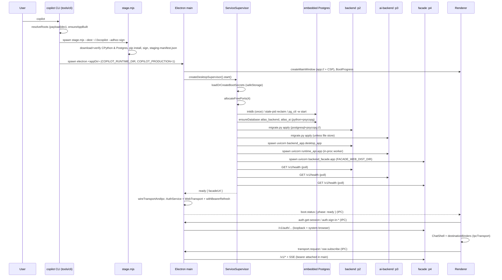

# Flow: Desktop install & boot

## Overview — what this flow does, its entry and exit points

The desktop install & boot flow takes a user from `npm i -g @0x-copilot/cli && copilot` to a signed-in 6-destination shell talking to a fully local stack: embedded PostgreSQL 17 + the three Python services (backend, ai-backend, backend-facade) supervised by the Electron main process. Entry points:

1. **`copilot` CLI** (`tools/cli/bin/copilot.mjs`) — the shipped distribution path (npm/bun, no DMG, ad-hoc signing).
2. **Packaged app** (electron-builder DMG/NSIS, `apps/desktop/electron-builder.yml`) — `app.isPackaged` engages the same supervisor.
3. **Dev supervised** — `COPILOT_RUNTIME_DIR=$PWD/apps/desktop/resources npm run dev --workspace @0x-copilot/desktop` after `node tools/desktop-runtime/stage.mjs`.
4. **Dev unsupervised** — plain `npm run dev`; no supervisor, transport is MockTransport or `COPILOT_FACADE_URL` WebTransport.
5. **Headless harness** — `tools/desktop-runtime/run-local.mjs` boots the staged runtime without Electron (smoke gate).

Exit point: the supervisor resolves `{facadeUrl}`, main wires `WebTransport → TransportBridge → IPC`, the renderer's `BootGate` receives `phase: "ready"`, `SignInGate` completes an auth flow, and `ChatShell` (from `@0x-copilot/chat-surface`) mounts with `destinationBinders` fetching over the IPC transport.

## End-to-end trace — numbered steps

1. **[desktop-distribution] CLI entry + platform gate.** `copilot` parses argv, rejects unsupported platform keys (`darwin-arm64`/`darwin-x64`/`win32-x64` only) — `tools/cli/bin/copilot.mjs:83-99`, `tools/cli/lib/paths.mjs:52-59`. Layout resolution picks **payload mode** (published package: `payload/` assembled at prepack) or **dev mode** (walks up to the monorepo root) — `tools/cli/lib/paths.mjs:89-129`.
2. **[desktop-distribution] App build check.** Payload mode requires a prebuilt `out/main/index.js`; a dev checkout rebuilds on every start (`npm run build --workspace @0x-copilot/desktop`) to avoid stale-renderer traps — `tools/cli/lib/launch.mjs:22-52`.
3. **[desktop-distribution] Runtime staging.** `stageRuntime` re-stages when unstaged or the CLI version marker changed (`~/.0xcopilot/.copilot-version`), then spawns `tools/desktop-runtime/stage.mjs --platform 
 --arch <a> --dest ~/.0xcopilot --adhoc-sign` (darwin) — `tools/cli/lib/stage.mjs:49-99`. `stage.mjs`:
   - downloads + sha256-verifies pinned CPython 3.13.14 (python-build-standalone, GitHub) and zonky embedded-postgres 17.10 (Maven Central) per `tools/desktop-runtime/manifest.json:4-61`, cached in `~/.cache/enterprise-desktop-runtime` — `tools/desktop-runtime/stage.mjs:190-223`;
   - extracts python and the postgres jar (bsdtar two-step) — `stage.mjs:233-305`;
   - copies each service's `src/migrations/scripts/...` and pip-installs `requirements.txt` into a per-service `site-packages` (`--require-hashes` for backend + facade, not ai-backend), then installs `packages/service-contracts` + `packages/audit-chain` `--no-deps`, pin-checks, prunes, byte-compiles — `stage.mjs:56-77,397-486`;
   - stages the built frontend dist (`wallet.html` + assets) arch-agnostically at `<dest>/web` for the facade's SIWE wallet page — `stage.mjs:713-731`;
   - on macOS `--adhoc-sign` prunes stdlib cruft, strips symbols, `codesign --force --sign -` every Mach-O in batches, strips quarantine xattrs, stamps `.sign-stamp.json` — `stage.mjs:621-701`;
   - writes `staging-manifest.json` (`host_exec: true` = runnable) last, having removed it up front so a partial stage never looks runnable — `stage.mjs:744-816`.
4. **[desktop-distribution] Branded mac shell + launch.** `ensureBrandedShell` clones Electron.app to `~/.0xcopilot/shell/0xCopilot.app` (APFS `cp -c`), rewrites `CFBundleName/DisplayName/Identifier` (`com.0x-copilot.app`), swaps `electron.icns`, re-signs ad-hoc; any failure falls back to stock Electron — `tools/cli/lib/mac-shell.mjs:75-158`. `launchApp` spawns `electron <appDir>` with `COPILOT_RUNTIME_DIR=~/.0xcopilot` and `COPILOT_PRODUCTION=1` (the CLI's explicit production-posture signal, since `app.isPackaged` is false for a directory launch), deleting `ELECTRON_RUN_AS_NODE` — `tools/cli/lib/launch.mjs:58-74`.
5. **[desktop-app] Electron main early boot.** `applyBrandIdentity` (app.setName "0xCopilot"), `app://` protocol privilege, single-instance lock (two postmasters on one `pgdata` would corrupt it; second launch re-focuses) — `apps/desktop/main/index.ts:78-103`, `apps/desktop/main/services/boot-mode.ts:27-39`. On ready: crash reporter, deep links, `app://` handler serving `out/renderer` with a CSP including `connect-src 'none'`, then the window is created immediately so `BootProgress` renders before any service work; `did-finish-load` replays the latest boot/update status — `index.ts:210-245`, `apps/desktop/main/window.ts:18-49`.
6. **[desktop-app] Supervise-or-not decision.** `shouldSupervise` = `app.isPackaged || COPILOT_RUNTIME_DIR set` — `apps/desktop/main/services/boot-mode.ts:12-16`. Unsupervised dev: `wireTransportAndIpc(process.env.COPILOT_FACADE_URL)` + a synthetic `phase:"ready"` (MockTransport when unset) — `index.ts:291-296`.
7. **[desktop-app] Google OAuth default seeding.** Before child envs are built, `applyBundledGoogleOAuth` seeds `GOOGLE_OAUTH_CLIENT_ID/SECRET` into `process.env` from a gitignored `google-oauth.json` next to the app (shipped only in the npm payload); an operator env var always wins — `index.ts:262-272`, `apps/desktop/main/services/google-oauth-default.ts:56-89`.
8. **[desktop-app] Supervisor phase: secrets.** `loadOrCreateBootSecrets` generates once and persists `ENTERPRISE_AUTH_SECRET` (64B hex), `ENTERPRISE_SERVICE_TOKEN`, `MCP_TOKEN_VAULT_SECRET`, pg password, `AUDIT_HMAC_KEY` at `<userData>/secrets/boot-env.bin`, safeStorage-encrypted (chmod-600 plaintext fallback). An unreadable blob throws `BootSecretsUnreadable` — never silently regenerated (would orphan pgdata + invalidate sessions) — `apps/desktop/main/services/boot-secrets.ts:70-116,32-42`.
9. **[desktop-app] Supervisor phase: ports.** Four OS-assigned free ports (pg, backend, ai-backend, facade), all listeners held open until the set is complete — `apps/desktop/main/services/ports.ts:8-47`, `apps/desktop/main/services/supervisor.ts:127-135`.
10. **[desktop-app → external:postgres] Postgres.** `PostgresManager.start`: one-time `initdb --encoding=UTF8 --locale=C -U atlas --pwfile --auth=scram-sha-256 -D <userData>/pgdata`; stale/orphaned `postmaster.pid` reclaim (live orphan gets `pg_ctl stop -m fast` then `-m immediate` escalation); `pg_ctl -w -t 60 start` on 127.0.0.1 — `apps/desktop/main/services/postgres.ts:90-231`. Databases `atlas_backend` + `atlas_ai` are created via the staged python + psycopg (zonky ships no psql/createdb), password via `PGPASSWORD` env, name regex-validated — `postgres.ts:56-145`, `supervisor.ts:137-146`, `service-env.ts:44-46`.
11. **[desktop-app] Supervisor phase: migrations.** `<python> scripts/migrate.py apply` per stateful service with cwd at the staged service dir and the SAME env `buildServiceEnv` gives the app; yoyo needs the `postgresql+psycopg://` URL (bare scheme resolves to absent psycopg2) — `apps/desktop/main/services/migrations.ts:44-59`, `service-env.ts:62-74`. The ai-backend gate is skipped when the opt-in file store flag `COPILOT_DESKTOP_FILE_STORE_V1` is on — `desktop-supervisor.ts:116-131`, `service-env.ts:87-117`.
12. **[desktop-app → backend-product / ai-runtime-api / backend-facade] Services.** Three uvicorn children spawn in parallel with curated envs (allowlist passthrough only — `service-env.ts:11-36`): backend `backend_app.desktop_app:app` (`BACKEND_ENVIRONMENT=production`, local token vault, `AUDIT_HMAC_KEY`, `SIWE_ORIGIN=http://127.0.0.1:<facadePort>`), ai-backend `runtime_api.app:app` (`RUNTIME_STORE_BACKEND=postgres|file`, in-process worker, `RUNTIME_MIGRATIONS_AUTO_APPLY=false`, `MCP_BACKEND_REGISTRY_URL`/`SKILLS_BACKEND_REGISTRY_URL` → backend), facade `backend_facade.app:app` (`BACKEND_URL`, `AI_BACKEND_URL`, `FACADE_WEB_DIST_DIR=<base>/web` for the wallet page) — `service-env.ts:143-248`, `desktop-supervisor.ts:133-157`. Each child is babysat by `PythonService`: exponential restart backoff 1s→30s, ≥5 crashes/5min = `FatalCrashLoop` → fatal boot screen; stdout/stderr into 10MB×3 rotating logs — `python-service.ts:86-221`.
13. **[desktop-app] Health gate → ready.** Poll `GET /v1/health` (250ms interval, 90s budget) on backend + ai-backend in parallel, then facade; supervisor emits `phase:"ready"` and resolves `{facadeUrl}` — `health.ts:28-51`, `supervisor.ts:173-194`. Every phase streams `BootStatusPayload` over the `boot.status` channel; a phase failure emits `fatal: true` and main keeps the process alive so the user can read it — `supervisor.ts:232-250`, `index.ts:285-290`.
14. **[desktop-app] Transport + auth wiring.** `wireTransportAndIpc(facadeUrl)`: `resolveAuthPosture` (production posture forces mode "oidc" so dev-mint can never run; `COPILOT_AUTH_MODE=dev-mint`/`COPILOT_DEV=1` are explicit dev overrides) — `posture.ts:24-51`, `index.ts:481-566`. Transport: no facadeUrl → `MockTransport`; else `WebTransport` (bearer from AuthService, attached in main) wrapped `withBearerRefresh` (one retry on 401 via refresh; failures audited) — `index.ts:573-622`. `TransportBridge` exposes request/SSE-subscription over IPC to the renderer — `transport-bridge.ts:31-84`, handlers in `ipc/handlers.ts` registered at `index.ts:360-410`.
15. **[desktop-app renderer] Bootstrap.** Preload exposes an allowlist-checked `window.bridge` (transport/auth channels + capability + connector channels); `boot.status`/`update.status` are stateful channels replayed to late subscribers — `preload/bridge.ts:16-87`. `bootstrap.tsx` composes `DeploymentProfileProvider("single_user_desktop", static — not bridged from main)` → `BootGate` → `SignInGate` → `ChatShell` + `DestinationOutlet`/`SettingsMount`/`PaletteHost`; `IpcTransport` carries a null bearer (the real bearer never crosses IPC) — `renderer/bootstrap.tsx:61-127`.
16. **[desktop-app renderer → chat-surface] Sign-in + shell.** `SignInGate` checks `auth.get-session`; offers wallet / Google / local. In production posture "local" runs `signInLocal` (per-install keychain key SIWE); in dev posture it dev-mints — `renderer/SignInGate.tsx:53-141`, `index.ts:543-557`. Google: loopback + system browser via `GET {facade}/v1/auth/oidc/google/start` (`auth/google-login.ts:85`); wallet: facade-served `/wallet.html` handoff (`auth/wallet-login.ts:39`). On session, `ChatShell` mounts with `destinationsForProfile`, and `destinationBinders.tsx` fetches each destination over the Transport port (mirrors web binders; no `apps/frontend` import) — `renderer/destinationBinders.tsx:1-34`.
17. **[desktop-app] Shutdown.** `before-quit` → `preventDefault` → `supervisor.stop()` (facade → ai-backend → backend SIGTERM w/ SIGKILL escalation, then `pg_ctl stop -m fast`) → second quit passes — `index.ts:418-441`, `supervisor.ts:198-230`.

**Parallel path (packaged DMG/NSIS):** `dist:*` scripts stage the runtime into `apps/desktop/resources/`, electron-builder maps `resources/runtime → <resourcesPath>/runtime` (`electron-builder.yml:36-40`), `sign-nested.js` (afterPack) pre-signs nested Mach-Os with a Developer ID, and `app.isPackaged` engages the identical supervisor. Note the `web/` gap in Findings F1.

**Parallel path (run-local.mjs harness):** same staged tree booted from Node with per-run secrets, `initdb -U postgres -A trust`, DBs `backend`/`ai_backend`, then health + `/v1/auth/providers` + dev-IdP-absent smokes — `tools/desktop-runtime/run-local.mjs:222-513`. See Findings F3/F4 for its drift from the real supervisor.

## Sequence diagram

## Contracts involved

| Contract | Producer side | Consumer side |
| --- | --- | --- |
| Staged runtime tree `<base>/runtime/<platform>-<arch>/{python,postgres,services,staging-manifest.json}` + sibling `<base>/web` | `tools/desktop-runtime/stage.mjs:744-816,713-731` | `apps/desktop/main/services/runtime-paths.ts:62-90` (packaged: `process.resourcesPath`; dev/CLI: `COPILOT_RUNTIME_DIR`), `tools/desktop-runtime/run-local.mjs:229-244`, `tools/cli/lib/stage.mjs:20-33` (`isStaged` reads `host_exec`) |
| Binary pins (urls + sha256 + archive layout) | `tools/desktop-runtime/manifest.json:4-61` | `stage.mjs:736-761`; platform keys re-listed by hand in `tools/cli/lib/paths.mjs:52-56` |
| `COPILOT_RUNTIME_DIR` env (supervise + tree root) | `tools/cli/lib/launch.mjs:64` | `apps/desktop/main/services/boot-mode.ts:12-16`, `apps/desktop/main/index.ts:277` |
| `COPILOT_PRODUCTION=1` env (auth posture) | `tools/cli/lib/launch.mjs:69` | `apps/desktop/main/posture.ts:24-28` |
| Child service env table (secrets, DB urls, `SIWE_ORIGIN`, `FACADE_WEB_DIST_DIR`, registry URLs, profile) | `apps/desktop/main/services/service-env.ts:143-248` | `services/backend/src/backend_app/desktop_app.py` (BACKEND_*), `services/ai-backend` runtime settings (RUNTIME_*), `services/backend-facade/src/backend_facade/settings.py:34` (`FACADE_WEB_DIST_DIR`) |
| `BootStatusPayload` on `boot.status` / `UpdateStatusPayload` on `update.status` | `apps/desktop/main/services/supervisor.ts:263-268`, `index.ts:129-139` | `packages/chat-transport/src/ipc/rpc-protocol.ts:52` (channel ids + zod schema), `apps/desktop/renderer/BootProgress.tsx:41-99`, `preload/bridge.ts:30-45` (stateful replay) |
| IPC channel allowlist (transport/auth + capability + connector) | `packages/chat-transport` `isAllowedChannel`, `apps/desktop/main/capabilities/channels.ts`, `main/connectors/channels.ts` | `apps/desktop/preload/bridge.ts:16-22` |
| `Transport` port (request / SSE / session) | `packages/chat-transport/src/web/WebTransport.ts:39`, `ipc/IpcTransport.ts` | `apps/desktop/main/transport-bridge.ts:31-84`, `renderer/bootstrap.tsx:116-127`, `renderer/destinationBinders.tsx` (via `useTransport`) |
| Renderer session shape (`RendererSession`, bearer never crosses IPC) | `apps/desktop/main/ipc/handlers.ts` + `auth/*` | `renderer/SignInGate.tsx:58-105` |
| Bundled Google OAuth client `google-oauth.json` | `tools/cli/scripts/assemble-payload.mjs:199-229` (from gitignored file or CI env) | `apps/desktop/main/services/google-oauth-default.ts:56-89` → backend `build_google_provider` via env passthrough (`service-env.ts:30-31`) |
| Boot secrets blob `ATLASBOOTv1:` at `<userData>/secrets/boot-env.bin` | `apps/desktop/main/services/boot-secrets.ts:96-116` | same module on every later boot (`decode`, fail-closed) |
| CLI version marker `~/.0xcopilot/.copilot-version` | `tools/cli/lib/stage.mjs:88-98` | `tools/cli/lib/stage.mjs:36-51` (re-stage on CLI upgrade) |
| App identity `com.0x-copilot.app` / "0xCopilot" | `apps/desktop/main/branding.ts:21-26` | `apps/desktop/electron-builder.yml:14-15`, `tools/cli/lib/mac-shell.mjs:44`, `tools/cli/lib/paths.mjs:26` (hand-synced — see F6) |

## Failure modes — as implemented

- **Unsupported platform** → CLI exits 1 up front (`paths.mjs:52-59`, `copilot.mjs:75-81`).
- **Download tampering** → sha256 mismatch hard-fails staging; cache entries re-verified on hit (`stage.mjs:195-223`).
- **Partial stage** → `staging-manifest.json` removed before work, written last; `isStaged()` then fails and the CLI refuses to launch (`stage.mjs:748-751`, `copilot.mjs:94-99`).
- **Cross-target stage** → `host_exec:false` recorded; doctor reports "download-only", launch refuses (`stage.mjs:414-419`, `doctor.mjs:92-97`).
- **Ad-hoc sign failure** → per-file retry after batch failure; any residual failure fails staging with the file list (`stage.mjs:659-692`).
- **Branded-shell failure** → warn + launch stock Electron (never blocks) (`mac-shell.mjs:151-158`).
- **Unreadable boot secrets** → `BootSecretsUnreadable` → fatal boot screen; never regenerated (`boot-secrets.ts:32-42,118-142`).
- **Orphaned postmaster** → live orphan reclaimed with `pg_ctl stop -m fast` then `-m immediate`; dead pid file deleted (`postgres.ts:187-231`). `copilot doctor` surfaces it; `copilot repair` is the manual escape hatch (`doctor.mjs:144-162`, `repair.mjs`).
- **initdb/pg_ctl/migrations non-zero** → typed errors carrying an output tail → fatal `BootStatusPayload`; renderer shows terminal error screen suggesting `copilot repair` (`postgres.ts:116-118`, `migrations.ts:52-58`, `supervisor.ts:240-249`, `BootProgress.tsx:57-80`).
- **Child crash** → restart with 1s→30s backoff; ≥5 crashes in 5 min → `FatalCrashLoop` → fatal screen even post-ready (`python-service.ts:196-221`, `supervisor.ts:252-261`).
- **Health timeout** → 90s budget per service, `HealthCheckTimeout` → fatal (`health.ts:28-51`).
- **Supervised boot failure** → main logs and keeps the process alive so the fatal screen stays readable (`index.ts:285-290`).
- **Sign-in failures** → per-method error phase with retry; loopback waits time out (5 min); `requires_mfa: true` sessions are refused (`SignInGate.tsx:86-141`, `apps/desktop/README.md:165-171`).
- **401 mid-session** → `withBearerRefresh` retries once after refresh; refresh failure audited to `<userData>/audit/auth.log` (`index.ts:589-621`).
- **Quit during run** → `before-quit` preventDefault until ordered stop completes; stop is idempotent/shared (`index.ts:418-441`, `supervisor.ts:198-202`). Windows CLI kill uses `taskkill /T /F` so postgres/python aren't orphaned (`copilot.mjs:114-125`).
- **Second instance** → quits immediately; first window refocused (`boot-mode.ts:27-39`).
- **Renderer loads after status** → `did-finish-load` replay + preload stateful-channel replay make `boot.status` race-free (`index.ts:237-240`, `preload/bridge.ts:30-45`).

## Findings

**F1 (risk, high, high confidence) — Packaged DMG/NSIS builds never ship the staged web assets, so wallet sign-in cannot work there.** `stage.mjs` stages `wallet.html` to `<dest>/web` (`tools/desktop-runtime/stage.mjs:713-731`) and `resolveRuntimePaths` expects `<base>/web` (`apps/desktop/main/services/runtime-paths.ts:82`), but `electron-builder.yml` maps only `resources/runtime` into `resourcesPath` (`apps/desktop/electron-builder.yml:36-40`) — `resources/web` is dropped. The supervisor still sets `FACADE_WEB_DIST_DIR` to the nonexistent dir (`service-env.ts:241-243`), the facade logs "wallet page not served" (`services/backend-facade/src/backend_facade/wallet_page_routes.py:54`), and `wallet-login.ts` opens `{facade}/wallet.html` → 404. CLI installs are unaffected (stage writes `~/.0xcopilot/web`). Fix: add `- from: resources/web`\n`  to: web` to `extraResources`.

**F2 (risk, high, high confidence at this audit base) — Supervised ai-backend env omits `BACKEND_BASE_URL`, degrading desktop runs to Null resolvers.** `buildServiceEnv` gives ai-backend only `MCP_BACKEND_REGISTRY_URL`/`SKILLS_BACKEND_REGISTRY_URL` (`apps/desktop/main/services/service-env.ts:228-229`), but the runtime's project/membership/notification/routine/policy resolvers key off `BACKEND_BASE_URL` (+ `ENTERPRISE_SERVICE_TOKEN`) and fall back to Null implementations when unset (`services/ai-backend/src/agent_runtime/api/project_resolver.py:282-295`, `membership.py:34,256`, `notifications.py:274,366`, `routine_backend_client.py:447`). This is the confirmed "BYOK runs broken on desktop" bug; note it is fixed on `main` by commit `bcc65dbb` (#114) which post-dates this audit's base (`c0efb038`) — verify the fix covers run-local.mjs too when rebasing.

**F3 (duplication, high, high confidence) — The desktop boot is implemented twice (run-local.mjs in Node, supervisor in TS) and the copies have drifted.** `tools/desktop-runtime/run-local.mjs` re-implements free-port allocation (`run-local.mjs:70-79` vs `ports.ts:8-47`), health polling (`run-local.mjs:196-216` vs `health.ts:28-51`), the create-database psycopg snippet (`run-local.mjs:317-336` vs `postgres.ts:61-75`), and the full service env table (`run-local.mjs:371-442` vs `service-env.ts:143-248`). Material drift already exists: initdb `-U postgres -A trust` vs `-U atlas --auth=scram-sha-256` (`run-local.mjs:274-287` vs `postgres.ts:168-178`); DB names `backend`/`ai_backend` vs `atlas_backend`/`atlas_ai` (`run-local.mjs:313-316` vs `service-env.ts:44-45`); run-local sets `RUNTIME_ENABLE_LOCAL_MODELS` (supervisor doesn't); supervisor sets `SIWE_ORIGIN`/`FACADE_WEB_DIST_DIR`/`RUNTIME_EVENT_BUS_BACKEND` (run-local doesn't). Both headline claims — run-local.mjs "exactly the way the Electron supervisor will" (`run-local.mjs:3-4`) and the README's "spawns exactly the processes run-local.mjs spawns" (`tools/desktop-runtime/README.md:4-6`) — are false. The "proven by run-local.mjs" safety argument repeated across `postgres.ts`, `service-env.ts` and `runtime-paths.ts` comments is therefore weaker than stated. Fix: extract one shared boot-contract module (env table + init parameters) consumed by both, or drive run-local from the compiled supervisor.

**F4 (inconsistency, medium, high confidence) — `RUNTIME_ENABLE_LOCAL_MODELS` is documented as part of the desktop boot contract but the real supervisor never sets it.** `tools/desktop-runtime/README.md:70` documents the flag ("surfaces Settings → Local models") and `run-local.mjs:420` sets it, but `service-env.ts` builds the ai-backend env without it — the shipped desktop (CLI and packaged) does not enable the local-models section the docs promise. Either set it in `buildServiceEnv` (this IS the user's machine, same rationale as run-local's comment) or fix the docs.

**F5 (risk, medium, medium confidence) — The documented dev supervised recipe boots into a posture whose default sign-in cannot succeed.** `COPILOT_RUNTIME_DIR=… npm run dev` (root `CLAUDE.md`, `apps/desktop/README.md:252-257`) supervises (`boot-mode.ts:12-16`) with children at `*_ENVIRONMENT=production` (`service-env.ts:174,195,236`) where `/v1/dev/identity/mint` is never registered — but without `COPILOT_PRODUCTION=1` the app resolves DEV posture (`posture.ts:24-28`), so the "Sign in" (local) button routes to dev-mint (`index.ts:548-551`) and always fails against its own supervised stack; only wallet/Google work. The CLI path is unaffected (sets `COPILOT_PRODUCTION=1`). Fix: treat `shouldSupervise` as a production-posture input, or dev-gate the supervised children's environment.

**F6 (ssot-violation, medium, high confidence) — App/runtime identity and platform facts are hand-synced across at least five files.** (a) `com.0x-copilot.app`: `apps/desktop/main/branding.ts:26`, `apps/desktop/electron-builder.yml:14`, `tools/cli/lib/mac-shell.mjs:44`; (b) app name "0xCopilot": `branding.ts:21`, `electron-builder.yml:15`, `tools/cli/lib/paths.mjs:26` (comment: "Must stay in sync with app.setName"); (c) supported platform keys: `tools/cli/lib/paths.mjs:52-56` duplicates `tools/desktop-runtime/manifest.json` platform maps; (d) the service copy-dir table: `tools/cli/scripts/assemble-payload.mjs:26-33` mirrors `tools/desktop-runtime/stage.mjs:56-72` by hand; (e) renderer `APP_VERSION = "0.1.0"` (`apps/desktop/renderer/SignInGate.tsx:26`) mirrors `apps/desktop/package.json:3`. Each pair carries a "keep in sync" comment instead of a single source; a small shared constants module (or build-time injection for the version) removes the whole class.

**F7 (inconsistency, medium, high confidence) — End users run a different Electron major than dev/CI ever exercises.** The published CLI pins `electron: 42.1.0` (`tools/cli/package.json:26`) — in payload mode `resolveElectronBinary` resolves the CLI's own electron first (`paths.mjs:97-104,137-153`) — while the app is developed, unit-tested and packaged against `electron: 43.1.1` (`apps/desktop/package.json:46`). The runtime that real installs use is the one no test path covers.

**F8 (dead-code, low, high confidence) — `needsStage` is exported but has no caller.** `tools/cli/lib/stage.mjs:49-51` defines it; the only staleness check actually used is the inline one inside `stageRuntime` (`stage.mjs:62-65`). No imports anywhere in `tools/cli` (no tests in the package). Delete or use it in `doctor`.

**F9 (ssot-violation, low, high confidence) — Boot-phase copy is duplicated between main and renderer.** The supervisor's phase messages ("Unlocking secure storage…", …) live in `supervisor.ts:121-192` and are re-listed (with matching wording) as the renderer's step log in `BootProgress.tsx:23-34`. The renderer already receives `message`/`percent` live; only the step-log labels are duplicated. Low stakes, but a wording change now needs two edits plus the `PHASE_PERCENT` table.

**F10 (inconsistency, low, medium confidence) — Two different "default workspace" fallbacks.** Renderer uses `DEFAULT_WORKSPACE_ID = "org_acme"` (`renderer/SignInGate.tsx:19`) while main's refresh decorator falls back to `COPILOT_WORKSPACE_ID ?? "wsp_unknown"` (`main/index.ts:590`). Both are placeholders for a single-workspace product, but they name the same concept differently across the IPC boundary; audit rows can carry `wsp_unknown` for a session the renderer calls `org_acme`.

Otherwise the flow is in good health: fail-closed staging (sha256 + `--require-hashes` + pin-check + completion marker), fail-closed secrets, curated child envs (no raw env leakage), orphan-postmaster reclaim, race-free boot-status replay, and an ordered shutdown path are all implemented and unit-tested with injected fakes throughout `apps/desktop/main/services/`.
