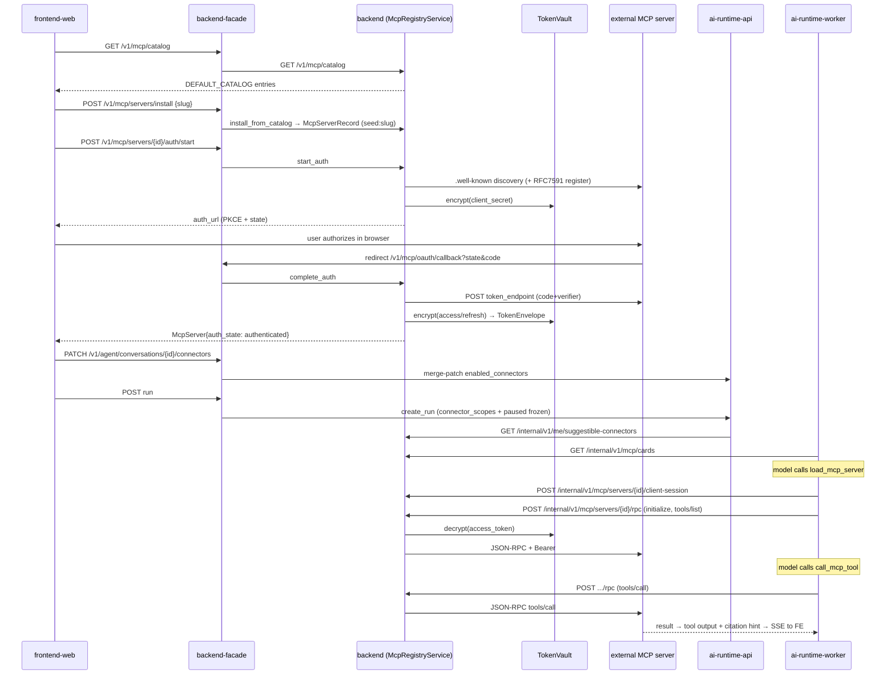

# Flow: MCP & Connectors end-to-end

## Overview — what this flow does, its entry and exit points

This flow is how a third-party MCP server becomes a tool the agent can call. Entry points: (a) the web UI's connector surfaces (Settings connector grid, chat connector popover, Tools destination) calling the facade, (b) the desktop Electron app's `connector.*` IPC channels, and (c) the agent itself at run time via the `load_mcp_server` / `call_mcp_tool` / `auth_mcp` / `suggest_mcp_connector` builtin tools. Exit point: a JSON-RPC `tools/call` against the remote MCP server, executed by `services/backend` on behalf of `ai-backend` with a vault-decrypted OAuth token that never leaves the backend.

The single real write path is `McpRegistryService` in `services/backend` (registration → OAuth discovery/dynamic-registration or pre-registered client → PKCE authorization → token exchange → `TokenVault` encryption → internal cards / client-session / RPC proxy for `ai-backend`). Around that one spine, the repo has grown **four additional connector surfaces** — the curated `DEFAULT_CATALOG` seeds, the Connectors-destination read model (`/v1/connectors`), the AC9 desktop profile overlay, and the runtime "MCP-as-files" store — which are in materially different states of wiring (see Findings; the Connectors-destination web OAuth path is a stub end-to-end).

## End-to-end trace — numbered steps

1. **Catalog listing** (`backend-platform`): `GET /v1/mcp/catalog` returns the curated seed list from `mcp_catalog.DEFAULT_CATALOG` (13 entries, `server_id = "seed:<slug>"`, brand metadata, `requires_pre_registered_client` flags) — `services/backend/src/backend_app/mcp_catalog.py:83-221`, route at `services/backend/src/backend_app/app.py:767-777`. The facade proxies it 1:1 — `services/backend-facade/src/backend_facade/app.py:277-286`; the frontend fetches through `listMcpCatalog()` — `apps/frontend/src/api/mcpApi.ts:49-51`.
2. **Install** (`frontend-web` → `backend-facade` → `backend-platform`): `POST /v1/mcp/servers/install` (`apps/frontend/src/api/mcpApi.ts:53`, facade `app.py:288-300`) lands in `McpRegistryService.install_from_catalog`, idempotent on slug, refusing entries with `requires_pre_registered_client=True` unless an `oauth_client` is supplied — `services/backend/src/backend_app/service.py:340-389`. Custom servers use `create_server`, idempotent on `(org, user, normalized URL)` — `service.py:208-242`. Both write an audit row in the same store transaction (`service.py:238-240`).
3. **OAuth start** (`backend-platform`): `POST /v1/mcp/servers/{id}/auth/start` → `McpRegistryService.start_auth` generates PKCE verifier + state, creates a TTL'd `McpAuthSessionRecord`, then `RemoteMcpOAuthClient.authorization` — `service.py:451-509`. Discovery walks RFC 9728 (`/.well-known/oauth-protected-resource`) then RFC 8414 (`/.well-known/oauth-authorization-server`) — `services/backend/src/backend_app/mcp_oauth.py:193-229, 416-436`. If a client is not already known: RFC 7591 dynamic client registration (`_register_client`, `mcp_oauth.py:298-311`), encrypting any issued `client_secret` via `TokenVault` (`mcp_oauth.py:261-265`); otherwise the per-server pre-registered client fields override endpoints/scopes (`_apply_configured_oauth_client`, `mcp_oauth.py:269-296`). No metadata and no configured client ⇒ `McpOAuthError` "setup required" (`mcp_oauth.py:267`).
4. **OAuth callback** (`backend-platform`): the provider redirects to `GET /v1/mcp/oauth/callback` (public route; `state` is the trust anchor) — `services/backend/src/backend_app/app.py:932-955`. `complete_auth` pops the session, exchanges the code (PKCE verifier + optional `client_secret_post` decrypted from vault — `mcp_oauth.py:158-175, 330-350`), encrypts access+refresh tokens into a `TokenEnvelope` with `kms_key_id`, flips `auth_state=AUTHENTICATED`, audits — `service.py:513-555`. The SPA finishes the redirect by calling the same callback via `completeMcpOAuth` — `apps/frontend/src/api/mcpApi.ts:113-125`, with pending-action continuity in `apps/frontend/src/features/chat/mcpAuthAction.ts:14-29`.
5. **Vault storage** (`backend-platform`): `TokenVault` is Fernet-local (`MCP_TOKEN_VAULT_SECRET`, dev) or AWS-KMS envelope (`MCP_TOKEN_VAULT_KMS_KEY_ID`); production with a `local` backend fails closed — `services/backend/src/backend_app/token_vault.py:77-99, 328-401, 462-483`. Token refresh happens lazily inside `_require_valid_token` (60 s expiry skew, refresh-token rotation persisted back to the store) — `service.py:717-762`.
6. **Internal cards for the runtime** (`backend-platform` → consumed by `ai-runtime-capabilities`): `GET /internal/v1/mcp/cards` (scope `RUNTIME_USE`, trusted-header identity) returns `InternalMcpServerCard`s of enabled servers with an *effective* auth state (a usable vault token upgrades stale state) — `app.py:957-972`, `service.py:558-597, 677-693`.
7. **Run-start context** (`backend-facade` → `ai-runtime-api`): the facade PATCHes per-chat scopes at `PATCH /v1/agent/conversations/{id}/connectors` — `services/backend-facade/src/backend_facade/app.py:477-487` — handled with owner-or-admin logic in `services/ai-backend/src/runtime_api/http/routes.py:180-208`. The conversation row stores an RFC 7396-style merge map `enabled_connectors` (`null` = paused) — `services/ai-backend/src/runtime_api/schemas/conversations.py:129-195`. At run create, the coordinator freezes `connector_scopes` + `paused_connectors` into the run's `AgentRuntimeContext` and resolves suggestible catalog entries from `GET /internal/v1/me/suggestible-connectors` — `services/ai-backend/src/agent_runtime/api/run_coordinator.py:365-381, 444-451`, resolver at `services/ai-backend/src/agent_runtime/api/suggestible_connectors_resolver.py:1-60`, backend route + discoverable-override filtering at `services/backend/src/backend_app/app.py:981-1010` / `service.py:283-337`.
8. **Tool exposure to the agent** (`ai-runtime-worker` → `ai-runtime-execution` → `ai-runtime-capabilities`): the worker composes `BackendMcpProvider` (when `MCP backend_registry_url` is set) plus the gated desktop-browser provider into a `DynamicMcpRegistry` — `services/ai-backend/src/runtime_worker/dependencies.py:282-308`. The deep-agent factory wires four builtins: `load_mcp_server`, `call_mcp_tool`, `auth_mcp`, `suggest_mcp_connector` — `services/ai-backend/src/agent_runtime/execution/factory.py:336-402`. `McpPermissionPolicy` gates visibility and loading on paused ids, org/user allowlists and scopes — `services/ai-backend/src/agent_runtime/capabilities/mcp/permissions.py:31-50`; per-tool connector scopes are enforced by `ToolPermissionChecker.has_scopes_for_connector` — `services/ai-backend/src/agent_runtime/capabilities/tools/permissions.py:195-209`.
9. **Load + call** (`ai-runtime-capabilities` → `backend-platform` → `external:mcp-servers`): `McpLoader.load_server` re-checks transport/permissions uncached, then runs `connect + tools/list + resources/list` through a per-key-locked `McpDiscoveryCache` — `services/ai-backend/src/agent_runtime/capabilities/mcp/loader.py:74-120`. `BackendMcpClient` opens `POST /internal/v1/mcp/servers/{id}/client-session` (must be `AUTHENTICATED`) then speaks MCP JSON-RPC (`initialize`, `tools/list`, `tools/call`) through `POST /internal/v1/mcp/servers/{id}/rpc` — `services/ai-backend/src/agent_runtime/capabilities/mcp/backend_provider.py:166-243`. The backend proxy decrypts the token and forwards the JSON-RPC body to the remote server with `Authorization: Bearer`, mapping 401/403 to a safe error — `services/backend/src/backend_app/service.py:607-621, 764-790`. Plaintext tokens never reach `ai-backend`.
10. **Auth-required UX loop** (`ai-runtime-worker` → SSE → `frontend-web`): blocking path — `AuthMcpTool` starts an auth session through `POST /internal/v1/mcp/servers/{id}/auth/start` and interrupts the graph for approval (`services/ai-backend/src/agent_runtime/capabilities/mcp/middleware/auth_mcp.py:49-90`, `backend_provider.py:93-121`). Non-blocking path — `suggest_mcp_connector` emits a single idempotent `mcp_auth_required` envelope per `(run_id, server_id)` via `McpDiscoveryService` (`services/ai-backend/src/agent_runtime/api/mcp_discovery_service.py:1-60`, `capabilities/tools/builtin/suggest_mcp_connector.py:1-50`); the payload type is mirrored at `packages/api-types/src/index.ts:160,1816`.
11. **Per-chat popover** (`frontend-web` + `chat-surface-core`): `useConversationConnectors` owns optimistic PATCHing of the scope map (`apps/frontend/src/features/connectors/useConversationConnectors.ts:17-45`); `ConnectorPopover` + `ComposerConnectorsButton` / `ConnectorsPill` render four-state rows (`apps/frontend/src/features/connectors/ConnectorPopover.tsx:1-50`; the composer button is a re-export shim onto `packages/chat-surface/src/composer/ComposerConnectorsButton.tsx` — `apps/frontend/src/features/chat/components/composer/ComposerConnectorsButton.tsx:1-13`). Workspace-level management is the Settings grid over `McpServer` rows via `useConnectors` → `/v1/mcp/*` — `apps/frontend/src/features/connectors/useConnectors.ts:1-50`, `apps/frontend/src/features/settings/SettingsScreen.tsx:873`.
12. **Connectors destination (web)** (`chat-surface-destinations` + `backend-product`): the Tools destination mounts `ConnectorsGateway` → `ConnectorsRoute` → chat-surface `ConnectorsDestination`, typed on api-types `Connector`/`ConnectorCatalogEntry` — `apps/frontend/src/app/App.tsx:919`, `packages/chat-surface/src/destinations/connectors/ConnectorsDestination.tsx:26-40`. It reads `GET /v1/connectors` (facade proxy `services/backend-facade/src/backend_facade/connector_routes.py:40-54` → backend `connectors/routes.py`), a **denormalized read model** over the MCP path (`services/backend/src/backend_app/connectors/service.py:1-40`) — but see Finding 1: its OAuth start is a stub, its callback 503s, its populate helper has no production caller, and only an in-memory store exists.
13. **Desktop connectors (AC9)** (`desktop-app` → `backend-facade` → `backend-platform`): renderer → main IPC (`connector.list-catalog` / `connector.connect`, Zod-strict both directions — `apps/desktop/main/connectors/channels.ts:13-18`, `schemas.ts:1-35`) → `ConnectorService` fetches `GET /v1/connectors/desktop/catalog` and `ConnectorOAuthCoordinator` runs loopback/deep-link PKCE against `POST /v1/connectors/{slug}/desktop/start-oauth` + `/v1/connectors/desktop/oauth-callback` — `apps/desktop/main/connectors/connector-service.ts:23-60`, `oauth-coordinator.ts:1-60`. Backend side: `DesktopMcpOAuthCoordinator` *reconstructs* the redirect URI from a validated loopback port / fixed deep link, matches the callback caller's org/user against the session, and drives the same `McpRegistryService.start_auth` / `complete_auth` — `services/backend/src/backend_app/connectors/oauth_coordinator.py:141-296`, wired at `app.py:1683-1697`. The installable set is the reconciliation of `desktop_profiles.yaml` against both the marketing catalog and `DEFAULT_CATALOG` seeds — `services/backend/src/backend_app/connectors/profile_catalog.py:1-40`.

## Sequence diagram

## Contracts involved

| Contract | Producer / SSOT | Other declarations |
| --- | --- | --- |
| `McpServerRecord` / `McpServerResponse` / `CreateMcpServerRequest` / `InstallMcpServerRequest` | `services/backend/src/backend_app/contracts.py:257,520,487,614` | TS mirror `McpServer` etc. `packages/api-types/src/index.ts:32-158` |
| MCP enums (`McpTransport`, `McpAuthMode`, `McpAuthState`, `McpServerHealth`) | `services/backend/src/backend_app/contracts.py:148-176` | hand-copied in `services/ai-backend/src/agent_runtime/capabilities/mcp/cards.py:45-80` and `packages/api-types/src/index.ts:18-31` (3 hand-maintained copies) |
| Curated catalog (`CatalogEntry`, `seed:<slug>` ids) | `services/backend/src/backend_app/mcp_catalog.py:31-221` | wire form `McpCatalogEntryResponse` `contracts.py:571`; TS `McpCatalogEntry` `api-types/src/index.ts:95` |
| `InternalMcpServerCard` / `InternalMcpClientSession` / internal RPC shapes | `services/backend/src/backend_app/contracts.py:713-770` | re-validated as `McpServerCard` (`cards.py:119`) — deliberately not in api-types (internal) |
| Per-chat scope map (`enabled_connectors`, `null`=paused) | `services/ai-backend/src/runtime_api/schemas/conversations.py:129-195` | TS `ConversationConnectorScopes` (api-types), consumed `useConversationConnectors.ts:1-45` |
| `AgentRuntimeContext.connector_scopes` / `paused_connectors` | `services/ai-backend/src/agent_runtime/execution/contracts.py:314-455` | fed from trusted headers (`runtime_api/http/routes.py:236-243`) |
| Connectors-destination read model (`Connector`, `ConnectorStatus`) | `packages/api-types/src/connectors.ts:1-120` ↔ `services/backend/src/backend_app/connectors/store.py:74-133` | chat-surface `ConnectorsDestination.tsx:26-33`; desktop binder `apps/desktop/renderer/destinationBinders.tsx:348-414`. Status taxonomy (`connected/disconnected/error/expired`) is disjoint from `McpAuthState` with no mapping function anywhere |
| Desktop OAuth transport (`DesktopStartConnectorOAuthRequest`, loopback path, deep-link URI) | `packages/api-types/src/connectors-desktop.ts:37-40` | constants duplicated by hand in `services/backend/src/backend_app/connectors/oauth_coordinator.py:53-54` |
| Desktop profile overlay | `services/backend/src/backend_app/connectors/desktop_profiles.yaml` via `profile_catalog.py` | reconciles against `catalog.yaml` + `DEFAULT_CATALOG` (three catalogs, overlapping slugs) |
| Service-to-service headers (`x-enterprise-*`) + `RUNTIME_USE` scope | `packages/service-contracts/src/copilot_service_contracts/headers.py`, `scopes.py` | correctly imported in `backend_provider.py:10-15`, `desktop_routes.py:30`; **re-declared by hand** in `suggestible_connectors_resolver.py:33-38` |
| `mcp_auth_required` SSE payload | emitted by `agent_runtime/api/mcp_discovery_service.py` | TS `McpAuthRequiredEventPayload` `api-types/src/index.ts:160,1816` |
| Connector IPC channels | `apps/desktop/main/connectors/channels.ts:13-18` | consumed by preload + renderer binder (`destinationBinders.tsx:63`) |

## Failure modes — as implemented

- **OAuth discovery**: each well-known URL failure (HTTP/URL/timeout/JSON error) is swallowed and the next candidate tried; all-empty discovery plus no configured client raises `McpOAuthError` → 4xx "setup required" (`mcp_oauth.py:438-446, 227-228`). No retry/backoff anywhere in the OAuth client — single attempt per URL, 10 s timeout.
- **Auth session expiry**: sessions are TTL'd (15 min web / 5 min desktop) and single-use (`pop_auth_session`); expired or replayed `state` → `ValueError` → 400 (`service.py:513-516`, `oauth_coordinator.py:49`). Desktop additionally rejects a callback whose verified caller identity differs from the session owner (`connectors/oauth_coordinator.py:12-16`).
- **Token expiry during a run**: `_require_valid_token` refreshes with a 60 s skew; no refresh token → "expired and no refresh token" error; refresh responses rotate the stored envelope (`service.py:717-762`). A remote 401/403 on RPC → `ValueError("MCP server rejected the stored OAuth token")` → surfaced to the runtime as `McpAuthError`, and the model can then call `auth_mcp`.
- **Runtime load failures**: every failure is a typed `McpLoadResult.fail` with a stable `McpLoadErrorCode` (unsupported transport, permission denied, auth required, timeout, descriptor validation) rather than an exception into the graph (`loader.py:95-120`, `cards.py:91-117`). Discovery cache never caches failures and always re-checks permissions live (`loader.py:57-95`).
- **Suggestible-connectors fetch**: resolver never raises — non-2xx or transport errors log and return an empty tuple so run-start is not blocked (`suggestible_connectors_resolver.py:43-52,124-136`).
- **SSE-wrapped RPC responses**: the backend proxy takes the *first* `data:` line of an event-stream response and ignores the rest (`service.py:792-803`) — see Finding 5.
- **Connectors-destination writes**: web `start-oauth` silently returns a deterministic stub URL when no real client is wired (always, in this repo); `oauth-callback` fails closed with 503 `connector_oauth_not_configured` (`connectors/routes.py:277-346`). Desktop catalog fetch degrades to `{entries: []}` on any non-OK or signed-out state (`connector-service.ts:43-60`); backend profile catalog load failures degrade the desktop surface to unavailable instead of crashing boot (`app.py:1670-1683`).
- **Store fallback**: MCP registry uses Postgres when `DATABASE_URL` is set; production without it refuses to boot (`service.py:806-813`). The connectors read model has no such guard — it always gets `InMemoryConnectorsStore` (`app.py:1618-1620`).

## Findings

1. **[risk / dead-wiring — HIGH, confidence high] The web Connectors/Tools destination's connect flow is a stub end-to-end and its read model is never populated.** `POST /v1/connectors/{slug}/start-oauth` falls back to `_default_oauth_start` returning `https://auth.example/{slug}/authorize?state=stub`, and `POST /v1/connectors/oauth-callback` raises 503 unless `app.state.connector_oauth_start/-callback` are injected — nothing in the repo ever sets either (`services/backend/src/backend_app/connectors/routes.py:277-346,557-568`; grep for `connector_oauth_start` finds only the route file). The populate helper `ConnectorsService.write_through_from_mcp` is called only by unit tests (`connectors/service.py:269`, `tests/unit/connectors/test_connectors_service.py:31`). Only `InMemoryConnectorsStore` exists — `connectors/schema.sql` has no Postgres adapter (`connectors/store.py:229`; `app.py:1618-1620`). Net effect: the live Tools destination (web `App.tsx:919` and desktop `destinationBinders.tsx:348-414`) always renders an empty Connected tab, and clicking Connect on web opens a fake URL — while the *real* connector state is fully functional one screen away via `/v1/mcp/servers`. Even a successful desktop AC9 connect (which drives the real `McpRegistryService`) never appears in `/v1/connectors`. Remediation: either wire `start-oauth`/`oauth-callback` to `McpRegistryService.start_auth`/`complete_auth` + call `write_through_from_mcp` from `complete_auth`, or delete the read model and project `/v1/connectors` directly off the MCP store.
2. **[duplication — HIGH, confidence high] ~10 distinct representations of "an MCP server / connector" across the stack, plus three hand-maintained catalogs.** Representations: backend `McpServerRecord`/`McpServerResponse`/`InternalMcpServerCard` (`contracts.py:257,520,713`), `CatalogEntry` (`mcp_catalog.py:31`), connectors read model `ConnectorRecord`+`ConnectorCatalogEntry` (`connectors/store.py:74`, `connectors/service.py:72`), desktop `DesktopConnectorProfile`/`ResolvedConnectorProfile` (`connectors/profile_catalog.py`); ai-backend `McpServerCard` (`cards.py:119`), `McpServerConfigFile` (`files.py:304`), `CatalogSuggestionCard` (`execution/contracts.py`); api-types `McpServer` (`index.ts:32`), `Connector` (`connectors.ts`), desktop variants (`connectors-desktop.ts`); desktop Zod re-declarations (`apps/desktop/main/connectors/schemas.ts:27-50`); frontend `ConnectorRow` projection (`features/connectors/projectConnectors.ts`). Catalogs: `DEFAULT_CATALOG` (13 entries), `connectors/catalog.yaml` (9 entries; github/notion/atlassian overlap), `desktop_profiles.yaml` (overlay reconciling both). Some mirroring is forced by the hard service boundary, but two live UI worlds (Settings grid on `McpServer` at `SettingsScreen.tsx:873` vs Tools destination on `Connector` at `ConnectorsDestination.tsx`) and two disjoint status taxonomies for the same object is architecture debt, not boundary cost.
3. **[ssot-violation — MEDIUM, confidence high] The MCP enum vocabulary is hand-copied in three places with no generation or conformance test.** `McpTransport`/`McpAuthMode`/`McpAuthState`/`McpServerHealth` are declared independently in `services/backend/src/backend_app/contracts.py:148-176`, `services/ai-backend/src/agent_runtime/capabilities/mcp/cards.py:45-80`, and `packages/api-types/src/index.ts:18-31`. A new auth state (e.g. a future `auth_expired`) requires three manual edits; drift fails at runtime (Pydantic validation on the internal-cards path) rather than at build time. The `Connector` status taxonomy (`connectors.ts:49-53`) is a fourth, un-mapped vocabulary for the same lifecycle.
4. **[ssot-violation — MEDIUM, confidence high] Trusted service-header names re-declared by hand next to the constants package that owns them.** `suggestible_connectors_resolver.py:33-38` declares `_Headers.SERVICE_TOKEN/ORG/USER = "x-enterprise-..."` although `copilot_service_contracts.headers` is the SSOT and is imported for exactly these values a directory away in `backend_provider.py:10-15`. Same file also re-implements the `BACKEND_BASE_URL` / fallback env resolution that `runtime_worker` settings already own.
5. **[risk — MEDIUM, confidence medium] The internal RPC proxy flattens SSE responses to the first `data:` event and does no JSON-RPC id matching.** `_decode_remote_mcp_response` returns the first non-`[DONE]` data line of an `text/event-stream` response (`services/backend/src/backend_app/service.py:792-803`). Streamable-HTTP MCP servers may emit server notifications (e.g. `notifications/progress`, log messages) before the response on the same stream; the proxy would return the notification as if it were the tool result and drop the actual response. Also the call is synchronous `urllib.urlopen` with a 30 s timeout inside the request path (`service.py:766-790`) — every agent tool call is a blocking double hop (`ai-backend → backend → remote`), serialized through FastAPI's threadpool.
6. **[bespoke-replaceable — MEDIUM, confidence medium] Hand-rolled OAuth 2.1 client and MCP JSON-RPC client instead of maintained libraries.** `mcp_oauth.py` (518 LOC) implements RFC 9728/8414 discovery, RFC 7591 dynamic registration, PKCE and refresh on raw `urllib`; `BackendMcpClient` (`backend_provider.py:145-260`) implements the MCP `initialize`/`tools/list`/`resources/list`/`tools/call` handshake by hand. The credential-isolation architecture (tokens never leave backend) is a legitimate reason the official `mcp` Python SDK isn't dropped in on the ai-backend side, but the backend side could host the SDK's client against the decrypted token, and `authlib`/`httpx` would replace the bespoke OAuth plumbing and its blocking IO. Two evolving specs are currently tracked by hand in two services.
7. **[dead-code — MEDIUM, confidence high] The "MCP-as-files" provider is built, exported, and wired nowhere.** `FileMcpConfigStore` + `FileMcpServerProvider` (459 LOC incl. a `SecretShapeScanner`, `files.py:304-452`) are exported from `capabilities/mcp/__init__.py:41-42` but no production module constructs them — `runtime_worker/dependencies.py:282-308` composes only `BackendMcpProvider` + the browser provider; the only consumer is `tests/unit/agent_runtime/capabilities/mcp/test_files.py`. Either wire it into the desktop light-file-store effort that motivated it or delete it.
8. **[inconsistency — LOW, confidence high] Composer Tools listing bypasses the effective-auth-state upgrade used everywhere else.** `ToolCatalogService.list_tools` filters `record.auth_state == McpAuthState.AUTHENTICATED` on the raw stored record (`service.py:1233-1242`), while `/v1/mcp/servers` and `/internal/v1/mcp/cards` go through `_effective_auth_state` (usable vault token ⇒ authenticated, `service.py:677-693`). A server whose token exists but whose row wasn't flipped (e.g. desktop `test-token` path variants) appears connected in the popover but is missing from the composer Tools popover. `AUTH_SKIPPED` servers are likewise excluded there but visible/loadable elsewhere.
9. **[duplication — LOW, confidence high] Desktop OAuth loopback/deep-link constants duplicated byte-identically across TS and Python with no cross-check.** `DESKTOP_CONNECTOR_LOOPBACK_PATH = "/connectors/oauth/cb"` and `enterprise://oauth/callback` live in `packages/api-types/src/connectors-desktop.ts:37-40` and again as `_LOOPBACK_PATH`/`_DEEP_LINK_URI` in `services/backend/src/backend_app/connectors/oauth_coordinator.py:53-54`. Unlike the SIWE template duplication, this pair is not documented as change-both-together anywhere.
10. **[complexity — LOW, confidence medium] N+1 vault/token reads on every card listing.** `list_servers` / `list_internal_cards` call `_effective_auth_state` → `store.get_token` per server (`service.py:558-597, 671-693`); on the Postgres store that is one extra query per connector on every popover open, cards fetch, and run-start. A joined read or a token-state column would remove it.

Overall health: the core MCP spine (catalog → install → OAuth/PKCE → vault → internal cards → runtime tools → per-chat scoping) is genuinely well-built — typed contracts at every hop, tokens provably confined to `services/backend`, permission checks re-run uncached, failures mapped to stable safe codes, and the desktop AC9 transport adds real security invariants (redirect reconstruction, caller-identity match). The debt is concentrated in the *second* connector system: a Connectors-destination read model that shipped UI-first with its write path stubbed, plus the representation/catalog sprawl that system introduced.
