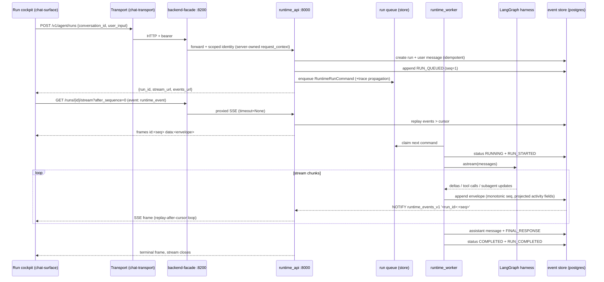

# Flow: Run lifecycle & streaming

## Overview — what this flow does, its entry and exit points

This is the product's hot path: a user goal typed in the Run cockpit (or legacy web chat) becomes a queued agent run, is claimed by the runtime worker, drives a LangGraph/deep-agent execution, and every observable step is persisted as a `RuntimeEventEnvelope` with a per-run monotonic `sequence_no`, then streamed back over SSE through the facade to the client, which projects it into chat bubbles, timeline beads, activity rows, subagent cards, and approval cards.

**Entry points:** `RunDestination` goal composer (`packages/chat-surface/src/destinations/run/RunDestination.tsx:312`, `POST /v1/agent/runs`), the legacy web chat (`apps/frontend/src/features/chat/ChatScreen.tsx` via `apps/frontend/src/api/agentApi.ts`), and desktop (same chat-surface components through `IpcTransport` → main-process `TransportBridge`).
**Exit points:** terminal run status (`completed` / `failed` / `cancelled` / `timed_out`) closes the SSE stream server-side (`services/ai-backend/src/runtime_api/sse/adapter.py:51-54`); replay remains available at `GET /v1/agent/runs/{run_id}/events`.

Verdict up front: the backend event pipeline (producer → sequence-numbered store → NOTIFY → SSE replay-loop) is well-built and genuinely single-sourced. The weaknesses are at the two rims: worker dispatch is effectively serial (making cancel a no-op against an in-flight run in a one-worker deployment), and the client side has three parallel stream consumers/projection pipelines plus a hand-mirrored cross-language event-type contract whose strict TS guard silently drops any event type the mirror doesn't know.

## End-to-end trace — numbered steps

1. **Run creation, client** (`chat-surface-destinations`): the empty-state goal composer POSTs `{conversation_id, user_input}` to `/v1/agent/runs` through the Transport port — `packages/chat-surface/src/destinations/run/RunDestination.tsx:306-317`. The legacy web chat path (`frontend-web`) does the same via `apps/frontend/src/api/agentApi.ts` and `ChatScreen.tsx`. Conversation shells are created/listed via `POST/GET /v1/agent/conversations` (`services/backend-facade/src/backend_facade/app.py:390-427`).
2. **Transport** (`shared-packages`): web `WebTransport.request` attaches bearer + `x-request-id` (`packages/chat-transport/src/web/WebTransport.ts:52-75,127-136`); desktop renderer `IpcTransport.subscribeServerSentEvents`/`request` forwards over IPC (`packages/chat-transport/src/ipc/IpcTransport.ts:82-124`) to the main-process `TransportBridge`, which replays into a real Transport (`apps/desktop/main/transport-bridge.ts:54-84`).
3. **Facade** (`backend-facade`): `POST /v1/agent/runs` authenticates and forwards to ai-backend with server-stamped identity (`identity.scoped_payload(..., include_request_context=True)`) — `services/backend-facade/src/backend_facade/app.py:886-900`. Events/status/cancel/approval routes are thin forwards (`app.py:995-1103`).
4. **Runtime API ingress** (`ai-runtime-api`): `RuntimeApiRoutes.create_run` rejects caller-supplied `runtime_context` (server-owned, 403) and overrides org/user/roles/scopes from the trusted service identity — `services/ai-backend/src/runtime_api/http/routes.py:223-244`. Routes registered under `/v1/agent` with `RequireScopes(RUNTIME_USE)` (`routes.py:495-599`).
5. **RunCoordinator** (`ai-runtime-api`, service layer in `agent_runtime/api`): resolves conversation connector-scope fallback, workspace default model, user policies (BYOK split so plaintext keys never persist), and suggested connectors concurrently; seals `AgentRuntimeContext`; persists run + user message idempotently; emits `RUN_QUEUED`; enqueues `RuntimeRunCommand` with OTel trace propagation — `services/ai-backend/src/agent_runtime/api/run_coordinator.py:93-139,178-217,471-577`. Response carries `stream_url`/`events_url` cursors at `after_sequence=0` (`run_coordinator.py:624-634`).
6. **Worker claim** (`ai-runtime-worker`): `RuntimeWorker.run_forever` → `run_once` claims one command with a lock lease and dispatches by `command_type` (`run_requested` / `run_cancel_requested` / `approval_resolved`) under the extracted trace context — `services/ai-backend/src/runtime_worker/loop.py:118-127,164-170,212-238`. Note: `run_once` **awaits the entire run inside the claim**, so both production (`runtime_worker/__main__.py:179`) and the dev in-process worker (`runtime_api/app.py:824-827`) process commands serially; the `max_parallel_runs` semaphore only matters on `run_until_idle`, which only tests call.
7. **Execution** (`ai-runtime-worker` → `ai-runtime-execution`): `RuntimeRunHandler.handle` validates the claim against the persisted run, preflights budgets, flips status to `RUNNING` + emits `RUN_STARTED`, binds per-run capabilities (citation ledger/allocator/resolver, tool budget guard, MCP discovery, workspace backend), builds the deep-agent harness, and either streams (`_stream_runtime` → `StreamingExecutor` over `harness.agent.astream`) or invokes non-streaming under timeout — `services/ai-backend/src/runtime_worker/handlers/run.py:229-403,1293-1326`.
8. **Stream mapping** (`ai-runtime-worker`): `StreamOrchestrator.append_activity_events` normalizes LangGraph chunks into tool/subagent/approval/native-interrupt events, including approval-batch insertion and subagent pause/resume signals — `services/ai-backend/src/runtime_worker/stream_events.py:119-330,371-520`. `MODEL_DELTA` chunks optionally batch through `DeltaCoalescer` (default **off**: `window_ms=0`, `agent_runtime/settings.py:124`) — `services/ai-backend/src/runtime_worker/delta_coalescer.py:37-92`.
9. **Event persistence** (`ai-runtime-api` producer code + `ai-runtime-persistence`): every event funnels through `RuntimeEventProducer.append_api_event` / `append_stream_event` / `append_api_events_batch`, which run the payload allow-lists and `RuntimeEventPresentationProjector.presentation_fields` (the **single server-side computation** of `activity_kind`/`display_title`/`summary`/`status`) before `EventStorePort.append_event` assigns the monotonic `sequence_no` — `services/ai-backend/src/agent_runtime/api/events.py:60-126,160-209,271-375`; projector at `services/ai-backend/src/runtime_api/schemas/events.py:69-496`.
10. **Push wakeup** (`ai-runtime-persistence` → `external:postgres` → `ai-runtime-api`): the Postgres adapter fires `NOTIFY runtime_events_v1, '<run_id>:<seq>'` inside the append transaction (`services/ai-backend/src/runtime_adapters/postgres/runtime_api_store.py:367-376,4752-4755`); the API process holds one `LISTEN` connection with reconnect backoff and wakes per-run `asyncio.Event`s (`services/ai-backend/src/runtime_api/sse/postgres_event_bus.py:104-213`). In-process dev wiring uses `event_bus.notify_sync` as `on_event_appended` (`services/ai-backend/src/runtime_api/app.py:340,813`). Backend selection is `RUNTIME_EVENT_BUS_BACKEND=auto` → postgres when `DATABASE_URL` set (`runtime_api/sse/event_bus.py:14-17`).
11. **SSE serving** (`ai-runtime-api`): `RuntimeSseAdapter.stream` loops replay-after-cursor → yield frames → wait on the bus (fallback poll 2s in-memory / 10s postgres); closes when `run_status` is terminal; frames are `event: runtime_event\nid: <seq>\ndata: <envelope JSON>` — `services/ai-backend/src/runtime_api/sse/adapter.py:26-70,108-115`; `SSE_EVENT_NAME` at `agent_runtime/api/constants.py:194`. No keepalive frame is emitted in follow mode (contrast `InboxSseAdapter`, which sends `: keepalive` every 25s and *claims* to match the runtime SSE — `runtime_api/sse/inbox_adapter.py:26-60`).
12. **Facade SSE passthrough** (`backend-facade`): streams upstream bytes with `timeout=None` on the pooled client, checking client disconnect only per-arriving-chunk — `services/backend-facade/src/backend_facade/app.py:1026-1069`. The `follow` query param is **not** forwarded (only `after_sequence`), so follow=false replay-then-heartbeat mode is unreachable through the public surface.
13. **Client consumption A — Run cockpit** (`chat-surface-destinations`): `useRunSession` resolves a run, subscribes with `eventName: "runtime_event"` at `?after_sequence=<cursor>`, dedupes by `sequence_no`, keeps an append-only array, and derives `runStatus` from run-lifecycle event types — `packages/chat-surface/src/destinations/run/useRunSession.ts:40,221-256,331-355`. `ThreadCanvas` projects the array **once** via `eventProjector.project/projectAt` (activity, beads, chat entries, approvals map, surface state, time-travel) — `packages/chat-surface/src/thread-canvas/eventProjector.ts:133-211,262-340`; `approvalProjection.ts` and `projectSubagents` are pure selectors over the same array (`destinations/run/approvalProjection.ts:1-25`).
14. **Client consumption B — TcSwimlanes' second subscription** (`chat-surface-core`): `TcSwimlanes` opens its **own** SSE subscription per run for lane beads (`packages/chat-surface/src/thread-canvas/TcSwimlanes.tsx:157-186`) — documented as convergence risk R4 in `useRunSession.ts:20-23`. It omits `eventName`, which the web/IPC transports default to `"message"` (`packages/chat-transport/src/web/WebTransport.ts:81`; `web/sse.ts:109`), while the backend frames `event: runtime_event` — so this subscription receives zero events against the real stack (see Findings).
15. **Client consumption C — legacy web chat** (`frontend-web`): `ChatScreen` + `agentApi.streamRunEvents` maintain a third pipeline: their own reconnect/backoff loop keyed on `latestSequenceRef`, background-run routing, and a full reducer family (`applyRuntimeEvent`, citation/sources/subagent/draft reducers) — `apps/frontend/src/features/chat/ChatScreen.tsx:608-752`, `apps/frontend/src/api/agentApi.ts:607-676`, `apps/frontend/src/features/chat/chatModel/eventReducer.ts:40-209`.
16. **Approvals round trip**: a LangGraph interrupt surfaces as `APPROVAL_REQUESTED` (+ MCP-auth / ask-a-question variants) via `StreamOrchestrator.create_approval_request`/`append_native_interrupt_events` (`stream_events.py:371-520`); the run handler flips the run to `WAITING_FOR_APPROVAL` (`handlers/run.py:396-403`). The client card POSTs `/v1/agent/approvals/{id}/decision` (facade `app.py:1088-1103`, stamping `decided_by_user_id`); `ApprovalCoordinator.record_approval_decision` persists the decision, emits `APPROVAL_RESOLVED` on the same run stream, and enqueues `RuntimeApprovalResolvedCommand` (`services/ai-backend/src/agent_runtime/api/approval_coordinator.py:285-376`); the worker's `RuntimeApprovalHandler` resumes the LangGraph checkpoint (`runtime_worker/loop.py:230-233`, `runtime_worker/handlers/approval.py`). Forward / suggest-edit decisions are API-edge only: parent resolved + child `APPROVAL_REQUESTED`, no harness resume (`approval_coordinator.py:600-870`).
17. **Cancel**: `POST /v1/agent/runs/{id}/cancel` → `RunCoordinator.cancel_run` (idempotent; sets `CANCELLING`, emits `RUN_CANCELLING`, enqueues `RuntimeCancelCommand`, audits) — `run_coordinator.py:230-310`. The worker's `RuntimeCancelHandler` then flips the run to `CANCELLED` and emits the terminal event — `runtime_worker/handlers/cancel.py:37-58`. Nothing interrupts the in-flight execution: `RuntimeRunHandler` never re-checks run status mid-stream (no `CANCELLING` reference in `handlers/run.py` beyond a comment at line 334), and `update_run_status` guards concurrency (row-version CAS, `runtime_adapters/postgres/runtime_api_store.py:5x` block at `update_run_status`) but not terminal-state legality — see Findings.
18. **Replay**: `GET /v1/agent/runs/{run_id}/events?after_sequence=N` → `ConversationQueryService.replay_events` — unbounded fetch, `has_more=False` always (`services/ai-backend/src/agent_runtime/api/conversation_query_service.py:226-261`; adapter query has no LIMIT, `runtime_adapters/postgres/runtime_api_store.py:5160-5180`). The frontend uses it for post-OAuth restore (`ChatScreen.tsx:765-800`).
19. **Dev in-process worker**: `RUNTIME_START_IN_PROCESS_WORKER=true` starts a worker task inside the API — but **only** when `RUNTIME_STORE_BACKEND` is in-memory; on postgres it silently returns without logging (`services/ai-backend/src/runtime_api/app.py:791-827`). Root `CLAUDE.md` documents the flag without the in-memory restriction.

## Sequence diagram — happy path

## Contracts involved

| Contract | Producer / SoT | Mirror(s) | Notes |
| --- | --- | --- | --- |
| `RuntimeEventEnvelope` (event_id, sequence_no, event_type, activity_kind, display_title, summary, status, visibility, redaction_state, presentation, payload) | `services/ai-backend/src/runtime_api/schemas/events.py:961-1100` | hand-mirrored TS interface + `isRuntimeEventEnvelope` guard, `packages/api-types/src/index.ts:2102-2377` | wire shape for both SSE and replay |
| `RuntimeApiEventType` (43 values) | Python StrEnum `runtime_api/schemas/common.py:81-160` | TS union `packages/api-types/src/index.ts:253-297` **and** const array `:310-355` | three hand-synced copies; `satisfies` does not enforce exhaustiveness of the array |
| `RuntimeActivityKind`, `AgentRunStatus`, `RuntimeEventVisibility`, `RuntimeEventRedactionState`, `StreamEventSource` | `runtime_api/schemas/common.py:34-79` | `packages/api-types/src/index.ts:207-251,299-369` | same hand-mirroring |
| SSE framing: `event: runtime_event`, `id: <sequence_no>`, `data: <json>` | `agent_runtime/api/constants.py:194` + `runtime_api/sse/adapter.py:108-115` | string literal `RUNTIME_EVENT_NAME` in `useRunSession.ts:40` and `SSE_EVENT_NAME` in `apps/frontend/src/api/agentApi.ts:66` | `id:` deliberately ignored client-side (`chat-transport/src/web/sse.ts:107`) — resume cursor is domain-owned |
| `?after_sequence=N` resume cursor | `runtime_api/http/routes.py:285`, facade `app.py:999,1030` | `useRunSession.ts:228`, `agentApi.ts:592,722` | client resumes from highest rendered `sequence_no` |
| `CreateRunRequest` / `CreateRunResponse` / cancel / approval-decision payloads | `runtime_api/schemas/runs.py`, `approvals.py` | facade `FacadeRunRequest` (`backend_facade/app.py:886`), api-types `index.ts` | facade re-validates then forwards |
| Worker queue commands `RuntimeRunCommand` / `RuntimeCancelCommand` / `RuntimeApprovalResolvedCommand` | `runtime_api/schemas/commands.py`; enqueued `run_coordinator.py:207`, consumed `runtime_worker/loop.py:256-292` | internal only | carries sealed `AgentRuntimeContext`; BYOK keys are re-hydrated at claim time, never queued (`runtime_worker/__main__.py:64-69`) |
| NOTIFY channel `runtime_events_v1`, payload `<run_id>:<seq>` | `runtime_adapters/postgres/runtime_api_store.py:367` | listener `runtime_api/sse/postgres_event_bus.py:30,168-179` | versioned channel name |
| `RUNTIME_START_IN_PROCESS_WORKER`, `RUNTIME_EVENT_BUS_BACKEND`, `DELTA_COALESCE_WINDOW_MS` | `agent_runtime/settings.py:124,361` + `runtime_api/app.py:791-827` | root `CLAUDE.md` | docs omit the in-memory-only restriction on the in-process worker |

## Failure modes — as implemented

- **Serial worker dispatch**: `run_forever` → `run_once` awaits the full run inside a single claim (`runtime_worker/loop.py:118-127`). A long run blocks every queued run *and* every cancel/approval-resume command behind it. The `max_parallel_runs` semaphore is only exercised by `run_until_idle`, which no production entrypoint calls.
- **Cancel is status-only and racy**: the cancel handler unconditionally flips to `CANCELLED` with no terminal-state guard (`handlers/cancel.py:46-51`); the run handler never checks for cancellation mid-execution and, on completion, `with_optimistic_retry(update_run_status(COMPLETED))` refetches-and-retries, so it will overwrite a concurrent `CANCELLED` (`handlers/run.py:545-548`, `persistence/optimistic.py`). Terminal-after-terminal event pairs (`RUN_CANCELLED` then `RUN_COMPLETED`, or vice versa) are possible; SSE clients close at the first terminal event.
- **Worker crash / retry**: exceptions map to retry (bounded by `max_retries`) or dead-letter (`loop.py:172-254`); lock leases (`lock_seconds`) allow reclaim of stalled commands. A safe error envelope is persisted; raw internals never reach the wire (`AgentRuntimeError.to_envelope`).
- **Timeout**: `asyncio.timeout(model_profile.timeout_seconds)` around streaming (`handlers/run.py:1302`); `TimeoutError` path reconciles in-flight tool calls, sets `TIMED_OUT`, emits termination + audit + usage (`handlers/run.py:456-489`).
- **SSE idle disconnects**: the run stream emits nothing while a run idles (e.g. `waiting_for_approval` for minutes) — no keepalive in follow mode (`sse/adapter.py:41-70`), unlike the inbox stream's 25s keepalive (`sse/inbox_adapter.py:53-60`). Intermediaries can drop the connection. On the cockpit side, `runSseStream` gives **no callback on clean EOF** (`done` → return, `chat-transport/src/web/sse.ts:58-61`) and `useRunSession` does not auto-reconnect on error (manual `retry()` only, `useRunSession.ts:251-253,291-296`) — a mid-run proxy drop silently freezes the cockpit at "streaming". The legacy `ChatScreen` path does auto-reconnect with backoff (`ChatScreen.tsx:693-706`) but shares the silent-clean-EOF hole.
- **Missed NOTIFY**: the postgres bus reconnects with capped exponential backoff and the SSE adapter's 10s poll acts as a backstop (`postgres_event_bus.py:181-213`); NOTIFY rides the append transaction so a rollback emits nothing (`runtime_api_store.py:374-376`).
- **Event-bus subscription lifecycle**: `RuntimeSseAdapter` unsubscribes per `run_id` when *any* one viewer's stream ends, popping the shared per-run condition/Event other concurrent viewers wait on — they degrade to the poll fallback (`sse/adapter.py:51-66`, `event_bus.py:111-113`, `postgres_event_bus.py:165-166`). Client disconnect mid-wait leaks the per-run entry (no try/finally around the generator loop).
- **Unbounded replay**: `replay_events` fetches everything after the cursor in one query, `has_more=False` hardcoded (`conversation_query_service.py:226-261`; no LIMIT at `runtime_api_store.py:5160`). With delta coalescing off by default, chatty runs produce very large first-connect responses.
- **Unknown event types are dropped client-side**: `isRuntimeEventEnvelope` requires the event_type to be in the hand-mirrored TS list (`api-types/src/index.ts:2366,2553-2560`); `useRunSession.parseEnvelope` returns null (silent drop, `useRunSession.ts:318-326`), the legacy path raises a protocol error into the status line (`agentApi.ts:75-81,640`). A backend-only event-type addition degrades clients until api-types ships.
- **Synthetic heartbeat sequence numbers**: non-follow streams emit a heartbeat with `sequence_no = latest + 1` that is never persisted (`sse/adapter.py:56-63`) — a client using it as a resume cursor would skip the next real event. Unreachable via the facade today (the `follow` param is not forwarded, `backend_facade/app.py:1026-1045`).
- **Facade stream teardown**: client-disconnect is only detected when an upstream chunk arrives (`app.py:1060-1065`); an idle upstream plus a gone client holds the upstream connection open indefinitely.

## Findings

### F1 (risk, high, high confidence) — TcSwimlanes' SSE subscription omits `eventName` and receives zero events from the real backend

`TcSwimlanes` subscribes to `/v1/agent/runs/{id}/stream` without `eventName` (`packages/chat-surface/src/thread-canvas/TcSwimlanes.tsx:157-166`). Both real transports default an omitted name to `"message"` (`packages/chat-transport/src/web/WebTransport.ts:81`, frame filter `web/sse.ts:109`; desktop bridges to the same WebTransport, `apps/desktop/main/transport-bridge.ts:62-66`), while the backend frames every event as `event: runtime_event` (`runtime_api/sse/adapter.py:112`, `agent_runtime/api/constants.py:194`). `useRunSession.ts:37-40` documents this exact trap and passes the name explicitly; TcSwimlanes doesn't. Against the live stack the swimlane timeline never populates from its own subscription. Fix: delete the second subscription entirely and feed TcSwimlanes from the projector's `beads` slice (FR-3.3 already mandates one projection), or at minimum pass `eventName: "runtime_event"`.

### F2 (risk, high, high confidence) — worker processes commands serially; cancels/approval-resumes starve behind the running run

`run_forever` → `run_once` claims one command and awaits the entire run before claiming again (`runtime_worker/loop.py:118-127,164-170`); both production (`runtime_worker/__main__.py:179`) and the dev in-process worker (`runtime_api/app.py:824-827`) use it. `max_parallel_runs` and the semaphore are dead weight on this path (only `run_until_idle`, used solely by tests, parallelizes). Consequence in a single-worker deployment: (a) throughput is one run at a time; (b) a `RuntimeCancelCommand` for the currently-executing run cannot be claimed until that run finishes — cancellation then flips an already-`COMPLETED` run to `CANCELLED` after the fact (`handlers/cancel.py:46-51` has no terminal-state guard). Fix: dispatch claims as tasks bounded by the semaphore (the machinery already exists in `_handle_claim_with_limit`), and route cancels out-of-band or check `CANCELLING` between stream chunks.

### F3 (risk, high, high confidence) — cancellation never interrupts execution and terminal states can overwrite each other

Cancel is queue-mediated and status-only: `RuntimeRunHandler` never re-checks run status during streaming (no `CANCELLING` logic anywhere in `handlers/run.py`; only a comment at line 334), so even with parallel workers a cancelled run keeps burning model tokens to completion. `update_run_status` enforces row-version CAS but not transition legality (`runtime_adapters/postgres/runtime_api_store.py` `update_run_status`; in-memory twin has no guard at all), and the run handler's completion write goes through `with_optimistic_retry`, which refetches and retries — deliberately defeating the CAS — so `CANCELLED` → `COMPLETED` overwrites succeed (`handlers/run.py:545-548`). Clients can observe `RUN_CANCELLED` then a replay containing `RUN_COMPLETED`. Fix: legal-transition guard in `update_run_status` (terminal states immutable) + a cooperative cancellation flag the streaming loop polls.

### F4 (ssot-violation, high, high confidence) — the event contract is hand-mirrored across Python and TypeScript, and the strict TS guard makes it fail closed

`RuntimeApiEventType` (43 values), `RuntimeActivityKind`, `AgentRunStatus`, visibility/redaction/source enums exist as Python StrEnums (`runtime_api/schemas/common.py:34-160`) and again as TS unions **plus** const arrays (`packages/api-types/src/index.ts:207-369`) — three copies of the event-type list alone, synced by hand (`api-types/CLAUDE.md` declares "server is the source of truth" but there is no codegen or cross-language test). Because `isRuntimeEventEnvelope` rejects unknown `event_type`/`activity_kind` (`index.ts:2366-2369`), any backend-first addition silently drops those envelopes in the cockpit (`useRunSession.ts:318-326`) or surfaces "invalid event envelope" in legacy chat (`agentApi.ts:75-81`). Recommend generating the TS enums/guards from the Python schemas (or a shared JSON schema) and making the guard tolerant of unknown event types (preserve-and-render-generic), since the envelope was explicitly versioned (`event_protocol_version`, `events.py:1068`) for evolution.

### F5 (duplication, high, high confidence) — three client-side stream-consumption/projection pipelines for the same envelope stream

(1) Legacy web chat: `ChatScreen` + `agentApi.streamRunEvents` + the `chatModel` reducer family (~20 modules: `eventReducer`, `status`, `approval`, `subagentReducer`, `sourcesReducer`, `citationReducer`, …) with its own reconnect/backoff and background-run registry (`apps/frontend/src/features/chat/**`). (2) The Run cockpit: `useRunSession` + `eventProjector` + pure selectors (`packages/chat-surface/src/destinations/run/**`, `thread-canvas/eventProjector.ts`). (3) `TcSwimlanes`' own subscription + `toBead` mapping (`TcSwimlanes.tsx:79-186`). Approval reduction alone is implemented three times (`chatModel/approval.ts`, `eventProjector.ts:311-329,468-507`, `approvalProjection.ts` — the last one's header admits it "mirrors the host-owned approval reducer"). Run-status-from-event-type mapping exists in backend `_status_for` (`runtime_api/schemas/events.py:447-496`), `useRunSession.runStatusFromEventType` (`useRunSession.ts:331-355`), and `chatModel/status.ts`. The web/desktop binder duplication is a documented boundary decision, but ChatScreen-vs-chat-surface is a full second implementation of the same run-stream reduction inside one app family. Converging legacy chat onto the chat-surface projector is the single biggest LOC/consistency payoff in this flow.

### F6 (dead-code, medium, high confidence) — `useRunSession` run-list resolution calls an endpoint that doesn't exist

The cockpit fires `GET /v1/agent/runs?conversation_id=…` on every mount (`useRunSession.ts:164-204`), but no such route exists on the facade (only `POST /v1/agent/runs`, `backend_facade/app.py:886`; GET on that path is a 405) or on runtime_api (`routes.py:559-575` registers only POST /runs and per-id GETs). The catch block documents the degradation, so ~120 LOC of tolerant parsing (`parseRunList`, `pickActiveRunId`, `startedAtMillis`, `runListArray`, `parseRunListItem` — `useRunSession.ts:357-454`) and the entire `RunMultiSelect` selector path can never populate. Either add the list endpoint or delete the resolution path and its parsing.

### F7 (risk, medium, high confidence) — no keepalive on the run SSE stream + no clean-EOF/auto-reconnect handling in the cockpit

Idle runs (waiting for approval) write zero bytes: `RuntimeSseAdapter` has no keepalive in follow mode (`sse/adapter.py:41-70`), while `InboxSseAdapter` sends `: keepalive` every 25s and its docstring wrongly claims parity ("matches the runtime SSE", `inbox_adapter.py:27-30`). Client side, `runSseStream` fires no callback on clean EOF (`sse.ts:58-61` — no onDone), and `useRunSession` never auto-reconnects (`retry()` is manual, `useRunSession.ts:251-256,291-296`). A proxy dropping the idle stream freezes the cockpit mid-run with `status: "streaming"`. Fix: add the same keepalive comment frame to `RuntimeSseAdapter`, add an `onClose` to the SSE runner, and auto-resubscribe from the cursor (the reconnect protocol already exists — the legacy `ChatScreen.tsx:693-706` implements it).

### F8 (refactor/complexity, medium, high confidence) — `RuntimeRunHandler.handle` is a 340-line method in a 1,667-line class

`handlers/run.py:229-572` interleaves budget preflight, seven context-var bind/unbind pairs, streaming-vs-invoke branching, interrupt detection, final-message assembly, citation sealing, and four terminal paths (timeout/failure/completion/interrupt), each repeating the discard-ledger/discard-metrics/record-usage/audit choreography. The bind/unbind pairs are an ExitStack begging to exist; the terminal choreography belongs on `RunTerminationCoordinator` (which already exists) so a new terminal path can't forget a step. High-traffic file; behavior-preserving decomposition is low-risk and high-value.

### F9 (inconsistency, low, high confidence) — in-process worker silently refuses non-in-memory stores; docs don't say so

`start_in_process_worker` returns without logging when `RUNTIME_STORE_BACKEND` isn't in-memory (`runtime_api/app.py:795-799`), while root `CLAUDE.md` and `services/ai-backend/CLAUDE.md` advertise `RUNTIME_START_IN_PROCESS_WORKER=true` for local dev unconditionally. A dev pointing at desktop's embedded Postgres gets queued runs that nothing claims and no hint why. Add a warning log + doc note.

### F10 (risk, low, medium confidence) — SSE bookkeeping edge cases: shared-waiter unsubscribe, leaked conditions, synthetic heartbeat sequence

(a) One viewer's terminal replay pops the per-run wait primitive shared by all concurrent viewers of the same run (`sse/adapter.py:51-66` + `event_bus.py:111-113` / `postgres_event_bus.py:165-166`) — remaining viewers silently degrade to 2s/10s polling. (b) The adapter loop has no try/finally, so a client disconnect mid-wait leaks the per-run condition entry. (c) Non-follow heartbeats fabricate `sequence_no = latest+1` that a resuming client could use as a cursor and skip a real event (`sse/adapter.py:56-63`) — currently unreachable through the facade since `follow` isn't forwarded (`backend_facade/app.py:1026-1045`). All small; worth fixing when the adapter is next touched.

### F11 (efficiency, low, high confidence) — unbounded event replay with a hardcoded `has_more=False`

`replay_events` fetches every event after the cursor with no LIMIT and returns `has_more=False` unconditionally (`conversation_query_service.py:226-261`, `runtime_api_store.py:5160-5180`), and delta coalescing defaults off (`settings.py:124`). Long chatty runs make first-connect (`after_sequence=0`) responses and SSE catch-up replays arbitrarily large. The response schema already carries `has_more` — implement the page size.

### F12 (efficiency, low, medium confidence) — facade SSE passthrough only notices client disconnect on upstream traffic

`event_stream` checks `request.is_disconnected()` per upstream chunk (`backend_facade/app.py:1060-1065`); with an idle upstream (see F7 — no keepalives) and a departed client, the facade↔runtime connection persists until the run emits again or terminates. Keepalives from F7 would incidentally bound this.
