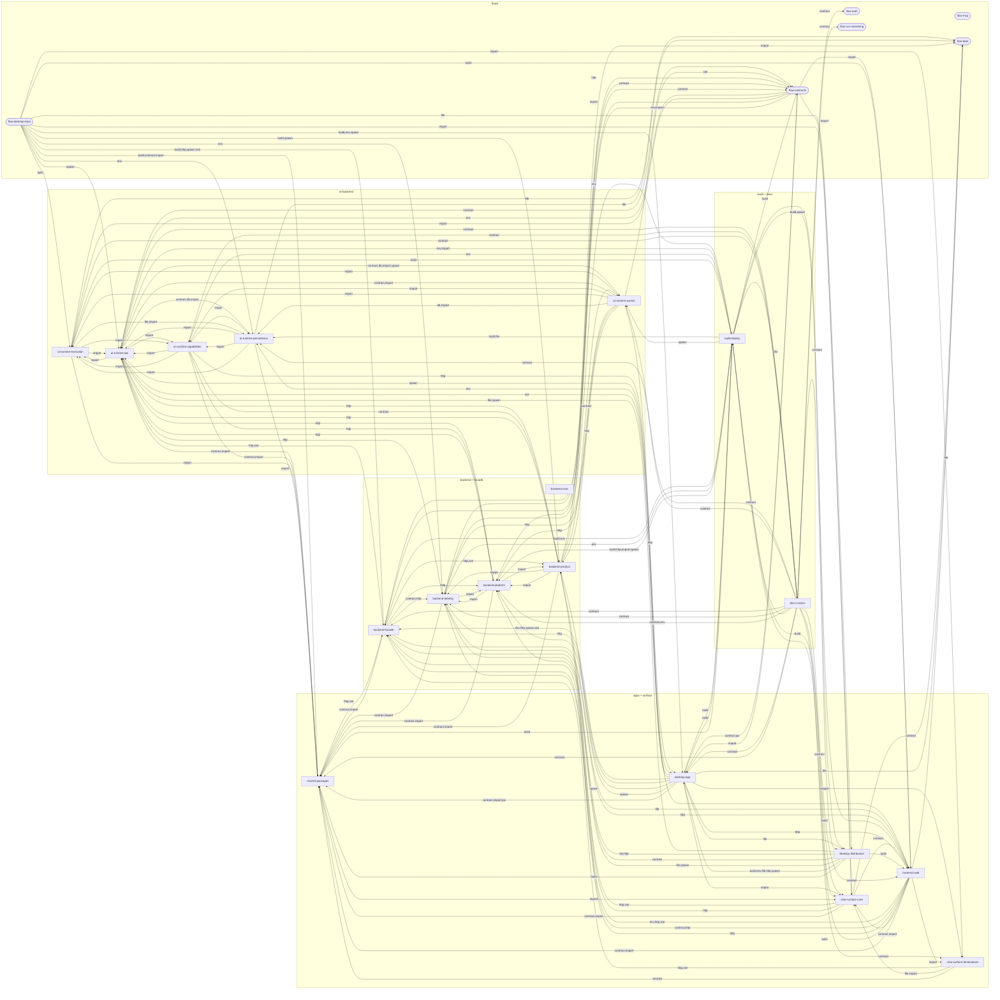

# 0xCopilot Architecture Knowledge Graph

Merged from 24 graph partials (18 clusters + 6 end-to-end flows). Every edge endpoint references an existing node id; module-level edges are collapsed to clusters in the diagram below.

## Stats

- **Cluster records:** 24 (18 clusters + 6 flows)
- **Nodes:** 367 total (18 synthetic cluster nodes, 31 external systems)
- **Edges:** 681 resolved, 0 dropped, 0 endpoint remaps

### Nodes by kind

| kind | count |
| --- | ---: |
| module | 218 |
| external | 33 |
| doc | 21 |
| cluster | 18 |
| store | 18 |
| tool | 17 |
| route-group | 15 |
| process | 12 |
| flow | 6 |
| package | 6 |
| service | 2 |
| app | 1 |

### Edges by kind

| kind | count |
| --- | ---: |
| import | 284 |
| http | 142 |
| contract | 85 |
| build | 34 |
| spawn | 30 |
| db | 28 |
| file | 26 |
| env | 25 |
| sse | 17 |
| ipc | 10 |

## Cluster-level graph

Directed cluster→cluster edges (module edges collapsed, self-loops omitted, external systems in their own section). Edge labels list the distinct relation kinds.

## Clusters

### ai-runtime-execution — AI Runtime — Execution Core

*cluster* · md: `docs/audit/clusters/01-ai-runtime-execution.md`

Domain heart of ai-backend: the runtime factory that assembles a Deep Agents/LangGraph harness from injected capability ports, plus model resolution and depth budgets, prompt assembly, tool-error policy, in-process subagent delegation, memory routing/compression, run-budget preflight/charging, LiteLLM-vendored pricing, and deployment-profile toggles. Well-engineered contract-first core with a visible layer of dead machinery (async subagent lifecycle, unread depth-scaled tool budget) and prompt-vs-enforcement SSOT drift.

**Nodes (15)**

| id | kind | path | summary |
| --- | --- | --- | --- |
| `ai-runtime-execution/contracts` | module | `services/ai-backend/src/agent_runtime/execution/contracts.py` | Frozen Pydantic contract layer (AgentRuntimeContext, RuntimeDependencies, ModelConfig, StreamEvent, error envelopes) + ports.py protocols and typed AgentRuntimeError; consumed service-wide. |
| `ai-runtime-execution/factory` | module | `services/ai-backend/src/agent_runtime/execution/factory.py` | acreate_agent_runtime: 5-way parallel capability listing, prompt assembly, CompositeBackend routing, HITL permission wiring, policy model-kwargs, deep-agent builder kickoff; graph.py langgraph.json shim. |
| `ai-runtime-execution/deep-agent-builder` | module | `services/ai-backend/src/agent_runtime/execution/deep_agent_builder.py` | Single funnel for create_deep_agent and init_chat_model/init_embeddings; harness-profile registration, checkpointer singleton (InMemory or desktop AsyncSqlite), OpenAI-compat registry (OpenRouter/Ollama), workspace/user policy kwargs. |
| `ai-runtime-execution/invocation` | module | `services/ai-backend/src/agent_runtime/execution/runtime.py` | Traced ainvoke/astream/resume helpers over the harness plus LangGraph config builder (thread_id=run_id, hashed identity metadata). |
| `ai-runtime-execution/model-resolution` | module | `services/ai-backend/src/agent_runtime/execution/models.py` | ModelConfigResolver: provider normalization/inference, BYOK-aware credential gate, defaults merge; depth.py Fast/Balanced/Deep multiplier table applied exactly once. |
| `ai-runtime-execution/tool-error-stack` | module | `services/ai-backend/src/agent_runtime/execution/tool_error_policy.py` | SURFACE_TO_LLM vs FAIL_RUN classification, regex sanitizer stripping paths/IDs/secrets from exception text, structured hint extraction, terminal ToolOutcome enum. |
| `ai-runtime-execution/citation-adapters` | module | `services/ai-backend/src/agent_runtime/execution/providers` | Per-provider (Anthropic/OpenAI Responses/Gemini grounding) native-citation stream adapters behind CitationStreamPipeline; no-op fallback for other providers. |
| `ai-runtime-execution/subagent-delegation` | module | `services/ai-backend/src/agent_runtime/delegation/subagents` | atlas_task_tool monkey-patch of deepagents' task tool for deterministic supervisor_task_call_id linkage; DynamicSubagentCatalog with permission visibility; SubagentDefinition + fs-permission contracts. |
| `ai-runtime-execution/subagent-async-lifecycle` | module | `services/ai-backend/src/agent_runtime/delegation/subagents/runner.py` | Start/check/update/cancel async task state machine + handoff builder over a SubagentRunner protocol — no production consumer (test-only dead code, finding F2). |
| `ai-runtime-execution/memory` | module | `services/ai-backend/src/agent_runtime/context/memory` | Scoped memory route planning (/memories, /policies, /skills), read/write policy with user toggle and phrase-list injection guard, inline/offload/summarize compression, chars/4 token estimator. |
| `ai-runtime-execution/subagent-trace` | module | `services/ai-backend/src/agent_runtime/context/memory/subagent_trace.py` | Read-only Deep Agents backend projecting runtime_events into virtual /subagents/<task_id>/ files (conversation, tool_calls, summary, events.jsonl); imports runtime_api.schemas (layering inversion, F3). |
| `ai-runtime-execution/prompts` | module | `services/ai-backend/src/agent_runtime/prompts` | Supervisor DEFAULT_INSTRUCTIONS, MCP/skill card prompt blocks, builtin tool description strings (re-exported via capabilities constants). |
| `ai-runtime-execution/budgets` | module | `services/ai-backend/src/agent_runtime/budgets` | Pre-run Allow/Warn/Deny preflight with TTL reservations, post-run CAS charge idempotent on run_id, conservative cost estimator, UTC period window math. |
| `ai-runtime-execution/pricing` | module | `services/ai-backend/src/agent_runtime/pricing` | Integer micro-USD CostCalculator, LRU pricing catalog cache, vendored LiteLLM JSON ingestion + YAML seeds/overrides, idempotent upsert planner, sanity-bounded 24h refresh loop, seed-diff CLI. |
| `ai-runtime-execution/deployment-profile` | module | `services/ai-backend/src/agent_runtime/deployment/profile.py` | ENTERPRISE_DEPLOYMENT_PROFILE → frozen safety toggles matrix (RLS, KMS vault, SIEM, self-signup, pricing source) with fail-closed boot; duplicated per-service by design. |

**Outbound cluster edges**

| → to | kind | label |
| --- | --- | --- |
| ai-runtime-capabilities | import | factory builds McpLoader + load/call/auth MCP tools + discovery cache wiring |
| ai-runtime-persistence | import | Budget*/ChargeOutcome records |
| ai-runtime-api | import | runtime_api.schemas + agent_runtime.api.ports (layering inversion F3) |
| shared-packages | import | copilot_service_contracts.deployment_profile constants |
| external:deepagents | import | create_deep_agent / HarnessProfile / CompositeBackend / FilesystemPermission |
| external:openai | http | ChatOpenAI (native + OpenRouter/Ollama gateways via base_url) |
| external:anthropic | http | ChatAnthropic with extended-thinking kwargs |
| external:ollama | http | keyless local endpoint http://localhost:11434/v1 (OLLAMA_BASE_URL) |
| external:sqlite | file | AsyncSqliteSaver at <RUNTIME_FILE_STORE_ROOT>/index/checkpoints.sqlite3 |
| external:litellm | file | vendored model_prices.json pricing catalog (via pricing module) |
| ai-runtime-persistence | file | LangGraph AsyncSqliteSaver checkpoints at <root>/index/checkpoints.sqlite3 mirroring FileStoreLayout.index_dir |
| ai-runtime-worker | import | INVERSION: agent_runtime/api fork flows import WorkerAuditEmitter |
| flow-data | file | AsyncSqliteSaver at <file-store>/index/checkpoints.sqlite3 (desktop only) |

**Inbound cluster edges**

| ← from | kind | label |
| --- | --- | --- |
| ai-runtime-api | import | AgentRuntimeContext, ModelConfigResolver, RuntimeErrorCode contracts |
| ai-runtime-capabilities | import | AgentRuntimeContext/RuntimeContract/typed errors |
| ai-runtime-worker | import | run handler builds harness via acreate_agent_runtime |
| ai-runtime-persistence | import | adapters use BudgetReservationManager.expires_at TTL |
| build-deploy | build | langgraph.json exports execution/graph.py:create_graph |
| docs-corpus | contract | AC track: file store, checkpointers, Monty, browser worker, TODO status board |
| flow-contracts | import | ai-backend deployment profile loader + adapter allowlist loaded from service-contracts |
| flow-desktop-boot | build | copies services/ai-backend src+migrations+config+skills into the staged tree |

### ai-runtime-capabilities — AI Runtime — Capabilities (tools/MCP/skills/sandbox)

*cluster* · md: `docs/audit/clusters/02-ai-runtime-capabilities.md`

The agent runtime's capability layer: MCP dynamic load/dispatch, skills, built-in tools, three code-execution subsystems, desktop workspace/browser bridges, and the cross-cutting per-call middleware (budget, error policy, retry, citations, display metadata). Well-typed and fail-closed, but ~16% of its 19k LOC is production-dead (render_adapter_generator, dynamic tool registry, in-process code sandbox, mcp/files) and it violates the agent_runtime pure-domain rule by importing runtime_api.schemas at runtime.

**Nodes (15)**

| id | kind | path | summary |
| --- | --- | --- | --- |
| `ai-runtime-capabilities/mcp` | module | `services/ai-backend/src/agent_runtime/capabilities/mcp` | MCP contracts, provider-backed registry, load pipeline with TTL+LRU discovery cache, protocol-error classification, dispatcher-unwrap helper, and the three model-facing MCP tools (load_mcp_server, call_mcp_tool, auth_mcp). |
| `ai-runtime-capabilities/mcp-backend-provider` | module | `services/ai-backend/src/agent_runtime/capabilities/mcp/backend_provider.py` | HTTP adapter to backend's /internal/v1 MCP surface: server cards, auth sessions, JSON-RPC proxy client; synthesises display templates at descriptor build time. |
| `ai-runtime-capabilities/tools` | module | `services/ai-backend/src/agent_runtime/capabilities/tools` | ToolCard/permission/privacy contracts and built-in tools (ask_a_question, suggest_mcp_connector, prior_results). Also contains the production-dead dynamic tool registry/loader/load_tool and in-process code sandbox. |
| `ai-runtime-capabilities/skills` | module | `services/ai-backend/src/agent_runtime/capabilities/skills` | SKILL.md manifest parser, backend-backed virtual skill registry (HTTP cards + bundles), filesystem source discovery, access policy, load_skill tool. |
| `ai-runtime-capabilities/citations` | module | `services/ai-backend/src/agent_runtime/capabilities/citations.py` | Two-lane citation system: CitationLedger [cN] tokens + source_ingested events for provider grounding; conversation-scoped [[N]] ordinals + citation_made events for tool calls (projection, capturing tool, resolver, ordinal allocator). |
| `ai-runtime-capabilities/tool-middleware` | module | `services/ai-backend/src/agent_runtime/capabilities/tool_budget_guard.py` | Per-call cross-cutting wrappers: budget admit/warn/reject (middleware + ContextVar guard + registry decorator), error-policy classification wrapper, retrying wrapper. |
| `ai-runtime-capabilities/display-metadata` | module | `services/ai-backend/src/agent_runtime/capabilities/middleware/display_metadata.py` | Deterministic display-template synthesis from tool names/JSON schemas plus the _display_title/_display_summary args-schema wrap/strip machinery. |
| `ai-runtime-capabilities/interpreter` | module | `services/ai-backend/src/agent_runtime/capabilities/interpreter` | AC6 Monty embedded interpreter: ports/contracts, HitlPolicyToolInvoker (budget -> interrupt approval -> dispatch), snapshot store, env-gated registration seam. |
| `ai-runtime-capabilities/sandbox` | module | `services/ai-backend/src/agent_runtime/capabilities/sandbox` | AC7 remote sandbox: lifecycle service with TTL/leak detection, policy-enforced Deep Agents backend with command budget, workspace transfer/patch manifests, lazy LangSmith provider, run_in_sandbox tool. |
| `ai-runtime-capabilities/desktop-workspace` | module | `services/ai-backend/src/agent_runtime/capabilities/desktop` | AC5 /workspace/ Deep Agents backend over the Electron capability broker: mount table over grants, read routes, approval-gated snapshot-before-write mutations, typed loopback HTTP client. |
| `ai-runtime-capabilities/browser-mcp` | module | `services/ai-backend/src/agent_runtime/capabilities/browser` | AC8 desktop browser MCP provider/client over the browser broker loopback; side-effecting tools marked HIGH risk to ride the standard MCP HITL interrupt. |
| `ai-runtime-capabilities/draft-backend` | module | `services/ai-backend/src/agent_runtime/capabilities/backends/draft_backend.py` | Deep Agents BackendProtocol over /drafts/ mapped to DraftStorePort with versioning and draft event emission. |
| `ai-runtime-capabilities/auth-gate` | module | `services/ai-backend/src/agent_runtime/capabilities/auth_gate.py` | Connector reachability gate (built-in tools always authenticated; MCP servers checked by auth_state/enabled) used before draft sends and approval dispatch. |
| `ai-runtime-capabilities/http-pool` | module | `services/ai-backend/src/agent_runtime/capabilities/http_pool.py` | Process-scoped pooled httpx.AsyncClient shared by all ai-backend -> backend/broker HTTP calls; closed on API/worker shutdown. |
| `ai-runtime-capabilities/render-adapter-generator` | module | `services/ai-backend/src/agent_runtime/capabilities/render_adapter_generator` | Constrained-template React adapter codegen with import allowlist auditing. PRODUCTION-DEAD: consumed only by its own tests. |

**Outbound cluster edges**

| → to | kind | label |
| --- | --- | --- |
| backend-platform | http | /internal/v1 MCP cards, auth sessions, JSON-RPC proxy (ENTERPRISE_SERVICE_TOKEN headers) |
| external:mcp-servers | http | real MCP servers reached via backend RPC proxy |
| desktop-app | http | capability broker loopback /v1/fs/* + grants (DESKTOP_BROKER_URL/TOKEN) |
| ai-runtime-api | import | BOUNDARY VIOLATION: runtime imports of runtime_api.schemas (RunRecord, RuntimeApiEventType) from domain modules |
| ai-runtime-persistence | import | CitationRecord + CitationStorePort + ConversationToolOrdinalStorePort |
| ai-runtime-execution | import | AgentRuntimeContext/RuntimeContract/typed errors |
| external:langsmith | import | lazy LangSmith sandbox SDK provider |
| external:monty | import | lazy pydantic_monty interpreter dependency |
| external:deepagents | import | BackendProtocol implementation |
| external:langchain | import | BaseTool wrapper classes |
| external:langgraph | import | interrupt() HITL seam in auth_mcp / ask_a_question / InterruptApprovalGate |
| shared-packages | contract | copilot_service_contracts.headers service-token header names |
| backend-product | contract | ai-backend re-declares MCP enums + McpServerCard for the /internal/v1 card feed (third copy of the MCP enum set) |
| shared-packages | import | 6B generator auditor loads the allowlist via copilot_service_contracts |

**Inbound cluster edges**

| ← from | kind | label |
| --- | --- | --- |
| ai-runtime-api | import | BackendHttpPool, McpDiscoveryCache, CapabilityAuthGate wiring |
| ai-runtime-worker | import | composes ToolErrorPolicy > ToolBudget > CitationCapturing registry stack per run |
| ai-runtime-execution | import | factory builds McpLoader + load/call/auth MCP tools + discovery cache wiring |
| build-deploy | env | RUNTIME_ENABLE_REMOTE_SANDBOX / RUNTIME_SANDBOX_* gates |
| ai-runtime-persistence | import | memory backend routes/contracts + subagent trace projector |
| docs-corpus | contract | ToolBudgetMiddleware.check_admit unwired-from-production claim |

### ai-runtime-persistence — AI Runtime — Persistence & Store Adapters

*cluster* · md: `docs/audit/clusters/03-ai-runtime-persistence.md`

Durable-state substrate of the agent runtime: Pydantic persistence records, satellite store ports, field-level envelope encryption, yoyo migrations, a pure retention-policy resolver, and three swappable adapter families (in-memory, Postgres, desktop file/JSONL) composed into RuntimePorts by an env-driven factory. Contracts are strong but the ~90-method structural PersistencePort has already drifted (Postgres is missing three live approval methods), citation wiring is split-brain off-postgres, and the file adapter duplicates the in-memory adapter's logic nearly verbatim.

**Nodes (14)**

| id | kind | path | summary |
| --- | --- | --- | --- |
| `ai-runtime-persistence/records` | module | `services/ai-backend/src/agent_runtime/persistence/records` | Pydantic contracts for every persisted aggregate (approvals, batches, budgets, citations, drafts, outbox, retention, shares, telemetry, todo extractions, tool ordinals) plus shared enums and normalizers. |
| `ai-runtime-persistence/ports` | module | `services/ai-backend/src/agent_runtime/persistence/ports.py` | Seven runtime-checkable satellite store Protocols (drafts, subagents, sources, citations, ordinals, shares, todo extractions) and typed conflict exceptions. |
| `ai-runtime-persistence/encryption` | module | `services/ai-backend/src/agent_runtime/persistence/encryption.py` | C7 field-level envelope encryption: AES-256-GCM with KMS-wrapped per-row DEKs, AAD bound to (table,column,org), FieldCodec text/JSONB facade, env-driven factory, lazy AWS KMS adapter, OTel metrics. |
| `ai-runtime-persistence/schema` | module | `services/ai-backend/src/agent_runtime/persistence/schema` | Yoyo-backed MigrationRunner pinned to services/ai-backend/migrations with MANIFEST.lock checksum verification; legacy test-only SQL catalog shim. |
| `ai-runtime-persistence/concurrency` | module | `services/ai-backend/src/agent_runtime/persistence/optimistic.py` | Typed CAS-miss errors and with_optimistic_retry (bounded exponential backoff + jitter + OTel retry counter). |
| `ai-runtime-persistence/retention-resolver` | module | `services/ai-backend/src/agent_runtime/retention/policy_resolver.py` | Pure most-specific-wins retention TTL resolver (conversation > assistant > user > org > deployment default) layering per-user privacy overrides; shared by sweeper jobs, retention routes, and coordinators. |
| `ai-runtime-persistence/adapter-base` | module | `services/ai-backend/src/runtime_adapters/base.py` | Shared adapter helpers: run status-transition timestamps, run-request message construction (sync + async siblings), metadata field constants. |
| `ai-runtime-persistence/factory` | module | `services/ai-backend/src/runtime_adapters/factory.py` | RuntimeAdapterFactory + frozen RuntimePorts bundle; dispatches on RUNTIME_STORE_BACKEND; file backend fail-closes unless single_user_desktop profile and RUNTIME_FILE_STORE_ROOT are set. |
| `ai-runtime-persistence/in-memory-store` | store | `services/ai-backend/src/runtime_adapters/in_memory` | Deterministic async in-memory implementation of the full port surface plus 8 satellites; retention sweep is an explicit no-op stub; hash-chained audit log. |
| `ai-runtime-persistence/postgres-store` | store | `services/ai-backend/src/runtime_adapters/postgres` | Production adapter: psycopg async pool with env-tuned guards, RLS session vars, field-encryption codec at insert/read, lock-free event appends with UNIQUE-retry, chunked retention sweeps for 8 kinds, read-replica routing. Missing three PersistencePort approval methods (F1). |
| `ai-runtime-persistence/file-store` | store | `services/ai-backend/src/runtime_adapters/file/runtime_api_store.py` | Desktop single_user_desktop backend: canonical JSONL session folders + append-with-fold state ledgers, in-memory materialized view rebuilt on open, disposable SQLite catalog, physical deletion with legal-hold skip and object GC, signed audit chain. |
| `ai-runtime-persistence/file-internals` | module | `services/ai-backend/src/runtime_adapters/file` | File-store building blocks: traversal-safe hashed layout, fsync JSONL IO, state ledgers, SQLite catalog + FTS, quota guard, eraser/reachability GC, health tracker, telemetry, content-addressed object store, signed operation manifests. |
| `ai-runtime-persistence/file-lifecycle-tools` | tool | `services/ai-backend/src/runtime_adapters/migrate.py` | Operator tooling: offline Postgres/in-memory to file-store migration CLI with verify pass, corruption diagnose/salvage/repair CLI, portable conversation export/import archiver (export/import currently unmounted). |
| `ai-runtime-persistence/file-runtime-seams` | module | `services/ai-backend/src/runtime_adapters/file/agent_state_store.py` | Desktop Deep Agents seams: file-native memory/skills/subagent-def stores, /subagents/ trace backend, /large_tool_results/ blob backend, offload writer, durable satellite stores (citations, drafts, shares, ordinals). |

**Outbound cluster edges**

| → to | kind | label |
| --- | --- | --- |
| ai-runtime-api | import | adapters use records + RuntimeEventPresentationProjector.activity_kind_for during replay (F1) |
| ai-runtime-execution | import | adapters use BudgetReservationManager.expires_at TTL |
| external:postgres | db | psycopg async pool, RLS session vars, LISTEN/NOTIFY |
| external:aws-kms | http | boto3 wrap/unwrap of per-row DEKs |
| external:sqlite | db | disposable catalog index + FTS at index/catalog.sqlite3 |
| shared-packages | import | copilot_audit_chain AuditChainSigner (also imported by in-memory and postgres stores) |
| ai-runtime-capabilities | import | memory backend routes/contracts + subagent trace projector |
| flow-data | file | file adapter writes canonical JSONL sessions + object store |

**Inbound cluster edges**

| ← from | kind | label |
| --- | --- | --- |
| ai-runtime-api | import | RuntimeAdapterFactory.from_settings builds RuntimePorts |
| ai-runtime-api | contract | in_memory + postgres + file adapters implement these Protocols |
| ai-runtime-capabilities | import | CitationRecord + CitationStorePort + ConversationToolOrdinalStorePort |
| ai-runtime-execution | import | Budget*/ChargeOutcome records |
| ai-runtime-worker | import | worker main builds role=worker RuntimePorts; loop duck-checks CitationStorePort (F2) |
| desktop-app | env | supervisor sets RUNTIME_STORE_BACKEND=file + RUNTIME_FILE_STORE_ROOT |
| ai-runtime-execution | file | LangGraph AsyncSqliteSaver checkpoints at <root>/index/checkpoints.sqlite3 mirroring FileStoreLayout.index_dir |
| build-deploy | build | MANIFEST.lock checksum + reader-method CI checks |
| ai-runtime-worker | db | usage rollup upserts + retention sweeps via PersistencePort |
| build-deploy | file | check_reader_methods scans services/ai-backend/src for write SQL in @reader methods; MANIFEST.lock format shared with both migrate.py implementations |
| docs-corpus | contract | RLS, field-encryption, retention/deletion, audit-durability runbooks over runtime tables |
| ai-runtime-api | db | delete_user_history: legal-hold gate, tombstone, chained+encrypted audit row |
| flow-desktop-boot | env | RUNTIME_STORE_BACKEND=postgres\|file, RUNTIME_FILE_STORE_ROOT, RUNTIME_MIGRATIONS_AUTO_APPLY=false |

### ai-runtime-api — AI Runtime — HTTP/SSE API layer

*cluster* · md: `docs/audit/clusters/04-ai-runtime-api.md`

FastAPI ingress of ai-backend: conversations/runs/approvals/usage/budgets/retention/shares/drafts/local-models routes, SSE run + inbox streaming with sequence_no reconnect, the coordinator/service layer behind them, and the observability toolkit (redacted logging, OTel, usage recording). Consumed only by backend-facade over HTTP; hands work to the runtime worker via queued commands. Well-engineered core with soft security defaults (log-only RBAC, always-ready readiness), a process-local inbox bus under a 4-worker gunicorn image, and a circular agent_runtime↔runtime_api import graph.

**Nodes (15)**

| id | kind | path | summary |
| --- | --- | --- | --- |
| `ai-runtime-api/app-factory` | service | `services/ai-backend/src/runtime_api/app.py` | RuntimeApiAppFactory: wires coordinators, event bus, optional services, routers, lifespan (store open/migrate, MCP cache, in-process worker) |
| `ai-runtime-api/auth-rbac` | module | `services/ai-backend/src/runtime_api/auth.py` | Service-token validation + trusted-header identity (auth.py, identity.py) and RequireScopes/RequireAnyScope RBAC with audit\|enforce modes (rbac.py) |
| `ai-runtime-api/http-routes` | route-group | `services/ai-backend/src/runtime_api/http` | /v1/agent, /v1/usage, /v1/budgets, /v1/retention, /v1/local-models, /v1/todo-extractions, /internal/v1 routers + global error mapper (16 files) |
| `ai-runtime-api/schemas` | module | `services/ai-backend/src/runtime_api/schemas` | Pydantic wire contracts for every surface; events.py holds RuntimeEventEnvelope + RuntimeEventPresentationProjector (activity_kind/display_title projection, payload sanitisation) |
| `ai-runtime-api/sse` | module | `services/ai-backend/src/runtime_api/sse` | Run-stream SSE adapter with replay+push-wakeup loop; InMemory and Postgres LISTEN/NOTIFY event buses; process-local per-user inbox bus + adapter |
| `ai-runtime-api/local-models` | module | `services/ai-backend/src/runtime_api/local_models` | Ollama daemon client (version/tags/ps/pull/delete), HF GGUF size resolver, pull-progress annotation service |
| `ai-runtime-api/system-skills` | module | `services/ai-backend/src/runtime_api/system_skills.py` | Projects filesystem-shipped skills under skills/ into the settings-UI wire shape for /internal/v1/skills/system |
| `ai-runtime-api/health` | module | `services/ai-backend/src/runtime_api/routes/health.py` | /healthz + /readyz; readiness checker registry exists but no checkers are wired (always ready) |
| `ai-runtime-api/coordinators` | module | `services/ai-backend/src/agent_runtime/api` | Run/Conversation/Approval coordinators + ConversationQueryService + WorkspaceCoordinator: run create/cancel, context sealing, approval decisions/forwarding/undo, replay reads |
| `ai-runtime-api/domain-services` | module | `services/ai-backend/src/agent_runtime/api/share_service.py` | Share lifecycle + token mint/hash, share-fork and self-fork engines, draft service with capability auth-gate, workspace feeds/defaults, UsageQueryService rollup math, model catalog |
| `ai-runtime-api/event-producer` | module | `services/ai-backend/src/agent_runtime/api/events.py` | RuntimeEventProducer chokepoint (sanitise, project presentation, lifecycle ledger, append, SSE notify) + PresentationGenerator/DeterministicTemplates + RunTerminationCoordinator + MCP discovery offers |
| `ai-runtime-api/backend-resolvers` | module | `services/ai-backend/src/agent_runtime/api/user_policies_resolver.py` | HTTP+Null resolvers for backend-owned facts: policy snapshots incl. BYOK keys (ProviderKeysParser/Hydrator), membership w/ TTL cache, connector suggestions, projects, routines, todos, notification dispatch |
| `ai-runtime-api/ports` | module | `services/ai-backend/src/agent_runtime/api/ports.py` | Async Protocol port definitions (PersistencePort, EventStorePort, RuntimeQueuePort, lifecycle, satellite stores) implemented by runtime_adapters |
| `ai-runtime-api/observability` | module | `services/ai-backend/src/agent_runtime/observability` | PII-safe logging + redaction deny-keys, OTel bootstrap w/ safe-attribute processor, W3C queue trace propagation, token-usage extractor registry, UsageRecorder single write boundary, lifecycle ledger, metric meters |
| `ai-runtime-api/service-config` | module | `services/ai-backend/src/agent_runtime/settings.py` | Catch-all: RuntimeSettings env surface, deployment-profile resolver, validation helpers, prompts, pricing catalog (litellm data + seeds + refresh loop), budget enforcer, retention policy resolver, Dockerfile/pyproject |

**Outbound cluster edges**

| → to | kind | label |
| --- | --- | --- |
| ai-runtime-persistence | import | RuntimeAdapterFactory.from_settings builds RuntimePorts |
| ai-runtime-persistence | contract | in_memory + postgres + file adapters implement these Protocols |
| ai-runtime-worker | spawn | in-process RuntimeWorker task when RUNTIME_START_IN_PROCESS_WORKER=true |
| ai-runtime-worker | contract | RuntimeRunCommand/RuntimeCancelCommand/RuntimeApprovalResolvedCommand enqueued via queue port |
| ai-runtime-worker | import | fork/mcp services import WorkerAuditEmitter from runtime_worker.audit (F1) |
| ai-runtime-execution | import | AgentRuntimeContext, ModelConfigResolver, RuntimeErrorCode contracts |
| ai-runtime-capabilities | import | BackendHttpPool, McpDiscoveryCache, CapabilityAuthGate wiring |
| backend-product | http | GET /internal/v1/policies/runtime (BYOK+policies), membership, suggestions, projects, routines, todos, email notify |
| external:postgres | db | dedicated LISTEN connection on channel runtime_events_v1 |
| external:ollama | http | /api/version,/api/tags,/api/ps,/api/pull (NDJSON),/api/delete |
| external:huggingface | http | GGUF size lookup via HF tree API |
| external:otel-collector | env | OTLP span+metric export; prod fails closed without OTEL_EXPORTER_OTLP_ENDPOINT |
| shared-packages | import | copilot_service_contracts header + scope constants |
| backend-identity | http | GET /internal/v1/policies/runtime at run-create (policies + privacy + decrypted BYOK keys) |
| backend-platform | http | suggestible-connectors at run-create + /internal/v1/policies/runtime at run start |
| shared-packages | contract | copilot_service_contracts.headers for the trusted service-header envelope |
| flow-contracts | contract | runtime_api/schemas Pydantic enums+models hand-mirrored into api-types (44 event types, envelope, statuses) |
| ai-runtime-persistence | db | delete_user_history: legal-hold gate, tombstone, chained+encrypted audit row |
| frontend-web | sse | mcp_auth_required envelope (Connect/Skip card) on the run event stream |
| ai-runtime-worker | db | RuntimeRunCommand/CancelCommand/ApprovalResolvedCommand enqueued on RuntimeQueuePort, claimed by worker loop |

**Inbound cluster edges**

| ← from | kind | label |
| --- | --- | --- |
| backend-facade | http | proxies all /v1 agent traffic to AI_BACKEND_URL :8000 |
| backend-product | http | Library indexer calls POST /internal/v1/llm/embed |
| ai-runtime-worker | import | worker handlers emit envelopes through RuntimeEventProducer + RunTerminationCoordinator |
| ai-runtime-persistence | import | adapters use records + RuntimeEventPresentationProjector.activity_kind_for during replay (F1) |
| ai-runtime-capabilities | import | BOUNDARY VIOLATION: runtime imports of runtime_api.schemas (RunRecord, RuntimeApiEventType) from domain modules |
| ai-runtime-execution | import | runtime_api.schemas + agent_runtime.api.ports (layering inversion F3) |
| ai-runtime-worker | contract | RuntimeEventProducer + runtime_api.schemas command/record contracts |
| backend-facade | sse | GET /v1/agent/runs/{id}/stream pass-through |
| backend-platform | http | GET /v1/agent/runs + /v1/agent/approvals counts (service-token headers) |
| build-deploy | import | check_route_scopes imports runtime_api.app:RuntimeApiAppFactory.create_app to enumerate routes |
| desktop-app | spawn | spawns runtime_api.app uvicorn child (in-process worker, postgres or file store selection) |
| desktop-distribution | file | stages services/ai-backend {src,migrations,scripts,config,skills} + pip site-packages |
| desktop-distribution | spawn | python -m uvicorn runtime_api.app:app (postgres store, in-proc worker, migrations off) |
| docs-corpus | contract | stream-handshake stable event families + projection fields |
| build-deploy | env | RUNTIME_ENVIRONMENT=production + ENTERPRISE_SERVICE_TOKEN fail-closed gate |
| flow-contracts | env | RUNTIME_STORE_BACKEND / RUNTIME_START_IN_PROCESS_WORKER / registry URLs passed by literal name |
| flow-desktop-boot | spawn | uvicorn runtime_api.app:app with RUNTIME_START_IN_PROCESS_WORKER=true |

### ai-runtime-worker — AI Runtime — Worker & Streaming Executor

*cluster* · md: `docs/audit/clusters/05-ai-runtime-worker.md`

Separate process (also runnable in-process in the API) that claims queued run/cancel/approval commands, drives LangGraph execution, and projects raw stream chunks into typed RuntimeEventEnvelope records with monotonic sequence_no, plus per-run usage/budget/audit accounting and desktop-gated capability wiring. Hot path is strong and heavily tested; ~3.2k LOC of jobs/ (routines, todo/proposal extractors, approval expiry) are built and tested but started by no entrypoint, and the approval-resume path has drifted from the run path (no usage/audit/budget/timeout).

**Nodes (16)**

| id | kind | path | summary |
| --- | --- | --- | --- |
| `ai-runtime-worker/entrypoint` | process | `services/ai-backend/src/runtime_worker/__main__.py` | python -m runtime_worker boot: settings, OTel, adapters, MCP cache, BYOK resolver; starts worker + opt-in maintenance loops |
| `ai-runtime-worker/loop` | module | `services/ai-backend/src/runtime_worker/loop.py` | Claim/dispatch/complete state machine with retry vs dead-letter and OTel trace re-parenting; strictly serial in run_forever |
| `ai-runtime-worker/run-handler` | module | `services/ai-backend/src/runtime_worker/handlers/run.py` | Full run lifecycle: budget preflight, 7 ContextVar capability bindings, harness build, stream, final persistence, usage+audit+budget on completion |
| `ai-runtime-worker/approval-handler` | module | `services/ai-backend/src/runtime_worker/handlers/approval.py` | Approval resolution: batch fan-in gate, LangGraph resume, draft-send terminal path; missing usage/audit/budget/timeout vs run path |
| `ai-runtime-worker/cancel-handler` | module | `services/ai-backend/src/runtime_worker/handlers/cancel.py` | Owner-checked status flip to CANCELLED + termination event; does not preempt in-flight streams |
| `ai-runtime-worker/streaming-executor` | module | `services/ai-backend/src/runtime_worker/streaming_executor.py` | Shared chunk loop for run+resume: per-chunk usage attribution, MODEL_CALL_COMPLETED, delta coalescing, interrupt flagging, citation feed |
| `ai-runtime-worker/stream-projection` | module | `services/ai-backend/src/runtime_worker/stream_events.py` | Orchestrator + message/update/custom processors projecting LangGraph chunks into typed events; approval-batch insertion and consent-card synthesis |
| `ai-runtime-worker/approval-recognisers` | module | `services/ai-backend/src/runtime_worker/approval_recognisers.py` | Vendor-specific (Slack/GitHub/Linear/Notion/Atlassian) consent-card param projection and reversibility opinions |
| `ai-runtime-worker/tool-bookkeeping` | module | `services/ai-backend/src/runtime_worker/tool_call_ledger.py` | In-flight tool-call ledger (reconciliation, attribution, budget counts), cross-turn tool-observation prompt context, oversized-result offload |
| `ai-runtime-worker/run-metrics` | module | `services/ai-backend/src/runtime_worker/run_metrics.py` | Run-level + per-LLM-call token accumulation with attribution; materializes usage records |
| `ai-runtime-worker/audit` | module | `services/ai-backend/src/runtime_worker/audit.py` | Typed fail-soft audit rows for run lifecycle, approval decisions, tool outcomes, forks; also imported by agent_runtime (inversion) |
| `ai-runtime-worker/dependencies-factory` | module | `services/ai-backend/src/runtime_worker/dependencies.py` | Default RuntimeDependencies graph: layered tool registries, backend MCP/skill providers, browser gate, file-store wiring, discovery cache |
| `ai-runtime-worker/desktop-wiring` | module | `services/ai-backend/src/runtime_worker/workspace_backend_wiring.py` | Env-gated desktop seams: Monty/sandbox tools, file-store offloader + read backends, broker-granted /workspace/ backend with snapshot emitter |
| `ai-runtime-worker/maintenance-loops` | module | `services/ai-backend/src/runtime_worker/usage_rollup_loop.py` | Wired periodic jobs: usage rollups (5 dimensions), retention sweeper (opt-in), retention backfill (one-shot) |
| `ai-runtime-worker/unwired-jobs` | module | `services/ai-backend/src/runtime_worker/jobs/routine_scheduler.py` | DORMANT ~3.2k LOC: routine scheduler + pre-fire gate, todo/proposal extractors, todo recurrence materializer, approval expiry sweeper — tests are the only consumers |
| `ai-runtime-worker/encryption-backfill` | module | `services/ai-backend/src/runtime_worker/jobs/encrypt_existing_columns.py` | Operator re-encryption of encryption_version=0 rows via direct psycopg; referenced by scripts/count_unencrypted_rows.py |

**Outbound cluster edges**

| → to | kind | label |
| --- | --- | --- |
| ai-runtime-api | import | worker handlers emit envelopes through RuntimeEventProducer + RunTerminationCoordinator |
| ai-runtime-capabilities | import | composes ToolErrorPolicy > ToolBudget > CitationCapturing registry stack per run |
| ai-runtime-execution | import | run handler builds harness via acreate_agent_runtime |
| ai-runtime-persistence | import | worker main builds role=worker RuntimePorts; loop duck-checks CitationStorePort (F2) |
| ai-runtime-api | contract | RuntimeEventProducer + runtime_api.schemas command/record contracts |
| external:postgres | db | store backend (postgres role connections) via adapters |
| backend-identity | http | BYOK per-user provider-key snapshot at claim time |
| backend-platform | http | BackendMcpProvider + BackendSkillProvider over internal lane |
| external:duckduckgo | http | default web_search tool (DuckDuckGoSearchResults + retry) |
| desktop-app | http | capability broker: grants snapshot + /v1/runs/begin\|end pinning |
| backend-product | http | routine claim/fire + todo materialize-due internal endpoints (dormant) |
| external:openai | http | extractor LLM calls via build_chat_model (dormant) |
| ai-runtime-persistence | db | usage rollup upserts + retention sweeps via PersistencePort |
| external:otel-collector | http | trace re-parenting + handler spans |
| flow-contracts | sse | worker-emitted RuntimeEventEnvelope streams to clients; TS mirror + isRuntimeEventEnvelope guard validate at the SSE edge |

**Inbound cluster edges**

| ← from | kind | label |
| --- | --- | --- |
| ai-runtime-api | spawn | in-process RuntimeWorker task when RUNTIME_START_IN_PROCESS_WORKER=true |
| ai-runtime-api | contract | RuntimeRunCommand/RuntimeCancelCommand/RuntimeApprovalResolvedCommand enqueued via queue port |
| ai-runtime-api | import | fork/mcp services import WorkerAuditEmitter from runtime_worker.audit (F1) |
| ai-runtime-execution | import | INVERSION: agent_runtime/api fork flows import WorkerAuditEmitter |
| build-deploy | spawn | compose runs python -m runtime_worker |
| backend-product | contract | RecurrenceRuleEvaluator grammar duplicated with runtime_worker todo_recurrence_materializer |
| docs-corpus | contract | handlers-run / stream-events / stream-tools A-G inventories |
| ai-runtime-api | db | RuntimeRunCommand/CancelCommand/ApprovalResolvedCommand enqueued on RuntimeQueuePort, claimed by worker loop |

### backend-core — Backend — Core chassis (app factory, store, contracts, token vault, MCP OAuth, auth)

*cluster* · md: `docs/audit/clusters/18-backend-core.md`

Security-critical backend chassis: FastAPI app factory (~1620-line create_app), 2571-line contracts god-module (MCP+skills+deploy+entire identity domain), shared store+tamper-evident audit-chain layer, MCP registry/OAuth service, KMS-capable TokenVault, MCP OAuth 2.1 client, service-token auth helper, deployment-profile loader, unified audit reader, desktop composition root. Functional but at risk: confirmed audit-pagination bug (masked by a misleading test), in-memory-only deploy audit, prod fail-open API-key pepper.

**Nodes (13)**

| id | kind | path | summary |
| --- | --- | --- | --- |
| `backend-core/app` | module | `services/backend/src/backend_app/app.py` | create_app FastAPI factory: ~70 kwargs, ~30 subsystems, all MCP/skill/deploy routes + lazy default app (god-factory). |
| `backend-core/contracts` | module | `services/backend/src/backend_app/contracts.py` | 2571-line Pydantic contract library for MCP/skills/deploy/tamper-chain AND the full identity domain; validate_public_mcp_url SSRF guard; 63 inbound importers. |
| `backend-core/store` | module | `services/backend/src/backend_app/store.py` | PostgresConnectionPool + in-memory/Postgres MCP/skill/deploy stores; HMAC audit-chain signing, advisory lock, RLS session vars, cross-tenant guards; deploy store in-memory only. |
| `backend-core/service` | module | `services/backend/src/backend_app/service.py` | McpRegistryService (registration+OAuth+RPC proxy+refresh), SkillRegistryService (+preloaded seeding+SKILL.md parser), ToolCatalogService, DeployAuditService. |
| `backend-core/token_vault` | module | `services/backend/src/backend_app/token_vault.py` | TokenVault interface + LocalTokenVault (Fernet) / ManagedSecretTokenVault / AwsKmsTokenVault; decrypt cache; TokenVaultFactory fail-closed KMS policy. |
| `backend-core/token_vault_metrics` | module | `services/backend/src/backend_app/token_vault_metrics.py` | OTel recorder for vault encrypt/decrypt/cache; no-op when OTel absent. |
| `backend-core/mcp_oauth` | module | `services/backend/src/backend_app/mcp_oauth.py` | OAuth 2.1 client: RFC 8414/9728 discovery, RFC 7591 dynamic client registration, PKCE authorize URL, code/refresh exchange via urlopen. |
| `backend-core/mcp_catalog` | module | `services/backend/src/backend_app/mcp_catalog.py` | Static DEFAULT_CATALOG of 13 well-known remote MCP servers with brand metadata; stable seed:<slug> ids. |
| `backend-core/audit_reader` | module | `services/backend/src/backend_app/audit_reader.py` | Unified read across 4 audit streams; fan-out, merge newest-first, opaque base64-JSON cursor (forward after_seq cursor is buggy for real data). |
| `backend-core/desktop_app` | module | `services/backend/src/backend_app/desktop_app.py` | single_user_desktop composition root: validates 5 env vars, forces profile, wires every Postgres adapter + local Fernet vault + derived API-key pepper. |
| `backend-core/deployment_profile` | module | `services/backend/src/backend_app/deployment_profile.py` | Resolve/validate ENTERPRISE_DEPLOYMENT_PROFILE; per-profile feature toggles; fail-closed-at-boot; stale DEV_AUTH_BYPASS check. |
| `backend-core/auth` | module | `services/backend/src/backend_app/auth.py` | BackendServiceAuthenticator: verifies ENTERPRISE_SERVICE_TOKEN, forwards trusted org/user/roles/scopes headers, dev query fallback; 59 inbound importers. |
| `backend-core/migrations` | module | `services/backend/src/backend_app/migrations.py` | Thin shim exposing SQL constants read from migrations/*.sql; canonical runner is db/migrate.py. |

### backend-identity — Backend — Identity, Auth & Secrets

*cluster* · md: `docs/audit/clusters/06-backend-identity.md`

The identity plane of services/backend: identity store, sessions, OIDC/Google, SAML, passwords, MFA, SCIM, lockout, magic links, SIWE, invitations, RBAC, dev IdP, API keys, BYOK provider keys, tool-use/privacy policies, Team destination, Settings namespaces, plus the claimed TokenVault (Fernet local + AWS KMS envelope). Uniform Protocol-store/dual-adapter/service architecture with strong per-module code; the real debt is in composition wiring (RBAC never enforced, PostgresSiweStore unwired) and hand-mirrored cross-language contracts.

**Nodes (18)**

| id | kind | path | summary |
| --- | --- | --- | --- |
| `backend-identity/identity-core-store` | store | `services/backend/src/backend_app/identity/store.py` | IdentityStore Protocol + InMemory/Postgres adapters: orgs, users, members, roles, auth providers, append-only identity audit + login attempts. |
| `backend-identity/sessions` | module | `services/backend/src/backend_app/identity/sessions.py` | HMAC bearer mint/verify (_BearerCodec), session rows keyed by sha256(signature), touch/revoke/list, MFA-satisfied stamp, retention sweeper. |
| `backend-identity/sso-oidc` | module | `services/backend/src/backend_app/identity/oidc.py` | OIDC authorize→callback→session, JWKS cache + ID-token verify, env-configured global Google provider, PKCE primitives. |
| `backend-identity/sso-saml` | module | `services/backend/src/backend_app/identity/saml.py` | SAML 2.0 mirror of OidcService; SamlVerifier Protocol isolates python3-saml/xmlsec1 behind OneLogin + Fake verifiers. |
| `backend-identity/siwe` | module | `services/backend/src/backend_app/identity/siwe.py` | EIP-4361 build/strict-parse, EIP-191 recovery, chain allowlist, single-use nonces, link-or-provision wallet identities. |
| `backend-identity/passwords-mfa-lockout` | module | `services/backend/src/backend_app/identity/passwords.py` | Argon2id local auth + bootstrap admin, TOTP/WebAuthn/recovery MFA (TokenVault-encrypted seeds), sliding-window lockout on every login path. |
| `backend-identity/login-email-first` | module | `services/backend/src/backend_app/identity/login_email_first.py` | IdP discovery (anti-enumeration), magic links, workspace-pick tokens, in-memory rate limiter, email dispatcher port. |
| `backend-identity/scim` | module | `services/backend/src/backend_app/identity/scim.py` | SCIM 2.0 User/Group CRUD + role sync, filter parser, route-boundary serializer, sha256-at-rest tokens. |
| `backend-identity/invitations-provisioning` | module | `services/backend/src/backend_app/identity/invitations.py` | One-time invite links (accept = user+member+role in one txn); shared provision_personal_org used by Google + SIWE self-signup. |
| `backend-identity/rbac` | module | `services/backend/src/backend_app/identity/rbac.py` | RequireScopes/RequireRoles/public_route FastAPI deps; RBAC_MODE audit-vs-enforce (default audit = pass-through); mfa:pending hard deny. |
| `backend-identity/me-profile` | store | `services/backend/src/backend_app/identity/me_store.py` | user_profiles + user_preferences JSONB sidecars; avatar BYTEA store with ETag. |
| `backend-identity/dev-idp` | route-group | `services/backend/src/backend_app/dev_idp` | Dev-only /v1/dev/personas + /v1/dev/identity/mint; YAML persona directory with mtime reload; standalone HMAC signer; 365-day session-less bearers. |
| `backend-identity/api-keys` | module | `services/backend/src/backend_app/api_keys` | atlas_pk_* bearer parse/mint, peppered HMAC-SHA256 at rest, constant-time verify, CRUD + rotate + last-used stamping. |
| `backend-identity/provider-keys` | module | `services/backend/src/backend_app/provider_keys` | BYOK provider keys: TokenVault encrypt-on-write, hint-only /v1/settings/provider-keys surface, internal decrypted_keys lane for the runtime aggregate. |
| `backend-identity/policies-privacy` | store | `services/backend/src/backend_app/policies/store.py` | tool_use_policies (read/write/destructive × auto/ask/require/block, workspace default + user override) and privacy_settings toggles. |
| `backend-identity/team` | module | `services/backend/src/backend_app/team` | Team destination: read projection over identity tables, invite/role-change/offboard orchestration, in-memory SSE activity bus at /v1/team/stream. |
| `backend-identity/settings` | module | `services/backend/src/backend_app/settings` | Namespace'd JSONB settings: user notifications inside user_preferences, tenant rows in tenant_settings; ACL + audit + deep-merge in the service layer. |
| `backend-identity/token-vault` | module | `services/backend/src/backend_app/token_vault.py` | TokenVault ABC: Fernet LocalTokenVault (+ legacy XOR fallback), kms_v1 envelope, AwsKmsTokenVault, decrypt TTL cache, fail-closed factory, rotation CLI. |

**Outbound cluster edges**

| → to | kind | label |
| --- | --- | --- |
| shared-packages | contract | CLAIM_* bearer claim names from copilot_service_contracts.auth_claims |
| backend-platform | import | BackendServiceAuthenticator trusted-header envelope |
| external:google-oauth | http | pinned Google OIDC endpoints; token exchange + JWKS fetch |
| external:ethereum | import | eth_account EIP-191 signature recovery + EIP-55 checksums |
| external:aws-kms | http | boto3 KMS encrypt/decrypt (kms_v1 envelope) |
| external:postgres | db | Postgres adapters for every identity/session/key store |
| external:saml-idp | http | AuthnRequest/ACS via python3-saml OneLoginSamlVerifier |
| build-deploy | env | ENTERPRISE_AUTH_SECRET / SESSION_* TTLs; RBAC_MODE; SIWE_*; GOOGLE_OAUTH_*; MCP_TOKEN_VAULT_* |
| flow-contracts | contract | byte-exact EIP-4361 template re-parsed server-side; duplicated in frontend siweMessage.ts |
| frontend-web | http | dev persona catalog served from backend YAML via GET /v1/dev/personas (served-not-mirrored, good pattern) |
| shared-packages | import | headers, claims, RBAC scopes, deployment profile |

**Inbound cluster edges**

| ← from | kind | label |
| --- | --- | --- |
| ai-runtime-worker | http | BYOK per-user provider-key snapshot at claim time |
| backend-facade | http | POST /internal/v1/auth/sessions/touch + /internal/v1/auth/api-keys/verify |
| backend-facade | contract | byte-identical HMAC bearer scheme (sign here, verify there) + session touch |
| ai-runtime-api | http | GET /internal/v1/policies/runtime at run-create (policies + privacy + decrypted BYOK keys) |
| frontend-web | contract | byte-identical EIP-4361 message template (siweMessage.ts) |
| desktop-app | http | local no-account login drives /v1/auth/siwe/{nonce,verify} with a third template copy |
| backend-platform | import | wires identity stores/services (sessions, OIDC, SAML, SCIM, SIWE, MFA, RBAC deps) |
| backend-product | import | delegates to identity services (OidcService, SamlService, ScimService, SiweService, MfaService, sessions) |
| desktop-distribution | contract | EIP-4361 message template + 'Sign in to Copilot' statement must byte-match siwe.py (3rd copy) |
| docs-corpus | contract | Google OAuth + SIWE setup; third copy of EIP-4361 template |
| build-deploy | env | self-host compose pins BACKEND_ENVIRONMENT=production + ENTERPRISE_AUTH_SECRET/SERVICE_TOKEN + SIWE_ORIGIN/SIWE_ALLOWED_CHAIN_IDS |
| frontend-web | http | error contract is prose: FE shape-sniffs {detail} and regexes MCP OAuth-setup messages instead of typed codes |
| flow-desktop-boot | env | ENTERPRISE_AUTH_SECRET, SIWE_ORIGIN, GOOGLE_OAUTH_CLIENT_ID/SECRET into the backend child |

### backend-product — Backend — Product Domain Modules

*cluster* · md: `docs/audit/clusters/07-backend-product.md`

The product-destination modules of services/backend (Todos, Inbox, Routines, Projects, Library, Memory, Agents, Tools, Connectors, Home, Palette, adapter registry, webhooks) plus the 29-file identity/settings/admin wire layer in routes/. Per-module engineering is strong (uniform store/service/routes layering, canonical project ACL, careful webhook/OAuth security), but the wiring layer is unfinished: all destination stores are in-memory in every deployment, the web connectors OAuth surface is a stub, and several sizeable modules (agent installs, palette refresh, notification gate, three SSE streams) have no production consumers or producers.

**Nodes (18)**

| id | kind | path | summary |
| --- | --- | --- | --- |
| `backend-product/routes-identity-wire` | route-group | `services/backend/src/backend_app/routes` | /internal/v1/auth\|me\|workspace wire layer over backend-identity services (oidc, saml, scim, siwe, sessions, passwords, mfa, lockouts, invitations, members, workspace, profile, avatar) |
| `backend-product/routes-settings` | route-group | `services/backend/src/backend_app/routes` | Settings/policies routes (preferences, notifications, privacy, tool-use, api-keys, billing stub) with business logic inline at route layer; includes the aggregate /internal/v1/policies/runtime BYOK+policy snapshot |
| `backend-product/routes-audit-siem` | route-group | `services/backend/src/backend_app/routes` | Admin audit export/list, SIEM exporter controls, /healthz+/readyz probes |
| `backend-product/todos` | module | `services/backend/src/backend_app/todos` | Todos CRUD + subtasks + bulk + recurrence materialization; duplicates the RFC-5545-subset evaluator that also lives in ai-backend's worker |
| `backend-product/inbox` | module | `services/backend/src/backend_app/inbox` | Per-user inbox with ai-backend producer endpoint and a live SSE stream (one of only two destination streams with real publishers) |
| `backend-product/routines` | module | `services/backend/src/backend_app/routines` | Routines CRUD + quota + inbound webhook ingest (rotating secret, grace window, HMAC, CIDR allowlist) |
| `backend-product/projects` | module | `services/backend/src/backend_app/projects` | Projects CRUD + membership + atomic ownership transfer + templates; owns the canonical project ACL predicate consumed by every project-scoped destination |
| `backend-product/library` | module | `services/backend/src/backend_app/library` | Library metadata CRUD, hybrid BM25+vector+RRF search, signed-URL blob flow, chunking/embeddings, claim-pattern index-job queue |
| `backend-product/memory` | module | `services/backend/src/backend_app/memory` | Memory CRUD + proposals + search + SSE; deliberately rides Library's index queue and fusion primitives (good DRY) |
| `backend-product/agents` | module | `services/backend/src/backend_app/agents` | Agent catalog CRUD; installs.py (1,058 LOC install/override/fork module) is complete but never registered anywhere |
| `backend-product/tools` | module | `services/backend/src/backend_app/tools` | Tools catalog CRUD + invocations + usage; test-call 501 stub; SSE stream has no producers |
| `backend-product/connectors` | module | `services/backend/src/backend_app/connectors` | Connectors destination read-model; web OAuth aliases stubbed (auth.example URL / 503 callback, no row writer); desktop OAuth coordinator is the real path driving McpRegistryService |
| `backend-product/webhooks` | module | `services/backend/src/backend_app/webhooks` | Outbound webhook manager + HMAC signer constants + rotation worker (no production launcher) |
| `backend-product/home` | module | `services/backend/src/backend_app/home` | Morning-briefing aggregator reading sibling stores off app.state; SSE stream has no producers |
| `backend-product/palette` | module | `services/backend/src/backend_app/palette` | Cmd-K search over palette_index; refresh dispatcher exists but no destination ever writes, so search is always empty |
| `backend-product/adapter-registry` | module | `services/backend/src/backend_app/adapter_registry` | Tier-2 adapter candidate submit/review/promote with audit-chain rows and content-addressed source storage; has a real Postgres adapter + migration |
| `backend-product/notifications-store` | store | `services/backend/src/backend_app/notifications` | Typed notification-prefs store (routes live in routes/); dispatcher_gate.py is test-only dead code |
| `backend-product/prompts` | module | `services/backend/src/backend_app/prompts` | Preloaded skill markdown seeded into each user's skill registry by SkillRegistryService |

**Outbound cluster edges**

| → to | kind | label |
| --- | --- | --- |
| ai-runtime-api | http | Library indexer calls POST /internal/v1/llm/embed |
| backend-identity | import | delegates to identity services (OidcService, SamlService, ScimService, SiweService, MfaService, sessions) |
| backend-platform | import | policies/privacy/api_keys stores + ProviderKeysService (TokenVault-backed) |
| external:postgres | db | PostgresAdapterRegistryStore over migrations/0031_adapter_registry.sql |
| shared-packages | import | copilot_service_contracts scopes/headers constants |
| shared-packages | contract | SSE envelopes hand-mirrored to packages/api-types (InboxEventEnvelope) |
| ai-runtime-worker | contract | RecurrenceRuleEvaluator grammar duplicated with runtime_worker todo_recurrence_materializer |
| flow-contracts | contract | backend_app contracts (MCP, provider keys, todos, settings, home/inbox) hand-mirrored into api-types |
| flow-data | import | create_app defaults every product destination to InMemory* stores |

**Inbound cluster edges**

| ← from | kind | label |
| --- | --- | --- |
| ai-runtime-api | http | GET /internal/v1/policies/runtime (BYOK+policies), membership, suggestions, projects, routines, todos, email notify |
| ai-runtime-worker | http | routine claim/fire + todo materialize-due internal endpoints (dormant) |
| backend-facade | http | /internal/v1/{me,workspace,policies}/* |
| backend-facade | sse | byte-for-byte stream proxies with Last-Event-ID passthrough |
| backend-platform | import | wires destination packages (home/inbox/todos/routines/connectors/projects/library/memory/agents/tools/palette/team/settings) |
| frontend-web | http | connectorsApi.ts calls start-oauth (currently returns stub URL) |
| chat-surface-core | http | PaletteSearchPort -> /v1/palette/search (index never populated) |
| desktop-app | spawn | spawns backend_app.desktop_app uvicorn child with curated env (DB URL, ENTERPRISE_* secrets, SIWE_ORIGIN) |
| ai-runtime-capabilities | contract | ai-backend re-declares MCP enums + McpServerCard for the /internal/v1 card feed (third copy of the MCP enum set) |
| flow-desktop-boot | build | copies services/backend src+migrations+scripts into the staged tree |
| flow-desktop-boot | spawn | python scripts/migrate.py apply then uvicorn backend_app.desktop_app:app |

### backend-platform — Backend — Platform, Audit, MCP registry & Internal API

*cluster* · md: `docs/audit/clusters/08-backend-platform.md`

Platform substrate of services/backend: app composition roots, MCP registry + OAuth + skill registry, token vault, tamper-evident audit chains with list/export/SIEM surfaces, DB pool + versioned migrations, observability, background jobs, liveness aggregator, and the whole /internal/v1/* surface consumed by ai-backend and backend-facade. Core registry/vault/chain machinery is healthy and well-tested; the SIEM/audit egress pipeline is façade-only (pump unwired and schema-broken; Postgres audit reads unimplemented) and create_app is a 1,600-line 60-parameter composition root overdue for decomposition.

**Nodes (20)**

| id | kind | path | summary |
| --- | --- | --- | --- |
| `backend-platform/app-composition` | module | `services/backend/src/backend_app/app.py` | create_app() composition root: wires ~30 subsystems via ~60 injectable kwargs and registers MCP/skills/internal routes inline; PEP 562 lazy module app. |
| `backend-platform/desktop-composition` | module | `services/backend/src/backend_app/desktop_app.py` | single_user_desktop composition root: validates 5 required secrets, forces the desktop profile, wires every existing Postgres adapter. |
| `backend-platform/deployment-profile` | module | `services/backend/src/backend_app/deployment_profile.py` | ENTERPRISE_DEPLOYMENT_PROFILE loader with per-profile feature toggles; fails closed at boot (exit 78); hand-mirrored in facade/ai-backend. |
| `backend-platform/mcp-registry-service` | module | `services/backend/src/backend_app/service.py` | McpRegistryService: MCP install/CRUD, PKCE OAuth sessions, token refresh, internal cards/client-session/RPC proxy; plus static curated catalog (mcp_catalog.py). |
| `backend-platform/skill-registry` | module | `services/backend/src/backend_app/service.py` | SkillRegistryService + SkillMarkdownParser: SKILL.md CRUD, preloaded-skill seeding, internal cards/bundles; ToolCatalogService projection; DeployAuditService. |
| `backend-platform/mcp-oauth-client` | module | `services/backend/src/backend_app/mcp_oauth.py` | RemoteMcpOAuthClient: RFC 8414/7591 discovery, dynamic client registration, PKCE code/refresh exchange over urllib. |
| `backend-platform/stores` | store | `services/backend/src/backend_app/store.py` | PostgresConnectionPool (singleton, RLS session vars, statement timeouts) + in-memory/Postgres MCP & skill stores + in-memory-only deploy-audit store; per-org HMAC chain appends under advisory locks. |
| `backend-platform/token-vault` | module | `services/backend/src/backend_app/token_vault.py` | TokenVault adapter hierarchy: LocalTokenVault (Fernet + legacy XOR fallback) and AwsKmsTokenVault (kms_v1 envelope, decrypt cache, OTel metrics); factory enforces profile fail-closed. |
| `backend-platform/contracts` | module | `services/backend/src/backend_app/contracts.py` | All Pydantic wire/record contracts for MCP, skills, tokens, audit and identity records (2.5k LOC single module). |
| `backend-platform/service-auth` | module | `services/backend/src/backend_app/auth.py` | BackendServiceAuthenticator: ENTERPRISE_SERVICE_TOKEN + x-enterprise-* header identity for internal calls, dev query-param fallback. |
| `backend-platform/internal-api` | route-group | `services/backend/src/backend_app/app.py` | /internal/v1/* surface: MCP cards/client-session/RPC/test-token, skills cards/bundles, suggestible-connectors, audit deploy — consumed only by ai-backend (and facade for audit/liveness). |
| `backend-platform/audit-read` | route-group | `services/backend/src/backend_app/audit_reader.py` | AuditReader 4-stream fan-out with opaque cursor + /internal/v1/audit/list + NDJSON /internal/v1/audit/export; only in-memory stores implement the readers (empty under Postgres). |
| `backend-platform/siem-export` | module | `services/backend/src/backend_app/siem_export` | NormalizedEvent + 5 exporters (null/file/splunk_hec/elastic/syslog_cef), cursor-driven async pump, /v1/siem admin pause/resume/replay routes; pump is unwired and its SQL mismatches the audit schema. |
| `backend-platform/db-migrations` | module | `services/backend/src/backend_app/db/migrate.py` | yoyo-backed MigrationRunner over migrations/*.sql (36 pairs) with MANIFEST.lock sha256 enforcement; scripts/migrate.py operator CLI. |
| `backend-platform/pool-metrics` | module | `services/backend/src/backend_app/db/pool_metrics.py` | OTel gauges/histograms for the sync psycopg pool; mirrors ai-backend's pool_metrics module. |
| `backend-platform/observability` | module | `services/backend/src/backend_app/observability` | Typed LogEvent JSON logging with metadata redaction, pure-ASGI request-context middleware, OTel bootstrap with span-attribute denylist processor (production requires OTLP endpoint). |
| `backend-platform/jobs-library-indexer` | process | `services/backend/src/backend_app/jobs/library_indexer.py` | Claim→extract→chunk→embed→insert loop over library_index_jobs with retry/backoff and content-hash idempotency; never started by any composition root. |
| `backend-platform/liveness` | module | `services/backend/src/backend_app/liveness` | LivenessService: is-project-alive aggregation over ai-backend runs/approvals + in-process routines/inbox stores, 2s TTL cache, per-source fail-open; /internal/v1/liveness route. |
| `backend-platform/runtime-policies-route` | route-group | `services/backend/src/backend_app/routes/runtime_policies.py` | GET /internal/v1/policies/runtime — aggregate tool-use + privacy + decrypted BYOK provider-keys snapshot consumed by ai-backend at run start. |
| `backend-platform/ops` | tool | `services/backend/scripts` | Operator CLIs: migrate.py, rotate_token_vault.py (KMS re-encrypt), restore_smoke.py, backfill_notification_preferences.py; Dockerfile ships src+migrations+scripts. |

**Outbound cluster edges**

| → to | kind | label |
| --- | --- | --- |
| backend-identity | import | wires identity stores/services (sessions, OIDC, SAML, SCIM, SIWE, MFA, RBAC deps) |
| backend-product | import | wires destination packages (home/inbox/todos/routines/connectors/projects/library/memory/agents/tools/palette/team/settings) |
| external:mcp-servers | http | JSON-RPC proxy + OAuth discovery/registration/token exchange to remote MCP servers |
| external:postgres | db | psycopg_pool shared pool; mcp_servers/skills/audit chains; RLS session vars |
| shared-packages | import | copilot_audit_chain.AuditChainSigner for HMAC hash-chain signing |
| shared-packages | contract | copilot_service_contracts headers + scopes constants |
| external:aws-kms | http | boto3 KMS encrypt/decrypt (aws_kms backend) |
| external:otel-collector | http | OTLP gRPC span + metric export (production fail-closed without endpoint) |
| ai-runtime-api | http | GET /v1/agent/runs + /v1/agent/approvals counts (service-token headers) |
| external:siem | http | Splunk HEC / Elastic _bulk / syslog-CEF exporters |

**Inbound cluster edges**

| ← from | kind | label |
| --- | --- | --- |
| ai-runtime-capabilities | http | /internal/v1 MCP cards, auth sessions, JSON-RPC proxy (ENTERPRISE_SERVICE_TOKEN headers) |
| ai-runtime-worker | http | BackendMcpProvider + BackendSkillProvider over internal lane |
| backend-facade | http | /v1/mcp/*, /v1/skills/*, /v1/dev/* proxies |
| backend-identity | import | BackendServiceAuthenticator trusted-header envelope |
| ai-runtime-api | http | suggestible-connectors at run-create + /internal/v1/policies/runtime at run start |
| desktop-app | spawn | supervised child: uvicorn backend_app.desktop_app:app against embedded Postgres |
| build-deploy | build | Dockerfile installs service-contracts + audit-chain wheels, ships src+migrations+scripts |
| backend-product | import | policies/privacy/api_keys stores + ProviderKeysService (TokenVault-backed) |
| build-deploy | import | check_route_scopes imports backend_app.app:create_app; check_audit_in_transaction AST-scans service.py |
| build-deploy | http | post_audit.py POSTs deploy audit event to /internal/v1/audit/deploy with x-enterprise-service-token |
| build-deploy | spawn | boots backend desktop_app composition root + migrate job + facade + ai-backend API/worker + SPA behind nginx |
| desktop-distribution | file | stages services/backend {src,migrations,scripts} + hash-locked pip site-packages |
| desktop-distribution | spawn | python -m uvicorn backend_app.desktop_app:app (production, single_user_desktop) |
| docs-corpus | env | ENTERPRISE_DEPLOYMENT_PROFILE toggle matrix + RUNTIME_DB_*/BACKEND_DB_* contracts |
| docs-corpus | contract | SIEM export pump, token-vault key rotation, service-auth trust matrix |
| flow-contracts | import | deployment-profile constants + headers + scopes imported; ~200-LOC loader re-implemented per service |
| flow-contracts | env | desktop supervisor sets ~20 env names as string literals that Python settings loaders must match (BACKEND_BASE_URL breakage precedent) |

### backend-facade — Backend Facade — Product-facing API gateway

*cluster* · md: `docs/audit/clusters/09-backend-facade.md`

Single app-facing HTTP surface (:8200) that verifies bearers and forwards /v1/* to backend (identity, MCP, product destinations) and ai-backend (conversations, runs, usage, local models), including byte-for-byte SSE stream proxies. Stateless by design; owns bearer verification (HMAC + cached session touch), deployment-profile fail-closed boot, redacting observability, and env-gated desktop wallet-page serving. Healthy trust-boundary discipline but heavy copy-paste boilerplate and a two-tier auth inconsistency: the core /v1/agent surface skips session touch and token expiry.

**Nodes (14)**

| id | kind | path | summary |
| --- | --- | --- | --- |
| `backend-facade/app-core` | service | `services/backend-facade/src/backend_facade/app.py` | create_app bootstrap + forward_json kernel + ~85 inline handlers: MCP registry, agent conversations/runs/drafts/shares, skills merge, usage, budgets, telemetry relay, dev-IdP proxy, run SSE stream. |
| `backend-facade/auth` | module | `services/backend-facade/src/backend_facade/auth.py` | FacadeAuthenticator: HMAC bearer verify, verify_with_touch with 30s TTL-bucketed LRU touch cache, atlas_pk_ API-key verify via backend, service-header stamping, step-up MFA gate. |
| `backend-facade/auth-routes` | route-group | `services/backend-facade/src/backend_facade/auth_routes.py` | /v1/auth/*: public login ramps (OIDC, SAML, SIWE, password, magic-link, discover), session list/revoke/logout, MFA enroll/challenge/verify/recovery, login-attempts. |
| `backend-facade/me-workspace-routes` | route-group | `services/backend-facade/src/backend_facade/me_routes.py` | /v1/me/* (profile, preferences, notifications, API keys, MFA factors, avatar, policies) + /v1/workspace/* admin (members, invitations, billing, mfa-policy, api-keys) + SCIM /scim/v2/* pass-through. |
| `backend-facade/destination-proxies` | route-group | `services/backend-facade/src/backend_facade/tool_routes.py` | Sixteen near-identical forwarders for product destinations on backend: tools, connectors (+desktop OAuth), connector webhooks, inbox, home, library, memory, palette, projects, routines, team, todos, agents, liveness, settings — six with SSE stream proxies. |
| `backend-facade/audit-merge` | module | `services/backend-facade/src/backend_facade/audit_routes.py` | GET /v1/audit: fans out to backend + ai-backend internal audit lists, merge-sorts by created_at with composite base64 cursor and per-stream degradation — the facade's one real aggregation. |
| `backend-facade/adapter-routes` | route-group | `services/backend-facade/src/backend_facade/adapter_registry_routes.py` | Tier-2 adapter registry submit/promoted/opt-out plus admin review trio; the admin routes are registered by BOTH adapter_registry_routes and adapter_review_routes — the review (touch-authenticated) copies are shadowed dead code. |
| `backend-facade/local-models-proxy` | route-group | `services/backend-facade/src/backend_facade/local_models_routes.py` | /v1/local-models proxy onto ai-backend: status/list/size/delete JSON plus SSE pull-progress stream for local Ollama models. |
| `backend-facade/webhook-ingest` | route-group | `services/backend-facade/src/backend_facade/routines_webhook_routes.py` | POST /v1/webhook/routines/{trigger_id}: bearer-free HMAC-secret webhook proxy with byte-exact body forwarding and X-Forwarded-For chain for audit fidelity. |
| `backend-facade/wallet-page` | module | `services/backend-facade/src/backend_facade/wallet_page_routes.py` | Env-gated static serving of the built frontend wallet.html + /assets so the packaged desktop's SIWE sign-in is same-origin with /v1/auth/siwe/* (FACADE_WEB_DIST_DIR set by the desktop supervisor). |
| `backend-facade/http-pool` | module | `services/backend-facade/src/backend_facade/http_client.py` | Lifespan-owned shared httpx.AsyncClient per worker (100 conns / 20 keepalive) amortizing TLS across upstream calls; http_client(app) accessor used by every route. |
| `backend-facade/settings-profile` | module | `services/backend-facade/src/backend_facade/deployment_profile.py` | FacadeSettings (BACKEND_URL / AI_BACKEND_URL / OTEL collector / web dist dir) plus deployment-profile resolver with per-profile safety toggles and fail-closed boot (exit 78). |
| `backend-facade/observability` | module | `services/backend-facade/src/backend_facade/observability` | Redacting JSON structured logging (Pydantic LogEvent, metadata denylist), OTEL bootstrap with SafeAttributeSpanProcessor, pure-ASGI RequestContextMiddleware (request-id propagation, access log), plus /healthz + /readyz. |
| `backend-facade/tests` | module | `services/backend-facade/tests` | 33 files / 207 tests: per-module proxy behavior, tenant isolation, session binding + touch cache, deployment profile, observability redaction, IdP ramps (SAML/SIWE/Google/SCIM), public route contract. |

**Outbound cluster edges**

| → to | kind | label |
| --- | --- | --- |
| ai-runtime-api | http | proxies all /v1 agent traffic to AI_BACKEND_URL :8000 |
| backend-identity | http | POST /internal/v1/auth/sessions/touch + /internal/v1/auth/api-keys/verify |
| backend-product | http | /internal/v1/{me,workspace,policies}/* |
| backend-product | sse | byte-for-byte stream proxies with Last-Event-ID passthrough |
| backend-platform | http | /v1/mcp/*, /v1/skills/*, /v1/dev/* proxies |
| ai-runtime-api | sse | GET /v1/agent/runs/{id}/stream pass-through |
| external:otel-collector | http | browser OTLP trace relay POST /v1/telemetry/otlp/v1/traces |
| shared-packages | contract | copilot_service_contracts headers + auth_claims constants |
| backend-identity | contract | byte-identical HMAC bearer scheme (sign here, verify there) + session touch |
| frontend-web | file | serves the built frontend wallet.html + assets same-origin for the desktop SIWE handoff (FACADE_WEB_DIST_DIR) |
| flow-contracts | http | facade forwards producer bytes without re-modeling (0 response BaseModels), so api-types mirrors the producers directly |
| external:mcp-servers | http | OAuth provider browser redirect terminates at public GET /v1/mcp/oauth/callback (state-anchored) |
| shared-packages | import | auth claim names + internal headers + deployment profile |

**Inbound cluster edges**

| ← from | kind | label |
| --- | --- | --- |
| frontend-web | http | all /v1/* API calls via Vite proxy / nginx to :8200 |
| desktop-app | env | supervisor sets FACADE_WEB_DIST_DIR; opens {facade}/wallet.html for SIWE |
| desktop-app | spawn | supervised facade process in packaged desktop boot |
| chat-surface-core | sse | run event streaming via chat-transport against facade origin |
| build-deploy | build | Dockerfile (python:3.14-slim!) + GHCR image in self-host compose |
| build-deploy | env | docker-dev still sets legacy DEV_AUTH_BYPASS=true + FACADE_DEV_ORG_ID/USER_ID for the facade |
| chat-surface-core | http | TcChat GET /v1/agent/conversations/{id}/messages |
| chat-surface-destinations | http | GET/POST /v1/agent/runs, POST /v1/agent/approvals/{id}/decision (via Transport port) |
| chat-surface-destinations | sse | GET /v1/agent/runs/{id}/stream?after_sequence=N (event: runtime_event) |
| desktop-app | http | WebTransport /v1/* with main-attached bearer + 401 refresh-retry |
| desktop-app | sse | run event stream subscriptions proxied to transport.stream-event pushes |
| desktop-distribution | file | stages services/backend-facade src + hash-locked pip site-packages |
| desktop-distribution | http | spawns backend_facade.app:app then smokes /v1/health, /v1/auth/providers, /v1/dev absence |
| docs-corpus | contract | facade-only rule (:8200) for all app/API access |
| flow-contracts | import | facade's own deployment-profile loader imports shared constants ('same module exists in each of the three services') |
| flow-desktop-boot | build | copies services/backend-facade src into the staged tree |
| flow-desktop-boot | spawn | uvicorn backend_facade.app:app with BACKEND_URL/AI_BACKEND_URL/FACADE_WEB_DIST_DIR |
| flow-desktop-boot | http | health gate GET /v1/health (90s budget) before ready |
| flow-desktop-boot | sse | subscribeServerSentEvents relayed to renderer stream.event channel |
| frontend-web | sse | legacy ChatScreen streamRunEvents with its own reconnect/backoff |
| frontend-web | env | BACKEND_FACADE_URL dev-proxy target for /v1 (default 127.0.0.1:8200) |
| shared-packages | http | typed /v1/* requests with bearer + x-request-id |
| shared-packages | sse | streaming-fetch SSE (run event streams) |

### frontend-web — Frontend Web App

*cluster* · md: `docs/audit/clusters/10-frontend-web.md`

Vite + React 19 web client (~102.5k LOC) that hosts the chat-surface SSOT shell: six-destination solo rail, host data binders, a large host-owned ChatScreen run cockpit, and web implementations of the substrate ports. Talks only to backend-facade over /v1 HTTP + SSE through a single WebTransport singleton. Disciplined architecture, but carries ~17.8k LOC of dead folded destinations, a web-only Settings that duplicates chat-surface's, and phantom workspace dependencies.

**Nodes (16)**

| id | kind | path | summary |
| --- | --- | --- | --- |
| `frontend-web/app-shell` | module | `apps/frontend/src/app` | App.tsx providers + AuthGate + destination dispatch + MCP OAuth callback; HashRouter (Router-port impl); AppRoute union + folded-slug redirect map; keymap. |
| `frontend-web/auth` | module | `apps/frontend/src/features/auth` | AuthContext state machine (bearer via SecretStorage, dev-IdP silent re-auth), LoginScreen (Google / SIWE wallet / local persona), MfaPrompt (WebAuthn), SIWE message builder + EIP-6963 discovery, wallet handoff page. |
| `frontend-web/wallet-entry` | route-group | `apps/frontend/wallet.html` | Second Vite entry: standalone SIWE sign-in page that relays a minted bearer to the desktop app's loopback listener (walletEntry.tsx -> WalletHandoffPage). |
| `frontend-web/api-client` | module | `apps/frontend/src/api` | Typed /v1 client modules (agentApi, connectorsApi, projectsApi, meApi, authApi, mcpApi, localModelsApi, ...) + useResource hooks; 176 unique facade endpoints; includes 8 dead modules for folded destinations. |
| `frontend-web/transport` | module | `apps/frontend/src/api/transport.ts` | Module-singleton WebTransport (from @0x-copilot/chat-transport) owning bearer attachment, 401 notification, and SSE; http.ts helpers route everything through it. |
| `frontend-web/chat-cockpit` | module | `apps/frontend/src/features/chat` | ChatScreen (2.7k LOC) run cockpit + 157 components (thread, tools, workspace pane, details, composer adapters over chat-surface shells) + bespoke Atlas runtime (attachments, dictation, thread primitives). |
| `frontend-web/chat-model` | module | `apps/frontend/src/features/chat/chatModel` | Pure, replay-safe event reducers: chat items, citations, citation links, sources, subagents, drafts, approvals, MCP auth, run UI state (chatRunState). |
| `frontend-web/destination-binders` | module | `apps/frontend/src/features` | Live host binders: ChatsArchiveRoute, ActivityRoute (+activityApi composition), SkillsRoute, ProjectsRoute, TemplateGalleryRoute, TeamGateway, PaletteHost — fetch/compose product endpoints and mount chat-surface destination components. |
| `frontend-web/connectors` | module | `apps/frontend/src/features/connectors` | Connectors destination: gateway (list/detail/webhooks), MCP install wizard overlay, per-chat connector scope hooks, webhooks route. |
| `frontend-web/settings` | module | `apps/frontend/src/features/settings` | Web-only SettingsScreen + 17 section panels (profile, appearance, provider keys, local models, MFA, privacy, notifications, workspace/members/billing/audit) + P12 SettingsGateway. Duplicates chat-surface settings pages used by desktop. |
| `frontend-web/profile-prefs` | module | `apps/frontend/src/features/me` | UserProfile / UserPreferences contexts + AppearanceContext (single writer for theme/density/motion attrs + debounced server save); share screens; workspace member helpers. |
| `frontend-web/admin-adapter-review` | module | `apps/frontend/src/admin/adapter-review` | Admin-role-gated tier-2 adapter review queue/detail/preview with synthetic demo states. |
| `frontend-web/ports` | module | `apps/frontend/src/ports` | Web implementations of chat-surface substrate ports: Badge, Notification (navigates via Router), FilePicker, Clipboard, PortProvider. |
| `frontend-web/observability` | module | `apps/frontend/src/observability` | Light OTel API surface + idle-loaded SDK chunk exporting OTLP to the same-origin facade passthrough; attribute-allowlist span processor; global error handlers + ErrorBoundary. |
| `frontend-web/dead-folded-features` | module | `apps/frontend/src/features/home` | DEAD (~17.8k LOC incl. api modules + tests): home, library, inbox, todos, routines, agents, memory, tools features folded out by PR-4.11; parked for the Phase-6C sweep; zero non-test importers. |
| `frontend-web/build` | tool | `apps/frontend/Dockerfile` | Vite two-entry build (main + wallet) with route-level code splitting; Docker multi-stage -> nginx:8080 SPA; eslint substrate-boundary config; vitest+jsdom. |

**Outbound cluster edges**

| → to | kind | label |
| --- | --- | --- |
| backend-facade | http | all /v1/* API calls via Vite proxy / nginx to :8200 |
| backend-identity | contract | byte-identical EIP-4361 message template (siweMessage.ts) |
| backend-product | http | connectorsApi.ts calls start-oauth (currently returns stub URL) |
| chat-surface-core | import | web host mounts ChatShell + port impls + wraps reducers (106 importing files) |
| chat-surface-destinations | import | ProjectsRoute mounts ProjectsDestination + ProjectDetailView |
| external:ethereum | ipc | EIP-6963 wallet discovery + personal_sign of the EIP-4361 message |
| shared-packages | contract | @0x-copilot/api-types payload shapes for SIWE/auth responses |
| shared-packages | import | web host constructs singleton WebTransport from chat-transport |
| backend-identity | http | error contract is prose: FE shape-sniffs {detail} and regexes MCP OAuth-setup messages instead of typed codes |
| flow-data | file | bearer + persona + UI prefs persisted in localStorage |
| backend-facade | sse | legacy ChatScreen streamRunEvents with its own reconnect/backoff |
| external:google-oauth | http | Continue-with-Google redirect via facade /v1/auth/oidc/google/start |
| build-deploy | build | ci-frontend.yml builds the Docker image; Dockerfile hand-copies chat-surface/chat-transport/api-types/design-system sources |
| backend-facade | env | BACKEND_FACADE_URL dev-proxy target for /v1 (default 127.0.0.1:8200) |
| chat-surface-core | contract | implements chat-surface Badge/Notification/FilePicker/Clipboard port interfaces |

**Inbound cluster edges**

| ← from | kind | label |
| --- | --- | --- |
| build-deploy | build | ci-frontend: typecheck + vite build (runs no vitest suites; filter misses chat-surface/chat-transport) |
| desktop-distribution | build | builds/stages apps/frontend/dist (wallet.html) -> <dest>/web for facade FACADE_WEB_DIST_DIR |
| docs-corpus | contract | web redesign PR specs (waves 0-9, citations, settings, approvals) |
| backend-facade | file | serves the built frontend wallet.html + assets same-origin for the desktop SIWE handoff (FACADE_WEB_DIST_DIR) |
| flow-contracts | import | frontend api modules import request/response types; SSE frames validated with isRuntimeEventEnvelope |
| backend-identity | http | dev persona catalog served from backend YAML via GET /v1/dev/personas (served-not-mirrored, good pattern) |
| chat-surface-core | contract | UI DeploymentProfile ('single_user_desktop'\|'team') re-hardcodes a backend profile value; 'team' has no backend counterpart |
| flow-desktop-boot | build | stages apps/frontend/dist (wallet.html) to <dest>/web for the facade |
| ai-runtime-api | sse | mcp_auth_required envelope (Connect/Skip card) on the run event stream |
| desktop-app | http | packaged desktop opens deployed /wallet.html for SIWE bearer handoff (URL contract) |

### chat-surface-core — Chat Surface — Core (shell, canvas, composer, ports)

*cluster* · md: `docs/audit/clusters/11-chat-surface-core.md`

The substrate-agnostic SSOT interaction layer both web and desktop mount: ChatShell + Run-cockpit ThreadCanvas + composer + citation/subagent/approval/workspace families + Settings surface, all behind a typed ports contract (Transport/Router/KeyValueStore/SecretStorage/Presence/Palette/etc.) with an eslint-enforced browser-primitive ban. Architecture is disciplined and well unit-tested, but no CI runs its lint/tests, the 'one event projection' cockpit invariant has forked (second SSE in TcSwimlanes, mostly-dead projector slices), and several acknowledged duplications (depth models, subagent reducers, aui CSS, legacy web Settings) await convergence.

**Nodes (18)**

| id | kind | path | summary |
| --- | --- | --- | --- |
| `chat-surface-core/barrel` | package | `packages/chat-surface/src/index.ts` | 1,269-line phase-blocked public barrel; hosts consume only through it (main/types both point at src/index.ts). |
| `chat-surface-core/ports` | module | `packages/chat-surface/src/ports` | The substrate contract: Transport/Router/KeyValueStore/SecretStorage/PresenceSignal/SurfaceHost/Badge/Notification/FilePicker/Clipboard/PaletteSearch ports; contract-tested re-export facade. |
| `chat-surface-core/providers` | module | `packages/chat-surface/src/providers` | React context per port (strict Transport/Router/DeploymentProfile; tolerant KV/Secret/Presence) + NotificationCenter toast SSOT. |
| `chat-surface-core/web-port-impls` | module | `packages/chat-surface/src/storage` | Web reference implementations via globalThis convention: LocalStorageKeyValueStore, WebSecretStorage (dev-grade), DocumentPresenceSignal, HashRouter. |
| `chat-surface-core/routing` | module | `packages/chat-surface/src/routing` | Router<TRoute> port, ArtifactRoute union, artifact-URI schemes/parser, HashRouter web impl; ROUTE_TABLE is stub vestige. |
| `chat-surface-core/shell` | module | `packages/chat-surface/src/shell` | ChatShell grid + AppRail/Topbar/ContextPanel/RightRail + primitives + the destinations SSOT (slug/label/profile rail) and shortcuts SSOT (12 chords) + CommandPalette. |
| `chat-surface-core/thread-canvas` | module | `packages/chat-surface/src/thread-canvas` | Single-mount Run cockpit canvas: eventProjector + TcChat + TcSwimlanes + TcMiniTimeline + TcSurfaceMount + TcInlineDiff; modes are presentation slots, never remounts. |
| `chat-surface-core/run-session` | module | `packages/chat-surface/src/destinations/run/useRunSession.ts` | Canonical run resolver + cursor-resumed SSE tail owner (exported through the barrel; file lives under destinations/run, shared scope with chat-surface-destinations). |
| `chat-surface-core/composer` | module | `packages/chat-surface/src/composer` | Composer (1.6k LOC) + AssistantComposer shell + model/tool/depth pickers + composer.css; two coexisting depth models and hardcoded model lists. |
| `chat-surface-core/messages` | module | `packages/chat-surface/src/messages` | Streamdown-based streaming markdown, citation href helpers + remark plugin, reasoning groups. |
| `chat-surface-core/citations` | module | `packages/chat-surface/src/citations` | Citation context/chips/Sources surfaces + pure citation/link registries (the converged family — web host wraps these reducers). |
| `chat-surface-core/subagents` | module | `packages/chat-surface/src/subagents` | Subagent/fleet cards + projectSubagents pure selector; subagentHelpers reproduces the web host's chatModel/subagentStatus.ts. |
| `chat-surface-core/approvals` | module | `packages/chat-surface/src/approvals` | Presentational ApprovalCard/Receipt/undo-countdown; decision wiring stays host-owned. |
| `chat-surface-core/workspace` | module | `packages/chat-surface/src/workspace` | Right-rail WorkspacePane + five tab bodies; boundary types structurally mirror host hooks (deferred convergence). |
| `chat-surface-core/surfaces` | module | `packages/chat-surface/src/surfaces` | Module-singleton SaaS renderer adapter registry (version-sorted, broken-marking), pure-render adapter contract (D28), Tier2Loader, tier-3 GenericStructuredDiff. |
| `chat-surface-core/refs` | module | `packages/chat-surface/src/refs` | ItemLink + module-singleton ItemRef resolver registry — one resolution path for palette hits and inline refs. |
| `chat-surface-core/settings` | module | `packages/chat-surface/src/settings` | SettingsSurface + settingsNav SSOT + 12 section bodies + Transport-backed provider-keys/developer-tokens port factories (desktop mounts it; web still on legacy SettingsScreen). |
| `chat-surface-core/errors-util` | module | `packages/chat-surface/src/errors` | parseTransportError/humanTransportMessage (facade envelope + Electron IPC prefix recovery) and formatRelativeTime SSOT. |

**Outbound cluster edges**

| → to | kind | label |
| --- | --- | --- |
| backend-facade | sse | run event streaming via chat-transport against facade origin |
| backend-product | http | PaletteSearchPort -> /v1/palette/search (index never populated) |
| shared-packages | contract | Transport types re-exported from @0x-copilot/chat-transport |
| shared-packages | import | design-system components (Badge/Button/Select/TextInput/Toggle) |
| external:streamdown | import | streaming markdown renderer peer dep |
| backend-facade | http | TcChat GET /v1/agent/conversations/{id}/messages |
| frontend-web | contract | UI DeploymentProfile ('single_user_desktop'\|'team') re-hardcodes a backend profile value; 'team' has no backend counterpart |
| flow-data | contract | KeyValueStore port; hosts bind LocalStorageKeyValueStore |

**Inbound cluster edges**

| ← from | kind | label |
| --- | --- | --- |
| frontend-web | import | web host mounts ChatShell + port impls + wraps reducers (106 importing files) |
| desktop-app | import | desktop renderer mounts ChatShell/SettingsSurface, drives Tier2 registerAdapter |
| chat-surface-destinations | import | destinations consume shell primitives, ports/providers, families, util/time |
| shared-packages | import | surface-renderers registers tier-1 adapters into SurfaceRegistry |
| build-deploy | build | ci-desktop path filter + release-desktop bundle inline; NO job runs package lint/tests |
| chat-surface-destinations | file | KeyValueStore port key chats.thread.<id>.run_mode |
| docs-corpus | contract | SSOT ADR: hoist interaction layer into chat-surface behind ports |
| flow-contracts | import | chat-surface consumes wire types from api-types (ActivityRunRow, provider keys, envelopes) |
| flow-desktop-boot | import | mounts ChatShell + profile/destination SSOT from @0x-copilot/chat-surface |
| frontend-web | contract | implements chat-surface Badge/Notification/FilePicker/Clipboard port interfaces |

### chat-surface-destinations — Chat Surface — Destinations & Settings

*cluster* · md: `docs/audit/clusters/12-chat-surface-destinations.md`

The destination surfaces (Run cockpit, Chats archive, Projects, Activity, Connectors/Tools, Skills) and the adaptive profile-gated Settings surface of the chat-surface SSOT interaction layer. The live sixth is high quality (single-projection Run cockpit, ports discipline, SSOT nav), but ~68% of the source LOC — nine folded destination families plus unadopted detail views/wizards — has no mount on either host, and the web host keeps parallel Settings/Run/webhook/team implementations.

**Nodes (11)**

| id | kind | path | summary |
| --- | --- | --- | --- |
| `chat-surface-destinations/run` | module | `packages/chat-surface/src/destinations/run` | Run cockpit: RunDestination composition shell + useRunSession (SSE run stream, resume cursor) + useRunMode (Studio/Focus KV persistence) + pure approval/subagent projections; desktop-only mount |
| `chat-surface-destinations/chats` | module | `packages/chat-surface/src/destinations/chats` | ChatsArchive conversation archive (live on both hosts); legacy ChatsDestination/ChatsSidebar superseded and unmounted |
| `chat-surface-destinations/activity` | module | `packages/chat-surface/src/destinations/activity` | Day-grouped run-history feed absorbing the former Agents/Inbox/audit surfaces; live on both hosts |
| `chat-surface-destinations/projects` | module | `packages/chat-surface/src/destinations/projects` | ProjectsDestination + ProjectDetailView (live both hosts); editors, template gallery, and dialogs (~3.1k LOC) built but unadopted |
| `chat-surface-destinations/connectors` | module | `packages/chat-surface/src/destinations/connectors` | 'Tools' surface: connector grid + AccessModeSegment + ConnectModal (live); ConnectorDetailView tabs + webhooks family (~3k LOC) unadopted |
| `chat-surface-destinations/skills` | module | `packages/chat-surface/src/destinations/skills` | Redesigned 'Skills' slug: card catalog of /v1/skills saved workflows; live on both hosts |
| `chat-surface-destinations/settings-surface` | module | `packages/chat-surface/src/settings` | SettingsSurface shell + settingsNav.ts SSOT (slug union, grouped nav, team profile gate) + SaveBar/Modal/chrome primitives |
| `chat-surface-destinations/settings-pages` | module | `packages/chat-surface/src/settings` | Ten section bodies (Profile, Appearance, Shortcuts, Provider keys, Local models, Model & behavior, Privacy, Notifications, App lock, Developer tokens); mounted by desktop only — web keeps a parallel implementation |
| `chat-surface-destinations/settings-data-ports` | module | `packages/chat-surface/src/settings/data` | Transport-backed adapters: createProviderKeysPort (/v1/settings/provider-keys, BYOK key_hint discipline) and createDeveloperTokensPort (/v1/me/api-keys) |
| `chat-surface-destinations/folded-destinations` | module | `packages/chat-surface/src/destinations` | DEAD: home, inbox, todos, agents, library, memory, routines, team, and the old MCP tools catalog (~32k LOC) — no mount on either host, reachable only via the barrel and their own tests |
| `chat-surface-destinations/wire-stubs` | module | `packages/chat-surface/src/destinations` | Transitional _*-stub.ts wire-type modules (7 files) with TODO(merge) markers; canonical api-types modules have landed but the rewire never happened |

**Outbound cluster edges**

| → to | kind | label |
| --- | --- | --- |
| chat-surface-core | import | destinations consume shell primitives, ports/providers, families, util/time |
| backend-facade | http | GET/POST /v1/agent/runs, POST /v1/agent/approvals/{id}/decision (via Transport port) |
| backend-facade | sse | GET /v1/agent/runs/{id}/stream?after_sequence=N (event: runtime_event) |
| shared-packages | contract | RuntimeEventEnvelope + isRuntimeEventEnvelope, AgentRunStatus from api-types |
| chat-surface-core | file | KeyValueStore port key chats.thread.<id>.run_mode |

**Inbound cluster edges**

| ← from | kind | label |
| --- | --- | --- |
| desktop-app | import | RunBinder mounts RunDestination for the run slug |
| frontend-web | import | ProjectsRoute mounts ProjectsDestination + ProjectDetailView |
| docs-corpus | contract | 11 destination PRDs + binding cross-audit ItemRef contract |
| flow-desktop-boot | import | binds Chats/Projects/Activity/Tools/Skills destination components over the Transport port |

### desktop-app — Desktop App (Electron)

*cluster* · md: `docs/audit/clusters/13-desktop-app.md`

Electron client that supervises an embedded PostgreSQL plus the three Python services from a bundled runtime, mounts the shared chat-surface ChatShell in a locked-down renderer (connect-src 'none'; all HTTP/SSE proxied over allowlisted IPC through main), and owns real end-user auth (Google/SIWE/local-key), folder-grant capabilities, and the tier-2 adapter pipeline. Structurally excellent and heavily tested, but carries large built-but-unwired subsystems (AC8 browser, AC5 broker env delivery) and web-duplicated projection/model-catalog logic.

**Nodes (13)**

| id | kind | path | summary |
| --- | --- | --- | --- |
| `desktop-app/main-boot` | process | `apps/desktop/main/index.ts` | Composition root: app lifecycle, single-instance lock, app:// protocol + CSP, brand identity, dev/prod posture resolution, deep links, auto-update, and wiring of transport/auth/capability/connector/tier2 subsystems. |
| `desktop-app/service-supervisor` | module | `apps/desktop/main/services` | Pure boot state machine + OS composition: keychain boot secrets, port allocation, embedded Postgres lifecycle, migration gates, curated per-service child envs, uvicorn child babysitting with crash-loop detection, health polling, rotating logs. |
| `desktop-app/auth` | module | `apps/desktop/main/auth` | AuthService: Google system-browser+loopback OIDC, SIWE wallet-page flow, production-safe local-key SIWE, dev-mint (dev posture only), keychain session storage, JSONL auth audit, fail-closed boot session probe. |
| `desktop-app/ipc` | module | `apps/desktop/main/ipc` | IPC surface: channel registration with Zod validation both directions, TransportBridge (IPC<->Transport with SSE subscription lifecycle), sandboxed preload allowlist with stateful boot/update channel replay. |
| `desktop-app/capabilities` | module | `apps/desktop/main/capabilities` | AC5 folder grants: native picker (main owns paths), encrypted grant store, authenticated loopback FS broker (/v1/fs/*, /v1/runs/*), two-gate path validation, per-run grant snapshots. Gated by RUNTIME_ENABLE_DESKTOP_FILESYSTEM; token delivery to the AI worker is missing. |
| `desktop-app/agent-browser` | module | `apps/desktop/main/browser` | AC8 agentic browser: supervised Playwright worker child, hardened loopback broker with replay protection, deny-by-default egress policy + anti-rebinding CONNECT proxy, profile isolation, staging. Built and tested but wired nowhere (no import from main, no worker build task). |
| `desktop-app/tier2-adapters` | module | `apps/desktop/main/adapters` | Phase-6 tier-2 adapter pipeline: schema validation, AST allowlist scan, vm sandbox, smoke render, on-disk installer, append-only lifecycle audit, retry budget, boundary-error demotion. Install path idles on a stub event source; harvest/download/loader/opt-out modules are consumer-less. |
| `desktop-app/connectors` | module | `apps/desktop/main/connectors` | AC9 connector service: reconciled catalog via facade, system-browser OAuth connect with loopback + enterprise:// deep-link race demuxed by 256-bit state; only safe metadata crosses to the renderer. |
| `desktop-app/renderer-shell` | module | `apps/desktop/renderer` | Renderer shell: mounts shared ChatShell, BootProgress gate, SignInGate (wallet/Google/local), SettingsMount binding every section, controlled cmd-K palette with static command registry, Tier2Bridge into the chat-surface registry. |
| `desktop-app/renderer-binders` | module | `apps/desktop/renderer/destinationBinders.tsx` | Desktop-native destination binders (Chats/Activity/Connectors/Skills/Projects/Run): fetch via the IPC-proxied Transport and re-implement the web binders' pure projections (acknowledged duplication). |
| `desktop-app/renderer-composer` | module | `apps/desktop/renderer/composer` | Shared AssistantComposer bound to desktop substrate ports: file picker, attachment adapter, slash-menu prompts, hardcoded curated model catalog + BYOK/local readiness probes, run dispatch. |
| `desktop-app/native-workspace-fs` | module | `apps/desktop/native/workspace-fs` | Optional C native addon for race-free filesystem ops, loaded best-effort by capabilities/host-fs.ts with a JS fallback when the .node binary is absent. |
| `desktop-app/build-config` | tool | `apps/desktop/esbuild.config.mjs` | Build & packaging: three esbuild bundles (main CJS, preload CJS, renderer ESM), electron-builder config with extraResources runtime mapping and GH-release updater feed, eslint boundary bans (no apps/* sibling imports, no renderer fetch/electron). |

**Outbound cluster edges**

| → to | kind | label |
| --- | --- | --- |
| ai-runtime-persistence | env | supervisor sets RUNTIME_STORE_BACKEND=file + RUNTIME_FILE_STORE_ROOT |
| backend-facade | env | supervisor sets FACADE_WEB_DIST_DIR; opens {facade}/wallet.html for SIWE |
| backend-facade | spawn | supervised facade process in packaged desktop boot |
| backend-identity | http | local no-account login drives /v1/auth/siwe/{nonce,verify} with a third template copy |
| backend-platform | spawn | supervised child: uvicorn backend_app.desktop_app:app against embedded Postgres |
| chat-surface-core | import | desktop renderer mounts ChatShell/SettingsSurface, drives Tier2 registerAdapter |
| chat-surface-destinations | import | RunBinder mounts RunDestination for the run slug |
| backend-facade | http | WebTransport /v1/* with main-attached bearer + 401 refresh-retry |
| backend-facade | sse | run event stream subscriptions proxied to transport.stream-event pushes |
| external:postgres | spawn | embedded postgres: initdb, pg_ctl -w start, createdb via staged python+psycopg |
| backend-product | spawn | spawns backend_app.desktop_app uvicorn child with curated env (DB URL, ENTERPRISE_* secrets, SIWE_ORIGIN) |
| ai-runtime-api | spawn | spawns runtime_api.app uvicorn child (in-process worker, postgres or file store selection) |
| shared-packages | contract | chat-transport CHANNELS + Zod schemas single-sourced for main, preload and renderer |
| external:github | http | electron-updater GH Releases feed (packaged+signed only, install-on-quit) |
| external:google-oauth | http | system browser opened at Google authorization endpoint (PKCE, loopback redirect) |
| external:ethereum | import | viem: per-install local-identity key generation + SIWE message signing |
| desktop-distribution | file | resolveRuntimePaths consumes the runtime tree staged by tools/desktop-runtime/stage.mjs |
| build-deploy | build | electron-builder packaging (extraResources runtime mapping, publish config) + npm workspace scripts |
| shared-packages | import | IpcTransport from chat-transport; surface-renderers registerAll; design-system styles |
| external:ethereum | ipc | local login signs SIWE with a per-install viem secp256k1 key (chain 4663); wallet login delegates to browser wallet |
| flow-contracts | ipc | preload + main + renderer all import CHANNELS/zod schemas; body crosses IPC as z.unknown |
| flow-contracts | contract | third hand copy of the SIWE template in desktop local-login (undocumented) |
| flow-data | file | boot secrets blob (safeStorage), rotating logs, pgdata under userData |
| external:mcp-servers | spawn | opens provider authorization_url in the system browser (openExternal) |
| shared-packages | ipc | renderer IpcTransport -> main TransportBridge replays SSE subscriptions over IPC |
| frontend-web | http | packaged desktop opens deployed /wallet.html for SIWE bearer handoff (URL contract) |

**Inbound cluster edges**

| ← from | kind | label |
| --- | --- | --- |
| ai-runtime-capabilities | http | capability broker loopback /v1/fs/* + grants (DESKTOP_BROKER_URL/TOKEN) |
| ai-runtime-worker | http | capability broker: grants snapshot + /v1/runs/begin\|end pinning |
| build-deploy | build | ci-desktop: typecheck + ~830-test vitest suite, filter covers all imported workspace packages |
| desktop-distribution | env | tools/cli launch.mjs sets COPILOT_PRODUCTION=1 consumed by posture.ts (fixes isPackaged=false dev-posture bug) |
| desktop-distribution | spawn | spawn(electron, [appDir]) with COPILOT_RUNTIME_DIR + COPILOT_PRODUCTION=1 |
| desktop-distribution | build | npm run build --workspace @0x-copilot/desktop; ships out/ bundle in payload/desktop |
| desktop-distribution | file | reads out/main/icon.icns; BUNDLE_ID mirrors branding.ts APP_ID / electron-builder appId |
| desktop-distribution | http | GET app loopback /wallet/cb with bearer fields to sign the GUI in |
| docs-corpus | contract | desktop-app.md architecture spec + frozen SaaSRendererAdapter/Transport contracts |
| flow-contracts | import | desktop renderer destinationBinders type payloads exclusively from api-types |
| flow-desktop-boot | build | prepack builds and bundles apps/desktop/out into the npm payload |
| flow-desktop-boot | spawn | spawn electron <appDir> with COPILOT_RUNTIME_DIR + COPILOT_PRODUCTION=1 |
| flow-desktop-boot | env | COPILOT_PRODUCTION=1 drives production auth posture |

### desktop-distribution — Desktop Distribution — CLI, staging, smoke harness

*cluster* · md: `docs/audit/clusters/14-desktop-distribution.md`

The no-installer distribution pipeline for the desktop app: the published `copilot` CLI (npm) stages a sha256-pinned CPython+Postgres+services runtime into the user's home, ad-hoc signs it on macOS, and launches Electron in production posture; tools/desktop-runtime is the shared staging engine (also driven by release CI) plus an executable boot-contract smoke; tools/cli-testing is a Playwright-Electron live-smoke harness with real SIWE sign-in. Well-crafted and supply-chain-careful, but weakened by hand-synced duplicate facts (Electron 42 vs 43 pin skew, mirrored SERVICES lists, drifted boot-contract copy) and a syntax-check-only test posture.

**Nodes (10)**

| id | kind | path | summary |
| --- | --- | --- | --- |
| `desktop-distribution/cli-entry` | tool | `tools/cli/bin/copilot.mjs` | `copilot` command dispatch: start/install/doctor/repair/uninstall/help/version, flag parsing, signal forwarding (win32 tree-kill). |
| `desktop-distribution/cli-lifecycle` | module | `tools/cli/lib` | paths.mjs (payload-vs-dev root + electron resolution, state dirs), stage.mjs (idempotent wrapper spawning the staging engine), launch.mjs (Electron spawn with COPILOT_RUNTIME_DIR/COPILOT_PRODUCTION), ui.mjs (TTY output). |
| `desktop-distribution/cli-maintenance` | module | `tools/cli/lib` | doctor.mjs (install diagnosis + codesign spot-checks), repair.mjs (orphaned-postgres reclaim, session clear), uninstall.mjs (path-prefix process sweep + guarded rm -rf). |
| `desktop-distribution/mac-shell` | module | `tools/cli/lib/mac-shell.mjs` | Branded macOS shell: CoW-clones Electron.app into ~/.0xcopilot/shell, rewrites Info.plist identity + icon, re-signs ad-hoc, stamp-cached; falls back to stock Electron on any failure. |
| `desktop-distribution/payload-assembly` | module | `tools/cli/scripts` | assemble-payload.mjs (prepack: build desktop+frontend, mirror monorepo subset + stage tooling + Google OAuth default into payload/) and pack-manifest-check.mjs (build-free publish-manifest CI check). |
| `desktop-distribution/runtime-stager` | tool | `tools/desktop-runtime/stage.mjs` | Staging engine: downloads sha256-pinned python/postgres (manifest.json), extracts, per-service pip (--require-hashes + pin-check), prunes, compiles, stages wallet-page web assets, optional macOS ad-hoc signing; stamp-driven idempotence. |
| `desktop-distribution/runtime-smoke` | tool | `tools/desktop-runtime/run-local.mjs` | Executable boot contract: initdb → pg_ctl → create DBs via psycopg → migrate.py ×2 → three uvicorn services with per-run secrets → health/providers/dev-IdP-absent smoke → clean shutdown. Manual-only; mirrors (and has drifted from) the Electron supervisor. |
| `desktop-distribution/live-smoke-harness` | tool | `tools/cli-testing/harness/driver.mjs` | Playwright-Electron driver launching the real app with CLI-identical env, intercepting shell.openExternal, exposing an HTTP /rpc control server for click/screenshot/DOM-dump steps. |
| `desktop-distribution/siwe-session` | tool | `tools/cli-testing/harness/siwe-session.mjs` | Completes a real SIWE login against the live facade (nonce → viem-signed EIP-4361 → verify) and feeds the app's loopback; carries a third hand-copy of the SIWE message template. |
| `desktop-distribution/docs` | doc | `tools/cli/README.md` | User + operator docs: CLI README/TROUBLESHOOTING, desktop-runtime boot-contract README with sharp-edges list, cli-testing README + FIX-PLAN/FIX-VERIFICATION remediation record. |

**Outbound cluster edges**

| → to | kind | label |
| --- | --- | --- |
| desktop-app | env | tools/cli launch.mjs sets COPILOT_PRODUCTION=1 consumed by posture.ts (fixes isPackaged=false dev-posture bug) |
| desktop-app | spawn | spawn(electron, [appDir]) with COPILOT_RUNTIME_DIR + COPILOT_PRODUCTION=1 |
| desktop-app | build | npm run build --workspace @0x-copilot/desktop; ships out/ bundle in payload/desktop |
| desktop-app | file | reads out/main/icon.icns; BUNDLE_ID mirrors branding.ts APP_ID / electron-builder appId |
| frontend-web | build | builds/stages apps/frontend/dist (wallet.html) -> <dest>/web for facade FACADE_WEB_DIST_DIR |
| backend-platform | file | stages services/backend {src,migrations,scripts} + hash-locked pip site-packages |
| backend-facade | file | stages services/backend-facade src + hash-locked pip site-packages |
| ai-runtime-api | file | stages services/ai-backend {src,migrations,scripts,config,skills} + pip site-packages |
| shared-packages | build | pip installs packages/service-contracts + packages/audit-chain into each service's site-packages |
| external:github | http | downloads pinned python-build-standalone archives (sha256-verified) |
| external:maven-central | http | downloads pinned zonky embedded-postgres jars (sha256-verified) |
| backend-platform | spawn | python -m uvicorn backend_app.desktop_app:app (production, single_user_desktop) |
| ai-runtime-api | spawn | python -m uvicorn runtime_api.app:app (postgres store, in-proc worker, migrations off) |
| backend-facade | http | spawns backend_facade.app:app then smokes /v1/health, /v1/auth/providers, /v1/dev absence |
| external:postgres | spawn | staged initdb / pg_ctl / postgres lifecycle (embedded cluster) |
| backend-identity | contract | EIP-4361 message template + 'Sign in to Copilot' statement must byte-match siwe.py (3rd copy) |
| desktop-app | http | GET app loopback /wallet/cb with bearer fields to sign the GUI in |
| external:google-oauth | file | bundles default Google OAuth client (gitignored google-oauth.json or publish env) into payload |

**Inbound cluster edges**

| ← from | kind | label |
| --- | --- | --- |
| build-deploy | build | ci-cli: 3-OS syntax check, smoke, npm-pack manifest validation of tools/cli |
| build-deploy | spawn | runs tools/desktop-runtime/stage.mjs to stage python+postgres+services for the target arch |
| desktop-app | file | resolveRuntimePaths consumes the runtime tree staged by tools/desktop-runtime/stage.mjs |
| docs-corpus | contract | CLI-first distribution channels A/B |
| flow-desktop-boot | file | reads staged tree at COPILOT_RUNTIME_DIR/runtime/<platform>-<arch> (resource contract) |

### shared-packages — Shared Packages — contracts, transport, tokens, renderers

*cluster* · md: `docs/audit/clusters/15-shared-packages.md`

Six boundary-crossing workspace packages: hand-maintained TS wire contracts (api-types), Python constants (service-contracts), the substrate-agnostic Transport port with web/IPC/mock implementations (chat-transport), the shared HMAC audit-chain signer (audit-chain), the v2 token SoT + React primitives (design-system), and tier-1 SaaS surface renderers (surface-renderers). Structurally disciplined with strong tests on transport/audit-chain, but api-types is a ~9.6k-LOC dual-write mirror with drift tests covering only 4 enum tuples, and the renderer package registers into a registry nothing mounted reads yet.

**Nodes (14)**

| id | kind | path | summary |
| --- | --- | --- | --- |
| `shared-packages/api-types` | package | `packages/api-types` | Hand-maintained TS mirrors of the facade's public HTTP payloads: 3,978-line barrel (MCP, runs/events, approvals, auth/MFA, usage, audit) plus one module per destination (home, inbox, library, todos, team, routines, memory, agents, projects, activity, chats, connectors) and branded IDs in brands.ts. |
| `shared-packages/api-types-allowlist-bridge` | module | `packages/api-types/src/adapterAllowlist.ts` | Re-exports service-contracts' adapter_allowlist.json as ADAPTER_ALLOWLIST via a cross-package relative import, feeding the desktop 6A AST scanner. |
| `shared-packages/service-contracts` | package | `packages/service-contracts` | Constants-only Python package: internal x-enterprise-* header names, bearer claim names, A10 RBAC scope catalog, deployment-profile enums/toggles. Shared into all three services via PYTHONPATH (dev) / pip (Docker). |
| `shared-packages/adapter-allowlist-json` | store | `packages/service-contracts/src/copilot_service_contracts/adapter_allowlist.json` | Canonical tier-2 adapter sandbox allowlist (allowed_imports / forbidden_globals / forbidden_syntax / budget_ms), the single on-disk file both the TS AST scanner and the Python generator auditor load; snapshot canary tests on both sides. |
| `shared-packages/chat-transport-core` | module | `packages/chat-transport/src/transport.ts` | The substrate-agnostic Transport port (typed request, raw SSE subscribe, session, capabilities) plus TypedRequest/Session types and UnauthorizedError; the contract chat-surface binds against. |
| `shared-packages/chat-transport-web` | module | `packages/chat-transport/src/web` | WebTransport: fetch-based Transport adding bearer + x-request-id headers and FastAPI detail parsing, plus a hand-rolled streaming-fetch SSE reader (EventSource cannot send Authorization headers). |
| `shared-packages/chat-transport-ipc` | module | `packages/chat-transport/src/ipc` | Electron IPC protocol: CHANNELS allowlist + zod payload schemas (transport, auth, tier2, boot, update) consumed by desktop preload and main, and IpcTransport, the renderer-side Transport with microtask-buffered stream event dispatch. |
| `shared-packages/chat-transport-auth` | module | `packages/chat-transport/src/auth/withBearerRefresh.ts` | Decorator wrapping any Transport with a single 401 → refresh → retry cycle; a second 401 propagates so sign-in UIs re-prompt instead of looping. |
| `shared-packages/chat-transport-mock` | module | `packages/chat-transport/src/mock` | MockTransport: timer-scripted email-draft fixture (tool_call_start/chunk/end, pending_diff) used by the desktop shell in unwired dev mode and by tests. |
| `shared-packages/audit-chain` | package | `packages/audit-chain` | copilot_audit_chain: HMAC-SHA256 hash-chain signer/verifier with key rotation, env loading (AUDIT_HMAC_KEY*), production fail-closed, and a dev sentinel key byte-pinned by compat fixtures in both consumer services. |
| `shared-packages/design-system-components` | module | `packages/design-system/src/index.tsx` | React primitives (Button, Card, Badge, Switch, Menu, AppIcon with brand-glyph map, HarnessRow, StatusPill, Radix Popover wrapper) plus ThemeProvider owning localStorage theme/accent keys and root data attributes. |
| `shared-packages/design-system-tokens` | module | `packages/design-system/src/styles.css` | The v2 quiet token single source of truth: color/type/space/radius/motion tokens on :root, theme/accent/density/reduce-motion switches, all ui-* component CSS, vendored JetBrains Mono (plus 6 unreferenced legacy font files). |
| `shared-packages/surface-renderers-adapters` | module | `packages/surface-renderers/src` | Four tier-1 SaaSRendererAdapters (email, salesforce opportunity, sheet with column virtualization, slide) with renderCurrent/renderDiff, registered into chat-surface's SurfaceRegistry via registerAll(); currently reachable only through the unmounted thread-canvas. |
| `shared-packages/surface-renderers-boundary` | tool | `packages/surface-renderers/eslint.config.js` | D28 boundary enforcement: eslint bans on browser globals, app/shell/transport imports, and non-allowlisted dynamic imports, plus a lint-negatives harness asserting every ban still fires. |

**Outbound cluster edges**

| → to | kind | label |
| --- | --- | --- |
| chat-surface-core | import | surface-renderers registers tier-1 adapters into SurfaceRegistry |
| backend-facade | http | typed /v1/* requests with bearer + x-request-id |
| backend-facade | sse | streaming-fetch SSE (run event streams) |
| external:radix-ui | import | @radix-ui/react-popover peer dependency |
| external:zod | import | IPC payload schema validation |
| external:env | env | AUDIT_HMAC_KEY / AUDIT_HMAC_KEY_VERSION / AUDIT_HMAC_KEY_V<N>, fail-closed in production |

**Inbound cluster edges**

| ← from | kind | label |
| --- | --- | --- |
| ai-runtime-api | import | copilot_service_contracts header + scope constants |
| ai-runtime-capabilities | contract | copilot_service_contracts.headers service-token header names |
| ai-runtime-execution | import | copilot_service_contracts.deployment_profile constants |
| ai-runtime-persistence | import | copilot_audit_chain AuditChainSigner (also imported by in-memory and postgres stores) |
| backend-facade | contract | copilot_service_contracts headers + auth_claims constants |
| backend-identity | contract | CLAIM_* bearer claim names from copilot_service_contracts.auth_claims |
| backend-platform | import | copilot_audit_chain.AuditChainSigner for HMAC hash-chain signing |
| backend-platform | contract | copilot_service_contracts headers + scopes constants |
| backend-product | import | copilot_service_contracts scopes/headers constants |
| backend-product | contract | SSE envelopes hand-mirrored to packages/api-types (InboxEventEnvelope) |
| build-deploy | build | CI pip-installs packages/service-contracts + packages/audit-chain into each service env |
| chat-surface-core | contract | Transport types re-exported from @0x-copilot/chat-transport |
| chat-surface-core | import | design-system components (Badge/Button/Select/TextInput/Toggle) |
| chat-surface-destinations | contract | RuntimeEventEnvelope + isRuntimeEventEnvelope, AgentRunStatus from api-types |
| desktop-app | contract | chat-transport CHANNELS + Zod schemas single-sourced for main, preload and renderer |
| desktop-app | import | IpcTransport from chat-transport; surface-renderers registerAll; design-system styles |
| desktop-distribution | build | pip installs packages/service-contracts + packages/audit-chain into each service's site-packages |
| docs-corpus | contract | chat-transport / chat-surface / surface-renderers boundary ownership |
| ai-runtime-api | contract | copilot_service_contracts.headers for the trusted service-header envelope |
| frontend-web | contract | @0x-copilot/api-types payload shapes for SIWE/auth responses |
| frontend-web | import | web host constructs singleton WebTransport from chat-transport |
| flow-desktop-boot | build | pip installs packages/service-contracts + packages/audit-chain --no-deps |
| flow-desktop-boot | contract | IpcTransport + CHANNELS (boot.status) + BootStatusPayloadSchema from @0x-copilot/chat-transport |
| flow-desktop-boot | import | registerAll surface renderers + design-system styles |
| desktop-app | ipc | renderer IpcTransport -> main TransportBridge replays SSE subscriptions over IPC |
| backend-facade | import | auth claim names + internal headers + deployment profile |
| backend-identity | import | headers, claims, RBAC scopes, deployment profile |
| ai-runtime-capabilities | import | 6B generator auditor loads the allowlist via copilot_service_contracts |

### build-deploy — Build, CI/CD, Deploy & Website

*cluster* · md: `docs/audit/clusters/16-build-deploy.md`

Repo scaffolding: 15 GitHub Actions workflows (per-component CI, signed GHCR image releases, tenant deploy pipeline, desktop release, restore drill, Pages deploy), multi-tenant deploy scripts and registry, self-host compose + installer, local dev stack (Makefile/docker-compose), five AST policy-lint tools, and the Astro marketing site. Strong supply-chain design (SHA-pinned actions, cosign+attestation+Trivy, digest-pinned promotion) undermined by unexercised safety paths: a broken branch-protection applier, a staged-rollout gate that always fails, drifted CI path filters, and large JS test suites that no CI runs.

**Nodes (14)**

| id | kind | path | summary |
| --- | --- | --- | --- |
| `build-deploy/ci-workflows` | process | `.github/workflows/ci-*.yml` | Path-filtered per-component CI: pytest/pip-audit/SBOM per Python service, typecheck+build for frontend, typecheck+vitest for desktop, 3-OS CLI checks, repo-wide pre-commit + gitleaks + tenants lint. |
| `build-deploy/release-images` | process | `.github/workflows/release-images.yml` | Main-branch 4-image matrix: build/push to GHCR, cosign keyless sign, provenance attestation, Trivy CRITICAL gate, then assemble deployment-manifest.json (v2) referencing image digests + SBOM artifact IDs. |
| `build-deploy/deploy-pipeline` | process | `.github/workflows/deploy.yml` | Parameterized per-tenant promotion inside GitHub Environments: verify release (cosign/attestation/residency), staged-rollout gate, OIDC federation, orchestrator invocation, audit POST; deploy-staging/deploy-production are thin wrappers. |
| `build-deploy/deploy-scripts` | tool | `deploy/scripts` | Six untested Python CLIs backing deploy.yml: validate_tenants, load_tenant, verify_release, check_staged_rollout, invoke_orchestrator (argo/helm/flux), post_audit. |
| `build-deploy/tenant-registry` | store | `deploy/tenants.yml` | Authoritative (currently empty) tenant registry + JSON-schema contract; validated in ci-repo and again inside deploy.yml; enforces tenant-<id> GitHub Environment naming. |
| `build-deploy/branch-protection` | process | `deploy/branch-protection.json` | Ruleset source-of-truth plus apply-branch-protection.yml applier; the applier's inline Python has a top-level `return` SyntaxError so it can never run, and the required checks would deadlock path-filtered PRs if applied. |
| `build-deploy/restore-drill` | process | `.github/workflows/postgres-restore-drill.yml` | C12 weekly + migration-PR drill: clean postgres:16, yoyo-apply both services' migrations, load tests/fixtures/postgres-restore/seed.sql, run each service's restore_smoke.py against manifest.yaml expected counts. |
| `build-deploy/release-desktop` | process | `.github/workflows/release-desktop.yml` | v* tag → 3-leg native matrix (mac arm64/x64, win x64): desktop bundle build, runtime staging via desktop-distribution's stage.mjs, secret-gated signing/notarization, electron-builder publish + updater feeds. |
| `build-deploy/self-host` | process | `deploy/self-host` | Single-node production stack: idempotent install.sh generates .env secrets once, pulls 4 GHCR images, boots postgres 17 + one-shot migrate jobs + backend/ai-backend(+worker)/facade/frontend behind an nginx gateway (single_user_desktop profile). |
| `build-deploy/dev-stack` | process | `Makefile` | Local dev: make setup/dev runs the 3 services + Vite with dev-IdP secrets; docker-dev variant behind infra/docker/dev-gateway.conf nginx on :8080 (still uses legacy DEV_AUTH_BYPASS); make prod builds all images after secret checks. |
| `build-deploy/policy-lints` | tool | `tools` | Five AST guards: A10 route-scope coverage (imports both FastAPI apps), C2 migration-manifest checksums (not wired into CI despite docs), C3 audit-in-transaction, C10 @reader no-write-SQL, TU-1 forbid direct LLM SDK imports; own pytest suites run by nothing. |
| `build-deploy/repo-governance` | module | `package.json` | npm workspace root, tsconfig.base, pyrightconfig (stale 3.11 pin), .pre-commit-config (ruff/prettier/pygrep + 4 local policy hooks), dependabot (actions/pip/npm/docker with reasoned ignores), CODEOWNERS. |
| `build-deploy/website` | app | `apps/website` | 3-page Astro marketing site (index/token/docs, ~2.6k LOC) with Playwright capture tooling and a serve-and-fetch link checker; deploy-website.yml publishes dist/ to the org GitHub Pages repo via deploy key (only unpinned-action workflow). |
| `build-deploy/dashboards` | doc | `infra/dashboards/db-statement-perf.json` | Grafana C11 dashboard: top-N slowest/hottest DB statement digests from prometheus db_statement_* metrics. |

**Outbound cluster edges**

| → to | kind | label |
| --- | --- | --- |
| ai-runtime-capabilities | env | RUNTIME_ENABLE_REMOTE_SANDBOX / RUNTIME_SANDBOX_* gates |
| ai-runtime-execution | build | langgraph.json exports execution/graph.py:create_graph |
| ai-runtime-persistence | build | MANIFEST.lock checksum + reader-method CI checks |
| ai-runtime-worker | spawn | compose runs python -m runtime_worker |
| backend-facade | build | Dockerfile (python:3.14-slim!) + GHCR image in self-host compose |
| backend-platform | build | Dockerfile installs service-contracts + audit-chain wheels, ships src+migrations+scripts |
| frontend-web | build | ci-frontend: typecheck + vite build (runs no vitest suites; filter misses chat-surface/chat-transport) |
| desktop-app | build | ci-desktop: typecheck + ~830-test vitest suite, filter covers all imported workspace packages |
| desktop-distribution | build | ci-cli: 3-OS syntax check, smoke, npm-pack manifest validation of tools/cli |
| ai-runtime-api | import | check_route_scopes imports runtime_api.app:RuntimeApiAppFactory.create_app to enumerate routes |
| backend-platform | import | check_route_scopes imports backend_app.app:create_app; check_audit_in_transaction AST-scans service.py |
| ai-runtime-persistence | file | check_reader_methods scans services/ai-backend/src for write SQL in @reader methods; MANIFEST.lock format shared with both migrate.py implementations |
| external:github | http | push signed digest-pinned images to GHCR; resolve SBOM artifact IDs via gh api; upload deployment-manifest |
| external:sigstore | http | cosign keyless OIDC signing of every image digest |
| external:aws | http | OIDC federation into tenant cloud via configure-aws-credentials |
| external:kubernetes | http | orchestrator dispatch: argo REST PATCH+sync+poll, helm upgrade --atomic, flux reconcile |
| backend-platform | http | post_audit.py POSTs deploy audit event to /internal/v1/audit/deploy with x-enterprise-service-token |
| external:postgres | db | postgres:16 service container; yoyo-applies both services' migrations then seeds and counts |
| desktop-distribution | spawn | runs tools/desktop-runtime/stage.mjs to stage python+postgres+services for the target arch |
| external:apple | http | notarytool notarization via App Store Connect API key (secret-gated) |
| backend-platform | spawn | boots backend desktop_app composition root + migrate job + facade + ai-backend API/worker + SPA behind nginx |
| external:ollama | env | optional local models: RUNTIME_ENABLE_LOCAL_MODELS + OLLAMA_BASE_URL passthrough |
| backend-facade | env | docker-dev still sets legacy DEV_AUTH_BYPASS=true + FACADE_DEV_ORG_ID/USER_ID for the facade |
| external:openai | env | provider key passthrough (OPENAI/ANTHROPIC/GOOGLE_API_KEY) required by check-provider-key |
| external:github | contract | dependabot weekly update lanes for actions/pip(x3)/npm/docker(x4) with reviewer teams |
| shared-packages | build | CI pip-installs packages/service-contracts + packages/audit-chain into each service env |
| docs-corpus | file | contract documented in docs/ci-cd/multi-tenant-deploy.md; runbooks referenced from workflow comments |
| chat-surface-core | build | ci-desktop path filter + release-desktop bundle inline; NO job runs package lint/tests |
| backend-identity | env | self-host compose pins BACKEND_ENVIRONMENT=production + ENTERPRISE_AUTH_SECRET/SERVICE_TOKEN + SIWE_ORIGIN/SIWE_ALLOWED_CHAIN_IDS |
| ai-runtime-api | env | RUNTIME_ENVIRONMENT=production + ENTERPRISE_SERVICE_TOKEN fail-closed gate |
| flow-contracts | build | CI only typechecks api-types; no Pydantic-vs-TS drift detection exists |

**Inbound cluster edges**

| ← from | kind | label |
| --- | --- | --- |
| backend-identity | env | ENTERPRISE_AUTH_SECRET / SESSION_* TTLs; RBAC_MODE; SIWE_*; GOOGLE_OAUTH_*; MCP_TOKEN_VAULT_* |
| desktop-app | build | electron-builder packaging (extraResources runtime mapping, publish config) + npm workspace scripts |
| docs-corpus | contract | CI assurance spec is declared source of truth for CI/CD controls |
| frontend-web | build | ci-frontend.yml builds the Docker image; Dockerfile hand-copies chat-surface/chat-transport/api-types/design-system sources |

### docs-corpus — Docs Corpus & Prior Art

*cluster* · md: `docs/audit/clusters/17-docs-corpus.md`

325 tracked files / ~89k lines of governance contracts, three generations of redesign/PRD corpora, a 30-PR hardening roadmap, security/CI/deployment runbooks, and prior dead-code + decomposition audits. Living contracts (CLAUDE.md, security, ci-cd, deployment) are strong and implementation-tied; planning strata (~70k LOC) carry stale statuses; the prior dead-code audit folder 'backend' actually re-audits ai-backend, leaving services/backend never audited.

**Nodes (18)**

| id | kind | path | summary |
| --- | --- | --- | --- |
| `docs-corpus/root-docs` | doc | `CLAUDE.md` | Root governance: CLAUDE.md agent contract, product README, SECURITY.md, LICENSE (MIT), CODEOWNERS, dev-testing.md |
| `docs-corpus/cursor-rules` | doc | `.cursor/rules` | 13 .mdc Cursor mirrors of the CLAUDE.md rule hierarchy; two (service-boundaries, workspace-architecture) drifted to the pre-desktop era |
| `docs-corpus/architecture` | doc | `docs/architecture` | Topology, service boundaries, desktop-app spec (frozen adapter contracts), runtime stream handshake contract, multi-tenant trust chain |
| `docs-corpus/decisions` | doc | `docs/decisions` | ADR-0001 monorepo; ADR-0002 yoyo-migrations with MANIFEST.lock CI gate |
| `docs-corpus/roadmap` | doc | `docs/roadmap` | 30-PR bank/gov hardening roadmap (A1-A10 identity, B1-B8 usage, C1-C12 DB/deploy) as self-contained PR briefs; no shipped-status tracking |
| `docs-corpus/security-docs` | doc | `docs/security` | Control mapping (SOC2/ISO/NIST/ASVS), trust matrix, IR + vuln mgmt, and C5/C6/C7/C9 runbooks (RLS, key rotation, field encryption, SIEM pump) |
| `docs-corpus/ci-cd-docs` | doc | `docs/ci-cd` | CI assurance spec (gating/evidence/known-gap), runner trust (SHA pinning, OIDC), tenants.yml deploy model, resilience/migration/restore runbooks |
| `docs-corpus/deployment-docs` | doc | `docs/deployment` | ENTERPRISE_DEPLOYMENT_PROFILE toggle matrix, DB tuning/replicas/observability env contracts, Google OAuth + SIWE setup, desktop release runbook |
| `docs-corpus/operations-docs` | doc | `docs/operations` | Desktop Postgres-to-file store offline migration runbook (AC2) |
| `docs-corpus/new-design` | doc | `docs/new-design` | 65 files / 31.7k LOC: Atlas web redesign PR specs (waves 0-9, W0 dev IdP, citations 01-04); largely shipped but statuses still read Draft |
| `docs-corpus/atlas-new-design` | doc | `docs/atlas-new-design` | 16 files / 13.1k LOC: Atlas Workspace destination PRDs + binding cross-audit + implementation plan (May 2026, orchestrator-binding) |
| `docs-corpus/plan-desktop` | doc | `docs/plan/desktop` | Original custom-Electron plan: PRD, Phase-S spike + S2 decision, phases 0-7; superseded for the shell by desktop-redesign, still the substrate/tier reference |
| `docs-corpus/plan-desktop-redesign` | doc | `docs/plan/desktop-redesign` | Current desktop shell PRD set: PLAN (locked decisions, chat-surface SSOT ADR), 60-PR DAG README with consistency report, DEV-GUIDE, DESIGN-SPEC, phases 0-6 |
| `docs-corpus/plan-agent-capabilities` | doc | `docs/plan/desktop/agent-capabilities` | AC1-AC10 desktop capability track (file store, broker, Monty, browser, connectors) + living TODO status board; current as of 2026-07-18 |
| `docs-corpus/plan-account-linking` | doc | `docs/plan/account-linking` | Account linking & merge PRD (approved 2026-07-19); full-merge D-01/D-02 decisions, org-consolidation scope |
| `docs-corpus/unused-code-audit` | doc | `docs/unused-code` | 61-file 2026-05-06 dead-code audit: TWO parallel ai-backend passes (folder 'backend' mislabeled), facade pass, frontend knip pass (partially executed at a78bfc0); services/backend never audited |
| `docs-corpus/decomp` | doc | `docs/decomp` | Per-file A-G structural inventory of ai-backend bespoke logic (22 of ~40 promised docs exist; refactor/replacement companions missing) |
| `docs-corpus/use-cases` | doc | `docs/use-cases` | 13 end-to-end flow traces (runs, SSE reconnect, approvals, subagents, skills); README index desynced from actual files (13/14 links broken) |

**Outbound cluster edges**

| → to | kind | label |
| --- | --- | --- |
| ai-runtime-api | contract | stream-handshake stable event families + projection fields |
| flow-run-streaming | contract | sequence_no resume + event vocabulary contract |
| desktop-app | contract | desktop-app.md architecture spec + frozen SaaSRendererAdapter/Transport contracts |
| desktop-distribution | contract | CLI-first distribution channels A/B |
| build-deploy | contract | CI assurance spec is declared source of truth for CI/CD controls |
| external:github | contract | Actions workflows, GHCR, OIDC issuer, environments |
| backend-platform | env | ENTERPRISE_DEPLOYMENT_PROFILE toggle matrix + RUNTIME_DB_*/BACKEND_DB_* contracts |
| backend-identity | contract | Google OAuth + SIWE setup; third copy of EIP-4361 template |
| external:google-oauth | contract | Google Cloud OAuth client setup + pinned OIDC endpoints |
| external:ethereum | contract | EIP-4361/EIP-6963 wallet login + chain allowlist |
| ai-runtime-persistence | contract | RLS, field-encryption, retention/deletion, audit-durability runbooks over runtime tables |
| backend-platform | contract | SIEM export pump, token-vault key rotation, service-auth trust matrix |
| flow-auth | contract | dev-testing.md dev-IdP mint chain + service-token header contract |
| backend-facade | contract | facade-only rule (:8200) for all app/API access |
| frontend-web | contract | web redesign PR specs (waves 0-9, citations, settings, approvals) |
| chat-surface-destinations | contract | 11 destination PRDs + binding cross-audit ItemRef contract |
| chat-surface-core | contract | SSOT ADR: hoist interaction layer into chat-surface behind ports |
| ai-runtime-execution | contract | AC track: file store, checkpointers, Monty, browser worker, TODO status board |
| ai-runtime-capabilities | contract | ToolBudgetMiddleware.check_admit unwired-from-production claim |
| ai-runtime-worker | contract | handlers-run / stream-events / stream-tools A-G inventories |
| shared-packages | contract | chat-transport / chat-surface / surface-renderers boundary ownership |

**Inbound cluster edges**

| ← from | kind | label |
| --- | --- | --- |
| build-deploy | file | contract documented in docs/ci-cd/multi-tenant-deploy.md; runbooks referenced from workflow comments |

### flow-auth — Auth & Identity end-to-end

*flow* · md: `docs/audit/flows/auth-identity.md`

End-to-end identity flow: six login ramps (dev IdP, Google OAuth, SIWE wallet/local-key, password/magic-link, SAML, API keys) all converge on one compact HMAC bearer verified by the facade, touched against backend session rows, and translated into service-token headers for backend and ai-backend; BYOK provider keys ride the same trust lanes. Verification is genuinely shared between dev and prod, but the HMAC path never checks exp, the session-binding kill-switch is enabled nowhere, and the bearer codec / SIWE template / dev-mint logic each exist in 2-3 hand-kept copies.

*(no member sub-nodes; flow/self record)*

**Inbound cluster edges**

| ← from | kind | label |
| --- | --- | --- |
| docs-corpus | contract | dev-testing.md dev-IdP mint chain + service-token header contract |

### flow-run-streaming — Run lifecycle & streaming

*flow* · md: `docs/audit/flows/run-lifecycle-streaming.md`

End-to-end run flow: goal composer POSTs a run through chat-transport and the facade into runtime_api's RunCoordinator, which seals AgentRuntimeContext and enqueues a worker command; the runtime_worker drives LangGraph, every step persists as a RuntimeEventEnvelope with monotonic sequence_no, Postgres NOTIFY wakes the API's SSE replay-loop, and clients resume via ?after_sequence. Backend pipeline is solid and single-sourced; weaknesses are serial worker dispatch (cancel starvation), a broken second SSE subscription in TcSwimlanes, three parallel client projection pipelines, and a hand-mirrored cross-language event-type contract that fails closed.

*(no member sub-nodes; flow/self record)*

**Inbound cluster edges**

| ← from | kind | label |
| --- | --- | --- |
| docs-corpus | contract | sequence_no resume + event vocabulary contract |

### flow-mcp — MCP & Connectors end-to-end

*flow* · md: `docs/audit/flows/mcp-connectors.md`

Traces an MCP server from catalog/install through OAuth (discovery + dynamic client registration or pre-registered clients), TokenVault storage, the /internal/v1 cards/client-session/RPC proxy consumed by ai-backend, runtime tool exposure (load/call/auth/suggest builtins) and per-chat connector scoping, out to the web, chat-surface, and desktop connector UIs. Core MCP spine is solid with tokens confined to services/backend; the parallel Connectors-destination read model is stub-wired (fake OAuth URL, 503 callback, in-memory-only store, no production populate path) and the connector concept has ~10 hand-maintained representations across three catalogs.

*(no member sub-nodes; flow/self record)*

### flow-desktop-boot — Desktop install & boot

*flow* · md: `docs/audit/flows/desktop-boot.md`

End-to-end trace from `copilot` CLI install through runtime staging (pinned CPython + zonky Postgres + service source, ad-hoc signed), Electron main boot, the supervisor's secrets/ports/postgres/migrations/services/health phases, transport + auth-posture wiring, and the renderer's BootGate → SignInGate → ChatShell mount. Health is good overall (fail-closed staging and secrets, curated child envs, orphan reclaim), but the packaged DMG path drops the wallet web assets, the ai-backend env lacks BACKEND_BASE_URL at this base, and the run-local harness has drifted from the real supervisor.

**Nodes (19)**

| id | kind | path | summary |
| --- | --- | --- | --- |
| `flow-desktop-boot/cli` | tool | `tools/cli` | `copilot` launcher: platform gate, payload/dev layout resolution, stage orchestration, doctor/repair/uninstall, Electron spawn with COPILOT_RUNTIME_DIR + COPILOT_PRODUCTION=1. |
| `flow-desktop-boot/stage` | tool | `tools/desktop-runtime/stage.mjs` | Stages the self-contained runtime: sha256-verified CPython + Postgres downloads, per-service pip installs (--require-hashes), web assets, macOS ad-hoc signing, staging-manifest.json completion marker. |
| `flow-desktop-boot/manifest` | doc | `tools/desktop-runtime/manifest.json` | Pinned url+sha256 inputs for python-build-standalone 3.13.14 and zonky embedded-postgres 17.10 per platform-arch. |
| `flow-desktop-boot/payload-assembly` | tool | `tools/cli/scripts/assemble-payload.mjs` | Prepack: mirrors the monorepo subset (services src, shared py packages, stage.mjs, built desktop app, frontend dist, bundled google-oauth.json) into the npm payload. |
| `flow-desktop-boot/mac-shell` | tool | `tools/cli/lib/mac-shell.mjs` | Clones Electron.app into a branded 0xCopilot.app shell (plist rewrite + icns swap + ad-hoc re-sign) so CLI launches present correctly in the Dock. |
| `flow-desktop-boot/run-local-harness` | tool | `tools/desktop-runtime/run-local.mjs` | Headless Node harness that boots the staged runtime and smoke-tests health/providers/dev-IdP-absence; duplicates and has drifted from the real supervisor (F3). |
| `flow-desktop-boot/electron-main` | process | `apps/desktop/main/index.ts` | Electron main: single-instance lock, app:// protocol + CSP, boot window, supervise-or-dev decision, transport/auth/IPC wiring, ordered before-quit shutdown. |
| `flow-desktop-boot/supervisor` | module | `apps/desktop/main/services` | ServiceSupervisor state machine (secrets -> ports -> postgres -> migrations -> services -> health -> ready) composed with real adapters in desktop-supervisor.ts; emits BootStatusPayload. |
| `flow-desktop-boot/boot-secrets` | store | `apps/desktop/main/services/boot-secrets.ts` | Generate-once boot secrets (auth secret, service token, vault secret, pg password, audit HMAC key) persisted safeStorage-encrypted; unreadable blob is a fatal, never regenerated. |
| `flow-desktop-boot/postgres-manager` | module | `apps/desktop/main/services/postgres.ts` | Embedded Postgres lifecycle: one-time initdb (scram, atlas superuser), orphaned-postmaster reclaim, pg_ctl -w start, database creation via staged python+psycopg. |
| `flow-desktop-boot/service-env` | module | `apps/desktop/main/services/service-env.ts` | Curated child env builder: passthrough allowlist + per-service contract table (DB URLs, SIWE_ORIGIN, FACADE_WEB_DIST_DIR, registry URLs, file-store flag). |
| `flow-desktop-boot/python-service` | module | `apps/desktop/main/services/python-service.ts` | Per-child babysitter: uvicorn spawn, exponential-backoff restart, crash-loop fatal at >=5 crashes/5min, rotating logs, SIGTERM->SIGKILL stop. |
| `flow-desktop-boot/auth-posture` | module | `apps/desktop/main/posture.ts` | Production-vs-dev posture (app.isPackaged OR COPILOT_PRODUCTION=1, dev overrides win); production forces mode away from dev-mint so the Sarah Chen persona can never mint. |
| `flow-desktop-boot/auth-service` | module | `apps/desktop/main/auth` | Sign-in flows owned by main: dev-mint/local-key SIWE, Google via facade + loopback + system browser, wallet via facade-served wallet.html handoff; sessions in safeStorage, bearer never crosses IPC. |
| `flow-desktop-boot/transport-bridge` | module | `apps/desktop/main/transport-bridge.ts` | IPC <-> Transport bridge: request proxy + SSE subscription lifecycle over WebTransport (bearer attached in main, withBearerRefresh 401 retry). |
| `flow-desktop-boot/preload-bridge` | module | `apps/desktop/preload/bridge.ts` | contextBridge `window.bridge` with a channel allowlist; boot/update status are stateful channels replayed to late subscribers. |
| `flow-desktop-boot/renderer-bootstrap` | module | `apps/desktop/renderer/bootstrap.tsx` | Renderer composition: DeploymentProfileProvider(single_user_desktop) -> BootGate -> SignInGate -> ChatShell + DestinationOutlet + SettingsMount + PaletteHost over IpcTransport. |
| `flow-desktop-boot/destination-binders` | module | `apps/desktop/renderer/destinationBinders.tsx` | Desktop-native binders feeding the chat-surface destination components via the Transport port; mirrors the web binders' projections without importing apps/frontend. |
| `flow-desktop-boot/packaging` | module | `apps/desktop/electron-builder.yml` | electron-builder packaging: extraResources maps resources/runtime only (drops resources/web — F1), sign-nested.js pre-signs bundled Mach-Os, GitHub-releases update feed. |

**Outbound cluster edges**

| → to | kind | label |
| --- | --- | --- |
| external:github | http | download python-build-standalone tarball (sha256-verified) |
| external:maven-central | http | download zonky embedded-postgres jar (sha256-verified) |
| external:pypi | http | pip install -r requirements.txt (--require-hashes for backend/facade) |
| backend-product | build | copies services/backend src+migrations+scripts into the staged tree |
| ai-runtime-execution | build | copies services/ai-backend src+migrations+config+skills into the staged tree |
| backend-facade | build | copies services/backend-facade src into the staged tree |
| shared-packages | build | pip installs packages/service-contracts + packages/audit-chain --no-deps |
| frontend-web | build | stages apps/frontend/dist (wallet.html) to <dest>/web for the facade |
| desktop-app | build | prepack builds and bundles apps/desktop/out into the npm payload |
| desktop-app | spawn | spawn electron <appDir> with COPILOT_RUNTIME_DIR + COPILOT_PRODUCTION=1 |
| desktop-app | env | COPILOT_PRODUCTION=1 drives production auth posture |
| external:postgres | spawn | initdb / pg_ctl -w start / stop of the embedded cluster |
| backend-product | spawn | python scripts/migrate.py apply then uvicorn backend_app.desktop_app:app |
| ai-runtime-api | spawn | uvicorn runtime_api.app:app with RUNTIME_START_IN_PROCESS_WORKER=true |
| backend-facade | spawn | uvicorn backend_facade.app:app with BACKEND_URL/AI_BACKEND_URL/FACADE_WEB_DIST_DIR |
| backend-identity | env | ENTERPRISE_AUTH_SECRET, SIWE_ORIGIN, GOOGLE_OAUTH_CLIENT_ID/SECRET into the backend child |
| ai-runtime-persistence | env | RUNTIME_STORE_BACKEND=postgres\|file, RUNTIME_FILE_STORE_ROOT, RUNTIME_MIGRATIONS_AUTO_APPLY=false |
| backend-facade | http | health gate GET /v1/health (90s budget) before ready |
| external:google-oauth | http | system-browser Google consent via facade-brokered auth_url + loopback redirect |
| external:ethereum | http | SIWE wallet sign-in via facade-served wallet.html (EIP-6963 + personal_sign) |
| backend-facade | sse | subscribeServerSentEvents relayed to renderer stream.event channel |
| chat-surface-core | import | mounts ChatShell + profile/destination SSOT from @0x-copilot/chat-surface |
| chat-surface-destinations | import | binds Chats/Projects/Activity/Tools/Skills destination components over the Transport port |
| shared-packages | contract | IpcTransport + CHANNELS (boot.status) + BootStatusPayloadSchema from @0x-copilot/chat-transport |
| shared-packages | import | registerAll surface renderers + design-system styles |
| desktop-distribution | file | reads staged tree at COPILOT_RUNTIME_DIR/runtime/<platform>-<arch> (resource contract) |

### flow-contracts — Contract & type propagation (SSOT audit)

*flow* · md: `docs/audit/flows/contracts-and-types.md`

Traces how app-facing payload shapes travel from Pydantic producers through the byte-forwarding facade into the hand-written api-types TS mirror, the payload-agnostic chat-transport, chat-surface, and both host apps. Nothing is generated and no CI diffs the mirror; core enums are verified in sync today but a dead frontend stub island has already drifted, and byte-exact contracts (SIWE template, desktop env names) are hand-synced in 3+ places.

**Nodes (6)**

| id | kind | path | summary |
| --- | --- | --- | --- |
| `flow-contracts/api-types-mirror` | package | `packages/api-types/src` | 9,231 LOC hand-written TS mirror of the public /v1 wire contract; server declared source of truth; no codegen, no CI drift check. |
| `flow-contracts/service-contracts` | package | `packages/service-contracts/src/copilot_service_contracts` | Constants-only Python package: deployment-profile values/toggle keys, internal header names, RBAC scope catalog, adapter-allowlist JSON (the one genuine cross-language SSOT). |
| `flow-contracts/frontend-stub-island` | module | `apps/frontend/src/api` | Six _*-stub.ts hand-copies of api-types contracts plus their consuming legacy routes; unmounted dead island with confirmed drift (todos done vs status). |
| `flow-contracts/ipc-protocol` | module | `packages/chat-transport/src/ipc/rpc-protocol.ts` | Zod-validated IPC envelope + channel allowlist imported by desktop preload, main, and renderer; payload bodies deliberately unknown. |
| `flow-contracts/siwe-template` | module | `apps/frontend/src/features/auth/siweMessage.ts` | Byte-exact EIP-4361 message template; hand-duplicated in backend siwe.py and desktop local-login.ts (three copies, docs claim two). |
| `flow-contracts/desktop-env-contract` | module | `apps/desktop/main/services/service-env.ts` | ~20 env-var names hardcoded in TS that must match Python settings loaders; produced the shipped BACKEND_BASE_URL BYOK breakage. |

**Outbound cluster edges**

| → to | kind | label |
| --- | --- | --- |
| chat-surface-core | import | chat-surface consumes wire types from api-types (ActivityRunRow, provider keys, envelopes) |
| frontend-web | import | frontend api modules import request/response types; SSE frames validated with isRuntimeEventEnvelope |
| desktop-app | import | desktop renderer destinationBinders type payloads exclusively from api-types |
| backend-platform | import | deployment-profile constants + headers + scopes imported; ~200-LOC loader re-implemented per service |
| backend-facade | import | facade's own deployment-profile loader imports shared constants ('same module exists in each of the three services') |
| ai-runtime-execution | import | ai-backend deployment profile loader + adapter allowlist loaded from service-contracts |
| backend-platform | env | desktop supervisor sets ~20 env names as string literals that Python settings loaders must match (BACKEND_BASE_URL breakage precedent) |
| ai-runtime-api | env | RUNTIME_STORE_BACKEND / RUNTIME_START_IN_PROCESS_WORKER / registry URLs passed by literal name |

**Inbound cluster edges**

| ← from | kind | label |
| --- | --- | --- |
| ai-runtime-api | contract | runtime_api/schemas Pydantic enums+models hand-mirrored into api-types (44 event types, envelope, statuses) |
| backend-product | contract | backend_app contracts (MCP, provider keys, todos, settings, home/inbox) hand-mirrored into api-types |
| backend-facade | http | facade forwards producer bytes without re-modeling (0 response BaseModels), so api-types mirrors the producers directly |
| desktop-app | ipc | preload + main + renderer all import CHANNELS/zod schemas; body crosses IPC as z.unknown |
| backend-identity | contract | byte-exact EIP-4361 template re-parsed server-side; duplicated in frontend siweMessage.ts |
| desktop-app | contract | third hand copy of the SIWE template in desktop local-login (undocumented) |
| build-deploy | build | CI only typechecks api-types; no Pydantic-vs-TS drift detection exists |
| ai-runtime-worker | sse | worker-emitted RuntimeEventEnvelope streams to clients; TS mirror + isRuntimeEventEnvelope guard validate at the SSE edge |

### flow-data — Data at rest, retention & audit trail

*flow* · md: `docs/audit/flows/data-persistence-retention.md`

Traces every durable store (backend Postgres, runtime Postgres, desktop file-native JSONL store + SQLite checkpoints, token vault, four backend audit chains + runtime audit chain, desktop userData, browser localStorage), who writes/reads each, and the retention, deletion, legal-hold and SIEM-export paths. Core plumbing (migrations, HMAC chains, C7 field encryption, retention sweeper, fail-safe desktop erasure) is well built, but a large fraction of the declared schema is dead: 10 of 19 runtime tables have no writer, 12 backend product destinations are in-memory only with unapplied schema.sql files, the privacy retention_days knob and legal holds are unreachable, and postgres deployments keep LangGraph checkpoints in process memory.

**Nodes (13)**

| id | kind | path | summary |
| --- | --- | --- | --- |
| `flow-data/backend-postgres-schema` | store | `services/backend/migrations` | Backend Postgres: identity, sessions, MCP/skills, token-vault ciphertext, privacy/policies, audit chains; yoyo migrations 0001-0036 with MANIFEST.lock |
| `flow-data/runtime-postgres-schema` | store | `services/ai-backend/migrations` | Runtime Postgres: conversations/messages/runs/events/outbox/approvals/audit/usage/retention; 10 of 19 initial tables have no writer |
| `flow-data/desktop-file-store` | store | `services/ai-backend/src/runtime_adapters/file` | Desktop file-native store: plaintext JSONL sessions, state/ ledgers, sha256 object store, disposable SQLite catalog; physical erase + GC + signed manifest |
| `flow-data/sqlite-checkpoints` | store | `services/ai-backend/src/agent_runtime/execution/deep_agent_builder.py` | LangGraph checkpoints: AsyncSqliteSaver at index/checkpoints.sqlite3 on desktop; InMemorySaver on postgres/web (not durable) |
| `flow-data/inmemory-product-stores` | store | `services/backend/src/backend_app` | 12 in-memory-only backend product destination stores (todos, memory, library, inbox, routines, webhooks, agents, tools, connectors, projects, palette, team); volatile, schema.sql never applied |
| `flow-data/token-vault` | module | `services/backend/src/backend_app/token_vault.py` | TokenVault: Fernet LocalTokenVault (dev) / AwsKmsTokenVault (kms_v1 envelope); encrypts MCP OAuth tokens and BYOK provider keys at rest |
| `flow-data/field-encryption` | module | `services/ai-backend/src/agent_runtime/persistence/encryption.py` | C7 envelope AES-256-GCM per-column encryption, AAD-bound to (table, column, org_id); KMS-wrapped DEKs; backfill job in runtime_worker |
| `flow-data/audit-chains` | module | `packages/audit-chain/src/copilot_audit_chain/signer.py` | Shared HMAC-SHA256 hash-chain signer used by backend (mcp/skill/deploy streams) and ai-backend (runtime_audit_log, file-store manifest); identity stream is unchained |
| `flow-data/retention-pipeline` | module | `services/ai-backend/src/runtime_worker/jobs/retention_sweeper.py` | Per-org x kind retention sweeper (tombstone, grace, hard-delete, deletion evidence) + policy resolver; privacy_user_retention_days hook has no callers |
| `flow-data/deletion-paths` | module | `services/ai-backend/src/runtime_adapters/file/_deletion.py` | User deletion: postgres tombstone/archive with chained audit row and legal-hold gate; desktop containment-verified physical erase with object GC |
| `flow-data/siem-export` | module | `services/backend/src/backend_app/siem_export/pump.py` | SIEM export pump: cursor-driven per-source export of backend audit tables + runtime audit via internal HTTP cursor; dead-letter on 4xx, backoff on 5xx |
| `flow-data/desktop-userdata` | store | `apps/desktop/main/services/desktop-supervisor.ts` | Desktop userData: pgdata cluster, rotating service logs, safeStorage-encrypted boot secrets (auth secret, vault secret, AUDIT_HMAC_KEY, pg password), agent-data/v1 file store |
| `flow-data/browser-localstorage` | store | `apps/frontend/src/features/auth/storageKeys.ts` | Browser/renderer localStorage: enterprise.auth.bearer, persona slug, connector prefs, chat UI KV via chat-surface KeyValueStore port |

**Outbound cluster edges**

| → to | kind | label |
| --- | --- | --- |
| external:postgres | db | yoyo MigrationRunner applies backend migrations |
| external:siem | http | normalized audit events exported; cursor advance / dead-letter / backoff |
| external:aws-kms | http | AwsKmsTokenVault wraps connector tokens/provider keys via KMS |

**Inbound cluster edges**

| ← from | kind | label |
| --- | --- | --- |
| ai-runtime-persistence | file | file adapter writes canonical JSONL sessions + object store |
| ai-runtime-execution | file | AsyncSqliteSaver at <file-store>/index/checkpoints.sqlite3 (desktop only) |
| desktop-app | file | boot secrets blob (safeStorage), rotating logs, pgdata under userData |
| frontend-web | file | bearer + persona + UI prefs persisted in localStorage |
| chat-surface-core | contract | KeyValueStore port; hosts bind LocalStorageKeyValueStore |
| backend-product | import | create_app defaults every product destination to InMemory* stores |

## External systems

| external system | referencing clusters (kind) |
| --- | --- |
| `external:anthropic` | ai-runtime-execution (http) |
| `external:apple` | build-deploy (http) |
| `external:aws` | build-deploy (http) |
| `external:aws-kms` | ai-runtime-persistence (http); backend-identity (http); backend-platform (http); flow-data (http) |
| `external:deepagents` | ai-runtime-capabilities (import); ai-runtime-execution (import) |
| `external:duckduckgo` | ai-runtime-worker (http) |
| `external:env` | shared-packages (env) |
| `external:ethereum` | backend-identity (import); desktop-app (import,ipc); docs-corpus (contract); flow-desktop-boot (http); frontend-web (ipc) |
| `external:github` | build-deploy (contract,http); desktop-app (http); desktop-distribution (http); docs-corpus (contract); flow-desktop-boot (http) |
| `external:google-oauth` | backend-identity (http); desktop-app (http); desktop-distribution (file); docs-corpus (contract); flow-desktop-boot (http); frontend-web (http) |
| `external:huggingface` | ai-runtime-api (http) |
| `external:kubernetes` | build-deploy (http) |
| `external:langchain` | ai-runtime-capabilities (import) |
| `external:langgraph` | ai-runtime-capabilities (import) |
| `external:langsmith` | ai-runtime-capabilities (import) |
| `external:litellm` | ai-runtime-execution (file) |
| `external:maven-central` | desktop-distribution (http); flow-desktop-boot (http) |
| `external:mcp-servers` | ai-runtime-capabilities (http); backend-facade (http); backend-platform (http); desktop-app (spawn) |
| `external:monty` | ai-runtime-capabilities (import) |
| `external:ollama` | ai-runtime-api (http); ai-runtime-execution (http); build-deploy (env) |
| `external:openai` | ai-runtime-execution (http); ai-runtime-worker (http); build-deploy (env) |
| `external:otel-collector` | ai-runtime-api (env); ai-runtime-worker (http); backend-facade (http); backend-platform (http) |
| `external:postgres` | ai-runtime-api (db); ai-runtime-persistence (db); ai-runtime-worker (db); backend-identity (db); backend-platform (db); backend-product (db); build-deploy (db); desktop-app (spawn); desktop-distribution (spawn); flow-data (db); flow-desktop-boot (spawn) |
| `external:pypi` | flow-desktop-boot (http) |
| `external:radix-ui` | shared-packages (import) |
| `external:saml-idp` | backend-identity (http) |
| `external:siem` | backend-platform (http); flow-data (http) |
| `external:sigstore` | build-deploy (http) |
| `external:sqlite` | ai-runtime-execution (file); ai-runtime-persistence (db) |
| `external:streamdown` | chat-surface-core (import) |
| `external:zod` | shared-packages (import) |

## Dropped & remapped edges

- Dropped: **0**
- Endpoint remaps (near-miss → owning cluster node): **0**

*No edges dropped — every partial endpoint resolved to an existing node id.*

## Partial defects

*All 24 partials parsed as valid JSON with no structural defects.*
