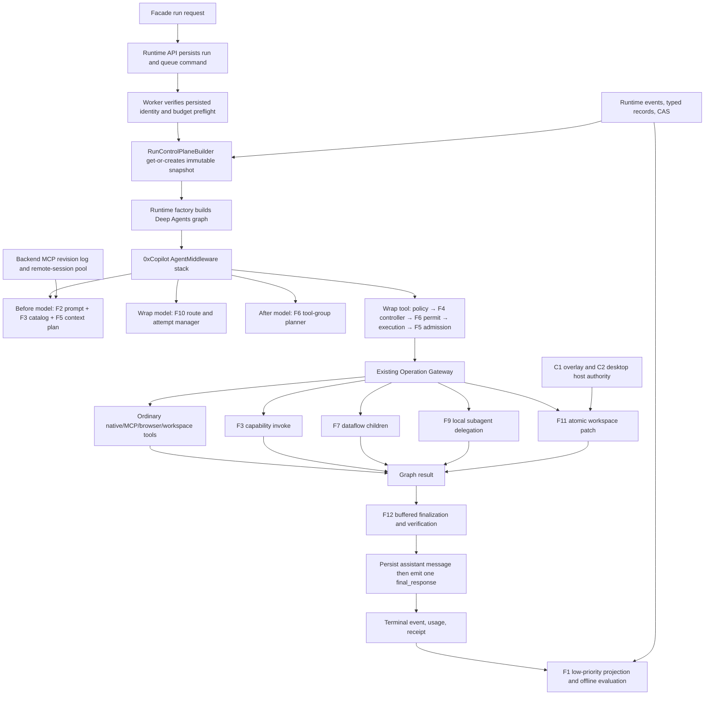
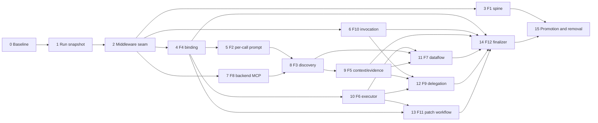

# PRD-AR-F-IMPLEMENTATION — F1–F12 production integration

**Product:** 0xCopilot\
**Status:** Proposed for implementation review\
**Version:** 1.0\
**Updated:** 2026-07-27\
**Deployment:** Desktop-first B2C; future hosted adapters are optional\
**Scope:** Remaining F1–F12 Definitions of Done and open ARQ implementation backlog\
**Companion documents:** The twelve F-series PRDs and
[`IMPLEMENTATION-BACKLOG.md`](./IMPLEMENTATION-BACKLOG.md)

## 1. Purpose

The F1–F12 work has established strong, tested domain foundations, but most of
those foundations are not yet on the authoritative production path. This PRD
defines one dependency-ordered implementation program that composes them into
the existing 0xCopilot runtime.

This is an implementation PRD, not a thirteenth feature PRD. It does not change
the product outcomes or safety rules in F1–F12. It decides:

- the single runtime architecture through which those features compose;
- the exact LangChain, Deep Agents, LangGraph, runtime, backend, and desktop
  seams to reuse;
- the records, ports, events, migrations, and recovery rules that are shared;
- the step-by-step implementation order and safe parallel work lanes;
- the test, rollout, performance, backout, and Definition of Done gates; and
- how every open backlog item is closed without creating parallel control
  planes or temporary bypasses.

## 1.1 Ordered execution checklist

This checklist is the implementation queue. Work proceeds top to bottom. A box
is checked only after that step's code, migrations/adapters, tests, rollout
control, documentation, and exit criteria pass. Discoveries during
implementation are resolved inside the active step's architecture; they do not
create a second planning queue.

- [x] **Step 0:** Correct foundation contracts and pin baseline/framework
      conformance.
  - [x] F1 promotion gates and event sequence-gap detection
        (`08c36358`).
  - [x] F2 single prompt-cache ownership and model-qualified provider support
        (`b15da8c7`).
  - [x] F4/F5 graph-wide admission and result control for Deep Agents-injected
        tools (`ba5a3bfc`).
  - [x] F6 live multi-tool serial-default enforcement (`ba5a3bfc`).
  - [x] F7 trusted input/schema/evaluator bindings (`e3fc7c2c`).
  - [x] F8 generation-fenced invalidation and paginated discovery
        (`434496f7`).
  - [x] F9 parent-authority composition and non-model concurrency ordering
        (`6e6b5d34`).
  - [x] F10 complete credential/deployment/region/price/limit route bindings
        (`b475905d`).
  - [x] F11 bounded, edit-plan/target/result/digest-bound patch contracts
        (`905d1252`).
  - [x] F12 protected answer material, provenance/trust/confidence/validity,
        and unique-claim accounting (`695c1de6`).
  - [x] Golden baseline traces (`c2ea9f9c`).
  - [x] Machine-readable cross-authority contract map with 64 records, 49
        events, source anchors, tamper detection, and CI validation
        (`464098f8`; 9 focused validator tests).
  - [x] Pinned Deep Agents/LangChain/LangGraph middleware signatures, harness
        profile surface, and isolated private Atlas seam (`070d75f3`; 28
        focused graph/middleware tests).
  - [x] Model-construction and graph-construction funnel enforcement plus exact
        final supervisor/subagent model-visible-tool topology
        (`f2f7f921`; 32 focused, live-graph, and release-conformance tests).
  - [x] `off`/`shadow`/`enforce` modes, authority-narrowing kill switches, and
        conservative unknown-mode defaults (`d93ac11a`; 30 focused and E2
        compatibility tests).
  - [x] Full Step 0 regression and exit criteria (`cb9174c8`; isolated committed
        tree: 5,425 passed, 127 skipped, 1 live-eval deselected; 58 focused
        hermetic collection/dependency tests).
- [x] **Step 1:** Persist and rehydrate the immutable run control snapshot.
  - [x] Immutable snapshot/budget/revision/decision contracts, strict internal
        event payloads, canonical event-journal ports, and in-memory/file/
        Postgres runtime composition (`4f86cb4b`; 42 focused contract, replay,
        collision, adapter, and type-parity tests plus TypeScript typecheck).
  - [x] Deletion visibility, physical-retention parity, desktop file recovery,
        and explicit non-CAS budget-reference ownership (`8d23ce71`; 12 focused
        lifecycle cases plus 832 adapter-conformance/worker tests, 47 skipped).
  - [x] Verified-boundary builder, stable HMAC assignment, typed run context,
        pre-model bind, approval/restart rehydration, legacy-safe migration,
        and live narrowing (`16bc0a07`; 18 focused worker-boundary, restart,
        migration, scope, and live-narrowing tests).
  - [x] Full Step 1 regression suite and exit-criteria check (isolated committed
        tree: 5,463 passed, 127 skipped, 1 live-eval deselected; 14 pre-existing
        deprecation warnings).
- [ ] **Step 2:** Install the graph-wide LangChain middleware composition and
      serial-default tool admission.
  - [x] Domain-owned immutable run/call context, restart-stable model/tool/
        operation identity, and exactly-once lifecycle reducer (`b0e3e97e`;
        success, error, interrupt, `Command`, cancellation, replay, resume,
        scope-collision, bounded-ledger, and content-free control tests).
  - [x] Deterministic `DeepAgentBuildRequest` middleware sequence and supported
        async LangChain hook composition for supervisor and local subagents
        (`b0e3e97e`; pinned Deep Agents root, declarative-child, and
        general-purpose-child stack conformance).
  - [x] One run-scoped serial permit shared by every graph-visible tool call,
        including framework-injected and delegated tools (`b0e3e97e`; live
        multi-tool fan-out and cross-supervisor/child maximum concurrency of
        one).
  - [x] Policy-before-budget ordering, compatibility-wrapper shadow parity,
        model-visible result admission, and final-tool-surface conformance
        (`b0e3e97e`; provider-bound tool sets equal the controller canary,
        reviewed exclusions are applied, legacy graph wrappers are removed at
        canonical assembly, and feature-off output/event parity is preserved).
  - [ ] Full Step 2 regression suite and exit-criteria check.
- [ ] **Step 3:** Complete the local F1 evaluation, assignment, report, and
      signed-promotion spine.
- [ ] **Step 4:** Bind F4 task policy, tool plan, budgets, fingerprints, and
      restart-safe controller state.
- [ ] **Step 5:** Complete F2 effective-prompt assembly, single cache ownership,
      outcome telemetry, and fallback.
- [ ] **Step 6:** Attach F10 route selection, credential mode, attempt journal,
      streaming fences, usage, and reconciliation to every model call.
- [ ] **Step 7:** Add backend-owned F8 MCP revisions, annotation cache, remote
      session pooling, and generation-safe ai-backend invalidation.
- [ ] **Step 8:** Enable F3 catalog activation, top-K expansion,
      search/describe/invoke, gateway revalidation, and fallback.
- [ ] **Step 9:** Complete F5 per-call context plans, governed compression,
      evidence registry/reader, and all-tool/store admission parity.
- [ ] **Step 10:** Complete F6 persisted batches, scoped permits, serial/parallel
      scheduling, cancellation, recovery, and kill switches.
- [ ] **Step 11:** Complete the F7 trusted-schema dataflow executor,
      checkpoints, evidence manifests, and model tool.
- [ ] **Step 12:** Route the production local task path through F9 authority,
      admission, budget, F6 scheduling, verification, and recovery.
- [ ] **Step 13:** Complete F11 bounded target planning, atomic C1 patch
      application, validation, repair, review, and D3 prerequisites.
- [ ] **Step 14:** Install the F12 buffered publication state machine,
      evidence/requirement verification, bounded repair, and published-history
      projection.
- [ ] **Step 15:** Run integrated F1 gates, staged promotion, packaged desktop
      qualification, backout drills, and remove proven legacy paths.

### Execution discipline

1. One checklist step is active at a time.
2. Domain changes land before shared composition changes within that step.
3. Every step has a focused test command plus the affected service's broader
   suite.
4. The worktree branch is rebased before integration; `main` is never edited
   directly.
5. A step that cannot meet its exit criteria remains unchecked and is fixed in
   place before the next step begins.
6. Feature flags may keep completed code dark, but dark code still needs
   production composition tests.

## 2. Problem statement

The current repository has real implementation for:

- deterministic harness evaluation contracts and fixture-only execution;
- typed prompt assembly and one provider cache decorator;
- compact authorized capability catalogs and lexical ranking;
- task-policy, plan, duplicate-call, and budget contracts for factory-supplied
  tools;
- desktop pre-model tool-result admission and content-addressed offload for
  those wrapped tools;
- conservative concurrency planning;
- a closed dataflow AST and validator;
- revision-aware MCP cache semantics;
- bounded delegation planning;
- model route and attempt policy;
- deterministic workspace patch-set validation; and
- deterministic answer/evidence verification.

The main gap is composition. Most modules are pure or shadow-only. Production
runs do not bind one immutable set of harness revisions, and the active Deep
Agents graph does not consistently route model calls, tool calls, batching,
delegation, workspace patching, and final-answer publication through those
controls.

Implementing each remaining item directly at its nearest call site would create
the following failures:

1. **Competing control planes.** F2, F4, F5, F6, F9, F10, and F12 would each
   invent separate run state, retry behavior, feature assignment, and events.
2. **Resume drift.** A run resumed after approval or process restart could use a
   different task profile, capability revision, model route, prompt plan, or
   budget from the run that produced the staged state.
3. **Framework bypass.** Factory-added tools, Deep Agents task tools, or
   framework-parallel tool calls could bypass controls applied only to registry
   tools or application wrappers.
4. **Duplicate durable truth.** Feature-specific databases or generic JSON
   blobs would compete with runtime events, operation records, workspace
   overlays, artifacts, and backend-owned MCP state.
5. **Unsafe finalization.** Verification performed after assistant-message or
   `final_response` persistence cannot retract an unsupported or unauthorized
   answer.
6. **Incorrect ownership.** ai-backend must not own MCP credentials or remote
   MCP sessions; renderer code must not own host mutation; the evaluation
   system must not silently self-modify production prompts.
7. **Desktop regressions.** A new daemon, required cloud database, remote
   subagent platform, or unbounded cache would break offline desktop behavior,
   packaged-app lifecycle, and bounded local recovery.

The required solution is one run-bound control plane, implemented through the
supported middleware and persistence seams of the existing runtime.

## 3. Goals

1. Bind every run to an immutable, reconstructable set of harness, policy,
   feature-mode, and budget revisions before the first model call.
2. Use LangChain `AgentMiddleware` as the common Deep Agents interception seam
   for model and tool calls.
3. Keep the existing Operation Gateway, effect staging, approval, artifact,
   workspace overlay, event, usage, citation, and audit systems authoritative.
4. Make every model attempt and model-visible tool call attributable,
   bounded, restart-safe, and governed.
5. Add capability discovery, context planning, safe concurrency, dataflow,
   delegation, patch sets, and answer verification without creating alternate
   execution paths.
6. Preserve the desktop file runtime as the canonical ai-backend store and the
   bundled backend Postgres database as the canonical backend product store.
7. Ship each feature through `off → shadow → enforce` with deterministic
   backout and F1 quality evidence.
8. Close every open F-series backlog item with a named implementation step and
   testable exit condition.

## 4. Non-goals

- Replacing the Deep Agents or LangGraph run loop.
- Forking LangGraph's tool node or provider SDKs.
- Creating a new generic workflow engine, tool gateway, approval system,
  artifact store, workspace store, or audit ledger.
- Adopting remote Deep Agents async-subagent infrastructure for the desktop
  product.
- Making the renderer, Electron main process, or model an authority source.
- Adding a new database, always-on daemon, cloud queue, or mandatory network
  dependency.
- Automatically promoting a local prompt or policy based on end-user traffic.
- Enabling programmatic writes, concurrent writes, or sandbox-to-host mutation
  before their separately defined safety gates pass.
- Completing G-, H-, I-, or J-wave product capabilities in this program.

## 5. Current-state disposition

| Feature | Existing foundation to retain                                                                              | Production integration still required                                                                                                                                                                     |
| ------- | ---------------------------------------------------------------------------------------------------------- | --------------------------------------------------------------------------------------------------------------------------------------------------------------------------------------------------------- |
| F1      | `harness_quality` contracts, projection, fixtures, runner, scorers, promotion records                      | Correct control/candidate promotion statistics and event-gap validation; durable local repositories, scheduling, run assignment, reports, signed promotion manifest, deletion, operational corpus         |
| F2      | `prompts` fragments, deterministic factory-prefix assembly, Anthropic stable-prefix decorator              | Complete outbound request plan including Deep Agents-added prompt/middleware/tool bytes, one non-overlapping cache decorator, events, provider response normalization, bounded fallback, rollout controls |
| F3      | `capabilities/discovery` catalog, ranker, search/describe bridge                                           | Factory activation, bounded MCP expansion, invoke bridge, gateway revalidation, invalidation, events                                                                                                      |
| F4      | `task_policy`, factory-tool guards, duplicate controller, budgets                                          | Cover Deep Agents-injected tools; immutable run binding, persisted/reconstructed ledger, middleware composition, progress and decision events                                                             |
| F5      | desktop `ToolResultAdmissionAdapter`, CAS offload, prior-result loading for wrapped tools                  | Cover Deep Agents-injected tools and supported stores; context plans, general evidence resolver/reader, durable facts                                                                                     |
| F6      | `capabilities/concurrency` contracts and conservative planner                                              | Immediate serial-default graph admission because live multi-tool responses currently fan out concurrently; then descriptor policy, persisted plans, permits, executor, cancellation/recovery, kill switch |
| F7      | `capabilities/dataflow` closed AST and validator                                                           | Trusted input/capability schemas and bindings; evaluator/executor/checkpoints, evidence manifests, F6 scheduling, gateway calls, model tool                                                               |
| F8      | `RevisionAwareMcpDiscoveryCache`, current TTL/LRU cache, backend MCP proxy                                 | Fix in-flight invalidation repopulation; backend revision log/feed, generation-safe composition, backend remote-session pool, pagination, metrics and lifecycle                                           |
| F9      | `DelegationCoordinator`, separate authority-narrowing primitives, current local Deep Agents task execution | Compose trusted authority and independence; supported production task middleware, durable admission/budget/lifecycle, evidence verification, recovery                                                     |
| F10     | `execution/model_invocation` descriptors, routing, failure, and attempt policy                             | Bind selected credential mode and route identity; model middleware, catalog adapter, attempt ledger, streaming state, usage, circuit health, reconciliation                                               |
| F11     | `workspace/patch_plan`, C1 overlay stores, staging and host-authority boundaries                           | Add hard collection/byte bounds and edit-plan/digest binding; target planner, atomic applier, validation profiles, diagnostics/repair, D3 prerequisites, review projection                                |
| F12     | `answer_verification` envelopes, ledgers, trusted facts, deterministic verifier                            | Add source class/compatibility, confidence/timestamps, unique-claim accounting, and content-free event projection; requirement compiler, evidence resolution, buffered finalizer, repair, durable report  |

No row above is permission to replace the existing substrate. Every remaining
integration is an adapter to an existing authority boundary.

## 6. Architectural decisions

### 6.1 One immutable run control snapshot

Before the first model call, the worker persists one `RunControlSnapshot`.
This is the immutable policy and experiment assignment for the run. It contains
revision references and digests, not prompt bodies, tool schemas, evidence,
credentials, workspace bytes, or mutable authorization results.

```text
RunControlSnapshot
  schema_version
  snapshot_id
  run_id, conversation_id
  subject_fingerprint
  deployment_profile
  harness_variant_ref
  task_policy_selection_ref
  policy_revisions {
    prompt, capability, context, tool_controller, concurrency,
    dataflow, mcp_freshness, delegation, model_route,
    workspace_edit, answer_verification
  }
  feature_modes { feature: off | shadow | enforce }
  budget_envelope_ref
  assignment_revision
  created_at
  snapshot_digest
```

The snapshot is not an authorization cache. Identity, connector scope,
workspace grants, effect policy, and evidence access are revalidated at their
existing call-time boundaries. A live kill switch may only narrow an active
snapshot—such as `parallel_safe → serial` or `enforce → off`. It cannot enable
or broaden authority mid-run.

### 6.2 Append-only decisions, not one mutable control blob

Feature decisions made after run binding are separate typed records:

```text
RunControlDecision
  decision_id
  run_id, snapshot_id
  phase
  feature
  policy_revision
  input_digest
  outcome_code
  record_ref?
  parent_decision_refs[]
  created_at
  decision_digest
```

Catalogs, prompt plans, context plans, batch plans, model attempts, delegation
plans, patch attempts, and verification reports retain their domain contracts.
`RunControlDecision` provides lineage without duplicating their bodies.

### 6.3 Supported LangChain middleware, not graph forks

The pinned Deep Agents `create_deep_agent` accepts LangChain
`AgentMiddleware`. The pinned middleware contract exposes:

- `abefore_model` for prompt, context, and current-turn preparation;
- `awrap_model_call` for route selection, attempt recording, cache fallback,
  and model-call metering;
- `aafter_model` for tool-call group planning;
- `awrap_tool_call` for F4 admission, F6 permits, F5 result admission, and
  post-call progress; and
- `aafter_agent` for content-free completion observations.

`DeepAgentBuildRequest` will accept a reviewed middleware sequence and pass it
to `create_deep_agent`. The sequence is assembled once by the runtime factory.
No feature monkey-patches LangGraph nodes.

### 6.4 Existing authorities remain authoritative

| Concern                                                | Authoritative owner                                 | Integration rule                                                            |
| ------------------------------------------------------ | --------------------------------------------------- | --------------------------------------------------------------------------- |
| Run/message/event/usage state                          | ai-backend `RuntimePorts`                           | Extend typed records and adapters; do not create a second run ledger        |
| Tool classification and authorization                  | Operation Gateway and existing policy enforcers     | Every inner operation re-enters the gateway                                 |
| Effects and approvals                                  | Existing A4/A5 effect path                          | Controllers may deny or stage; they never commit                            |
| Large bytes and evidence bodies                        | Existing CAS/artifact/source stores                 | Control records hold protected refs and digests                             |
| Workspace bytes and revisions                          | C1 `WorkspaceOverlayStorePort`                      | F11 applies one atomic overlay revision                                     |
| Host workspace mutation                                | C2 desktop authority                                | No ai-backend direct host write                                             |
| MCP registration, OAuth, credentials, remote transport | backend                                             | F8 adds backend-owned revision/session services                             |
| Model/provider invocation                              | central LangChain model construction and middleware | No direct provider SDK imports outside existing boundary                    |
| Graph continuation                                     | existing LangGraph checkpointer                     | Checkpoints are execution state, not canonical control records              |
| Evaluation and promotion evidence                      | F1                                                  | Feature modules emit facts; they do not create their own experiment systems |

### 6.5 Desktop-first storage

The implementation adds no new database.

- ai-backend metadata uses the existing file-native canonical record streams
  beneath `<userData>/agent-data/v1`.
- Per-run control truth is journaled in the existing canonical run/event log
  with typed protected refs; it is not stored only in the cross-run state
  ledger.
- Large prompt-independent fixtures, outputs, evidence, diagnostics, patch
  bodies, and reports use the existing content-addressed store.
- The file store's SQLite index and LangGraph SQLite checkpointer remain
  derived/rebuildable execution aids, never canonical product state.
- In-memory adapters provide unit tests.
- Existing Postgres runtime adapters receive contract parity because self-host
  uses them and desktop retains Postgres as a rollback lane. A separate hosted
  service is not a desktop prerequisite.
- Backend-owned MCP revision metadata and remote-session state reuse the
  bundled backend Postgres database and existing token vault.
- Future account sync is an explicit adapter over these contracts. No local
  workflow waits for it.

### 6.6 Framework reuse decision

| Capability                                                        | Decision                               | Reason                                                                      |
| ----------------------------------------------------------------- | -------------------------------------- | --------------------------------------------------------------------------- |
| Deep Agents graph, local subagents, skills, filesystem middleware | Reuse                                  | These are the shipped harness and capability substrate                      |
| LangChain `AgentMiddleware`                                       | Reuse and extend                       | It is the supported common model/tool interception seam                     |
| `ModelRequest.override(model/system_message/tools)`               | Reuse                                  | Enables F2/F10 without provider or graph forks                              |
| LangGraph checkpointer                                            | Reuse                                  | Approval/run continuation already depends on it                             |
| LangGraph cache                                                   | Do not use for provider prompt caching | It caches graph computation, not provider exact-prefix billing state        |
| Deep Agents remote async subagents                                | Do not adopt for desktop               | It adds remote infrastructure and a second lifecycle authority              |
| Deep Agents built-in summarization                                | Reuse only as an execution primitive   | F5 must still own source-linked plans, auth, lossiness, and evidence recall |
| Framework automatic tool concurrency                              | Gate through F6                        | Scheduling convenience is not safety metadata                               |
| LangChain retries                                                 | Use only inside F10 policy             | Generic retries cannot determine visibility, effects, cost, or ambiguity    |

## 7. Target runtime architecture



## 8. Middleware ordering and invariants

Middleware order is normative because LangChain composes the first middleware
as the outermost wrapper.

1. **Live kill-switch middleware** may only narrow behavior.
2. **Existing user/tool-use policy enforcement** rejects blocked calls before
   they consume a tool budget.
3. **F4 tool-control middleware** records intent, applies task/budget/duplicate
   policy, and creates the parent operation identity.
4. **F6 execution middleware** applies the persisted batch segment and scoped
   permits. Missing or unknown policy means serial.
5. **Capability-specific execution** re-enters the Operation Gateway.
6. **F5 result-admission middleware** offloads/bounds the exact successful
   result before it becomes a `ToolMessage`.
7. **F4 post-operation projection** records outcome/progress from the same
   call identity.

For model calls:

1. F2/F5 construct the exact per-call prompt and context plan.
2. F10 writes an invocation and admitted attempt before provider dispatch.
3. Provider/cache metadata is attached only by a validated route adapter.
4. The first provider acknowledgement/content/usage transition makes retry
   safety explicit.
5. A retry or fallback is possible only when the F10 decision admits it.
6. Attempt usage is recorded once and folded once into run usage.

These invariants apply to the supervisor and every local subagent.

## 9. Shared contracts and ports

### 9.1 New narrow ports

```text
RunControlSnapshotStorePort
  get(run_id)
  get_or_create(command)

RunControlDecisionStorePort
  append(decision)
  list_for_run(run_id, after_sequence)

EvaluationRepositoryPort
  cases, fixtures, manifests, results, reports, decisions

ModelInvocationStorePort
  create_invocation
  append_attempt_transition
  reconcile_attempt

BatchPlanStorePort
  put_plan
  append_child_transition
  load_recovery_view

EvidenceResolverPort
  resolve_authorized(refs, runtime_context, policy)

AnswerFinalizationStorePort
  get_or_create_attempt
  append_verification
  mark_published
```

Per-run implementations of these protocols are transaction/fold helpers over
the canonical run event journal plus protected CAS refs. They do not create a
second source-of-truth ledger or a new service. Cross-run F1 corpus/report/
promotion metadata may use the existing bounded file `StateLedger`, with
explicit export and quota rules. Feature-specific records stay in their domain
modules.

### 9.2 Backend-only F8 contracts

```text
McpDescriptorRevision
  server_id, descriptor_revision, auth_epoch, registry_revision
  change_kind, observed_at

McpRevisionPage
  cursor, next_cursor, revisions[]

McpSessionLease
  lease_id, server_id, subject_fingerprint
  auth_epoch, transport_revision, expires_at
```

ai-backend sees opaque revisions and invokes the backend proxy. It never
receives credentials, cookies, refresh tokens, or a remote session object.

### 9.3 Event rules

Use a deliberately small closed run-event vocabulary:

- `quality.control_bound.v1`;
- `quality.decision.v1`, with a closed `decision_kind`;
- `model.attempt.v1`, with a closed transition;
- `answer.finalization.v1`, with a closed transition.

Existing operation, effect, approval, citation, usage, workspace, and terminal
events remain authoritative. New events carry IDs, revisions, counts, digests,
reason codes, timings, and protected refs only. They never carry prompt bodies,
raw tool arguments, raw tool results, credentials, physical host paths,
complete evidence text, or chain-of-thought.

Internal control events use the existing monotonic run event stream. Only
events that provide user value receive a shared chat-surface activity
projection. Internal evaluation APIs remain loopback/development-only until a
user-facing diagnostics product is approved.

## 10. End-to-end authoritative flow

### 10.1 Run admission

1. Runtime API verifies the caller and persists the run as it does today.
2. Worker revalidates the queue command against the persisted run.
3. Existing budget preflight executes.
4. `RunControlPlaneBuilder` loads the signed deployment manifest and
   deterministically selects a harness variant and F4 task policy.
5. The snapshot store atomically returns the existing same-digest snapshot or
   creates one. Same run ID with different digest is a hard conflict.
6. The worker binds the snapshot to a run-scoped context and emits
   `quality.control_bound.v1`.
7. Only then may the run transition to active model execution.

Approval resume and worker restart reload the same snapshot. Authorization and
MCP/workspace revisions may invalidate individual later decisions, but they do
not rewrite the historical snapshot.

### 10.2 Before each model call

1. F4 supplies the task profile, plan progress, and remaining budget.
2. F8 supplies current opaque MCP revision facts; F3 returns the authorized
   catalog mode and compact catalog revision.
3. F5 enumerates context candidates and allocates the variable context budget.
4. F2 assembles the exact ordered fragments and direct/deferred tool schema
   block for this call.
5. The prompt and context plan records are persisted without bodies.
6. Middleware overrides the `ModelRequest` system message, messages, tools, and
   model settings with the validated plan.

No extra selector-model call occurs on the normal path.

### 10.3 Model invocation

1. F10 maps the current model catalog, BYOK availability, region/privacy
   policy, feature needs, deadline, and remaining cost/token budget into route
   requirements.
2. It persists an invocation record and the selected route/exclusion plan.
3. Before each handler call, it persists an admitted attempt.
4. LangChain invokes the selected `BaseChatModel` via
   `ModelRequest.override(model=...)`.
5. Stream/callback observation records provider acknowledgement, first
   content, usage, completion, or sanitized failure.
6. Retry/fallback is denied after visible content, effect observation, an
   ambiguous response, deadline exhaustion, or aggregate-budget exhaustion.
7. Optional cache-metadata rejection may retry without cache metadata only as
   an F10-admitted pre-content attempt.

### 10.4 Tool-call group

1. `aafter_model` extracts the ordered tool-call group and descriptor facts.
2. F4 creates stable intent fingerprints without persisting raw arguments.
3. F6 builds and persists a deterministic segment plan before a child runs.
4. LangGraph may schedule call coroutines, but each `awrap_tool_call` must
   obtain its persisted segment gate and scoped permit before dispatch.
5. Missing plan, stale auth epoch, unknown descriptor, write/effect,
   dependency, or permit failure falls back to serial/blocked behavior.
6. Every child independently crosses user policy, F4, the Operation Gateway,
   approval/effect staging, usage, citation, and F5 result admission.
7. Results preserve model input order while completion times remain recorded.

### 10.5 Finalization

1. Grounded profiles buffer answer text from authoritative publication.
2. F12 compiles the requirement ledger from the F4 task plan and user request.
3. It parses the structured answer envelope or uses a bounded tagged fallback.
4. Evidence refs are batch-resolved and reauthorized through F5 ports.
5. The deterministic verifier checks completion, material support, freshness,
   revocation, locator digests, conflicts, effects, and secret-scan facts.
6. The finalization journal transitions
   `prepared → verified | degraded | blocked → published`.
7. A passing answer is persisted as the assistant message and emitted once as
   `final_response` only at `published`.
8. A repairable failure receives at most one F10-budgeted targeted repair.
9. A non-repairable failure produces a typed degraded or blocked response.
10. Publication is idempotent by run, answer digest, finalization ID, and
    verification policy. Public conversation history projects only published
    assistant messages.

Unverified model deltas are not sent on the public stream. Enabled runs buffer
candidate text under a hard memory cap with CAS spill while continuing to emit
safe tool/progress/usage events. Candidate text may be retained only as a
protected draft diagnostic under explicit development policy; it is not an
assistant message or final event.

### 10.6 Post-run evaluation

1. User completion is never blocked on evaluation.
2. Eligible local/synthetic runs enqueue a bounded low-priority projection job
   in the existing worker/job lifecycle.
3. F1 projects redacted manifests from existing events and decision refs.
4. Fixture-only evaluation cannot reach live effects or network tools.
5. Reports compare exact revisions and expose quality, safety, tool precision,
   evidence, latency, tokens, cache outcomes, and cost.
6. Production release manifests are signed build/deployment inputs. Runtime
   evaluation does not silently rewrite them.

## 11. Step-by-step implementation plan

Each step is independently reviewable and must meet its exit criteria before an
enforcement flag advances. “Complete” below means code, in-memory/file adapter
coverage, relevant Postgres parity, fault tests, docs, and backout—not only a
domain class.

### Step 0 — Freeze baseline, contracts, and ownership

**Purpose:** prevent implementation from moving behavior without measurable
evidence or creating duplicate owners.

**Work:**

1. Record golden traces for ordinary chat, MCP read/auth/write staging, local
   tool use, approval resume, large tool result, local subagent, workspace
   draft, timeout, cancel, and provider error.
2. Add a machine-readable contract map that assigns every F1–F12 record and
   event to ai-backend, backend, or desktop authority.
3. Pin the supported Deep Agents/LangChain middleware signatures in contract
   tests.
4. Inventory every model construction site and every model-visible tool after
   final factory assembly. Tests must fail if a new call site bypasses the
   middleware stack.
5. Define feature modes, kill-switch semantics, and safe defaults:
   `off`, `shadow`, `enforce`; unknown defaults to `off` or conservative
   serial/deny according to the feature.
6. Preserve the currently resolved ARQ-001–005 regression suites.
7. Correct the following foundation defects before their modules can be wired:

| Foundation | Required correction                                                                                                                                                                                                    |
| ---------- | ---------------------------------------------------------------------------------------------------------------------------------------------------------------------------------------------------------------------- |
| F1         | Promotion compares candidate/control thresholds, confidence, task-family regression, cost, and latency. Event projection detects sequence gaps, not only non-monotonic order.                                          |
| F2         | The diagnostic plan observes the final outbound system/tool request after Deep Agents additions. Exactly one cache implementation sets breakpoints. Provider support is model-qualified.                               |
| F4/F5      | Deep Agents injects task, todo, filesystem, execute, and related tools after the current factory wrapper pass. Universal coverage requires graph-wide middleware conformance.                                          |
| F6         | Live LangChain multi-tool responses fan out concurrently. The first enforcement is serial-default admission, before any safe-parallel cohort.                                                                          |
| F7         | Input fields, capability schemas, and evaluator semantics are trusted versioned bindings, not model-declared types.                                                                                                    |
| F8         | In-flight loads carry an invalidation generation and cannot republish after revocation. Complete paginated discovery is represented.                                                                                   |
| F9         | Compose existing authority intersection and handoff. Model-declared dependency waves do not prove resource/effect independence; only F6 admits parallelism.                                                            |
| F10        | Every route entry binds selected credential mode, endpoint/deployment identity, region, price revision, and output limit. Secrets stay out of records.                                                                 |
| F11        | Add hard target/operation/hunk/path/byte bounds and bind patch set to edit plan, target revision, expected result, and canonical digest.                                                                               |
| F12        | Add source/trust class, claim/source compatibility, confidence, requirement completion source/run binding, validity timestamps, and unique-claim accounting. Answer text is protected content, never an event payload. |

**Existing code to reuse:**

- `agent_runtime/execution/deep_agent_builder.py`
- `agent_runtime/execution/factory.py`
- `runtime_worker/handlers/run.py`
- existing operation, usage, citation, effect, workspace, and event contracts

**Exit criteria:**

- the baseline suite passes on the unmodified active path;
- every integration owner is explicit;
- all foundation corrections above have focused regression tests;
- framework signature drift fails CI;
- no F-series feature owns credentials, host mutation, or a second event log.

### Step 1 — Persist the immutable run control snapshot

**Purpose:** make every later decision attributable and restart-stable.

**Work:**

1. Add `RunControlSnapshot`, `BudgetEnvelope`, `FeatureMode`, and
   `RunControlDecision` contracts under a new
   `agent_runtime/control_plane/` domain package.
2. Add narrow snapshot and decision ports to existing runtime composition.
3. Implement in-memory and file adapters. Add Postgres parity for the existing
   supported Postgres runtime.
4. Extend run/conversation deletion to snapshot, decisions, and protected refs.
5. Add `RunControlPlaneBuilder` at the worker's verified run boundary before
   the first model call.
6. Implement `get_or_create`: same run/same digest returns the existing
   snapshot; same run/different digest fails.
7. Bind the snapshot through a typed run context. Do not expose mutation
   methods through the context.
8. Emit a content-free `quality.control_bound.v1` event.
9. Rehydrate and verify the snapshot on approval resume and process restart.
10. For desktop cohorts, assign with the stable user/profile HMAC already
    available in verified runtime facts. Do not assume an installation/device
    ID exists; adding one requires an explicit desktop → facade → persisted-run
    contract change.

**Migration:**

- old queued/running runs receive a versioned `legacy-safe-v1` snapshot using
  current behavior and all new feature modes off;
- completed historical runs are not rewritten;
- graph checkpoints remain valid because the control snapshot is external to
  graph state.

**Tests:**

- randomized config ordering yields the same digest;
- changed policy revision conflicts for the same run;
- crash between snapshot creation and graph start resumes once;
- cross-profile reads fail;
- deletion removes derived records and protected refs;
- file recovery rebuilds indexes from canonical records.

**Exit criteria:**

- every new run has exactly one snapshot before model dispatch;
- resume uses the same snapshot;
- a live kill switch can narrow but never broaden it;
- ARQ-020 is closed.

### Step 2 — Install the supported runtime middleware stack

**Purpose:** create one non-bypassable model/tool composition seam.

**Work:**

1. Extend `DeepAgentBuildRequest` with an immutable middleware sequence.
2. Pass it through `build_deep_agent` to Deep Agents
   `create_deep_agent(middleware=...)`.
3. Add `RuntimeControlMiddleware` using the pinned async LangChain hooks.
4. Move the existing common tool budget/result-admission composition behind
   `awrap_tool_call` while retaining the current wrappers as compatibility
   adapters during shadow parity.
5. Compose existing tool-use policy as the outer rejection gate so blocked
   calls do not consume budget.
6. Add call identities that bind run, snapshot, model turn, model tool-call ID,
   and underlying operation ID.
7. Ensure supervisor and local subagents receive the same middleware factory
   with narrowed child context.
8. Add a conformance canary that enumerates the final model-visible tool
   surface and proves one middleware admission per call.
9. Enforce one serial permit per run as the safe initial F6 policy. Raising
   concurrency requires a persisted F6 plan and trusted descriptor admission.

**Do not:**

- patch LangGraph's tool node;
- call middleware recursively from bridge/dataflow children;
- double-charge one model-visible bridge call and its inner operation as the
  same budget dimension;
- persist raw model messages or arguments as control facts.

**Tests:**

- registry, MCP, skill, ask, prior-result, workspace, bridge, dataflow, and
  task tools all cross the middleware once;
- policy-blocked calls consume no tool budget;
- successful, error, interrupt, `Command`, cancellation, and resume outcomes
  produce one terminal tool-control transition;
- feature-off output and event parity with the baseline;
- one multi-tool response executes serially before any F6 opt-in, and injected
  Deep Agents tools cannot bypass F4/F5.

**Exit criteria:**

- no model/tool call bypasses the supported seam;
- current desktop large-result admission remains correct;
- no framework fork or second operation gateway exists.

### Step 3 — Turn F1 into the local evaluation and promotion spine

**Purpose:** give every later enforcement change a common evidence and rollout
owner.

**Work:**

1. Replace `InMemoryEvaluationRepository` as the production composition with
   `EvaluationRepositoryPort`.
2. Persist cases, fixture catalogs, manifests, results, reports, and promotion
   decisions through file/CAS adapters.
3. Add bounded projection jobs after terminal events. Projection is disabled
   for ordinary production profiles unless local consent/eligibility permits.
4. Add resumable fixture-only suite execution with per-case cost, turn, call,
   token, and wall-time ceilings.
5. Implement deterministic scorers first; optional model graders remain
   bounded, redacted, attributable, and incapable of overriding hard gates.
6. Replace the foundation promotion shortcut with paired candidate/control
   reports, minimum sample sizes, confidence bounds, protected-family
   regression ceilings, cost/latency thresholds, and explicit missing-data
   treatment.
7. Add local report export and development-only loopback endpoints/CLI.
8. Define the signed release `HarnessManifest` consumed by Step 1. Production
   desktop builds read it but cannot self-promote.
9. Add development/dogfood override and atomic rollback to the preceding
   signed or locally approved manifest.

**Operational corpus:**

- connector selection and MCP auth;
- web/library evidence;
- long context and exact evidence recall;
- duplicate/error-loop tools;
- safe parallel reads and conflicting writes;
- dataflow;
- local subagents;
- multi-file workspace edits;
- provider pre-content failure and ambiguous failure;
- supported, conflicting, stale, and revoked evidence.

**Exit criteria:**

- no evaluation path can dispatch a live effect;
- reports bind exact code/model/prompt/tool/policy/fixture revisions;
- safety gates cannot be overridden by average quality/cost;
- end-user traffic cannot silently update the production manifest;
- local projection is deletable and does not block run completion.

### Step 4 — Bind F4 task policy and the durable tool controller

**Purpose:** make task-specific budgets, duplicate control, progress, and
stopping behavior authoritative and reconstructable.

**Work:**

1. Load a deployment-owned, versioned `TaskPolicyProfile` bundle in Step 1.
2. Select `TaskPolicySelection` from server-derived signals and persist its ref
   in the run snapshot.
3. Persist `RunToolPlan` before its first governed tool call.
4. Implement `ToolUseIntent` and `ToolUseFeedback` records keyed by canonical
   argument/result digests and tool-call identity.
5. Reconstruct budget/duplicate/progress state from durable records after
   restart; eliminate correctness dependence on an empty in-memory ledger.
6. Enforce exact duplicates, unchanged-error loops, task/model turns, tool
   calls, cost, and deadline in the common middleware.
7. Keep semantic “low value” or “objective satisfied” decisions advisory until
   F1 proves quality. Exact budget and duplicate rules may enforce first.
8. Emit body-free profile, plan, intent, feedback, and progress events.
9. Expose concise remaining-budget/progress context through F2, not ad-hoc
   system strings.

**Invariants:**

- task policy never grants tool or data authority;
- effect/delegation facts can only tighten the selected profile;
- unknown task family uses the conservative bounded profile;
- resume cannot reset tool/turn/cost budgets.

**Exit criteria:**

- every model-visible tool call has one F4 decision;
- controller state survives restart/approval;
- exact duplicate/error-loop tests terminate without model-only discipline;
- ARQ-014 is closed.

### Step 5 — Complete F2 per-call prompt assembly and cache observation

**Purpose:** make every system byte attributable and exact-prefix caching
measurable without weakening scope.

**Work:**

1. Convert all remaining system-prompt sources into typed fragment providers.
2. Assemble the plan in `abefore_model`, not only at graph construction, so
   current plan, approval, catalog, context, and turn state have correct tiers.
3. Keep immutable safety and tool protocol first. Retrieved content remains
   explicitly untrusted and later.
4. Include provider/model family, stable bridge/tool-schema revision, harness
   revision, and allowed scope in the stable-prefix digest.
5. Use `ModelRequest.override(system_message=..., tools=...)`; durable
   conversation messages remain provider-neutral.
6. Generalize `ProviderPromptDecorator` into an explicit, versioned adapter
   registry that may delegate to the pinned upstream prompt-caching
   middleware. Unsupported models receive unchanged prompt semantics. Product
   and upstream decorators must never be stacked.
7. Normalize actual provider cache-read/write/miss/unsupported metadata through
   the existing usage path.
8. Emit `prompt.assembled.v1` and `prompt.cache.observed.v1` with digests,
   token counts, and reason codes only.
9. Make cache-metadata rejection a pre-content F10 attempt, not an independent
   retry loop.
10. Retain a one-flag undecorated backout and a temporary legacy-render
    comparison until golden parity passes.

**Tests:**

- byte-for-byte golden plans;
- random provider/registry ordering;
- profile/task/auth revision invalidation;
- no profile/user/conversation content enters a reusable installation prefix;
- provider decorator does not mutate durable messages;
- actual usage records reconcile with provider metadata;
- fallback occurs only before output and at most once.

**Exit criteria:**

- every system byte has a fragment/revision owner;
- stable prefix behavior is scope-safe;
- cache metrics reflect provider outcomes, not assumed hits;
- F1 shows non-regressed quality and measurable reuse;
- ARQ-019 is closed.

### Step 6 — Attach F10 to every model invocation

**Purpose:** replace whole-run retry assumptions with bounded, attributable
model attempts.

**Work:**

1. Adapt the current model catalog, user enablement, BYOK availability,
   region/privacy policy, feature requirements, and health facts into
   `ModelDeploymentDescriptor` and invocation requirements.
2. Extend each route entry with selected credential mode, stable deployment/
   endpoint/region identity, price revision, and output limit. Secrets remain
   outside contracts and records.
3. Implement `ModelInvocationMiddleware.awrap_model_call`.
4. Persist invocation, route plan, exclusion reasons, attempts, and state
   transitions through `ModelInvocationStorePort`.
5. Select routes with `ModelRequest.override(model=...)` through the existing
   central model builder.
6. Observe streaming acknowledgement, first content, tool-call content, usage,
   completion, and sanitized failure using LangChain callbacks/stream
   transformers. Do not import provider SDKs into domain modules.
7. Implement provider-specific error adapters that output only reviewed
   failure facts.
8. Meter failed/successful attempts separately, then reconcile once into run
   usage and budget reservations.
9. Add bounded local circuit health keyed by provider/deployment/region, with
   disk-capped persistence only when needed across restart.
10. Reconcile ambiguous attempts; never automatically replay them.
11. Keep worker retries limited to failures before handler entry.

**Safe retry matrix:**

| Attempt state                                               | Retry/fallback                           |
| ----------------------------------------------------------- | ---------------------------------------- |
| Rejected before dispatch                                    | Allowed if budget/deadline/route remains |
| Transport failure proven before provider acceptance/content | Allowed by policy                        |
| Rate limit before content                                   | Bounded retry or qualified route         |
| Cache metadata rejected before content                      | One undecorated attempt                  |
| Any visible text/tool call/usage with uncertain completion  | Denied                                   |
| Effect or child operation observed                          | Denied                                   |
| Unknown/ambiguous provider state                            | Reconcile or fail honestly               |

**Exit criteria:**

- primary and subagent model calls produce attempt lineage;
- aggregate budgets span all attempts;
- no final answer contains mixed duplicate stream attempts;
- qualified fallback routes require F1 evidence;
- ARQ-009 is closed.

### Step 7 — Build the backend-owned F8 MCP revision and session control plane

**Purpose:** make descriptor freshness and remote connection reuse
authoritative without moving credentials into ai-backend.

**Backend work:**

1. Add an append-only descriptor revision log tied to registration, OAuth/auth
   epoch, tool-list/schema changes, and explicit refresh.
2. Expose an authenticated internal paginated revision endpoint with opaque
   durable cursor and optional exact revision check.
3. Build a bounded remote MCP session pool inside backend, scoped by local
   profile/user/server/auth epoch/transport revision.
4. Add idle TTL, maximum sessions, lease accounting, keepalive, reconnect,
   cancellation, suspend/quit drain, and credential-rotation invalidation.
5. Keep all tokens and remote transport handles in backend.
6. Emit backend audit/diagnostic facts without secrets or tool-result bodies.

**ai-backend work:**

1. Compose `RevisionAwareMcpDiscoveryCache` around the existing discovery
   cache/loader.
2. Persist the last consumed backend cursor in the file runtime.
3. Poll only while the app/worker is active and at a bounded interval; perform
   on-demand checks for stale-sensitive operations.
4. Add an invalidation generation barrier: a load started before invalidation
   cannot republish the old generation.
5. Invalidate derived F3 catalogs and descriptors together.
6. Measure phase timings, cache hit/refresh, coalesced loads, stale rejects,
   session reuse, reconnect, and pool pressure.

**Exit criteria:**

- auth/revision change converges without waiting for ordinary TTL;
- warm remote calls reuse a correctly scoped backend session;
- no cross-profile/session/credential reuse is possible;
- offline/degraded behavior is explicit;
- ARQ-011 is closed.

### Step 8 — Enable F3 policy-aware capability discovery

**Purpose:** reduce prompt/tool-schema load while preserving exact
authorization and gateway semantics.

**Work:**

1. Build the compact catalog after verified identity, connector scope, F4
   policy, and F8 revisions are known.
2. Add F3 activation policy: `direct`, `server`, `deferred`, `shadow`.
3. Register bounded `search_capabilities`, `describe_capability`, and
   `invoke_capability` tools only in deferred/enabled modes.
4. Search authorized compact cards in `O(N)` and expand at most configured
   top-K server cards through the existing `McpLoader` and F8 cache.
5. Coalesce safe independent descriptor loads and respect total discovery
   deadline. Partial failure never widens authorization.
6. Keep opaque refs run/subject/catalog scoped.
7. `describe` returns bounded schema or protected schema-artifact ref.
8. `invoke` re-resolves current descriptor/auth revision, validates canonical
   arguments, rejects stale refs, and calls a non-model
   `CapabilityExecutorPort` that enters the normal Operation Gateway.
9. Prevent bridge recursion.
10. Emit search/describe/invoke decisions and token/turn/latency metrics.

**Budget accounting:**

- the bridge call consumes one model-visible F4 call;
- the real inner operation consumes its applicable operation/capability budget;
- the same cost is not counted twice in the same dimension.

**Exit criteria:**

- unauthorized capability names cannot be searched, described, guessed, or
  invoked;
- revocation/schema change between describe and invoke fails safely;
- cold discovery opens at most K servers and warm discovery performs no
  duplicate list;
- direct/server fallback remains available;
- F1 proves selection recall and end-to-end quality;
- ARQ-007 is closed.

### Step 9 — Complete F5 context planning and evidence recall

**Purpose:** bound every model call while preserving exact, authorized evidence
behind references.

**Work:**

1. Define `ContextCandidate`, `ContextRepresentation`, `ContextPlan`,
   `CompressionManifest`, and general evidence-resolution contracts.
2. Build candidates from bounded conversation turns, tool observations,
   citations/sources, artifacts, memory/skills when enabled, workspace refs,
   and task-plan state.
3. Allocate provider context among fixed prompt, tool schemas, recent turns,
   plan state, evidence, and output reserve in `abefore_model`.
4. Persist inclusion/omission reason codes and digests, not context bodies.
5. Preserve exact source digest, spans/locators, lossiness, summarizer model,
   prompt revision, and authorization scope for compressed representations.
6. Reuse Deep Agents summarization only behind the governed compression port.
7. Generalize source/artifact/prior-result resolution into one
   `EvidenceResolverRegistry` with call-time authorization, retention,
   revocation, and revision checks.
8. Expose one bounded `read_evidence` tool for opaque evidence refs while
   retaining source-specific compatibility during migration.
9. Move desktop result admission fully into common middleware and persist one
   raw-free admission fact consumed by model/event paths.
10. Add equivalent writer behavior to every runtime store adapter that can be
    selected in supported configurations.
11. Add context-limit emergency replan with one bounded retry through F10.

**Exit criteria:**

- every model call has a reconstructable context plan;
- no successful oversized tool result reaches the model unbounded;
- evidence reads reauthorize and respect deletion/revocation;
- compression remains source-linked and lossiness is explicit;
- F1 groundedness/constraint-retention gates pass;
- ARQ-008 is closed.

### Step 10 — Turn F6 into the execution scheduler

**Purpose:** overlap only explicitly safe operations while keeping child
authorization, ordering, and recovery honest.

**Work:**

1. Extend trusted product descriptor metadata with concurrency policy,
   idempotency, resource-key template, ordering, rate-limit scope, and
   provider/session constraints.
2. Implement precedence:
   product catalog → user-approved tightening → trusted provider tightening →
   conservative serial/unknown.
3. In `aafter_model`, construct and persist an ordered `OperationBatch` and
   `BatchPlan` before child dispatch.
4. Implement a run-scoped `BatchExecutionCoordinator`. Framework-started
   coroutines wait on persisted segment gates.
5. Implement bounded global/profile/user/connector/installation/capability
   permits with digested scope keys.
6. Each admitted child re-enters the Operation Gateway with its own deadline,
   cancellation, usage, citation, result, and audit identity.
7. Preserve input-order results and actual completion timestamps.
8. On cancel, stop new admission, cancel cancellable reads, bounded-drain
   active children, and mark uncertain work `in_flight`/`indeterminate`.
9. On restart, resume only never-started safe reads; never replay started
   writes.
10. Provide global/connector/capability serial kill switches.

**Exit criteria:**

- missing/unknown metadata is serial;
- writes/effects/approvals/resource conflicts never overlap improperly;
- independent curated reads improve p95 latency;
- child successes survive sibling failure;
- restart/cancel never invent rollback or success;
- ARQ-010 is closed.

### Step 11 — Add the F7 governed dataflow executor

**Purpose:** replace repeated model turns for mechanical read/filter/join/
aggregate work with one bounded, attributable plan.

**Work:**

1. Retain the closed `dataflow.v1` AST and deterministic validator.
2. Replace model-declared input type assumptions with trusted input bindings,
   schemas, capability schemas, and evaluator semantics resolved through
   F3/F8; add bounded structural type checking.
3. Bind plan identity to those trusted revisions.
4. Add quota-enforcing execution over immutable inputs and content-addressed
   intermediates.
5. Invoke each external node through `CapabilityExecutorPort`, F4, F6, and the
   Operation Gateway.
6. Persist plan, checkpoint, node transitions, intermediate refs, output
   manifest, and evidence lineage.
7. Resume completed deterministic nodes by exact input/plan/policy digest.
8. Enforce rows, bytes, nodes, calls, CPU/wall time, output, and cost ceilings.
9. Expose feature-gated `run_dataflow` only after shadow conformance.
10. Keep mutations disabled. A future mutation manifest must use A4/A5 and a
    separate reviewed enablement.

**Exit criteria:**

- no arbitrary source code or ambient I/O enters the executor;
- every output row/claim can trace to input and child operation refs;
- cancellation/restart is bounded and idempotent;
- no child bypasses F3/F4/F5/F6/gateway controls;
- ARQ-015 is closed.

### Step 12 — Put F9 around the production local task path

**Purpose:** make subagent selection, context, total budget, concurrency,
verification, and recovery authoritative.

**Work:**

1. Implement one `CopilotDelegationMiddleware`/task-tool adapter using the
   supported Deep Agents middleware composition.
2. Route the current local compiled-subagent path through
   `DelegationCoordinator`; do not add a third dispatcher.
3. Compose `SubagentHandoffBuilder`, `SubagentDefinition`, and the existing
   authority policy so the effective grant is a trusted intersection.
4. Treat coordinator dependency waves as ordering only. F6 must independently
   prove descriptor/resource/effect safety before concurrent dispatch.
5. Remove the module-load private-function task-tool patch only after lineage
   and output parity tests pass.
6. Bind every request to a compact transcript-free packet, narrowed authority,
   dependency DAG, parent snapshot, deadline, and total reserved budget.
7. Reserve parent-wide child count/token/cost/time atomically before dispatch
   and reconcile actual use.
8. Use F6 for dependency-safe waves and local concurrency.
9. Give each child a derived immutable snapshot whose authority and budgets
   can only narrow.
10. Reauthorize evidence refs in the child and parent.
11. Return a typed claims/evidence/result envelope; detect missing requirements
    and contradictions before synthesis.
12. Persist admission, task identity, lifecycle, result, and reconciliation so
    restart does not duplicate a child.
13. Keep remote async-subagent infrastructure out of the desktop path.

**Exit criteria:**

- every production task call passes the coordinator;
- child authority/budget never exceeds the parent;
- total budget applies across all children;
- results are stable and verified before parent use;
- restart does not duplicate completed/in-flight work;
- ARQ-006 and ARQ-012 are closed.

### Step 13 — Complete F11 atomic patch sets and validation

**Purpose:** make coordinated multi-file edits one exact overlay transaction
with validation bound to the reviewed final tree.

**Work:**

1. Add task-aware surgical-versus-patch-set admission.
2. Implement bounded target discovery over the granted merged workspace using
   existing search/read capabilities and scoped instructions.
3. Freeze the target inventory at one base manifest revision.
4. Resolve immutable replacement refs and reverify exact bytes, preimages,
   anchors, paths, case aliases, expected changed paths, and caps.
5. Enforce hard plan/file/operation/hunk/path/line/byte limits and bind the
   patch set to edit plan, target revision, expected result, and canonical
   digest before model exposure.
6. Add `WorkspacePatchSetApplier` over
   `WorkspaceOverlayStorePort.append_revision`. All operations publish one new
   overlay revision or none.
7. Stage the resulting exact `WorkspaceChangeSet` through the current
   review/effect path.
8. Add repository/product validation-profile resolution; never accept model
   shell commands or environment maps.
9. Run cheap parse/structural checks first. Use F6 only for independent
   read-only checks.
10. Persist bounded structured diagnostics and allow at most the configured
    repair revisions; every repair creates a new change-set/stage digest.
11. Implement the existing D3 snapshot exporter, durable deliverable
    publisher, and user-triggered declarative patch importer prerequisites
    before enabling toolchain execution.
12. Import formatter/generator output only as a complete declarative patch
    against the exact snapshot, then revalidate the final tree.
13. Keep C2 as the only host mutation authority; host drift creates a new
    review cycle.

**Exit criteria:**

- multi-file create/replace/delete/move/hunks apply atomically;
- every operation binds exact merged preimages;
- validation report binds exact final manifest/profile/toolchain revisions;
- formatter/repair never inherits old approval;
- crash/conflict/cancel causes no partial host or overlay mutation;
- ARQ-013 is closed.

### Step 14 — Make F12 the authoritative finalizer

**Purpose:** ensure requested deliverables and material claims are checked
before publication.

**Work:**

1. Add `RequirementCompiler` using F4's plan plus explicit user deliverables.
2. Add structured answer-envelope prompting through F2 and a bounded tagged
   fallback parser.
3. Batch-resolve evidence, citations, effect receipts, and locators through F5
   with current authorization/revision checks.
4. Add source/trust class, claim/source compatibility, confidence,
   requirement completion source, run binding, retrieved/observed/valid
   timestamps, freshness, revocation, conflict, effect-completion, and
   secret-scan facts to the trusted input set.
5. Insert `RunFinalizationService` between final-text extraction and assistant
   message/`final_response` persistence in `RuntimeRunHandler`.
6. For grounded profiles, suppress authoritative model deltas until the
   finalizer decides. Public chat history must also filter by the published
   finalization marker. Surface safe progress only.
7. Add bounded candidate buffering with CAS spill. Candidate bytes are never
   written to public SSE/history before publication.
8. Persist answer envelope, requirement/claim ledger, verification report, and
   finalization journal through existing runtime ports/CAS.
9. On repairable failure, issue one targeted repair through F10 with the same
   requirement/evidence boundaries.
10. Publish passed, useful-degraded, or blocked output exactly once.
11. Project citations/evidence state into shared surfaces without exposing
    protected source bodies.
12. Recover the state machine as follows: `prepared` re-verifies;
    verified/degraded without publish publishes idempotently; `published` is
    terminal.

**Exit criteria:**

- no authoritative assistant message or final event precedes verification on
  enabled profiles;
- no candidate `model_delta` or public conversation-history row precedes the
  published marker;
- unauthorized/revoked/stale/conflicting evidence fails deterministically;
- duplicate claim IDs cannot inflate verified-claim counts and full answer text
  never enters event payloads;
- no valid answer pays a second model call;
- repair is bounded to one and cannot widen authority;
- citations and verification survive replay/deletion;
- ARQ-017 is closed.

### Step 15 — Cross-feature evaluation, promotion, and legacy removal

**Purpose:** remove compatibility paths only after the integrated system proves
quality, safety, latency, and recovery.

**Work:**

1. Run F1 paired comparisons for every enforcement feature and meaningful
   feature combination.
2. Verify desktop packaged smoke, offline/degraded behavior, suspend/quit,
   next-boot resume, disk recovery, bounded memory, and thermal/battery limits.
3. Advance flags per cohort and task family; effects and high-sensitivity
   workflows remain last.
4. Require zero unauthorized discovery, improper parallel writes,
   cross-profile session reuse, unverified final publication, or duplicated
   effects.
5. Validate p50/p95 task success, user correction, model turns, tool calls,
   input/cache/output tokens, cost, first useful answer, completion latency,
   and tail network latency.
6. Ship local diagnostics, backout controls, migration runbook, incident
   runbook, and storage/deletion documentation.
7. Remove legacy prompt concatenation, compatibility tool wrappers,
   source-specific evidence hydration, private task-tool patching, and
   shadow-only duplicate paths one at a time after conformance.
8. Mark F1–F12 complete only when their original PRD Definitions of Done and
   this PRD's integrated gates both pass.

**Exit criteria:**

- the active path has one control snapshot, middleware stack, operation
  gateway, event timeline, and finalizer;
- all open F-series ARQ items are resolved or explicitly re-scoped by approved
  product decision;
- backout does not require data migration or delete inspectable history;
- no legacy path can bypass an enabled control.

## 12. Safe parallel work plan

The dependency graph, not document number, controls implementation order.



After Step 2, F1, F10, and the backend portion of F8 can proceed in parallel.
F4 may proceed concurrently but must land before F2/F6 enforcement. F7, F9,
and F11 can be separate code-owner lanes after their prerequisites. F12 is the
last authoritative runtime behavior because it consumes facts from the other
features.

Parallel branches must not edit the same composition files. Changes to
`execution/factory.py`, `deep_agent_builder.py`, `runtime_worker/handlers`,
`api/ports.py`, event schemas, and store composition are integration-owner
changes merged after domain branches.

## 13. Persistence and migration design

### 13.1 Desktop file runtime

Per-run control and finalization truth is represented by typed canonical events
and protected CAS refs:

```text
session/
  runs.jsonl                  existing
  messages.jsonl              existing; only published assistant messages
  events.jsonl                existing; control/finalization journal
  objects/                    existing content-addressed bytes
  catalog.sqlite              existing disposable index
  checkpoints.sqlite          existing LangGraph execution checkpoint
```

The implementation does not add another per-run JSONL ledger. New folds and
indexes are rebuildable from `events.jsonl`, referenced domain records, and
CAS. File writes retain the existing single-writer/in-process-worker rule.

Cross-run F1 cases, fixture catalogs, report metadata, and development
promotion history use the bounded existing `StateLedger`; fixture/report bodies
use CAS. They have explicit quota, compaction, export, and deletion behavior.
No corpus scan runs on ordinary application startup.

Conversation export/import and deletion are extended to:

- retain content-free control/finalization events;
- include only reachable protected refs;
- include only published assistant messages;
- remove abandoned candidate-answer, context, dataflow, delegation, patch, and
  verification refs when their reachability count reaches zero; and
- preserve immutable receipts required by existing effect policy.

### 13.2 ai-backend Postgres adapter

The existing Postgres adapter receives logically equivalent typed records,
foreign keys, uniqueness, subject scoping, deletion cascades, and indexes. This
keeps self-host and the desktop Postgres rollback lane functional. It does not
change desktop's file-default architecture.

Postgres can transactionally persist an assistant message and finalization
published marker. The file adapter uses the finalization journal, stable
message/finalization IDs, and conversation lock for idempotent recovery.

### 13.3 backend MCP persistence

Backend adds migrations after the current migration head for:

- descriptor and annotation revision;
- auth epoch and transport revision;
- append-only revision/change cursor;
- refresh state and last complete paginated discovery;
- bounded session-pool diagnostic metadata, not socket/session objects; and
- invalidation/audit transitions for install, update, pause, delete, OAuth,
  token rotation, connector mode, and schema change.

Remote session objects remain process memory, scoped to the persisted
revision/auth facts. They are drained on suspend/quit and recreated after boot.

### 13.4 Schema evolution

- Every durable contract has `schema_version`.
- Additive readers accept known older versions and return typed legacy state.
- Unknown newer versions fail closed for enforcement but remain exportable.
- Digests cover normalized JSON-safe values and referenced revision identities.
- No migration fabricates provenance, evidence spans, credential mode, or
  authorization facts absent from legacy records.
- Legacy runs use `legacy-safe-v1` with new enforcement disabled.

## 14. API, event, and client contract

The run stream remains monotonic and resumable by `sequence_no`. New closed
event families are added together across:

- Python `RuntimeApiEventType` and payload validation;
- persistence serialization/deserialization;
- activity projection and redaction;
- `packages/api-types` discriminated unions and payload map;
- shared chat-surface handling; and
- unknown-event compatibility tests.

### 14.1 Event payloads

```text
quality.control_bound.v1
  snapshot_id, snapshot_digest, feature_modes, revision_refs

quality.decision.v1
  decision_id, decision_kind, phase, status, reason_codes,
  policy_revision, input_digest, record_ref?

model.attempt.v1
  invocation_id, attempt_id, route_id, transition,
  visible_output, usage_ref?, failure_class?, reason_codes

answer.finalization.v1
  finalization_id, answer_digest, transition,
  verification_report_ref?, reason_codes, published_message_id?
```

Prompt, catalog, context, batch, dataflow, delegation, workspace, and
verification detail lives in typed domain records behind `record_ref`. The
event family remains small enough for stable client compatibility.

### 14.2 Visibility

- `quality.control_bound` and most `quality.decision` events are internal/
  diagnostics by default.
- User-meaningful progress is projected through existing activity types or a
  reviewed shared activity kind.
- Candidate answer text is never a `model_delta` on verification-enabled runs.
- `answer.finalization.published` is the only transition that makes an
  assistant message public.
- Development evaluation start/status endpoints are authenticated loopback or
  offline CLI. Any future end-user diagnostics API goes through facade.

## 15. Failure, idempotency, and recovery

| Boundary            | Durable-before-dispatch rule                                | Recovery                                                             |
| ------------------- | ----------------------------------------------------------- | -------------------------------------------------------------------- |
| Run control         | Snapshot event/ref before first model call                  | Same digest resumes; different digest conflicts                      |
| Prompt/context      | Plan metadata before model attempt                          | Rebuild bodies from exact sources/revisions or fail stale            |
| Model               | Attempt-open before provider call                           | Pre-dispatch can retry; post-dispatch unknown is ambiguous           |
| Tool batch          | Plan and child IDs before child permits                     | Resume never-started safe reads only                                 |
| Dataflow            | Plan/checkpoint before node calls                           | Reuse exact completed deterministic nodes                            |
| Delegation          | Admission, reservation, child ID before local task dispatch | Reconcile child checkpoint/result; do not duplicate                  |
| Workspace patch     | Validated patch digest before C1 append                     | C1 CAS returns prior revision or conflicts; no partial tree          |
| Answer finalization | `prepared` journal before verification/publication          | Prepared re-verifies; verified publishes once; published is terminal |

Cancellation stops new model attempts, tool permits, dataflow nodes, subagents,
validation checks, and repair calls. It propagates to cancellable work and
records in-flight/indeterminate state for non-cancellable or ambiguous work.
Cancellation never invents rollback of external effects.

Power-failure tests inject failure:

- before and after each canonical append;
- between CAS write and reference publication;
- after provider dispatch and before acknowledgement;
- after first model content;
- during parallel child completion;
- after C1 overlay publication;
- after F12 verification and before message publication; and
- after message publication and before terminal run event.

File readers tolerate an incomplete final record using existing corrupt-tail
rules, rebuild derived indexes, and never accept a silently modified earlier
record.

## 16. Security, privacy, and authority

1. Queue/runtime payload identity is transport, not authority. Persisted and
   verified run identity remains authoritative.
2. `RunControlSnapshot` freezes policy assignment; it never freezes or grants
   authorization.
3. Capability, evidence, workspace, and effect access is rechecked at use.
4. All unrecognized capabilities, concurrency policies, evidence types, route
   states, and patch operations fail closed or serial.
5. Task policy, model output, retrieved text, skills, MCP descriptions,
   workspace instructions, diagnostics, and subagent results cannot broaden
   authority.
6. Backend alone owns MCP tokens, OAuth state, remote client sessions, and
   connector-mode enforcement.
7. C2/Electron authority alone mutates host files; F11 produces reviewed C1
   overlay state.
8. Secrets, API keys, cookies, raw connector arguments/results, physical host
   paths, prompt bodies, answer drafts, and evidence bodies are prohibited in
   events/logs.
9. The renderer receives public projections and protected resource handles,
   never provider/MCP/host credentials.
10. Production desktop evaluation is local-only unless a separately reviewed
    user opt-in permits export. It is never training consent.

## 17. Performance and resource budgets

The implementation optimizes model/network calls and prompt load while keeping
local control overhead bounded.

| Area                 | Target                                                                                           |
| -------------------- | ------------------------------------------------------------------------------------------------ |
| Run snapshot bind    | One indexed read or append; p95 under 10 ms on warm desktop                                      |
| Middleware admission | O(1) incremental ledger work plus canonical argument bytes; p95 under 2 ms excluding store fsync |
| Prompt assembly      | O(total effective prompt + schema bytes); p95 under 10 ms for 100 KiB                            |
| F3 ranking           | O(NQ + R log K) using bounded top-K selection; no full-schema prompt duplication                 |
| F8 warm MCP          | Zero remote discovery rounds; one actual JSON-RPC call per tool invocation                       |
| F5 context plan      | O(C log C) worst case; hydrate only admitted refs                                                |
| F6 planning          | O(k log k) worst case; no unbounded tasks; parallel segment approaches max child latency         |
| F7 execution         | One model planning turn plus one synthesis turn; external work remains O(n)                      |
| F9 delegation        | Sum of the maximum child latency per admitted dependency wave                                    |
| F11 patch            | O(F log F + H) validation/application over changed files/bytes                                   |
| F12 verify           | O(requirements + unique claims + unique evidence + conflicts); one batched evidence resolve      |
| F1 projection        | O(run events), low-priority and outside user completion                                          |

Desktop limits:

- one in-process worker and file writer;
- bounded middleware/controller state per active run;
- bounded descriptor/catalog/session caches with idle eviction;
- bounded candidate-answer memory with CAS spill;
- bounded evaluation concurrency, disk, spend, CPU, and wall time;
- pause background projection/evaluation and remote keepalive on suspend,
  battery saver, thermal pressure, or app quit; and
- no automatic corpus scan, remote sync, or background daemon after app exit.

Performance gates compare end-to-end task success, user correction, model
turns, tool calls, uncached/cached tokens, provider latency, local scheduling,
tail latency, and cost. A lower call count does not pass if quality or safety
regresses.

## 18. Test strategy

### 18.1 Contract and unit

- canonical digest and golden JSON for every durable contract;
- closed enum and reason-code compatibility;
- all foundation-correction cases from Step 0;
- scope/authorization narrowing and secret-field rejection;
- deterministic ordering under randomized input enumeration; and
- algorithmic bound and property tests for catalogs, DAGs, batches, patches,
  claims, and evidence.

### 18.2 Framework composition

- real pinned `create_deep_agent` graph tests;
- final tool surface includes factory, task, todo, filesystem, execute, skills,
  MCP, prior-result, ask, dataflow, and patch tools;
- each call crosses policy/F4/F6/F5 exactly once;
- all primary, local subagent, summarizer, extractor, and repair model calls
  have an explicit prompt/cache/model-attempt class or excluded reason;
- effective Anthropic payload contains only intended cache breakpoints; and
- framework version/signature changes fail before runtime release.

### 18.3 Adapter conformance

- in-memory, file, and supported Postgres logical parity;
- file restart, export/import, deletion, CAS reachability, compaction, quota,
  corrupt-tail, and power-loss behavior;
- Postgres uniqueness, transactionality, migrations, subject isolation, and
  cascades; and
- backend MCP revision/session invalidation and auth isolation.

### 18.4 Runtime integration

- initial run, approval resume, cancellation, timeout, and worker restart;
- direct/server/deferred capability modes and stale-ref revalidation;
- oversized results from every tool source;
- safe and conflicting multi-tool responses;
- dataflow checkpoint/resume and schema/revision drift;
- delegation depth/budget/deadline/authority/contradiction/restart;
- model pre-dispatch, rate-limit, post-content, ambiguous, BYOK, region,
  privacy, cache, and circuit cases;
- atomic workspace patches, drift, broker revocation, exact reviewed revision,
  and no host-write bypass; and
- finalization parser, evidence auth/revocation/freshness/conflicts/secrets,
  one repair, every crash transition, and no preverified public delta/history.

### 18.5 Product and performance

- fixed F1 synthetic corpus and paired control/candidate reports;
- packaged supervised desktop smoke through facade;
- file-default and Postgres rollback lane;
- offline/cold/warm/suspend/resume/quit/power-loss behavior;
- no-network local evaluation;
- shared chat-surface replay/reconnect/accessibility; and
- p50/p95 performance and disk/RAM growth at configured caps.

## 19. Rollout and backout

Each feature advances:

```text
off
  → dark records/contracts
  → shadow decision with no duplicate provider/tool work
  → synthetic evaluation
  → local development/dogfood
  → curated read-only cohort
  → broader enforce
  → effects/high-sensitivity cohort
```

Mode and assignment are frozen per run. New runs observe an ordinary backout.
An emergency kill switch may narrow active behavior:

- F2: remove cache metadata, then legacy rendering if required;
- F3: deferred → server/direct;
- F4: advisory/unknown-safe profile;
- F5: exact recent context and bounded inline fallback;
- F6/F7/F9: serial and no new child admission;
- F8: disable pooling independently from revision invalidation;
- F10: primary qualified route with no fallback;
- F11: disable new patch sets while preserving staged overlays;
- F12: block verified-profile publication or use the explicitly approved
  degraded policy—never publish unverified content silently.

Backout retains typed records and inspectable user work. It does not require
data reversal. Legacy code is removed only in Step 15 after the backout drill
passes on the replacement path.

## 20. Program Definition of Done

The checklist is complete only when:

- every new run has one immutable, replayable control snapshot;
- every primary/subagent model call and every final model-visible tool crosses
  the common middleware;
- every underlying operation crosses the existing Operation Gateway;
- Deep Agents-injected tools cannot bypass budgets, duplicate control, safe
  scheduling, or result admission;
- prompt/cache facts reflect the final effective provider request;
- capability refs, MCP revisions/sessions, evidence refs, and workspace refs
  are current-scope revalidated;
- model retries/fallback are attempt-scoped and never replay a run/effect;
- parallel work is explicitly admitted from trusted descriptors and
  restart-safe;
- dataflow, delegation, and workspace patch paths reuse the common controls;
- no assistant message, public model delta, or final response is visible before
  required F12 verification;
- file-default desktop, Postgres rollback/self-host, export, deletion,
  suspend/quit, crash recovery, and packaged smoke pass;
- F1 gates show no protected-task regression and approved latency/token/cost
  outcomes;
- every feature has an immediate safe backout; and
- all original F1–F12 Definitions of Done are evidenced by code, tests, config,
  and operational documentation.

## 21. Expected implementation locations

The exact file split may evolve inside these ownership boundaries:

```text
services/ai-backend/src/agent_runtime/
  control_plane/                 run snapshot, feature modes, decision lineage
  middleware/                    graph-wide model/tool composition
  harness_quality/               F1 repositories, reports, promotion
  prompts/                       F2 final-request assembly/cache adapters
  capabilities/discovery/        F3
  capabilities/task_policy.py    F4
  context/                       F5 context/evidence/admission
  capabilities/concurrency/      F6
  capabilities/dataflow/         F7
  capabilities/mcp/              ai side of F8
  delegation/subagents/          F9
  execution/model_invocation/    F10
  capabilities/workspace/        F11
  answer_verification/           F12 contracts/finalizer
  persistence/records/           typed durable records

services/ai-backend/src/runtime_worker/
  handlers/                      snapshot bind and publication boundary
  dependencies.py                composed stores/services/middleware

services/ai-backend/src/runtime_adapters/
  in_memory/
  file/
  postgres/

services/backend/src/backend_app/
  mcp/ or existing MCP domain     revisions, annotations, session pool
  migrations/                     additive backend schema

packages/api-types/               public/replay event contracts
packages/chat-surface/            public progress/finalization projection
apps/desktop/                     lifecycle and packaged smoke only
```

There is no new deployable component, database, queue, or renderer-owned
authority.
