# Agent Runtime Quality, Efficiency, and Learning

**Version:** 0.1\
**Status:** Proposed for staff review\
**Updated:** 2026-07-26

This is the normative implementation plan for improving agent answer quality,
speed, tool selection, grounding, durable learning, and bounded autonomous
work. It defines 29 core feature PRDs and two optional product-expansion PRDs.
Each PRD owns one independently reviewable capability and must preserve the
existing Generative Surfaces v2.1 safety/execution architecture.

## Deployment posture

This program is **desktop-first B2C**. The shipped target is the
`single_user_desktop` profile: Electron supervises loopback `backend`,
`ai-backend`, and facade services; Electron main retains native workspace and
browser authority; and ai-backend defaults to the file-native store beneath
the user's application-data directory. The local service boundary remains
valuable for fault isolation and capability brokering, but it is not evidence
of a required hosted, multi-tenant deployment.

Canonical user state is local by default, but storage follows the shipped
split: ai-backend run/event/artifact state uses the file-native JSONL/CAS store
under `userData`, while durable backend-owned product records may reuse the
already-bundled local Postgres cluster. Filesystem payloads remain the right
home for large artifacts, skill packages, exports, and human-inspectable
views; the file store's SQLite catalog is a disposable derived index, never a
second source of truth. The desktop must work without an account, network,
remote database, or automatic sync. A future consumer sync service is an
opt-in adapter with explicit backup/restore and conflict semantics, never a
hidden prerequisite or authority source.

## Outcome

The completed program should produce an agent runtime that:

- sends smaller, more stable prompts and uses provider caching where supported;
- selects the right authorized capability without exposing huge schema lists;
- avoids duplicate/purposeless calls and overlaps only provably safe work;
- grounds answers in Library, web, workspace, memory, and exact prior evidence;
- validates requirement coverage, evidence support, freshness, conflicts, and
  uncertainty before emitting the final response;
- plans and validates reviewable multi-file edits without bypassing the
  workspace overlay or exact staged effect;
- learns through reviewed facts and procedures rather than silent prompt edits;
- resumes bounded goals/routines/work without scope, cost, or approval drift;
- measures quality, latency, cost, citations, safety, and user correction
  before promoting runtime changes.

## Performance model

Let `M` be authorized MCP servers, `N` visible capability cards, `K` the bounded
servers expanded for one discovery query, `R` independent remote reads, `n`
items in a mechanical workflow, `f` files in one edit, `C` context candidates,
and `E` material answer claims. The target is fewer expensive model/network
turns while preserving the same underlying authorization and effect work.

| Path                  | Baseline failure mode                                                     | Target behavior                                                                                                                                                                    |
| --------------------- | ------------------------------------------------------------------------- | ---------------------------------------------------------------------------------------------------------------------------------------------------------------------------------- |
| Prompt assembly       | Reorder/rebuild mutable prompt content and pay uncached input repeatedly  | One deterministic `O(total fragment bytes)` assembly; stable-prefix cache reuse measured by provider response metadata                                                             |
| Capability discovery  | Put `O(N)` full schemas in every model request or connect all `M` servers | `O(M)` compact card search, expand at most `K`, then rank loaded/cached descriptors; prompt carries only bridge plus selected schemas                                              |
| Duplicate tool use    | Repeat equivalent calls until a coarse global budget trips                | `O(T)` incremental intent/result fingerprints over `T` calls, with task-family stop/escalate rules and no extra selector call on the normal path                                   |
| Independent calls     | Wall time approaches `Σ latency(R)`                                       | Bounded safe fan-out approaches `max latency(R)` plus scheduling overhead; cost and remote work remain `O(R)`                                                                      |
| Mechanical dataflow   | One model turn per item, approximately `O(n)` model round trips           | One planning turn plus bounded dataflow execution and one synthesis turn; tool work remains `O(n)` and every inner call stays attributable                                         |
| MCP discovery/session | Reconnect/re-list on ordinary calls                                       | Process-local descriptor lookup is expected `O(1)` on hit; cold paging remains proportional to returned descriptor bytes; handshake/list cost is amortized by scoped warm sessions |
| Context management    | Append until provider truncation or repeated global summaries             | Rank/plan `C` candidates once, hydrate only allocated refs, cache compression by source digest, and preserve exact recall behind one evidence tool                                 |
| Subagents             | Serial research or uncontrolled fan-out                                   | Bounded independent children approach the slowest-child wall time; total tokens/cost remain the sum and must justify delegation overhead                                           |
| Multi-file editing    | `O(f)` model-visible mutation turns plus repair loops                     | One bounded patch-set call and one staged review for a valid plan; byte parsing/application remains proportional to patch and target size                                          |
| Final verification    | Always pay a second critique model call or emit unchecked prose           | Deterministic `O(requirements + E + citations)` checks; zero extra model calls on the valid path and one targeted repair by default on failure                                     |

Big-O describes local work only. F1 launch reports must separately measure p50,
p95, model turns, tool calls, uncached/cached tokens, provider/network tail,
rate limits, retries, and end-to-end task success.

## Desktop resource and lifecycle constraints

The supervised app has one in-process ai worker, may be closed at any time,
and must not become an always-on daemon. Every PRD that introduces a cache,
index, job, routine, or background task must define its cold-start, peak-RAM,
disk-growth, battery/thermal, suspend, quit, and next-boot-resume behavior.
Renderer code remains unable to contact the network directly; all remote I/O
flows through the local service boundary or the Electron capability broker.

Desktop launch gates include a supervised packaged-app smoke, offline/degraded
truthfulness, bounded local-store recovery/replay, and no duplicate work after
restart. Network-backed models, web research, and optional future sync must
pause or explain their unavailable state rather than secretly queue work in a
background daemon.

## Non-goals

- Replacing the current Deep Agents/LangGraph run loop.
- Creating another operation, artifact, approval, effect, or audit framework.
- Giving a downloaded skill authority to install or invoke tools.
- Running arbitrary third-party Python/shell inside trusted workers.
- Treating `npx`, `uvx`, or package execution as skill installation.
- Automatically publishing skills, accepting memory, activating routines, or
  deleting learned user data.
- Uploading user content, training on it, or enabling cross-device sync without
  a separately reviewed, explicit opt-in program.

## Existing foundations to preserve

These are current/planned strengths, not work to reimplement:

| Foundation                                                               | Owner               | Required posture                                                         |
| ------------------------------------------------------------------------ | ------------------- | ------------------------------------------------------------------------ |
| Canonical operations, descriptors, classification, and gateway           | Existing A1–A3 PRDs | Every new callable traverses the same gateway; unknown defaults held.    |
| No-executor staging and exact-digest approval                            | Existing A4         | Proposal/review code cannot reach an executor.                           |
| Durable claim, commit, receipt, and reconciliation                       | Existing A5         | No blind retry after uncertain external effects.                         |
| Immutable artifacts, provenance, fixed renderers, selective presentation | Existing B1–B3      | Large evidence/drafts use refs and safe renderers.                       |
| Durable workspace overlay, preimages, conflict-safe host commit          | Existing C1–C3      | Optimized edits target the overlay; no direct host writes.               |
| MCP authorization/OAuth/citations/staged mutation                        | Existing D1         | Discovery/freshness extend this path; no parallel MCP execution plane.   |
| Built-in descriptors, constrained code mode, subagent operation lineage  | Existing D2         | Preserve capability intersection and usage attribution.                  |
| Isolated sandbox snapshots/declarative patch handoff                     | Existing D3         | No raw sandbox-to-host mutation.                                         |
| Brokered browser reads/artifacts and staged consequential actions        | Existing D4         | Public-web research remains distinct from interactive browser authority. |
| Audit, receipts, retention/deletion, repair, conformance                 | Existing E1–E2      | All new durable records join local lifecycle controls before launch.     |
| Monotonic event replay, citation ordinals, authority intersection        | Shipped ai-backend  | Preserve deterministic replay and inspectable evidence.                  |
| Local-profile MCP descriptor cache and shared backend HTTP pool          | Shipped ai-backend  | Improve freshness/session reuse; do not replace a working cache.         |

## Current implementation truth

The PRDs must use these classifications:

| Area                                           | Current reality                                                                                                                                                                                        | Program response                                                                          |
| ---------------------------------------------- | ------------------------------------------------------------------------------------------------------------------------------------------------------------------------------------------------------ | ----------------------------------------------------------------------------------------- |
| Skill Markdown CRUD and progressive loading    | Shipped: backend CRUD/version/audit, compact cards, explicit `load_skill`, local/built-in roots.                                                                                                       | Build supply chain, draft publication, ranking, curation, and distillation around it.     |
| External skill install and model-authored save | Missing. Backend accepts one Markdown string, not a package; runtime has load only.                                                                                                                    | H1, H2, H8.                                                                               |
| Product memory                                 | API/schema/service/UI/proposals exist, but only an in-memory store is composed; no adapter persists reviewed product memory in the bundled local backend store.                                        | H6 completes local durability/index/review.                                               |
| Runtime memory recall                          | Missing. ai-backend does not call backend memory search; old local route plans are not a product memory substitute.                                                                                    | H7.                                                                                       |
| Post-run proposal extraction                   | Typed and tested, cost-capped, but not constructed, scheduled, or persisted in production.                                                                                                             | H5 wires the lifecycle.                                                                   |
| Skill distillation from prior work             | Missing. A `kind=skill` memory proposal is only a short note.                                                                                                                                          | H8 reconstructs, validates, and drafts a real skill package.                              |
| Historical memory/routine learning             | Missing. History search and live post-run extraction do not provide an authorized, resumable old-chat backfill.                                                                                        | H9 adds dry-run, consent, scope/cost bounds, evidence ceilings, and propose-only routing. |
| MCP progressive discovery                      | Shipped at server-card level with a 15-minute local-profile descriptor cache.                                                                                                                          | F3 adds capability-level selection; F8 adds revisions/invalidation/warm sessions.         |
| Web research                                   | Retry-wrapped DuckDuckGo snippets exist; extraction/provider/fallback/evidence pipeline is absent.                                                                                                     | G2.                                                                                       |
| Browser, sandbox, workspace, subagents         | Substantial governed implementations exist, often desktop/flag gated; some background lifecycle seams are dark.                                                                                        | Reference D2–D4; F9/I3 improve quality and durability without replacing authority.        |
| Multi-file edit optimization                   | C1–C3 define the safe overlay/stage/commit path, but there is no repository-wide target planner, atomic structured patch-set tool, or bounded validation/repair controller.                            | F11 extends the existing path.                                                            |
| Final-answer verification                      | Citation capture and typed run/tool outcomes exist, but no runtime owner validates requested deliverables, material claim support, source freshness/conflicts, or uncertainty before `final_response`. | F12 owns the fast-path verifier and targeted repair.                                      |
| Programmatic tool calling                      | Constrained compute and external-call policy bridge exist; run wiring leaves external tools disabled.                                                                                                  | F7 completes a governed dataflow path.                                                    |
| Prompt caching and broad agent evaluations     | Explicit cache-aware assembly and task-level quality/latency evaluations are missing.                                                                                                                  | F1, F2.                                                                                   |
| Routines                                       | CRUD/scheduler code exists, but store durability and production loop composition are incomplete; no safe model-facing proposal flow.                                                                   | I1.                                                                                       |
| Persistent goals                               | No first-class durable, bounded goal domain.                                                                                                                                                           | I2.                                                                                       |

## Implementation disposition: reuse, integrate, or build

The runtime is pinned to Deep Agents, LangChain, and LangGraph. This program
must reuse their supported seams where they fit, but framework convenience
does not replace product authorization, durable ownership, audit, or
evaluation. The three dispositions below are normative:

- **Direct composition** — configure or extend an already shipped framework
  primitive; do not fork it.
- **Library integration** — adopt a maintained LangChain/LangGraph primitive
  behind a product-owned adapter and conformance tests.
- **Product build** — implement the desktop-specific persistence, policy, UX,
  evaluation, or future-sync seam in this repository.

| PRD | Direct composition                                               | Library integration                                                                                          | Product-specific work that remains                                                                                                                |
| --- | ---------------------------------------------------------------- | ------------------------------------------------------------------------------------------------------------ | ------------------------------------------------------------------------------------------------------------------------------------------------- |
| F1  | LangGraph run/checkpoint traces                                  | LangSmith-compatible tracing/evaluator adapters only when deployment policy permits                          | Evaluation corpus, experiment registry, promotion gates, privacy controls, and release evidence                                                   |
| F2  | Deep Agents `HarnessProfile` and provider/model overlays         | Provider cache-control metadata through existing chat-model adapters                                         | Typed prompt fragments, stable ordering, cache telemetry, invalidation, and golden prompts                                                        |
| F3  | Existing Deep Agents/LangChain tool interfaces                   | Evaluate `LLMToolSelectorMiddleware` and provider-native deferred tool search behind policy-first adapters   | Authorized capability index, deterministic fallback, describe/invoke contracts, and selection evaluation                                          |
| F4  | Existing middleware stack and tool budget guard                  | Reuse call-limit, tool-error, and retry middleware where semantics match                                     | Task-family policy, duplicate/outcome detection, retry ownership, and stop/escalate controller                                                    |
| F5  | Deep Agents filesystem offload and summarization seam            | Reuse summarization/context-editing components behind evidence-preservation tests                            | Global token allocator, protected evidence refs, loss accounting, and retrieval policy                                                            |
| F6  | LangGraph concurrent node/tool execution                         | Reuse runnable batching primitives where cancellation semantics pass conformance                             | Capability effect declarations, dependency analysis, rate scheduling, fairness, and effect-safe admission                                         |
| F7  | Existing constrained interpreter seam                            | Evaluate maintained QuickJS code-interpreter/PTC middleware; keep all calls behind A3/A5                     | Policy invoker wiring, child-operation lineage, result refs, budgets, and approval separation                                                     |
| F8  | Existing MCP cards/load/call path                                | Reuse MCP protocol/session primitives only inside the current D1 transport boundary                          | Descriptor revisions, authenticated pull invalidation, scoped cache keys, warm-session pool, and reauth behavior                                  |
| F9  | Deep Agents synchronous subagents and structured outputs         | Evaluate async-subagent APIs behind existing runtime contracts; preview APIs cannot become canonical records | Decomposition policy, authority intersection, evidence completeness, fan-out/cost controller, and quality gates                                   |
| F10 | Existing `init_chat_model` provider adapters                     | Reuse model retry/fallback hooks after retry-ownership conformance                                           | BYOK/region/capability routing, circuit state, usage idempotency, and policy-safe fallback                                                        |
| F11 | Existing Deep Agents file tools target the C1 overlay            | Parser/formatter/test runners execute only through approved sandbox/validation adapters                      | Multi-file patch planning, preimage binding, atomic overlay application, repair policy, conflict handling, and edit evaluation                    |
| F12 | Existing citation capture and final-response event               | Structured-output helpers may produce the answer/claim manifest                                              | Requirement ledger, deterministic evidence/freshness/conflict checks, uncertainty policy, targeted repair, and verified finalization              |
| G1  | Existing tool contract and citation capture                      | Retriever/vector adapters may sit behind the Library service                                                 | ACL-first Library search, evidence identity, revisions, retention, and first-party ranking                                                        |
| G2  | Existing read-only tool wrapper                                  | Provider search/extract integrations may be adapted; none own egress policy                                  | Research broker, SSRF/redirect controls, extraction, dedupe, evidence bundles, and provider fallback                                              |
| G3  | Existing run/event/artifact stores                               | Search/index libraries may be used behind the owning service                                                 | Exact retained-history index, authorization-before-ranking, source lifecycle, and open-by-ref                                                     |
| G4  | Deep Agents filesystem tools and permission rules                | Reuse filesystem search primitives only over the granted workspace view                                      | Hierarchical discovery, precedence, visibility, prompt-injection treatment, and revision-aware caching                                            |
| H1  | Deep Agents skill file format is the accepted runtime target     | Archive/parsing/scanning libraries behind quarantine adapters                                                | Source allowlists, fetch/quarantine pipeline, provenance, licenses, trust states, and disabled drafts                                             |
| H2  | Runtime keeps loading immutable skill versions                   | Markdown/diff libraries for review rendering                                                                 | Draft/review/publish/rollback domain, approvals, audit, API contracts, and shared UI                                                              |
| H3  | Deep Agents on-demand skill loading and subagent skill isolation | Optional semantic ranker behind deterministic/policy filters                                                 | Local user/task profiles, pinning, precision-first ranking, explanations, and quality evaluation                                                  |
| H4  | No new harness primitive required                                | Analytics/statistics libraries may support scoring                                                           | Usage attribution, staleness/conflict signals, curator proposals, disable/restore, and governance                                                 |
| H5  | Existing auxiliary-model construction path                       | LangGraph background job primitives may be used by the worker                                                | Production trigger, durable extraction jobs, evidence binding, quotas, dedupe, and proposal routing                                               |
| H6  | Do not use writable prompt files as canonical product memory     | Local storage/index libraries behind backend ports                                                           | Existing local-Postgres records plus file payload refs, atomic review, local-first index, deletion/export, repair, and future sync seam           |
| H7  | Deep Agents memory injection/backend seams                       | Reuse store/retrieval interfaces behind backend HTTP                                                         | Accepted-memory retrieval, explicit-profile precedence, bounded prompt fragment, correction, and explanations                                     |
| H8  | Published drafts later use the normal skill loader               | Structured-output/evaluator helpers                                                                          | Trajectory reconstruction, recurrence/evidence thresholding, synthesis, sandbox tests, and unpublished backfill                                   |
| H9  | Existing history search and durable job/checkpoint seams         | Batch/structured-output helpers behind the H5 extraction contract                                            | Consent, dry run, bounded historical scan, resumability, evidence ceilings, dedupe, deletion, and propose-only memory/routine routing             |
| I1  | Existing run dispatch/checkpoint path                            | Scheduler libraries may implement timing, not authority                                                      | Durable routine store/claimer, proposal review, activation, per-fire reauthorization, overlap, and misfires                                       |
| I2  | LangGraph checkpoints and interrupts                             | Graph primitives may implement finite attempt workflows                                                      | Goal contract, verifier, progress ledger, budgets, wake policy, circuit breakers, and terminal rationale                                          |
| I3  | Async-subagent lifecycle can be an execution adapter             | Agent Protocol clients may provide start/check/update/cancel transport                                       | Backend-owned work-item DAG/board, assignment, handoff, dependency admission, dispatch reconciliation, and projection over the existing run queue |
| I4  | Existing typed runtime event stream is the source                | Standard signing/webhook clients behind a local outbox                                                       | User-controlled subscriptions, redaction, signing, delivery/DLQ/replay, secret rotation, and local network controls                               |
| J1  | MCP remains the only model-facing tool contract                  | MCP client/server and package-manager protocols inside isolation                                             | Curated catalog, lockfiles, sandboxed install/run, trust policy, lifecycle, updates, and desktop supervision                                      |
| J2  | Existing provider/model and artifact seams                       | Maintained multimodal model adapters where policy-compatible                                                 | Capability registry, consent/safety policy, media storage/provenance, cost controls, and safe renderers                                           |

Framework references used for these dispositions:

- [Deep Agents overview](https://docs.langchain.com/oss/python/deepagents/overview)
- [Deep Agents harness profiles](https://docs.langchain.com/oss/python/deepagents/profiles)
- [Deep Agents skills](https://docs.langchain.com/oss/python/deepagents/skills)
- [Deep Agents memory](https://docs.langchain.com/oss/python/deepagents/memory)
- [Deep Agents subagents](https://docs.langchain.com/oss/python/deepagents/subagents)
- [Deep Agents async subagents](https://docs.langchain.com/oss/python/deepagents/async-subagents)
- [Deep Agents interpreters and programmatic tool calling](https://docs.langchain.com/oss/python/deepagents/interpreters)
- [LangChain built-in middleware](https://docs.langchain.com/oss/python/langchain/middleware/built-in)
- [LangChain MCP adapters and session model](https://docs.langchain.com/oss/python/langchain/mcp)

## Reuse-audit decision record

Every PRD in the disposition matrix above was rechecked on 2026-07-26 against
the pinned runtime surface: `deepagents==0.6.12`, `langchain==1.3.14`, and
`langgraph==1.2.9`. **Direct composition** means the capability is available
now or has a supported extension seam; **library integration** means it is a
candidate behind a product adapter and conformance tests, not an automatic
dependency decision.

- Reuse the existing harness rather than rebuild it: `HarnessProfile`, file
  and skill loading, filesystem permissions, planning, synchronous subagents,
  context offload, memory backends, checkpointing, and interrupts are the
  foundation for F2, F5, F9, H1/H3/H7, and I2.
- Prefer established middleware before custom mechanics: tool/model call
  limits, retries, fallback, summarization/context editing, human approval,
  PII handling, and tool selection are candidates for F3–F5 and F10. Product
  policy still owns authorization, idempotency, exact approval, evidence, and
  retry authority.
- Reuse protocols and transport primitives, not their default control planes:
  MCP adapters can load tools and hold explicit sessions; async subagents can
  supply start/check/update/cancel transport. F8 and I3 retain product-owned
  local-profile scoping, revisions, warm-session limits, queue reconciliation,
  audit, and lifecycle semantics. Async subagents remain preview-gated.
- Build the irreducibly product-specific parts: approved skill supply chain,
  immutable publishing/review, ACL-first Library/history/memory, durable
  learning workflows, workspace commit safety, evidence verification,
  schedules/goals/work boards, and outbound delivery governance. These cannot
  be delegated to a general-purpose agent framework without weakening A–E.

## Preserved foundations and bounded extensions

The following boundaries prevent the quality program from reimplementing A–E
capabilities:

- **Editing:** C1 coalesces create/edit/move/delete operations in a durable
  read-your-writes overlay; C2 owns preimages, atomic host commit, conflict
  detection, and recovery; C3 owns reviewable diffs and product wiring. F11
  adds target planning, one atomic overlay patch set, validation, and bounded
  repair, but cannot bypass the C1–C3 path.
- **Browser control:** D4 owns brokered browser reads, captures, downloads,
  uploads, and staged consequential actions. G2 adds public-web
  search/extraction only.
- **Sandbox execution:** D3 owns isolated execution, snapshots, limits, and
  declarative patch handoff. J1 cannot use the sandbox as a generic package or
  host-command escape hatch.
- **Baseline subagents:** D2 and the shipped runtime already own synchronous
  delegation, lineage, permissions, and budget intersection. F9 improves when
  and how delegation occurs; I3 adds product-visible durable work without
  replacing the run queue.
- **MCP tool-list caching:** the shipped local-profile TTL/LRU cache remains.
  F8 adds descriptor revisions, invalidation, freshness observability, and
  warm-session reuse; it does not restart the MCP integration.

These boundaries preserve differentiated runtime behavior already present in
the repository: a single operation gateway across native and remote tools,
no-executor staging, approval bound to exact digests, resumable ordered
events, artifact/citation provenance, brokered desktop authority, and
subagent authority intersection.

## Architectural invariants

1. **Service boundaries remain hard.** In the local supervised stack, backend
   owns user product records, registries, permissions, OAuth/token state,
   routines, goals, skills, and reviewed memory in the embedded local Postgres
   store. ai-backend owns file-native runtime state, orchestration, retrieval,
   prompt assembly, model/tool execution, evaluations, and delegation.
   Integration is authenticated loopback HTTP/contracts, never sibling imports.
2. **Apps call facade only.** Public TypeScript contracts live in
   `packages/api-types`; shared interaction UI lives in `packages/chat-surface`.
3. **Authority is computed, never learned.** Memory, skills, workspace files,
   model output, and retrieved content cannot grant capabilities or alter
   security policy.
4. **Every external/product effect stages first.** Approval binds exact
   canonical arguments/digests and execution uses A5.
5. **Every call is attributable.** Model, tool, subagent, auxiliary,
   extraction, evaluation, and dataflow calls use the canonical usage/event
   paths.
6. **Content stays behind refs when large or sensitive.** Events, logs, audit,
   and analytics contain safe metadata only.
7. **Learning is propose-first.** Candidate generation is separate from
   memory acceptance, skill publication, and routine activation.
8. **Retrieval is ACL-first.** Filtering/authorization occurs before ranking
   and again before hydration; embeddings never decide authority.
9. **Retries do not duplicate effects or spend.** Retry ownership is explicit;
   uncertain effects reconcile instead of replaying.
10. **Feature off is honest.** No empty in-memory fallback masquerades as
    durable production behavior.

## F1–F12 implementation program

The twelve Wave F feature PRDs are implemented through one ordered production
architecture:

- [F1–F12 production integration implementation PRD](./IMPLEMENTATION-PRD-F1-F12-PRODUCTION-INTEGRATION.md)
- [Implementation history and resolved/open ARQ record](./IMPLEMENTATION-BACKLOG.md)

The implementation PRD contains the normative checkbox queue. Work proceeds in
order and a step is not marked complete until its code, adapters, tests,
rollout controls, recovery, and Definition of Done pass. It preserves one
Deep Agents graph, one Operation Gateway, one run event journal, desktop
file-native runtime state, backend-owned MCP credentials/sessions, and
desktop-owned host mutation authority.

### Active execution — Step 4 task-aware tool controller

Root owns architecture, integration, commits, and the normative ordered
checklist. Implementation lanes use isolated worktrees and return reviewed
commits for root to integrate.

- [x] **F4.1 — Versioned policy bundle and selection.** Define one
      self-authenticating deployment-owned `TaskPolicyBundle`, conservative
      unknown profile, deterministic task-family resolver, and immutable
      selection reference. Bind selection from verified persisted run facts
      before the first model call; effect and delegation facts may only tighten
      the selected profile.
- [x] **F4.2 — Plan and controller record contracts.** Bind a deterministic
      public `RunToolPlan` before the first governed call and define bounded,
      content-free intent, admission, outcome, feedback, budget, and progress
      records keyed by stable runtime call/operation identity plus keyed
      canonical argument/result fingerprints.
- [x] **F4.3 — Canonical event-journal persistence.** Persist F4 records through
      the existing tenant-scoped run event journal with stable event IDs,
      idempotency-conflict detection, replay validation, deletion/retention
      parity, and no new database, queue, JSONL ledger, or checkpoint-only
      source of truth.
- [x] **F4.4 — Restart-safe reducer.** Reconstruct exact-duplicate,
      unchanged-error, plan progress, model-turn, tool-call, cost, and deadline
      state from durable records on worker claim and approval resume. Keep
      incremental admission expected `O(1)`, bounded source history at 500,
      and bounded semantic comparison advisory-only.
- [x] **F4.5 — Graph-wide authoritative enforcement.** Compose F4 once in the
      existing `RuntimeControlMiddleware` around every final supervisor and
      local-subagent model-visible tool. Preserve policy-before-budget ordering,
      prevent blocked calls from consuming tool budget, and enforce the minimum
      of platform, user/workspace, run-envelope, task-profile, capability, and
      model-declared ceilings.
- [x] **F4.6 — Recovery, progress, and prompt handoff.** Rebind the same
      controller after approval/restart without resetting spend; emit body-free
      profile/plan/intent/feedback/progress events; expose one typed bounded
      progress/budget projection for Step 5 prompt assembly rather than
      appending ad-hoc system strings.
- [x] **F4.7 — Evaluation, rollout, and operations.** Add fixed F1 cases for
      one-call lookup, pagination, exact duplicates, changed cursors,
      unchanged/retryable errors, repeated evidence, crash/resume, and
      premature-stop protection. Document shadow/enforce/backout behavior and
      prove feature-off parity.
- [x] **F4.8 — Step gate.** Focused F4 tests, graph/tool-surface conformance,
      full `ai-backend` suite, ruff, formatting, `git diff --check`, desktop
      file-store recovery evidence, and every Step 4 exit criterion pass before
      the normative ordered checklist is marked complete.

Step 4 completion evidence: domain, journal, graph-wide runtime, concrete
desktop/event-store composition, F1 evaluation, and regression lanes were
merged through `79d0acb3`. The merged tree passed 173 focused integration
tests, 157 call-identity/workspace/F4 regression tests, API contract typecheck,
ruff, compile validation, formatting/commit hooks, and `git diff --check`.
The final service gate passed 5,777 tests with 127 environment-dependent skips
and one explicitly deselected live evaluation.

## Complete PRD index

### Wave F — Harness quality and efficiency

| Done | PRD                                                                                                                         | Priority | Owners                       | Depends on                       | Outcome                                                                                          |
| :--: | --------------------------------------------------------------------------------------------------------------------------- | :------: | ---------------------------- | -------------------------------- | ------------------------------------------------------------------------------------------------ |
| [ ]  | [F1 — Harness observability, evaluation, and promotion](prds/PRD-AR-F1-harness-observability-evaluation-promotion.md)       |    P0    | ai-backend, backend          | A1, A2, D2, E1                   | Runtime changes are measured against fixed quality, safety, latency, and cost gates.             |
| [ ]  | [F2 — Cache-aware prompt assembly](prds/PRD-AR-F2-cache-aware-prompt-assembly.md)                                           |    P1    | ai-backend                   | D2, E1, F1                       | Stable/contextual/volatile prompt fragments and provider cache controls.                         |
| [ ]  | [F3 — Policy-aware capability discovery](prds/PRD-AR-F3-policy-aware-capability-discovery.md)                               |    P1    | ai-backend, backend          | A3, D1, D2, F1; integrates F8    | Authorized two-tier search/describe/invoke without eager MCP connection.                         |
| [ ]  | [F4 — Task-aware tool-use controller](prds/PRD-AR-F4-task-aware-tool-use-controller.md)                                     |    P1    | ai-backend                   | A3, D2, F1; F3 optional          | Task-family plans, budgets, duplicate detection, and stop/escalate policy.                       |
| [ ]  | [F5 — Context budgeting, compression, and evidence recall](prds/PRD-AR-F5-context-budgeting-compression-evidence-recall.md) |    P1    | ai-backend                   | A2, B1, E1, F1                   | Loss-aware allocation and the sole model-facing evidence hydration tool.                         |
| [ ]  | [F6 — Capability concurrency and safe batching](prds/PRD-AR-F6-capability-concurrency-safe-batching.md)                     |    P2    | ai-backend                   | A3, A5, D1, D2                   | Parallelize only declared independent, rate-safe operations.                                     |
| [ ]  | [F7 — Governed dataflow and programmatic tool calling](prds/PRD-AR-F7-governed-dataflow-programmatic-tool-calling.md)       |    P2    | ai-backend                   | A3–A5, D2, F6                    | Collapse mechanical loops without arbitrary code or approval compression.                        |
| [ ]  | [F8 — MCP control-plane freshness and session reuse](prds/PRD-AR-F8-mcp-control-plane-freshness-session-reuse.md)           |    P2    | backend, ai-backend          | D1; integrates F3                | Descriptor revisions, pull invalidation feed, connection reuse, measured cache policy.           |
| [ ]  | [F9 — Parallel delegation quality controller](prds/PRD-AR-F9-parallel-delegation-quality-controller.md)                     |    P2    | ai-backend                   | D2, F1, F6                       | Evidence-complete decomposition, budgets, verification, bounded fan-out.                         |
| [ ]  | [F10 — Model invocation reliability and routing](prds/PRD-AR-F10-model-invocation-reliability-routing.md)                   |    P2    | ai-backend, backend settings | E1, F1                           | BYOK/region/capability-aware retry, fallback, limits, and circuit breaking.                      |
| [ ]  | [F11 — Workspace edit planning, patch sets, and validation](prds/PRD-AR-F11-workspace-edit-planning-patch-validation.md)    |    P1    | ai-backend, desktop          | C1–C3, D3, F1, F4, F6            | One preimage-bound multi-file overlay patch, bounded validation/repair, and exact staged review. |
| [ ]  | [F12 — Evidence-aware answer synthesis and verification](prds/PRD-AR-F12-evidence-aware-answer-synthesis-verification.md)   |    P1    | ai-backend                   | F1, F4, F5, E1; integrates G1–G3 | Fast-path requirement/evidence/freshness checks with targeted repair only on failure.            |

### Wave G — Grounding and contextual research

| Done | PRD                                                                                                                   | Priority | Owners                     | Depends on             | Outcome                                                              |
| :--: | --------------------------------------------------------------------------------------------------------------------- | :------: | -------------------------- | ---------------------- | -------------------------------------------------------------------- |
| [ ]  | [G1 — First-party Library grounding](prds/PRD-AR-G1-first-party-library-grounding.md)                                 |    P1    | backend, ai-backend        | A2, A3, B3, E1, F5     | Standard ACL-safe `search_library` with stable evidence refs.        |
| [ ]  | [G2 — Governed web research broker](prds/PRD-AR-G2-governed-web-research-broker.md)                                   |    P1    | ai-backend, backend policy | A3, B3, D2, D4, E1, F5 | Provider-neutral search/extract, safe egress, bounded evidence.      |
| [ ]  | [G3 — Conversation history search and evidence recall](prds/PRD-AR-G3-conversation-history-search-evidence-recall.md) |    P1    | ai-backend, backend        | A3, D2, E1, F5         | Exact retained prior evidence without promoting it to memory.        |
| [ ]  | [G4 — Scoped workspace instruction discovery](prds/PRD-AR-G4-scoped-workspace-instruction-discovery.md)               |    P1    | ai-backend, desktop        | A3, C1–C3, E1, F2, F5  | Grant-confined, visible, untrusted repository instruction hierarchy. |

### Wave H — Skills, memory, and learning

| Done | PRD                                                                                                                   | Priority | Owners              | Depends on                                       | Outcome                                                                                      |
| :--: | --------------------------------------------------------------------------------------------------------------------- | :------: | ------------------- | ------------------------------------------------ | -------------------------------------------------------------------------------------------- |
| [ ]  | [H1 — External skill package ingestion and quarantine](prds/PRD-AR-H1-external-skill-package-ingestion-quarantine.md) |    P1    | backend             | A2, A3, E1                                       | Bounded package fetch, provenance, scan, quarantine, disabled draft.                         |
| [ ]  | [H2 — Skill draft, review, publish, and rollback](prds/PRD-AR-H2-skill-draft-review-publish-rollback.md)              |    P1    | backend, facade/UI  | A3, B2, E1; H1 for imports                       | Immutable versions, diffs, approval, pin/supersede/rollback.                                 |
| [ ]  | [H3 — Skill discovery, ranking, and task profiles](prds/PRD-AR-H3-skill-discovery-ranking-task-profiles.md)           |    P1    | ai-backend, backend | H2, A3, D2, E1, F1, F5                           | Precision-first cards, pinned skills, bundles, on-demand load.                               |
| [ ]  | [H4 — Skill usage, staleness, and curation](prds/PRD-AR-H4-skill-usage-staleness-curation.md)                         |    P2    | backend, ai-backend | H2, H3, F1                                       | Explainable, recoverable lifecycle proposals; no silent mutation.                            |
| [ ]  | [H5 — Post-run learning candidate pipeline](prds/PRD-AR-H5-post-run-learning-candidate-pipeline.md)                   |    P0    | ai-backend, backend | F1, G3, E1                                       | Wire bounded extraction jobs and evidence-backed proposal routing.                           |
| [ ]  | [H6 — Durable memory store, review, and index](prds/PRD-AR-H6-durable-memory-store-review-index.md)                   |    P0    | backend, desktop UI | A2, E1; H5 for auto proposals                    | Bundled-local-Postgres memory, atomic review, local-first index, and controls.               |
| [ ]  | [H7 — Runtime memory recall and user profile](prds/PRD-AR-H7-runtime-memory-recall-and-profile.md)                    |    P1    | ai-backend, backend | H6, G3, F2, F5, E1                               | Bounded, explainable, correctable recall with explicit-profile precedence.                   |
| [ ]  | [H8 — Evidence-backed skill distillation and backfill](prds/PRD-AR-H8-evidence-backed-skill-distillation.md)          |    P2    | ai-backend, backend | F1, G3, H1, H2, H5; H3 optional; H6 for deletion | Repeated verified trajectories become scanned, tested, unpublished drafts.                   |
| [ ]  | [H9 — Governed historical learning backfill](prds/PRD-AR-H9-governed-historical-learning-backfill.md)                 |    P2    | backend, ai-backend | G3, H5, H6, I1, E1                               | Consented, resumable old-chat memory/routine proposals with dry-run cost and scope ceilings. |

### Wave I — Durable autonomy and extensibility

| Done | PRD                                                                                                                 | Priority | Owners                         | Depends on            | Outcome                                                                                            |
| :--: | ------------------------------------------------------------------------------------------------------------------- | :------: | ------------------------------ | --------------------- | -------------------------------------------------------------------------------------------------- |
| [ ]  | [I1 — Agent-proposed routines and approval-backed automation](prds/PRD-AR-I1-agent-proposed-routines-automation.md) |    P2    | backend, ai-backend            | H5, A3–A5, E1         | Durable schedule/event proposals, activation approval, per-fire reauthorization.                   |
| [ ]  | [I2 — Persistent goals and bounded continuation](prds/PRD-AR-I2-persistent-goals-bounded-continuation.md)           |    P2    | backend, ai-backend            | A3–A5, E1, F1, F4     | Durable criteria, verifier, circuit breakers, terminal rationale.                                  |
| [ ]  | [I3 — Durable agent work items](prds/PRD-AR-I3-durable-agent-work-items.md)                                         |    P3    | backend, ai-backend, shared UI | A3–A5, D2, E1         | Backend-owned DAG/board, assignees, handoffs, and idempotent dispatch into the existing run queue. |
| [ ]  | [I4 — Governed agent lifecycle event subscriptions](prds/PRD-AR-I4-governed-agent-event-subscriptions.md)           |    P3    | backend, ai-backend            | D2, E1; integrates I3 | Signed, redacted outbound events with retry/DLQ/replay and no trusted-host plugins.                |

### Wave J — Optional product expansion

These PRDs require an explicit product decision before implementation.

| Done | PRD                                                                                                 |  Priority   | Owners                         | Depends on                  | Outcome                                                                         |
| :--: | --------------------------------------------------------------------------------------------------- | :---------: | ------------------------------ | --------------------------- | ------------------------------------------------------------------------------- |
| [ ]  | [J1 — Managed local MCP runtime packages](prds/PRD-AR-J1-managed-local-mcp-runtime-packages.md)     | Optional P3 | backend, desktop               | D1, F8, F3, F4, A3, E1      | Curated/version-pinned `npx`/`uvx`-style MCP execution under isolation.         |
| [ ]  | [J2 — Multimodal media capability registry](prds/PRD-AR-J2-multimodal-media-capability-registry.md) | Optional P3 | backend, ai-backend, renderers | A1/A2, B1/B2, D3/D4, F3, E1 | Governed image/audio generation, understanding, storage, consent, cost, safety. |

## Dependency graph

```mermaid
flowchart TD
  BASE["Existing A–E foundations"]
  F1["F1 · evaluations"]
  F2["F2 · prompt/cache"]
  F3["F3 · discovery"]
  F4["F4 · tool-use policy"]
  F5["F5 · context budget"]
  F6["F6 · safe concurrency"]
  F7["F7 · governed dataflow"]
  F8["F8 · MCP freshness"]
  F9["F9 · delegation quality"]
  F10["F10 · model reliability"]
  F11["F11 · edit patch sets"]
  F12["F12 · answer verification"]
  G1["G1 · Library"]
  G2["G2 · web research"]
  G3["G3 · history evidence"]
  G4["G4 · workspace instructions"]
  H1["H1 · skill ingestion"]
  H2["H2 · skill publication"]
  H3["H3 · skill retrieval"]
  H4["H4 · skill curation"]
  H5["H5 · learning candidates"]
  H6["H6 · durable memory"]
  H7["H7 · runtime recall"]
  H8["H8 · skill distillation"]
  H9["H9 · history backfill"]
  I1["I1 · routines"]
  I2["I2 · goals"]
  I3["I3 · work items"]
  I4["I4 · event subscriptions"]

  BASE --> F1
  BASE --> F2
  BASE --> F3
  BASE --> F5
  BASE --> F6
  BASE --> F8
  BASE --> G1
  BASE --> G2
  BASE --> G3
  BASE --> G4
  BASE --> H1
  BASE --> H5
  BASE --> H6
  BASE --> I3
  BASE --> I4

  F1 --> F2
  F1 --> F3
  F1 --> F4
  F1 --> F5
  F1 --> F9
  F1 --> F10
  F1 --> F11
  F1 --> F12
  F1 --> H3
  F1 --> H4
  F1 --> H8
  F1 --> I2

  F3 --> F4
  F3 --> F8
  F4 --> F11
  F4 --> F12
  F5 --> G1
  F5 --> G2
  F5 --> G3
  F5 --> G4
  F5 --> H3
  F5 --> H7
  F5 --> F12
  F6 --> F7
  F6 --> F9
  F6 --> F11
  F2 --> G4
  F2 --> H7
  G3 --> H5
  G3 --> H7
  G3 --> H8
  G3 --> H9
  G1 --> F12
  G2 --> F12
  G3 --> F12
  H1 --> H2
  H1 --> H8
  H2 --> H3
  H2 --> H4
  H2 --> H8
  H3 --> H4
  H5 --> H6
  H5 --> H8
  H5 --> H9
  H5 --> I1
  H6 --> H7
  H6 --> H9
  F4 --> I2
  I1 --> H9
```

## Implementation waves and safe parallelization

### Wave 0 — truth and controls

Run in parallel:

- F1 evaluation/telemetry contracts and baseline corpus.
- H5 durable job/evidence wiring.
- H6 bundled-local-Postgres memory adapter and desktop composition/contract tests.

Do not enable learned context yet.

### Wave 1 — prompt, tool, context, and grounding

After F1 contracts stabilize, F2/F3/F4/F5/G1/G2/G3 may proceed in separate
worktrees. H6 review UI may proceed against stable API contracts. F10 starts
with retry ownership inventory before behavior changes. F12 can land its
answer-envelope and deterministic-verifier contracts without enabling repair.

### Wave 2 — skills and contextualization

H1 and H2 proceed sequentially at the package/publish boundary. H3 can begin
once immutable version/card contracts settle. G4 depends on F2/F5. H7 starts
after H6 persistence/search and F2/F5 fragment contracts.

### Wave 3 — execution efficiency and learning

F6 precedes F7 and informs F9/F11. F8 extends D1 only after descriptor revision
contracts shared with F3. F11 lands only after C1–C3/D3 and validates against
the ten-file edit suite. F12 enables after F5 and the relevant G1–G3 evidence
resolvers are ready. H4 follows H2/H3 telemetry. H8 follows H5 evidence, H1
generated-package intake, and H2 draft API.

### Wave 4 — durable autonomy

I1, I2, and I3 can run in parallel after their control contracts exist; I3
dispatches the existing run queue rather than replacing it. I4 can be built
separately from autonomy but cannot emit events lacking E1
redaction/classification. H9 waits for G3/H5/H6 and the I1 proposal intake,
then starts with estimate/dry-run only.

### Wave 5 — optional expansion

J1/J2 begin only after written product/security approval. Neither is required
for the core runtime-quality launch.

## Cross-PRD ownership map

| Hot area                                     | Sole/primary owner                | Consumers must do                                                                                          |
| -------------------------------------------- | --------------------------------- | ---------------------------------------------------------------------------------------------------------- |
| Operation descriptors/classification/gateway | Existing A3                       | Register/resolve descriptors; never create a parallel dispatcher.                                          |
| Effect stage/commit                          | Existing A4/A5                    | Produce canonical proposals/executors through those ports.                                                 |
| Prompt assembly/cache fragments              | F2                                | Other PRDs contribute typed fragments, not string concatenation.                                           |
| Context token allocation/offload             | F5                                | Skills/memory/research provide candidates and provenance.                                                  |
| Model-facing evidence hydration              | F5                                | G1/G3/operations/artifacts/memory register typed resolvers; no competing `open_*_evidence` tools.          |
| Capability discovery catalog                 | F3                                | MCP/skills remain source registries; invocation still uses A3/D1.                                          |
| MCP transport/cache/session                  | D1 + F8                           | F3 never owns MCP connections or OAuth.                                                                    |
| Evaluation/experiment promotion              | F1                                | Every behavior PRD registers task suites and launch thresholds.                                            |
| Workspace edit overlay/commit                | C1–C3, improved by F11            | F11 plans/applies/validates one patch set; it never creates another workspace or host-write path.          |
| Final-answer contract and verification       | F12                               | Source PRDs provide evidence; F12 checks requirements/claims/freshness/conflicts and owns targeted repair. |
| Skill package/source/version                 | H1/H2 in backend                  | ai-backend requests authorized versions; no local canonical copy.                                          |
| Skill online selection                       | H3 in ai-backend                  | H4 observes exact versions; H8 only creates drafts.                                                        |
| Product memory persistence/search            | H6 in backend                     | H5/H9 propose; H7 retrieves through internal HTTP.                                                         |
| Conversation evidence                        | G3                                | H5/H7/H8/H9 use refs; operation trajectories use a separate exact resolver.                                |
| Historical learning job                      | H9                                | Reuses H5 extraction; H6/I1 own review and H8 owns skill backfill.                                         |
| Routine/goal/work-item persistence           | I1/I2/I3 in backend               | ai-backend executes finite ordinary runs; its existing run queue alone owns execution claims/leases.       |
| Public APIs/UI                               | facade + api-types + chat-surface | Apps never call backend/ai-backend directly or duplicate shared UI.                                        |

## Normative conflict register

- F3 does not replace D1 MCP load/call or A3 classification.
- F7 external function calls remain child operations through A3/A5; no
  arbitrary Python, ambient network, or shared credentials.
- F8 reuses the shipped local-profile descriptor cache and adds revision/session
  semantics; it does not introduce a second source of tool truth.
- F11 produces C1 overlay patch sets and C3 stages; it cannot write the host,
  approve itself, or create a second commit protocol.
- F12 consumes F5 evidence refs and existing citation records; it does not
  retrieve another corpus or run an unconditional critique model call.
- G2 handles public-web search/extract; D4 owns interactive browser authority,
  downloads/uploads, and consequential browser actions.
- G4 reads only grant-confined instruction files through C1/C3.
- H1 imports declarative content bundles. Installer-shaped text may supply an
  untrusted pinned locator, but H1 never executes the installer. J1, if
  approved, applies only when the package product is a running MCP server.
- H5/H9 create proposals only. H6 accepts memory, H8 drafts skills, and I1
  activates routines.
- H6 uses the already-bundled local backend Postgres store for canonical
  reviewed memory records, with filesystem payload refs where appropriate. Do
  not revive an ai-backend product-memory table or silently use in-memory state.
- H7 recalls accepted memory as untrusted context; it cannot alter policy or
  capability grants.
- F9 is in-run delegation quality; I3 is durable cross-run orchestration.
- I2 owns “until what condition”; I3 owns product-visible work decomposition,
  assignment, and readiness; the existing run subsystem owns workers. I1 owns
  “when should it run.”
- I4 is outbound lifecycle delivery only. Inbound webhook-triggered routine
  execution remains under I1.

## Standard definition of done

Every PRD inherits:

- [ ] Exact code/config/test/docs evidence supports every “implemented” claim.
- [ ] Owning service full suite and affected workspace typechecks/builds pass.
- [ ] No sibling-service source imports; apps use facade only.
- [ ] Pydantic/JSON/TypeScript/event contracts have golden fixture parity.
- [ ] The local desktop session derives the active user/device/workspace scope;
      tests reject forged profile, workspace, and future-sync identities.
- [ ] Idempotency keys bind stable identity and payload digest; conflicting
      reuse fails.
- [ ] Content, secrets, physical paths, credentials, raw tool args, and
      transcripts stay out of logs/general audit/events.
- [ ] Large/sensitive content uses protected refs with reauthorization.
- [ ] Every model call uses canonical construction, policy, usage attribution,
      BYOK/region/training settings, and closed purpose.
- [ ] Cancellation, timeout, retry, process crash, duplicate delivery, stale
      policy, and partial external failure are tested.
- [ ] Retention, deletion cascade, export, local backup/restore, and
      cache/index invalidation are implemented—not only documented.
- [ ] Metrics/SLOs, alerts, repair/runbooks, feature flag, cohort rollout, and
      backout are present.
- [ ] AR-F1 offline/shadow gates pass with no unresolved high-severity safety
      regression.
- [ ] Existing run/event/artifact/receipt fixtures remain readable.

### UI definition of done

- [ ] Shared `packages/chat-surface` implementation with host adapters.
- [ ] Loading, empty, degraded, error, pending, rejected, replay/reconnect, and
      source-deleted states.
- [ ] Keyboard/screen-reader coverage and design-system tokens.
- [ ] Untrusted content never executes in a renderer.
- [ ] Supervised desktop live smoke through the local facade; any future web
      host has its own transport conformance suite.

### Learning definition of done

- [ ] Evidence refs identify exact retained sources and reauthorize on open.
- [ ] Candidate generation is visibly separate from acceptance/publication.
- [ ] Reviewer sees scope, sensitivity, source state, model/prompt/policy
      revisions, diff, tests, and consequences.
- [ ] The user can inspect, correct, reject, export, disable, and delete
      learned state locally.
- [ ] A memory/skill/routine cannot grant tools, connectors, roles, or broader
      scope.
- [ ] Contradictions and source deletion are explicit; no silent merge.

## Shared security and compliance requirements

For every durable or effectful workflow, the PRD/implementation must answer:

1. Who can create/propose it?
2. Who can inspect sources/content?
3. Who must approve/publish/activate it?
4. What exact revision/digest was approved?
5. What changes behavior or external state?
6. Where is the decision and outcome audited/exported?
7. How long are source, derived, cached, indexed, and audit records retained?
8. How are user, device, workspace, and source deletions cascaded?
9. How do export, local backup, restore, or future sync preserve the user's
   deletion choice without reactivating content?
10. How are local grants and policy rechecked at use/fire/commit time?

## Shared performance and quality gates

Each PRD sets tighter local targets. Program-level launch requires:

- no statistically meaningful answer-quality or citation regression on the
  fixed core suite;
- improved tool precision and duplicate-call rate for affected task families;
- p50/p95 latency reported separately, including added model round trips;
- input/tool-schema tokens, cached input, output tokens, and dollar cost
  reported per task;
- no increase in unauthorized/unsafe action rate;
- recoverability/replay tests for jobs, approvals, and background work;
- explainable user correction/disable/forget controls for learned behavior;
- provider outage/fallback tests that do not duplicate model usage or effects.

Big-O claims are not launch evidence. Remote inference, rate limits, network
tail latency, serialization, and retries must be measured.

## Migration, rollout, and backout policy

- Land contracts and dark infrastructure before changing runtime selection.
- Shadow mode may observe but must not double-call tools/models/effects unless
  explicitly budgeted and isolated in an evaluation environment.
- Rollout cohorts key on local app version, device profile, and explicit user
  opt-in; flag changes are locally auditable.
- No rollout flag combination may execute both old and new effect paths.
- Backout disables new production/selection while preserving durable records
  and review/repair access.
- Data migrations are resumable, idempotent, observable, and have a forward-fix
  posture when destructive rollback would lose user state.
- Optional J capabilities require separate threat-model and product approval.

## Complete tracker

### P0

- [ ] F1 evaluation and promotion plane.
- [ ] H5 durable post-run candidate pipeline.
- [ ] H6 production memory store/review/index.

### P1

- [ ] F2 prompt assembly/cache.
- [ ] F3 capability discovery.
- [ ] F4 tool-use controller.
- [ ] F5 context budgeting.
- [ ] F11 workspace edit planning/patch validation.
- [ ] F12 evidence-aware answer verification.
- [ ] G1 Library grounding.
- [ ] G2 web research broker.
- [ ] G3 history evidence.
- [ ] G4 workspace instructions.
- [ ] H1 skill ingestion/quarantine.
- [ ] H2 skill publication/rollback.
- [ ] H3 skill ranking/task profiles.
- [ ] H7 runtime memory recall/profile.

### P2

- [ ] F6 safe concurrency.
- [ ] F7 governed dataflow.
- [ ] F8 MCP freshness/session reuse.
- [ ] F9 delegation quality.
- [ ] F10 model reliability/routing.
- [ ] H4 skill curation.
- [ ] H8 skill distillation/backfill.
- [ ] H9 governed historical memory/routine backfill.
- [ ] I1 routines.
- [ ] I2 goals.

### P3

- [ ] I3 durable work items.
- [ ] I4 event subscriptions.

### Optional

- [ ] J1 local MCP runtime packages approved and implemented.
- [ ] J2 multimodal capability registry approved and implemented.

## Intentional non-goals and deferred decisions

- Arbitrary host Python/shell hooks remain prohibited; I4 is the safe
  extensibility surface.
- Arbitrary local package execution remains out unless J1 is approved.
- Automatic skill publication, memory acceptance, routine activation, and
  learned-user-data deletion remain prohibited.
- In-process third-party plugins in shared workers remain out of scope.
- Semantic ranking may augment deterministic retrieval but never authorization.
- Training/fine-tuning on user trajectories requires a separate opt-in program.
- Image/audio expansion is optional J2 and does not block the core program.
