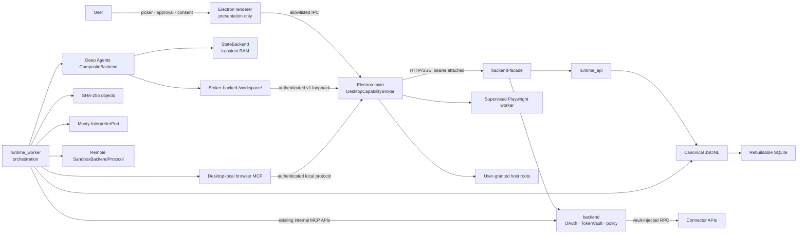
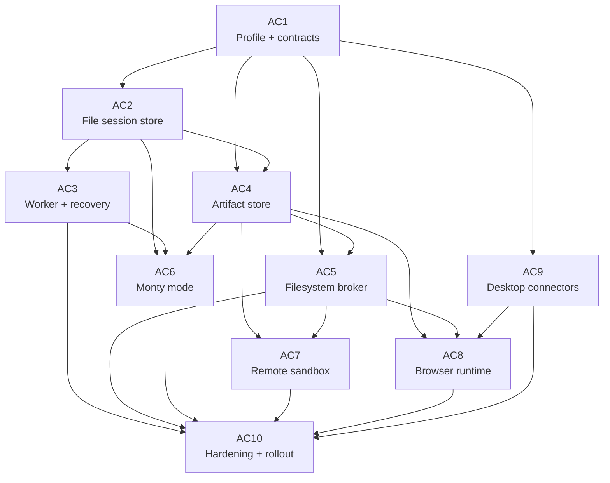

# Desktop Agent Capabilities — Target Architecture

Status: **accepted forward target; not current implementation** · Owners: Desktop, AI Runtime, Backend · Last updated: 2026-07-18

This document is the architectural **narrative** for [AC1–AC10](README.md): it explains the target shape, prior art, security model, storage policy, dependency graph, and rollout. It is **not** the normative wire/contract source.

**Precedence:** [AC1](01-ac1-desktop-capability-foundation.md) is the single normative source for the frozen v1 contracts — the on-disk layout and root (§8), the canonical storage envelope `FileSessionRecordV1` and `ArtifactRefV1` (§7.4–§7.5), grant modes and capability vocabulary (§7.3), the broker path/headers/handshake (§6.3), and the runtime-store/event-bus selectors (§6.2). AC1 now defines the single-writer LIGHT shapes directly (§25 closed): the flat `FileSessionRecordV1` and the flat `events.jsonl` session layout. Where this overview and AC1 (or the conforming AC2/AC4/AC5) differ on any of those, **AC1 wins** and this document is treated as stale until regenerated. Overview §8/§10/§12/§13.1/§14 are summaries that defer to AC1; do not build from their prose.

It extends the implemented desktop baseline without changing web behavior. Where this document says **current**, it describes code present at the date above. Where it says **target**, it describes work that is not implemented until its linked PRD, code, tests, and operating documentation land.

## 1. Problem statement

The desktop already packages Electron, PostgreSQL, `backend`, `ai-backend`, and `backend-facade`, but it does not yet behave like a durable, file-capable desktop agent:

- The renderer mounts the shared shell and then renders a phase placeholder instead of the real chat/thread destination.
- The service supervisor starts three Uvicorn children and enables an in-process AI worker; it does not supervise the separate `runtime_worker` process used by the production-style queue architecture.
- Agent state is canonical in embedded PostgreSQL. There is no consumer-readable, file-native desktop session format, rebuildable local search index, or durable per-subagent transcript file.
- Deep Agents sees in-state virtual files plus the custom `/drafts/` and `/subagents/` routes. It has no user-selected host workspace route.
- Electron main has privileged filesystem code for its own runtime, secrets, logs, and generated adapters, but there is no model-facing filesystem grant system or authenticated capability broker.
- There is no production browser worker/provider, Monty interpreter adapter, or remote sandbox provider.
- Large-result reference contracts exist, but a durable content-addressed offload writer is not wired into the runtime path.

The target must add these capabilities without turning Electron main into an execution engine, exposing host privileges to the renderer, bypassing existing policy/approval/budget middleware, duplicating connector credentials, or changing the web/PostgreSQL deployment.

## 2. Goals and non-goals

### Goals

- Make desktop conversation history and agent execution recoverable from canonical, append-only JSONL files.
- Keep SQLite disposable: it accelerates search, replay, queue claims, and retention but never becomes the only copy of user content or runtime events.
- Persist subagent work independently while writing every event exactly once.
- Store large bytes once in a workspace-scoped, SHA-256-addressed artifact store and keep bounded references in transcripts.
- Let users grant named host roots in `read_only`, `read_write_no_delete`, or `read_write` mode (AC1 §7.3).
- Put all model-facing host filesystem operations behind an authenticated, versioned Electron-main broker.
- Use Monty only for bounded embedded computation/programmatic tool calling and remote sandboxes for full shell/CPython/package execution.
- Run browser automation in a supervised worker with isolated workspace profiles and policy-aware typed tools.
- Reuse backend MCP registration, OAuth, token-vault, proxy, policy, approval, budget, audit, and event machinery.
- Preserve the renderer-to-facade-only rule and all non-desktop behavior.

### Non-goals

- No direct renderer access to Node.js, host paths, broker credentials, browser cookies, OAuth tokens, or sandbox credentials.
- No direct `FilesystemBackend` or `LocalShellBackend` over the user's machine.
- No arbitrary Python `exec`, `os`, `subprocess`, or host shell path for model-generated code.
- No claim that a path guardrail, embedded interpreter, Chromium process, or authenticated loopback API is equivalent to a kernel-isolated VM.
- No new connector SDK or duplicate token store in Electron or `ai-backend`.
- No cross-workspace artifact deduplication.
- No change to `apps/frontend`, public facade semantics, or `RUNTIME_STORE_BACKEND=postgres`.
- No Linux desktop release; Linux may remain a CI/runtime-build verification host.

## 3. Current-state evidence and gaps

Current code is more authoritative than the older phase labels in the desktop PRD.

| Area                   | Current evidence                                                                                                                                                                                                                                                                                                               | Gap this track closes                                                                                                                                                                                                                                                                                                                |
| ---------------------- | ------------------------------------------------------------------------------------------------------------------------------------------------------------------------------------------------------------------------------------------------------------------------------------------------------------------------------ | ------------------------------------------------------------------------------------------------------------------------------------------------------------------------------------------------------------------------------------------------------------------------------------------------------------------------------------ |
| Desktop shell          | [`apps/desktop/renderer/bootstrap.tsx`](../../../../apps/desktop/renderer/bootstrap.tsx) mounts `ChatShell`, transport, auth, and renderers.                                                                                                                                                                                   | It still mounts [`DesktopPlaceholder.tsx`](../../../../apps/desktop/renderer/DesktopPlaceholder.tsx) as destination content. AC3 wires real desktop chat/thread behavior.                                                                                                                                                            |
| Local stack            | [`apps/desktop/main/services/supervisor.ts`](../../../../apps/desktop/main/services/supervisor.ts) starts embedded PostgreSQL plus `backend`, `ai-backend`, and `backend-facade`.                                                                                                                                              | [`service-env.ts`](../../../../apps/desktop/main/services/service-env.ts) sets `RUNTIME_START_IN_PROCESS_WORKER=true` — the **single in-process worker is the shipping model** for the LIGHT store; AC3a wires the durable chat loop over it. A separately supervised `python -m runtime_worker` is the deferred AC3b topology only. |
| Runtime store          | [`runtime_adapters/factory.py`](../../../../services/ai-backend/src/runtime_adapters/factory.py) supports in-memory and PostgreSQL adapters. Desktop currently selects PostgreSQL.                                                                                                                                             | No desktop file-native adapter or rebuildable SQLite projection.                                                                                                                                                                                                                                                                     |
| Deep Agents filesystem | [`execution/factory.py`](../../../../services/ai-backend/src/agent_runtime/execution/factory.py) composes `StateBackend` with `/drafts/` and `/subagents/`. [`subagent_trace.py`](../../../../services/ai-backend/src/agent_runtime/context/memory/subagent_trace.py) projects read-only files from runtime events on demand.  | No broker-backed `/workspace/` route; subagent files are projections rather than durable child transcripts.                                                                                                                                                                                                                          |
| Checkpoints            | [`deep_agent_builder.py`](../../../../services/ai-backend/src/agent_runtime/execution/deep_agent_builder.py) falls back to `InMemorySaver`.                                                                                                                                                                                    | A process restart loses graph/interpreter checkpoint state.                                                                                                                                                                                                                                                                          |
| Large results          | [`ManagedContextPayload`](../../../../services/ai-backend/src/agent_runtime/context/memory/contracts.py) and [`ContextPayloadManager`](../../../../services/ai-backend/src/agent_runtime/context/memory/summarization.py) support references and an optional offload writer; `/large_tool_results/` is a known virtual prefix. | No production durable writer calls this path; large bytes can remain inline or be summarized.                                                                                                                                                                                                                                        |
| Code execution         | [`code_sandbox.py`](../../../../services/ai-backend/src/agent_runtime/capabilities/tools/code_sandbox.py) explicitly describes an in-process, trusted-development adapter that is not a production security boundary.                                                                                                          | No Monty `InterpreterPort` and no `SandboxBackendProtocol` provider.                                                                                                                                                                                                                                                                 |
| Browser                | Playwright is a root development dependency.                                                                                                                                                                                                                                                                                   | There is no supervised browser runtime, local browser MCP provider, profile policy, or browser-action event path.                                                                                                                                                                                                                    |
| Connectors             | [`services/backend/docs/features/mcp-registry.md`](../../../../services/backend/docs/features/mcp-registry.md) documents backend-owned registration, OAuth, vault, and RPC proxying.                                                                                                                                           | Desktop-specific system-browser completion and catalog gating are not integrated as an agent capability track.                                                                                                                                                                                                                       |

## 4. Architecture principles

The design applies SOLID and the repository's ports-and-adapters rules:

- **Single responsibility:** Electron main owns host privilege and process lifecycle; `ai-backend` owns orchestration; `backend` owns identity/connectors/secrets/policy; the renderer owns presentation.
- **Open/closed:** new session stores, interpreters, sandbox providers, and local MCP providers implement existing or narrowly extended ports. Core orchestration does not branch on vendor SDKs.
- **Liskov substitution:** file-native and PostgreSQL runtime adapters pass the same port-conformance suite. Sandbox and interpreter providers return the same typed outcomes and failure classes.
- **Interface segregation:** filesystem operations, artifact operations, interpreter calls, sandbox lifecycle, and browser actions use separate narrow interfaces. There is no `executeAnything` broker method.
- **Dependency inversion:** domain/runtime code depends on Pydantic protocols and provider interfaces, not Electron, Playwright, Monty, or a remote-sandbox SDK.
- **One source of truth:** JSONL owns desktop session events; user files own workspace content; backend `TokenVault` owns connector credentials; artifact objects own large bytes; SQLite and UI projections are rebuildable.
- **Fail closed:** unavailable broker auth, an absent grant, policy ambiguity, corrupt artifacts, unsupported storage versions, or an unpersisted side-effect intent stops the operation. There is no direct-host fallback.
- **Capabilities over ambient authority:** every external effect requires a named, scoped capability derived from verified runtime identity and an immutable per-run grant snapshot.
- **Desktop isolation:** every new adapter/tool requires `ENTERPRISE_DEPLOYMENT_PROFILE=single_user_desktop` and its feature flag. Profile checks are server-authoritative.

## 5. Component ownership

| Component               | Target ownership                                                                                                                                                       | Must not own                                                                                                                          |
| ----------------------- | ---------------------------------------------------------------------------------------------------------------------------------------------------------------------- | ------------------------------------------------------------------------------------------------------------------------------------- |
| Electron renderer       | Grant labels, picker request UI, approval UI, status, artifact previews. All remote product traffic remains through `IpcTransport` → main → facade.                    | Physical host paths as authority, broker tokens, filesystem implementation, browser cookies, OAuth/connector tokens, shell execution. |
| Electron main           | Native pickers, canonical grant/audit log, capability broker, per-run grant snapshots, service/browser process supervision, profile directories, keychain integration. | AI planning, connector token exchange, arbitrary model-generated execution, business persistence.                                     |
| `runtime_api`           | Existing conversation/run/SSE HTTP surface and file-store reads.                                                                                                       | Host privilege, connector credentials, browser process control.                                                                       |
| `runtime_worker`        | Queue claims, Deep Agents orchestration, event append, artifact/checkpoint writes, policy/approval/budget enforcement, interpreter and sandbox ports.                  | Direct arbitrary host filesystem or shell access.                                                                                     |
| `backend-facade`        | Existing public app API and desktop request path.                                                                                                                      | Capability-broker implementation or AI orchestration.                                                                                 |
| `backend`               | MCP catalog/registration, OAuth state and callbacks, `TokenVault`, RPC proxy, user/tool policy, product audit.                                                         | Desktop browser profile, host filesystem grants, AI orchestration.                                                                    |
| Desktop browser worker  | Typed Playwright operations inside one workspace profile and enforced network policy.                                                                                  | Tokens from backend vault, arbitrary host filesystem, Electron APIs, AI planning.                                                     |
| Remote sandbox provider | Isolated shell/full-language execution and explicit file transfer for one run/thread.                                                                                  | Long-lived user credentials or direct host mounts.                                                                                    |
| User-selected workspace | Canonical user files.                                                                                                                                                  | Session transcripts, connector secrets, browser profiles, or internal agent artifacts.                                                |

No deployable component imports another deployable component's implementation. The new reverse local boundary—`runtime_worker` to Electron main—is a versioned loopback protocol, not a Python/TypeScript import.

## 6. Target topology and control flow



The product request path remains renderer → Electron main → `backend-facade`. The broker is a separate desktop-local privilege plane used by the trusted AI worker; it is never exposed through the facade or preload bridge.

### 6.1 Durable event flow

```mermaid
sequenceDiagram
    participant W as in-process worker
    participant A as Session append coordinator
    participant J as events.jsonl / subagent stream
    participant S as SQLite projection
    participant API as runtime_api/SSE (same process)
    participant UI as Desktop renderer

    W->>A: RuntimeEventDraft + event_id + stream owner
    A->>A: Acquire per-conversation asyncio.Lock; assign per-run sequence_no
    A->>J: Append one complete JSON line
    A->>J: fsync according to durability class
    A-->>W: Durable RuntimeEventEnvelope
    A->>S: Upsert offset/FTS/state projection
    Note over S: May lag or be deleted; JSONL is canonical
    A->>API: Wake active subscribers in-process (no cross-process notifier)
    API->>S: Locate records after run sequence N
    API->>J: Read canonical records
    API-->>UI: Existing RuntimeEventEnvelope over SSE
```

### 6.2 Filesystem operation flow

```mermaid
sequenceDiagram
    participant U as User
    participant R as Renderer
    participant M as Electron main/broker
    participant W as runtime_worker
    participant P as Policy/approval/budget
    participant O as Artifact store
    participant F as Granted host root

    U->>R: Choose folder and mode
    R->>M: Request native picker
    M->>M: Resolve path; persist grant; audit
    M-->>R: Opaque grant id + display label
    W->>P: Proposed virtual /workspace operation
    P-->>W: Allowed or approval required
    W->>M: Authenticated request + run capability context
    M->>M: Validate immutable grant snapshot and resolved path
    alt mutating existing content
        M->>F: Read current bytes + stable file identity
        M-->>W: Snapshot bytes/hash
        W->>O: Persist and fsync snapshot object
        W->>M: Commit mutation with snapshot ref + expected identity
    end
    M->>F: Perform bounded operation
    M->>M: Append capability audit event
    M-->>W: Typed result
```

## 7. Desktop-only runtime selection

AC1 introduces the desktop runtime adapter selected by `RUNTIME_STORE_BACKEND=file` (AC1 §6.2), together with versioned capability contracts. The exact selector names are frozen in AC1; this section is a summary. The selector is valid only when:

1. `ENTERPRISE_DEPLOYMENT_PROFILE=single_user_desktop`;
2. the desktop file-store feature is enabled;
3. Electron supplied a valid runtime root and broker bootstrap;
4. the layout/protocol versions are supported.

**Single in-process worker (LIGHT store, shipping model).** The packaged target runs `runtime_api` with `RUNTIME_START_IN_PROCESS_WORKER=true`; subagents are in-process async tasks (`await subagent.ainvoke(...)`). There is exactly **one** process writing the file-native store, so the API and worker share memory: SSE waiters are woken **in-process** directly after the canonical append, and the graph checkpointer reuses LangGraph `SqliteSaver`. No separate `python -m runtime_worker`, no cross-process event bus, and no `RUNTIME_EVENT_BUS_BACKEND=file_notify` are required for the shipping desktop. `file_notify` remains an AC1-reserved selector for the deferred variant only.

**Deferred: separate worker + cross-process wake (AC3b, optional).** A future topology could run `runtime_api` with the worker `RUNTIME_START_IN_PROCESS_WORKER=false` and supervise `python -m runtime_worker` separately; two processes then need a cross-process wake (the AC1 `file_notify` `DesktopFileEventBus` advisory notifier) plus cross-process leases and reconciliation. That is the **optional/deferred** [AC3b](03-ac3-runtime-recovery.md) path; it is not built for the LIGHT store because a single writer needs none of it.

The embedded PostgreSQL process remains because `backend` still owns product, identity, policy, connector, token-vault, and audit data there. Only the legacy desktop AI-runtime PostgreSQL data selected by `AI_BACKEND_DB_NAME` migrates to the file-native adapter. Web, managed, self-hosted, and SaaS profiles continue to select PostgreSQL and their existing worker/event-bus topology.

## 8. Exact on-disk layout

> **Normative source: [AC1 §8](01-ac1-desktop-capability-foundation.md) and [AC2 §Filesystem layout](02-ac2-file-session-store.md).** The tree below is an orienting summary. Per the LIGHT store decision (§25 closed), the layout AC1 §8 freezes is a **flat `events.jsonl` per conversation** — **no** `CURRENT`, `generations/`, `pending/`, `locks/`, or `quarantine/` tree, because a single writer needs no copy-on-write or cross-process lock machinery. The root is `agent-data/v1` (not `agent-runtime/v1`), and grant material is **encrypted and stored outside `agent-data`**, under `capability-broker/v1/`. If this summary and AC1/AC2 disagree, AC1/AC2 win.

`{userData}` means Electron's `app.getPath("userData")`. Version 1 adds two sibling roots:

```text
{userData}/
├── agent-data/v1/                         # canonical, exportable
│   ├── store.json
│   └── workspaces/<workspace-key>/
│       ├── workspace.jsonl
│       ├── audit.jsonl
│       ├── sessions/<conversation-key>/
│       │   ├── events.jsonl                # flat main conversation/run stream (append-only)
│       │   └── subagents/<task-key>.jsonl  # one file per subagent task
│       ├── objects/sha256/...              # AC2-owned content-addressed bytes; AC4 wires offload
│       ├── browser/{profiles,staging}/     # AC8-owned; not a Deep Agents route
│       ├── tmp/                            # same-volume staging for object put/compaction
│       └── index/catalog.sqlite3           # rebuildable disposable projection
└── capability-broker/v1/
    └── grants/                             # encrypted, Electron-main-owned, NOT exported
```

Rules:

- `<workspace-key>`, `<conversation-key>`, `<task-key>`, and browser keys are deterministic lowercase base32 SHA-256 encodings of scoped logical IDs. Untrusted IDs never become literal path segments, avoiding traversal and Windows reserved-name problems.
- In storage terminology, a **session** is the existing conversation. Version 1 does not create a second product identity: the logical `session_id` is the existing `conversation_id`.
- `store.json` contains only layout version, store UUID, creation time, and app version. It contains no token, host path, prompt, or user content.
- Each session holds one flat append-only `events.jsonl` main stream; each child subagent has one JSONL stream. There are no copied child events in the parent stream. A single in-process writer appends directly; retention/hard deletion compacts or removes whole files (temp-file + atomic rename), not in-place edits.
- Checkpoint blobs, tool results, screenshots, downloads, attachments, draft versions, and pre-edit snapshots are AC2 `objects/sha256` objects (offload wired by AC4). Their JSONL events carry typed references; no second mutable artifact catalog is canonical.
- SQLite under `index/` is a projection over JSONL and object reachability. Its `-wal`/`-shm` files are implementation files, not backup inputs.
- **Grants and broker/capability credentials live under `capability-broker/v1/`, encrypted, written only by Electron main. They are outside `agent-data`, are never a Deep Agents filesystem route, and are excluded from session export** (see §20). `browser/profiles/` and `browser/staging/` are written only by the supervised browser lane.
- Directories are user-only (`0700`) and files user-only (`0600`) on POSIX. Windows ACLs grant the current user and `SYSTEM` only. Session JSONL is plaintext; OS permissions are the at-rest boundary. Grant material additionally relies on Electron-main encryption, not plaintext.
- Existing `{userData}/secrets/`, `pgdata/`, `logs/`, `adapters/`, and audit files are not silently moved by this layout.

## 9. Filesystem versus RAM policy

### 9.1 Canonical on disk

- Main and per-subagent JSONL records.
- Workspace-scoped content-addressed objects.
- Grant and capability-audit records owned by Electron main, stored **encrypted under `capability-broker/v1/`, outside `agent-data`** (AC1 §8, AC5). They are not part of any session tree and are never exported with a session.
- Browser profile data, separately permissioned from transcripts.
- Existing backend PostgreSQL data, including OAuth state, connector registry, `TokenVault`, user policy, and backend audit.

### 9.2 Rebuildable on disk

- SQLite event offsets, FTS, conversation/run/subagent projections, artifact reachability/refcounts, queue leases, retention deadlines, and repair state.
- Any human-readable subagent `conversation.md`, `tool_calls.json`, or summary view. These remain virtual projections over canonical child JSONL.
- Derived thumbnails, previews, and caches.

### 9.3 RAM only

- Active model context, parsed event projections, SSE buffers, caches, file watchers, process handles, browser handles, and decrypted tokens.
- Immutable per-run grant snapshots and their opaque capability context.
- Monty live interpreter state between persistence points.
- Remote-sandbox client handles and short-lived provider credentials.
- Uncommitted JSONL batches and bounded inline previews.

When resumability requires interpreter, graph, or browser-neutral state, a serialized checkpoint becomes an artifact object and a checkpoint event references it. OS/process/browser handles are never serialized.

### 9.4 Independent sources of truth

- Session events: JSONL.
- User documents: the selected host roots.
- Large bytes: artifact objects.
- Connector credentials: backend `TokenVault`.
- Browser login state: the workspace browser profile, never a transcript or connector token record.
- Active grants: the fold of main-owned grant/revoke records.

There is no dual canonical write between JSONL and SQLite or between artifact objects and transcript payloads.

## 10. Canonical JSONL and rebuildable SQLite

> **Normative source: [AC1 §7.4](01-ac1-desktop-capability-foundation.md) (`FileSessionRecordV1`) and [AC2 §Typed contracts / §Append and durability protocol](02-ac2-file-session-store.md).** This section is a conceptual summary. The canonical envelope is the flat `FileSessionRecordV1`; there is **no** session-global counter and **no** `storage.batch_committed` marker — a single in-process writer appends one line per record, serialized by a per-conversation `asyncio.Lock`. Ordering uses the existing per-run `sequence_no`. Build from AC1 §7.4 / AC2, not from the illustrative shape below.

### 10.1 Record and sequence semantics

Each canonical line is one UTF-8 JSON object ending in `\n`. Conceptually it carries the existing per-run event, for example:

```json
{
  "schema_version": 1,
  "record_kind": "runtime.event",
  "payload": {
    "event": {
      "event_id": "evt_...",
      "run_id": "run_...",
      "conversation_id": "conv_...",
      "sequence_no": 91,
      "event_type": "tool_result",
      "payload": {}
    }
  }
}
```

- Existing `RuntimeEventEnvelope.sequence_no` remains monotonic **per run** and preserves SSE reconnect behavior.
- There is **no** `global_sequence_no`. Cross-run/cross-file ordering for a merged conversation view derives from parent linkage events plus per-run `sequence_no` and the single-writer append order; no global cross-file coordinator is needed.
- `event.event_id` is the idempotency key. A retry after an uncertain write returns the existing record rather than appending a duplicate.
- Appends for one conversation are serialized by a single in-process, per-conversation `asyncio.Lock` — the correct concurrency control for one writer process. There is no cross-process advisory lock.
- An event is physically written to exactly one file. Supervisor/run-level events and subagent dispatch/terminal linkage events live in `events.jsonl`; events emitted inside a subagent execution scope live only in that task's child JSONL.
- Replay of one run merges its records by per-run `sequence_no`. SQLite stores `(record_id, file_id, byte_offset, byte_length, run_id, run_sequence_no)` for fast reads; a per-file scan is the index-free fallback.

### 10.2 Append, visibility, and crash safety

- The writer serializes a complete line before issuing one append. Model deltas may micro-batch for at most 64 records or 100 ms.
- Side-effect intent, approval, grant, terminal lifecycle, and checkpoint-reference events are individually fsynced before the effect is acknowledged or exposed as durable. An append is acknowledged only after its required `fsync`.
- Model deltas may use the bounded batch policy. SSE never publishes a record before the corresponding append succeeds.
- SQLite updates occur after JSONL durability. An index transaction may lag; recovery replays from its last verified offset.
- On load, a torn or partial final line (an unacknowledged crash mid-append) is **ignored**; earlier history is never rewritten. There is no `quarantine/` tree and no in-place truncation of committed data — an unacknowledged trailing line simply is not read.
- Interior corruption (an invalid line that is not the final line) is not auto-rewritten. The conversation becomes read-only, repair tooling reports the first bad offset, and recovery requires an explicit repair/export action.
- SQLite uses WAL mode, foreign keys, transactional schema migrations, a single logical writer, and bounded busy timeouts. Deleting `index/` and rebuilding must restore all durable query state; active queue claims intentionally return as unclaimed/recoverable.

## 11. Subagent transcript strategy

The target replaces the current on-demand-only child projection with durable child streams while preserving the existing `/subagents/<task_id>/` model-facing interface.

- One dispatch creates one stable `task_id` and one child stream.
- Parent lifecycle records link `task_id`, parent run/task IDs, subagent name, objective, and terminal summary. They are parent events, not copies of child events.
- Model deltas, tool calls/results, approvals, usage, checkpoints, progress, and terminal details produced inside that subagent are appended only to its child stream.
- Parent/child ordering derives from parent linkage events and per-run `sequence_no`; `event.event_id` prevents replay duplication. There is no global cross-file counter.
- The virtual `conversation.md`, `tool_calls.json`, `summary.md`, and `events.jsonl` views are generated from the child stream and existing visibility/redaction rules. They are not stored as another source of truth.
- Cancellation or timeout closes the child with a typed terminal or reconciliation event when possible. If the process dies first, recovery appends one synthetic `interrupted` reconciliation event after proving no terminal event exists.
- Resume loads parent and relevant child checkpoints. A completed child is never re-dispatched merely because the parent crashed.
- Deleting a conversation deletes all child streams under the same retention/legal-hold decision.

This is “each event exactly once,” not “copy the global transcript into convenient folders.”

## 12. Content-addressed artifacts and large results

> **Normative source: [AC1 §7.5](01-ac1-desktop-capability-foundation.md) (`ArtifactRefV1`), [AC2 §Content-addressed object store](02-ac2-file-session-store.md) (the `objects/sha256` byte primitive), and [AC4](04-ac4-artifact-store.md) (offload wiring, previews, `/large_tool_results/`, retention, GC).** The frozen `ArtifactRefV1` uses `version`, `artifact_id` (`sha256:<hex>`), `sha256`, `logical_size`, `stored_size`, `mime_type`, `compression`, `kind`, `preview_utf8`, and `preview_truncated`. **`compression` is `none` or `gzip`** (not `zstd`); readers reject unknown values. The storage URI is `artifact://sha256/<hex>`. Do not build from an alternate field set. **AC2/AC4 split:** AC2 owns the content-addressed byte store; AC4 decides what to offload, types the reference, and owns reachability/GC.

`ArtifactRefV1` is the only durable large-payload reference shape. Conceptually:

- `sha256` and `logical_size` cover the original uncompressed bytes; `stored_size` covers the encoded blob. `compression` is versioned as `none` or `gzip`, and readers reject unknown values rather than guessing. The object path is derived only from the digest.
- Objects are immutable and deduplicated only within one workspace. A different workspace has a different object namespace even for identical bytes.
- Writers use a random same-filesystem temporary file, stream/hash/size limits, fsync, atomic rename, and post-write verification. An existing digest is reused only after size/hash verification.
- MIME and logical names are validated metadata in references, not trusted execution hints. Files are never opened or executed automatically.
- Transcript/event payloads contain typed refs and bounded previews. Full bytes do not also remain inline.
- The existing `/large_tool_results/` virtual convention is retained: Deep Agents reads through an artifact-backed route, so AC4 wires the existing context-payload contract instead of inventing another result format.
- Reference counts and reachability are derived in SQLite from canonical records. A zero count is not sufficient for deletion until retention, legal hold, export, and open-handle checks pass.
- Corrupt or missing objects produce a typed unavailable result, a checksum-failure audit event, and no fallback to unverified bytes.
- Pre-edit snapshots use the same store. A host mutation cannot commit until its required snapshot object is durable.

## 13. Filesystem grants

### 13.1 Grant creation and modes

Only an interactive user can create or expand a grant, through an Electron-main native picker. The renderer may request the picker and display a sanitized label; it cannot submit an authoritative physical path.

Each grant binds:

- opaque `grant_id`;
- verified workspace/user session;
- canonical resolved root plus stable filesystem identity where the OS supports it;
- display label;
- mode;
- creation/revocation time and actor;
- optional expiry;
- policy version.

Modes (frozen wire values in [AC1 §7.3](01-ac1-desktop-capability-foundation.md); use the underscore casing below, not `read-only`/`read-write`):

- **`read_only`** — stat, list, read, glob, and grep.
- **`read_write_no_delete`** — read operations plus create, mkdir, write, and edit. Broker-internal atomic replacement of the same logical file is allowed; unlink, rmdir, rename-away, and overwrite-by-rename of another existing path are denied.
- **`read_write`** — all above plus explicit delete and move/rename, subject to policy and approval.

The agent sees `/workspace/<grant_id>/...`, never a host path. A request outside the snapshot returns `grant_required`; it cannot trigger an implicit broader grant.

### 13.2 Path validation

For every operation, Electron main:

1. parses a normalized virtual path and rejects NULs, device names, alternate data streams, absolute paths, `..`, and unsupported encodings;
2. resolves the grant root and every existing ancestor before policy comparison;
3. rejects symlink/junction/reparse-point escapes and mount changes;
4. opens by handle relative to the validated root where platform APIs allow;
5. revalidates file identity before mutation and before atomic rename;
6. applies byte, file-count, depth, and duration limits;
7. logs the resolved outcome without logging file content.

Symlink resolution occurs before authorization, not after. Tests cover race swaps between validation and use.

### 13.3 Run snapshots and approvals

At run creation, main folds active grants into an immutable RAM snapshot and mints an opaque, unguessable run capability context. The trusted worker must present that context; caller-supplied `workspace_id`, `run_id`, `grant_id`, role, or scope is never sufficient authorization.

A main-transport/facade handoff carries only the opaque context needed by the desktop worker. Main remains authoritative. After app restart the snapshot is gone; an interrupted privileged run pauses with `reauthorization_required` rather than rebuilding authority from untrusted transcript fields.

Policy still applies inside a grant:

- reads may be pre-approved by workspace policy;
- writes require the matching mode and the existing tool-policy/approval decision;
- deletes, mass edits, moves, executable changes, and grant expansion require explicit approval;
- all bridged calls consume tool budgets and emit normal tool events.

## 14. DesktopCapabilityBroker

### 14.1 Protocol

> **Normative source: [AC1 §6.3](01-ac1-desktop-capability-foundation.md).** The broker path is `/v1/*` (handshake at `/v1/handshake`) and the required headers are `Authorization: Bearer <token>`, `X-Desktop-Broker-Version: 1`, `X-Desktop-Broker-Instance: <id>`, and `X-Request-Id: <uuid>` — not `/desktop-capabilities/v1` or `X-0x-Capability-Protocol`.

Electron main binds a random `127.0.0.1` port only. The protocol is `/v1/*` over loopback HTTP with:

- a per-process, per-audience 256-bit bearer (`Authorization: Bearer <token>`);
- `X-Desktop-Broker-Version: 1` and `X-Desktop-Broker-Instance: <id>`;
- strict request/response schemas and body limits;
- replay-resistant request IDs;
- short deadlines and cancellation;
- no CORS, discovery, wildcard bind, redirects, proxying, or arbitrary URL method.

The supervisor passes the broker URL as non-secret configuration. Bearers are delivered to the intended child over a child-only bootstrap pipe/handle, never the command line, renderer IPC, persistent environment file, log, or transcript. Runtime-worker and browser lanes receive distinct audiences and method allowlists. Tokens rotate on every app boot.

AC1 freezes one schema source and generates or conformance-tests both TypeScript and Pydantic sides. Hand-maintained wire-shape drift is not accepted. Major versions use a new path; startup negotiates an exact supported version and fails closed on mismatch.

### 14.2 Narrow methods

The filesystem surface maps to the Deep Agents `BackendProtocol` operations needed for `/workspace/`: `stat/list/read/grep/glob/write/edit/mkdir/delete/move`. Snapshot preparation and commit are explicit two-phase methods. There is no shell, process spawn, raw file descriptor, unrestricted host path, arbitrary HTTP fetch, Electron eval, or generic IPC method.

`ai-backend` supplies a broker-backed `BackendProtocol` route:

```text
CompositeBackend
├── default                 -> StateBackend (transient internal scratch)
├── /workspace/             -> DesktopBrokerBackend
├── /subagents/             -> durable child-transcript projection
├── /drafts/                -> existing draft semantics on file-native ports
└── /large_tool_results/    -> ArtifactBackend
```

Deep Agents `FilesystemBackend(virtual_mode=True)` is not used as the host privilege boundary. Its path normalization is useful defense in depth, but it does not authenticate grants or isolate a process.

### 14.3 Trust boundary limitation

The broker is a product capability boundary against model/tool misuse and renderer compromise. It is not a kernel boundary against a compromised trusted `ai-backend` process running as the same OS user. The target therefore:

- never executes untrusted generated full Python/shell code in that process;
- routes such code to Monty with no ambient capabilities or to a remote sandbox;
- keeps broker methods narrow and grants explicit;
- treats Electron-main or trusted-worker code compromise as high-impact residual risk;
- does not claim parity with Cowork's kernel-isolated VM.

Local same-user malware or an administrator can read plaintext transcripts and may access user files independently of this broker. That threat is outside the product's local OS-user boundary and must be stated in security/UI documentation.

## 15. Execution model

### 15.1 Monty code mode

Monty sits behind a feature-flagged `InterpreterPort` in `runtime_worker`.

- It is an experimental embedded interpreter for a Python subset, not full CPython, a subprocess, a VM, or remote execution.
- Filesystem, network, and environment access are absent by default.
- CPU/time, memory/allocation, stack depth, output bytes, external-call count, and snapshot size have hard limits.
- Pure computation is the default. Every external function is explicitly registered and maps to an existing typed tool.
- A bridged tool call re-enters authorization, policy, approval, budget, audit, event, and payload-offload middleware exactly as a normal tool call. No bridge may call a tool implementation directly.
- Live state is RAM-only. A resumability point serializes a bounded Monty snapshot into the artifact store and appends a checkpoint reference.
- Versions are pinned and snapshot compatibility is explicit. An unsupported snapshot pauses for restart/recomputation; it is never blindly loaded.
- Because Monty is experimental, rollout begins opt-in. Unsupported language behavior falls back to ordinary model/tool orchestration, not `exec`.

LangChain's QuickJS interpreter is useful prior art, but its documented PTC bridge currently bypasses per-call `interrupt_on` approvals. 0xCopilot cannot adopt that behavior; every Monty external call must traverse the normal enforcement path.

### 15.2 Remote sandbox execution

Full CPython, shell, package installation, builds, tests, and executable workloads use a provider implementing Deep Agents `SandboxBackendProtocol`.

- One provider-neutral registry and one initial pinned provider land in AC7.
- A sandbox is scoped to a run/thread with TTL, timeout, cancel, teardown, leak detection, and provider IDs in audit events.
- Input arrives only through explicit upload/snapshot APIs. A user workspace is never mounted directly.
- Granted files are copied as a manifest of artifact refs; output returns as artifact refs and a structured patch.
- Applying a patch to the host is a separate broker operation with diff review, grant checks, snapshot-before-write, and approval.
- Secrets remain in host/backend tools where possible. If a provider requires a credential, use a short-lived, audience-scoped reference or injection proxy, never a long-lived user token in transcript or image.
- Network is deny-by-default and provider capability is surfaced honestly. A provider unable to enforce required egress policy is ineligible for sensitive tasks.
- `LocalShellBackend` and raw host subprocess are prohibited in production desktop mode.

Monty and remote sandboxes are complementary: Monty is low-latency, capability-scoped computation inside the agent loop; the sandbox is isolated environment execution.

## 16. Browser architecture

AC8 adds a desktop-local MCP provider backed by a supervised Playwright worker:

```text
runtime_worker
  -> typed browser MCP tools
  -> authenticated Electron-main browser control
  -> supervised Playwright worker
  -> one persistent context per workspace/profile
```

- Electron main owns worker spawn, health, restart, version pin, profile location, and teardown. Playwright does not run in the renderer or Electron main thread.
- Each workspace uses a separate browser profile. Incognito/ephemeral contexts are available for one-off tasks. Profiles never share cookies or storage.
- The AI model receives typed actions such as navigate, inspect, click, type, submit, screenshot, and download. It does not receive a generic Playwright eval or arbitrary JavaScript escape hatch.
- Network policy is deny-by-default. Allowed origins are explicit; every redirect and DNS resolution is rechecked. Loopback, private/link-local ranges, cloud metadata, `file:`, `data:`, `javascript:`, extension URLs, and local broker/service ports are denied unless a dedicated test-only policy says otherwise.
- Page content is untrusted input. Prompt injection cannot expand domain, filesystem, connector, or approval capabilities.
- Downloads first land in a per-run staging directory with limits, sanitized names, and no execution. Successful downloads and screenshots move to the artifact store; the transcript receives refs.
- Browser credentials/cookies stay in the browser profile or OS-mediated login flow. Backend connector access/refresh tokens remain in `TokenVault`.
- Creating a persistent profile, interactive login, crossing a domain boundary, submitting data, purchasing, sending, deleting, or uploading local content requires policy and consent appropriate to the action.
- Every action emits a typed event with workspace, run, profile, origin, action class, approval/grant IDs, latency, status, and artifact refs; selectors, typed secrets, and page bodies are redacted.
- Prefer connector APIs first, browser automation second, and a separately reviewed computer-use fallback last. LangChain's Playwright toolkit is prototype/reference material, not the production policy boundary.

The Chromium sandbox and worker process reduce blast radius but are not documented here as a Cowork-style VM. Browser compromise remains a threat requiring prompt patching, origin controls, profile isolation, and no ambient host capability.

## 17. Connector and OAuth reuse

Connector APIs remain the preferred integration path:

1. The app lists/installs a backend catalog entry through `backend-facade`.
2. `backend` creates OAuth state, PKCE values, client registration, and audit records.
3. Electron main opens the system browser and handles the loopback/deep-link completion UX.
4. The callback reaches the facade/backend-owned flow; `backend` exchanges and stores tokens in `TokenVault`.
5. `runtime_worker` discovers connector cards through the existing backend internal API and invokes tools through the existing RPC proxy.
6. The backend proxy decrypts and attaches tokens only for the upstream call. Electron, the renderer, transcripts, browser events, Monty, and remote sandboxes never receive plaintext connector tokens.

AC9 gates Google Workspace, Microsoft 365, and Atlassian/Jira catalog availability to the desktop capability profile where needed; it does not build duplicate SDK clients. The desktop's own sign-in bearer remains in Electron `safeStorage`, distinct from connector OAuth credentials. Adapters in `packages/surface-renderers` remain pure renderers and never perform OAuth or tool calls.

## 18. Trust zones and threat model

| Zone/threat                        | Controls                                                                                                                    | Residual risk                                                                                                                               |
| ---------------------------------- | --------------------------------------------------------------------------------------------------------------------------- | ------------------------------------------------------------------------------------------------------------------------------------------- |
| Malicious prompt/tool/page content | Typed tools, least-capability exposure, policy/approval/budget middleware, origin rules, bounded previews.                  | Model-layer defenses are probabilistic; environmental scopes must remain enforceable.                                                       |
| Compromised renderer               | Context isolation, allowlisted preload IPC, no broker route/token, no bearer, no Node, main-owned native picker.            | Electron/Chromium vulnerabilities can cross the boundary; patch cadence matters.                                                            |
| Path traversal/symlink race        | Main-owned resolution, path-safe IDs, symlink/junction checks before authorization, handle-relative open, identity recheck. | Filesystems with weak identity primitives require conservative denial.                                                                      |
| Generated code                     | Monty has no ambient host capabilities; full execution goes remote; no host `exec`/shell.                                   | Monty is experimental and embedded; remote-provider and supply-chain compromise remain.                                                     |
| Malicious web page                 | Browser process/profile isolation, deny-by-default egress, private-IP/metadata denial, typed actions, consent.              | Allowed origins can still exfiltrate; an allowlist is a capability, not proof of safe content.                                              |
| Broker spoof/replay                | Loopback-only bind, per-audience boot tokens, version handshake, request IDs, deadlines, run capability context.            | Same-user malware or trusted-child compromise can attack local processes.                                                                   |
| Cross-workspace access             | Workspace-scoped roots/objects/profiles/tokens, immutable grant snapshot, no cross-workspace dedupe.                        | The desktop profile uses the OS user as its outer tenant boundary; it is not RLS isolation.                                                 |
| Credential leakage                 | Backend vault, Electron keychain, no secrets in JSONL/artifacts/logs, redaction and secret-shaped tests.                    | A tool that reads a credential file can place it in plaintext history; picker warnings and deny rules reduce but do not eliminate this.     |
| Disk theft/backups                 | User-only ACLs; configurable cleanup; documented plaintext posture.                                                         | Transcripts are not application-encrypted. Full-disk encryption and backup controls are deployment/OS controls, not evidenced by this repo. |
| Local audit tampering              | Hash-chain records using shared audit primitives, backend anchoring/export when available, repair evidence.                 | A local administrator can delete/replace local files. Local logs are tamper-evident, not immutable or SIEM-complete by themselves.          |
| Crash/disk corruption              | Append/fsync classes, torn-tail-ignore on load, index rebuild from JSONL, artifact verification, backup/export.             | Filesystem/hardware failure can still lose unflushed model deltas; user-facing durability semantics must state this.                        |

### 18.1 Sensitive workflow accountability

| Workflow                    | Who can initiate/approve                                                                        | What changes                                          | Audit owner                                                  | Retention/deletion                                                                                           |
| --------------------------- | ----------------------------------------------------------------------------------------------- | ----------------------------------------------------- | ------------------------------------------------------------ | ------------------------------------------------------------------------------------------------------------ |
| Add/expand filesystem grant | Interactive signed-in user through native picker; policy cannot auto-expand.                    | Main-owned grant log and active snapshot eligibility. | Electron main; backend anchor when online.                   | Revoke immediately removes future authority; grant/audit record follows security-audit retention/legal hold. |
| Mutate/delete host file     | Model proposes; existing policy and user approval as required; broker independently authorizes. | User workspace plus durable pre-edit snapshot.        | Runtime tool event + main capability audit.                  | User file remains user-owned; snapshot follows session retention/hold and is deleted by reachability.        |
| Run Monty external call     | Model; tool policy/approval/budget for every bridged call.                                      | Interpreter RAM/checkpoint plus external tool effect. | Runtime events/audit.                                        | Snapshot/output follows session retention; external effect follows owning system.                            |
| Start remote sandbox        | Model or user; policy/approval for data transfer and execution.                                 | Remote environment, uploaded refs, output refs/patch. | Runtime sandbox events.                                      | Provider TTL/teardown plus local artifact retention; cleanup failure is alerted.                             |
| Browser login/action        | Interactive user for profile/login; model actions subject to domain/action policy.              | Browser profile or remote site.                       | Browser action events; connector actions also backend audit. | Profile deletion is workspace-scoped; screenshots/downloads follow artifact policy.                          |
| Connector OAuth/tool call   | User authorizes OAuth; model calls an allowed tool.                                             | Backend token state or SaaS data.                     | Backend MCP audit + runtime tool event.                      | Token revocation/deletion is backend-owned; transcript refs follow session policy.                           |

## 19. Failure and recovery semantics

- **Main or broker unavailable:** privileged tools return `desktop_capability_unavailable`; runs may pause/retry, but never fall back to direct filesystem/browser access.
- **App/worker crash (single in-process worker):** on restart the process loads JSONL (ignoring any torn tail), rebuilds the disposable index, reconstructs run/subagent/checkpoint state, appends one reconciliation event if needed, and resumes only idempotent work. (A _separate_ worker with cross-process lease expiry is the deferred AC3b topology only.)
- **Reconnect:** SSE clients reconnect using existing per-run `sequence_no`; canonical JSONL is authoritative and replay is complete.
- **App restart:** per-run grant snapshots disappear. Privileged interrupted runs require user reauthorization before resume.
- **Duplicate delivery:** event IDs, tool-call IDs, provider operation IDs, and connector idempotency keys prevent duplicate persistence/effects. An uncertain non-idempotent external effect stops for reconciliation rather than retrying blindly.
- **Disk full/read-only:** fail before an external side effect if its intent/snapshot cannot be made durable. Existing readable sessions remain available; cleanup requires explicit policy.
- **JSONL torn tail:** an unacknowledged trailing line (crash mid-append) is ignored on load; earlier history is never rewritten. Interior corruption makes the conversation read-only for explicit repair/export.
- **SQLite loss/corruption:** close it, move it aside, rebuild from canonical files, and compare counts/high-water marks before accepting writes.
- **Artifact mismatch:** quarantine/mark unavailable, emit checksum failure, and do not serve bytes.
- **Browser crash:** mark action interrupted, terminate context, preserve profile only if healthy, clean staging, restart within crash budget, and require confirmation before retrying a side effect.
- **Remote sandbox timeout/provider outage:** cancel then teardown, keep durable uploaded/output refs, and report cleanup status. No local-host fallback.
- **Monty limit/snapshot incompatibility:** terminate evaluation, emit a typed limit/compatibility event, and fall back to normal orchestration or restart from a supported checkpoint.
- **Backend OAuth unavailable:** connector tools pause/fail with reauthentication or service-unavailable state; browser automation is not an automatic credential bypass.

## 20. Retention, deletion, export, and legal hold

**Profile-scoped posture.** On `single_user_desktop` the signed-in user is the administrator and owns the files, so operator-boundary controls (legal hold that "blocks physical deletion", dry-run deletion plans, deletion-evidence guarantees) cannot bind them — a local `rm` defeats any such guarantee, as the threat model concedes (§18, §14.3). The desktop path therefore ships the _right-sized_ subset and explicitly does **not** market the heavier machinery. The retention-sweeper over all entity types, binding legal hold, and deletion-evidence guarantees remain in the **managed / PostgreSQL** deployment path, where an operator/tenant boundary makes them meaningful.

Desktop (`single_user_desktop`):

- Retention is **user-configurable age-based cleanup** (the Claude Code `cleanupPeriodDays` pattern), off or generous by default; no architecture prose silently changes existing data, and AC10 owns any default migration.
- Deletion is a real cascade: deleting a conversation removes its session directory (`events.jsonl` plus every subagent stream, by temp-rename then unlink) and decrements AC4 object reachability so unreferenced eligible objects are collected. Deleting a workspace additionally revokes filesystem grants, stops browser contexts, deletes browser profiles/staging, and requests backend connector/token deletion through existing APIs.
- Local **tamper-evidence** reuses `packages/audit-chain` (hash-chained capability/audit records), disclosed honestly as _tamper-evident, not tamper-proof or immutable_: a same-OS-user process can still delete or rewrite local files.
- A user-set **local hold** is an _advisory_ flag that stops the app's own cleanup/deletion of held sessions. It is explicitly disclosed as non-binding against the OS user and is not presented as compliance-grade legal hold.
- User workspace files are never deleted by transcript retention; they change only through an authorized filesystem operation.
- Revocation removes grant authority immediately even if its audit record remains.

Export and backup (both profiles):

- Export includes canonical JSONL, an object manifest with hashes, layout/protocol versions, and optional user-selected workspace diffs. It **excludes decrypted tokens, browser cookies, and all grant/broker credential material** (which live encrypted under `capability-broker/v1/`, outside the exported session tree — see §8).
- Backups must include JSONL and objects, not SQLite WAL/SHM alone. Browser profiles and backend PostgreSQL require separate backup decisions.
- Local audit chaining is evidence of tampering, not immutable retention. Regulated deployments require an evidenced export/anchor path and policy; this track does not mark that control complete from local files alone.

Managed / PostgreSQL deployments retain the full retention-sweeper (conversations, main/child events, runs, approvals, tool invocations, usage, drafts, checkpoints, memory, artifact refs, outbox/queue state, derived indexes), the marks-then-plans expiry workflow, binding legal hold, and deletion-evidence records, because an operator boundary can enforce them. That machinery is defined in the managed retention path, not duplicated into desktop-only code.

## 21. Observability

All lanes share `trace_id`, `run_id`, `conversation_id`, `workspace_id`, `event_id`, and where applicable `task_id`, `tool_call_id`, `grant_id`, `artifact digest`, `browser profile id`, and `sandbox provider id`.

Required signals:

- JSONL append/fsync latency, micro-batch size, per-conversation lock wait, torn-tail-ignore count, index lag/rebuild progress, and per-run sequence gaps.
- Queue depth, lease age, worker restarts, resume/reconciliation outcomes, and orphaned child tasks.
- Artifact bytes/count, dedupe ratio, checksum failures, missing refs, staging age, and quota pressure.
- Broker auth/version failures, operations by class/mode, denied path reasons, approval latency, and grant changes.
- Monty execution/limit/snapshot/external-call metrics with code and data excluded.
- Sandbox create/ready/execute/cancel/teardown latency, provider errors, egress policy, leaked-resource alarms, and transfer bytes.
- Browser action latency/status, origin transitions, consent/approval state, profile health, crashes, blocked SSRF attempts, download/screenshot refs, and cleanup.
- Connector discovery/auth/RPC outcomes reuse existing backend and runtime signals.

Logs and telemetry never include prompts, page bodies, file bytes, typed secrets, tokens, cookies, authorization headers, Monty source, or raw sandbox environment. “Send diagnostics” must produce a previewable manifest and require user consent.

## 22. Testing strategy

### 22.1 Contract and unit

- Pydantic/TypeScript serialization fixtures for storage records, artifact refs, grant snapshots, broker messages, interpreter/sandbox/browser outcomes, and version negotiation.
- Runtime port conformance against in-memory, PostgreSQL, and desktop-file adapters; PostgreSQL expected behavior remains unchanged.
- Pure policy tests for grant mode matrices, approval classes, quotas, retention, legal hold, and profile/feature-gate denial.

### 22.2 Crash and durability

- Kill/fault injection before and after append, fsync, rename, SQLite commit, side effect, checkpoint, and terminal event.
- Truncate every byte position of a final JSONL line; prove the torn trailing line is ignored on load, earlier history is untouched, and no duplicate event IDs appear.
- Delete/corrupt SQLite and rebuild identical durable projections, FTS results, sequence ordering, reachability, and recoverable queue state.
- Parent/subagent parallel-event tests prove each event exists in one file and merged replay is complete.

### 22.3 Security

- Missing/wrong/replayed broker tokens, wrong protocol, renderer attempts, forged workspace/run/grant fields, and expired run contexts.
- Traversal, absolute paths, Unicode normalization, Windows devices/ADS, symlinks, junctions, reparse points, hard links, mount swaps, and time-of-check/time-of-use races.
- Secret-canary tests across JSONL, objects, previews, logs, diagnostics, browser events, Monty output, and sandbox manifests.
- Browser DNS rebinding, redirect chains, private/link-local/metadata targets, `file:`/`data:`/`javascript:`, upload/download limits, malicious filenames, prompt injection, and cross-profile isolation.
- Monty resource exhaustion and forbidden external functions; remote sandbox egress, secret lifetime, teardown, and provider-compromise assumptions.

### 22.4 Integration and cross-platform

- Packaged/staged macOS and Windows flows: first boot, migration, real worker, run/restart/resume, grant picker, edits with restore, browser profile restart, OAuth completion, cleanup, export, and backout.
- Process/browser leak checks after cancellation, crash, sign-out, workspace deletion, app quit, and update.
- Existing facade request/SSE tests and renderer IPC tests prove bearer and broker credentials never enter the renderer.

### 22.5 No-web-impact gate

- Run existing web/frontend, facade, and PostgreSQL adapter suites.
- Assert desktop tools/providers are absent under every non-desktop profile even if a feature flag is accidentally set.
- Assert `RUNTIME_STORE_BACKEND=postgres` schemas, migrations, queue/event ordering, and public API snapshots are unchanged.
- CI rejects AC changes under `apps/frontend` unless a separate accepted proposal is linked.

## 23. Dependency DAG and waves



Merge waves and per-PR links are canonical in [README.md](README.md). AC1 is the only Wave 0 change. AC2 (the LIGHT store, including the `objects/sha256` primitive) lands first in Wave 1; AC4 then wires offload over that object store. AC10 is the release gate, not a cleanup bucket that can be skipped.

## 24. Rollout and backout

### Rollout

1. **Dark foundation:** land versioned contracts, profile checks, ports, and metrics with every new capability disabled.
2. **File-store opt-in:** stop desktop writes, export one legacy desktop runtime workspace, verify counts/hashes, switch that workspace to file-native storage, rebuild SQLite, and run read/replay parity checks.
3. **Durability/product wiring:** run the real in-process worker over the LIGHT file store, replace the placeholder with real chat/thread UI (AC3a), and prove restart/resume before host capabilities.
4. **Scoped files/connectors:** enable grants and desktop OAuth catalog to internal users; default grant set is empty.
5. **Execution capabilities:** Monty, remote sandbox, and browser each have independent flags, provider/version pins, quotas, and kill switches.
6. **Default-on desktop:** only after AC10 macOS/Windows, adversarial, retention, repair, export, and process-leak evidence passes.

There is no indefinite JSONL/PostgreSQL dual-write. Migration uses a quiesced cutover and one canonical writer.

### Backout

- Disable any individual broker, Monty, sandbox, browser, or connector feature without changing session storage.
- A failed pre-cutover migration leaves PostgreSQL canonical and deletes only verified temporary output.
- After file-native writes begin, backout first quiesces the worker, validates/repairs JSONL, imports events and supported runtime records idempotently into the configured PostgreSQL runtime store, verifies per-run sequences/counts/artifact handling, then switches the selector back to PostgreSQL.
- File-native data remains read-only until the user confirms cleanup; rollback never destroys the only copy.
- Layout/protocol readers support the immediately previous version during a bounded upgrade window. Writers emit only the active version.
- A broker version mismatch, unsupported Monty snapshot, or unavailable sandbox/browser provider disables that capability; it does not force a whole-app data rollback.

Stop conditions include unexplained event loss/duplication, checksum failure, cross-workspace access, leaked secret canaries, unreaped processes, non-idempotent duplicate effects, or any web/PostgreSQL regression.

## 25. Alternatives considered

> **CLOSED — file-native canonical store, LIGHT variant.** This decision, previously held open, is resolved in favor of a file-native canonical store built as a **single-writer, append-only JSONL** store (the LIGHT variant specified in [AC2](02-ac2-file-session-store.md)). The rationale that closed it:
>
> - **One writer process.** The desktop runs a single **in-process** worker (`RUNTIME_START_IN_PROCESS_WORKER=true`), and subagents are **in-process async tasks** (`await subagent.ainvoke(...)`), so there is exactly one process writing the store. The two-writer, cross-process problem that would have justified bespoke durability machinery does not exist on the shipping desktop.
> - **Prior art fits directly.** Claude Code stores sessions as plain append-only JSONL with **no database, WAL, or lock protocol** — append a line, `fsync` when it must survive a crash, ignore a torn trailing line on load. A single-writer desktop is exactly that shape, so the precedent applies rather than being stretched.
> - **Reuse, don't rebuild.** The graph checkpointer reuses LangGraph `SqliteSaver` (durable, single-writer); a **thin file adapter over the existing runtime ports** yields inspectable, exportable folders cheaply, and the SQLite index is a disposable projection rebuilt by scanning JSONL.
>
> Because there is one writer, the LIGHT store **does not** carry the heavy machinery an earlier draft assumed: no cross-process advisory locks, no WAL-style batch commit markers, no per-stream hash chains, no copy-on-write generations + `CURRENT`, no queue-claim compare-and-swap, and no two-way PostgreSQL migration authority. That machinery is retained only as the **optional/deferred** [AC3b](03-ac3-runtime-recovery.md) path for a hypothetical future separately-supervised worker (two writers). The alternative of **keeping PostgreSQL canonical and emitting JSONL only as an export/backup format** — the "ACID-canonical + JSONL-export" option — is now **rejected**: on a single-writer box the canonical file store is itself cheap, so an export-only second format would be redundant machinery that still leaves history trapped in the database day-to-day.

| Alternative                                                                                                                   | Decision                                                                                                                                                                                                                                                                                                                           |
| ----------------------------------------------------------------------------------------------------------------------------- | ---------------------------------------------------------------------------------------------------------------------------------------------------------------------------------------------------------------------------------------------------------------------------------------------------------------------------------- |
| Keep embedded PostgreSQL as the only desktop runtime store                                                                    | Rejected for the target because it does not provide file-native, inspectable sessions and simple object portability. PostgreSQL remains the web path and desktop backout path.                                                                                                                                                     |
| **File-native canonical store, LIGHT single-writer variant (append-only JSONL + `objects/sha256` + disposable SQLite index)** | **Selected.** One in-process writer makes plain append-and-`fsync` sufficient (Claude Code prior art); it delivers inspectable, portable "git for agent work" without a bespoke cross-process durability engine. Specified in AC2.                                                                                                 |
| **Keep PostgreSQL canonical for AI history; emit durable JSONL + SHA-256 objects as an export/backup format**                 | **Rejected.** On a single-writer desktop the canonical file store is itself cheap, so this "ACID-canonical + JSONL-export" option adds a redundant second format on top of Postgres while still leaving day-to-day history inside the database. The inspectability/portability goals are met by the canonical file store directly. |
| Heavy file-native variant (cross-process locks, commit markers, generations, hash chains, queue-claim CAS)                    | Rejected for the shipping desktop; it solves a two-writer problem the single in-process worker does not have. Retained only as the optional/deferred AC3b path if the worker is ever split into a separate process.                                                                                                                |
| Make SQLite canonical                                                                                                         | Rejected. It is convenient but opaque, corruption couples content and index, and it weakens append-only recovery. SQLite remains disposable.                                                                                                                                                                                       |
| Copy all events into parent and child transcripts                                                                             | Rejected. It creates duplicate truth, ambiguous retention, and replay deduplication. One event has one physical stream plus a global session order.                                                                                                                                                                                |
| Put full tool outputs inline in JSONL                                                                                         | Rejected for size, context, retention, and copy amplification. Typed refs and bounded previews point to one immutable object.                                                                                                                                                                                                      |
| Encrypt every transcript with an app key                                                                                      | Not selected for this consumer-desktop target. Plaintext plus OS permissions matches the explicit portability/debuggability posture; credentials are excluded. Managed encrypted storage remains a separate deployment requirement.                                                                                                |
| Give `FilesystemBackend(root_dir=..., virtual_mode=True)` the selected root                                                   | Rejected as the authorization boundary. It cannot express main-owned grants, approvals, audit, immutable run snapshots, or a hostile-process boundary.                                                                                                                                                                             |
| Let the renderer use File System Access APIs or Node                                                                          | Rejected. Renderer compromise would inherit host authority and secrets. Native selection and operations stay in main.                                                                                                                                                                                                              |
| Run host shell through Electron main or `LocalShellBackend`                                                                   | Rejected. Arbitrary code needs remote isolation; trusted host operations are narrow broker methods only.                                                                                                                                                                                                                           |
| Use Monty for all code execution                                                                                              | Rejected. It is experimental, partial Python, embedded, and intentionally lacks full packages/OS. It complements rather than replaces remote sandboxes.                                                                                                                                                                            |
| Use the existing in-process Python sandbox for untrusted code                                                                 | Rejected. Its own documentation says it is not a production security boundary.                                                                                                                                                                                                                                                     |
| Run Playwright in the renderer or Electron main thread                                                                        | Rejected for privilege, responsiveness, profile isolation, and crash containment.                                                                                                                                                                                                                                                  |
| Build separate Google/Microsoft/Atlassian SDK clients and token files                                                         | Rejected. Backend MCP/OAuth/vault/proxy ownership already exists and is the single source.                                                                                                                                                                                                                                         |
| Mount user folders directly into a remote sandbox                                                                             | Rejected. Explicit snapshots/artifacts and reviewed patches bound data transfer and host writes.                                                                                                                                                                                                                                   |
| Treat browser automation as a connector replacement                                                                           | Rejected. APIs are more stable and auditable; browser is a fallback for unavailable API coverage.                                                                                                                                                                                                                                  |

## 26. Official prior art and what it does—and does not—prove

### Claude Code and Agent SDK

[Claude Code's directory documentation](https://code.claude.com/docs/en/claude-directory) documents plaintext session JSONL under `~/.claude/projects`, child subagent transcripts, spill files for large tool results, file-history snapshots for checkpoint restore, and age-based cleanup (`cleanupPeriodDays`, default 30 days). It also states that transcripts/history are not encrypted and OS file permissions are the protection. [Agent SDK session storage](https://code.claude.com/docs/en/agent-sdk/session-storage) documents append/load semantics, opaque ordered entries, child subkeys, deletion cascades, local-first mirror behavior, and adapter-owned remote retention.

We adopt the consumer-friendly plaintext/JSONL posture, child streams, spill objects, and configurable cleanup. We do not copy Claude's private schema or assume its local store solves our existing runtime ports, global event order, artifact reachability, policy, or regulated audit requirements.

### Claude Cowork

Anthropic's [containment architecture](https://www.anthropic.com/engineering/how-we-contain-claude) documents user-selected mounted workspaces, `read-only`, `read-write`, and `read-write-no-delete` modes, a local VM with its own kernel/filesystem/process table, host-keychain credentials, and the requirement to resolve symlinks before path validation. [Cowork local access](https://claude.com/docs/cowork/3p/local-access) documents user-attached roots, administrator allowlists, and validation of resolved paths against traversal/symlink escape.

We adopt explicit roots, modes, host-held credentials, and resolve-before-authorize. Our broker plus remote sandbox is not the same as Cowork's local kernel-isolated VM, and this document does not claim equivalent containment.

### Cursor

Cursor publicly documents [workspace-oriented sandbox policy](https://cursor.com/docs/reference/sandbox), [security and approvals](https://cursor.com/docs/agent/security), [isolated worktrees](https://cursor.com/docs/configuration/worktrees), [Explore subagents](https://cursor.com/docs/agent/tools/search), [browser tools and origin controls](https://cursor.com/docs/agent/tools/browser), and [MCP integration](https://cursor.com/docs/mcp). Those behaviors are useful product prior art for scoped workspaces, approvals, parallel agents, browser control, and external tools.

Cursor does not publicly document private IDE transcript-storage internals. This roadmap makes no claim about Cursor's on-disk transcript format, indexes, child-log layout, or retention implementation.

### LangChain Deep Agents and MCP

[Deep Agents backends](https://docs.langchain.com/oss/python/deepagents/backends) documents `StateBackend`, `FilesystemBackend`, and `CompositeBackend`, including routing `/workspace/` to a filesystem backend while keeping internal data in state. It warns that `FilesystemBackend` grants direct disk access and that `virtual_mode=True` is a path restriction; with host shell access it provides no security. [Sandboxes](https://docs.langchain.com/oss/python/deepagents/sandboxes) documents `SandboxBackendProtocol`, isolated providers, lifecycle, file transfer, and keeping secrets in host tools. [Remote sandboxes](https://docs.langchain.com/oss/python/deepagents/code/remote-sandboxes) documents provider-based remote execution.

[Interpreters](https://docs.langchain.com/oss/python/deepagents/interpreters) distinguishes in-memory QuickJS composition/PTC from OS execution and documents that PTC-invoked calls currently do not enforce normal `interrupt_on` approval per call. [LangChain MCP adapters](https://docs.langchain.com/oss/python/langchain/mcp) documents typed tools/resources/prompts, HTTP/stdio transports, auth hooks, sessions, and interceptors.

We reuse these extension points but retain 0xCopilot's policy, approval, budget, event, and persistence middleware as the enforcement source.

### Pydantic Monty

[Monty's official introduction](https://pydantic-monty.mintlify.app/introduction) labels it experimental and documents an embedded Python subset with no host filesystem, network, or environment by default; explicit external functions; resource tracking/limits; and serializable snapshots. It also documents missing full standard-library and third-party-package support.

Monty is therefore a feature-flagged `InterpreterPort`, not remote execution, full CPython, or the security boundary for shell/package workloads.

## 27. Accepted invariants

1. Desktop-only gates are mandatory and server-authoritative.
2. The renderer calls the facade only and never receives host capability authority.
3. Electron main owns grants and narrow host operations; `ai-backend` owns orchestration.
4. JSONL is canonical, SQLite is rebuildable, and every event is stored exactly once.
5. Large bytes live once as workspace-scoped SHA-256 objects.
6. User files stay canonical in user-selected roots.
7. Connector credentials remain in backend `TokenVault`.
8. Monty is embedded bounded computation; remote sandbox is isolated full execution.
9. Browser automation is a supervised, policy-aware worker, not renderer scripting.
10. No capability bypasses normal policy, approval, budget, audit, event, retention, or deletion paths.
11. PostgreSQL/web behavior remains unchanged.
12. Failure closes capability access; no direct-host fallback exists.
