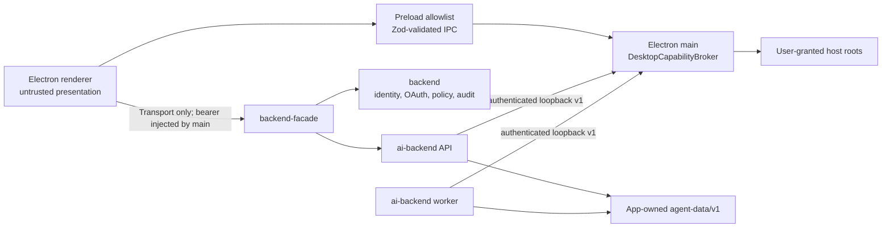

# AC1 — Desktop Capability Profile and Contracts

**Spec ID:** AC1 | **Track:** Desktop Agent Capabilities | **Status:** Draft — implementation-ready  
**Wave:** 0 — Contracts | **Estimated effort:** L  
**Depends on:** None  
**Required for:** AC2, AC4, AC5, AC9, and indirectly AC3/AC6–AC10  
**Owners:** Desktop Platform (Electron main), Agent Runtime (`services/ai-backend`)  
**Web impact:** None

---

## 1. Problem and why now

The packaged desktop already starts trusted local services with
`ENTERPRISE_DEPLOYMENT_PROFILE=single_user_desktop` in
`apps/desktop/main/services/service-env.ts`. It does not yet have one contract
that answers:

- which process may touch app-owned files or user-granted host resources;
- how an AI worker authenticates to Electron main;
- how local session records, artifacts, grants, and broker messages are
  versioned;
- which settings make a desktop-only adapter valid; and
- how incompatible app/service versions fail without weakening the web path.

The missing contract is already causing architectural drift:

- `RuntimeAdapterFactory` accepts only `in_memory` and `postgres`.
- `runtime_checkpointer()` creates a process-local `InMemorySaver`.
- the desktop environment explicitly selects Postgres and an in-process worker;
- the preload exposes only a generic, allowlisted IPC bridge;
- the Deep Agents composition has `/subagents/` and `/drafts/` routes, but no
  broker-backed `/workspace/` or persistent `/large_tool_results/` route; and
- no authenticated local broker exists.

AC2–AC10 would otherwise invent separate settings, identity claims, error
formats, path conventions, and compatibility behavior. AC1 freezes those
cross-cutting decisions before any capability implementation lands.

## 2. Goals

1. Define the two-part desktop gate: the deployment profile **and** a successful
   authenticated broker handshake.
2. Assign one owner to physical host access, abstract policy, local persistence,
   renderer IPC, and app-facing APIs.
3. Freeze v1 broker, grant, storage-envelope, artifact-reference, error, and
   capability-manifest vocabulary.
4. Freeze the app-owned on-disk root and versioning/migration rules.
5. Require strict Pydantic models at Python boundaries and strict Zod schemas at
   TypeScript boundaries.
6. Keep `packages/service-contracts` constants-only and keep business logic out
   of shared packages.
7. Preserve service boundaries: apps call the facade; deployable components do
   not import sibling implementation code.
8. Make a mixed-version or partially configured desktop fail closed at boot.

## 3. Non-goals

- Implementing the session store, artifacts, recovery, or filesystem operations.
- Replacing backend-owned identity, OAuth, token vault, connector policy, or
  audit policy.
- Exposing the local broker through `backend-facade`.
- Giving the renderer a broker token, bearer token, host path, Node API, or
  direct service URL.
- Creating a general plugin protocol or arbitrary command execution endpoint.
- Changing `RUNTIME_STORE_BACKEND=postgres`, Postgres migrations, SSE behavior,
  or any web deployment.
- Moving semantic business rules into `packages/api-types`,
  `packages/chat-transport`, or `packages/service-contracts`.

## 4. User-visible behavior

AC1 is primarily a safety and compatibility foundation.

- A compatible packaged desktop boots normally and reports the enabled local
  capabilities after all services and the broker are healthy.
- A broker authentication or protocol mismatch stops desktop capability boot.
  The renderer receives a redacted boot error such as “This desktop runtime is
  incompatible with the app. Update or restart 0xCopilot.”
- Desktop-only controls are absent in web builds and unavailable in an
  unsupervised renderer.
- Disabling the desktop feature gate falls back to the existing packaged
  Postgres behavior without deleting local capability data.
- No physical host path, broker URL, broker token, or service credential is
  exposed to renderer JavaScript or app-facing HTTP responses.

## 5. Alternatives considered

### 5.1 Direct Node access in the renderer

**Rejected.** It collapses the presentation and privilege boundaries, makes
prompt-injection impact equivalent to renderer compromise, and violates the
existing `contextIsolation`/preload design.

### 5.2 Let `ai-backend` use Python `pathlib`, `os`, or `subprocess` on user roots

**Rejected.** A model-controlled path would reach the host without a
user-grant boundary. It also makes enforcement and revocation depend on every
tool call site remembering the same checks.

### 5.3 Use Electron IPC between Python and Electron main

**Rejected.** Electron IPC is a renderer/main primitive, not a child-process
protocol. Ad-hoc stdio RPC would complicate worker restarts and multiplexing.
A loopback HTTP protocol is testable from Node and Python and works on macOS and
Windows.

### 5.4 Unix sockets on macOS and named pipes on Windows

**Rejected for v1.** They reduce network exposure but create two transports,
two path/ACL implementations, and packaging-specific failure modes. A
random-port loopback listener with a per-boot 256-bit credential, no CORS, and
strict audience checks has a smaller cross-platform implementation.

### 5.5 Represent host capabilities as generic MCP tools only

**Rejected.** MCP remains appropriate for connectors and later browser
providers. Filesystem routing must implement Deep Agents `BackendProtocol`, and
physical path enforcement needs a narrower primitive protocol than arbitrary
tool registration.

### 5.6 One shared generated model package for Python and TypeScript

**Rejected.** It would couple deployable components to generated implementation
code and invite business rules into a shared package. V1 uses native Pydantic
and Zod models at the owning boundaries plus common black-box fixtures.

### 5.7 Put new schemas in `packages/service-contracts`

**Rejected.** That Python package remains constants-only by workspace rule.
It may contain stable string constants such as the deployment-profile name or
header name; it must not contain Pydantic models, validation, I/O, or policy.

## 6. Architecture and ownership



### 6.1 Responsibility matrix

| Concern                                                             | Canonical owner                                                         | Rule                                                                |
| ------------------------------------------------------------------- | ----------------------------------------------------------------------- | ------------------------------------------------------------------- |
| Physical host paths, OS dialogs, grants, and path enforcement       | `apps/desktop/main`                                                     | No physical path crosses to the renderer or model.                  |
| Broker listener and per-boot credentials                            | `apps/desktop/main`                                                     | Loopback only; fail closed; credential never enters IPC.            |
| Abstract tool policy, run context, approvals, and budgets           | `services/ai-backend`                                                   | Identity comes from verified runtime context, never request fields. |
| Identity, membership, OAuth, connector tokens, product audit policy | `services/backend`                                                      | Existing ownership is unchanged.                                    |
| App-facing API and SSE                                              | `services/backend-facade` + `services/ai-backend`                       | Desktop renderer still calls only the facade.                       |
| Session/event semantics and file adapter                            | `services/ai-backend/runtime_adapters/file`                             | Electron provisions the root; the adapter owns record semantics.    |
| Renderer-safe grant/capability views                                | `packages/chat-surface` ports and `packages/chat-transport` IPC schemas | Data only; no host path or enforcement logic.                       |
| Stable cross-service constants                                      | `packages/service-contracts`                                            | Constants only.                                                     |
| Broker conformance examples                                         | `docs/contracts/desktop-broker/v1/`                                     | Build/test input only; never imported at runtime.                   |

### 6.2 Desktop activation predicate

Every AC1–AC10 local adapter or tool must call one resolver. The resolver returns
enabled only when all of the following are true:

1. `ENTERPRISE_DEPLOYMENT_PROFILE == "single_user_desktop"`;
2. the capability-specific setting is enabled;
3. `DESKTOP_BROKER_URL` is a canonical `http://127.0.0.1:<ephemeral-port>`
   URL injected by Electron main;
4. an audience-scoped `DESKTOP_BROKER_TOKEN` is present;
5. authenticated `/v1/handshake` succeeds before readiness;
6. the negotiated broker major version is supported; and
7. the broker instance ID returned by the handshake remains the same.

Configuration is invalid—not merely disabled—when only some required values are
present. A non-desktop profile with any desktop store/capability setting is a
fatal configuration error. There is no development bypass in production.

The initially reserved settings are:

```text
RUNTIME_STORE_BACKEND=file
RUNTIME_EVENT_BUS_BACKEND=file_notify
RUNTIME_FILE_STORE_ROOT=<Electron-injected absolute app-data path>
DESKTOP_BROKER_URL=http://127.0.0.1:<ephemeral-port>
DESKTOP_BROKER_TOKEN=<per-boot, audience-scoped opaque secret>
DESKTOP_BROKER_PROTOCOL_MAJOR=1
RUNTIME_ENABLE_DESKTOP_FILESYSTEM=true|false
RUNTIME_ENABLE_DESKTOP_ARTIFACTS=true|false
RUNTIME_ENABLE_MONTY=true|false
RUNTIME_ENABLE_REMOTE_SANDBOX=true|false
RUNTIME_ENABLE_DESKTOP_BROWSER=true|false
```

`RUNTIME_STORE_BACKEND=file` itself also requires the broker handshake. This
proves that the process was launched by the supervised desktop rather than by a
server operator who accidentally selected the file adapter.

### 6.3 Broker transport and authentication

- Bind only `127.0.0.1`, never `0.0.0.0`, `::`, or a LAN interface.
- Electron main allocates the port and generates 32 random bytes per token with
  the OS CSPRNG. Tokens are base64url without padding and live for one app boot.
- API and worker receive distinct tokens with audiences
  `ai-backend-api` and `ai-backend-worker`. The broker keeps the token-to-
  audience map in memory and compares credentials in constant time.
- Every capability endpoint requires
  `Authorization: Bearer <token>`,
  `X-Desktop-Broker-Version: 1`,
  `X-Desktop-Broker-Instance: <id>`, and
  `X-Request-Id: <uuid>`.
- `/healthz` may be unauthenticated but returns only `{ "status": "ok" }`.
  `/v1/handshake` and all other routes require authentication.
- CORS is disabled. Requests carrying `Origin` or browser fetch metadata
  headers are rejected. Responses use `Cache-Control: no-store`.
- Bodies are bounded per operation before JSON parsing. Unknown fields and
  unknown enum values are rejected.
- Tokens, URLs with embedded credentials, physical paths, and file content are
  redacted from logs and crash reports.
- A broker restart creates a new instance ID and invalidates every token,
  grant snapshot, pending mutation intent, and in-flight request. Services must
  re-handshake through supervisor restart; they must not silently reconnect
  using stale authority.

## 7. Frozen v1 contracts

The following snippets are normative field sets. Implementation specs may add
docstrings and helper methods, but may not change names, optionality, limits, or
semantics without an AC1 revision.

### 7.1 Broker handshake

Python client models live at the AI boundary:

```python
class BrokerHandshakeV1(BaseModel):
    model_config = ConfigDict(extra="forbid", frozen=True)

    protocol_major: Literal[1]
    protocol_minor: int = Field(ge=0)
    broker_instance_id: UUID
    desktop_app_version: str
    platform: Literal["darwin", "win32"]
    audience: Literal["ai-backend-api", "ai-backend-worker"]
    capabilities: tuple[
        Literal[
            "artifact.read",
            "artifact.write",
            "workspace.grants",
            "workspace.read",
            "workspace.mutate",
        ],
        ...,
    ]
    max_request_bytes: int = Field(ge=1024)
```

The owning Electron boundary uses the equivalent strict Zod shape:

```typescript
export const BrokerHandshakeV1Schema = z
  .object({
    protocolMajor: z.literal(1),
    protocolMinor: z.number().int().nonnegative(),
    brokerInstanceId: z.string().uuid(),
    desktopAppVersion: z.string().min(1).max(128),
    platform: z.enum(["darwin", "win32"]),
    audience: z.enum(["ai-backend-api", "ai-backend-worker"]),
    capabilities: z.array(BrokerCapabilityV1Schema),
    maxRequestBytes: z.number().int().min(1024),
  })
  .strict();
```

Wire JSON uses `camelCase`; Pydantic models use aliases and serialize by alias.
Internal Python code uses `snake_case`. This is the only casing translation.

### 7.2 Request, response, and error envelopes

```python
class BrokerRequestV1(BaseModel):
    model_config = ConfigDict(extra="forbid", frozen=True)

    version: Literal[1]
    request_id: UUID
    operation: str = Field(min_length=1, max_length=64)
    idempotency_key: str | None = Field(default=None, min_length=16, max_length=128)
    payload: dict[str, JsonValue]


class BrokerErrorV1(BaseModel):
    model_config = ConfigDict(extra="forbid", frozen=True)

    version: Literal[1]
    request_id: UUID
    code: Literal[
        "authentication_failed",
        "protocol_mismatch",
        "capability_disabled",
        "grant_not_found",
        "grant_revoked",
        "permission_denied",
        "invalid_path",
        "precondition_failed",
        "approval_required",
        "intent_expired",
        "payload_too_large",
        "quota_exceeded",
        "not_found",
        "conflict",
        "temporarily_unavailable",
        "internal_error",
    ]
    safe_message: str = Field(max_length=512)
    retryable: bool
    retry_after_ms: int | None = Field(default=None, ge=0, le=60_000)
```

No error includes a physical path, token, exception traceback, file content, or
unredacted model arguments. HTTP status codes remain conventional, but callers
branch only on `code`.

### 7.3 Capability and grant vocabulary

```python
class CapabilityGrantV1(BaseModel):
    model_config = ConfigDict(extra="forbid", frozen=True)

    version: Literal[1]
    grant_id: UUID
    capability: Literal["workspace.files"]
    mode: Literal["read_only", "read_write_no_delete", "read_write"]
    virtual_root: str  # exactly /workspace/<opaque mount id>
    display_name: str = Field(min_length=1, max_length=120)
    status: Literal["active", "offline", "revoked", "needs_reauthorization"]
    created_at: AwareDatetime
    updated_at: AwareDatetime
```

The renderer-safe TypeScript type has exactly these fields. A separate
main-process-only `PhysicalWorkspaceGrantV1` adds the canonical host root,
filesystem identity, and encrypted persistence metadata. That physical type
must not be exported from preload or `packages/chat-*`.

Grant mode ordering is not inferred from string order:

```text
read_only              = read/list/stat/glob/grep
read_write_no_delete   = read_only + create/write/edit/mkdir
read_write             = read_write_no_delete + delete file/empty directory
```

Approval can narrow a grant but can never expand it. A valid approval does not
turn `read_only` into write access or `read_write_no_delete` into delete access.

### 7.4 Canonical storage envelope

```python
class FileStoreRecordV1(BaseModel):
    model_config = ConfigDict(extra="forbid", frozen=True)

    schema_version: Literal[1]
    record_id: UUID
    record_kind: str = Field(min_length=1, max_length=96)
    org_id: str = Field(min_length=1, max_length=256)
    user_id: str | None = Field(default=None, max_length=256)
    conversation_id: str | None = Field(default=None, max_length=256)
    run_id: str | None = Field(default=None, max_length=256)
    task_id: str | None = Field(default=None, max_length=256)
    global_sequence_no: int = Field(ge=1)
    run_sequence_no: int | None = Field(default=None, ge=1)
    stream_id: str = Field(min_length=1, max_length=256)
    batch_id: UUID
    batch_index: int = Field(ge=0)
    batch_size: int = Field(ge=1, le=1024)
    created_at: AwareDatetime
    payload: dict[str, JsonValue]
    previous_stream_hash: str | None = Field(
        default=None, pattern=r"^[0-9a-f]{64}$"
    )
    record_hash: str = Field(pattern=r"^[0-9a-f]{64}$")
```

`global_sequence_no` is monotonic within one canonical session across the main
stream and every child stream. `run_sequence_no` preserves the existing
per-run, gap-free `RuntimeEventEnvelope.sequence_no` contract. The two values
must not be conflated.

`record_hash` is SHA-256 over RFC 8785-style canonical JSON of every field
except `record_hash`. `previous_stream_hash` chains records within the physical
stream. This detects accidental corruption; it is not presented as a
tamper-proof audit control.

### 7.5 Artifact reference

```python
class ArtifactRefV1(BaseModel):
    model_config = ConfigDict(extra="forbid", frozen=True)

    version: Literal[1]
    artifact_id: str = Field(pattern=r"^sha256:[0-9a-f]{64}$")
    sha256: str = Field(pattern=r"^[0-9a-f]{64}$")
    logical_size: int = Field(ge=0)
    stored_size: int = Field(ge=0)
    mime_type: str = Field(min_length=1, max_length=255)
    compression: Literal["none", "gzip"]
    kind: Literal[
        "tool_result",
        "large_tool_result",
        "screenshot",
        "download",
        "attachment",
        "draft",
        "file_history",
        "langgraph_checkpoint",
        "monty_checkpoint",
        "context",
    ]
    preview_utf8: str | None = Field(default=None, max_length=4096)
    preview_truncated: bool
```

The hash is always over uncompressed logical bytes. `artifact://sha256/<hex>`
is the only storage URI exposed to runtime records. A filesystem path is never
an artifact reference.

## 8. On-disk layout and compatibility boundaries

Electron main provisions the root under `app.getPath("userData")`, applies
owner-only permissions, resolves it to a canonical absolute path, and injects
that exact path as `RUNTIME_FILE_STORE_ROOT`.

```text
<userData>/
├── agent-data/
│   └── v1/
│       ├── store.json
│       └── workspaces/
│           └── <workspace-key>/
│               ├── workspace.jsonl
│               ├── audit.jsonl
│               ├── sessions/
│               │   └── <conversation-key>/
│               │       ├── CURRENT
│               │       ├── generations/
│               │       │   └── <generation>/
│               │       │       ├── generation.json
│               │       │       ├── session.jsonl
│               │       │       └── subagents/
│               │       │           └── <task-key>.jsonl
│               │       ├── pending/
│               │       └── locks/
│               ├── artifacts/
│               │   ├── objects/sha256/
│               │   ├── metadata/
│               │   ├── temporary/
│               │   └── quarantine/
│               └── index/
│                   ├── catalog.sqlite3
│                   └── notify/
└── capability-broker/
    └── v1/
        └── grants/              # encrypted, Electron-main-owned
```

- `store.json` is an immutable descriptor containing `layout_version: 1`,
  store UUID, creation time, and app version. It contains no secret.
- Path keys are lowercase base32 of the full SHA-256 of the scoped identifier,
  not raw org, conversation, run, task, or user IDs. The original IDs remain in
  validated records. This removes path traversal and platform filename issues.
- Session/workspace/audit JSONL and artifact bytes are canonical. `CURRENT`
  atomically selects the committed session generation; generations exist so
  retention or hard deletion can compact append-only records without in-place
  editing. SQLite, notification files, caches, and lock files are disposable.
- Browser profiles, OAuth tokens, provider keys, and broker credentials are
  outside `agent-data`. They must never be copied into it.
- POSIX mode is `0700` for directories and `0600` for files. Windows ACLs grant
  the current user and `SYSTEM` only. Failure to apply or verify the ACL is a
  fatal desktop-store boot error.

### 8.1 Version rules

1. Layout major versions use sibling roots (`v1`, later `v2`). A new binary
   never rewrites a prior major in place.
2. Record schemas are immutable by integer version. Any field or semantic
   change creates a new schema version and an explicit upcaster.
3. Broker paths include the major (`/v1`). Minor features are negotiated in
   the handshake; a server returns only fields supported by the negotiated
   minor.
4. Zod and Pydantic validators are strict. Unknown versions or fields fail;
   there is no best-effort coercion at a trust boundary.
5. Writers may emit only the lowest version that represents the data.
   Readers support the current version and the immediately prior version for
   one desktop release train.
6. An unsupported newer store opens read-only for export/diagnostics and never
   mutates files.
7. Migration uses write-new, validate, fsync, atomic switch, retain-old.
   Destructive cleanup is a later explicit user/operator action.

### 8.2 Contract conformance source

Runtime validators remain native to each owner:

- Zod: Electron broker and preload/IPC owner.
- Pydantic: AI client, file store, and runtime owner.
- API types: only renderer-safe app-facing payloads.

`docs/contracts/desktop-broker/v1/` contains valid and invalid JSON fixtures.
Both Node and Python contract tests load those fixtures. Fixtures define wire
examples, not executable policy. CI fails if the boundaries disagree.

## 9. Trust model and threats

### 9.1 Trusted components

- Electron main, supervised backend services, signed packaged runtime, and the
  current OS user are inside the desktop trust boundary.
- Verified bearer/session claims establish product identity.
- The broker token establishes process/audience identity only; it does not
  establish a user, org, grant, or approval.

### 9.2 Untrusted inputs

- Renderer messages, model output, tool arguments, virtual paths, MIME claims,
  filenames, file bytes, URLs, caller-supplied org/user IDs, and persisted
  files after an unclean or externally modified shutdown.

### 9.3 Required defenses

- Identity and tenant fields are bound from verified runtime context.
- Every IPC message and broker request is allowlisted and strictly validated.
- Physical paths are main-process-only.
- The broker has no generic shell, generic HTTP proxy, arbitrary path, or
  “execute” operation.
- Rate, size, recursion, result, and deadline limits are enforced before work.
- Secrets are held in `safeStorage`/backend vault or process memory, never
  session records.
- Plaintext transcripts are an explicit consumer-desktop choice protected by
  OS permissions. The UI and docs warn that any process running as the same OS
  user can read them. AC1 does not claim encryption at rest.

### 9.4 Residual risk

A malicious process already running as the same OS user can inspect process
memory, app data, or loopback traffic and is outside the v1 threat boundary.
The design limits remote web content, model output, and renderer compromise; it
is not a kernel security boundary.

## 10. Failure, recovery, and edge cases

- **Missing broker:** desktop capability readiness fails; no local adapter or
  tool is registered.
- **Wrong audience/token:** return `authentication_failed`, increment a
  security counter, and do not reveal whether a grant exists.
- **Version mismatch:** fail readiness with `protocol_mismatch`; do not
  negotiate across a major.
- **Broker restart:** requests from the old instance fail. Supervisor restarts
  API/worker with new credentials before accepting runs.
- **Partially configured env:** fatal configuration error with secret values
  redacted.
- **Newer store layout:** read-only diagnostics/export; no migration guess.
- **Corrupt `store.json`:** quarantine the store root and require repair; never
  create a second store over it.
- **Disk full or permission change:** stop new mutations, preserve committed
  records, and surface a user-actionable storage error.
- **Clock skew:** ordering uses assigned sequence numbers, not timestamps.
- **Duplicate request:** mutating operations require an idempotency key and
  return the stored result for the same key/payload hash. Reuse with a
  different payload is `conflict`.

## 11. Observability and audit

### 11.1 Structured logs

Required fields:

```text
event
broker_instance_id
protocol_major
protocol_minor
audience
capability
request_id
operation
outcome
safe_error_code
duration_ms
bytes_in
bytes_out
deployment_profile
app_version
runtime_version
```

Never log tokens, physical paths, file content, unredacted arguments, provider
keys, OAuth tokens, or attachment bytes.

### 11.2 Metrics

- `desktop_broker_handshake_total{outcome,reason}`
- `desktop_broker_request_total{operation,outcome}`
- `desktop_broker_request_duration_ms{operation}`
- `desktop_broker_auth_failure_total{audience}`
- `desktop_contract_mismatch_total{contract,version}`
- `desktop_store_open_total{outcome,layout_version}`
- `desktop_capability_enabled{capability}` as a 0/1 gauge

### 11.3 Audit events

AC1 establishes names and minimum metadata:

- `desktop.broker.started`
- `desktop.broker.handshake_succeeded`
- `desktop.broker.handshake_failed`
- `desktop.capability.enabled`
- `desktop.capability.disabled`
- `desktop.contract.rejected`

Audit records contain actor/service audience, app/runtime versions, capability,
outcome, and request/correlation IDs. They contain no token, physical path, or
content. A local log is operational evidence only unless it is appended through
the existing tamper-evident audit adapter.

## 12. Acceptance criteria

1. One code path computes the activation predicate; every desktop adapter/tool
   consumes it.
2. A non-desktop profile cannot start with `RUNTIME_STORE_BACKEND=file` or a
   desktop capability enabled.
3. A desktop process cannot become ready without an authenticated compatible
   broker handshake.
4. The renderer cannot obtain the broker token, physical grant root, local
   service URL, or bearer token through IPC or HTTP.
5. V1 Pydantic and Zod models accept all valid common fixtures and reject all
   invalid fixtures.
6. Unknown fields, enums, record versions, and broker major versions fail
   closed.
7. All path identifiers on disk are derived safe keys; untrusted IDs are never
   interpolated into paths.
8. Owner-only permissions/ACLs are created and verified before store readiness.
9. `packages/service-contracts` remains constants-only.
10. Existing web and Postgres tests pass without desktop env values.
11. App/service mixed-version failures are safe, redacted, and actionable.
12. No deployable component imports a sibling component’s implementation.

## 13. Testing requirements

### 13.1 Unit

- Activation truth table for every profile, setting, missing value, and
  handshake outcome.
- URL canonicalization rejects hostname aliases, IPv6, credentials, paths, and
  non-loopback addresses.
- Strict model tests for bounds, aliases, unknown fields, enum values, hashes,
  and versions.
- Storage key derivation is deterministic and collision-safe.
- Log redaction tests include all token/path/secret fields.

### 13.2 Contract and integration

- The same valid/invalid fixture corpus runs through Pydantic and Zod.
- Electron starts a broker on an ephemeral port; API and worker audience tokens
  can call only their allowed operations.
- A renderer-originated fetch with `Origin` is rejected even if it guesses the
  port.
- Broker restart invalidates stale tokens and instance IDs.
- Supervisor readiness waits for broker plus services.

### 13.3 Crash and recovery

- Kill Electron main during handshake and during a mutating request.
- Restart with a new instance ID and prove no stale intent or authority is
  accepted.
- Kill a service after receiving a broker response but before persisting its
  result; idempotency returns the same result after restart.

### 13.4 Security

- Attempt token brute force, wrong audience, replay with changed payload,
  oversized JSON, unknown operation, CORS/browser request, and path-bearing
  error injection.
- Assert no secret or physical path appears in logs, audit, renderer payloads,
  crash dumps, or test snapshots.
- Verify packaged BrowserWindow settings retain Node disabled and context
  isolation enabled.

### 13.5 Cross-platform

- macOS arm64/x64 and Windows x64 tests for ephemeral bind, owner-only
  permissions, long user-data paths, Unicode app-data paths, atomic metadata
  creation, and broker restart.
- Linux may run protocol/unit CI but is not a supported desktop release target.

### 13.6 Regression

- `RUNTIME_STORE_BACKEND=postgres` and `in_memory` factory tests are unchanged.
- Web frontend has no desktop grant/control affordance.
- Existing transport, SSE reconnect, OAuth, and desktop sign-in tests pass.

## 14. Rollout, migration, and backout

### 14.1 Rollout

1. Land schemas, fixtures, gate resolver, and no-op broker handshake behind all
   flags off.
2. Start the authenticated broker in packaged desktop builds, still with
   Postgres storage and no host capability.
3. Enable handshake/readiness in internal builds and collect only redacted
   compatibility metrics.
4. Let AC2/AC4/AC5 activate their specific features independently.

Stop rollout on any cross-profile activation, credential/path leakage,
unexplained contract rejection, store permission failure, or broker crash loop.

### 14.2 Migration boundary

AC1 creates no product-data migration. It may create an empty versioned root and
main-owned broker credential state. Existing Postgres data remains authoritative
until AC2’s explicit export/cutover.

### 14.3 Backout

- Disable capability-specific flags and set the desktop runtime back to
  `RUNTIME_STORE_BACKEND=postgres`.
- Stop the broker after dependent services stop.
- Preserve `agent-data/v1` and grant ciphertext; do not delete or downgrade it.
- A rolled-back binary ignores a newer root it does not understand.
- Re-enabling the same compatible version resumes from preserved data.

## 15. Why this design is sane

- **Single responsibility:** Electron main enforces physical authority; the AI
  runtime owns orchestration; backend owns identity/connectors; the renderer
  presents state.
- **Open/closed:** New capabilities add versioned operations and adapters
  without changing the transport, web path, or existing persistence ports.
- **Liskov substitution:** Desktop adapters must satisfy existing ports; callers
  do not branch on concrete stores.
- **Interface segregation:** The broker exposes narrow filesystem/artifact
  primitives, not a generic host API.
- **Dependency inversion:** Runtime business logic depends on ports and typed
  client protocols, not Electron or filesystem implementation classes.
- **DRY:** Gate resolution, error vocabulary, path keys, and version rules have
  one owner. Shared fixtures test unavoidable language-boundary duplication.
- **KISS:** One authenticated loopback protocol works on both supported
  platforms. No renderer Node, shell, dual IPC transport, or shared business
  logic package is introduced.
- **Single source of truth:** Each domain names its canonical representation;
  JSONL/artifacts are canonical while indexes and notifications are derived.

## 16. Definition of done

- Contract fixtures and an AC1 implementation spec are accepted.
- Pydantic and Zod boundary models implement this document exactly.
- Desktop gate and broker readiness fail closed in packaged production.
- Ownership and service-boundary docs link this contract.
- Unit, contract, integration, crash, security, macOS, Windows, and web
  regression suites are green.
- Logs and audit evidence demonstrate successful/failed handshakes without
  leaking secrets or paths.
- Knowledge-base and operator diagnostics explain protocol mismatch and safe
  backout.
- No source implementation is considered complete until AC1’s acceptance
  evidence is attached to its PR.

## 17. Critical files

### 17.1 Current evidence to preserve or extend

- `apps/desktop/main/services/service-env.ts`
- `apps/desktop/main/services/supervisor.ts`
- `apps/desktop/main/services/desktop-supervisor.ts`
- `apps/desktop/main/services/boot-secrets.ts`
- `apps/desktop/main/ipc/handlers.ts`
- `apps/desktop/main/ipc/schemas.ts`
- `apps/desktop/preload/bridge.ts`
- `apps/desktop/preload/window-bridge-types.ts`
- `packages/chat-transport/src/ipc/rpc-protocol.ts`
- `services/ai-backend/src/agent_runtime/deployment/profile.py`
- `services/ai-backend/src/agent_runtime/settings.py`
- `services/ai-backend/src/runtime_adapters/factory.py`
- `services/ai-backend/src/agent_runtime/execution/factory.py`
- `services/ai-backend/src/agent_runtime/execution/deep_agent_builder.py`
- `packages/service-contracts/src/copilot_service_contracts/deployment_profile.py`

### 17.2 Proposed implementation paths

- `apps/desktop/main/capabilities/broker.ts`
- `apps/desktop/main/capabilities/auth.ts`
- `apps/desktop/main/capabilities/gates.ts`
- `apps/desktop/main/capabilities/protocol/v1.ts`
- `apps/desktop/main/capabilities/storage-root.ts`
- `apps/desktop/main/capabilities/errors.ts`
- `apps/desktop/main/capabilities/__tests__/`
- `services/ai-backend/src/agent_runtime/deployment/desktop_gate.py`
- `services/ai-backend/src/agent_runtime/capabilities/desktop/client.py`
- `services/ai-backend/src/agent_runtime/capabilities/desktop/models.py`
- `services/ai-backend/src/agent_runtime/capabilities/desktop/errors.py`
- `services/ai-backend/tests/contract/desktop_broker/`
- `docs/contracts/desktop-broker/v1/`
- `services/ai-backend/docs/specs/desktop-agent-capabilities/ac1-foundation.md`

No implementation may add a sibling `src` import or a shared package containing
broker policy/business logic.

## 18. Unresolved risks

There are no open implementation choices in AC1. The accepted residual risks
are:

- same-OS-user malware is outside the local broker’s security boundary;
- strict mixed-version handling can require an app update before capabilities
  become available; and
- plaintext session data relies on correct OS account and backup hygiene.

Those risks must be documented to users and revisited in AC10; they do not
authorize a weaker gate or an alternate protocol.
