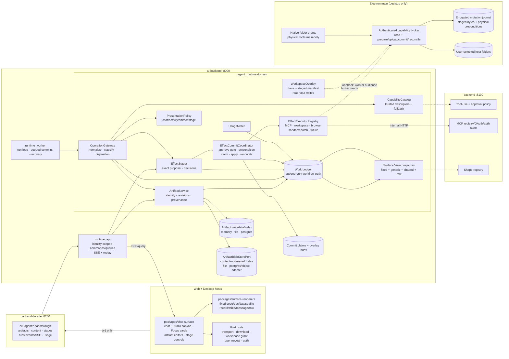
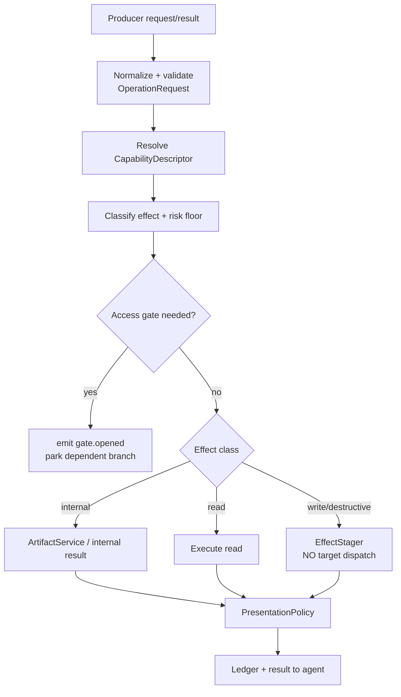
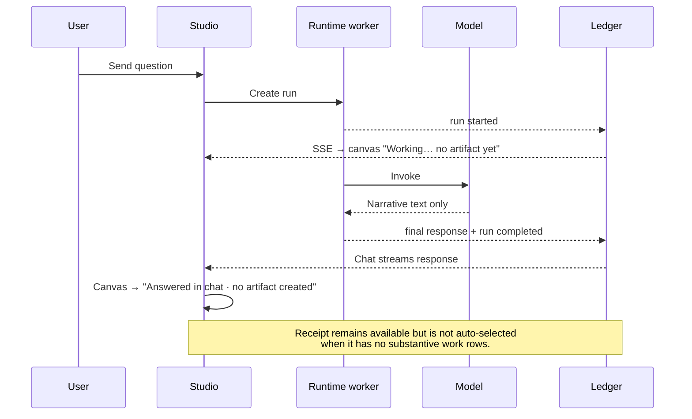
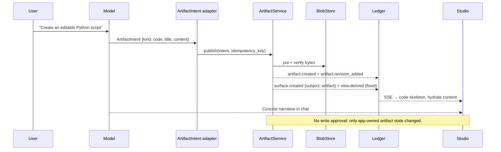
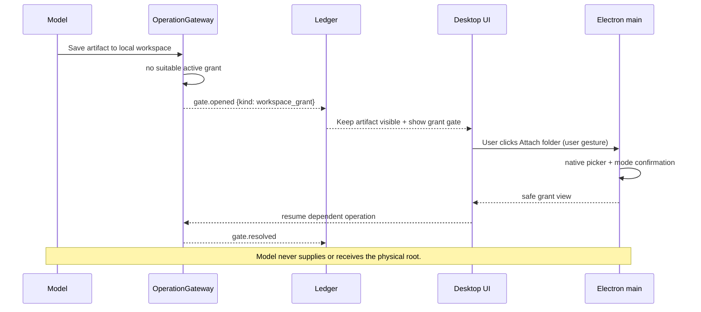
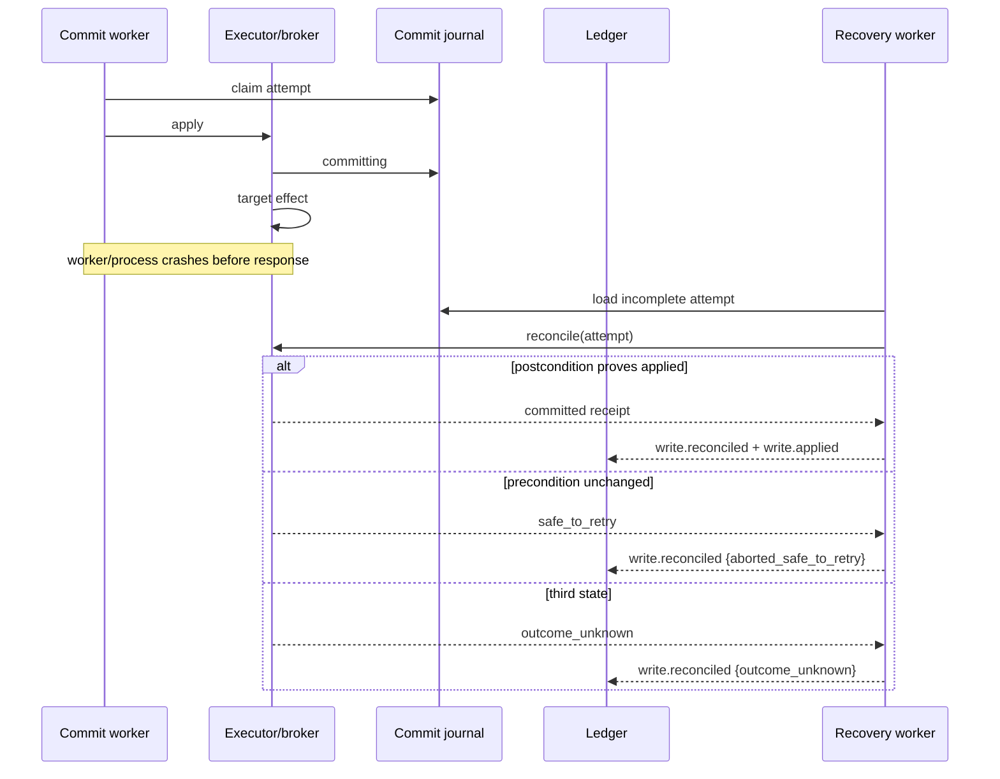
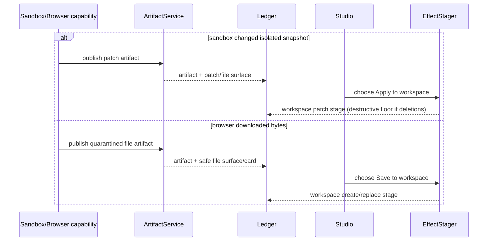

# SDR — Universal Artifacts & Effects

**Solution Design Review · v0.1 · 2026-07-24 · status: for review**

Contract:
[00-overview.md](00-overview.md). Implementation map:
[02-prds.md](02-prds.md).

---

## 1. Context and design objective

Generative Surfaces v2 established a correct surface foundation—typed ledger events,
fixed renderers, staged decisions, a single commit path, receipts, replay, and usage
metering—but attached its primary read/surface emission seam to MCP and retained
draft/workspace-specific mutation paths.

v2.1 makes the foundation universal without creating a new deployable:

- model-only authored content can become a durable artifact;
- tool calls can remain activity-only;
- artifact state is separate from its UI surface and from any external target;
- every external write uses one stage/decision/commit protocol;
- local workspace writes use an overlay and Electron-main commit, not direct
  write-through;
- MCP, workspace, browser, sandbox patch, and future effect transports are executor
  adapters behind one policy and safety core.

The design objective is not “show more UI.” It is:

> Represent authored content and consequential effects as explicit domain objects, then
> project only the user-relevant ones into fixed, honest surfaces.

---

## 2. Architecture decisions

### AD-1 — No new service

Artifacts, operations, stages, and run surfaces share runtime identity, ledger ordering,
authorization, retention, and replay. They remain in `services/ai-backend`. Splitting
them would create network transactions inside one approval lifecycle.

### AD-2 — Artifact is not Surface

An `Artifact` is durable revisioned content. A `Surface` is a per-run view of an
artifact/result/stage/gate/receipt. An artifact can outlive a run and can be presented by
more than one run; a surface carries no canonical content bytes.

### AD-3 — Artifact is not Effect

Creating/revising app-owned content is reversible product state. Sending it to a
connector, saving it to the host, submitting it in a browser, or applying a patch is an
effect. Approval applies to the effect and pins the artifact revision/argument manifest.

### AD-4 — Explicit artifact intent

The canonical input is a validated `ArtifactIntent`, not markdown parsing. A
`publish_artifact` built-in and provider-specific typed content-part adapters are merely
producers of that contract.

### AD-5 — Universal operation gateway

All model-visible capabilities and system producers normalize into `OperationRequest`.
The gateway owns classification and disposition. Executors do not own either.

### AD-6 — Universal commit orchestration, typed executors

One Effect Coordinator enforces decisions, preconditions, idempotency, and ledger order.
Target-specific executors implement prepare/apply/reconcile. We do not force physical
filesystem, MCP, and browser internals into one implementation class.

### AD-7 — Workspace overlay before host commit

`/workspace/` mutations update an app-owned overlay. The host broker is read authority
during authoring and mutation authority only during commit. This provides read-your-
writes and exact review while preserving host isolation.

### AD-8 — Event compatibility through versioned projection, not dual truth

Existing v2 events remain readable. New canonical events/payload-v2 describe artifacts
and universal operations. Compatibility projectors translate old events for replay;
new producers do not permanently emit both vocabularies.

### AD-9 — Product-internal storage is not a permission bypass

Artifact publication is auto-allowed only into the tenant-scoped artifact repository. It
cannot attach a host/SaaS/browser target, expand a filesystem grant, execute code, or
make network calls.

---

## 3. Logical component view



### 3.1 Component responsibilities

| Component                   | Owns                                                                                                                         | Does not own                                     |
| --------------------------- | ---------------------------------------------------------------------------------------------------------------------------- | ------------------------------------------------ |
| **OperationGateway**        | Normalized operation identity; classification; auth/grant gate request; result disposition; read execution vs write staging  | Artifact bytes, target execution internals, UI   |
| **CapabilityCatalog**       | Server-owned descriptors for built-ins/MCP catalog entries/executor capabilities; trusted risk floors; presentation defaults | Per-run decisions, dynamic credentials           |
| **ArtifactService**         | Artifact identity, immutable revisions, provenance, optimistic concurrency, metadata queries, content refs                   | External target authority or applying effects    |
| **ArtifactBlobStorePort**   | Streaming put/get/head/range/delete of content-addressed bytes                                                               | Artifact authorization/retention decisions       |
| **PresentationPolicy**      | Deterministic `chat_only` / `activity_only` / `artifact` / `stage`; fixed-view hint vs generic shaping                       | Executing tools or model-based post-hoc guessing |
| **EffectStager**            | Exact proposal manifests, target refs, stage revisions, decisions, policy-auto decisions, pending state                      | External effects                                 |
| **EffectCommitCoordinator** | Approval match, target preconditions, claim-before-effect, executor invocation, reconciliation, terminal events              | Target-specific protocol mechanics               |
| **EffectExecutorRegistry**  | Server-owned mapping of target kind/operation to an executor                                                                 | Model-defined plugins or policy                  |
| **WorkspaceOverlay**        | Base-snapshot reference, staged file/dir/tombstone/move entries, coalesced revisions, read-your-writes                       | Physical paths or host mutations                 |
| **WorkspaceExecutor**       | Broker prepare/upload/commit/reconcile calls for exact approved overlay manifest                                             | Reading arbitrary host paths or granting roots   |
| **McpExecutor**             | Resolve server, re-check auth/scope, precondition when supported, dispatch exact stored arguments                            | Classification or deciding whether to dispatch   |
| **Surface/View projectors** | Per-run tabs and fixed/generic/shaped/raw presentation from subject refs                                                     | Canonical artifact bytes, workflow decisions     |
| **Electron main broker**    | Physical root/grant authority, path safety, native preconditions, staged host mutation journal, atomic effects               | Model planning, artifact UI, approval policy     |

---

## 4. Deployable and trust boundaries

### 4.1 Apps

- Apps call `backend-facade` only.
- `packages/chat-surface` remains substrate-neutral. It receives ports for HTTP/SSE,
  downloads, grant picker/open/reveal, and notifications.
- The renderer never receives broker tokens, physical paths, object-store paths, or
  target credentials.
- Desktop preload exposes narrow user-gesture ports. It never exposes arbitrary `fs`,
  arbitrary IPC, or a model-callable picker.

### 4.2 backend-facade

- Verbatim identity-preserving passthrough only.
- No artifact orchestration, effect classification, or blob authorization logic.
- Streaming/download proxy must preserve range, content length, content type, and safe
  content disposition without buffering large files into memory.

### 4.3 ai-backend

- Owns artifact metadata, workflow commands, ledger, stages, and executor orchestration.
- Never calls Python filesystem APIs for a user root.
- Internal calls to backend use service token plus verified tenant headers.
- Desktop broker calls use the per-boot worker-audience token and opaque run capability
  context; those secrets never persist in run events/checkpoints.

### 4.4 backend

- Continues to own MCP registration/OAuth/auth state, tool-use policy, per-connector
  overrides, and shape registry.
- Workspace folder grants do not move into backend; Electron main owns local physical
  authority. The runtime may persist only safe grant/mount references.

### 4.5 Electron main

- Owns native picker, canonical roots, root identities, grant modes, revocation, path
  validation, physical file handles, broker journal, and host effects.
- The AI worker sees `grant_id`, opaque mount, relative virtual path, safe label, mode,
  hashes/sizes, and opaque precondition tokens.
- A desktop restart invalidates live run contexts but retains enough encrypted journal
  state to reconcile prior commit attempts.

### 4.6 Web and remote deployments

- Agent-authored artifacts, editors, downloads, SaaS effects, and receipts work.
- No `workspace` executor is registered without a trusted host-capability provider.
- A prompt containing `/Users/...`, `C:\...`, `/home/...`, or a `file://` URI is data,
  not authority. The runtime responds with an artifact/download option or a capability
  gate; it never writes the server's filesystem.

---

## 5. Domain contracts

Contract names below are canonical. Pydantic and TypeScript mirrors are generated or
parity-tested from `packages/service-contracts`.

### 5.1 Operation

```text
OperationRequest {
  v: 1
  operation_id: string
  idempotency_key: string
  run_id: string                         # envelope-derived at persistence boundary
  parent_operation_id?: string
  producer: {
    kind: model | subagent | builtin | mcp | workspace | sandbox | browser | system | user
    id: string                           # safe logical producer id
  }
  capability_id: string                 # server-resolved; never executable by name alone
  operation: string
  arguments_ref?: PayloadRef
  requested_disposition: auto | chat_only | activity_only | artifact | stage
  artifact_intent?: ArtifactIntent
  target_hint?: SafeTargetHint
}
```

`OperationGateway.normalize()` resolves the request against a
`CapabilityDescriptor`:

```text
CapabilityDescriptor {
  capability_id
  producer_kind
  operations: {
    name
    effect_floor: internal | read | write | destructive
    auth_kind: none | connector | workspace_grant | browser_profile | sandbox
    executor_id?
    result_contract?
    presentation_default: activity_only | artifact_candidate | stage
    supports_precondition: bool
    idempotency_semantics: native | coordinator_claim | none
  }[]
  descriptor_version
}
```

Dynamic MCP annotations are untrusted hints attached after descriptor resolution. They
may raise risk, never lower a catalog/default risk floor.

### 5.2 Artifact

```text
Artifact {
  artifact_id
  org_id / owner_user_id / conversation_id   # server-side scope
  kind: code | document | dataset | file
  title
  media_type
  encoding?: utf-8 | binary
  latest_rev
  status: active | deleted
  created_by_operation_id?
  created_at / updated_at
}

ArtifactRevision {
  artifact_id
  rev
  parent_rev?
  content_ref
  sha256
  size
  author: agent | user | system | imported
  producer_operation_id?
  metadata: {
    language?
    filename?
    csv?: {delimiter, quote, header, detected_columns_ref}
    source?: {kind, safe_locator, source_sha256?}
  }
  authorship_ref?
  created_at
  ledger_id
}
```

Rules:

- `content_ref` is opaque and authorized through artifact scope; it is never a local
  object-store pathname or public bearer.
- Revision append requires `expected_rev` and idempotency key.
- Repeating the same key + digest returns the original revision. Same key + different
  digest is a conflict.
- Changing title/metadata without changing bytes still creates a metadata revision or
  explicit metadata event; it never mutates historical revision rows.
- Artifact deletion is a tombstone. Blob GC occurs only when no live revision, stage,
  receipt-export hold, share, or retention hold references the digest.

### 5.3 Artifact intent

```text
ArtifactIntent {
  v: 1
  kind: code | document | dataset | file
  title
  media_type
  content: inline_utf8 | content_part_ref | operation_result_ref
  metadata: closed kind-specific object
  disposition: artifact
  editability: auto | editable | read_only
}
```

Allowed model-authored metadata is schema-closed and length bounded. `inline_utf8` is
accepted only below the model-tool payload limit; larger outputs must use a runtime
content-part/offload ref. There is no field for component, HTML template, CSS, JS,
renderer module, executor, host path, connector credential, or approval mode.

### 5.4 Surface subject

`surface.created` payload v2 replaces the connector-only source as the canonical subject:

```text
SurfaceSubjectRef =
  {kind: artifact, artifact_id, rev?}
  | {kind: operation, operation_id}
  | {kind: stage, stage_id}
  | {kind: gate, gate_id}
  | {kind: receipt, receipt_id}

SurfaceCreatedV2 {
  v: 2
  surface_id
  subject: SurfaceSubjectRef
  kind: code | document | dataset | file | record | message | table | call | raw | receipt | gate
  title
  presentation: {renderer: fixed | archetype | raw, view_hint?}
}
```

The subject is canonical. Provenance is joined by ids in the ledger, not duplicated as a
fragile connector/op string on every event.

### 5.5 Classification

```text
OperationClassified {
  v: 1
  operation_id
  effect_class: internal | read | write | destructive
  basis: builtin_descriptor | catalog | protocol_hint | target_rule | default
  executor_id?
  policy_axis: none | read | write | destructive
}
```

Resolution order:

1. hard target/risk rules (destructive floor, security block);
2. trusted built-in descriptor;
3. curated catalog;
4. protocol hints, allowed only to preserve/raise risk;
5. default = write/held for any effect-capable unknown;
6. no target/executor + artifact publication contract = internal.

The model's requested class is never an input.

### 5.6 Target and proposal

```text
EffectTarget =
  {kind: mcp, connector_id, server_slug, operation}
  | {kind: workspace, grant_id, mount, relative_path, operation}
  | {kind: browser, profile_ref, origin, action}
  | {kind: sandbox_patch, workspace_snapshot_id, operation: apply_patch}

ProposalRef =
  {kind: artifact_revision, artifact_id, rev, sha256, size}
  | {kind: arguments_manifest, payload_ref, sha256, size}
  | {kind: rowset_manifest, payload_ref, sha256, rows}
  | {kind: workspace_manifest, payload_ref, sha256, entries}
```

Public ledger events carry a safe target summary plus an opaque `target_ref`. Sensitive
target details live in a tenant-scoped private payload record.

### 5.7 Stage

`write.staged` payload v2 and the projected entity become transport-neutral:

```text
EffectStage {
  stage_id
  run_id
  operation_id
  surface_id
  executor_id
  target_ref
  target_summary
  effect_class: write | destructive
  current_rev
  status: staged | rejected | approved | commit_queued | applying |
          applied | partial | conflicted | failed | outcome_unknown | void
  revisions: StageRevision[]
  decisions: Decision[]
  precondition_ref?
  agent_holds[]
}

StageRevision {
  stage_id
  rev
  proposal: ProposalRef
  author
  parent_rev?
  diff_ref?
  authorship_ref?
}
```

The existing `revision.added` name remains the stage-revision event.
`artifact.revision_added` is distinct and always identifies the artifact.

### 5.8 Executor protocol

```python
class EffectExecutor(Protocol):
    executor_id: str
    target_kinds: frozenset[str]

    async def prepare(
        self,
        request: PreparedEffectRequest,
    ) -> PreparedEffect:
        """Validate auth/grant/target and capture opaque preconditions."""

    async def apply(
        self,
        prepared: PreparedEffect,
    ) -> EffectApplyOutcome:
        """Apply exact approved proposal. Must not consult model/client state."""

    async def reconcile(
        self,
        attempt: EffectAttempt,
    ) -> EffectApplyOutcome:
        """Resolve a prior ambiguous/incomplete attempt without blind replay."""
```

`PreparedEffectRequest` is built only from server-held stage state. It includes the exact
decision sequence, proposal digest, target ref, and coordinator attempt/idempotency key.

Executor capabilities declare:

- prepare support;
- native idempotency support;
- compensation support;
- batch/partial semantics;
- maximum bytes/rows;
- possible `outcome_unknown`;
- supported preconditions.

The coordinator rejects a request outside the declaration before invoking an executor.

---

## 6. Canonical ledger vocabulary

Existing v2 event readers remain. New producers converge on:

```text
operation.declared           {operation_id, producer, capability_id, operation, requested_disposition}
operation.classified         {operation_id, effect_class, basis, policy_axis, executor_id?}
operation.started            {operation_id, attempt}
operation.completed          {operation_id, outcome_ref?, latency_ms, result_disposition}
operation.failed             {operation_id, safe_error_code, retryable}

artifact.created             {artifact_id, kind, title, media_type, origin_operation_id?}
artifact.revision_added      {artifact_id, rev, parent_rev?, content_ref, sha256, size, author, metadata_ref?}

surface.created (v2)         {surface_id, subject, kind, title, presentation}
view.derived                 {surface_id, tier, basis: fixed|schema|registry|generated, spec_ref?, gen?}
view.preference              {surface_id, keep, actor}

gate.opened (v2)             {gate_id, kind: connector_auth|workspace_grant|reauthorization,
                              capability_id, purpose, safe_scope[], state}
gate.resolved (v2)           {gate_id, outcome, policy_ref?}

write.staged (v2)            {stage_id, operation_id, surface_id, executor_id, target_ref,
                              target_summary, effect_class, proposal, precondition_ref?}
revision.added (v2)          {stage_id, rev, proposal, author, parent_rev?, diff_ref?, authorship_ref?}
decision.recorded (v2)       {stage_id, decision, scope, actor, proposal_digest, target_digest}
write.commit_requested       {stage_id, rev, decision_seq, attempt_id}
write.applied (v2)           {stage_id, rev, attempt_id, result, executor_receipt_ref?,
                              row_results?, before_after_ref?, failure?}
write.reconciled             {stage_id, attempt_id, from, to, evidence_ref}

usage.recorded               {call_id, purpose, model, tokens_in, tokens_out,
                              operation_id?, artifact_id?, surface_id?}
receipt.emitted              {surface_id, fold_ref}
```

Compatibility:

| Old event            | v2.1 projection                                             |
| -------------------- | ----------------------------------------------------------- |
| `action.classified`  | Synthetic `operation.classified` keyed by legacy call id    |
| `read.executed`      | Synthetic completed read operation                          |
| `surface.created` v1 | Surface subject = legacy operation/result                   |
| `write.staged` v1    | Effect stage with `executor_id=mcp` and legacy proposal ref |
| `write.applied` v1   | Applied effect with legacy connector receipt                |
| `revision.added` v1  | Stage revision; unchanged category                          |

Compatibility conversion occurs inside projectors/read models. It does not append
synthetic events to the canonical log.

### Ledger invariants

1. Every operation id is unique within a run and declaration is idempotent.
2. An artifact revision event references content whose digest/size were verified before
   the event is visible.
3. A surface subject must already exist or be in the same atomic append batch.
4. A stage revision proposal digest is immutable.
5. A decision records the proposal and target digests it authorizes.
6. `write.commit_requested` follows a matching effective approve/policy decision.
7. `write.applied` is emitted only by the commit worker/coordinator.
8. `write.reconciled` cannot change an applied result to unapplied.
9. Public event payloads contain no artifact bodies, physical host paths, tokens, or
   credentials.
10. Receipt folds count facts, not inferred narrative.

---

## 7. Operation Gateway

### 7.1 Pipeline



### 7.2 Producer adapters

Adapters are intentionally thin:

- **Model content part / `publish_artifact`:** validate `ArtifactIntent`, call
  ArtifactService, return artifact id/revision.
- **MCP:** normalize server/tool/args against catalog and dynamic card; reads may execute;
  writes stage without connector dispatch.
- **Deep Agents workspace backend:** reads call overlay/base resolver; mutations call
  overlay stager.
- **Code mode:** pure/internal result; may publish substantial output.
- **Sandbox:** execution is isolated; output blobs/patches become artifacts; host apply
  stages separately.
- **Browser:** navigation/read may execute; download publishes artifact; submit/upload
  stages.
- **Subagent:** same contracts with parent operation/task attribution.

No adapter directly appends its own bespoke surface lifecycle.

### 7.3 Disposition policy

Precedence:

1. hard safety rule (`write/destructive` ⇒ stage);
2. explicit user action (promote/open/save);
3. validated explicit `ArtifactIntent`;
4. trusted capability descriptor default;
5. deterministic result-shape candidate rule;
6. fallback activity/chat.

Rules 4–5 may select a fixed/generic surface for a read result but never create an
artifact by discarding fields. The entire result remains referenced and raw-accessible.

There is no LLM call to decide whether a surface exists. If a future model-assisted
disposition is added, it is advisory, metered, and may only choose a more conservative
presentation—not execute effects or hide raw data.

### 7.4 Return-to-agent contract

Write-like model calls return a typed staged result:

```text
{
  status: "staged",
  stage_id,
  surface_id,
  revision,
  message: "The change is staged for review; the target has not been modified."
}
```

The model must not narrate it as applied. Prompt and evaluation suites pin this wording
and behavior.

---

## 8. Artifact storage and API

### 8.1 Storage ports

```python
class ArtifactRepositoryPort(Protocol):
    async def create(...)
    async def append_revision(expected_rev, idempotency_key, ...)
    async def get(...)
    async def list_for_run(...)
    async def list_for_conversation(...)
    async def tombstone(...)

class ArtifactBlobStorePort(Protocol):
    async def put_stream(expected_size?, expected_sha256?) -> ArtifactBlobRef
    async def head(ref) -> ArtifactBlobHead
    async def open_range(ref, start, end?) -> AsyncIterator[bytes]
    async def delete_if_unreferenced(ref)
```

Adapters:

- in-memory: tests only;
- file: wraps/extents `runtime_adapters.file.object_store.FileObjectStore`;
- postgres: metadata/revisions in Postgres; bounded blobs in a blob table initially or
  operator-injected object adapter. The domain does not depend on either;
- future S3/GCS/Azure adapters implement the same conformance suite.

### 8.2 Write ordering

1. stream bytes to a temporary/content-addressed object;
2. verify digest/size;
3. atomically insert revision metadata + ledger outbox/event reference;
4. expose revision;
5. orphaned unreferenced blobs are GC-safe after a grace period.

The system never exposes metadata pointing at an unverified/missing object.

### 8.3 App-facing routes

All routes derive identity from the verified facade session:

```text
GET  /v1/agent/runs/{run_id}/artifacts
GET  /v1/agent/artifacts/{artifact_id}
GET  /v1/agent/artifacts/{artifact_id}/content?rev=N
GET  /v1/agent/artifacts/{artifact_id}/download?rev=N
POST /v1/agent/artifacts/promote
POST /v1/agent/artifacts/{artifact_id}/revisions
POST /v1/agent/artifacts/{artifact_id}/stage
DELETE /v1/agent/artifacts/{artifact_id}                # tombstone; authorized
```

Mutation requests require idempotency key and expected revision. Content routes support
range requests, `ETag=<sha256>`, `X-Content-Type-Options: nosniff`, and safe attachment
disposition for executable/HTML/binary types.

`promote` accepts only a server-resolvable message/result/content-part ref. The client
cannot send arbitrary server-side refs or claim another run's output.

### 8.4 Rendering limits

Central `ArtifactLimits` contract:

| Limit                   |            Default |
| ----------------------- | -----------------: |
| maximum stored artifact |            512 MiB |
| inline artifact intent  |      256 KiB UTF-8 |
| editable code/document  |              5 MiB |
| CSV preview bytes       |             10 MiB |
| CSV preview rows        |             10,000 |
| CSV preview cells       |            100,000 |
| metadata/title          | 16 KiB / 240 chars |
| ledger payload          |             64 KiB |

Over-limit content is not rejected solely because the renderer cannot edit it; it becomes
read-only/raw/downloadable. Store/executor limits may be stricter and are reported
before staging.

---

## 9. Workspace overlay

### 9.1 Why an overlay is mandatory

A generic pre-execution interrupt does not let an agent naturally:

- create a CSV;
- read it back;
- correct a row;
- create a second related file;
- show one coherent proposal;
- leave the host unchanged until review.

The overlay is the agent's working copy; the host root is the effect target.

### 9.2 Overlay model

```text
WorkspaceOverlay {
  overlay_id
  org/user/conversation/run
  run_capability_snapshot_id
  status: active | committed | discarded | expired
  entries: OverlayEntry[]
}

OverlayEntry =
  FileEntry {
    mount, relative_path
    base: absent | {sha256, size, observed_at, source_ref?}
    artifact_id, artifact_rev, proposed_sha256, size
    stage_id
  }
  | DirectoryEntry {mount, relative_path, base_state, stage_id}
  | TombstoneEntry {mount, relative_path, base_sha256?, stage_id}
  | MoveEntry {mount, from, to, base_sha256, stage_id}
```

Overlay identity is virtual. It contains no physical root.

### 9.3 Read resolution

For `read/list/glob/grep/stat`:

1. resolve mount and virtual path;
2. consult overlay entries/tombstones/moves;
3. if an overlay file exists, read the artifact revision;
4. if tombstoned/moved-away, report absent in the merged view;
5. otherwise read through the broker's bounded read lane;
6. merge directory/glob results deterministically;
7. record source/provenance without forcing a surface.

The base broker remains operation-time authority; cached metadata cannot authorize an
effect.

### 9.4 Mutation behavior

- `write_file` new path: publish/update artifact revision + file overlay entry + stage.
- `write_file` existing path: capture base metadata/hash, publish exact proposed artifact,
  create diff/stage.
- `edit_file`: apply strict replacement against merged overlay content; append artifact
  and stage revision.
- repeated writes to same target coalesce into the same stage unless a prior revision is
  approved/queued/terminal;
- `mkdir`, delete, and move create typed manifest entries; no hidden filesystem call;
- changing target path or operation creates a new stage or invalidates prior decision;
- overlay storage failure returns an error and never falls back to host write-through.

### 9.5 Overlay lifecycle

- Active while a run/conversation has staged changes.
- Rebuildable from artifact/stage/overlay events plus referenced content.
- Approved commit marks applied entries; held/conflicted entries remain.
- Discard/reject releases refs after retention grace.
- Starting another run may reopen authorized pending overlay state, but authority is
  revalidated and a new run capability context is minted before commit.

---

## 10. Workspace prepare/apply/reconcile

The Electron-main design follows and completes the two-phase contract already described
in
[`05-ac5-filesystem-capability.md`](../desktop/agent-capabilities/05-ac5-filesystem-capability.md).

### 10.1 Prepare

The workspace executor sends:

- run capability context;
- grant snapshot digest;
- approval id/decision digest;
- operation and virtual source/destination;
- expected source hash/absence and destination absence;
- proposed hash/size or tombstone;
- batch manifest digest;
- coordinator attempt/idempotency key.

Electron main:

1. authenticates worker audience and run context;
2. intersects grant mode and operation risk;
3. reopens root/parent/target using native no-follow/handle-relative primitives;
4. captures native identity and content preconditions;
5. rejects drift;
6. appends+fsyncs encrypted `prepared` journal row;
7. returns opaque intent id/precondition token and preimage stream ticket if needed.

### 10.2 Preimage and staged bytes

- The worker streams preimage into the ArtifactBlobStore as `file_history`.
- Digest/size must match broker prepare response.
- The approved artifact bytes stream to broker staging; no large base64 JSON.
- Main verifies declared digest/size, fsyncs, and records `content_staged`.
- If either stream cannot be durably verified, the intent aborts and host state remains
  unchanged.

### 10.3 Commit

Main revalidates context, grant, approval digest, intent, expiry, paths, native
identities, and staged digest, then:

1. writes+fsyncs `committing`;
2. performs one bounded native mutation;
3. verifies exact postcondition;
4. writes+fsyncs `committed`;
5. emits redacted capability audit;
6. returns stable result.

Create/replace uses same-directory temporary file + fsync + atomic same-target rename.
Move is same grant/volume, destination-absent, and never overwrites. Delete is a regular
file or empty directory only.

### 10.4 Restart reconciliation

```text
prepared -> content_staged -> committing -> committed
         \-> aborted
committing -> aborted_safe_to_retry | conflict | outcome_unknown
```

- exact expected postcondition ⇒ committed;
- exact unchanged precondition ⇒ aborted-safe-to-retry, but a fresh user/policy decision
  is required if the original run authority expired;
- any third state ⇒ outcome unknown and visible inspection;
- duplicate delivery of a committed key returns stored result;
- no branch blindly replays an unproven mutation.

### 10.5 Batch behavior

All entries prepare and preimage before the first effect. Apply order is canonical
(mount, path, operation). Per-entry outcomes are ledgered. Compensation uses verified
preimages only. If compensation cannot be proven, result is partial/outcome-unknown,
never “applied.”

---

## 11. Policy and access gates

### 11.1 Universal policy matrix

| Class         | Default   | Examples                                                                | Can per-capability override lower it?                     |
| ------------- | --------- | ----------------------------------------------------------------------- | --------------------------------------------------------- |
| `internal`    | auto      | artifact publish/revision, pure compute result                          | N/A; contract is closed                                   |
| `read`        | auto      | MCP get/list, workspace read, browser snapshot                          | Yes to ask/require/block; never bypass grant/auth         |
| `write`       | ask       | MCP create/update/send, workspace create/replace, browser upload/submit | Connector/grant policy may allow auto; stage still exists |
| `destructive` | require   | delete, move, patch with deletion, irreversible submit                  | **No** for v2.1                                           |
| `unknown`     | write/ask | uncatalogued effect-capable operation                                   | Only trusted catalog update can reclassify                |

The effective outcome is the intersection of:

1. deployment capability gate;
2. verified identity and run scope;
3. auth/grant/profile/sandbox authority;
4. target-specific risk floor;
5. global and per-capability policy;
6. agent pre-hold;
7. budget/quota;
8. exact decision digest;
9. operation-time target preconditions.

No layer broadens a denial.

### 11.2 Generalized gates

`ToolAccessGate` becomes a capability gate projection with adapters:

- `connector_auth` — existing MCP OAuth behavior;
- `workspace_grant` — no suitable user-selected grant;
- `reauthorization` — revoked/offline/expired capability context;
- future browser profile/sandbox provider gates.

The model cannot open a native picker. A `workspace_grant` gate renders a button wired
through a desktop host port; the user gesture opens native UI. Web renders an honest
“Local workspace access is available in desktop” state.

Resolving a gate resumes only the dependent operation. Existing artifacts remain open.

---

## 12. Rendering and editing

### 12.1 Fixed artifact renderers

| Artifact kind | Surface URI                        | View                                                            | Edit behavior                                            |
| ------------- | ---------------------------------- | --------------------------------------------------------------- | -------------------------------------------------------- |
| code          | `artifact-code://<artifact_id>`    | syntax-highlighted code, language/file metadata, line-safe diff | UTF-8 ≤ limit; no execution                              |
| document      | `artifact-doc://<artifact_id>`     | sanitized Markdown/plain document                               | UTF-8 ≤ limit                                            |
| dataset       | `artifact-dataset://<artifact_id>` | virtualized CSV table + schema summary + raw/download           | bounded cell editing; exact reserialization policy shown |
| file          | `artifact-file://<artifact_id>`    | metadata, safe preview where supported, raw/download            | read-only unless a safe text subtype                     |

Renderer selection is from artifact kind/media type plus a server-owned registry. The
model cannot name the URI scheme or React component.

### 12.2 CSV fidelity

- Store exact original bytes.
- Parse preview deterministically with declared/detected delimiter/quote/header metadata.
- Parsing failure shows raw text/download, not a guessed table.
- Cell edits create a new CSV artifact revision through one centralized serializer and
  display that serialization policy before save.
- Cells beginning with spreadsheet-formula control characters are rendered as text with
  a warning. Export does not silently prefix/strip characters; sanitization is an
  explicit new revision.
- Large CSV uses streaming preview/indexing and virtualization.

### 12.3 Code safety

- No preview executes code, imports, HTML, scripts, or macros.
- “Run” is a separate code-mode/sandbox operation with its own policy, usage, and
  artifacts.
- HTML code artifacts render as source by default; rendered HTML preview is out of scope
  unless implemented in a separately sandboxed renderer.

### 12.4 Editing and stages

Editing a targeted artifact appends an artifact revision and stage revision atomically
or via an idempotent outbox. Any prior approval becomes stale. The UI always shows:

- artifact rev and stage rev;
- target summary;
- whether content is app-only, staged, queued, applying, applied, conflicted, failed, or
  unknown;
- exact diff/raw fallback;
- authorship.

---

## 13. Sequence views

### S1 — Chat-only answer



### S2 — Model-authored code artifact, no external tool



### S3 — Read operation with or without a surface

```mermaid
sequenceDiagram
  participant W as Agent/tool adapter
  participant G as OperationGateway
  participant E as Read executor
  participant A as ArtifactService
  participant L as Ledger
  participant UI as Studio

  W->>G: OperationRequest
  G-->>L: operation.declared + operation.classified {read}
  G->>E: execute
  E-->>G: result_ref
  G-->>L: operation.completed
  alt activity/chat only
    L-->>UI: activity + citation; no tab
  else explicit artifact/surface disposition
    G->>A: publish/promote result
    A-->>L: artifact/surface events
    L-->>UI: named tab
  end
```

### S4 — Create and save a CSV to the local workspace

```mermaid
sequenceDiagram
  participant M as Model
  participant A as ArtifactService
  participant O as WorkspaceOverlay
  participant S as EffectStager
  participant UI as Studio
  participant C as CommitCoordinator
  participant X as WorkspaceExecutor
  participant B as Electron broker
  participant H as Host file
  participant L as Ledger

  M->>A: Publish CSV artifact rev 1
  A-->>L: artifact + dataset surface
  M->>O: write_file /workspace/project/exports/q3.csv
  O->>O: base target absent; point overlay to artifact rev 1
  O->>S: stage create_file exact rev/hash/path
  S-->>L: write.staged + revision.added
  L-->>UI: staged CSV surface; host untouched
  M->>O: read/edit staged CSV
  O->>A: append artifact rev 2
  O->>S: append stage rev 2; old decision invalid
  UI->>S: approve exact stage rev 2
  S-->>L: decision.recorded + commit_requested
  C->>X: prepare approved request
  X->>B: prepare (expected absent, rev-2 hash)
  X->>B: stream approved bytes
  X->>B: commit
  B->>H: atomic create
  B-->>X: verified committed
  X-->>C: applied receipt
  C-->>L: write.applied
  L-->>UI: "Saved exactly rev 2"
```

### S5 — Existing file changed after approval

```mermaid
sequenceDiagram
  participant O as Overlay
  participant UI as User
  participant C as CommitCoordinator
  participant B as Electron broker
  participant H as Host
  participant L as Ledger

  O->>B: read base report.csv
  B-->>O: sha256=A
  O-->>UI: base A → proposed B
  UI->>L: decision.recorded approves B against A
  H->>H: External editor changes file to C
  C->>B: prepare expected A, proposed B
  B-->>C: conflict (current C)
  C-->>L: write.applied {conflicted, precondition_drift}
  L-->>UI: conflict surface; overlay B retained
  Note over UI,H: Zero overwrite. User may refresh/rebase/discard.
```

### S6 — MCP write

```mermaid
sequenceDiagram
  participant M as Model
  participant G as OperationGateway
  participant S as EffectStager
  participant UI as User
  participant C as CommitCoordinator
  participant X as McpExecutor
  participant V as Vendor
  participant L as Ledger

  M->>G: call_mcp_tool(create_issue, exact args)
  G-->>L: operation.classified {write}
  G->>S: stage canonical argument manifest
  S-->>L: write.staged
  S-->>M: "staged; target not modified"
  L-->>UI: generic/curated stage surface
  UI->>S: approve exact args digest
  S-->>L: commit_requested
  C->>X: apply approved stage
  X->>X: re-check auth + server card + scope
  X->>V: dispatch exact stored args
  V-->>X: receipt
  X-->>C: applied
  C-->>L: write.applied
```

### S7 — Grant missing during save



### S8 — Crash and reconcile



### S9 — Sandbox patch and browser download



---

## 14. Failure and recovery matrix

| Failure                           | Required behavior                                                                       | Forbidden behavior                                  |
| --------------------------------- | --------------------------------------------------------------------------------------- | --------------------------------------------------- |
| Invalid `ArtifactIntent`          | Preserve narrative/result; emit safe operation failure/activity; allow manual promotion | Dropping final response; executing embedded content |
| Blob write/hash mismatch          | No revision visible; idempotent retry or safe failure                                   | Metadata pointing at corrupt/missing bytes          |
| Surface renderer throws/times out | Raw/file fallback; artifact remains usable                                              | Failing the run or hiding content                   |
| No executor registered            | Stage/gateway fails closed with safe unsupported status                                 | Falling back to direct client call                  |
| Connector auth expires            | Gate/re-authorize; approved stage remains pinned                                        | Rebuilding proposal from a new model response       |
| Workspace grant absent            | Preserve artifact; gate save branch                                                     | Treating a prompt path as a grant                   |
| Grant revoked/downgraded          | Conflict/gate; zero host mutation                                                       | Cached-context write                                |
| Overlay store fails               | Tool returns failure; zero host mutation                                                | Write-through fallback                              |
| Stale artifact edit               | 409 with latest rev; user rebase                                                        | Last-write-wins overwrite                           |
| Target precondition drift         | Conflict; retain proposal                                                               | Overwrite/auto-rebase                               |
| Commit timeout                    | Reconcile or outcome unknown                                                            | Blind resend                                        |
| Partial batch                     | Per-entry results, held/failed untouched                                                | Report full success                                 |
| App restart                       | Replay artifacts/surfaces/overlay; reconcile commits                                    | Lose pending approvals or duplicate effects         |
| Receipt emission failure          | Run result remains; retry receipt projection                                            | Mutate target again                                 |
| Cross-tenant id/ref               | 404-safe denial without existence leak                                                  | Returning metadata/content                          |
| Large/binary artifact             | Read-only metadata/raw/download                                                         | Loading entire body into SSE/DOM                    |
| Unsupported web local path        | Desktop-required/download guidance                                                      | Server filesystem access                            |

---

## 15. Security model

### 15.1 Trusted actors

- verified runtime identity/session;
- server-owned capability catalog and executor registry;
- Effect Coordinator;
- Electron main capability broker/native helper for physical paths;
- artifact repository/blob adapters after authorization.

### 15.2 Untrusted inputs

- user/model text and artifact metadata;
- model tool arguments and requested disposition;
- MCP tool annotations/results;
- filenames, media types, CSV dialect hints;
- renderer/client ids/refs;
- host workspace contents;
- browser/download content;
- sandbox output and patches;
- connector receipts.

### 15.3 Required controls

1. Schema-closed contracts with `extra=forbid`.
2. Tenant identity derived from verified envelope, not payload.
3. Opaque content/target refs authorized on every dereference.
4. No physical path or broker credential outside Electron main/worker secret memory.
5. Path traversal, symlink/junction/reparse, ADS/reserved-name, mount, and TOCTOU defense
   in the broker/native helper.
6. Content digest/size verification at every storage/transfer boundary.
7. HTML/Markdown sanitization and inert code rendering.
8. CSV cells rendered as text; formula risk warning.
9. Download quarantine/nosniff/attachment behavior; no auto-open.
10. Exact approval digest and operation-time policy/precondition re-check.
11. Claim before side effect; executor-specific reconcile.
12. Redacted logs/events; no artifact bodies or raw credentials.
13. Retention/legal-hold-aware blob GC and audit export.
14. Architecture lint against direct model-facing effect clients.

### 15.4 Threat table

| Threat                                                  | Control                                                     |
| ------------------------------------------------------- | ----------------------------------------------------------- |
| Prompt asks for `/etc`, home, keychain, browser profile | No implicit grant; sensitive roots denied in native lane    |
| Model labels destructive op as read                     | Model class ignored; catalog/risk floor/default-write       |
| Malicious MCP annotation says read-only                 | Hint cannot lower risk; unknown defaults held               |
| Tool output injects surface/component code              | Fixed renderer registry + schema/lint/raw fallback          |
| Artifact id guessing                                    | Tenant-scoped lookup + non-disclosing denial                |
| Blob ref leakage                                        | Ref requires authorized artifact revision; not a bearer URL |
| Symlink swapped after approval                          | Native handle-relative re-open/precondition at commit       |
| User edits artifact after approval                      | Revision/digest mismatch invalidates decision               |
| Duplicate worker delivery                               | Durable attempt claim + executor idempotency/reconcile      |
| Malicious CSV/HTML/code                                 | Text rendering, sanitization, no execution, safe download   |
| Remote sandbox writes live host                         | Snapshot/patch artifact only; workspace executor apply      |

---

## 16. Usage, observability, and audit

### 16.1 Usage

- Existing model invocation seam remains mandatory.
- `publish_artifact` itself uses no extra model and records no fabricated usage.
- Provider typed-part parsing is part of the already-metered model call.
- Future artifact summarization/schema generation gets explicit purposes such as
  `artifact_metadata` or `dataset_indexing`; deterministic CSV parsing does not.
- Usage may add `operation_id` and `artifact_id` attribution, retaining user,
  conversation, run, purpose, model, and tokens.

### 16.2 Metrics

At minimum:

- operations declared/completed/failed by producer/class/disposition;
- artifacts/revisions/bytes by kind;
- surface creation rate vs activity-only;
- stages/decisions/commit outcomes by executor;
- overlay active entries/bytes/coalescing/conflicts;
- broker prepare/commit/reconcile latency and outcomes;
- blob put/read/hash failures and GC;
- renderer fallback/timeout;
- chat-only run rate and assembling duration;
- compatibility event/projector usage (must trend to zero before removal).

Labels exclude org/user ids, physical paths, artifact titles/content, raw operation args,
and credentials.

### 16.3 Audit

Sensitive workflow audit answers:

- who requested/published/edited;
- which artifact revision/digest;
- which operation/target class;
- which policy/classification/basis;
- who or what decided;
- exact commit attempt and executor;
- what changed (safe virtual locator + before/after digest, not content);
- outcome/recovery;
- retention/deletion.

Receipt export extends its allowlist to the new event vocabulary and verifies referenced
artifact/stage digests without embedding content.

---

## 17. Persistence, retention, and deletion

### 17.1 Canonical state

| State                           | Canonical owner                                                        |
| ------------------------------- | ---------------------------------------------------------------------- |
| Workflow/order/decisions        | Work Ledger                                                            |
| Artifact metadata/revision refs | Artifact repository, rebuildable/repairable from ledger where possible |
| Artifact bytes/preimages        | ArtifactBlobStore                                                      |
| Query/read models               | Rebuildable projections/indexes                                        |
| Commit claims                   | Durable coordinator claim store                                        |
| Host grants/physical roots      | Electron-main encrypted grant store                                    |
| Host mutation intent/outcome    | Electron-main encrypted journal                                        |
| User files                      | User-selected host root                                                |

### 17.2 Retention

- Artifact and overlay refs inherit conversation/run retention unless explicitly saved
  to a longer-lived project/library scope.
- Pending/unknown effects and legal/audit holds prevent referenced blob GC.
- Rejected/discarded overlays expire after configured grace.
- File-history preimages have a visible restore-retention window and policy.
- Deleting product data never deletes or reverts committed host/SaaS state.
- Revoking a workspace grant removes authority, not host files or already-retained
  product audit.

### 17.3 Deletion

Deletion job order:

1. mark artifact/stage/run tombstoned;
2. revoke shares/download handles;
3. remove query projections;
4. compute live blob references across artifacts/stages/preimages/audit holds;
5. delete unreferenced bytes;
6. append deletion audit/tombstone as policy permits.

Tenant-isolation and deletion-cascade tests cover metadata, blobs, overlays, stages,
events, receipts, shares, and preimages.

---

## 18. Scalability and performance

- Content is not duplicated into events, SSE, stage rows, or receipts.
- Content-addressing deduplicates identical revisions while authorization remains
  reference-scoped.
- Artifact lists and revision history are paginated.
- Range reads and preview indexes avoid whole-file hydration.
- CSV indexing is asynchronous/deterministic; first preview can stream.
- Overlay directory/glob projection uses an indexed manifest, not repeated full ledger
  folds for every file call.
- Surface/receipt projectors consume incremental sequence cursors.
- Commit workers partition/claim durable commands and may scale horizontally.
- Executor-specific concurrency limits prevent a single connector/grant from being
  flooded.
- Large batch effects have deterministic caps and split plans; one approval always names
  its complete manifest.

---

## 19. Migration and compatibility

Feature flag: `ARTIFACT_EFFECTS_V2` (runtime and host composition; default OFF until the
cutover PR). It is a migration flag, not a permanent product mode.

### Phase 1 — contracts and storage

- Land additive event/payload versions, artifact contracts, repositories, and parity
  fixtures.
- Existing behavior unchanged.

### Phase 2 — gateway shadow mode

- Normalize/classify current MCP/built-in/workspace operations and compare with existing
  behavior.
- Emit diagnostics only; no duplicate workflow events/effects.

### Phase 3 — model artifacts and UI

- Enable Artifact Service, fixed artifact surfaces, promotion, editors, and explicit
  canvas lifecycle.
- Existing drafts are exposed through a temporary migration adapter, then backfilled to
  canonical artifacts.

### Phase 4 — generic stage/commit

- Generalize WriteStager/CommitEngine requests and executor registry.
- MCP legacy staged workflows run through the new coordinator before write-path cutover.

### Phase 5 — workspace overlay/broker

- Enable overlay authoring.
- Enable broker prepare/upload/commit/reconcile.
- Keep old direct write routes disabled for flagged runs; never emit both effects.

### Phase 6 — capability convergence

- MCP writes stage before dispatch.
- Sandbox/browser/built-in adapters use the gateway.
- Architecture gate denies direct paths.

### Phase 7 — cutover and retirement

- Default flag ON after desktop/web smoke and migration.
- Remove direct workspace write-through and blanket interrupt as final approval.
- Retire MCP-specific WorkLedgerEmitter production responsibility.
- Retire draft as a separate canonical artifact store.
- Remove compatibility producers; keep old-event readers for retained runs.

### Backout

- Before any new effect commit, flag-off returns to old behavior.
- After workspace/MCP cutover begins, kill switch stops new commits but keeps new artifact
  reads, pending stages, and reconciliation available; it must not route an already-new
  stage into a legacy executor.
- Data migrations are additive/tombstone-based. Backout never deletes artifacts/stages.

---

## 20. Verification strategy

### 20.1 Shared conformance suites

- artifact repository/blob adapters;
- server/client ledger projection parity;
- capability descriptor/operation classification;
- effect executor prepare/apply/reconcile;
- workspace overlay merged filesystem semantics;
- Electron broker path/mutation security corpus;
- renderer fidelity/fallback/large-content behavior.

### 20.2 Adversarial invariants

- random operation sequences never apply an unapproved proposal;
- random overlay mutations never touch host before commit;
- approved revision/target mutation invalidates prior decision;
- grant revoke/mode downgrade always wins;
- duplicate command and crash injection never duplicate effects;
- symlink/rename races never escape grant;
- malicious artifact metadata/content never executes or breaks the shell;
- cross-tenant ids/refs never disclose;
- no direct effect call site passes architecture lint.

### 20.3 End-to-end gates

- web and desktop typecheck/build/test;
- real supervised desktop stack with capability broker env wiring;
- Studio and Focus smoke for launch scenarios in the overview;
- design-parity against artifact/stage/canvas lifecycle regions;
- migration/replay of existing v2 golden ledger and real retained run fixture;
- usage/receipt/audit export equality;
- service-boundary and no-dark-capabilities gates.

---

## 21. Risks and mitigations

| Risk                                                    | Mitigation                                                                                             |
| ------------------------------------------------------- | ------------------------------------------------------------------------------------------------------ |
| Universal gateway becomes an over-general “god object”  | Gateway orchestrates small ports; executors, artifact service, disposition, and policy remain separate |
| Agent expects staged workspace write to exist           | Overlay provides read-your-writes and typed staged result                                              |
| Artifact vs draft migration creates dual truth          | Time-bounded adapter + backfill + explicit retirement PR/metric                                        |
| Blob storage differs across desktop/postgres            | Port + conformance; no storage implementation type in domain                                           |
| MCP writes lack preview schema                          | Exact canonical args + generic/raw stage; curated views optional                                       |
| Unknown external operation mislabeled read              | Trusted sources only lower risk; default write/held                                                    |
| Browser/sandbox semantics do not fit MCP commit         | Typed executors behind common coordinator, not one transport API                                       |
| Large CSV/editor overload                               | Central limits, streaming/range, virtualization, read-only fallback                                    |
| Overlay persists stale target assumptions               | Base hashes + grant snapshot + commit-time recheck                                                     |
| Crash after non-idempotent external effect              | claim-before-call + executor reconcile; unresolved timeout is outcome-unknown, never resend            |
| Canvas becomes noisy with artifacts                     | explicit intent + deterministic disposition; no code-fence heuristic                                   |
| Migration flag creates two execution paths indefinitely | telemetry threshold + final removal PR is launch blocking                                              |
