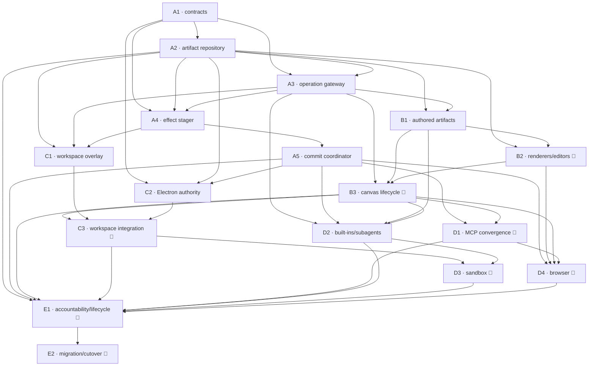

# Generative Surfaces v2.1 — PRDs per PR

**v0.2 · 2026-07-24 · status: for review.** One PRD is one reviewable pull
request. Requirements reference [00-overview.md](00-overview.md); architecture
references [01-sdr.md](01-sdr.md).

The sequence establishes contracts and dark infrastructure before changing any effect
path. The 17-PR decomposition is intentional:

- staging and effectful commit are separate because “the stager has no executor” is the
  central no-bypass property;
- built-ins/subagents, remote sandbox, and browser are separate adapters with different
  trust/recovery models;
- accountability is complete before migration/cutover removes legacy safety nets.

No PR may add a temporary direct-write path that bypasses the eventual
Gateway → Stager → Commit Coordinator chain.

---

## Standard definition of done

Every PRD inherits:

- [ ] Owning Python service full suite, owning npm workspace tests/typecheck, and
      affected consumer builds pass.
- [ ] No service-boundary violation: apps call facade; deployables do not import sibling
      `src/`; physical host access remains Electron-main/native-only.
- [ ] Contract changes have JSON/Pydantic/TypeScript parity and golden-fixture coverage.
- [ ] New commands are idempotent; same key/same digest replays, same key/different
      digest conflicts.
- [ ] Tenant scope derives from verified identity; cross-tenant negative tests cover
      every new id/ref route.
- [ ] Artifact bodies, physical paths, secrets, credentials, cookies, and raw external
      arguments do not enter logs or public ledger payloads.
- [ ] Large content uses refs/streams; no new unbounded base64 JSON or SSE body.
- [ ] Every new model invocation uses UsageMeter with a closed purpose.
- [ ] Old v2 run fixtures and signed receipt exports remain readable.
- [ ] Feature OFF preserves the declared compatibility path until E2.
- [ ] The implementation updates the SDR when a reviewed design decision changes.
- [ ] Temporary exemptions have an owner/expiry and cannot survive E2.

### UI definition of done

Every UI PRD marked 🎨 additionally requires:

- [ ] Shared `packages/chat-surface` / `packages/surface-renderers` implementation; no
      host-app duplicate.
- [ ] Studio and Focus behavior, replay/reconnect, loading/error/raw states.
- [ ] Design-system tokens/recipes only; keyboard and screen-reader flows tested.
- [ ] Fixed renderers treat content as untrusted and never execute it.
- [ ] Design-parity report has 0 HIGH drift for the relevant region.
- [ ] Web and supervised desktop live smoke.

### Effect-staging definition of done

Every PRD that creates/revises/decides an external-effect stage additionally requires:

- [ ] Adversarial test proves zero external-effect calls for all stage operations,
      including approve.
- [ ] Static/import/object-graph gate proves model-facing and staging code cannot reach
      an executor.
- [ ] Approval binds exact proposal and target digests.

### Effect-execution definition of done

Every PRD that can perform an external/host effect additionally requires:

- [ ] Adversarial no-bypass test proves zero effect without a matching decision/policy
      event over exact proposal and target digests.
- [ ] Precondition drift, duplicate delivery, timeout, cancellation, and process-crash
      behavior is tested.
- [ ] Claim-before-effect ordering is asserted with a recording fake.
- [ ] Uncertain post-dispatch outcomes reconcile or remain indeterminate; never blind
      retry.
- [ ] Architecture test proves the executor is reachable only through the Commit
      Coordinator.

---

## Index

### Wave A — Universal domain foundation, dark by default

| PRD                                            | 🎨  | Goal                                                                                                                  | Depends    |
| ---------------------------------------------- | :-: | --------------------------------------------------------------------------------------------------------------------- | ---------- |
| [A1](prds/PRD-A1-artifact-effect-contracts.md) |     | Versioned operation/artifact/effect contracts, ids, refs, events, compatibility mappings, and shared golden journeys. | —          |
| [A2](prds/PRD-A2-artifact-repository.md)       |     | Tenant-scoped immutable artifact revisions, streaming blobs, APIs, adapter parity, retention-safe refs.               | A1         |
| [A3](prds/PRD-A3-operation-gateway.md)         |     | Capability descriptors, pre-dispatch classification, universal Operation Gateway, disposition, shadow conformance.    | A1, A2     |
| [A4](prds/PRD-A4-effect-stager.md)             |     | Transport-neutral proposal/revision/decision state machine that structurally has no executor.                         | A1, A2, A3 |
| [A5](prds/PRD-A5-commit-coordinator.md)        |     | Durable claim, prepare/apply/reconcile protocol and closed executor registry, proven with a recording fake.           | A4         |

### Wave B — Agent-authored artifacts and presentation

| PRD                                                | 🎨  | Goal                                                                                                         | Depends    |
| -------------------------------------------------- | :-: | ------------------------------------------------------------------------------------------------------------ | ---------- |
| [B1](prds/PRD-B1-agent-authored-artifacts.md)      |     | Explicit provider-neutral artifact publication/promotion, subagent provenance, and `/drafts/` convergence.   | A2, A3     |
| [B2](prds/PRD-B2-artifact-renderers-editors.md)    | 🎨  | Fixed safe code/document/dataset/file renderers, exact download, immutable editing, raw fallback.            | A2, B1     |
| [B3](prds/PRD-B3-canvas-presentation-lifecycle.md) | 🎨  | Selective presentation plus assembling/chat-only/failed/parked lifecycle, conditional receipts, Focus cards. | A3, B1, B2 |

### Wave C — Local workspace, no write-through

| PRD                                                | 🎨  | Goal                                                                                                                  | Depends    |
| -------------------------------------------------- | :-: | --------------------------------------------------------------------------------------------------------------------- | ---------- |
| [C1](prds/PRD-C1-workspace-overlay.md)             |     | Durable base+overlay merged workspace, read-your-writes, coalesced stages, zero host mutation.                        | A2, A3, A4 |
| [C2](prds/PRD-C2-workspace-broker-commit.md)       |     | Electron-main/native authority, confinement gate, one-use permits, handle-relative prepare/commit/reconcile/recovery. | A1, A2, A5 |
| [C3](prds/PRD-C3-workspace-product-integration.md) | 🎨  | Workspace executor, grant gates, approval surfaces, desktop host integration, web fallback, direct-write retirement.  | B3, C1, C2 |

### Wave D — Existing capability convergence

| PRD                                     | 🎨  | Goal                                                                                                            | Depends        |
| --------------------------------------- | :-: | --------------------------------------------------------------------------------------------------------------- | -------------- |
| [D1](prds/PRD-D1-mcp-convergence.md)    | 🎨  | MCP pre-dispatch classification; selective read presentation; exact-argument write staging and executor.        | A5, B3         |
| [D2](prds/PRD-D2-builtins-subagents.md) |     | Descriptor/gateway convergence for built-ins, code mode, rowsets, subagents, operation tree, usage attribution. | A3, A5, B1, B3 |
| [D3](prds/PRD-D3-sandbox-adapter.md)    | 🎨  | Verified remote sandbox snapshots, artifacts, declarative patches, cleanup, and workspace-stage handoff.        | C3, D2         |
| [D4](prds/PRD-D4-browser-adapter.md)    | 🎨  | Browser reads, download artifacts, artifact-backed uploads, exact staged submits, honest reconciliation.        | A5, B2, B3, D1 |

### Wave E — Accountability and launch

| PRD                                           | 🎨  | Goal                                                                                                                  | Depends |
| --------------------------------------------- | :-: | --------------------------------------------------------------------------------------------------------------------- | ------- |
| [E1](prds/PRD-E1-accountability-lifecycle.md) | 🎨  | Usage/attribution, receipts/Sources/pending, audit v2, auth matrix, retention/deletion/legal hold, repair/metrics.    | A2–D4   |
| [E2](prds/PRD-E2-migration-cutover.md)        | 🎨  | Backfill, pending-work migration, independent rollout flags, legacy retirement, conformance/live gates, safe backout. | all     |

---

## Dependency graph

---

## Suggested implementation order

1. **A1** is the vocabulary/fixture gate.
2. **A2**, then **A3**, establish canonical content and the pre-dispatch seam.
3. **A4** lands and proves zero effects before **A5** adds any executor.
4. After A5:
   - **B1** may proceed from A2+A3;
   - **C2** may proceed from A5 in a disjoint Electron-main/native worktree;
   - **D1** may begin in shadow once B3 exists.
5. **B2**, then **B3**, establish safe artifact/presentation behavior.
6. **C1** can run parallel with B UI work after A4.
7. **C3** waits for B3+C1+C2 and must retire direct workspace write-through.
8. **D2** can begin after A5+B1+B3.
9. **D3** waits for C3+D2 so patches use the final workspace path.
10. **D4** waits for fixed artifact/UI and the final commit protocol; read-only gateway
    work can be prepared earlier, but side effects cannot.
11. **E1** proves accountability/lifecycle before any final retirement.
12. **E2** is last: migrate, drain/reconcile, delete bypasses, flip defaults, and run
    the full matrix.

---

## PR sizing and integration constraints

- A PRD may use mechanical sub-commits, but the PR must leave every exposed interface
  consumed or dark-tested.
- If implementation scope exceeds roughly three deployable components, split at an
  already-defined port. Never add a cross-service import or duplicate policy.
- A4 and A5 must remain separate PRs.
- C2 is intentionally cross-language (`apps/desktop` plus the typed ai-backend client)
  with one cohesive boundary: LocalWorkspaceAuthority.
- D3 and D4 are separate because sandbox patch recovery and browser external-action
  reconciliation have materially different threat models.
- E1 may be large but contains no producer cutover; E2 contains no new domain design.
- Any design change discovered during implementation updates the SDR and dependency
  map before dependent PRs start.
