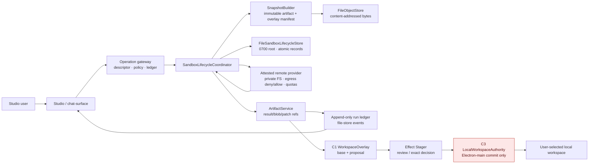
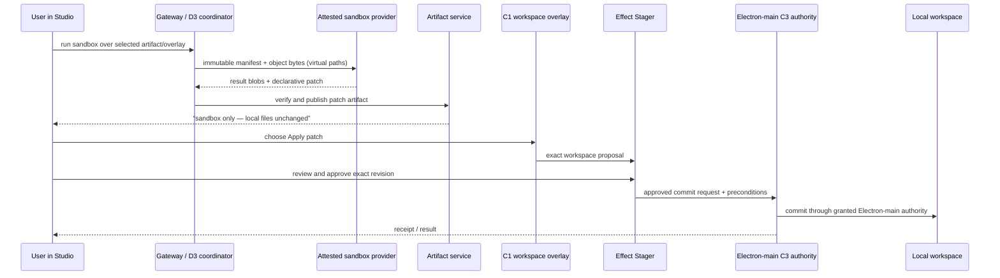

# PRD-D3 — Filesystem-first sandbox operation adapter 🎨

**Status:** implementation contract

**Goal.** Add a remote sandbox capability to Studio without giving it access to a
live local workspace, an Electron broker, a physical host path, credentials, or a
database dependency. On desktop, the filesystem is the authoritative persistence
layer for sandbox operation recovery, artifacts, and run history. A sandbox consumes
an immutable artifact snapshot and produces a bounded operation result, artifacts,
or a declarative patch. A patch is only a proposal: it can change a local workspace
only through C1's overlay, the generic stage/decision flow, and C3's Electron-main
workspace commit authority.

This PRD refines the earlier remote-sandbox proposal to make the desktop product
filesystem-first. It does not introduce a new persistence service and it does not
make ai-backend Postgres a prerequisite for sandbox execution.

## Decision summary

| Decision            | Contract                                                                                                                                                                           |
| ------------------- | ---------------------------------------------------------------------------------------------------------------------------------------------------------------------------------- |
| Desktop persistence | `RUNTIME_STORE_BACKEND=file` is the default. The root is `<userData>/agent-data/v1` through `RUNTIME_FILE_STORE_ROOT`.                                                             |
| Sandbox authority   | The provider sees immutable artifact refs plus virtual paths, never a host path, mount, broker capability, grant, token, or credential.                                            |
| Local mutation      | Sandbox output is an artifact/patch only. C1 imports it into an overlay; C3's Electron-main executor is the sole local-workspace writer.                                           |
| Provider trust      | A provider must attest isolated filesystem, egress enforcement, quotas, and teardown. If it cannot, `run_in_sandbox` is absent rather than downgraded.                             |
| Database position   | Backend's own Postgres for identity/OAuth/vault is unaffected. ai-backend Postgres remains an explicit legacy/hosted-store path, never a desktop sandbox requirement.              |
| Initial deployment  | D3 ships for the desktop file store. A server/hosted sandbox deployment requires its own durable-store and provider-operating PRD; it must not silently reuse desktop assumptions. |

## Implementer brief

Read before changing code:

1. `../01-sdr.md`, especially AD-7, §§9–12, S9, and the failure matrix.
2. `PRD-D2-builtins-subagents.md`, `PRD-C1-workspace-overlay.md`, and
   `PRD-C3-workspace-product-integration.md`.
3. `apps/desktop/README.md` “File-native AI store (default)” and
   `docs/operations/desktop-file-store-migration.md`.
4. `services/ai-backend/src/agent_runtime/capabilities/sandbox/`.
5. `services/ai-backend/src/runtime_adapters/file/` and its conformance tests.
6. `apps/desktop/main/services/service-env.ts`.

`tools/desktop-runtime/README.md` still describes ai-backend Postgres as the desktop
runtime store. That is stale relative to the actual desktop file-store cutover and
must be corrected in the implementation PR that changes runtime documentation. Some
legacy comments around the `else` branch in `service-env.ts` are similarly stale;
the pure `resolveAiStoreBackend` function and its tests are the source of truth.

## Context and problem

The repository has typed sandbox snapshot/patch concepts, but the live path is not
yet a production capability contract: it can use an empty workspace, discard session
state after a command, use memory/null lifecycle sinks, and cannot demonstrate
deny-all egress. The in-process code helper uses ordinary Python facilities and is
useful for trusted unit tests only; it is not an isolation boundary.

The product is desktop and filesystem first. Users need to ask for bounded work such
as “inspect these CSVs,” “produce a report,” “refactor this code snapshot,” or “run
a conversion.” They also need a simple guarantee: no local file changes until they
review and approve a staged workspace change. The system must remain useful when a
remote provider is not deployed: the UI and tool catalog must be honest rather than
pretending that a sandbox exists.

## Goals

1. Make the desktop file store the authority for sandbox lifecycle/recovery state
   and sandbox-owned durable references.
2. Route every sandbox request through the operation gateway and descriptor policy;
   no model-callable direct provider path remains.
3. Build an immutable, bounded artifact/overlay snapshot with no live host
   authority.
4. Require verifiable provider isolation, egress policy, quotas, and teardown.
5. Publish result bytes, deliverables, and complete patches through the artifact and
   ledger contracts.
6. Preserve C1/C3's overlay-before-host-commit rule for every local workspace
   outcome.
7. Make crashes, cancellation, duplicate delivery, cleanup, and usage accounting
   recoverable from desktop files.
8. Present sandbox work in Studio with clear isolation, progress, artifact, patch,
   diff, and approval states.

## Non-goals

- General unrestricted internet shell access.
- A live bind mount or synced remote development environment.
- Passing an Electron workspace broker, host grant, path, secret, or user token to
  a sandbox provider.
- Direct sandbox-to-host write, including a “trusted” shortcut.
- Replacing backend identity/OAuth/vault Postgres.
- Adding ai-backend Postgres tables, migrations, or a Postgres lifecycle adapter for
  the desktop initial release.
- Making the in-process code helper a production fallback.
- Executing document macros, HTML, scripts, or code merely to render a preview.

## Logical view



The sandbox is deliberately not connected to `HOST`. The provider's only input is
the snapshot manifest and object bytes. `C3` is the sole component allowed to turn a
reviewed workspace proposal into a physical local filesystem change.

## Deployment and storage contract

### Desktop is file-native

For a normal desktop boot, the supervisor resolves:

```text
RUNTIME_STORE_BACKEND=file
RUNTIME_FILE_STORE_ROOT=<userData>/agent-data/v1
ENTERPRISE_DEPLOYMENT_PROFILE=single_user_desktop
```

`COPILOT_DESKTOP_FILE_STORE_V1` is a rollback override:

| Value                                 | Effective ai-backend run store |
| ------------------------------------- | ------------------------------ |
| unset, empty, unknown, or truthy      | file                           |
| `0`, `false`, `no`, `off`, `disabled` | legacy Postgres                |

The supervisor resolves this once per boot with `resolveAiStoreBackend`; its migration
gate and `buildServiceEnv` must consume the same resolved value. D3 must add a test
that an unset flag gives the file backend and that a falsey override is the only path
to ai-backend Postgres.

Backend service Postgres remains available to the backend service for identity, OAuth,
connector token vault, and product data. It is not visible to a sandbox and is not a
storage dependency of `SandboxLifecycleCoordinator`.

### Filesystem authority

All D3 durable state on desktop is under the configured file-store root. It is private
runtime metadata, not a user workspace and not a user-visible deliverable directory.

```text
<RUNTIME_FILE_STORE_ROOT>/
  objects/<content-addressed object layout>       # existing FileObjectStore authority
  runs/...                                        # existing conversations/runs/events authority
  sandbox/
    lifecycle/<sha256(idempotency-key)>.json      # operation state machine + provider handle
    sessions/<sha256(session-id)>.json            # resumable provider session metadata
    usage/<sha256(operation-id)>.json             # deduplicated metering checkpoint
    cleanup/<sha256(operation-id)>.json           # retryable teardown obligation
```

The exact existing run/object directory layout is not duplicated by D3. D3 owns only
the `sandbox/` namespace; it stores object references, never a second copy of artifact
bytes.

`FileSandboxLifecycleStore` and its session/usage/cleanup sub-stores must meet these
requirements:

- create private directories with mode `0700`, records with mode `0600`;
- reject non-relative IDs, separator-bearing IDs, and path traversal before resolving
  a record name; use a stable SHA-256 filename of a canonical key;
- refuse symlink traversal and do not follow a pre-existing malicious symlink;
- write `temp file → fsync file → atomic rename → fsync parent directory`;
- serialize read-modify-write transitions with a per-record lock; the lock scope is
  one operation/idempotency key, never the entire store;
- persist schema version, immutable operation identity, transition number, timestamps,
  provider resource ID, snapshot digest, and only safe error summaries;
- fail closed on malformed, owner-mismatched, or impossible-transition records;
- support idempotent load after app/worker restart without trusting a stale in-memory
  coordinator.

No physical host workspace path, Electron authority, plaintext secret, provider bearer
token, command body beyond bounded/redacted metadata, or raw user document content may
be placed in lifecycle/session/usage records. Document/content bytes belong in the
artifact object store, where retention and ref counting already apply.

### Hosted/server posture

With a non-file ai-backend store, D3's desktop provider composition is unavailable.
The descriptor must not be registered merely because a Python sandbox module imports.
A later hosted deployment must specify its own durable lifecycle store, object-store
identity, tenancy controls, provider egress enforcement, migration, retention, and
operator recovery. It is not acceptable to silently introduce a Postgres implementation
while claiming the desktop contract still applies.

## Operation contracts

### Descriptor and classification

`run_in_sandbox` is registered only when all of the following are true:

1. `RUNTIME_ENABLE_REMOTE_SANDBOX=true`;
2. runtime is the supported file-native desktop profile;
3. `SandboxLifecycleCoordinator` has a file-backed lifecycle store and artifact port;
4. a provider has passed capability attestation for the requested isolation and egress
   policy;
5. gateway policy permits this invocation and quota has capacity.

The model never selects a provider, passes an arbitrary egress rule, or supplies a
physical path. The gateway resolves the descriptor and canonical policy server-side.

| Requested capability                     | Effect classification | Initial behavior                                 |
| ---------------------------------------- | --------------------- | ------------------------------------------------ |
| isolated compute over immutable snapshot | `none`                | allowed only if provider attests deny-all egress |
| produce result/artifact                  | internal reversible   | artifact is published and auditable              |
| propose a patch                          | proposal              | imports into C1 overlay only after user action   |
| secrets/egress/external submit           | gated external effect | not registered in initial D3                     |

### Gateway adapter

Implement a `SandboxOperationAdapter` behind the same D2 operation-gateway boundary
as other builtin capabilities. Its narrow interface owns:

```text
prepare(request) -> SandboxPreparedOperation
execute(prepared) -> SandboxOperationResult
recover(operation_id) -> SandboxOperationResult | Pending
cancel(operation_id) -> Cancelled | CleanupPending
```

The adapter receives canonical operation identity, actor/run scope, descriptor ID,
normalized arguments, policy decision, and artifact/overlay ports. It does **not**
receive a raw `Path`, Electron IPC object, backend database handle, provider credential,
or an unbounded tool callback.

`operation_id` is allocated before provider interaction and is persisted with a
deterministic idempotency key derived from the durable tool invocation identity. A retry
of the same invocation loads the existing record; it does not allocate a new provider
environment or run the command twice. A new user tool invocation deliberately has a
new operation identity.

The existing `RemoteExecutionService.session_scope()` / direct `aexecute()` path must
not remain model-callable after this adapter lands. It may remain behind a test-only
provider fake, but production gateway wiring must have one adapter entrypoint.

## Snapshot contract

### Input shape

The coordinator creates one canonical `SandboxSnapshotManifest` before a provider is
provisioned:

```json
{
  "v": 1,
  "snapshot_id": "snp_…",
  "operation_id": "op_…",
  "source": { "kind": "artifact_revision|workspace_overlay", "ref": "…" },
  "overlay_manifest_version": 42,
  "entries": [
    {
      "virtual_path": "input/sales.csv",
      "object_ref": "artifact://…/rev/3",
      "sha256": "…",
      "size_bytes": 1234,
      "media_type": "text/csv"
    }
  ],
  "limits": { "entries": 1000, "bytes": 268435456 },
  "manifest_sha256": "…"
}
```

The values are illustrative; the shared contract module owns exact names and limits.
The manifest is canonical JSON, sorted deterministically, and digested after all limits
and entries are resolved. The provider verifies the digest after transfer; the
coordinator verifies each returned output digest before publication.

For a local workspace, the source is a C1 base-plus-overlay view at one manifest
version. The snapshot materializer reads via the workspace authority/overlay port and
publishes artifact-backed immutable entries. It never sends a live path or uses a bind
mount. Changes in the host workspace after the snapshot do not alter sandbox input.

### Validation and limits

Before upload, reject:

- absolute paths, `..`, empty components, platform-reserved paths, duplicate logical
  paths, and normalization collisions;
- symlinks, devices, sockets, FIFOs, hard-link ambiguity, and unsupported special
  entries;
- sparse-file amplification, declared-size/hash mismatch, archives that expand beyond
  policy, and an incomplete object;
- entries, total bytes, file bytes, and depth exceeding descriptor limits.

Do not accept an arbitrary archive from the model as a snapshot. Only the server-side
artifact/overlay resolver constructs snapshot entries.

## Provider isolation and egress

`SandboxProvider.attest(policy)` must return a signed or otherwise verifiable capability
statement bound to the provider implementation/version and requested policy. At a
minimum it proves:

- a fresh isolated process/container/VM filesystem per operation;
- no inherited host credentials or environment secrets;
- deny-all egress for initial D3, enforced by the provider rather than asserted in a
  prompt;
- CPU, memory, process, wall-clock, file-count, input, and output limits;
- cancellation and teardown semantics, including a provider resource identifier;
- an isolated result collection channel.

If attest fails, is expired, cannot express deny-all egress, or cannot bind the
requested policy to the launched environment, the tool is absent and the runtime emits
an honest capability-unavailable event. There is no in-process or permissive fallback.

Future egress requires a separate PRD. It must compile an approved domain/IP allowlist
at the provider, use provider-injected scoped secret references, classify actual external
side effects through an executor, and never expose plaintext secrets in events or tool
results.

## Lifecycle, recovery, and metering

### State machine

```text
requested → provisioned → uploading → running → collecting → completed
                                                          ↘ failed
                                                          ↘ cancelled
all terminal paths → cleanup_pending → cleaned
```

`cleanup_pending` is visible and recoverable. `completed` means result collection and
integrity verification succeeded; it does not falsely claim that teardown succeeded.
If the process stops after provider submission, recovery loads the operation record and
asks the provider for its authoritative status. It never blindly replays an ambiguous
operation.

Transition rules:

- a record includes an incrementing transition number and expected prior state;
- duplicate requests return the persisted terminal result or pending operation;
- cancellation stops new work, requests provider cancellation once, and persists a
  retryable cleanup duty if teardown cannot be confirmed;
- retries before provider execution may reuse a provisioned environment only if the
  provider attestation explicitly permits that state; otherwise provision a fresh one;
- provider execution with any future egress capability is never automatically retried
  after an ambiguous outcome;
- a desktop janitor scans only persisted `cleanup_pending` records, uses bounded
  backoff, and keeps evidence until cleanup succeeds or retention expires.

### Metering

One `usage` checkpoint is keyed by durable `operation_id`. The coordinator records
input bytes, output bytes, provider duration/CPU if available, and provider cost units
without double-counting recovery or duplicate delivery. Existing run/user/conversation
usage attribution remains the source for user-facing usage views; D3 may add sandbox
dimensions only additively. Raw command text, document content, secrets, and provider
tokens are never usage dimensions.

## Output, artifact, and patch contract

### Result disposition

| Provider output            | D3 disposition                                                                             |
| -------------------------- | ------------------------------------------------------------------------------------------ |
| bounded text/scalar        | operation result/activity; raw fallback remains available                                  |
| requested deliverable file | exact artifact bytes with media type, suggested filename, digest, and operation provenance |
| changed isolated snapshot  | validated `SandboxPatchManifest` artifact plus patch/diff surface                          |
| oversized stdout/stderr    | bounded preview plus protected artifact ref                                                |
| no durable result          | completion activity only; no forced surface                                                |

Commands, stdout, stderr, errors, and returned filenames are size-bounded and redacted
before events/projectors. Untrusted output is rendered as text/data, never executed.

### Patch manifest

The provider cannot issue a host mutation. It may only return a complete declarative
patch against the exact snapshot:

```text
create | replace | delete | move | mkdir
path, source_path?, baseline_digest?, result_ref?, result_digest?, mode?
```

`SandboxPatchManifest` contains:

- `snapshot_id`, source identity, overlay/base manifest version, and input digest;
- every changed entry, canonical ordering, and a manifest digest;
- only artifact object refs/digests for new bytes;
- a `complete` flag set only after all entries and bytes verify;
- operation/provider provenance and safe summary statistics.

Incomplete, oversized, malformed, non-canonical, or mismatched patches are artifacts
for diagnosis at most; they cannot create an overlay revision or a stage.

### Workspace handoff



Importing the patch changes only C1's app-owned overlay. A user may inspect, revise,
discard, or stage it. C3 re-checks base identity, grant, and preconditions at commit;
conflict never becomes a silent overwrite. D3 has no import path to Electron main and
no workspace effect executor that bypasses C3.

## Studio presentation contract

Studio renders a compact sandbox execution card and progressively richer result cards:

- command/intent summary, snapshot scope, provider isolation posture, and “network:
  blocked” for D3;
- lifecycle status, elapsed duration, exit status, bounded output, and raw-ref access;
- artifact cards with safe media/type treatment;
- patch tree/diff with exact snapshot/base identity;
- exact language before workspace staging: **“Sandbox only — your local files are
  unchanged.”**;
- an explicit **Apply patch to workspace** action which opens the C1/C3 staged flow;
- `cleanup_pending`, provider unavailable, cancellation, and recovery status rather
  than optimistic success.

Focus mode uses these cards; it does not need a bespoke generative renderer. Raw
fallback, accessibility labels, no-script document handling, and the existing design
system remain mandatory. No card may offer a direct “write local files” action.

## Composition and boundaries

### Required wiring

The desktop composition root creates exactly one set of narrow ports:

```text
FileObjectStore
FileRuntimeApiStore / canonical event append port
FileSandboxLifecycleStore
FileSandboxSessionStore
FileSandboxUsageStore
FileSandboxCleanupStore
SandboxProviderRegistry
SandboxLifecycleCoordinator
SandboxOperationAdapterFactory
```

`RuntimePorts` exposes the final adapter/factory to the worker. It does not expose the
file-store root. The worker receives a gateway-capability factory, not host paths or a
provider credential. The `runtime_api` app and worker use the same file-store root only
through their existing typed adapter factories; they never import Electron main.

Artifact publishing and workspace imports use existing service ports/contracts. Apps
call the facade only. No deployable component imports another service's `src/`.

### Prohibited wiring

The implementation must reject or avoid all of these shapes:

- `Path(workspace)` or `file://…` in model arguments, operation records, sandbox
  manifest, provider request, event payload, or renderer props;
- an Electron IPC/broker/workspace grant object in ai-backend or provider code;
- sandbox code calling C3, local filesystem APIs for a user workspace, or an MCP
  connector to apply a patch;
- a production branch that calls the old direct provider `aexecute()` path;
- in-memory/null lifecycle persistence in the desktop composition;
- a hidden Postgres fallback when file-store construction fails.

## Implementation plan

1. **Contract and file stores.** Define lifecycle/session/usage/cleanup records,
   atomic file-store ports, state-machine validation, conformance and corruption
   tests. Do not add a migration.
2. **Gateway convergence.** Add descriptor, `SandboxOperationAdapter`, canonical
   idempotency identity, and remove direct model-callable provider execution.
3. **Snapshot and provider.** Implement artifact/overlay snapshot materialization,
   limits/digests, provider attestation, deny-all egress gating, and a hermetic fake
   provider for tests.
4. **Recovery and outputs.** Add result collection, artifact publication, patch
   validation, cleanup janitor, cancellation, and exactly-once usage checkpoints.
5. **Workspace path.** Connect validated patch import to C1 overlay and existing
   C3 stage/approval/commit contracts; add conflict and no-direct-write proofs.
6. **Studio.** Add operation/artifact/patch projectors and cards behind the Studio
   flag, then run desktop and design-parity journeys.
7. **Documentation.** Correct stale desktop-runtime references to the former default
   Postgres ai-backend store and document the falsey rollback override.

Each step is independently shippable behind `RUNTIME_ENABLE_REMOTE_SANDBOX=false`.
No step may make an unavailable provider appear available.

## Test plan

### File-store correctness

- default desktop supervisor configuration is file store; only explicit falsey
  `COPILOT_DESKTOP_FILE_STORE_V1` resolves ai-backend Postgres;
- private modes, atomic replacement, parent `fsync`, and record-level locking;
- concurrent duplicate request gives one provider submission and one usage checkpoint;
- crash/reopen at every lifecycle transition reconstructs the same state;
- malformed JSON, wrong schema, symlink substitution, traversal ID, and owner mismatch
  fail closed without escaping the sandbox namespace;
- cleanup janitor resumes a persisted duty after Electron/worker restart.

### Isolation and input integrity

- provider sees no host path, `file://` value, broker/grant, token, secret, or
  unbounded environment variable;
- provider lacking deny-all attestation makes the descriptor/tool absent;
- an attested fake records the exact egress policy and has no network route;
- traversal/symlink/device/FIFO/hard-link/sparse/archive amplification corpus rejects;
- manifest/object hash mismatch blocks provider execution or output publication;
- in-process helper cannot be selected from production composition.

### Lifecycle, output, and recovery

- request, duplicate, cancel, crash, restart, provider timeout, collection failure,
  cleanup failure, and cleanup retry paths;
- no ambiguous provider execution is automatically repeated;
- stdout/stderr/output limits offload safely and redact sensitive values;
- artifacts preserve exact bytes/digest/media type/provenance;
- usage is exact-once across duplicate delivery and recovery;
- only complete canonical patch can proceed to overlay import.

### Workspace safety

- snapshot created from C1 base+overlay reads, never a live mount;
- apply-patch changes overlay only before approval;
- sandbox process and D3 adapter lack a local workspace write handle;
- base/grant/precondition drift at C3 commit produces conflict and zero host mutation;
- rejected/discarded patch and failed stage leave the local workspace unchanged;
- the only physical-workspace mutation trace comes from `LocalWorkspaceAuthority`.

### Studio and real desktop checks

- compute-only operation, artifact deliverable, patch proposal, rejected patch,
  cancellation/recovery, and unavailable provider states;
- exact “Sandbox only — your local files are unchanged” copy before an approved C3
  commit;
- raw fallback and no execution of malicious HTML/code/CSV contents;
- web renders an honest unavailable state while D3 is desktop-file-store-only;
- add an automated desktop journey using a hermetic attested provider fake;
- at release, run the real supervised desktop journey with the configured provider,
  then run `tools/design-parity` against the current Studio mock and resolve all
  computed-style HIGH findings.

## Definition of done

- [ ] Desktop sandbox state is file-backed under `RUNTIME_FILE_STORE_ROOT`; no D3
      ai-backend Postgres migration/table/adapter was added.
- [ ] Desktop default/rollback file-store behavior is proved by supervisor tests and
      stale runtime documentation is corrected.
- [ ] `run_in_sandbox` is gateway-only and is absent unless an attested provider plus
      file-backed coordinator are available.
- [ ] Every sandbox input is an immutable bounded artifact/overlay snapshot with no
      host path, live mount, broker, grant, credential, or secret.
- [ ] Provider isolation, deny-all egress, quotas, isolated filesystem, and teardown
      are verified before launch; no insecure fallback exists.
- [ ] Lifecycle, recovery, cleanup, cancellation, and metering survive restart and
      duplicate delivery from filesystem authority.
- [ ] Outputs are bounded results/artifacts or complete validated patches with
      provenance; untrusted output is never executed while rendering.
- [ ] Patch import reaches only C1 overlay, then exact review/stage, then C3
      Electron-main commit; tests prove zero direct local workspace mutation.
- [ ] Studio clearly distinguishes isolated work from a reviewed local commit.
- [ ] File-store, adapter, security corpus, unit/integration, real desktop smoke, and
      computed-style design-parity gates pass before default-on rollout.

## Rollout and rollback

`RUNTIME_ENABLE_REMOTE_SANDBOX` remains false by default through implementation.
Enable it only for the desktop file-store profile with the attested provider and a
passing real supervised desktop smoke. Disable it to remove the descriptor/tool without
changing run history, object references, lifecycle records, or local workspace data.

`COPILOT_DESKTOP_FILE_STORE_V1=0` remains the independent ai-backend legacy-Postgres
rollback for a user who needs it; it does not activate sandbox support in that mode.
The UI must say unavailable rather than attempting a database-backed or in-memory
sandbox fallback.
