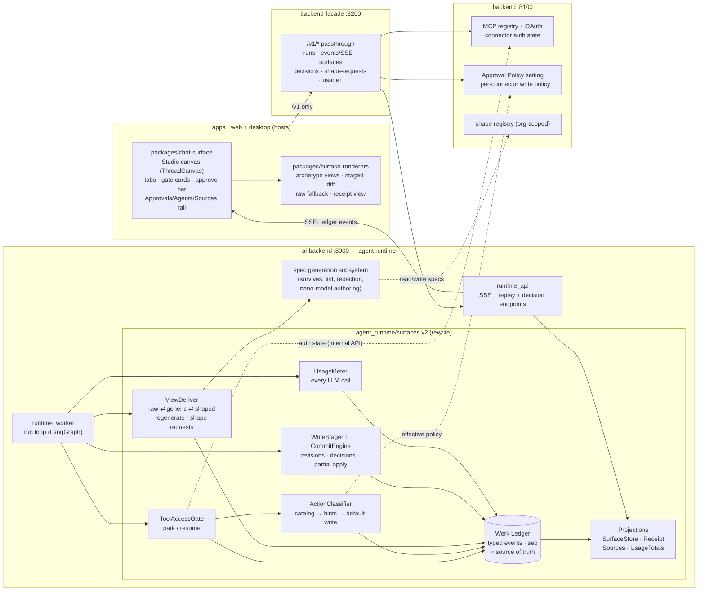
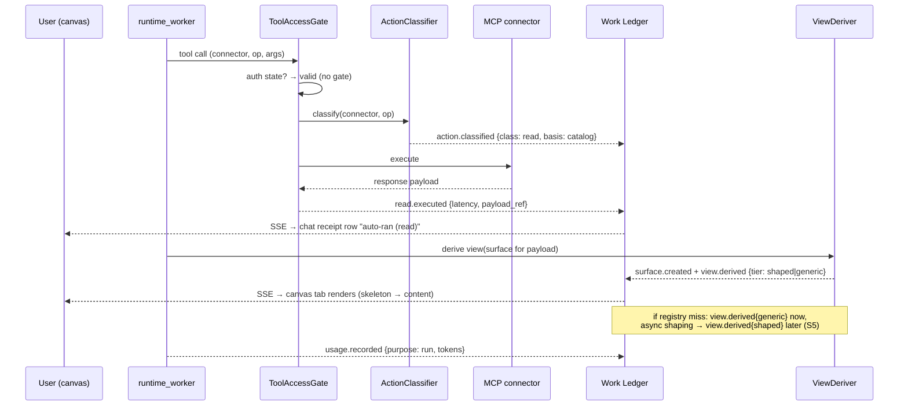
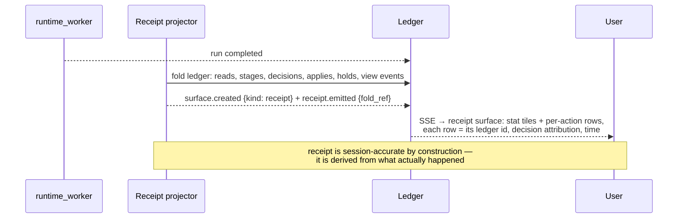

# SDR — Generative Surfaces v2

**Solution Design Review · v0.1 · 2026-07-23 · status: for review**
Companion docs: [01-problem-and-requirements.md](01-problem-and-requirements.md) (v1.2, the
contract this design satisfies) · [03-prds.md](03-prds.md) (per-PR breakdown with DoD).

---

## 1. Context and goals

The requirements doc defines the product: an agent's work on real SaaS tools rendered as
live artifact **surfaces** on a per-run canvas; **reads flow, writes stage** and are decided
on the artifact with a rev-pinned what-you-approve-is-what-executes guarantee; tool access
is **gated only when auth is missing/expired**, with write policy decided at the gate and
synced to the global Approval Policy; unknown tools get an **honest** generic view, a
background purpose-shaped upgrade, or a lossless raw fallback — never a fabricated view;
everything threads through one **ledger** that yields receipts, sources, and (new, FR-G)
**token-usage attribution** at user/chat/run level.

**Goals of this SDR:** name the components and their boundaries, show the runtime flows,
and decide what of the existing implementation survives, what is rewritten, and why.

**Non-goals:** timeline (deferred), Focus-mode changes (rich cards only, untouched),
Settings usage UI (plumbing only, FR-G4), failure-path UX detail (Phase-2 designer track,
session task #1 — the architecture reserves the seams; see §7 S2/S4 error branches).

---

## 2. Architectural stance — why this is a rewrite of the surface layer, not a patch

The shipped generative-UI pipeline (Waves 0–4) got three things right that we keep:
declarative view specs rendered by fixed archetype renderers (never model-authored UI),
the tiered generic→shaped→raw honesty ladder with injection lint, and org-scoped shape
registry. But its **structural model does not fit the v2 requirements**, and patching it
would be band-aids:

| Flaw in current implementation                                                                                                        | Why it blocks v2                                                                                                                                   |
| ------------------------------------------------------------------------------------------------------------------------------------- | -------------------------------------------------------------------------------------------------------------------------------------------------- |
| A surface exists only as an **appendage on a `tool_result` event payload** (`result["surface"]`) — no identity, no lifecycle          | v2 surfaces are long-lived, tabbed, revisioned entities with decisions attached; you cannot hang a staged-write lifecycle off a payload decoration |
| **Two projectors** (`SurfaceProjector` in MCP middleware, `DraftSurfaceProjector` in draft/approval handlers) with diverging behavior | Split-brain: same concept, two code paths, two event shapes — exactly where approval-integrity bugs breed                                          |
| View selection conflated with surface state: "spec absent ⇒ tier-3" is an **implicit** contract                                       | v2 needs per-surface view state (raw ↔ generic ↔ shaped, keep-generic preference, regenerate, suggest-shape) as explicit, auditable state          |
| Approvals (PRD-09/10) are draft-centric; bulk/per-row/partial-apply don't exist; gates aren't surfaces                                | v2 unifies gates, single-artifact writes, and row-set writes under one staged-decision model                                                       |
| No user-visible ledger abstraction; receipts would be re-derived ad hoc from event names                                              | FR-E1/E2 require stable ids threading footer → chat → sources → receipt, and a receipt that is a _fold of the ledger_                              |
| Metering is a specgen log line + counters                                                                                             | FR-G requires per-call usage records attributed to user/chat/run/purpose, queryable                                                                |

**The rewrite decision:** re-found the surface layer on an explicit, typed **Work Ledger**
(event-sourced on the runtime's existing per-run event log), with everything else —
canvas, surface store, receipt, sources, usage totals — defined as **projections of the
ledger**. One projector, one vocabulary, one source of truth.

**What survives (validated, reused):** the spec-generation subsystem internals (sample
redaction, structural lint, injection kill-switch, retry protocol — `generator.py`), the
archetype renderers and design tokens, the org shape registry (backend `surface_specs`),
MCP OAuth in backend, SSE streaming + monotonic `sequence_no` + replay in runtime_api,
`packages/audit-chain`. **What is rewritten:** surface emission (both projectors),
draft/approval flow (rehomed into the staged-write engine), view binding (explicit view
state). **What is deprecated:** the `result["surface"]` payload appendage (kept during a
compat window behind the v1 flag, then removed).

---

## 3. Logical view (component diagram)

No new deployable service. Surfaces are runtime domain state — same lifecycle, same
tenancy, same stores as runs/events/approvals — so they live in **ai-backend**; a
separate service would add a network boundary through the middle of one transactional
lifecycle for zero isolation benefit. Boundaries below follow the repo's hard rules
(apps → facade only; backend owns MCP/OAuth/settings; contracts via `packages/api-types`).



† usage endpoints land with the plumbing but stay UI-less (FR-G4).

### Component responsibilities

| Component                            | Owns                                                                                                                                                                                                                   | Explicitly does not own                                        |
| ------------------------------------ | ---------------------------------------------------------------------------------------------------------------------------------------------------------------------------------------------------------------------- | -------------------------------------------------------------- |
| **Work Ledger** (ai-backend)         | The typed event vocabulary (§5); append-only per-run stream reusing the existing event log's `sequence_no`, persistence, SSE, and replay                                                                               | Rendering, policy, deciding anything                           |
| **ToolAccessGate**                   | Intercepting tool calls; asking backend for connector auth state; parking the run (interrupt) on missing/expired/insufficient auth; resuming on `gate.resolved`                                                        | OAuth itself (backend's), policy content                       |
| **ActionClassifier**                 | read/write/unknown classification: curated catalog → MCP annotations as untrusted hints → **default = write**; resolving effective hold behavior from Approval Policy + per-connector override                         | Storing policy (backend's)                                     |
| **ViewDeriver**                      | Per-surface view state (raw/generic/shaped + preference); derive = pure function of stored response payload; regenerate (re-derive, no re-fetch); user-invited shape requests                                          | Authoring specs (generation subsystem's), styling (renderers') |
| **WriteStager + CommitEngine**       | Staged proposals (single artifact or row-set) as revisions; free-form edit merge; decisions (approve/reject/hold/restore, rev- or row-scoped); commit with precondition re-check + idempotency; partial apply          | Deciding (user's), connector transport (MCP client's)          |
| **UsageMeter**                       | One wrapper at the model-invocation seam (run loop, subagents, shaping, shape requests): emits `usage.recorded` events + rows in a queryable usage store, purpose-tagged, attributed org/user/conversation/run/surface | Pricing (query-time lookup), UI                                |
| **Projections**                      | SurfaceStore (queryable snapshot, rebuildable from ledger), Receipt fold, Sources fold, UsageTotals fold                                                                                                               | Truth (the ledger is truth)                                    |
| **backend**                          | MCP registry/OAuth/auth state; Approval Policy + per-connector write-policy storage; org shape registry                                                                                                                | Runtime orchestration                                          |
| **chat-surface / surface-renderers** | Canvas projection UI + views, one implementation for both hosts, on design-system tokens                                                                                                                               | Business rules (all server-side)                               |

---

## 4. Service & boundary view

- **No new deployable.** New HTTP surface area: facade passthroughs `GET /v1/agent/runs/{run_id}/surfaces` (produced by A3 — lists **and** replays a run's surfaces; this is the surface-resolution contract, there is **no** standalone `GET /v1/agent/surfaces/{surface_id}` route), `/v1/agent/stages/{stage_id}/decisions` (POST), `/v1/agent/surfaces/{surface_id}/shape-request` (POST, B4), `/v1/usage/*` (internal-ready, UI later). Per-surface **mutating** routes are keyed on `{surface_id}` with a `run_id` query param — B3's `…/regenerate` and `…/view-preference`, B4's `…/shape-request`. All app traffic stays facade-only. _(§4 reconciled 2026-07-23: replaced the phantom `/v1/agent/surfaces/{surface_id}` (get/replay) route that no PRD produces; §5 frozen/unchanged.)_
- **ai-backend ↔ backend** stays internal HTTP with service token (existing pattern): connector auth state, effective policy, shape registry.
- **Contracts** (`packages/api-types`): `SurfaceEventV2` union, `Surface`, `StagedWrite`, `Revision`, `Decision`, `UsageRecord`, `RunReceipt` — mirrored by pydantic models; cross-language parity tests (same discipline as the existing SurfaceSpec schema parity test).
- **packages/service-contracts**: event-type string constants + ledger-id format, shared py/ts.

---

## 5. Data model — the ledger vocabulary

Ledger id (user-visible): `r<run-short>·<seq>` (e.g. `r7f3·042`) — pure presentation over
existing `run_id` + `sequence_no`; no new id system.

```text
gate.opened        {gate_id, connector, purpose, scopes[], auth_state: missing|expired|insufficient}
gate.resolved      {gate_id, outcome: connected|cancelled, write_policy?: ask_first|allow_always}
action.classified  {call_id, connector, op, class: read|write|unknown, basis: catalog|annotation|default}
read.executed      {call_id, connector, op, latency_ms, payload_ref}
surface.created    {surface_id, kind: record|message|table|call|raw|receipt|gate, source{connector,op}, title, payload_ref}
view.derived       {surface_id, tier: raw|generic|shaped, basis: schema|registry|generated, spec_ref?, gen: {model, ms}?}
view.preference    {surface_id, keep: generic|shaped, actor: user}
shape.requested    {surface_id, actor: user}                    ← "Suggest a shape" (FR-D4)
write.staged       {stage_id, surface_id, target{connector,op}, proposal_ref, rows?: n, agent_holds: [{row_key, reason}]}
revision.added     {stage_id, rev, author: agent|user, diff_ref}
decision.recorded  {stage_id, decision: approve|reject|hold|restore, scope: {rev}|{row_keys[]}, actor: user|policy}
write.applied      {stage_id, rev, row_keys?, result: applied|partial|failed, connector_receipt_ref}
usage.recorded     {purpose: run|subagent|view_shaping|shape_request, model, tokens_in, tokens_out, surface_id?}
receipt.emitted    {surface_id, fold_ref}
```

Notes: `*_ref` values point at payloads persisted by the existing event/payload stores
(payloads already persist for replay — regenerate rides on that). Event payloads carry a
`v` field from day one. Every event inherits org/user/conversation/run attribution from
the run envelope — which is what makes FR-G aggregation a pure fold.

**Invariant (fail-closed core):** `write.applied` is emitted only by the CommitEngine, and
the CommitEngine executes only `(stage_id, rev | row_keys)` tuples for which a matching
`decision.recorded{approve}` exists and preconditions re-verify — the no-bypass property
PRD-09 proved, now for all write shapes.

---

## 6. Persistence & replay

- Ledger events persist via the existing runtime event stores (postgres + file-native
  desktop adapter) — no new store technology.
- SurfaceStore/UsageTotals are **rebuildable projections**; reopening a run (or app
  restart) replays the ledger → canvas state reconstructs exactly (resolves old Open Q7).
- Usage rows additionally land in a small queryable table (per-adapter) because folding
  a user's all-time totals from every run's ledger is the wrong access path; the ledger
  remains the audit truth, the table is the query index.

---

## 7. Sequence views

### S1 — Read path (auth already valid) + metering



### S2 — Tool access gate (auth missing or expired)

```mermaid
sequenceDiagram
  participant U as User
  participant G as ToolAccessGate
  participant B as backend (OAuth)
  participant L as Ledger
  participant W as runtime_worker
  G->>B: connector auth state?
  B-->>G: missing | expired
  G-->>L: gate.opened {purpose, scopes, auth_state}
  L-->>U: SSE → gate card on canvas, run parked (interrupt)
  U->>B: OAuth flow (existing mid-run flow)
  U->>G: write policy choice (ask_first | allow_always)
  G->>B: persist per-connector policy override
  G-->>L: gate.resolved {connected, write_policy}
  L-->>U: SSE → posture chip updates
  G->>W: resume run at parked call
  Note over U,L: cancel → gate.resolved{cancelled};<br/>failure-path UX = Phase-2 designs (seam reserved)
```

### S3 — Single-artifact staged write (draft → free-form edit → approve)

```mermaid
sequenceDiagram
  participant U as User
  participant W as runtime_worker
  participant S as WriteStager
  participant E as CommitEngine
  participant M as MCP connector
  participant L as Ledger
  W->>S: propose write (draft payload)
  S-->>L: write.staged + revision.added {rev 1, author: agent}
  L-->>U: SSE → draft surface, approve bar pins rev 1 ("Exactly this draft — rev 1 — is what sends.")
  U->>S: free-form edit (full body)
  S->>S: diff vs rev 1 → authorship spans
  S-->>L: revision.added {rev 2, author: user, diff_ref}
  L-->>U: approve bar re-pins rev 2 · "edited by you" spans
  U->>E: approve (stage_id, rev 2)
  E-->>L: decision.recorded {approve, rev 2, actor: user}
  E->>E: precondition re-check + idempotency key
  E->>M: execute exactly rev 2
  M-->>E: connector receipt
  E-->>L: write.applied {rev 2, applied}
  L-->>U: SSE → receipt row "rev 2 · you approved · hh:mm"
  Note over U,E: reject → decision.recorded{reject} (restore possible);<br/>nothing executes
```

### S4 — Bulk row-set staging with per-row decisions and partial apply

```mermaid
sequenceDiagram
  participant U as User
  participant S as WriteStager
  participant E as CommitEngine
  participant M as MCP connector
  participant L as Ledger
  S-->>L: write.staged {rows: 8, agent_holds: [{row5, "recent reply"}, {row7, "call yesterday"}]}
  L-->>U: SSE → table surface: per-row diffs, 6 will-apply · 2 pre-held
  U->>S: toggle row5 → approve (override; warning stays visible)
  S-->>L: decision.recorded {approve, rows: [row5], actor: user}
  U->>E: Apply 7 changes
  E-->>L: decision.recorded {approve, rows: [approved set]}
  E->>M: execute approved rows only (idempotent, per-row)
  M-->>E: per-row results
  E-->>L: write.applied {rows: 7, result: applied} · held row untouched
  L-->>U: SSE → "7 updated · 1 held, untouched" · receipt rows (you approved / you held)
  Note over E,L: mid-apply failure ⇒ write.applied{partial} — Phase-2 UX lands here
```

### S5 — Unknown tool: honest ladder + user-invited shaping (metered)

```mermaid
sequenceDiagram
  participant U as User
  participant V as ViewDeriver
  participant GEN as Generation subsystem
  participant R as Shape registry (backend)
  participant L as Ledger
  participant MT as UsageMeter
  V->>R: spec for (connector, op, shape)?
  R-->>V: miss
  V-->>L: view.derived {tier: generic, basis: schema}  — instant, from response schema
  L-->>U: SSE → generic view renders now
  V->>GEN: async shape attempt (bounded)
  GEN->>MT: usage.recorded {purpose: view_shaping, tokens}
  alt spec passes schema + lint
    GEN->>R: persist spec
    V-->>L: view.derived {tier: shaped, basis: generated}
    L-->>U: SSE → "View upgraded" toast · Keep generic available (view.preference)
  else no confident fit
    V-->>L: (stays generic; or raw for unmappable blobs) — "Nothing is hidden"
    U->>V: "Suggest a shape" (explicit)
    V-->>L: shape.requested {actor: user}
    V->>GEN: higher-effort attempt (user-invited)
    GEN->>MT: usage.recorded {purpose: shape_request}
  end
```

### S6 — Receipt assembly (fold, not narrative)



---

## 8. Usage & cost attribution design (FR-G)

- **Single seam:** one `MeteredModelInvocation` wrapper where chat models are invoked —
  the deep-agent run loop, subagent runner, `SpecCompletionPort` (shaping), and the
  shape-request path. No call site may construct a model client outside the seam (lint
  rule + review gate). Each call emits `usage.recorded` (ledger, audit truth) and a usage
  row (query index) with {org, user, conversation, run, surface?, purpose, model,
  tokens_in, tokens_out, ts}.
- **Aggregation:** per-run and per-conversation from either path; per-user from the index.
  Facade endpoints ship dark (no UI) so the future Settings screen needs zero backfill.
- **Pricing:** tokens stored, dollars computed at read time from a versioned price table.
- **Retry correctness:** usage keyed by call-attempt id — a retried shaping attempt
  records each attempt (real spend), while `write.applied` idempotency stays separate.

## 9. Design-fidelity strategy (NFR-3)

- Base components for v2 surfaces (approve bar, gate card, provenance footer, staged-row
  chrome, receipt tiles) are built in `packages/chat-surface` / design-system as kit
  recipes first, then composed — no one-off styling in host apps.
- The staged v2 mock (`Generative Surfaces v2.dc.html`, already mirrored locally) becomes
  a `tools/design-parity/` baseline; every UI-touching PR's DoD includes a parity run
  against the relevant mock region with **0 HIGH-severity drift** (see 03-prds.md).
- Any UI-authoring agent/skill work uses those kit components — parity harness is the
  enforcement, the kit is the vocabulary.

## 10. Security & fail-closed invariants (review checklist)

1. Unknown-classification op ⇒ write ⇒ held (never auto-runs). Annotations alone can
   never grant auto-run; only catalog entries can.
2. `write.applied` only ever follows a matching approve decision + precondition re-check;
   idempotency keys make replays/dupes inert. Adversarial no-bypass tests are a DoD item,
   not an afterthought (they caught real issues in PRD-09 v1).
3. Allow-always is per-connector, visibly amber, ledgered on every auto-apply, and never
   overrides agent pre-holds.
4. Tool payloads remain untrusted end-to-end: view derivation keeps the existing
   redaction/lint/injection kill-switch; raw fallback escapes everything.
5. Gates fail closed: no auth ⇒ parked; cancelled gate ⇒ the dependent branch does not
   execute.
6. Ledger is append-only; projections are rebuildable; receipt = fold (no hand-assembled
   receipt state); audit-chain hashing hardens export in the last wave.

## 11. Migration & compatibility

- Everything lands behind `SURFACES_V2` (runtime) + a chat-surface feature flag (canvas
  mount). Flags off ⇒ byte-identical behavior to today (R8 blast-radius).
- v1 `result["surface"]` appendage keeps emitting during the compat window; the v2 canvas
  reads only ledger events. Removal of v1 emission is its own PR at the end (E-wave) once
  both hosts are on v2.
- Old PRD-09 draft approval flow keeps working until D-wave rehomes it; its tests are
  ported, not deleted.

## 12. Risks

| Risk                                                                  | Mitigation                                                                                                                            |
| --------------------------------------------------------------------- | ------------------------------------------------------------------------------------------------------------------------------------- |
| Parking a run mid-tool-call (gate) fights the graph's execution model | Park at the middleware boundary _before_ connector dispatch (same interrupt seam approvals use today); resume re-enters the same call |
| Event-vocabulary churn once UI work starts                            | `v` field on payloads; additive-only until E-wave; contracts + parity tests in A1 gate changes                                        |
| Classification catalog wrong for a connector                          | Fail-closed default; catalog is data (per-connector JSON, like builtin specs) — fixable without code                                  |
| Double-projection drift (client canvas vs server SurfaceStore)        | One projector spec: client and server fold the same events; golden-event fixture tests run against both (ts + py)                     |
| Usage double-count on retries                                         | Attempt-scoped usage keys (§8)                                                                                                        |
| Rewrite scope creep                                                   | Waves are independently shippable; v1 stays live behind flags until D-wave parity                                                     |

## 13. Decisions & open items

Confirmed by user (2026-07-23): no band-aids — rewrite where the model doesn't fit; usage
attribution is a launch FR (plumbing only); design-parity harness gates UI work.

Open (proposals stand from v0.1, need sign-off):

1. Default shaping model on desktop: cheapest model of the configured default provider;
   shaping off when no key (BYOK posture).
2. Ledger id display format `r<short>·<seq>` — confirm.
3. Launch classification catalog = the builtin-spec twelve connectors — confirm.
4. Per-connector write-policy storage on the backend connector record, mirrored in
   Settings under Approval Policy — confirm.
