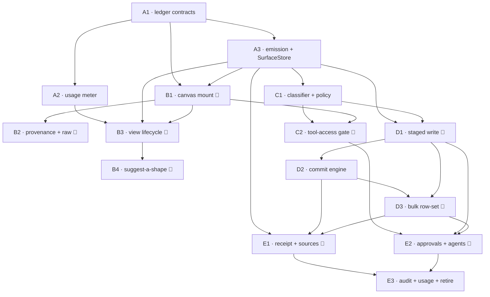

# Generative Surfaces v2 — PRDs per PR

**v0.1 · 2026-07-23 · status: for review.** One PRD = one PR. Waves are sequential;
PRDs inside a wave can run in parallel unless a dependency says otherwise. Requirements
references (FR-_/NFR-_) point at [01-problem-and-requirements.md](01-problem-and-requirements.md);
design references at [02-sdr.md](02-sdr.md).

**Standard DoD (applies to every PRD, in addition to its own):**

- [ ] Unit tests in the owning component's venv/workspace pass; typecheck + build green.
- [ ] Flags off ⇒ byte-identical behavior (no regression to shipped flows).
- [ ] No service-boundary violations (apps→facade only; no cross-`src/` imports).
- [ ] New LLM call sites (if any) go through the UsageMeter seam (from A2 on).
- [ ] Docs: the SDR section touched by the PR is updated if the implementation diverges.

**UI DoD (applies to every UI-touching PRD, marked 🎨):**

- [ ] Built from design-system/chat-surface kit components (no host-app one-off styling).
- [ ] `tools/design-parity/` run against the staged v2 mock region: **0 HIGH drift**.
- [ ] Live desktop smoke of the flow on the real stack (not just tests).

---

## Index

Each PRD is one PR with its own full brief in [`prds/`](prds/). Full scope + binding DoD
live in the linked file; the table is the map. Cross-PRD consistency (event names, flag
names, endpoint paths, consumed↔exposed) is enforced in
[05-consistency-report.md](05-consistency-report.md).

### Wave A — Foundation (no user-visible change)

| PRD                                                    | 🎨  | Goal (one line)                                                                                                                                                           | Depends |
| ------------------------------------------------------ | --- | ------------------------------------------------------------------------------------------------------------------------------------------------------------------------- | ------- |
| [PRD-A1](prds/PRD-A1-ledger-contracts.md)              |     | The SDR §5 ledger vocabulary + entity contracts as one JSON SSOT with py + ts mirrors, ledger-id codec (`r<short>·<seq>`), and a golden fixture — the contract home.      | —       |
| [PRD-A2](prds/PRD-A2-usage-meter.md)                   |     | UsageMeter seam + usage store: every LLM call metered/attributed and (behind `SURFACES_V2`) emits `usage.recorded`; a gate test bans model construction outside the seam. | A1      |
| [PRD-A3](prds/PRD-A3-ledger-emission-surface-store.md) |     | Emit the first four ledger events for existing reads/surfaces + a rebuildable SurfaceStore projection and `GET /v1/agent/runs/{id}/surfaces`.                             | A1      |

### Wave B — Studio read path 🎨

| PRD                                          | 🎨  | Goal (one line)                                                                                                                                                                  | Depends    |
| -------------------------------------------- | --- | -------------------------------------------------------------------------------------------------------------------------------------------------------------------------------- | ---------- |
| [PRD-B1](prds/PRD-B1-canvas-mount.md)        | 🎨  | Mount ThreadCanvas as the Run cockpit canvas; surfaces as named tabs from a client ts fold with fixture-proven parity to the py fold, behind the `surfacesV2` canvas flag.       | A1, A3     |
| [PRD-B2](prds/PRD-B2-provenance-fallback.md) | 🎨  | Provenance footers (op · latency · access class · ledger id · open-in), skeleton/assembling states, and the lossless raw fallback — all ledger-sourced.                          | B1         |
| [PRD-B3](prds/PRD-B3-view-lifecycle.md)      | 🎨  | Explicit per-surface view state: generic-now/shaped-later upgrade, "Keep generic" preference (durable via replay), Regenerate (no re-fetch); shaping-on default for desktop.     | A2, A3, B1 |
| [PRD-B4](prds/PRD-B4-suggest-shape.md)       | 🎨  | "Suggest a shape": user-invited higher-effort shaping via `POST /v1/agent/surfaces/{surface_id}/shape-request`; persists on success, honest on failure, both ledgered + metered. | B3         |

### Wave C — Gates + policy

| PRD                                        | 🎨  | Goal (one line)                                                                                                                                                           | Depends |
| ------------------------------------------ | --- | ------------------------------------------------------------------------------------------------------------------------------------------------------------------------- | ------- |
| [PRD-C1](prds/PRD-C1-classifier-policy.md) |     | Layered fail-closed read/write classification (catalog → annotations → default write) resolved against one Approval Policy + per-connector override stored in backend.    | A3      |
| [PRD-C2](prds/PRD-C2-tool-access-gate.md)  | 🎨  | ToolAccessGate: runs park on missing/expired auth and resume at the same call; write policy chosen at the gate; `gate.opened`/`gate.resolved` + gate card + posture chip. | C1      |

### Wave D — Writes

| PRD                                          | 🎨  | Goal (one line)                                                                                                                                                               | Depends |
| -------------------------------------------- | --- | ----------------------------------------------------------------------------------------------------------------------------------------------------------------------------- | ------- |
| [PRD-D1](prds/PRD-D1-staged-write-engine.md) | 🎨  | The unified staging model, single-artifact: `write.staged`/`revision.added`/`decision.recorded`, rev-pinned approve bar, free-form edit → authorship spans; nothing executes. | A3, C1  |
| [PRD-D2](prds/PRD-D2-commit-engine.md)       |     | CommitEngine: the sole `write.applied` producer — precondition re-check, idempotency claim before side effect, real connector dispatch of exactly the approved rev.           | D1      |
| [PRD-D3](prds/PRD-D3-bulk-rowset.md)         | 🎨  | Row-set writes: per-row diffs + decisions, sticky agent pre-holds, scoped `/apply`, partial-apply outcome, allow-always honoring pre-holds.                                   | D1, D2  |

### Wave E — Accountability + cutover

| PRD                                             | 🎨  | Goal (one line)                                                                                                                                                                           | Depends     |
| ----------------------------------------------- | --- | ----------------------------------------------------------------------------------------------------------------------------------------------------------------------------------------- | ----------- |
| [PRD-E1](prds/PRD-E1-receipt-sources.md)        | 🎨  | Run receipt + Sources as pure ledger folds: stat tiles over attributed per-action rows, emitted at every terminal path; Sources rail grouped by connector.                                | A3, D-wave  |
| [PRD-E2](prds/PRD-E2-approvals-agents-tab.md)   | 🎨  | One cross-run Approvals queue (gates + held drafts + staged row-sets) with jump-to-surface, a "N waiting" chip, and the Agents fleet tab, via `GET /v1/agent/pending-work`.               | C2, D1 (D3) |
| [PRD-E3](prds/PRD-E3-audit-usage-retirement.md) |     | Close the loop: HMAC-chained receipt **export**, `/v1/usage/*` rollups proven for v2 purposes, and retirement of v1 `result["surface"]` + `DraftSurfaceProjector`; flag defaults flip ON. | everything  |

---

## Dependency graph

## Suggested implementation order

Waves are sequential; within a wave the listed PRDs may run in parallel except where an
intra-wave edge above says otherwise.

1. **A1** — lands first; every later wave compiles against its vocabulary.
2. **A2 + A3** — parallel after A1 (A2 has no runtime dependence on A3; both consume A1).
3. **B1** — opens Wave B (needs A1 + A3).
4. **B2 + B3** — parallel after B1 (B3 additionally needs A2/A3 metering + emission).
5. **B4** — after B3 (builds on its ViewDeriver + `ShapingModelResolver`).
6. **C1** — may start as early as A3 lands (parallel with Wave B); no B dependency.
7. **C2** — after C1 (reuses B1's canvas + flag for the gate card).
8. **D1** — after A3 + C1; opens Wave D.
9. **D2** — after D1 (the only legitimate `write.applied` producer).
10. **D3** — after D1 + D2 (row-scopes the same engine).
11. **E1 + E2** — parallel once the D-wave is in (E1 needs D2/D3 for write rows; E2 needs C2 + D1, and D3 for row-sets).
12. **E3** — last: audit-chain export, usage-rollup proof, and the v1 retirement + flag-default flip that ends the compat window.

---

## Phase-2 integration point

Failure-path designs (session task #1, user + designer) land as amendments to C2 (gate
failures), D2 (precondition/apply failures), D3 (partial-apply UX) — the states and
ledger events already exist by construction; Phase 2 styles and words them.
