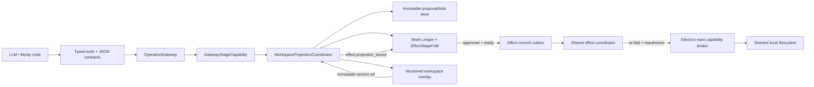
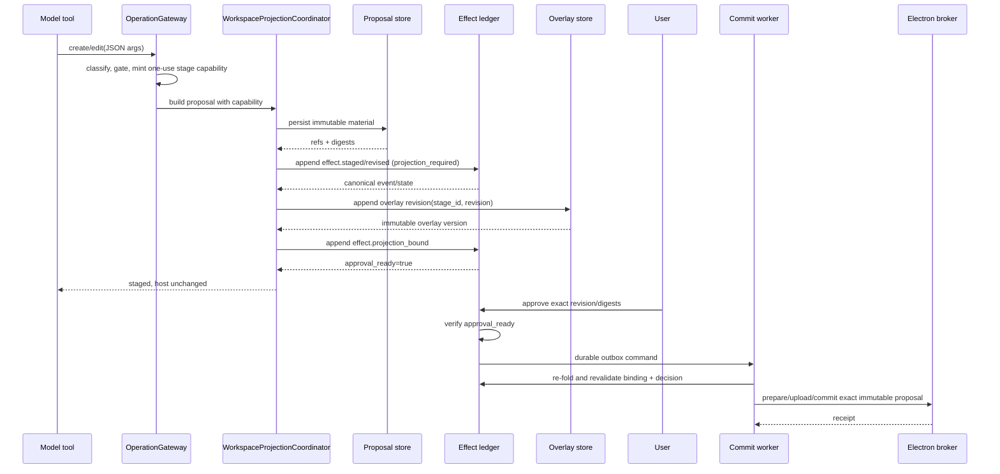
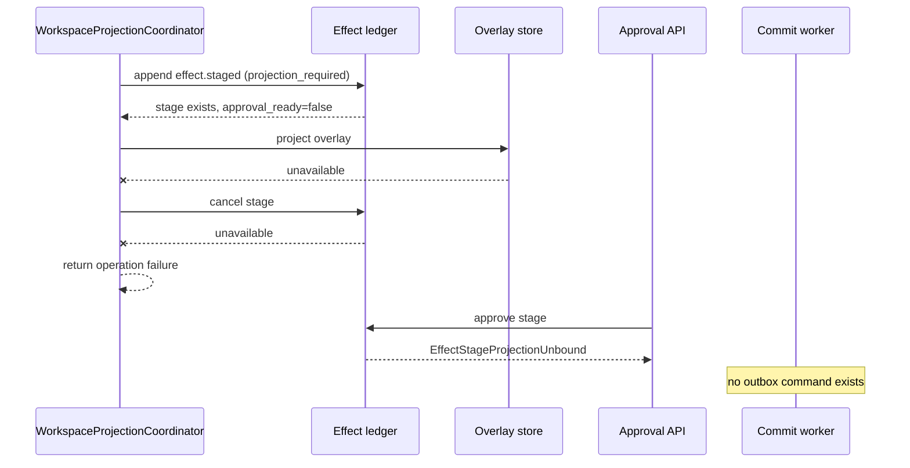

# PRD-371 — Durable workspace projection binding

Status: implemented architecture record; delivered by GitHub PR #371 and follow-up `459c238a`

Scope: workspace proposal assembly and approval readiness

Product wave: no new wave; this corrects the existing workspace/effect architecture

Default posture: filesystem-first, desktop-first, fail closed

## 1. Executive summary

This PRD captured the corrective design used to complete PR #371. The design is
now implemented on `main`; this document remains the architecture and failure-
mode record for the durable workspace projection-binding protocol.

The model does not receive a Python `WorkspaceGatewayBackend`,
`WorkspaceOperationPort`, `asyncio.Queue`, gateway, adapter, overlay store, or
effect outbox. Model execution crosses typed tool or JSON boundaries. Monty
extracts arguments with `args_json()` / `kwargs_json()` and returns JSON values.
The model therefore cannot use Python reflection to walk from a queue into an
actor task frame unless arbitrary trusted worker-process Python execution is
added to the threat model.

We must not claim that an in-process queue, closure, private attribute, or
`__slots__` is a security boundary. We also do not need a new authority service
to address the product-reachable failure.

The defect addressed by the implementation was a distributed assembly gap:

1. immutable proposal material is persisted;
2. `effect.staged` or `effect.revised` is appended;
3. the workspace overlay is projected;
4. the caller reports a reviewable staged change.

Steps 2 and 3 use different durable stores. Before the correction, a stage could
therefore exist after a projection failure. If compensation also failed, the
stage could remain approvable even though its exact current revision was not
represented in the workspace overlay. `EffectStager.stage()` also appended the
stage and then performed a second fallible read; a read failure could hide a
successfully appended stage from the caller.

The correction is a durable readiness marker:

- workspace stages declare that projection binding is required;
- successful overlay projection produces an immutable
  `WorkspaceOverlayVersionRef`;
- a new `effect.projection_bound` event binds that overlay version to the exact
  stage, revision, proposal digest, and target digest;
- the fold, decision service, and commit worker all reject approval/execution
  unless the current revision has a matching binding;
- revision invalidates the previous binding;
- stage creation returns the folded event it just appended rather than requiring
  a second read;
- projection and binding are idempotently recoverable.

This is an event-sourced assembly protocol, not a second execution system.
Actual host-filesystem mutation remains where it already belongs: behind the
Electron main-process capability broker and `WorkspaceAuthorityPort`.

## 2. Problem statement

### 2.1 User-visible invariant

When Studio says a workspace change is ready for review, all of the following
must identify the same immutable revision:

- the canvas/diff;
- the merged workspace overlay used by subsequent model reads;
- the staged proposal;
- the approval decision;
- the outbox command;
- the host effect applied after approval.

The user must never approve a stage whose current revision failed to become the
workspace projection they were meant to review.

### 2.2 Current failure windows

The #371 branch correctly changes proposal construction to:

`plan → persist immutable material → append stage → project overlay`

That order prevents an unstaged visible overlay. It leaves two remaining gaps:

#### Gap A — stage appended, projection not bound

`WorkspaceOperationAdapter.build_proposal_with_capability()` appends or revises a
stage before `_WorkspaceOverlayMutationEngine._project()`. If projection fails,
the adapter attempts a cancellation. `_cancel_safely()` intentionally swallows a
second failure. The durable stage can therefore remain in `HELD`, `PROPOSED`, or
`REVISED`, all of which currently accept an approval.

#### Gap B — append succeeds, state read fails

`EffectStager.stage()` calls `append_stage_event()` and then calls `get_state()`.
If append succeeds and the read fails, the stage exists but the caller cannot
name or compensate it. It is still approvable under the current fold.

### 2.3 Why process isolation is not the correction

The reflection proof against `WorkspaceOperationPort._queue` begins with direct
Python access to a trusted composition object. That access is not available to:

- the LLM;
- Deep Agents filesystem-tool arguments;
- MCP/tool request payloads;
- Monty interpreted code; or
- renderer/spec JSON.

Moving the same assembly protocol into another Python process would add RPC,
deployment, lifecycle, crash recovery, authentication, versioning, and desktop
packaging costs while leaving the real cross-store readiness problem intact.

The existing Electron capability broker is already the process boundary for
actual host effects. It must continue to be used. This PRD does not weaken,
replace, or bypass it.

## 3. Goals and non-goals

### 3.1 Goals

1. A workspace stage is not approvable or executable until its exact current
   revision is durably bound to a retained overlay version.
2. A projection, cancellation, binding, or post-append read failure cannot
   produce an executable stage.
3. Retrying the same operation repairs or completes an interrupted assembly
   without creating a second stage.
4. Revising a proposal invalidates the prior projection binding.
5. Legacy non-workspace effects retain their current behavior.
6. The model-facing boundary remains typed and JSON-only.
7. No new deployable service, database, or host-write path is introduced.

### 3.2 Non-goals

- Treating arbitrary trusted Python running inside `runtime_worker` as hostile.
- Preventing a maintainer with code execution in the worker from introspecting
  process memory.
- Replacing the Electron main-process workspace authority.
- Moving overlay reads or proposal planning over desktop RPC.
- Redesigning the universal effect ledger, outbox, or commit coordinator.
- Adding attribute/import deny lists as a substitute for a capability boundary.

## 4. Threat model

### 4.1 Untrusted inputs

- model text;
- model-selected tool names and JSON arguments;
- Monty source code and JSON inputs/outputs;
- MCP/provider responses;
- connector metadata;
- staged document/file content;
- client-provided stage, revision, and decision identifiers.

### 4.2 Trusted computing base

- runtime composition code;
- `OperationGateway`;
- `GatewayStageCapability`;
- `EffectStager` and the effect fold;
- structural ledger and outbox adapters;
- workspace overlay store;
- immutable proposal/blob stores;
- Electron main capability broker.

Trusted components still validate every untrusted value and fail closed. “Trusted”
does not mean “skip validation”; it means arbitrary Python reflection from that
component is not attributed to the model.

### 4.3 Required model-reachability invariant

No model-visible tool or interpreter result may contain a live Python object that
owns or references:

- `OperationGateway`;
- `WorkspaceOperationAdapter`;
- `WorkspaceOperationPort`;
- an `asyncio.Queue`;
- `WorkspaceOverlayStorePort`;
- `EffectStageLedgerPort`;
- `EffectCommitOutboxPort`; or
- a desktop broker client.

This invariant is tested at the actual tool/interpreter assembly seam. Tests that
directly instantiate a trusted backend and reflect through its private attributes
do not prove model reachability and are not release gates.

## 5. Existing abstractions to reuse

| Existing abstraction                                          | Current purpose                                           | Use in this correction                          |
| ------------------------------------------------------------- | --------------------------------------------------------- | ----------------------------------------------- |
| `OperationGateway`                                            | Canonical classification/gating/invocation                | Keep as the only operation entry                |
| `GatewayStageCapability`                                      | One-use, task-bound authority to construct a proposal     | Keep; no replacement RPC                        |
| `EffectStager`                                                | Append stage/revision/decision and enqueue after approval | Add bind operation and approval guard           |
| `EffectStageFold`                                             | Rebuild authoritative stage state                         | Fold projection binding and fail closed         |
| `EffectCommitOutboxPort`                                      | Durable command after an approved decision                | Keep unchanged; enqueue only after readiness    |
| `WorkspaceOverlayVersionRef`                                  | Opaque immutable overlay version reference                | Persist as the projection binding reference     |
| `OverlayEntry.stage_id/stage_revision`                        | Associate visible entries with a stage revision           | Validate/recover an interrupted binding         |
| `ArtifactBlobStorePort` and workspace proposal store/resolver | Immutable proposal material                               | Reuse for retry/reconciliation                  |
| `WorkspaceOperationPort`                                      | Minimize the object graph exposed to the backend          | Keep as containment, not a security claim       |
| Monty JSON accessors and `PolicyToolInvoker`                  | JSON-only interpreted-code boundary                       | Add reachability canaries here                  |
| `WorkspaceAuthorityPort` / Electron broker                    | Main-process host mutation authority                      | Keep as the only host-write path                |
| shared effect coordinator from PR #374                        | Neutral approved-effect dispatch                          | Add independent readiness check before dispatch |

This design follows patterns already present in the repository:

- `effect.claimed` is appended before a connector/host side effect;
- decisions are digest-pinned before outbox enqueue;
- immutable overlay versions already have a canonical opaque reference;
- actual filesystem commit already crosses the Electron broker;
- all model/interpreter arguments are serialized contracts.

The new binding event is the assembly equivalent of those existing
“persist-before-advance” markers.

## 6. Architecture decision

### 6.1 Stage lifecycle

Workspace stages use the following lifecycle:

```text
proposal material durable
  → effect.staged/revised (projection required)
  → overlay projected with stage_id + revision
  → effect.projection_bound
  → approval eligible
  → effect.decision_recorded(approve)
  → outbox
  → worker re-folds and revalidates binding
  → Electron broker prepare/upload/commit
```

`HELD`, `PROPOSED`, and `REVISED` remain presentation statuses. Approval
eligibility becomes an explicit computed invariant:

```text
approval_ready =
  not projection_required
  OR (
    current_projection_binding exists
    AND binding.revision == current_revision.revision
    AND binding.proposal_digest == current_revision.proposal_digest
    AND binding.target_digest == target_digest
  )
```

### 6.2 Why not add an `ASSEMBLING` status

Readiness is an orthogonal invariant, not a decision status. Adding an
`ASSEMBLING` status would duplicate policy posture and complicate legacy
projection/UI logic. The state exposes `approval_ready` and an optional binding;
the existing status continues to describe policy/decision state.

### 6.3 Why an event, not an overlay lookup during approval

Approval must be replayable from the Work Ledger. Calling the mutable “current
overlay” during `decide()` would:

- make replay non-deterministic;
- couple the universal effect domain to workspace adapters;
- permit later overlay changes to reinterpret an older decision; and
- add another cross-store read in the critical path.

`effect.projection_bound` records the trusted assembly result once. The overlay
reference points to a retained immutable version.

## 7. Contract changes

### 7.1 `effect.staged`

Add one optional field:

```json
{
  "projection_required": true
}
```

Rules:

- omitted/`false` preserves existing behavior;
- the workspace adapter sets it to `true`;
- model payloads cannot set it directly;
- it remains `true` for every revision in that stage.

### 7.2 New event: `effect.projection_bound`

Payload version `v: 1`:

```json
{
  "v": 1,
  "stage_id": "stg_...",
  "revision": 2,
  "projection_ref": "workspace-overlay://runs/run_123/versions/9",
  "proposal_digest": "<sha256>",
  "target_digest": "<sha256>",
  "bound_at": "2026-07-26T12:00:00+00:00"
}
```

Required:

- `v`;
- `stage_id`;
- `revision`;
- `projection_ref`;
- `proposal_digest`;
- `target_digest`;
- `bound_at`.

The event contains no physical path, content bytes, raw arguments, credential,
or mutable “latest” reference.

### 7.3 Domain state

Add:

```python
class EffectProjectionBinding(RuntimeContract):
    revision: int
    projection_ref: str
    proposal_digest: Sha256Hex
    target_digest: Sha256Hex
    bound_at: str
    ledger_id: str

class EffectStageState(RuntimeContract):
    projection_required: bool = False
    projection_binding: EffectProjectionBinding | None = None

    @property
    def approval_ready(self) -> bool: ...
```

For workspace bindings, parse `projection_ref` through
`WorkspaceOverlayVersionRef` before append. The generic effect fold treats it as
an opaque validated reference and does not import the workspace capability.

### 7.4 Compatibility

- Existing events omit `projection_required`; they remain approval eligible.
- Existing effect kinds are unchanged.
- Existing TypeScript clients ignore the additive event until their projector is
  updated.
- No persistence migration is needed because the ledger stores typed JSON events.
- Golden fixtures and Python/TypeScript parity contracts are updated additively.

## 8. Fold and command invariants

### 8.1 Fold behavior

`EffectStageFold`:

1. reads `projection_required` from the initial stage;
2. accepts a binding only when all identifiers/digests match current state;
3. ignores malformed, stale, cross-stage, or wrong-digest binding events;
4. clears `projection_binding` when a valid revision is applied;
5. ignores `approve` decisions when `approval_ready` is false;
6. still permits `reject` and `cancel` while unbound;
7. preserves deterministic replay under event reordering by sequence number.

### 8.2 Service behavior

`EffectStager.decide(APPROVE)` checks `state.approval_ready` before appending the
decision. A typed `EffectStageProjectionUnbound` error is returned on failure.

`EffectStager.decide(REJECT|CANCEL)` remains available so an interrupted stage
can always be closed.

### 8.3 Worker behavior

The shared commit handler independently re-folds the stage and requires:

- approved status;
- exact decision ledger ID;
- exact current revision;
- exact proposal and target digests; and
- `approval_ready`.

This is defense in depth against a forged/stale outbox row and keeps the worker
authoritative even if an API-layer check regresses.

## 9. API and implementation design

### 9.1 `EffectStager.stage()`

Replace the fallible post-append read:

```python
event = await ledger.append_stage_event(...)
state = EffectStageFold.fold((event,))
assert state.scope == scope
return state
```

The append port already returns the canonical persisted event. Folding that event
removes the append-success/read-failure orphan window.

### 9.2 `EffectStager.bind_projection()`

Add:

```python
async def bind_projection(
    *,
    scope: EffectStageScope,
    stage_id: str,
    revision: int,
    projection_ref: str,
    proposal_digest: str,
    target_digest: str,
    actor: EffectActorIdentity,
    idempotency_key: str,
) -> EffectStageState
```

It:

1. loads current state;
2. checks owner/system authority;
3. requires `projection_required`;
4. checks exact revision and digests;
5. validates the opaque reference;
6. appends `effect.projection_bound` idempotently;
7. returns the refolded state.

An identical binding is idempotent. A different binding for the same revision is
rejected; it requires a revision or cancellation.

### 9.3 Workspace assembly coordinator

Keep the useful #371 order and add binding:

```python
stored = proposals.persist(...)
state = stager.stage_or_revise(..., projection_required=True)
projected = mutations.project(
    plan,
    stage_id=state.stage_id,
    stage_revision=state.current_revision.revision,
)
state = stager.bind_projection(
    ...,
    projection_ref=WorkspaceOverlayVersionRef.format(
        run_id=run_id,
        version=projected.manifest.version,
    ),
)
return model_safe_result(state)
```

The adapter returns success only after the binding event is durable.

### 9.4 Idempotent recovery

Introduce a narrow `WorkspaceProjectionCoordinator`, or equivalent methods on the
adapter, with one responsibility: complete a stage/overlay/binding assembly.

Before planning a new mutation, it checks the affected overlay entries:

1. all relevant entries must carry the same `stage_id` and `stage_revision`;
2. the folded stage must have the same `operation_id`;
3. the stage revision/digests must be current;
4. if the stage is unbound but the exact retained manifest is present, append the
   missing binding idempotently and return the existing stage;
5. otherwise run the normal plan/persist/stage/project/bind flow.

This makes retry after “projection succeeded, binding append failed” recover the
same stage instead of attempting a duplicate create.

The proposal store/resolver and retained overlay versions already exist; do not
introduce a new recovery database.

### 9.5 Projection failure

If projection fails:

- attempt a normal `CANCEL` decision for user clarity;
- propagate the operation failure;
- if cancellation also fails, the stage remains unbound and therefore cannot be
  approved, enqueued, claimed, or executed.

Safety no longer depends on compensation succeeding.

## 10. Model-boundary treatment

### 10.1 Keep from #371

- request-local overlay planning;
- durable proposal material before visible projection;
- `GatewayStageCapability`;
- the narrow `WorkspaceOperationPort`;
- no raw overlay mutation API on the Deep Agents backend;
- no raw adapter/gateway returned by model-visible tools.

### 10.2 Change the claim

Document `WorkspaceOperationPort` as object-graph minimization and lifecycle
containment. It is not an authorization or process-security boundary.

Authorization remains:

- typed operation inventory;
- gateway classification and gates;
- one-use `GatewayStageCapability`;
- immutable proposal/stage contracts;
- projection binding;
- exact approval;
- worker revalidation;
- Electron broker authority.

### 10.3 Architecture canaries

Add tests proving:

- every model-visible capability has a descriptor;
- filesystem tools return serializable results only;
- Monty external-call arguments use JSON extraction;
- no model-visible tool result schema contains backend/gateway/store/queue types;
- host builtins remain denied in Monty;
- the Electron broker is the only host-filesystem commit path.

Do not add a release-blocking test whose starting condition is direct Python
access to a trusted backend private attribute.

## 11. Logical view



## 12. Sequence diagrams

### 12.1 Successful create/edit



### 12.2 Projection and compensation both fail



### 12.3 Projection succeeds, binding append fails, retry repairs

```mermaid
sequenceDiagram
    participant C as WorkspaceProjectionCoordinator
    participant L as Effect ledger
    participant O as Overlay store

    C->>L: append effect.staged
    C->>O: project stage/revision
    O-->>C: overlay version 9
    C->>L: append effect.projection_bound
    L--xC: transient write failure
    Note over C,L: visible overlay exists; stage is not approvable
    C->>C: retry same operation_id
    C->>O: inspect exact stage/revision association
    O-->>C: retained version 9
    C->>L: append same binding idempotently
    L-->>C: approval_ready=true
```

## 13. Failure matrix

| Failure                                        | Durable state                             | Visible overlay                     | Approvable              | Host effect    | Recovery                                      |
| ---------------------------------------------- | ----------------------------------------- | ----------------------------------- | ----------------------- | -------------- | --------------------------------------------- |
| proposal persistence fails                     | none                                      | unchanged                           | no                      | no             | retry operation                               |
| stage append fails                             | material only                             | unchanged                           | no                      | no             | retry; content-addressed material is reusable |
| stage append succeeds; former state read fails | canonical stage returned from append fold | unchanged                           | no, binding absent      | no             | continue projection or retry                  |
| overlay projection fails                       | unbound stage, optionally cancelled       | unchanged                           | no                      | no             | retry or cancel                               |
| overlay projection and cancellation fail       | unbound stage                             | unchanged                           | no                      | no             | retry/cancel after ledger recovery            |
| projection succeeds; binding append fails      | unbound stage                             | exact staged overlay                | no                      | no             | idempotent binding recovery                   |
| stale binding event                            | unchanged current stage                   | may show old revision               | no for current revision | no             | project/bind current revision                 |
| revision appended                              | binding reset                             | old projection until new projection | no                      | no             | project/bind new revision                     |
| forged approve event without binding           | fold ignores approval                     | any                                 | no                      | no             | reject/cancel validly                         |
| forged/stale outbox command                    | worker no-op after refold                 | any                                 | n/a                     | no             | audit and discard                             |
| broker unavailable after valid approval        | approved, bound, queued                   | exact revision                      | already decided         | no until retry | existing claim/reconcile protocol             |

## 14. Implementation PR breakdown

### PR 1 — effect projection-binding contract

Files:

- `packages/service-contracts/.../work_ledger.json`
- `packages/service-contracts/.../work_ledger_golden_events.json`
- `packages/api-types/src/ledger.ts`
- `services/ai-backend/src/agent_runtime/surfaces_v2/ledger_models.py`
- `services/ai-backend/src/agent_runtime/effects/contracts.py`
- `services/ai-backend/src/agent_runtime/effects/fold.py`
- `services/ai-backend/src/agent_runtime/effects/staging.py`
- runtime event allow-list/projector files
- effect fold/stager/contract parity tests

Deliverables:

- additive event and payload parity;
- `projection_required`, binding state, and `approval_ready`;
- `bind_projection()`;
- stage append-result fold;
- reject/cancel remain available;
- approval/outbox denied when unbound.

### PR 2 — workspace integration and recovery

Rebase #371 on current `origin/main`, then:

- retain request-local planning and stage capability;
- project with `stage_id` and revision;
- append the exact overlay version binding;
- add idempotent recovery for an already projected, unbound operation;
- make the shared worker refold check explicit;
- reframe the queue-backed port as containment;
- replace object-reflection assertions with model-reachability canaries.

No new service or migration.

## 15. Test plan

### 15.1 Contract/fold tests

- Python ↔ TypeScript event parity includes `effect.projection_bound`.
- Golden replay yields the same binding and `approval_ready`.
- Wrong stage/revision/proposal digest/target digest is ignored.
- Revision clears binding.
- Duplicate identical binding is idempotent.
- Conflicting binding is rejected.
- Legacy stage without `projection_required` behaves unchanged.

### 15.2 Stager tests

- append succeeds while subsequent ledger reads are unavailable: `stage()` still
  returns the canonical initial state.
- unbound workspace approve raises `EffectStageProjectionUnbound`.
- unbound reject/cancel succeeds.
- binding permits exactly one digest-pinned approve/outbox command.
- binding after cancellation is rejected.

### 15.3 Workspace tests

- proposal bytes persist before stage;
- stage persists before overlay;
- binding persists after overlay;
- operation reports success only after binding;
- projection failure + cancellation failure leaves zero approvable/executable
  stages;
- projection success + binding failure leaves a visible but unapprovable stage;
- same `operation_id` retry binds the existing stage, not a new one;
- edit/move/delete/mkdir follow the same invariant;
- new revision cannot reuse the prior binding;
- merged workspace reads show only the bound/current stage association.

### 15.4 Worker tests

- forged unbound approved decision does not dispatch;
- forged outbox row for unbound stage does not claim or call the broker;
- valid bound approval dispatches the exact immutable revision once;
- stale overlay binding never authorizes a newer revision;
- restart/replay preserves the decision.

### 15.5 Reachability tests

- assembled model tool inventory contains only serializable schemas/results;
- Monty has no host object identity in arguments or return values;
- no model-visible filesystem method returns the operation port or backend;
- host commit remains reachable only through `WorkspaceAuthorityPort`.

### 15.6 Regression

- affected full `ai-backend` suite;
- desktop broker/workspace authority suites;
- API typecheck and parity;
- G1 Markdown and G2 CSV lifecycle journeys;
- Studio create → edit → diff → approve → host-write smoke.

## 16. Definition of done

Verified on `origin/main` at `b47e4ee9` on 2026-07-27. Core delivery landed in
PR #371 (`67ba983b`, merge `fa76bfda`); transactional approval revalidation and
canonical cancellation retry landed in follow-up `459c238a`.

- [x] `effect.projection_bound` is in the shared contract, Python, TypeScript,
      golden fixture, and runtime projector.
- [x] Workspace `effect.staged` events require projection binding.
- [x] `EffectStager.stage()` has no post-append state-read dependency.
- [x] The fold cannot reach `APPROVED` for an unbound required revision.
- [x] The API cannot enqueue an unbound approval.
- [x] The worker cannot execute a forged/stale unbound command.
- [x] Every successful workspace proposal returns only after overlay + binding.
- [x] Projection and cancellation can both fail without producing approvable work.
- [x] Projection-success/binding-failure is recoverable with the same
      `operation_id` and stage.
- [x] Revision invalidates the previous binding.
- [x] Legacy non-workspace effect behavior is unchanged.
- [x] Actual host writes still occur only through the Electron broker.
- [x] Model-reachability canaries pass at the real tool/interpreter seams.
- [x] No new deployable service or database migration is introduced.
- [x] #371 was rebased on `origin/main`; focused suites, the affected full suite,
      and CI passed on the merged implementation. The normal current-main
      `ai-backend` suite also passes: 5,367 passed, 127 skipped, 1 deselected.

## 17. Explicitly rejected alternatives

### New workspace-authority Python process

Rejected for this defect. It duplicates a process boundary already present at
Electron main, increases deployment/runtime complexity, and does not make stage
plus overlay writes atomic.

### More attribute/import/reflection deny lists

Rejected. They are brittle and defend a starting condition the model does not
possess.

### Project overlay before stage

Rejected. It can expose an unstaged model-visible mutation if stage persistence
fails.

### Depend on cancellation compensation

Rejected as the safety mechanism. Compensation remains useful for cleanup, but
approval/execution safety derives from the missing binding.

### Query the current overlay during approval

Rejected. It breaks deterministic replay and couples the effect domain to a
mutable workspace adapter.

### Put stage and overlay in one database transaction

Rejected as a universal requirement. The architecture intentionally supports
in-memory, file, PostgreSQL, and desktop-backed stores. The readiness event gives
the same fail-closed semantics without collapsing service/storage boundaries.
