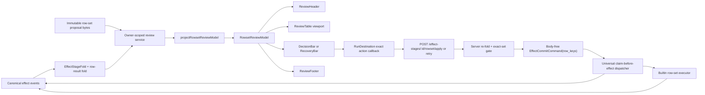

# PRD-12 — Row-set review and exact-recovery architecture

**Status:** implemented  
**Scope:** the canonical v2.1 `effect.staged` lane, its portable contracts,
filesystem/in-memory/Postgres adapters, the shared Run cockpit, and the strict
review-surface recipes. Historic v2 `write.staged` rows remain read-only.

## 1. Outcome

Bulk review must remain usable when the row set is wider or taller than the
available Studio canvas. Headers, provenance, and the apply/recovery decision
must not scroll out of the review boundary. After a partial apply, the only
retry action must name and submit exactly the rows whose latest outcome is
`failed`.

This PR replaces component-local inference with a connector-independent
presentation model and replaces incidental flex/overflow behavior with a
bounded review-surface recipe.

## 2. Problem

The repository contains two row-set paths:

- historic v2 `write.staged`, which has exact row decisions/retry but is
  intentionally quarantined as read-only by the v2.1 compatibility reader;
- canonical v2.1 `effect.staged`, which owns live execution but currently
  exposes only an aggregate effect card and aggregate `partial` outcome.

Re-enabling mutation on historic rows would violate the cutover boundary.
Leaving the canonical lane aggregate-only makes exact recovery impossible.
Therefore row review, row decisions, row outcomes, and retry scope must become
native additive capabilities of the universal effect architecture.

The client also lacks a semantic presentation contract.
`TcStagedTableSurface` and `TcBulkApplyBar` independently inspect the retired
`LedgerStagedWrite`, derive action keys and labels, and assemble incidental
layout. The table and canvas can both scroll, so recovery controls can leave the
visible review boundary.

## 3. Product requirements

### 3.1 Bulk review

1. The surface header, decision/recovery bar, and provenance footer remain
   visible while rows scroll vertically.
2. The table viewport owns horizontal and vertical overflow.
3. Wide content does not compress semantic columns until controls or values
   become unusable; the table scrolls horizontally inside the surface.
4. Column headers remain visible while rows scroll.
5. Approve/hold controls remain keyboard reachable.
6. Long titles, values, notes, and connector names cannot expand the surface
   beyond the Studio canvas.

### 3.2 Partial recovery

1. Partial state exposes `Retry N failed` outside the scrolling row viewport.
2. `N` and the command row keys come from one immutable `RecoveryContext`.
3. The retry callback receives exactly `RecoveryContext.failedRowKeys`.
4. Applied and held rows remain visible as immutable history and are never
   included in the retry command.
5. Zero failed rows disables recovery and never sends an empty command.
6. While a command is pending, the action is disabled and retains its scope.
7. A failed request displays a safe, local recovery notice without changing the
   ledger-derived row state.

## 4. Architecture



The layers have one-way responsibilities:

| Layer                    | Responsibility                                                                                          |
| ------------------------ | ------------------------------------------------------------------------------------------------------- |
| Immutable proposal store | Retain digest-pinned row bodies and diffs; never place them in queue commands.                          |
| Effect fold              | Reconstruct the approved revision, persisted row decisions, attempt outcomes, and retry basis.          |
| Review service           | Authorize owner/run scope, resolve exact proposal bytes, and compute server-authoritative action scope. |
| Presentation projection  | Normalize the owner-scoped review response into display and allowed-command semantics.                  |
| Shared review recipes    | Render bounded layout, rows, diffs, status, provenance, and actions.                                    |
| Run binder               | Send the already-projected command scope and track request-local busy/error state.                      |
| Effect decision service  | Persist digest-pinned row decisions and one action-level approval.                                      |
| Universal dispatcher     | Re-fold, claim, reauthorize, and dispatch only the selected rows.                                       |
| Builtin row-set executor | Return a bounded outcome for every selected row; never dispatch held/applied rows.                      |

## 5. Semantic contracts

### `RowsetReviewModel`

The renderer receives one immutable model containing:

- identity: `stageId`, `surfaceId`, `revision`;
- title and status summary;
- normalized `RowsetReviewRow[]`;
- aggregate counts;
- `RowsetActionContext | null`;
- provenance.

It does not receive connector-specific component types, CSS, or handlers.

### `RowsetReviewRow`

Each row contains:

- stable `rowKey` and display title;
- normalized `DiffValueModel[]`;
- decision state (`approved` or `held`);
- decision source and immutable agent-hold reason;
- apply outcome (`pending`, `applied`, or `failed`);
- `canDecide`.

### `RowsetActionContext`

Discriminated union:

- `apply`: exact current, unapplied, approved row keys;
- `retry_failed`: exact failed row keys after a partial apply.

Both variants contain the stage, revision, immutable row-key tuple, label,
message, pending/disabled state, and accessible description. `RecoveryContext`
is the `retry_failed` variant.

### `ReviewProvenance`

Contains kind, source operation, approval semantics, and ledger id. The
renderer presents it but never derives effect arguments from it.

### Canonical row-set review response

The API returns only owner-scoped semantic review data:

- stage/revision plus proposal and target digests;
- title, connector-neutral rows, diffs, and persisted row decisions;
- latest per-row outcomes folded across attempts;
- exact current action scope and its basis sequence.

It never returns target arguments, physical paths, credentials, proposal
content references, or connector response bodies.

## 6. Shared review recipes

The shared interaction package owns:

- `ReviewSurface`: bounded four-region layout;
- `ReviewHeader`: title, status, and summary;
- `ReviewTable`: the only overflow viewport;
- `DiffValue`: safe old/new rendering;
- `StatusMark`: row outcome and decision status;
- `DecisionBar`: exact action scope and safety copy;
- `RecoveryBar`: recovery specialization of `DecisionBar`;
- `ReviewFooter`: provenance.

The surface layout is:

```text
ReviewSurface (height: 100%; min-height: 0; overflow: hidden)
├── ReviewHeader                       fixed
├── ReviewTable viewport               flex: 1 1 auto; overflow: auto
├── DecisionBar | RecoveryBar          fixed
└── ReviewFooter                       fixed
```

No child may introduce a second vertical page scroller.

## 7. Command contract

Fresh apply sends:

```json
{
  "revision": 4,
  "proposal_digest": "<sha256>",
  "target_digest": "<sha256>",
  "row_keys": ["approved-row-a", "approved-row-c"],
  "basis_sequence_no": 41
}
```

Partial recovery uses the same body at the `/retry` route, with
`row_keys` equal to every and only the latest failed keys.

The keys are copied directly from `model.action.rowKeys`; the click handler
does not re-filter or reconstruct them. The review service independently
re-folds the effect history and proposal, compares the request to the exact
eligible set, and rejects stale/widened/narrowed requests with `409`.

On acceptance it records an `effect.decision_recorded` approval carrying the
same row-key scope and enqueues a body-free `EffectCommitCommand.row_keys`.
The worker compares command scope to the decision again before constructing the
dispatch request. The durable claim includes the selected keys in its semantic
identity, so an idempotent replay cannot be widened.

Each selected row yields one bounded `effect.applied.row_results` item. A retry
gets a fresh idempotency identity derived from the latest failed-result basis;
successful and held rows are absent from the new command and receive zero
traffic.

## 8. State matrix

| State         | Row viewport                            | Row decisions     | Fixed action         | Command scope                         |
| ------------- | --------------------------------------- | ----------------- | -------------------- | ------------------------------------- |
| staged        | Scrollable                              | Persisted per row | `Apply N changes`    | Every current approved, unapplied row |
| apply pending | Scrollable                              | Disabled          | `Applying…` disabled | Frozen prior scope                    |
| partial       | Scrollable; applied/failed/held visible | Disabled          | `Retry N failed`     | Every and only failed row             |
| applied       | Scrollable history                      | Disabled          | None                 | None                                  |
| corrupt       | Scrollable evidence                     | Disabled          | None                 | None                                  |

## 9. Implementation checklist

- [x] T1. Add `RowsetReviewModel`, row, diff, action, recovery, count, and
      provenance contracts.
- [x] T2. Add a pure `projectRowsetReviewModel` with exact action-scope
      derivation and unit tests.
- [x] T3. Add shared `ReviewSurface`, `ReviewHeader`, `ReviewTable`,
      `DiffValue`, `StatusMark`, `DecisionBar`, `RecoveryBar`, and
      `ReviewFooter` recipes.
- [x] T4. Make the table viewport the only scrolling region; constrain wide
      rows with an internal minimum width and sticky column headers.
- [x] T5. Migrate `TcStagedTableSurface` to consume only
      `RowsetReviewModel` plus callbacks.
- [x] T6. Migrate `TcBulkApplyBar` into the model-driven decision/recovery
      recipe without re-deriving row keys.
- [x] T7. Add canonical row-decision and row-result ledger contracts, plus
      body-free row-key scope on effect decisions, commands, dispatch requests,
      and claims.
- [x] T8. Make the builtin row-set executor dispatch only the selected exact
      scope and return one bounded outcome per selected row.
- [x] T9. Add an owner-scoped canonical review service and GET/decision/apply/
      retry routes; resolve proposal bytes through an adapter port.
- [x] T10. Add claim-store persistence for selected keys and row outcomes in
      filesystem, in-memory, and Postgres modes.
- [x] T11. Project the canonical review model in `RunDestination`; add
      request-local busy/error state; submit `model.action.rowKeys` unchanged.
- [x] T12. Add tall/wide/long-content layout tests and keyboard/visibility
      assertions.
- [x] T13. Add exact-retry interaction tests proving successful and held rows
      are absent from the submitted scope.
- [x] T14. Run package/service tests, typechecks, and the final computed-style
      parity command.

## 10. Definition of done

1. A 200-row model remains bounded by the Studio surface height.
2. A wide six-column table scrolls internally without moving the action bar.
3. Header, action/recovery bar, and provenance remain outside the row viewport.
4. Partial recovery displays and submits the same exact failed-key tuple from
   the canonical v2.1 effect lane.
5. Applied and held keys are absent from every recovery request.
6. Busy state prevents repeated client submission; durable claim identity and
   the server exact-set comparison remain the second and third lines of defense.
7. Both hosts consume the shared Run cockpit implementation.
8. Unit, integration, typecheck, and final parity gates pass with no missing,
   HIGH, or MEDIUM findings in bulk-review or bulk-partial.

## 11. Non-goals

- No connector-specific review components.
- No prompt changes; the renderer owns review layout and actions.
- No mutation path for historic v2 `write.staged` rows.
- No proposal bodies, target arguments, or physical paths in commands/events.
- No parallel row executor or second claim protocol; the universal effect
  dispatcher remains the only effect boundary.
- No audit/backlog workstream; failures found while implementing this PRD are
  fixed inside its checklist before completion.

## 12. Completion evidence

| Gate                | Result                                                                                                                                |
| ------------------- | ------------------------------------------------------------------------------------------------------------------------------------- |
| AI-backend          | 5,394 passed, 127 skipped; the repository's pre-existing wall-clock parallelism test measured 0.220076s against a 0.220000s threshold |
| Backend facade      | 360 passed, 1 skipped                                                                                                                 |
| API types           | 114 passed; typecheck passed                                                                                                          |
| Shared chat surface | 3,287 passed; typecheck and changed-file lint passed                                                                                  |
| Web and desktop     | Both typechecks passed; web production build passed                                                                                   |
| Migration contract  | Manifest matches all 24 migrations                                                                                                    |
| Design parity       | 34/34 anchors matched; 0 HIGH and 0 MEDIUM findings in every state                                                                    |
