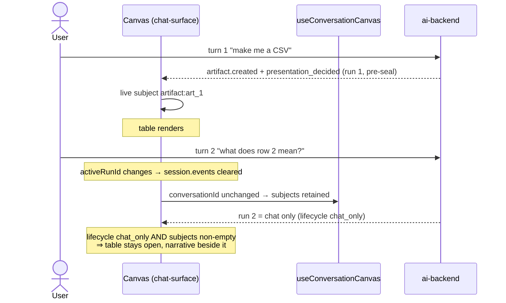
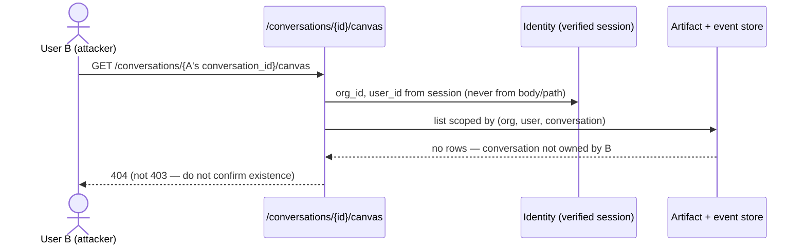
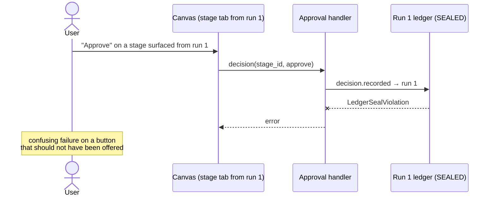

# PRD-02 — Conversation-scoped canvas identity

**Goal:** the Studio canvas keeps its open surface across turns. Operation state
(gates, stages, lifecycle) stays run-scoped; canvas _identity_ becomes
conversation-scoped.

**Closes:** GS-ARCH-05. **Unlocks:** the conversation-scoped artifact listing
GS-ARCH-06 and GS-ARCH-12 both require.
**Depends on:** PR #413 — without it no artifact reaches the canvas at all, and
this defect is unobservable.
**Scope:** `services/ai-backend`, `packages/api-types`, `packages/chat-surface`,
both hosts' binders. Facade passthrough only.

> **Scope grew after risk analysis.** Tracing the flows below surfaced a
> verified defect (Flow B): artifact revisions scope their ledger event to the
> artifact's _original_ run, so a persisted tab is writable but can never
> refresh. Fixing that — attributing a revision to the run the user is acting in
> — is a required part of this PRD, not a follow-up. Estimate moves ~3 → ~5 days.

## The defect

`RunDestination` folds `projectCanvasLifecycle(session.events)`, and
`useRunSession` clears `events` whenever `activeRunId` changes
([useRunSession.ts:311](../../../packages/chat-surface/src/destinations/run/useRunSession.ts)).
The design comment is explicit
([RunDestination.tsx:298](../../../packages/chat-surface/src/destinations/run/RunDestination.tsx)):

> "The run event stream is intentionally run-scoped: binding a new message's run
> replaces `session.events`. The Agents tab, however, is conversation scoped."

So: publish a CSV (turn 1 → table renders), ask "what does row 2 mean?"
(turn 2 → new run, empty events, fold returns `chat_only`) and the canvas
reverts to **"This run completed in chat. No artifact was created."**

That is the exact string PR #413 fixed. This will be reported as a regression of
that fix. It is not — it is the next defect, which #413 made reachable by making
artifacts appear at all.

**Backend gap:** `ArtifactListQuery.run_id` is a required field, so no caller can
ask "what artifacts belong to this conversation?" Both halves need building.

## The precedent

`useConversationSubagentArchive` already solves this exact shape for the Agents
tab: seed from a conversation-scoped archive endpoint, retain live entries,
current stream wins on conflict, reset on **conversation** change (not run), and
surface a load error without discarding live data. This PRD mirrors it rather
than inventing a second pattern.

## Contract

### `GET /v1/agent/conversations/{conversation_id}/canvas`

Canvas subjects for a conversation, newest run first. Mirrors the surfaces
projection's shape so the client folds one vocabulary.

```python
class ConversationCanvasSubject(RuntimeContract):
    subject_key: str          # stable identity: "artifact:<id>" | "surface:<id>"
    kind: Literal["artifact", "surface"]
    subject_id: str
    run_id: str               # provenance; NOT identity
    title: str
    revision: int | None      # artifacts only
    renderer_hint: str        # "artifact-dataset" | surface kind
    last_sequence_no: int     # ordering within its run
    created_at: datetime

class ConversationCanvasResponse(RuntimeContract):
    conversation_id: str
    subjects: tuple[ConversationCanvasSubject, ...]
    next_cursor: SafeCursor | None = None
```

`subject_key` is the identity the client keys tabs on, and is byte-identical to
the key `projectCanvasLifecycle` already produces (`artifact:<id>` /
`surface:<id>`). That is what makes live and archived subjects merge without a
reconciliation table.

### `ArtifactListQuery`

`run_id` becomes optional; add `conversation_id`. Exactly one must be set —
enforced by a model validator, so no caller can accidentally request an unscoped
list.

## Implementation

### Backend (`ai-backend`)

| Area                                               | Change                                                                                                                                                                                                                                                |
| -------------------------------------------------- | ----------------------------------------------------------------------------------------------------------------------------------------------------------------------------------------------------------------------------------------------------- |
| `agent_runtime/artifacts/contracts.py`             | `ArtifactListQuery`: `run_id` optional, add `conversation_id`, validator requiring exactly one                                                                                                                                                        |
| `runtime_adapters/{file,in_memory,postgres}`       | Conversation-scoped artifact listing. The file store indexes by run today — add a conversation index rather than scanning runs                                                                                                                        |
| `agent_runtime/api/conversation_canvas_service.py` | NEW. Fold each run's ledger for canvas subjects and merge across the conversation. Reuses `SurfaceStoreProjection`; artifacts come from the repository, not a re-fold, because `artifact.presentation_decided` is the authority for canvas membership |
| `runtime_api/http/routes.py`                       | Register the route beside `/conversations/{id}/runs`                                                                                                                                                                                                  |

**Tenancy:** the conversation is the scope boundary. Every query is
org+user+conversation scoped; a run id from another conversation must never widen
it. This is a new cross-run read path, so it is a new place tenant isolation can
be got wrong — see §Security.

### Frontend (`chat-surface`)

| File                                        | Change                                                                                                                                                                                                                                                  |
| ------------------------------------------- | ------------------------------------------------------------------------------------------------------------------------------------------------------------------------------------------------------------------------------------------------------- |
| `destinations/run/useConversationCanvas.ts` | NEW. Mirrors `useConversationSubagentArchive`: seed from the endpoint, remember live subjects, merge with **live winning**, reset on `conversationId` (never on `activeRunId`), expose `{subjects, loading, error}`                                     |
| `destinations/run/RunDestination.tsx`       | Tab construction reads merged subjects instead of `displayedCanvasLifecycle.tabs` alone. **Lifecycle stays run-scoped** — `chat_only` / `parked` / `failed` still describe _this_ run. The canvas empty state renders only when the merged set is empty |
| `destinations/run/canvasLifecycle.ts`       | Unchanged. It stays a pure per-run fold; merging is the host's job                                                                                                                                                                                      |

**The core split.** Today one projection answers two questions. After this:

| Question                | Scope        | Source                   |
| ----------------------- | ------------ | ------------------------ |
| What can I open?        | conversation | merged subjects          |
| What is this run doing? | run          | `projectCanvasLifecycle` |

A chat-only turn 2 yields lifecycle `chat_only` **and** a non-empty subject set:
the table stays open, and the run's narrative is reported honestly beside it.

### Remaining GS-ARCH-05 clauses

| Clause                                  | Implementation                                                                                                                                            |
| --------------------------------------- | --------------------------------------------------------------------------------------------------------------------------------------------------------- |
| "tabs have stable IDs/order"            | `subject_key` is the identity; order is `(created_at, subject_key)` — deterministic and independent of arrival, so a re-fetch cannot reshuffle open tabs  |
| "hydration failure recovers in place"   | Fetch failure keeps live subjects and shows a retry affordance on the strip. Never drop an open tab because an archive read failed                        |
| "Focus exposes safe Open/Download/Save" | Focus renders the merged subjects as compact rows with the existing `artifactDownloadPort`. No new authority — same transport-mediated download as Studio |

## User flows and repercussions

**The risk profile changes shape, not just size.** Today a persisted surface is
impossible, so the worst outcome is _losing UI state_ — annoying, data safe.
Once a tab outlives its run, the worst outcome becomes _acting on state from the
wrong run_. That is a different class of bug, and it is why this PRD is larger
than "keep the tab open".

Four flows, traced. Flow B is the one that changes the design.

### Flow A — the fix working (the whole point)



### Flow B — the cross-run revision dead-end ⚠️ **verified, changes the design**

`ArtifactService.append_revision` derives its scope from
`current.artifact.run_id` — the artifact's **original** run, not the run the user
is in. Combined with PR #413's seal, a persisted tab becomes writable but
un-refreshable:

```mermaid
sequenceDiagram
    actor U as User
    participant C as Canvas (tab from run 1)
    participant AS as ArtifactService
    participant L as Run 1 ledger (SEALED)
    participant Q as Outbox / queue bridge

    Note over U,C: user is in run 3; tab shows artifact from run 1 at r1
    U->>C: edit cell → "Save patched revision"
    C->>AS: append_revision(artifact_id, parent_revision=1)
    AS->>AS: CAS ok → r2 committed durably ✅
    AS->>L: artifact.revised → scope = run 1
    L--xAS: LedgerSealViolation (run 1 sealed)
    AS->>AS: _publish_ledger_events swallows (best-effort)
    Q->>L: later republishes as late_causal_recovery amendment
    Note over C: run 3's stream never carries artifact.revised<br/>tab still shows r1 — stale forever

    U->>C: edit again from the stale r1 base
    C->>AS: append_revision(parent_revision=1)
    AS--xC: CAS conflict (current is 2)
    Note over U: dead end: the tab cannot refresh,<br/>and every further edit fails
```

**Data integrity holds** — the CAS on `parent_revision` prevents a lost update,
and the seal prevents a false ledger. But the _user_ is stuck: a surface they can
write to once and never see updated, then a conflict they cannot clear without
reloading the whole conversation.

**Required design change.** An artifact revision caused by a user editing in run
N is _causal in run N_. It must be attributed there, with the artifact's original
run kept as provenance:

| Field                         | Meaning                                                    |
| ----------------------------- | ---------------------------------------------------------- |
| `artifact.run_id`             | **provenance** — the run that first created it (unchanged) |
| revision event's ledger scope | **the acting run** — where the user made the edit          |

So `ArtifactRevisionRequest` gains a required `acting_run_id`, and
`append_revision` scopes its ledger event to that rather than to
`current.artifact.run_id`. The seal then holds naturally: the event is causal in
an open run, lands inside its prefix, and reaches the live stream — so the tab
updates in place.

This is not optional. Without it, PRD-02 ships a surface that is editable and
permanently stale, which is worse than one that disappears.

### Flow C — tenant isolation on a new cross-run read path



Two failure modes to test explicitly, because both are easy to write by accident:

1. scoping the query by `conversation_id` alone, trusting the path parameter;
2. returning 403, which confirms the conversation exists.

Third, subtler: a subject's `run_id` is returned as provenance. A later call must
never accept that `run_id` back as a _scope widener_ — it is display data, not
capability.

### Flow D — a stale gate or stage on a persisted tab

Effect stages and gates are run-scoped operation state. A persisted canvas must
not offer a decision on one:



**Mitigation:** the merged subject set is **read-only for operation state**.
Effect and gate subjects are conversation-scoped for _viewing history_, and their
decision affordances render only when `subject.run_id === session.runId`.
Anything else is a receipt, not a control. This keeps the split honest: identity
is conversation-scoped, authority stays run-scoped.

### Flow E — the scrubber

`displayedCanvasLifecycle` filters events to `sequence_no <= scrubbedSeq` so the
user can replay a run. Merged conversation subjects have no position in _this_
run's sequence, so "scrub to seq 5" has no defined answer for them.

**Decision:** scrubbing narrows only run-scoped state. Conversation subjects stay
mounted, visibly marked as belonging to another run, and their decision
affordances are suppressed by Flow D's rule anyway. The alternative — hiding
prior-run subjects while scrubbing — makes tabs appear and disappear as the
scrubber moves, which is worse.

### What this buys, restated

| Without the Flow B fix                               | With it                                             |
| ---------------------------------------------------- | --------------------------------------------------- |
| Tab persists but never updates                       | Tab updates in place in the acting run              |
| Second edit hits an unclearable CAS conflict         | Normal edit → new revision → live refresh           |
| Revision events pile up as amendments on sealed runs | Revision events are causal and inside a live prefix |

## Edge cases

| Case                                        | Behavior                                                                                                                                              |
| ------------------------------------------- | ----------------------------------------------------------------------------------------------------------------------------------------------------- |
| `conversationId === "new"`                  | Empty set, no fetch. Mirrors the subagent archive                                                                                                     |
| Artifact revised in a later run             | Same `subject_key`, higher revision. Live wins; the tab updates in place rather than duplicating                                                      |
| Artifact deleted / retention-expired        | Excluded server-side (`include_deleted=false`). A tab whose subject vanishes closes with an explicit "no longer available" state, never a blank frame |
| `artifact.presentation_decided != "canvas"` | Excluded. The decision is the authority for canvas membership — same rule the fold applies                                                            |
| Conversation forked                         | Subjects follow the forked conversation id. No inheritance from the parent in v1 — flagged as a follow-up, not silently guessed                       |
| Very long conversation                      | Cursor-paginated, newest first. The strip caps rendered tabs; the cap is logged, never silently truncated                                             |
| `surfacesV2` off                            | Hook returns empty and does not fetch. Byte-identical to today                                                                                        |

## Security

- **Tenant isolation is the main risk.** This is the first cross-run canvas read.
  Every query derives org/user from the verified session; `conversation_id` is
  caller-supplied and therefore untrusted until ownership is proved (Flow C).
- Required test: user B requesting user A's `conversation_id` receives 404
  (not 403 — do not confirm existence), and a run id from another conversation
  cannot widen the result.
- **`run_id` in the response is display provenance, never a capability.** A
  later request must not accept a caller-supplied `run_id` as a scope widener.
- **Authority stays run-scoped** (Flow D). Conversation scope grants _visibility_
  of a subject, never the right to decide on it. Approve/reject/commit render only
  when `subject.run_id === session.runId`.
- `acting_run_id` on a revision is authorization-relevant, not just bookkeeping:
  the server must verify the caller owns that run and that it is non-terminal,
  rather than trusting the client's claim about where it is acting.
- No new content authority. Subjects are metadata; bytes still flow through the
  existing artifact download path with its own checks.
- Retention/legal hold must be honored by the listing, not filtered client-side —
  otherwise held content leaks into a tab strip. See GS-ARCH-12.

## Observability

- `conversation_canvas.subjects_listed` — count + conversation id, for "why is
  the strip empty?" without reading bytes.
- Hydration failures log at `warning` with conversation id and safe reason.

## Tests

1. **Two-turn journey (proves the defect first).** Desktop app: publish a CSV,
   assert the table renders; send a chat-only follow-up; assert the table is
   **still** rendered. Must be written against current `main` and observed
   failing before the fix — this defect's mechanism is verified but its user-facing
   behavior is not yet reproduced.
2. Backend unit: conversation listing returns subjects across runs, newest first,
   excluding non-canvas decisions and deleted artifacts.
3. Backend tenancy: cross-tenant conversation id → 404; foreign run id cannot widen.
4. FE unit: merge prefers live over archived for the same `subject_key`; reset on
   conversation change; **no** reset on run change.
5. FE unit: fetch failure retains live subjects and surfaces retry.
6. FE unit: lifecycle `chat_only` + non-empty subjects ⇒ canvas renders the
   subject, not the empty panel. This is the regression test for the defect.
7. Ordering: identical subject sets produce identical tab order regardless of
   arrival sequence.

## Acceptance criteria

1. A chat-only follow-up preserves the open surface. **GS-ARCH-05 clause 1.**
2. Tabs keep stable IDs and deterministic order across turns and re-fetches.
3. Hydration failure recovers in place; no open tab is dropped on a failed read.
4. Focus exposes Open/Download/Save over the same subjects with no new authority.
5. Run-scoped lifecycle is unchanged: `chat_only`, `parked`, `failed` still
   describe the current run only.
6. Cross-tenant access denied without disclosing existence.
7. The two-turn journey is observed failing pre-fix and passing post-fix, in the
   Desktop app — separate backend and client verification would miss a seam
   defect, which is exactly how PR #413's second bug survived.
8. **Flow B:** editing an artifact surfaced from an earlier run produces a new
   revision whose ledger event lands in the **acting** run's sealed prefix, and
   the open tab updates to that revision live. A second consecutive edit succeeds
   (no CAS dead end).
9. **Flow B, server-side:** `acting_run_id` is verified as owned by the caller and
   non-terminal; a forged or terminal value is refused, never trusted.
10. **Flow D:** a stage or gate subject from another run renders read-only — no
    approve/reject affordance — and no decision request can be issued for it.
11. **Flow E:** scrubbing narrows run-scoped state only; conversation subjects
    stay mounted and do not flicker as the scrubber moves.
