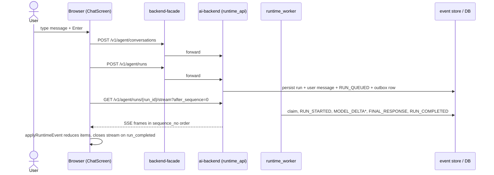

# 01. New conversation, simple text response

> Status: documented · Layers: fe / facade / ai-backend / worker / db · Related: 02

## Trigger

User types in an empty chat composer (no conversation loaded), hits Enter, and gets a streaming assistant text reply.

## Preconditions

- User is authenticated. In dev that means a bearer minted by the W0.1 dev IdP (`POST /v1/dev/identity/mint`) — see `docs/dev-testing.md`. There is no `DEV_AUTH_BYPASS` shortcut.
- `apps/frontend` reaches `backend-facade:8200` for `/v1/*`.
- A `runtime_worker` is running (separate process, or in-process via `RUNTIME_START_IN_PROCESS_WORKER=true`).
- React state: `conversationId === null`, `activeRunId === null`.

## Sequence diagram

## Function trace

1. `submitUserMessage` — [ChatScreen.tsx:407-512](apps/frontend/src/features/chat/ChatScreen.tsx#L407-L512) — guards on empty text and existing `activeRunId`, derives `localMessageId` and `parentMessageId`, drives the rest.
2. `createConversation` — [agentApi.ts:53-71](apps/frontend/src/api/agentApi.ts#L53-L71) — `POST /v1/agent/conversations`; result writes `conversationId` and updates the conversation list.
3. `optimisticUserMessage` — [conversion.ts:67-97](apps/frontend/src/features/chat/chatModel/conversion.ts#L67-L97) — pushes a `kind: "message"`, `role: "user"` ChatItem so the user sees the text immediately.
4. `createRun` — [agentApi.ts:146-176](apps/frontend/src/api/agentApi.ts#L146-L176) — `POST /v1/agent/runs` with the trimmed text as `user_input`, model selection, attachments, content, quote, `parent_message_id`.
5. Facade `create_run` — [app.py:334-347](services/backend-facade/src/backend_facade/app.py#L334-L347) — `FacadeAuthenticator.authenticate_request`, then `forward_json_to_ai` with `identity.scoped_payload(..., include_request_context=True)` so the AI backend gets a server-built `RuntimeRequestContext`, not client-supplied roles.
6. `RuntimeApiRoutes.create_run` — [routes.py:148-169](services/ai-backend/src/runtime_api/http/routes.py#L148-L169) — rejects any `runtime_context` from the wire, rebuilds `org_id`/`user_id`/`request_context` from trusted internal-service headers.
7. `RuntimeApiService.create_run` — [service.py:307-371](services/ai-backend/src/agent_runtime/api/service.py#L307-L371) — `_conversation_for_scope`, then `persistence.create_run_with_user_message` inserts `agent_runs` (status `queued`) plus the user `messages` row.
8. `event_producer.append_api_event(RUN_QUEUED)` — [events.py:81-162](services/ai-backend/src/agent_runtime/api/events.py#L81-L162) — appends `sequence_no=1`, then `set_run_latest_sequence`. Postgres path: `SELECT ... FOR UPDATE` on `agent_runs` then `MAX(sequence_no)+1` ([runtime_api_store.py:1912-2012](services/ai-backend/src/runtime_adapters/postgres/runtime_api_store.py#L1912-L2012)).
9. `queue.enqueue_run` — [service.py:351-360](services/ai-backend/src/agent_runtime/api/service.py#L351-L360) — writes a `RUN_REQUESTED` row into `runtime_outbox_events`. The HTTP response carries `run_id` and `user_message_id`.
10. Frontend resumes — [ChatScreen.tsx:471-488](apps/frontend/src/features/chat/ChatScreen.tsx#L471-L488) — swaps `localMessageId` for `run.user_message_id`, sets `latestSequenceRef.current = 0`, `setActiveRunId`, status `"Queued..."`, then calls `startEventStream(run.run_id, 0)`.
11. `startEventStream` → `streamRunEvents` — [ChatScreen.tsx:252-278](apps/frontend/src/features/chat/ChatScreen.tsx#L252-L278), [agentApi.ts:239-279](apps/frontend/src/api/agentApi.ts#L239-L279) — opens `EventSource("/v1/agent/runs/{run_id}/stream?after_sequence=0&...")` and listens for the `runtime_event` frame name (`SSE_EVENT_NAME` at [agentApi.ts:26](apps/frontend/src/api/agentApi.ts#L26)).
12. Facade `stream_run` — [app.py:465-507](services/backend-facade/src/backend_facade/app.py#L465-L507) — opens an upstream `httpx.AsyncClient` to ai-backend, wraps it in a `StreamingResponse`, tears down both clients on disconnect.
13. `RuntimeApiRoutes.stream_run` → `RuntimeSseAdapter.stream` — [routes.py:201-226](services/ai-backend/src/runtime_api/http/routes.py#L201-L226), [adapter.py:26-70](services/ai-backend/src/runtime_api/sse/adapter.py#L26-L70) — loops: `service.replay_events` for everything `> latest_sequence`, yield each via `format_event`, then `event_bus.wait(run_id, timeout=2.0)`.
14. `RuntimeWorker.run_once` — [loop.py:83-111](services/ai-backend/src/runtime_worker/loop.py#L83-L111) — claims the outbox row under `FOR UPDATE SKIP LOCKED`, capped by `asyncio.Semaphore(max_parallel_runs)` from settings.
15. `RuntimeRunHandler.handle` — [run.py:131-167](services/ai-backend/src/runtime_worker/handlers/run.py#L131-L167) — flips `agent_runs.status` to `RUNNING` (with optimistic version retry), emits `RUN_STARTED` via `_append_lifecycle` ([run.py:887-907](services/ai-backend/src/runtime_worker/handlers/run.py#L887-L907)), audit-logs `run_started`.
16. `astream_runtime` — invoked from `_stream_runtime` at [run.py:187-197](services/ai-backend/src/runtime_worker/handlers/run.py#L187-L197). Each LangGraph chunk goes through `StreamOrchestrator` and produces `MODEL_DELTA` envelopes via `event_producer.append_stream_event`. Each append calls `RuntimeEventBus.notify_sync(run_id)` ([event_bus.py:38-55](services/ai-backend/src/runtime_api/sse/event_bus.py#L38-L55)), waking the SSE adapter immediately.
17. Final assistant message persisted — [run.py:220-254](services/ai-backend/src/runtime_worker/handlers/run.py#L220-L254) — `persistence.append_message(role=ASSISTANT, content_text=final_text, parent_message_id=run.user_message_id)`, then `_append_lifecycle(FINAL_RESPONSE, summary=final_text)` (status="completed" wired in by `_append_lifecycle`).
18. `_append_lifecycle(RUN_COMPLETED)` — [run.py:316-338](services/ai-backend/src/runtime_worker/handlers/run.py#L316-L338) — flips status `COMPLETED`, emits the closing event with metrics payload, audit-logs `run_completed`.
19. Frontend `handleEvent` — [ChatScreen.tsx:216-250](apps/frontend/src/features/chat/ChatScreen.tsx#L216-L250) — for every envelope: bumps `latestSequenceRef`, calls `applyRuntimeEvent(items, event)`. On `run_completed`/`run_cancelled`/`run_failed` it clears the reconnect timer, closes the stream, clears `activeRunId`, fires `refreshConversations()`.
20. Reducer text path — [eventReducer.ts:100-132](apps/frontend/src/features/chat/chatModel/eventReducer.ts#L100-L132) — `MODEL_DELTA` calls `updateAssistantContent` ([contentBuilders.ts:35-73](apps/frontend/src/features/chat/chatModel/contentBuilders.ts#L35-L73)) which lazily creates the assistant `ChatItem` (id = `assistantMessageId(run_id)`) and runs `appendTextDelta` ([contentBuilders.ts:261-278](apps/frontend/src/features/chat/chatModel/contentBuilders.ts#L261-L278)) to grow the trailing text. `FINAL_RESPONSE` runs `reconcileFinalText` to overwrite that trailing text. Terminal `RUN_COMPLETED` triggers `settleAssistantRun` ([contentBuilders.ts:75-98](apps/frontend/src/features/chat/chatModel/contentBuilders.ts#L75-L98)) to lock in `status: { type: "complete" }` and metrics metadata.

## Runtime events emitted

In sequence_no order, all from `RuntimeApiEventType` ([common.py:77-108](services/ai-backend/src/runtime_api/schemas/common.py#L77-L108)):

| seq  | event_type             | activity_kind | UI projection                                                                                  |
| ---- | ---------------------- | ------------- | ---------------------------------------------------------------------------------------------- |
| 1    | `RUN_QUEUED`           | `run`         | status pill "Queued..." (set client-side before the event arrives).                            |
| 2    | `RUN_STARTED`          | `run`         | `setLatestRunEvent` flips footer to a working state.                                           |
| 3    | `MODEL_CALL_STARTED`   | `run`         | TTFT boundary; not visually surfaced for plain text.                                           |
| 4..N | `MODEL_DELTA`          | `message`     | each delta appended to the trailing text part of the assistant `ChatItem`.                     |
| N+1  | `FINAL_RESPONSE`       | `message`     | `reconcileFinalText` overwrites trailing text; status `complete`.                              |
| N+2  | `MODEL_CALL_COMPLETED` | `run`         | metrics-only.                                                                                  |
| N+3  | `RUN_COMPLETED`        | `run`         | terminal — frontend closes the EventSource, clears `activeRunId`, refreshes conversation list. |

`activity_kind` is server-projected by `RuntimeEventPresentationProjector.activity_kind_for` inside `append_event` ([runtime_api_store.py:1940-1946](services/ai-backend/src/runtime_adapters/postgres/runtime_api_store.py#L1940-L1946)).

## State changes

DB rows written:

- `agent_conversations` — one row from `create_conversation`.
- `agent_runs` — one row, status `queued → running → completed`, `latest_sequence_no` advanced monotonically by `set_run_latest_sequence` ([runtime_api_store.py:746-768](services/ai-backend/src/runtime_adapters/postgres/runtime_api_store.py#L746-L768)).
- `messages` — two rows: user turn (from `create_run_with_user_message`) and assistant turn (from `append_message` at [run.py:227-244](services/ai-backend/src/runtime_worker/handlers/run.py#L227-L244)).
- `runtime_events` — one row per emitted event, unique on `(run_id, sequence_no)`.
- `runtime_outbox_events` — one `RUN_REQUESTED` row, claimed and marked complete ([loop.py:160-162](services/ai-backend/src/runtime_worker/loop.py#L160-L162)).

Audit log entries (via `persistence.write_audit_log`):

- `run_created` — [service.py:333-344](services/ai-backend/src/agent_runtime/api/service.py#L333-L344).
- `run_started`, `run_completed` — `WorkerAuditEmitter` at [run.py:167](services/ai-backend/src/runtime_worker/handlers/run.py#L167) and [run.py:335-338](services/ai-backend/src/runtime_worker/handlers/run.py#L335-L338).

Frontend setters/refs:

- `setStatus`, `setConversationId`, `setConversations`, `setItems`, `setActiveRunId`, `setLatestRunEvent`.
- Refs: `latestSequenceRef` (reset to 0, advanced per event), `activeRunUserMessageIdsRef` (set on createRun, deleted on terminal), `streamRef` (set/closed), `reconnectTimeoutRef` (defensive only on the happy path).

## Edge cases handled

- Empty / whitespace input — short-circuit at [ChatScreen.tsx:412-415](apps/frontend/src/features/chat/ChatScreen.tsx#L412-L415).
- Re-entry while a run is active — same guard rejects new submissions until `activeRunId` clears.
- `createConversation` / `createRun` rejection — `try/catch` at [ChatScreen.tsx:490-501](apps/frontend/src/features/chat/ChatScreen.tsx#L490-L501) appends an error `kind: "status"` ChatItem and resets status.
- Malformed SSE payload — `RuntimeStreamProtocolError` ([agentApi.ts:32-51](apps/frontend/src/api/agentApi.ts#L32-L51)) surfaces the error type without leaking the raw data.
- Concurrent appenders for one run — serialized by `SELECT ... FOR UPDATE` on `agent_runs`, with `UNIQUE (run_id, sequence_no)` as the backstop ([runtime_api_store.py:1912-1922](services/ai-backend/src/runtime_adapters/postgres/runtime_api_store.py#L1912-L1922)).

## Known gaps / TODOs

- The optimistic user-message swap relies on matching `localMessageId` exactly; navigating away mid-flight can strand the optimistic row with its local id.
- If `update_run_status(COMPLETED)` succeeds but the subsequent `_append_lifecycle(RUN_COMPLETED)` fails, the run is `completed` in DB without a terminal event, and the SSE adapter only exits via the next replay seeing `replay.run_status in TERMINAL_RUN_STATUSES` ([adapter.py:51-54](services/ai-backend/src/runtime_api/sse/adapter.py#L51-L54)).
- `MODEL_CALL_STARTED` / `MODEL_CALL_COMPLETED` are persisted but not currently surfaced in the UI.

## References

- [apps/frontend/src/features/chat/ChatScreen.tsx](apps/frontend/src/features/chat/ChatScreen.tsx)
- [apps/frontend/src/api/agentApi.ts](apps/frontend/src/api/agentApi.ts)
- [apps/frontend/src/features/chat/chatModel/eventReducer.ts](apps/frontend/src/features/chat/chatModel/eventReducer.ts)
- [apps/frontend/src/features/chat/chatModel/contentBuilders.ts](apps/frontend/src/features/chat/chatModel/contentBuilders.ts)
- [apps/frontend/src/features/chat/chatModel/conversion.ts](apps/frontend/src/features/chat/chatModel/conversion.ts)
- [services/backend-facade/src/backend_facade/app.py](services/backend-facade/src/backend_facade/app.py)
- [services/ai-backend/src/runtime_api/http/routes.py](services/ai-backend/src/runtime_api/http/routes.py)
- [services/ai-backend/src/runtime_api/sse/adapter.py](services/ai-backend/src/runtime_api/sse/adapter.py)
- [services/ai-backend/src/runtime_api/sse/event_bus.py](services/ai-backend/src/runtime_api/sse/event_bus.py)
- [services/ai-backend/src/agent_runtime/api/service.py](services/ai-backend/src/agent_runtime/api/service.py)
- [services/ai-backend/src/agent_runtime/api/events.py](services/ai-backend/src/agent_runtime/api/events.py)
- [services/ai-backend/src/runtime_worker/loop.py](services/ai-backend/src/runtime_worker/loop.py)
- [services/ai-backend/src/runtime_worker/handlers/run.py](services/ai-backend/src/runtime_worker/handlers/run.py)
- [services/ai-backend/src/runtime_adapters/postgres/runtime_api_store.py](services/ai-backend/src/runtime_adapters/postgres/runtime_api_store.py)
- [services/ai-backend/src/runtime_api/schemas/common.py](services/ai-backend/src/runtime_api/schemas/common.py)
