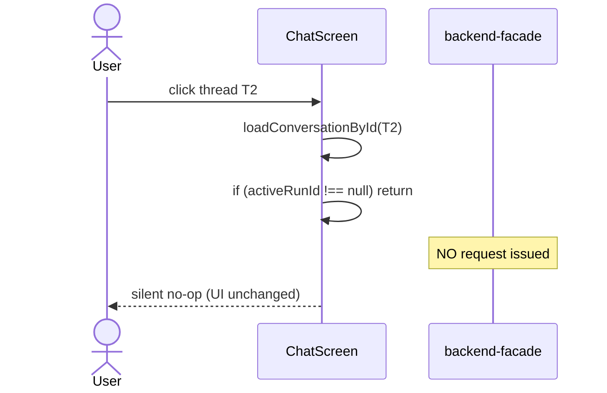

# 04. Switching conversation while a run is in-flight

> Status: documented · Layers: Frontend (state-only) · Related: 03, 12

## Trigger

User clicks a different thread in the thread list (`onSwitchToThread`) while `activeRunId !== null`. This is the _defensive_ counterpart to [03](03-new-thread-while-interrupt-active.md): rather than dropping the active run, the handler refuses the switch outright — silently.

## Preconditions

- `conversationId !== null` and `activeRunId !== null`.
- `streamRef.current` is typically an open `EventSource`, but the guard does not check this — only `activeRunId`.
- The target conversation differs from `conversationId`.

## Sequence diagram

## Function trace

1. `threadListAdapter.onSwitchToThread` — [ChatScreen.tsx:747](../../apps/frontend/src/features/chat/ChatScreen.tsx#L747) — Assistant-UI passes the clicked thread id to `loadConversationById`.
2. `loadConversationById` — [ChatScreen.tsx:380-405](../../apps/frontend/src/features/chat/ChatScreen.tsx#L380-L405).
   1. **Guard** at [L382-384](../../apps/frontend/src/features/chat/ChatScreen.tsx#L382-L384): `if (activeRunId !== null) return;` — early exit, no status change, no toast, no awaited promise.
   2. (only when guard passes) `setStatus("Opening conversation...")`.
   3. `Promise.all([getConversation, loadHistoryItems])` ([L387-390](../../apps/frontend/src/features/chat/ChatScreen.tsx#L387-L390)) — parallel fetch.
3. `loadHistoryItems` — [ChatScreen.tsx:136-153](../../apps/frontend/src/features/chat/ChatScreen.tsx#L136-L153) — `listMessages` then `replayEventsForMessages` (per-run `replayRunEvents` in parallel, [L973-998](../../apps/frontend/src/features/chat/ChatScreen.tsx#L973-L998)). Returns `{ items, replayFailed, latestSequenceByRunId }`.
4. `messagesToChatItems(messages, eventsByRunId)` — invoked at [L147](../../apps/frontend/src/features/chat/ChatScreen.tsx#L147); rebuilds `ChatItem[]` by replaying every per-run event sequence through the **same** `applyRuntimeEvent` reducer used by the streaming path ([chatModel/eventReducer.ts](../../apps/frontend/src/features/chat/chatModel/eventReducer.ts)) — idempotent on `sequence_no`, so replay yields the same shape as live streaming.
5. State commit ([L391-399](../../apps/frontend/src/features/chat/ChatScreen.tsx#L391-L399)): `setConversationId`, `upsertConversation`, `latestReplaySequenceByRunRef.current = …`, `setItems`, `setLatestRunEvent(null)`, `setShowConnectorSuggestions(false)`, `setStatus(history.replayFailed ? historyReplayWarning : "Ready")`.

## Runtime events emitted

_(none — flow is FE-only.)_

When the guard fires, no HTTP requests are issued at all. When the guard passes, only read-only fetches go out (`GET /v1/agent/conversations/{id}`, `GET .../messages`, `GET /v1/agent/runs/{run_id}/events` per distinct run); no events are produced.

## State changes

### Guarded path (active run present)

- **Nothing.** Returns at [L383](../../apps/frontend/src/features/chat/ChatScreen.tsx#L383) before any state setter or fetch. `streamRef`, `activeRunId`, `conversationId`, `items`, all refs untouched.
- The thread-list highlight does not move because `threadListAdapter.threadId = conversationId ?? undefined` ([L742](../../apps/frontend/src/features/chat/ChatScreen.tsx#L742)) re-derives from `conversationId`. Visual state stays consistent — but no toast or status flash explains what happened.

### Unguarded path (reference — when no active run)

- `setStatus("Opening conversation...")` → `"Ready"` (or `historyReplayWarning` if any per-run replay failed).
- `setConversationId(nextConversationId)`, `setConversations(upsertConversation(...))`, `setItems(history.items)`, `setLatestRunEvent(null)`, `setShowConnectorSuggestions(false)`.
- `latestReplaySequenceByRunRef.current = history.latestSequenceByRunId` ([L395](../../apps/frontend/src/features/chat/ChatScreen.tsx#L395)) — used by the auto-attach `useEffect` at [L296-297](../../apps/frontend/src/features/chat/ChatScreen.tsx#L296-L297) to seed `latestSequenceRef` so a re-attached SSE resumes with `?after_sequence=N`.

DB / network calls explicitly **not** made: no `cancelRun`, no `decideApproval`, no run creation. The previous conversation's `streamRef` / `activeRunId` are not touched even on the unguarded path — but in practice that path is only reached when `activeRunId === null`, so there's no stream to clean up.

## Edge cases handled

- **Active run.** Silent return; UI unchanged.
- **Same-thread click.** Not guarded; falls through to fetch + replace. Cosmetic flicker only.
- **Per-run replay failure.** `replayEventsForMessages` ([L973-998](../../apps/frontend/src/features/chat/ChatScreen.tsx#L973-L998)) wraps each `replayRunEvents` in try/catch, sets aggregate `replayFailed = true` and **swallows the per-run error**. Drives `setStatus("History loaded; some activity could not be restored.")` ([L1404-1405](../../apps/frontend/src/features/chat/ChatScreen.tsx#L1404-L1405)).
- **Top-level fetch failure** (`listMessages` / `getConversation` reject). Caught at [L400-402](../../apps/frontend/src/features/chat/ChatScreen.tsx#L400-L402); status flips to `errorMessage(err, "Could not open conversation")`. `conversationId` and `items` retain prior values — user stays on the previous thread but sees an error string.
- **Pending-action on loaded thread.** After `setItems`, the `useEffect` at [L280-301](../../apps/frontend/src/features/chat/ChatScreen.tsx#L280-L301) checks `pendingActionRunId(items)`; if the loaded thread itself has an unresolved approval/MCP-auth, it auto-sets `activeRunId` and re-attaches the SSE with `?after_sequence=` from `latestReplaySequenceByRunRef`.

## Known gaps / TODOs

- **Silent rejection.** The guard returns without surfacing why. No toast, no disabled state on thread rows, no cursor change. This is the single biggest UX gap of the chat surface.
  Fix: (a) disable thread rows in `threadListAdapter` while `activeRunId !== null`; or (b) `setStatus("Finish or cancel the running message before switching threads.")`; or (c) confirm-and-cancel modal that calls `cancelRun` then proceeds.
- **Race window.** If `run_completed` arrives in the same React batch as the click, `activeRunId` may still be its prior non-null value when the guard reads it; the click is rejected, then `setActiveRunId(null)` lands a tick later. User must click again — indistinguishable from a frozen UI.
- **Per-run replay errors lost.** `replayEventsForMessages` records only an aggregate `replayFailed` boolean — debugging "which run is missing events" requires devtools. Capture per-run error and surface in dev mode.
- **No abort on rapid switching.** Two fast clicks fire two `loadConversationById` invocations; whichever resolves last wins regardless of intent. Use an `AbortController` keyed to the click, or the same `cancelled` closure pattern from the initial-load `useEffect` at [L156-208](../../apps/frontend/src/features/chat/ChatScreen.tsx#L156-L208).
- **`historyReplayWarning` is sticky.** Stays until the next status setter overwrites it. A user can be left looking at the warning indefinitely on a healthy thread.
- **Same-thread re-click.** No guard against `nextConversationId === conversationId`. Currently does a full re-fetch + `setItems` replace.

## References

- Handler: [ChatScreen.tsx:380-405](../../apps/frontend/src/features/chat/ChatScreen.tsx#L380-L405)
- Wired via: [ChatScreen.tsx:741-748](../../apps/frontend/src/features/chat/ChatScreen.tsx#L741-L748)
- History loader: [ChatScreen.tsx:136-153](../../apps/frontend/src/features/chat/ChatScreen.tsx#L136-L153)
- Replay primitive: [ChatScreen.tsx:973-998](../../apps/frontend/src/features/chat/ChatScreen.tsx#L973-L998)
- Idempotent reducer: [chatModel/eventReducer.ts](../../apps/frontend/src/features/chat/chatModel/eventReducer.ts)
- Auto-attach to pending interrupt after load: [ChatScreen.tsx:280-301](../../apps/frontend/src/features/chat/ChatScreen.tsx#L280-L301)
- Related: [03 — New thread while interrupt active](03-new-thread-while-interrupt-active.md), [12 — Stream disconnect and resume](12-stream-disconnect-and-resume.md)
