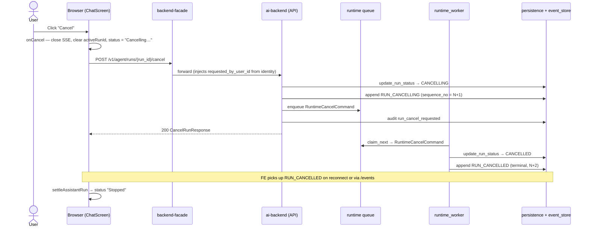

# 05. Cancel a run mid-stream

> Status: documented · Layers: fe / facade / ai-backend / db · Related: 03, 04, 06

## Trigger

User clicks **Cancel** in the chat composer while the assistant is streaming (status badge shows `Working…`).

## Preconditions

- A run exists with `status ∈ {queued, running, waiting_for_approval}` and `activeRunId` is non-null on the client.
- The SSE stream `/v1/agent/runs/{run_id}/stream` is open or paused for reconnect.
- Cancellation is best-effort; the worker drains via cooperative state checks rather than a hard kill signal.

## Sequence diagram

## Function trace

1. `onCancel` — [ChatScreen.tsx:537-551](../../apps/frontend/src/features/chat/ChatScreen.tsx#L537-L551) — guards on `activeRunId`, calls `cancelRun`, clears the reconnect timer, closes `streamRef.current`, drops `activeRunId`, sets status `Cancelling…`.
2. `cancelRun` — [agentApi.ts:178-191](../../apps/frontend/src/api/agentApi.ts#L178-L191) — `httpPostQuery` to `/v1/agent/runs/{runId}/cancel` with `CancelRunRequest{ requested_by_user_id, reason: "Cancelled from web chat" }`.
3. Facade `cancel_run` — [backend_facade/app.py:509-523](../../services/backend-facade/src/backend_facade/app.py#L509-L523) — authenticates, then forwards to ai-backend overwriting `requested_by_user_id` with the verified `identity.user_id` (caller-supplied identity is untrusted).
4. AI-backend route `cancel_run` — [runtime_api/http/routes.py:228-244](../../services/ai-backend/src/runtime_api/http/routes.py#L228-L244) — re-derives `(org_id, user_id)` via `scoped_identity`, hands off to the API service.
5. `RuntimeApiService.cancel_run` — [agent_runtime/api/service.py:442-510](../../services/ai-backend/src/agent_runtime/api/service.py#L442-L510) — loads the run, asserts `requested_by_user_id == user_id` (else `403`), short-circuits if terminal, otherwise transitions run → `CANCELLING`, appends `RUN_CANCELLING`, enqueues `RuntimeCancelCommand`, writes `run_cancel_requested` audit row with `metadata={reason}`.
6. `RuntimeCancelCommand` shape — [runtime_api/schemas/commands.py:27-35](../../services/ai-backend/src/runtime_api/schemas/commands.py#L27-L35).
7. Worker dispatch — [runtime_worker/loop.py:164-182](../../services/ai-backend/src/runtime_worker/loop.py#L164-L182) — `command_type == RUN_CANCEL_REQUESTED` routes to `cancel_handler.handle`.
8. `RuntimeCancelHandler.handle` — [runtime_worker/handlers/cancel.py:38-58](../../services/ai-backend/src/runtime_worker/handlers/cancel.py#L38-L58) — re-validates user, transitions run → `CANCELLED` via `with_optimistic_retry`, appends terminal `RUN_CANCELLED` with `payload={reason}`.
9. SSE delivery — `applyRuntimeEvent` routes the terminal event through `isTerminalRunEvent` ([eventReducer.ts:66-81](../../apps/frontend/src/features/chat/chatModel/eventReducer.ts#L66-L81)) → `settleAssistantRun` ([contentBuilders.ts:75-98](../../apps/frontend/src/features/chat/chatModel/contentBuilders.ts#L75-L98)) with `statusFromRuntimeEvent` returning `{ type: "incomplete", reason: "cancelled" }` ([status.ts:62-64](../../apps/frontend/src/features/chat/chatModel/status.ts#L62-L64)).

## Runtime events emitted

| Sequence | Event type       | Activity kind | Payload highlights                             |
| -------- | ---------------- | ------------- | ---------------------------------------------- |
| N+1      | `run_cancelling` | `run`         | `message`, `reason`                            |
| N+2      | `run_cancelled`  | `run`         | `reason` (terminal — `run_status = cancelled`) |

## State changes

- **Persistence**: `run.status: running|queued|waiting_for_approval → cancelling → cancelled`. Two events with monotonic `sequence_no`.
- **Queue**: one `RuntimeCancelCommand` enqueued by the API, marked complete by the worker after `RUN_CANCELLED`.
- **Audit log**: one `run_cancel_requested` record (`outcome: success`, `metadata.reason`).
- **React state**: `onCancel` clears `reconnectTimeoutRef`, closes `streamRef`, sets `activeRunId = null`, `latestRunEvent = null`, status `Cancelling…`. On terminal event, `settleAssistantRun` sets the assistant message status to `{ type: "incomplete", reason: "cancelled" }`.

## Edge cases handled

- **Cancel against a terminal run** — short-circuits at [service.py:461-467](../../services/ai-backend/src/agent_runtime/api/service.py#L461-L467); returns existing status, no event emitted, no command enqueued, no audit row. Idempotent.
- **Double-cancel before worker pickup** — re-cancel against `CANCELLING` skips re-emit and re-enqueue ([service.py:468-491](../../services/ai-backend/src/agent_runtime/api/service.py#L468-L491)); just echoes status.
- **Wrong user cancels someone else's run** — API rejects `403 PERMISSION_DENIED`. Handler also re-checks and silently drops mismatched commands ([cancel.py:44-45](../../services/ai-backend/src/runtime_worker/handlers/cancel.py#L44-L45)).
- **Worker crashes between RUN_CANCELLING and RUN_CANCELLED** — queue lock expires; another worker reclaims the command. `update_run_status` to `CANCELLED` is idempotent through `with_optimistic_retry`.
- **Stream mid-flight when cancel returns** — FE proactively closes the EventSource so the user sees no more deltas. Terminal event is picked up on next reconnect or via `replayRunEvents` on conversation reload.
- **Cancel during `waiting_for_approval`** — same path runs; the pending approval/MCP-auth UI part is settled by `settleAssistantRun` overwriting status. The DB approval row stays `pending` (see gap below).

## Known gaps / TODOs

- Cancellation is **cooperative**, not preemptive. The run handler has no signal channel that aborts an in-flight LLM/tool call; the cancel command flips the run status and emits the terminal event but does not raise into the executing graph. A long-running MCP tool started before cancel keeps running on the worker until it returns or times out. The `RuntimeCancellationSignal` mechanism described in earlier design notes is not yet implemented.
- A cancel during `waiting_for_approval` does not transition the underlying `ApprovalRequest` row out of `pending`. A late approval decision is silently effective on the row but not on the run.
- Audit uses `outcome: success` for the _request_. There is no paired `run_cancel_completed` audit record — auditors must read the `RUN_CANCELLED` event to confirm completion.

## References

- `CancelRunRequest`/`CancelRunResponse` in [packages/api-types/src](../../packages/api-types/src).
- Run-status enum: [runtime_api/schemas/common.py:34-44](../../services/ai-backend/src/runtime_api/schemas/common.py#L34-L44).
- Persistence event-type constants: [agent_runtime/persistence/constants.py](../../services/ai-backend/src/agent_runtime/persistence/constants.py).
