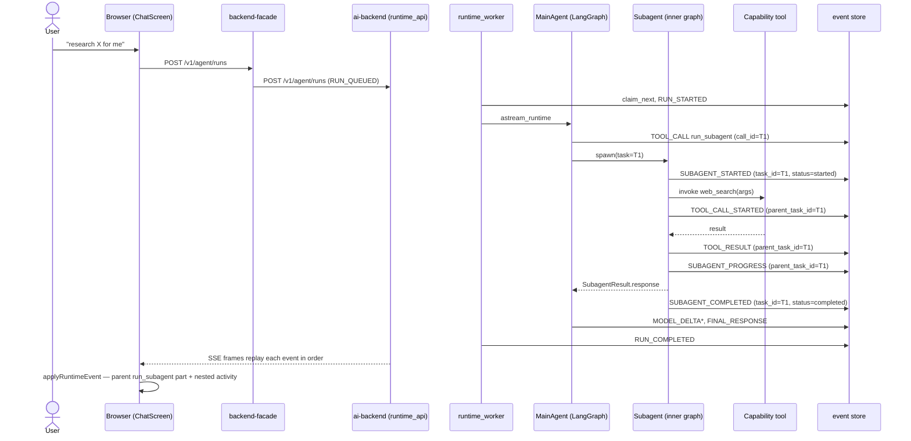

# 07. Single subagent that calls one tool

> Status: documented · Layers: fe / facade / ai-backend / worker / db · Related: 01, 08

## Trigger

User asks something the supervisor decides to delegate, e.g. "research X for me and summarize it." The main agent emits a single `run_subagent` tool call, the spawned subagent runs its inner LangGraph, calls one capability tool (e.g. `web_search`), then returns. The frontend renders one nested activity card under the parent `run_subagent` tool-call part.

## Preconditions

- A run is already created and the SSE stream is open at some `after_sequence=N` (see [01-new-conversation-simple.md](01-new-conversation-simple.md) for the run-creation handshake).
- The active `org_id` / `user_id` has at least one subagent definition resolvable via `DynamicSubagentCatalog.resolve_subagent` ([runner.py:102](services/ai-backend/src/agent_runtime/delegation/subagents/runner.py#L102)) and at least one tool resolvable through the capability middleware that the subagent's definition allow-lists.
- `RUNTIME_STORE_BACKEND` selects an event store that preserves monotonic per-run `sequence_no` (in-memory or Postgres). The Postgres path takes `SELECT ... FOR UPDATE` on `agent_runs` while computing the next sequence so concurrent subagent + supervisor appends never collide.
- Frontend `applyRuntimeEvent` reducer is wired ([eventReducer.ts:38-160](apps/frontend/src/features/chat/chatModel/eventReducer.ts#L38-L160)). The reducer routes by `event.activity_kind` and the `event.parent_task_id` discriminator.

## Sequence diagram

## Function trace

1. `RuntimeRunHandler.handle` — [run.py:131-167](services/ai-backend/src/runtime_worker/handlers/run.py#L131-L167) — claims the queued run, flips status to `RUNNING`, emits `RUN_STARTED`, then drives `astream_runtime` to consume LangGraph stream chunks.
2. `StreamOrchestrator` event normalization — [stream_events.py:60-200](services/ai-backend/src/runtime_worker/stream_events.py#L60-L200) — for each LangGraph chunk, derives `StreamEventSource`, resolves `parent_task_id` from the active subagent namespace (`namespace.subagent_task_id`, line 114), and produces a `StreamEvent` for the producer to append.
3. Supervisor decides to delegate — the main agent emits a `tool_call` whose name is `run_subagent` and whose arguments include the target subagent name + objective. The orchestrator sets `source=StreamEventSource.AGENT`, `event_type=StreamEventType.TOOL_CALL`, `parent_task_id=None`. The producer projects this through `RuntimeEventPresentationProjector.event_type_for_stream_event` ([events.py:80-81](services/ai-backend/src/runtime_api/schemas/events.py#L80-L81)) to `TOOL_CALL_STARTED` with `activity_kind=tool` and `span_id = payload.call_id`.
4. `AsyncSubagentLifecycle.start` — [runner.py:93-155](services/ai-backend/src/agent_runtime/delegation/subagents/runner.py#L93-L155) — resolves the definition, checks `count_active(definition.name) < concurrency_limit`, calls `runner.start(definition, task)` to launch the inner graph, persists an `AsyncTaskState` with a fresh `task_id` (the same id surfaces as `parent_task_id` on every event the subagent then emits).
5. `SubagentHandoffBuilder.build_task` — [handoff.py:20-54](services/ai-backend/src/agent_runtime/delegation/subagents/handoff.py#L20-L54) — narrows tools/skills to the intersection of `requested ∩ definition.tools`. Raw chat history is intentionally **not** copied into `SubagentTask` (`SubagentHandoffPolicy.ignore_raw_history`, line 76).
6. `SUBAGENT_STARTED` projection — `StreamOrchestrator` emits a lifecycle event for the subagent. The projector's `_subagent_event_type` ([events.py:262-268](services/ai-backend/src/runtime_api/schemas/events.py#L262-L268)) maps `status=started` → `RuntimeApiEventType.SUBAGENT_STARTED`. `presentation_fields` ([events.py:122-171](services/ai-backend/src/runtime_api/schemas/events.py#L122-L171)) sets `task_id = payload.task_id`, `span_id = task_id` (via `_span_id_for`, line 308-314), `parent_span_id = parent_task_id` (line 150-154), `activity_kind = SUBAGENT`.
7. Subagent invokes its inner tool — the inner graph emits `TOOL_CALL`. The orchestrator stamps `parent_task_id = T1` (from the active namespace, line 114), so the projector classifies the event as `TOOL_CALL_STARTED` with `activity_kind=tool` **and** `parent_task_id=T1`. This is the discriminator the frontend uses to nest the tool card under the parent `run_subagent` part.
8. Tool returns — `TOOL_RESULT` is appended with the same `parent_task_id`. The projector sets `status=completed` and `display_title=Messages.Event.tool_result_title(tool_name)` ([events.py:338-341](services/ai-backend/src/runtime_api/schemas/events.py#L338-L341)).
9. Subagent progress lines — when the subagent emits intermediate `CUSTOM` / `PROGRESS` events from `StreamEventSource.SUBAGENT`, the projector folds them into `SUBAGENT_PROGRESS` ([events.py:89-97](services/ai-backend/src/runtime_api/schemas/events.py#L89-L97)) with `activity_kind=subagent`. These do **not** carry `parent_task_id` — `task_id` is the subagent's own id and routes through `upsertSubagentPart` rather than `upsertSubagentActivity`.
10. `AsyncSubagentLifecycle.check` — [runner.py:157-226](services/ai-backend/src/agent_runtime/delegation/subagents/runner.py#L157-L226) — when the runner returns a non-null result, `parse_result` validates against `SubagentResult` (with oversize / malformed guards), transitions state to `SUCCEEDED`, and calls `_try_promote_queued` so any queued sibling can run.
11. `SUBAGENT_COMPLETED` projection — `_subagent_event_type` maps `status=succeeded` → `SUBAGENT_COMPLETED`, `_status_for` ([events.py:407-413](services/ai-backend/src/runtime_api/schemas/events.py#L407-L413)) defaults to `completed`, and `presentation_fields` keeps `task_id` as the `span_id` so client routing is stable across the lifecycle.
12. Main agent resumes — `MODEL_DELTA*` then `FINAL_RESPONSE`, then the worker flips the run terminal with `RUN_COMPLETED`.
13. Frontend `applyRuntimeEvent` — [eventReducer.ts:38-160](apps/frontend/src/features/chat/chatModel/eventReducer.ts#L38-L160). For each envelope:
    - The `run_subagent` `TOOL_CALL_STARTED` has `activity_kind=tool` and **no** `parent_task_id`. It hits `upsertRuntimeToolPart` ([contentBuilders.ts:189-201](apps/frontend/src/features/chat/chatModel/contentBuilders.ts#L189-L201)). The toolCallId is the supervisor's `payload.call_id` — note this is **not** the same value as the subagent's `task_id`. The subagent reducer reconciles them through `subagentKeyForEvent` ([subagentText.ts:6-13](apps/frontend/src/features/chat/chatModel/subagentText.ts#L6-L13)) which prefers `payload.task_id`, then falls back to `event.task_id ?? event.parent_task_id ?? event.subagent_id`.
    - The inner `TOOL_CALL_STARTED` carries `parent_task_id=T1`. The reducer matches the `event.parent_task_id && event.activity_kind === "tool"` branch ([eventReducer.ts:88-93](apps/frontend/src/features/chat/chatModel/eventReducer.ts#L88-L93)) and routes through `upsertSubagentActivity` ([contentBuilders.ts:226-259](apps/frontend/src/features/chat/chatModel/contentBuilders.ts#L226-L259)).
    - `upsertSubagentActivity` walks the assistant message's content parts looking for a tool-call part with `toolName === "run_subagent" && toolCallId === parent_task_id`. If found, it appends/updates an entry in `args.activities[]` via `upsertActivityRecord` ([contentBuilders.ts:341-358](apps/frontend/src/features/chat/chatModel/contentBuilders.ts#L341-L358)).
    - `SUBAGENT_STARTED` / `SUBAGENT_PROGRESS` / `SUBAGENT_COMPLETED` have `activity_kind=subagent`. They land in the `event.activity_kind === "subagent"` branch ([eventReducer.ts:148-150](apps/frontend/src/features/chat/chatModel/eventReducer.ts#L148-L150)) and go through `upsertSubagentPart` ([contentBuilders.ts:203-224](apps/frontend/src/features/chat/chatModel/contentBuilders.ts#L203-L224)).
14. `subagentPart` factory — [partFactories.ts:71-130](apps/frontend/src/features/chat/chatModel/partFactories.ts#L71-L130). Computes:
    - `name = subagentNameForEvent(event) ?? args.subagent_name ?? "Subagent"` (fallback at [partFactories.ts:80](apps/frontend/src/features/chat/chatModel/partFactories.ts#L80)).
    - `displayTitle = meaningfulSubagentTitle(event.display_title) ?? … ?? shortSummary ?? "Working in the background"` (fallback at [partFactories.ts:95](apps/frontend/src/features/chat/chatModel/partFactories.ts#L95)).
    - `shortSummary = shortSubagentSummary(summary)` — applies `truncateText(value, 120)` ([subagentText.ts:86-92](apps/frontend/src/features/chat/chatModel/subagentText.ts#L86-L92)) and strips trailing "Provide / Include / For each claim" boilerplate ([subagentText.ts:75-83](apps/frontend/src/features/chat/chatModel/subagentText.ts#L75-L83)).
    - `result = status === "completed" ? summary : existing.result` so the card flips from "Working in the background" to the final summary on terminal status.
15. `subagentActivityRecord` factory — [partFactories.ts:132-161](apps/frontend/src/features/chat/chatModel/partFactories.ts#L132-L161). For `activity_kind=tool`, builds a per-tool record `{id, kind: "tool", title, status, summary, input_summary, result, is_error}`; for `activity_kind=reasoning`, builds a `{kind: "reasoning"}` record with `event.event_id` as `id`.

## Runtime events emitted

| seq   | event_type                           | activity_kind | parent_task_id | source   | Notes                                                                            |
| ----- | ------------------------------------ | ------------- | -------------- | -------- | -------------------------------------------------------------------------------- |
| 1     | `RUN_QUEUED`                         | `run`         | —              | api      | written when `service.create_run` enqueues.                                      |
| 2     | `RUN_STARTED`                        | `run`         | —              | worker   | worker handler flips `agent_runs.status`.                                        |
| 3     | `MODEL_CALL_STARTED`                 | `run`         | —              | agent    | TTFT boundary.                                                                   |
| 4     | `TOOL_CALL_STARTED` (`run_subagent`) | `tool`        | —              | agent    | `span_id = payload.call_id = T1`; this is the parent card on the FE.             |
| 5     | `SUBAGENT_STARTED`                   | `subagent`    | —              | subagent | `payload.task_id = T1`, `span_id = T1`, `status = started`.                      |
| 6     | `TOOL_CALL_STARTED` (`web_search`)   | `tool`        | T1             | tool     | nested under the parent — routes through `upsertSubagentActivity`.               |
| 7     | `TOOL_RESULT` (`web_search`)         | `tool`        | T1             | tool     | updates the same activity record by `id = call_id`.                              |
| 8     | `SUBAGENT_PROGRESS`                  | `subagent`    | —              | subagent | `task_id = T1`; updates the parent `run_subagent` card via `upsertSubagentPart`. |
| 9     | `SUBAGENT_COMPLETED`                 | `subagent`    | —              | subagent | `status = completed`; FE sets `result = summary`, status pill flips.             |
| 10..M | `MODEL_DELTA`                        | `message`     | —              | agent    | supervisor's final answer streams into the assistant text part.                  |
| M+1   | `FINAL_RESPONSE`                     | `message`     | —              | agent    | `reconcileFinalText` overwrites the trailing text.                               |
| M+2   | `RUN_COMPLETED`                      | `run`         | —              | worker   | terminal — `settleAssistantRun` locks status; FE closes the EventSource.         |

`activity_kind` is projected by `RuntimeEventPresentationProjector.activity_kind_for` ([events.py:188-243](services/ai-backend/src/runtime_api/schemas/events.py#L188-L243)) — clients must not derive it from event-name prefixes.

## State changes

- `agent_runs.status`: `queued → running → completed`.
- `runtime_events`: 10–14 rows per single-subagent flow with monotonic `sequence_no`. The Postgres adapter computes `MAX(sequence_no)+1` inside a `FOR UPDATE` lock on `agent_runs`.
- `AsyncTaskState` (in-memory by default): `RUNNING → SUCCEEDED` for task `T1`, `deadline_at = created_at + definition.timeout_seconds`. Stored only in `InMemoryAsyncTaskStore` ([runner.py:54-76](services/ai-backend/src/agent_runtime/delegation/subagents/runner.py#L54-L76)) — not durable across worker restarts; see Known gaps.
- Frontend `items`: one assistant `ChatItem` whose `content[]` gains a `tool-call` part with `toolName = "run_subagent"`, `toolCallId = T1`, `args.activities[]` populated with one tool record (`web_search`) and `args.task_summary` filled from the subagent summary.
- Conversation list refresh: triggered by `RUN_COMPLETED` only (no per-subagent refresh).

## Edge cases handled

- **Empty `payload.task_id` on subagent events**: `subagentKeyForEvent` falls back to `event.task_id`, then `event.parent_task_id`, then `event.subagent_id`. If none resolve, `upsertSubagentPart` returns `items` unchanged.
- **Subagent emits a `SUBAGENT_PROGRESS` before any `SUBAGENT_STARTED` arrived** (out-of-order): `subagentPart` creates the part lazily; the `if (!existing && event.event_type === "subagent_progress" && !summary) return null;` guard at [partFactories.ts:103-105](apps/frontend/src/features/chat/chatModel/partFactories.ts#L103-L105) skips empty progress noise.
- **Concurrency limit hit**: `AsyncSubagentLifecycle.start` queues the task with `AsyncTaskStatus.QUEUED` and `_try_promote_queued` promotes it once an in-flight task completes ([runner.py:305-347](services/ai-backend/src/agent_runtime/delegation/subagents/runner.py#L305-L347)).
- **Subagent timeout**: `AsyncTaskLifecyclePolicy.is_timed_out` ([runner.py:446-451](services/ai-backend/src/agent_runtime/delegation/subagents/runner.py#L446-L451)) flips state to `TIMED_OUT` on the next `check`, returning a `SubagentResult.fail(TIMEOUT)`. FE renders `status=failed` on the parent card.
- **Oversized subagent result**: `parse_result` rejects responses over `Limits.RESULT_RESPONSE_MAX_LENGTH` with `OVERSIZED_RESULT` ([runner.py:432-443](services/ai-backend/src/agent_runtime/delegation/subagents/runner.py#L432-L443)).
- **Display fallback when the subagent emits no `display_title`**: `meaningfulSubagentTitle` strips placeholder strings like "Subagent update", falls through to `shortSummary`, finally to `"Working in the background"` ([partFactories.ts:90-95](apps/frontend/src/features/chat/chatModel/partFactories.ts#L90-L95)).

## Known gaps / TODOs

- **`InMemoryAsyncTaskStore` is non-durable.** A worker restart mid-subagent-run loses the `AsyncTaskState`; the next `check` returns `STALE_TASK_ID`. Production deployments must inject a durable store adapter through `AsyncSubagentLifecycle.store=`.
- **Lifecycle store not RLS-bound.** Tenant isolation for subagent lifecycle is enforced upstream by the runtime context, not by the store itself.
- **Out-of-order subagent activity is fragile.** If the subagent's first `TOOL_CALL_STARTED` (with `parent_task_id=T1`) arrives before the supervisor's `TOOL_CALL_STARTED` (the parent card with `toolCallId=T1`), `upsertSubagentActivity` finds no parent and silently no-ops (`return foundParent ? updated : items` at [contentBuilders.ts:258](apps/frontend/src/features/chat/chatModel/contentBuilders.ts#L258)). In practice the order is preserved because the supervisor emits its tool-call before the subagent emits anything, but SSE replay after a reconnect can theoretically expose it.
- **No audit row for individual nested tool calls** beyond the standard `runtime_events` log. Compliance reviews that need per-subagent tool attribution must group by `parent_task_id`.

## References

- [services/ai-backend/src/agent_runtime/delegation/subagents/runner.py](services/ai-backend/src/agent_runtime/delegation/subagents/runner.py) — `AsyncSubagentLifecycle`, `AsyncTaskStateFactory`.
- [services/ai-backend/src/agent_runtime/delegation/subagents/handoff.py](services/ai-backend/src/agent_runtime/delegation/subagents/handoff.py) — `SubagentHandoffBuilder`.
- [services/ai-backend/src/runtime_api/schemas/events.py](services/ai-backend/src/runtime_api/schemas/events.py) — `RuntimeEventPresentationProjector` (event mapping, span_id derivation).
- [services/ai-backend/src/runtime_api/schemas/common.py](services/ai-backend/src/runtime_api/schemas/common.py) — `RuntimeApiEventType`, `RuntimeActivityKind`.
- [services/ai-backend/src/runtime_worker/stream_events.py](services/ai-backend/src/runtime_worker/stream_events.py) — `StreamOrchestrator` parent_task_id stamping.
- [apps/frontend/src/features/chat/chatModel/eventReducer.ts](apps/frontend/src/features/chat/chatModel/eventReducer.ts) — routing for subagent activity.
- [apps/frontend/src/features/chat/chatModel/contentBuilders.ts](apps/frontend/src/features/chat/chatModel/contentBuilders.ts) — `upsertSubagentPart`, `upsertSubagentActivity`, `upsertActivityRecord`.
- [apps/frontend/src/features/chat/chatModel/partFactories.ts](apps/frontend/src/features/chat/chatModel/partFactories.ts) — `subagentPart`, `subagentActivityRecord`.
- [apps/frontend/src/features/chat/chatModel/subagentText.ts](apps/frontend/src/features/chat/chatModel/subagentText.ts) — `subagentKeyForEvent`, `truncateText`, `shortSubagentSummary`.
