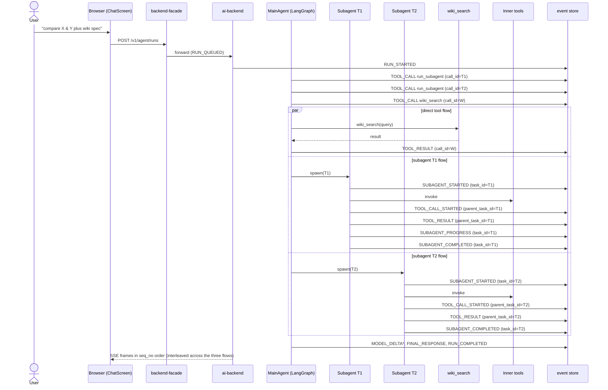

# 08. Parallel: two subagents plus one direct tool

> Status: documented · Layers: fe / facade / ai-backend / worker / db · Related: 01, 07

## Trigger

User asks for fan-out work, e.g. "compare X and Y, then also pull the latest spec from the wiki." The supervisor decides to dispatch three concurrent activities under one run: two `run_subagent` tool calls (T1 and T2) plus one direct tool call (`wiki_search`). Each subagent runs an independent inner graph and emits its own activity events; the direct tool call streams independently. The frontend renders three top-level tool-call parts that grow in parallel.

## Preconditions

- Same as [07-single-subagent-plus-tool.md](07-single-subagent-plus-tool.md) preconditions.
- The active subagent definitions have `concurrency_limit ≥ 2` (or two distinct definitions). If the same definition is requested twice and `concurrency_limit = 1`, the second task is queued by `AsyncSubagentLifecycle.start` ([runner.py:107-117](services/ai-backend/src/agent_runtime/delegation/subagents/runner.py#L107-L117)) and only one runs at a time — see Edge cases.
- The Deep Agents loader allows the supervisor to emit multiple tool calls in a single LLM turn. Verified by reading `build_deep_agent` in [deep_agent_builder.py:133-150](services/ai-backend/src/agent_runtime/execution/deep_agent_builder.py#L133-L150) — `subagents` is just the catalog; concurrency is unlocked by emitting multiple tool calls in the same turn, which Deep Agents/LangGraph dispatch in parallel.

## Sequence diagram

## Function trace

1. `RuntimeRunHandler.handle` — [run.py:131-167](services/ai-backend/src/runtime_worker/handlers/run.py#L131-L167) — same as use case 07; emits `RUN_STARTED`.
2. Supervisor emits **three** tool calls in a single LLM turn — Deep Agents/LangGraph dispatch them concurrently. Each tool-call chunk goes through `StreamOrchestrator` with `parent_task_id=None` and an independent `payload.call_id` (T1, T2, W). The producer projects each to `TOOL_CALL_STARTED`, `activity_kind=tool`, `span_id=call_id`.
3. Direct tool invocation runs on the supervisor's namespace (no `subagent_task_id`). `StreamEventSource.TOOL`. The `TOOL_RESULT` event keeps `parent_task_id=None`, so the frontend reducer routes it to `upsertRuntimeToolPart` ([contentBuilders.ts:189-201](apps/frontend/src/features/chat/chatModel/contentBuilders.ts#L189-L201)) keyed by `call_id=W`.
4. Subagent T1 launch — `AsyncSubagentLifecycle.start` ([runner.py:93-155](services/ai-backend/src/agent_runtime/delegation/subagents/runner.py#L93-L155)) creates `AsyncTaskState(task_id=T1, status=RUNNING)` (or `QUEUED` if the concurrency limit was already hit). The runner's namespace stamps `subagent_task_id=T1` on every event the inner graph emits.
5. Subagent T2 launch — same path, independent `task_id=T2`, independent `thread_id`/`run_id` from `AsyncSubagentLaunch` ([runner.py:147-154](services/ai-backend/src/agent_runtime/delegation/subagents/runner.py#L147-L154)).
6. `StreamOrchestrator` `parent_task_id` stamping — [stream_events.py:114-195](services/ai-backend/src/runtime_worker/stream_events.py#L114-L195) — when a chunk comes from an inner graph, the orchestrator reads `namespace.subagent_task_id` and writes it onto the resulting `StreamEvent.parent_task_id`. T1 and T2 events therefore carry distinct parent ids and never get crossed.
7. `presentation_fields` span id derivation — [events.py:122-171](services/ai-backend/src/runtime_api/schemas/events.py#L122-L171). For SUBAGENT lifecycle events, `_span_id_for` ([events.py:289-315](services/ai-backend/src/runtime_api/schemas/events.py#L289-L315)) returns `task_id` (= T1 or T2). For inner tool events under the subagent, `span_id = payload.call_id`, `parent_span_id = parent_task_id` (= T1 or T2). This pair forms a stable `{subagent_id}:{task_id}` projection that the frontend doesn't have to compute.
8. The three flows race — events for T1, T2, and W interleave in `runtime_events`, but `sequence_no` remains globally monotonic per run because Postgres takes `SELECT ... FOR UPDATE` on `agent_runs` while assigning the next sequence (the in-memory adapter holds an `asyncio.Lock` per run). The frontend never has to re-order events; SSE delivers them in append order.
9. Frontend reducer routing — [eventReducer.ts:38-160](apps/frontend/src/features/chat/chatModel/eventReducer.ts#L38-L160). For each envelope:
   - `event.parent_task_id && event.activity_kind === "tool"` → `upsertSubagentActivity` (lines 88-93). Routes nested tool events under whichever parent matches `toolCallId === parent_task_id`. Because T1 ≠ T2, two subagent parts grow in parallel without interference.
   - `event.activity_kind === "subagent"` (no `parent_task_id` because the lifecycle event is _about_ the subagent itself) → `upsertSubagentPart` (lines 148-150). The part is keyed by `subagentKeyForEvent` ([subagentText.ts:6-13](apps/frontend/src/features/chat/chatModel/subagentText.ts#L6-L13)), which prefers `payload.task_id`.
   - `event.activity_kind === "tool"` with no `parent_task_id` → `upsertRuntimeToolPart` (line 145-147), keyed by `call_id=W`.
10. `upsertSubagentActivity` parent-lookup — [contentBuilders.ts:226-259](apps/frontend/src/features/chat/chatModel/contentBuilders.ts#L226-L259). Walks `assistant.content[]` for a `tool-call` part with `toolName === "run_subagent" && toolCallId === parent_task_id`. If found, merges the activity into `args.activities[]` via `upsertActivityRecord` ([contentBuilders.ts:341-358](apps/frontend/src/features/chat/chatModel/contentBuilders.ts#L341-L358)). If **not** found (out-of-order, see Edge cases), `foundParent` stays `false` and the function returns `items` unchanged — silent no-op.
11. `subagentPart` factory — [partFactories.ts:71-130](apps/frontend/src/features/chat/chatModel/partFactories.ts#L71-L130). Independently maintains the two top-level cards keyed by T1 and T2 respectively. Fallbacks: name `"Subagent"` ([partFactories.ts:80](apps/frontend/src/features/chat/chatModel/partFactories.ts#L80)), title `"Working in the background"` ([partFactories.ts:95](apps/frontend/src/features/chat/chatModel/partFactories.ts#L95)). `shortSubagentSummary` applies `truncateText(value, 120)` ([subagentText.ts:86-92](apps/frontend/src/features/chat/chatModel/subagentText.ts#L86-L92)).
12. Race to terminal — the three flows complete in any order. The supervisor only continues once it has all three tool results in its message context (Deep Agents semantics: a tool-call turn must collect every emitted result before the next LLM call). After all three return, `MODEL_DELTA*` and `FINAL_RESPONSE` stream the supervisor's synthesized answer.
13. `_append_lifecycle(RUN_COMPLETED)` — [run.py:316-338](services/ai-backend/src/runtime_worker/handlers/run.py#L316-L338) — only fires after the supervisor's final assistant turn. The frontend's `applyRuntimeEvent` treats `RUN_COMPLETED` as terminal and runs `settleAssistantRun` ([contentBuilders.ts:75-98](apps/frontend/src/features/chat/chatModel/contentBuilders.ts#L75-L98)).

## Runtime events emitted

Interleaving below is one plausible ordering — actual `sequence_no` may differ, but every per-flow ordering (start-before-progress-before-complete) is preserved.

| seq   | event_type                           | activity_kind | parent_task_id | call_id / task_id | Notes                                                                             |
| ----- | ------------------------------------ | ------------- | -------------- | ----------------- | --------------------------------------------------------------------------------- |
| 1     | `RUN_QUEUED`                         | `run`         | —              | —                 | api emit.                                                                         |
| 2     | `RUN_STARTED`                        | `run`         | —              | —                 | worker.                                                                           |
| 3     | `MODEL_CALL_STARTED`                 | `run`         | —              | —                 | TTFT.                                                                             |
| 4     | `TOOL_CALL_STARTED` (`run_subagent`) | `tool`        | —              | call_id=T1        | parent card #1; FE keys `toolCallId=T1`.                                          |
| 5     | `TOOL_CALL_STARTED` (`run_subagent`) | `tool`        | —              | call_id=T2        | parent card #2; FE keys `toolCallId=T2`.                                          |
| 6     | `TOOL_CALL_STARTED` (`wiki_search`)  | `tool`        | —              | call_id=W         | independent direct tool card.                                                     |
| 7     | `SUBAGENT_STARTED`                   | `subagent`    | —              | task_id=T1        | `_span_id_for` returns `task_id`.                                                 |
| 8     | `SUBAGENT_STARTED`                   | `subagent`    | —              | task_id=T2        | same projection for T2.                                                           |
| 9     | `TOOL_CALL_STARTED` (inner of T1)    | `tool`        | T1             | call_id=I1        | nested under parent T1 via `upsertSubagentActivity`.                              |
| 10    | `TOOL_CALL_STARTED` (inner of T2)    | `tool`        | T2             | call_id=I2        | nested under parent T2.                                                           |
| 11    | `TOOL_RESULT` (`wiki_search`)        | `tool`        | —              | call_id=W         | direct tool card flips to `completed`.                                            |
| 12    | `TOOL_RESULT` (inner of T1)          | `tool`        | T1             | call_id=I1        | merges into T1's `args.activities[]` by `id=I1`.                                  |
| 13    | `SUBAGENT_PROGRESS`                  | `subagent`    | —              | task_id=T1        | updates parent T1 card summary.                                                   |
| 14    | `TOOL_RESULT` (inner of T2)          | `tool`        | T2             | call_id=I2        | merges into T2's `args.activities[]`.                                             |
| 15    | `SUBAGENT_COMPLETED`                 | `subagent`    | —              | task_id=T1        | T1 card → `status=completed`, `result=summary`.                                   |
| 16    | `SUBAGENT_COMPLETED`                 | `subagent`    | —              | task_id=T2        | T2 card → terminal.                                                               |
| 17..M | `MODEL_DELTA`                        | `message`     | —              | —                 | only after **all three** flows complete (Deep Agents waits on every tool result). |
| M+1   | `FINAL_RESPONSE`                     | `message`     | —              | —                 | reconciles assistant text.                                                        |
| M+2   | `RUN_COMPLETED`                      | `run`         | —              | —                 | terminal — FE closes EventSource.                                                 |

## State changes

- `agent_runs.status`: `queued → running → completed`. The transition is delayed until all three concurrent flows return.
- `runtime_events`: ~17–25 rows depending on inner tool count and `MODEL_DELTA` chunk count. `sequence_no` strictly monotonic across all three flows.
- `AsyncTaskState` (per-subagent): two independent records, T1 and T2, each `RUNNING → SUCCEEDED`. Stored in `InMemoryAsyncTaskStore` ([runner.py:54-76](services/ai-backend/src/agent_runtime/delegation/subagents/runner.py#L54-L76)) — see Known gaps.
- Frontend `items`: one assistant `ChatItem` whose `content[]` contains:
  - one `tool-call` part with `toolName="run_subagent"`, `toolCallId=T1`, `args.activities[]` of length 1 (one inner tool record);
  - one `tool-call` part with `toolName="run_subagent"`, `toolCallId=T2`, `args.activities[]` of length 1;
  - one `tool-call` part with the direct tool's `toolName` (e.g. `wiki_search`), `toolCallId=W`, no `activities[]`;
  - trailing `text` part for the supervisor's `FINAL_RESPONSE`.
- The two parent subagent parts grow independently because `replaceToolCallPart` ([contentBuilders.ts:150-168](apps/frontend/src/features/chat/chatModel/contentBuilders.ts#L150-L168)) matches by `toolCallId` only.

## Edge cases handled

- **Out-of-order subagent activity (silent fragility).** If an inner `TOOL_CALL_STARTED` (`parent_task_id=T1`) arrives before the supervisor's parent `TOOL_CALL_STARTED` for `call_id=T1` (e.g. SSE reconnect with `?after_sequence=N` straddling that boundary), `upsertSubagentActivity` searches for the parent, fails to find it, and returns `items` unchanged ([contentBuilders.ts:258](apps/frontend/src/features/chat/chatModel/contentBuilders.ts#L258)). The activity record is **not buffered** — it is dropped from the timeline. In practice the per-run `sequence_no` ordering prevents this, but a buggy backend could cause silent data loss in the UI. Documented as a known fragility.
- **Concurrency limit forces queueing.** When the same subagent definition is requested twice with `concurrency_limit=1`, the second task's `AsyncTaskState` is saved with `AsyncTaskStatus.QUEUED` ([runner.py:107-117](services/ai-backend/src/agent_runtime/delegation/subagents/runner.py#L107-L117)). The supervisor sees a started subagent, and `_try_promote_queued` ([runner.py:305-347](services/ai-backend/src/agent_runtime/delegation/subagents/runner.py#L305-L347)) flips it to `RUNNING` only after the first one completes. The fan-out becomes serial, but the frontend correctly shows two top-level cards with one initially `queued`.
- **One subagent times out, the other completes.** `AsyncTaskLifecyclePolicy.is_timed_out` ([runner.py:446-451](services/ai-backend/src/agent_runtime/delegation/subagents/runner.py#L446-L451)) flips the laggard to `TIMED_OUT` on the next `check`, returning `SubagentResult.fail(TIMEOUT)`. The supervisor still gets a tool result for that branch (a failure result), so the run completes — it does **not** hang waiting for the timed-out subagent. FE shows `status=failed` on the failed card; the supervisor's final answer can describe the partial result.
- **Direct tool fails while subagents succeed.** Tool failure produces `TOOL_RESULT` with `payload.status=failed`. `statusFromEvent` flips `isError: true` on that part. The supervisor still receives a tool result and proceeds.
- **`SUBAGENT_PROGRESS` with empty summary before any `STARTED`** — `subagentPart` returns `null` and the part is not created ([partFactories.ts:103-105](apps/frontend/src/features/chat/chatModel/partFactories.ts#L103-L105)).
- **Display fallbacks**: name `"Subagent"`, title `"Working in the background"`. `meaningfulSubagentTitle` strips placeholder strings ("Subagent", "Subagent update", or any "<x> subagent") so the title doesn't degrade after a noisy `SUBAGENT_UPDATE`.

## Known gaps / TODOs

- **Out-of-order parent lookup is silently lossy** ([contentBuilders.ts:258](apps/frontend/src/features/chat/chatModel/contentBuilders.ts#L258)). A defensive fix would buffer orphan activity records keyed by `parent_task_id` and replay them when the parent appears, but this is not implemented today. Compliance-sensitive deployments should rely on the server-side `runtime_events` log, not the FE timeline, as the source of truth.
- **`InMemoryAsyncTaskStore` is non-durable** — same gap as use case 07. With two parallel subagents, a worker restart can lose both `AsyncTaskState` records, leaving `STALE_TASK_ID` errors on the next poll.
- **No global concurrency limit across distinct definitions.** `concurrency_limit` is per-subagent-name; a malicious or buggy supervisor could fan out N distinct subagents and exhaust worker resources. A run-level cap is not yet enforced.
- **Supervisor must wait on every tool result before the next LLM turn** (Deep Agents semantics). A slow subagent gates `RUN_COMPLETED` for the whole run, even when the other branches finished long ago. There is no "partial answer" pathway.
- **`activity_kind` does not include direct-vs-subagent tool distinction at the projection layer.** The FE relies on `parent_task_id` to disambiguate. A future projector field (e.g. `nested_under: "subagent" | null`) would simplify FE routing.

## References

- [services/ai-backend/src/agent_runtime/delegation/subagents/runner.py](services/ai-backend/src/agent_runtime/delegation/subagents/runner.py) — `AsyncSubagentLifecycle.start`, `_try_promote_queued`.
- [services/ai-backend/src/agent_runtime/execution/deep_agent_builder.py](services/ai-backend/src/agent_runtime/execution/deep_agent_builder.py) — `build_deep_agent`; subagents catalog wiring.
- [services/ai-backend/src/runtime_worker/stream_events.py](services/ai-backend/src/runtime_worker/stream_events.py) — `parent_task_id` stamping from `namespace.subagent_task_id`.
- [services/ai-backend/src/runtime_api/schemas/events.py](services/ai-backend/src/runtime_api/schemas/events.py) — `presentation_fields`, `_span_id_for`, `_subagent_event_type`.
- [services/ai-backend/src/runtime_api/schemas/common.py](services/ai-backend/src/runtime_api/schemas/common.py) — `RuntimeApiEventType`, `RuntimeActivityKind`.
- [apps/frontend/src/features/chat/chatModel/eventReducer.ts](apps/frontend/src/features/chat/chatModel/eventReducer.ts) — concurrent routing by `parent_task_id` + `activity_kind`.
- [apps/frontend/src/features/chat/chatModel/contentBuilders.ts](apps/frontend/src/features/chat/chatModel/contentBuilders.ts) — `upsertSubagentPart`, `upsertSubagentActivity`, `upsertActivityRecord`.
- [apps/frontend/src/features/chat/chatModel/partFactories.ts](apps/frontend/src/features/chat/chatModel/partFactories.ts) — `subagentPart`, `subagentActivityRecord`.
- [apps/frontend/src/features/chat/chatModel/subagentText.ts](apps/frontend/src/features/chat/chatModel/subagentText.ts) — `subagentKeyForEvent`, `truncateText`, `meaningfulSubagentTitle`.
- Related: [07-single-subagent-plus-tool.md](07-single-subagent-plus-tool.md) for the simpler one-subagent flow.
