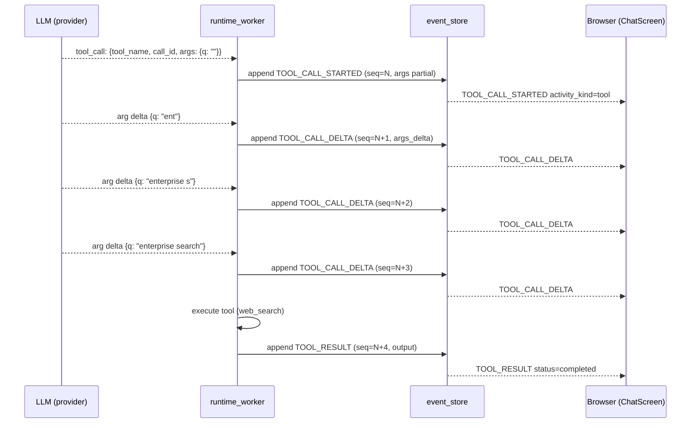

# 11. Tool call with streaming args

> Status: documented · Layers: ai-backend / fe · Related: 05, 12, 13

## Trigger

The agent invokes a tool whose arguments are produced incrementally by the LLM (for example a `search` query whose JSON is filled in token-by-token). The frontend must show the partial JSON building up live, then swap in the result when the tool call lands.

## Preconditions

- An assistant run is `running` for `run_id`.
- The browser is consuming the run's SSE stream from `GET /v1/agent/runs/{run_id}/stream` (resumable via `?after_sequence=N`).
- The model adapter emits an initial tool call followed by one or more arg-delta chunks before invoking the tool function. Tools whose args land in one shot skip directly to `TOOL_RESULT` after `TOOL_CALL_STARTED`.

## Sequence diagram

## Function trace

1. Worker projects each LLM tool-call event through `RuntimeApiEventProjector.api_event_type_for` — [services/ai-backend/src/runtime_api/schemas/events.py:75-98](../../services/ai-backend/src/runtime_api/schemas/events.py#L75-L98) — which maps the first emission to `TOOL_CALL_STARTED` and overrides subsequent partial emissions to `TOOL_CALL_DELTA`. Activity kind is forced to `RuntimeActivityKind.TOOL`.
2. Each event is persisted with monotonic `sequence_no` and pushed to subscribed SSE clients. Enum values live in [services/ai-backend/src/runtime_api/schemas/common.py:89-93](../../services/ai-backend/src/runtime_api/schemas/common.py#L89-L93) (`TOOL_CALL_STARTED`, `TOOL_CALL_DELTA`, `TOOL_RESULT`, `TOOL_CALL_COMPLETED`).
3. FE receives the envelope and routes through `applyRuntimeEvent` — [apps/frontend/src/features/chat/chatModel/eventReducer.ts:38-160](../../apps/frontend/src/features/chat/chatModel/eventReducer.ts#L38-L160). For `activity_kind === "tool"` it calls `upsertRuntimeToolPart` (line 145-146) after first running the large-artifact short-circuit at line 85-87 (see step 8).
4. `upsertRuntimeToolPart` — [apps/frontend/src/features/chat/chatModel/contentBuilders.ts:189-201](../../apps/frontend/src/features/chat/chatModel/contentBuilders.ts#L189-L201) — resolves `callId` from `payload.call_id` (or `span_id`/`event_id` fallback), looks up an existing `ThreadToolCallPart` keyed by `toolCallId`, and rebuilds it via `toolPart`.
5. `toolPart` factory — [apps/frontend/src/features/chat/chatModel/partFactories.ts:32-69](../../apps/frontend/src/features/chat/chatModel/partFactories.ts#L32-L69) — merges via spread: `{ ...existingArgs, ...toolArgs(payload), ...toolArgsDelta(payload), status }`. `toolArgs` reads `payload.args` for the started event, `toolArgsDelta` reads `payload.args_delta` for delta events ([payloadHelpers.ts:39-55](../../apps/frontend/src/features/chat/chatModel/payloadHelpers.ts#L39-L55)). Each delta is shallow-merged on top of the running args record, so the JSON view grows monotonically.
6. The factory builds `ThreadToolCallPart` with `toolCallId=callId`, `toolName=payload.tool_name`, `args=jsonArgs(args)` (full record incl. status/presentation/summary), `argsText=argsTextFromRecord(args, hiddenToolArgKeys)`, `result=toolResultValue(payload) ?? existing?.result`, `isError=status === "failed"`.
7. **Hidden-keys filtering**: `argsTextFromRecord` strips transport/UI keys before stringifying for the human-readable input block. Keys hidden: `status`, `summary`, `delta`, `deltas`, `event_type`, `action_id`, `approval_id`, `approval_kind`, `auth_url`, `display_name`, `server_id`, `server_name`, `source_tool_call_id`, `presentation` — [payloadHelpers.ts:69-88](../../apps/frontend/src/features/chat/chatModel/payloadHelpers.ts#L69-L88). `presentation` stays on `args` (so `presentationFromArgs` can read it) but is excluded from the rendered JSON.
8. **Large-artifact detection** runs _before_ the tool-part upsert. `isLargeResultArtifactToolEvent` — [apps/frontend/src/features/chat/chatModel/largeArtifact.ts:6-17](../../apps/frontend/src/features/chat/chatModel/largeArtifact.ts#L6-L17) — returns true when (a) the tool name matches `read_file`, `rg`, `grep`, `search_files`, or contains `search` (case-insensitive), and (b) any merged arg/delta value contains the substring `/large_tool_results/`. When true, `eventReducer.ts:85-87` drops the event from the visible thread; the result is rendered later via `activityResultText` as `"Large result saved for internal inspection."` ([largeArtifact.ts:39-53](../../apps/frontend/src/features/chat/chatModel/largeArtifact.ts#L39-L53)).
9. On `TOOL_RESULT`, `toolResultValue` — [payloadHelpers.ts:57-67](../../apps/frontend/src/features/chat/chatModel/payloadHelpers.ts#L57-L67) — prefers `payload.output` (the full dict, when non-empty), falling back to `payload.summary`, `payload.safe_message`, then `objectSummary(payload.output)`. The same `toolPart` upsert preserves the partly-built `args` (since it spreads `existingArgs` first) and now sets `result` and `isError`.

## Runtime events emitted

| Sequence | Event type            | Activity kind | Notes                                                           |
| -------- | --------------------- | ------------- | --------------------------------------------------------------- |
| N        | `tool_call_started`   | `tool`        | First emission. `payload.args` is partial; `call_id` is stable. |
| N+1…N+k  | `tool_call_delta`     | `tool`        | `payload.args_delta` is shallow-merged onto running args.       |
| N+k+1    | `tool_result`         | `tool`        | `payload.output` carries the full result; `status="completed"`. |
| (opt.)   | `tool_call_completed` | `tool`        | Deprecated alias for `tool_result`; same projection path.       |

## State changes

- Server: each event persisted in the run's `event_store` with monotonic `sequence_no`. The tool span is identified by `call_id`; replay (`GET /v1/agent/runs/{run_id}/events`) reproduces the same sequence.
- Client: a single `ThreadToolCallPart` keyed by `toolCallId === call_id` is rewritten in place on every event. `args` grows; `argsText` is recomputed (with hidden keys stripped); `result` lands on the result event.

## Edge cases handled

- Out-of-order delivery: `upsertRuntimeToolPart` always merges over existing args (`{ ...existingArgs, ...toolArgs, ...toolArgsDelta }`), so a late delta still applies. Server `sequence_no` lets the client resume without replay via `?after_sequence=N`.
- Reconnect mid-stream: the FE replays starting at the highest received `sequence_no`. The same upsert path rebuilds the part deterministically.
- `tool_call_completed` (deprecated): projected through the same path as `tool_result` ([events.py:303-305, 408-409](../../services/ai-backend/src/runtime_api/schemas/events.py#L303-L305)).
- Failed tool: `status === "failed"` flips `isError=true` on the part; UI shows the error styling. `toolResultValue` falls back through `summary` → `safe_message`.
- Large artifacts: dropped from the visible timeline (step 8) — they remain in the persisted event log for audit but never render JSON in the user-facing view.
- Missing `call_id`: `toolCallId(payload) ?? event.span_id ?? event.event_id` ([contentBuilders.ts:193](../../apps/frontend/src/features/chat/chatModel/contentBuilders.ts#L193)).

## Known gaps / TODOs

- Args merge is shallow. Nested object fields (e.g. `filters.tags`) are replaced wholesale by a delta rather than deep-merged — the current LLM adapters re-emit full nested values, so this is fine in practice, but worth noting if a provider switches to nested-patch semantics.
- `hiddenToolArgKeys` is a static set. Tool authors who need a custom UI key (other than `presentation`) cannot opt into hiding it without editing this list.
- No client-side cap on `args` size; a runaway model could push a multi-MB JSON blob into a single tool part.

## References

- Frontend reducer: [apps/frontend/src/features/chat/chatModel/eventReducer.ts:38-160](../../apps/frontend/src/features/chat/chatModel/eventReducer.ts#L38-L160)
- Tool part factory: [apps/frontend/src/features/chat/chatModel/partFactories.ts:32-69](../../apps/frontend/src/features/chat/chatModel/partFactories.ts#L32-L69)
- Args helpers: [apps/frontend/src/features/chat/chatModel/payloadHelpers.ts:39-88](../../apps/frontend/src/features/chat/chatModel/payloadHelpers.ts#L39-L88)
- Large-artifact gate: [apps/frontend/src/features/chat/chatModel/largeArtifact.ts:6-68](../../apps/frontend/src/features/chat/chatModel/largeArtifact.ts#L6-L68)
- Server projector: [services/ai-backend/src/runtime_api/schemas/events.py:75-98](../../services/ai-backend/src/runtime_api/schemas/events.py#L75-L98)
- Event-type enum: [services/ai-backend/src/runtime_api/schemas/common.py:77-108](../../services/ai-backend/src/runtime_api/schemas/common.py#L77-L108)
- Public payload contracts: [packages/api-types/src/index.ts:769-805](../../packages/api-types/src/index.ts#L769-L805)
