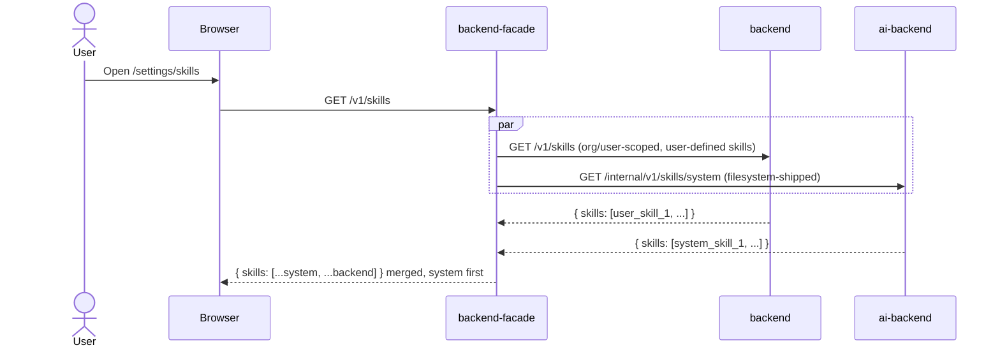
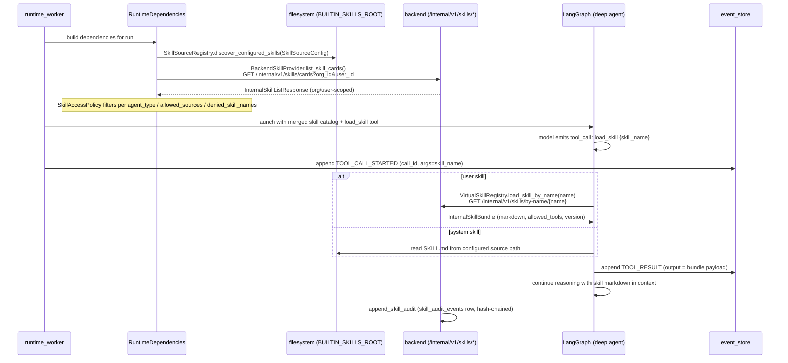

# 13. Skill invocation (system + user-defined)

> Status: documented · Layers: ai-backend / backend / facade · Related: 11

## Trigger

The agent decides mid-run that it needs to load and execute a Skill — a packaged Markdown-plus-tool bundle authored either by the platform (system skills, shipped with `ai-backend`) or by a user/org (user skills, stored in `backend`'s Postgres). Skills are surfaced as a model-callable tool (`load_skill`) and as `SKILL.md` content discovered through configured source roots; their invocation rides the same tool-call event flow as any other tool.

## Preconditions

- A run is queued or running for the user. The runtime worker has built `RuntimeDependencies` for it.
- The caller has visibility on at least one skill — system skills are unconditionally available; user skills are scoped per-org/user by `backend`.
- `RuntimeSettings.skills.backend_registry_url` is configured if user-defined skills are to be loaded; otherwise only filesystem (system) skills are exposed.

## Sequence diagrams

### Listing skills (settings page)

### Run-time invocation

## Function trace — system-skill path

1. Worker bootstrap: `RuntimeDependenciesFactory._skill_source_config` — [services/ai-backend/src/runtime_worker/dependencies.py:91-105](../../services/ai-backend/src/runtime_worker/dependencies.py#L91-L105) — registers `BUILTIN_SKILLS_ROOT` ([line 30](../../services/ai-backend/src/runtime_worker/dependencies.py#L30)) as a `SkillSource` with default scope `{shared}` and precedence 0. The packaged directory `services/ai-backend/skills/` is the only system root today (e.g. `search-subagent-logs`).
2. `SkillSourceRegistry.discover_configured_skills` — [services/ai-backend/src/agent_runtime/capabilities/skills/sources.py:107-127](../../services/ai-backend/src/agent_runtime/capabilities/skills/sources.py#L107-L127) — walks each source path, reads each child directory's `SKILL.md` via `SkillManifestReader.read`, and applies last-source-wins precedence so duplicates never collide.
3. `SkillAccessPolicy.is_skill_allowed` — [services/ai-backend/src/agent_runtime/capabilities/skills/policy.py:88-115](../../services/ai-backend/src/agent_runtime/capabilities/skills/policy.py#L88-L115) — gates each discovered skill on (a) source path being in `allowed_sources`, (b) name not in `denied_skill_names`, (c) `manifest.allowed_tools ⊆ policy.allowed_tools`, and (d) source `scope` matching the agent (main vs subagent). This is the runtime's permission middleware — bypassing it in custom builders is forbidden by [services/ai-backend/CLAUDE.md](../../services/ai-backend/CLAUDE.md) ("Capability exposure").
4. The filtered directories are passed to Deep Agents as skill roots; the agent's `load_skill` tool reads `SKILL.md` directly from disk on demand.
5. Settings UI fetches the same set via `GET /internal/v1/skills/system` ([services/ai-backend/src/runtime_api/http/routes.py:809-815](../../services/ai-backend/src/runtime_api/http/routes.py#L809-L815)) — service-token-protected in production.

## Function trace — user-skill path

1. Worker bootstrap: `RuntimeDependenciesFactory._skill_registry` — [services/ai-backend/src/runtime_worker/dependencies.py:135-142](../../services/ai-backend/src/runtime_worker/dependencies.py#L135-L142) — when `RuntimeSettings.skills.backend_registry_url` is set, constructs a `BackendSkillProvider` over httpx and wraps it in a `VirtualSkillRegistry`.
2. `BackendSkillProvider.list_skill_cards` — [services/ai-backend/src/agent_runtime/capabilities/skills/virtual.py:71-85](../../services/ai-backend/src/agent_runtime/capabilities/skills/virtual.py#L71-L85) — calls `GET /internal/v1/skills/cards?org_id&user_id` carrying `ENTERPRISE_SERVICE_TOKEN` and `x-enterprise-org-id` / `x-enterprise-user-id` (via `BackendSkillServiceAuth.headers`). Backend handler at [services/backend/src/backend_app/app.py:604-615](../../services/backend/src/backend_app/app.py#L604-L615) returns `InternalSkillListResponse` ([contracts.py:443-457](../../services/backend/src/backend_app/contracts.py#L443-L457)) — `skill_id`, `name`, `display_name`, `description`, `virtual_path`, `scope`, `source_type`, `version`, `allowed_tools`, `enabled`.
3. When the model invokes `load_skill {skill_name}`, the `LoadSkillTool` adapter — [services/ai-backend/src/agent_runtime/capabilities/skills/middleware.py:26-87](../../services/ai-backend/src/agent_runtime/capabilities/skills/middleware.py#L26-L87) — parses the input via `LoadSkillInputParser.parse` (typed `LoadSkillInput`, returns a structured error dict if the model emits an invalid name), then calls `VirtualSkillRegistry.load_skill_by_name`.
4. `BackendSkillProvider.load_skill_by_name` — [services/ai-backend/src/agent_runtime/capabilities/skills/virtual.py:87-98](../../services/ai-backend/src/agent_runtime/capabilities/skills/virtual.py#L87-L98) — calls `GET /internal/v1/skills/by-name/{name}` and validates the JSON into a `VirtualSkillBundle` (`markdown`, `allowed_tools`, `version`, `metadata`). Backend handler: [services/backend/src/backend_app/app.py:636-653](../../services/backend/src/backend_app/app.py#L636-L653). The by-id form `GET /internal/v1/skills/{skill_id}` ([line 617-634](../../services/backend/src/backend_app/app.py#L617-L634)) returns the same `InternalSkillBundle` shape ([contracts.py:460-469](../../services/backend/src/backend_app/contracts.py#L460-L469)).
5. Both registries are cached on the `VirtualSkillRegistry` instance; duplicate names across providers raise `RuntimeErrorCode.CONFIGURATION_ERROR` early ([virtual.py:111-122](../../services/ai-backend/src/agent_runtime/capabilities/skills/virtual.py#L111-L122)).
6. The bundle payload is returned to the agent inside the same `TOOL_RESULT` event flow used by every other tool (see [use case 11](./11-tool-call-streaming-args.md) for the exact projection). `output.ok=True` plus the model-dumped `VirtualSkillBundle` lands in `payload.output`; on an `AgentRuntimeError` the tool returns `{ok:false, error:{code, safe_message, retryable}}`.

## Aggregation in the facade

Facade `GET /v1/skills` — [services/backend-facade/src/backend_facade/app.py:362-388](../../services/backend-facade/src/backend_facade/app.py#L362-L388) — calls **both** backends in sequence and concatenates `[...system_skills, ...backend_skills]` so the settings UI shows system skills first. CRUD (`POST/GET/PUT/DELETE /v1/skills/{skill_id}`) is forwarded to `backend` only — system skills are read-only on the runtime filesystem. CRUD endpoints in backend are at [services/backend/src/backend_app/app.py:540-602](../../services/backend/src/backend_app/app.py#L540-L602).

## Runtime events emitted

| Sequence | Event type            | Activity kind | Notes                                                                                                            |
| -------- | --------------------- | ------------- | ---------------------------------------------------------------------------------------------------------------- |
| N        | `tool_call_started`   | `tool`        | `payload.tool_name="load_skill"`, `args.skill_name="<slug>"`, `call_id`.                                         |
| N+1      | `tool_result`         | `tool`        | `payload.output` carries the bundle (`markdown`, `allowed_tools`, …) or `{ok:false, error}`. `status=completed`. |
| (after)  | downstream tool calls | `tool`        | Tools that the loaded skill itself invokes ride the standard streaming path.                                     |

## State changes

- Server (backend): user-skill CRUD mutates the `skills` table and writes hash-chained rows into `skill_audit_events` via `append_skill_audit` ([services/backend/src/backend_app/store.py:869-880, 1032-1080](../../services/backend/src/backend_app/store.py#L869-L880)). Audit actions seen in `service.py`: `skill_created`, `skill_updated`, `skill_deleted`, `skill_preloaded`. **Today the persisted audit covers lifecycle, not per-invocation `skill_invoked` rows** — runtime invocations are visible only via the per-run `event_store` (the `tool_call_started` / `tool_result` pair for the `load_skill` tool).
- Server (ai-backend): `VirtualSkillRegistry` caches cards per worker process; cards are re-fetched only when the cache is empty.
- Client: skill invocations render through the same `ThreadToolCallPart` path as any tool — the user sees `load_skill` with `skill_name` in args and the bundle (or short description) in the result panel.

## Edge cases handled

- **Permission gating**: `SkillAccessPolicy` rejects skills outside the agent's allowed sources / scope before the model ever sees them. `for_subagent()` defaults to no skills — subagents must opt in explicitly ([policy.py:71-86](../../services/ai-backend/src/agent_runtime/capabilities/skills/policy.py#L71-L86)).
- **Duplicate names** across providers: `VirtualSkillRegistry.list_available_skills` raises `CONFIGURATION_ERROR` rather than silently shadowing.
- **Invalid model input**: `LoadSkillInputParser.parse` catches `ValidationError` and returns `{ok:false, error:{code:"invalid_skill_name", retryable:false}}` so the model can self-correct without crashing the run.
- **Backend unreachable**: `httpx.get(...).raise_for_status()` raises; the worker bubbles the error to the agent which surfaces it via `TOOL_RESULT` with `status="failed"` (same path as use case 11).
- **System-skill source missing**: `_skill_source_config` returns an empty `SkillSourceConfig()` if `BUILTIN_SKILLS_ROOT` does not exist, so a stripped-down deployment still boots.

## Known gaps / TODOs

- **No per-invocation audit row.** `skill_audit_events` records create/update/delete/preload but not `skill_invoked`. For a regulated buyer the answer to "who invoked which skill, when, on which run" lives only in the runtime `event_store` today — and that's projected through the `tool_call_started`/`tool_result` pair, not a dedicated audit table. Compliance reviews should flag this as not-evidenced-in-repo for skill-invocation audit.
- **Source-token boundary.** `BackendSkillServiceAuth.headers` injects the service token + identity headers from the runtime context, but the runtime context's `org_id` / `user_id` ultimately come from the run record. If a malformed run leaks an unscoped identity it will leak into the skill list — the only defense is the facade-side authentication that produced the run.
- **No skill version pinning per run.** A run that loads skill X at start sees whatever version backend serves at the moment of `load_skill_by_name`; an org admin updating a skill mid-run could change behavior under the agent's feet.
- **No subagent-level permission scopes.** `SkillAccessPolicy.for_subagent` is invoked with caller-supplied source/skill lists; there is no policy table mapping subagent kinds to allowed skill IDs.

## References

- Facade aggregation: [services/backend-facade/src/backend_facade/app.py:349-419](../../services/backend-facade/src/backend_facade/app.py#L349-L419)
- Backend CRUD + internal endpoints: [services/backend/src/backend_app/app.py:540-653](../../services/backend/src/backend_app/app.py#L540-L653)
- AI-backend system-skill route: [services/ai-backend/src/runtime_api/http/routes.py:801-836](../../services/ai-backend/src/runtime_api/http/routes.py#L801-L836)
- Runtime dependencies wiring: [services/ai-backend/src/runtime_worker/dependencies.py:75-142](../../services/ai-backend/src/runtime_worker/dependencies.py#L75-L142)
- Skill discovery + policy: [services/ai-backend/src/agent_runtime/capabilities/skills/sources.py](../../services/ai-backend/src/agent_runtime/capabilities/skills/sources.py), [policy.py](../../services/ai-backend/src/agent_runtime/capabilities/skills/policy.py)
- Virtual registry + provider: [services/ai-backend/src/agent_runtime/capabilities/skills/virtual.py](../../services/ai-backend/src/agent_runtime/capabilities/skills/virtual.py)
- `load_skill` tool adapter: [services/ai-backend/src/agent_runtime/capabilities/skills/middleware.py](../../services/ai-backend/src/agent_runtime/capabilities/skills/middleware.py)
- Internal contracts: [services/backend/src/backend_app/contracts.py:443-469](../../services/backend/src/backend_app/contracts.py#L443-L469)
- Audit store: [services/backend/src/backend_app/store.py:869-1080](../../services/backend/src/backend_app/store.py#L869-L1080)
