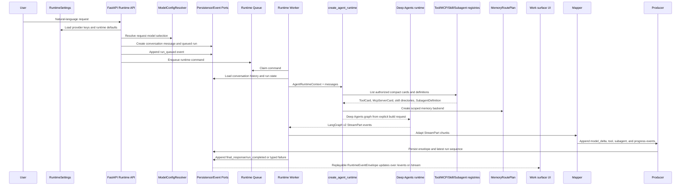
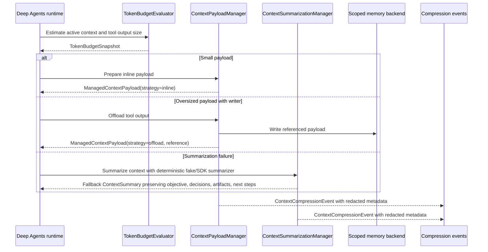
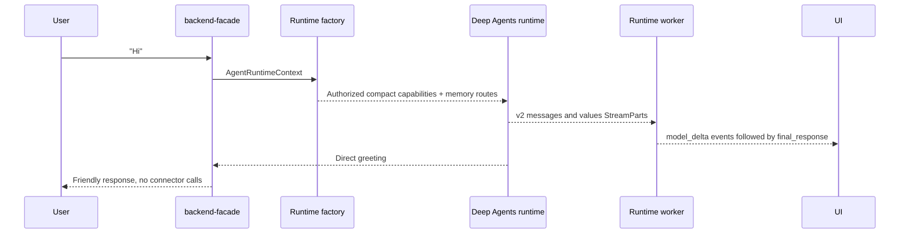
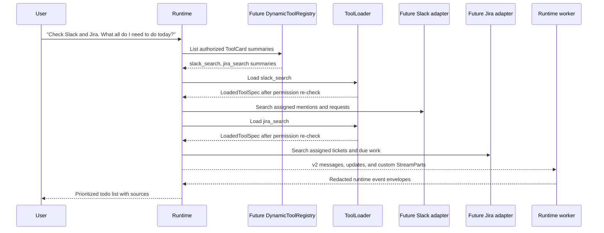
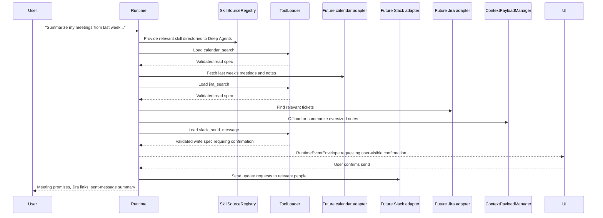
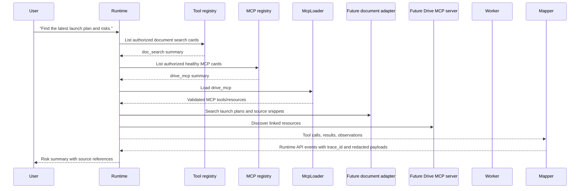
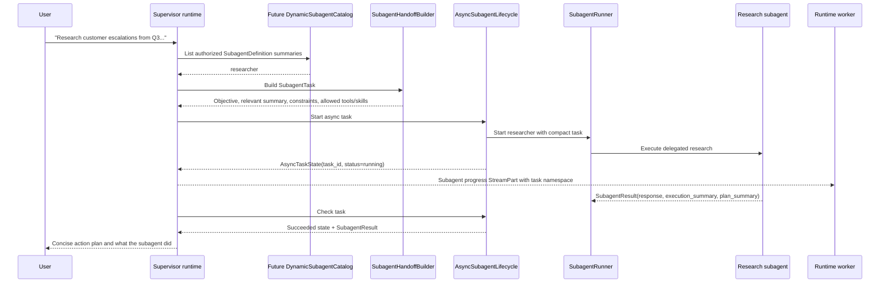
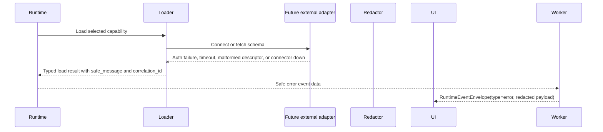

# Data Flow

## Request Lifecycle

Every request starts with typed context and compact capability discovery. The model-facing runtime sees only authorized capability summaries until it explicitly chooses a tool, MCP server, skill, memory path, or subagent.

`RuntimeSettings.load()` reads `env_example`, `.env`, and process environment.
Provider credentials stay outside request bodies and events. `ModelConfigResolver`
validates provider selection against configured keys for OpenAI, Anthropic, and
Gemini before the API persists a run.

The worker path is async-first. `RuntimeWorker` claims queued commands with lock
expiration, limits active run handling with `RUNTIME_MAX_PARALLEL_RUNS`, applies
`RUNTIME_MAX_RETRIES`, loads conversation history, builds local runtime
dependencies, and calls `astream_runtime()` for streaming-capable model profiles
rather than running the model inline inside FastAPI. The worker consumes
documented LangGraph v2 `StreamPart` dictionaries (`type`, `ns`, `data`) through
`RuntimeStreamPartAdapter`. Provider text chunks are persisted as `model_delta`
events with the exact text in `payload.delta`; tool, subagent, custom, and
progress parts become replayable runtime event envelopes. Deep Agents namespaces
are parsed explicitly: `()` is main-agent output and `tools:<id>` identifies
subagent execution. Lifecycle, cancel, approval, and stream events are appended
through `RuntimeEventProducer` so the run latest sequence cursor is updated
consistently. The same run still ends with `final_response` and `run_completed`.

## Dynamic Capability Loading

The runtime uses a two-step pattern for large or risky capabilities:

- Tools: local/test mode currently uses `EmptyToolRegistry` until a dynamic tool backend is added.
- MCP: `DynamicMcpRegistry` returns compact `McpServerCard` objects when `MCP_BACKEND_REGISTRY_URL` is configured. `McpLoader` connects to the selected server and validates discovered tool/resource descriptors.
- Skills: `VirtualSkillRegistry` can load backend-hosted skills when `SKILLS_BACKEND_REGISTRY_URL` is configured; file-system skill directories still pass through `SkillSourceRegistry`.
- Subagents: local/test mode currently uses `EmptySubagentCatalog` until a dynamic subagent catalog is added.
- Memory: `ScopedMemoryBackendFactory` creates a `MemoryRoutePlan` for user, agent, and organization policy scopes.

## Context And Memory Flow

## Example User Inputs

These examples describe where the backend is today. They assume future Slack, calendar, Jira, and document connectors will satisfy the existing tool/MCP adapter contracts. Current tests use fakes at those boundaries.

1. `Hi`
2. `Check Slack and Jira. What all do I need to do today?`
3. `Summarize my meetings from last week, what was promised, drop a Slack message to all relevant people asking for updates, and share any relevant Jira tickets.`
4. `Find the latest launch plan, summarize the risks, and show me which sources support each risk.`
5. `Research customer escalations from Q3, compare Slack discussions with Jira tickets, and give me a concise action plan.`

## Mid-Conversation And Later-Turn Examples

The runtime API persists each user turn as a message and each accepted request as a separate run. Later turns reuse the same `conversation_id` while getting their own `run_id`, event sequence, approval state, cancellation state, and replay cursor.

Example conversation:

1. `Find the latest launch plan, summarize the risks, and show sources for each risk.`
2. `Now only show the risks that do not have a named owner.`
3. `For those ownerless risks, draft a Slack update to the launch channel, but ask me before sending.`
4. `Actually cancel that draft run; I want to change the tone.`
5. `Try again, make it executive-friendly, and keep the Jira links.`

The first turn should create the conversation and first queued run. Each later turn should append a new user message to the same conversation, enqueue a new run, and let clients replay or stream that run's events independently.

## Flow 1: Simple Greeting

For a small conversational request, the runtime still builds the same typed harness, but the model should answer directly without loading full tool specs or starting subagents.

## Flow 2: Daily Work Check Across Slack And Jira

The model first sees compact capability cards. It can choose Slack and Jira search tools or MCP servers, then the loaders validate full schemas and permissions before any external call happens.

## Flow 3: Meeting Summary Plus Follow-Up Messages

This is a multi-step workflow. Read actions can run through search/calendar tools; write actions, such as Slack messages, require a loaded write-capable tool with explicit policy and confirmation before connector-side effects.

## Flow 4: Source-Backed Launch Risk Summary

For source-backed answers, the runtime can combine enterprise document search with MCP-discovered resources and stream traceable progress as it works.

## Flow 5: Delegated Escalation Research

Long, research-heavy requests can be delegated to a subagent. The supervisor passes a compact handoff and keeps async task IDs outside message history.

## Failure And Safety Flow

All capability failures return typed, user-safe errors rather than raw adapter exceptions.

