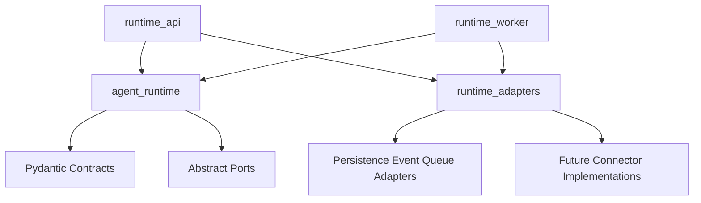

# Package Structure

## Current Package

The AI backend uses an installable `src` layout with one runtime-core package and small sibling packages for deployable surfaces and adapters:

```text
services/ai-backend/
  pyproject.toml
  requirements.txt
  src/
    agent_runtime/
      execution/
      capabilities/
        tools/
        mcp/
        skills/
      context/
        memory/
      delegation/
        subagents/
      events/
        contracts/
        projection/
      observability/
      persistence/
        records/
        schema/
        ports.py
      api/
        # runtime producer service/ports/events
    runtime_api/
      app.py
      http/
      schemas/
      sse/
    runtime_adapters/
      in_memory/
      postgres/
      queue/
    runtime_worker/
      handlers/
      stream_events.py
  tests/
    unit/
      agent_runtime/
      runtime_api/
      runtime_adapters/
      runtime_worker/
```

## Module Ownership

- `agent_runtime/`: reusable runtime domain and orchestration core. It owns execution contracts, Deep Agents/LangGraph wiring, capability discovery, context/memory policy, subagent delegation, event normalization, observability helpers, persistence records, and abstract ports.
- `runtime_api/`: deployable FastAPI surface for conversations, runs, event replay, SSE, cancellation, approvals, safe HTTP errors, and API request/response schemas.
- `runtime_adapters/`: concrete adapters for tests and local/production-style infrastructure, including deterministic in-memory persistence/event/queue behavior and the PostgreSQL runtime adapter.
- `runtime_worker/`: async runtime command consumer process, handlers for run/cancel/approval-resolution commands, and stream-event mapping before events enter the API producer.

Legacy compatibility modules under `agent_runtime.agent.*`, `agent_runtime.tools.*`, `agent_runtime.mcp.*`, `agent_runtime.skills.*`, `agent_runtime.memory.*`, `agent_runtime.subagents.*`, and broad `agent_runtime.api.*` re-export paths have been removed. Use the canonical packages below.

## Canonical Import Paths

| Concern | Canonical package |
| --- | --- |
| Execution contracts, graph, and factory | `agent_runtime.execution.*` |
| Tool capabilities | `agent_runtime.capabilities.tools.*` |
| MCP capabilities | `agent_runtime.capabilities.mcp.*` |
| Skills middleware and registries | `agent_runtime.capabilities.skills.*` |
| Context memory | `agent_runtime.context.memory.*` |
| Subagent delegation | `agent_runtime.delegation.subagents.*` |
| Runtime API service and producer ports | `agent_runtime.api.service`, `agent_runtime.api.ports`, `agent_runtime.api.events` |

Do not add compatibility aliases for old package paths. Move callers to the
canonical owner instead.

## Dependency Direction

High-level runtime modules depend on abstract ports and Pydantic contracts. Deployable API and worker packages compose runtime services with concrete adapters. Connector implementations depend on vendor SDKs; domain contracts must not import connector SDKs.



## Testing Implication

Unit tests mirror source ownership:

- Runtime-domain behavior stays under `tests/unit/agent_runtime/`.
- FastAPI route and schema behavior lives under `tests/unit/runtime_api/`.
- Concrete adapter behavior lives under `tests/unit/runtime_adapters/`.
- New capability tests should mirror the canonical package when practical, for
  example `tests/unit/agent_runtime/capabilities/skills/`. Existing tests under
  compatibility-oriented folders may remain until the migration is complete, but
  they should import canonical modules when covering new behavior.

Shared fakes and helpers should live in non-test helper modules, while concrete `test_*.py` files contain focused behavior tests.
