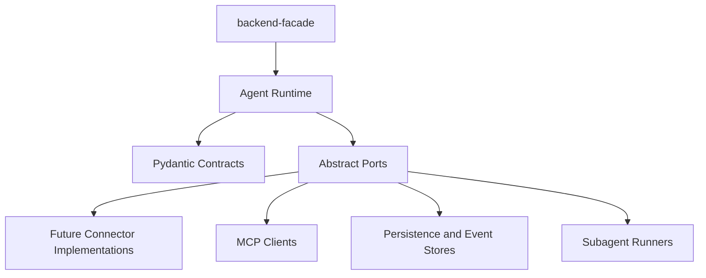

# Package Structure

## Current Package

The AI backend uses an installable `src` layout:

```text
services/ai-backend/
  pyproject.toml
  requirements.txt
  src/
    agent_runtime/
      __init__.py
      settings.py
      api/
        app.py
        contracts.py
        errors.py
        in_memory.py
        ports.py
        service.py
        streaming.py
      agent/
        contracts.py
        errors.py
        factory.py
        graph.py
        middleware/
        ports.py
        runtime.py
        state.py
        streaming.py
      memory/
      mcp/
      observability/
      persistence/
        postgres/
      skills/
      subagents/
      tools/
        builtin/
  tests/
    unit/
      agent_runtime/
        agent/
        memory/
        mcp/
        persistence/
        skills/
        subagents/
        tools/
```

## Module Ownership

- `api/`: narrow FastAPI runtime API exception for conversation, run, event replay, streaming, cancellation, and approval endpoints. It must stay thin over persistence, event store, and queue ports.
- `agent/`: Deep Agents factory, LangGraph graph exports, runtime wiring, stream normalization, dependency ports, and middleware composition.
- `tools/`: dynamic tool cards, full tool specs, and built-in loader tools. Tools should call connector interfaces, not raw SDKs.
- `skills/`: local Agent Skills bundles and skill discovery helpers. `SKILL.md` remains the source of truth.
- `mcp/`: MCP server cards, connection clients, tool/resource discovery, and failure classification.
- `memory/`: backend routing, scoped memory policy, token budget metrics, and summarization observability.
- `subagents/`: sync/async subagent definitions, task/result contracts, and handoff policy.
- `observability/`: redaction, trace, and correlation helpers shared by stream and compression contracts.
- `persistence/`: durable runtime records, PostgreSQL migration catalog, payload/checkpoint ports, and persistence constants.
- Future connector implementations should live outside the core runtime contracts and satisfy the existing provider/client/runner ports.
- Runtime API code stays thin and delegates to runtime services and ports. Product API ownership still belongs in `backend-facade`; the current FastAPI runtime API is the accepted narrow streaming-phase exception.

## Dependency Direction

High-level runtime modules depend on abstract ports and Pydantic contracts. Connector implementations depend on vendor SDKs. Domain contracts must not import connector SDKs.



## Testing Implication

The package structure must make it possible to unit test core behavior without Slack, Google Workspace, Atlassian, LangSmith, or live MCP servers. Fakes should satisfy the same interfaces as real implementations.

Unit tests mirror source ownership under `tests/unit/agent_runtime/<subpackage>/`.
Shared fakes and helpers should live in non-test helper modules, while concrete `test_*.py` files contain at most one test class.

