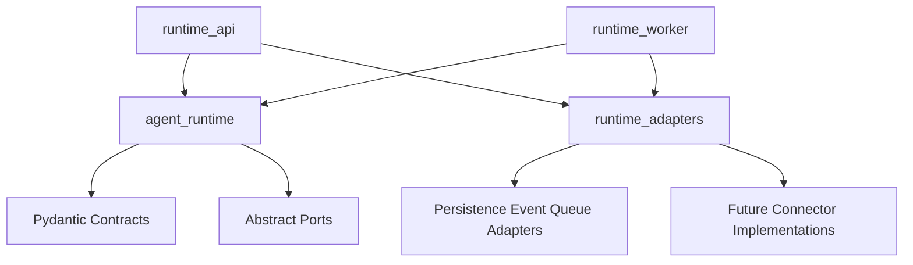

# Package Structure

## Current Package

The AI backend uses an installable `src` layout with one runtime-core package and small sibling packages for deployable surfaces and adapters:

```text
services/ai-backend/
  pyproject.toml
  requirements.txt
  src/
    agent_runtime/
      execution/
      capabilities/
        tools/
        mcp/
        skills/
      tools/
        # compatibility path; new code prefers capabilities/tools
      mcp/
        # compatibility path; new code prefers capabilities/mcp
      skills/
        # compatibility path; new code prefers capabilities/skills
      context/
        memory/
      memory/
        # compatibility path; new code prefers context/memory
      delegation/
        subagents/
      subagents/
        # compatibility path; new code prefers delegation/subagents
      events/
        normalization/
        contracts/
        projection/
      observability/
      persistence/
        records/
        schema/
        ports.py
      api/
        # compatibility imports plus runtime producer service/ports/events
    runtime_api/
      app.py
      http/
      schemas/
      sse/
    runtime_adapters/
      in_memory/
      postgres/
      queue/
    runtime_worker/
      handlers/
  tests/
    unit/
      agent_runtime/
      runtime_api/
      runtime_adapters/
      runtime_worker/
```

## Module Ownership

- `agent_runtime/`: reusable runtime domain and orchestration core. It owns execution contracts, Deep Agents/LangGraph wiring, capability discovery, context/memory policy, subagent delegation, event normalization, observability helpers, persistence records, and abstract ports.
- `runtime_api/`: deployable FastAPI surface for conversations, runs, event replay, SSE, cancellation, approvals, safe HTTP errors, and API request/response schemas.
- `runtime_adapters/`: concrete adapters for tests and local/production-style infrastructure, including deterministic in-memory persistence/event/queue behavior and the PostgreSQL runtime adapter.
- `runtime_worker/`: async runtime command consumer process and handlers for run, cancel, and approval-resolution commands.

Compatibility modules remain under older paths such as `agent_runtime.agent.*`, `agent_runtime.tools.*`, `agent_runtime.mcp.*`, `agent_runtime.skills.*`, `agent_runtime.memory.*`, `agent_runtime.subagents.*`, and `agent_runtime.api.contracts` so existing imports keep working during the migration. New code should prefer the canonical packages above.

## Canonical Import Paths

| Concern | New code should use | Compatibility paths |
| --- | --- | --- |
| Tool capabilities | `agent_runtime.capabilities.tools.*` | `agent_runtime.tools.*` |
| MCP capabilities | `agent_runtime.capabilities.mcp.*` | `agent_runtime.mcp.*` |
| Skills middleware and registries | `agent_runtime.capabilities.skills.*` | `agent_runtime.skills.*` |
| Context memory | `agent_runtime.context.memory.*` | `agent_runtime.memory.*` |
| Subagent delegation | `agent_runtime.delegation.subagents.*` | `agent_runtime.subagents.*` |
| Runtime API service and ports | `agent_runtime.api.*` | selected legacy contract re-exports |

Do not add new behavior only to a compatibility path. If a compatibility module
is still needed, keep it as a thin import wrapper over the canonical package.

## Dependency Direction

High-level runtime modules depend on abstract ports and Pydantic contracts. Deployable API and worker packages compose runtime services with concrete adapters. Connector implementations depend on vendor SDKs; domain contracts must not import connector SDKs.



## Testing Implication

Unit tests mirror source ownership:

- Runtime-domain behavior stays under `tests/unit/agent_runtime/`.
- FastAPI route and schema behavior lives under `tests/unit/runtime_api/`.
- Concrete adapter behavior lives under `tests/unit/runtime_adapters/`.
- New capability tests should mirror the canonical package when practical, for
  example `tests/unit/agent_runtime/capabilities/skills/`. Existing tests under
  compatibility-oriented folders may remain until the migration is complete, but
  they should import canonical modules when covering new behavior.

Shared fakes and helpers should live in non-test helper modules, while concrete `test_*.py` files contain focused behavior tests.
