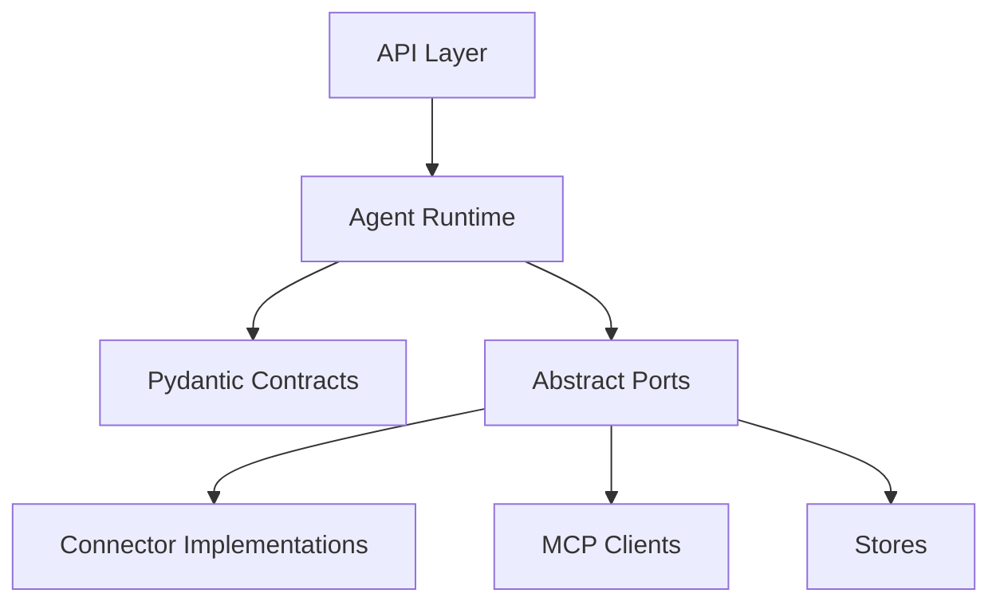

# Package Structure

## Target Package

The AI backend uses an installable `src` layout:

```text
services/ai-backend/
  pyproject.toml
  langgraph.json
  src/
    agent_runtime/
      settings.py
      app/
      agent/
      connectors/
      memory/
      mcp/
      skills/
      tools/
      subagents/
  tests/
    unit/
```

## Module Ownership

- `agent/`: Deep Agents factory, LangGraph graph exports, runtime wiring, stream normalization, and middleware composition.
- `tools/`: dynamic tool cards, full tool specs, and built-in loader tools. Tools should call connector interfaces, not raw SDKs.
- `skills/`: local Agent Skills bundles and skill discovery helpers. `SKILL.md` remains the source of truth.
- `mcp/`: MCP server cards, connection clients, tool/resource discovery, and failure classification.
- `memory/`: backend routing, scoped memory policy, token budget metrics, and summarization observability.
- `subagents/`: sync/async subagent definitions, task/result contracts, and handoff policy.
- `connectors/`: Slack, Google Workspace, Atlassian, and internal API adapters behind typed ports.
- `app/`: future API layer. It should be thin and delegate to runtime services.

## Dependency Direction

High-level runtime modules depend on abstract ports and Pydantic contracts. Connector implementations depend on vendor SDKs. Domain contracts should not import connector SDKs.



## Testing Implication

The package structure must make it possible to unit test core behavior without Slack, Google Workspace, Atlassian, LangSmith, or live MCP servers. Fakes should satisfy the same interfaces as real implementations.

