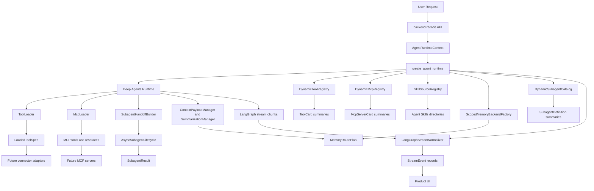

# System Overview

## Current State

The AI backend is now an implemented Python runtime layer for an enterprise AI work surface. It owns agent orchestration, typed capability discovery, lazy loading, memory policy, subagent delegation, and product-safe stream events. Product APIs still belong in `backend-facade`; durable business state and connector ownership still belong in sibling backend services.

The runtime does not yet include production Slack, Google Workspace, Atlassian, Jira, or internal API adapters. Those systems are represented by typed tool, MCP, and subagent boundaries that can be satisfied by fakes in unit tests and real adapters later.

## Runtime Architecture

## Implementation Boundaries

- `agent/` owns runtime construction, runtime context parsing, LangGraph export shape, stream normalization, and typed runtime errors.
- `tools/` owns compact tool cards, full tool specs, permission checks, lazy full-spec loading, and safe load failures.
- `skills/` owns Agent Skills-compatible `SKILL.md` manifest parsing, source precedence, directory wiring, and access policy for main agents and subagents.
- `mcp/` owns MCP server cards, client protocol boundaries, dynamic server load, descriptor validation, collisions, health, auth, timeout, and budget failures.
- `memory/` owns scoped memory routes, read/write policy, user/org/agent namespaces, token budgets, offloading, summarization fallback, compression events, and optimistic concurrency fakes.
- `subagents/` owns model-visible subagent definitions, compact handoffs, async task state, lifecycle operations, result contracts, and timeout/stale/cancelled handling.
- `observability/` owns redaction and trace helpers used by stream and compression contracts.

## What Works Today

- A request can be converted into an `AgentRuntimeContext` with normalized identity, roles, scopes, model profile, feature flags, and trace ID.
- `create_agent_runtime` wires injected registries, stores, catalogs, and stream normalizers into a Deep Agents runtime without importing connector SDKs.
- Tool and MCP listings expose compact, permission-filtered cards first. Full schemas and descriptors load only after explicit selection and permission re-check.
- Skills are discovered from configured Agent Skills directories and passed to Deep Agents in deterministic precedence order.
- Memory routing isolates user memory by user ID, keeps organization policy memory read-only to conversational actors, and supports offloading or fallback summaries when context is too large.
- Subagents receive compact `SubagentTask` handoffs instead of raw conversation history and return `SubagentResult` with both execution and plan summaries.
- LangGraph stream chunks normalize into stable `StreamEvent` contracts with source, type, trace correlation, parent task IDs, and redacted payloads.
- Unit tests use fake model builders, fake tool providers, fake MCP clients, fake memory stores, fake subagent runners, and fake stream chunks. No tests require live LLMs or external credentials.

## Current Non-Goals

- No production connector SDK calls in the runtime package.
- No final product API shape in `services/ai-backend`.
- No durable production persistence selection.
- No custom replacement for Deep Agents' native context compression until production behavior is measured.
- No side-effecting model action without typed parsing, permission checks, and connector-layer implementation.

