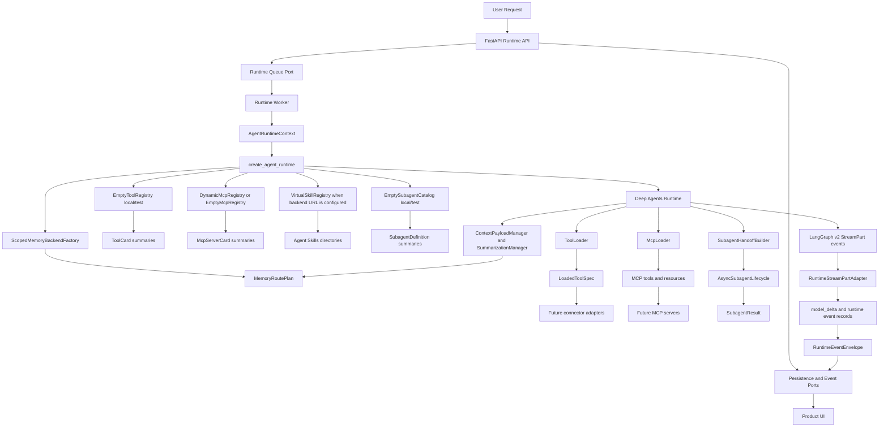

# System Overview

## Current State

The AI backend is now an implemented Python runtime layer for an enterprise AI work surface. It owns agent orchestration, typed capability discovery, lazy loading, memory policy, subagent delegation, product-safe stream events, a narrow FastAPI runtime API, and PostgreSQL-compatible runtime persistence contracts/schema. Product APIs still belong in `backend-facade`; durable non-agent business state and connector ownership still belong in sibling backend services.

The runtime does not yet include production Slack, Google Workspace, Atlassian, Jira, or internal API adapters. Those systems are represented by typed tool, MCP, and subagent boundaries that can be satisfied by fakes in unit tests and real adapters later.

## Runtime Architecture

## Implementation Boundaries

- `agent_runtime/execution/` owns runtime construction, direct Deep Agents builder wiring, runtime context parsing, LangGraph export shape, invocation helpers, state, and typed runtime errors.
- `agent_runtime/capabilities/` owns dynamic tools, MCP server loading, and Agent Skills discovery/policy.
- `agent_runtime/context/` owns scoped memory routes, read/write policy, token budgets, offloading, summarization fallback, and compression events.
- `agent_runtime/delegation/` owns model-visible subagent definitions, compact handoffs, async task state, lifecycle operations, result contracts, and timeout/stale/cancelled handling.
- `agent_runtime/events/` owns runtime event-domain helpers.
- `agent_runtime/observability/` owns redaction and trace helpers used by streams and persistence contracts.
- `agent_runtime/persistence/` owns durable runtime records, abstract persistence ports, and PostgreSQL-compatible schema catalogs.
- `runtime_api/` owns the narrow FastAPI runtime API, safe HTTP errors, request/response schemas, and replay/SSE transport.
- `runtime_adapters/` owns concrete in-memory and PostgreSQL adapters for persistence, event storage, and queue semantics.
- `runtime_worker/` owns the async runtime command consumer process, run/cancel/approval handlers, and mapping of runtime stream chunks into API events.

## What Works Today

- A request can be converted into an `AgentRuntimeContext` with normalized identity, roles, scopes, model profile, feature flags, and trace ID.
- `create_agent_runtime` resolves authorized registries, stores, and catalogs, then hands an explicit build request to the concrete Deep Agents builder without importing connector SDKs.
- MCP listings expose compact, permission-filtered cards when `MCP_BACKEND_REGISTRY_URL` is configured. Local/test mode uses empty registries by default; production must configure MCP or skill backends or explicitly set `RUNTIME_ALLOW_EMPTY_CAPABILITIES=true`.
- Skills are discovered from configured Agent Skills directories and passed to Deep Agents in deterministic precedence order.
- Memory routing isolates user memory by user ID, keeps organization policy memory read-only to conversational actors, and supports offloading or fallback summaries when context is too large.
- Subagents receive compact `SubagentTask` handoffs instead of raw conversation history and return `SubagentResult` with both execution and plan summaries.
- The worker consumes documented LangGraph v2 `StreamPart` chunks through `RuntimeStreamPartAdapter`, parses Deep Agents namespaces such as `tools:<id>`, projects tool/subagent/progress activity into runtime envelopes, and surfaces provider text chunks as `model_delta` runtime envelopes with text in `payload.delta`.
- FastAPI endpoints create conversations, enqueue runs, replay events, stream live/replayed SSE runtime envelopes, request cancellation, and resolve approvals through thin service/port boundaries.
- Runtime event envelopes provide ordered per-run sequence numbers, UI timeline fields, redacted payloads, and replay cursors.
- Persistence contracts, the PostgreSQL adapter, and the initial PostgreSQL migration cover conversations, messages, runs, events, outbox commands, async tasks, subagent results, tool invocations, approvals, memory metadata, payload refs, compression events, capability snapshots, audit records, and checkpoints.
- Unit tests use fake model builders, fake tool providers, fake MCP clients, fake memory stores, fake subagent runners, and fake stream chunks. No tests require live LLMs or external credentials.

## Current Non-Goals

- No production connector SDK calls in the runtime package.
- No broad product API ownership in `services/ai-backend` beyond the narrow runtime API exception.
- No external broker, deployed production worker service, or connector adapter implementation yet.
- No custom replacement for Deep Agents' native context compression until production behavior is measured.
- No side-effecting model action without typed parsing, permission checks, and connector-layer implementation.

