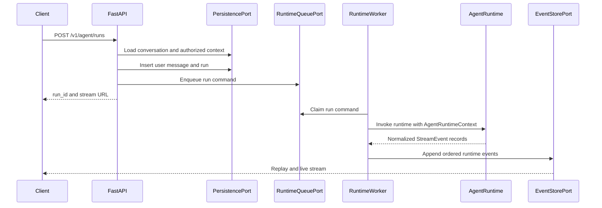

# PRD: FastAPI Runtime API

## Purpose

Define the first product-facing FastAPI surface for the agent runtime so web, macOS, and Windows clients can submit user input, resume conversations, stream runtime progress, and receive grounded final responses.

This PRD is documentation-only. Implementation comes in later rounds.

## Boundary Exception

The workspace default is that apps call `backend-facade`, and `ai-backend` exposes contracts to that facade. This API is a narrow approved exception for the runtime streaming phase: `services/ai-backend` may expose a FastAPI surface directly while the product facade is not implemented.

The exception is intentionally limited:

- It may expose agent conversations, runs, events, streaming, cancellation, and runtime approvals.
- It must not become the source of truth for enterprise tenant auth, billing, admin workflows, or non-agent product state.
- It must accept normalized user, org, role, permission, and connector scopes as `AgentRuntimeContext` input.
- It must keep all public request and response shapes Pydantic-first and stable enough to move behind `backend-facade` later.

## Problem

The runtime can already create typed agent contexts, load authorized capabilities, manage context and memory, delegate to subagents, and normalize stream events. There is no documented HTTP API that a frontend or native app can call to:

- Send a user message.
- Load prior conversation history.
- Start a runtime run.
- Stream progress, tool, subagent, approval, error, and final-response events.
- Replay events after reconnect.
- Cancel long-running work.
- Persist enough state for auditability and resumability.

## Goals

- Provide a clear FastAPI contract for user input and runtime streaming.
- Support web, macOS, and Windows clients without app-specific API forks.
- Persist conversations, messages, runs, stream events, async tasks, approvals, memory metadata, and audit records.
- Use a producer/consumer runtime model so HTTP request handling stays separate from long-running agent execution.
- Use HTTP streaming first with an event envelope that can later be carried over WebSocket.
- Preserve the existing `agent_runtime` contracts: `AgentRuntimeContext`, `RuntimeDependencies`, `RuntimeErrorEnvelope`, `StreamEvent`, subagent task state, and memory policy.
- Keep database, queue, event store, and object storage concerns behind ports.

## Non-Goals

- Build the implementation in this round.
- Replace the future `backend-facade` or core `backend` services.
- Define production enterprise SSO, SCIM, billing, admin, or tenant lifecycle management.
- Let apps parse raw LangGraph stream tuples.
- Store raw secrets, unredacted connector payloads, or oversized tool outputs inline in events.
- Depend on a Supabase-only, vendor-specific runtime API. Supabase may be a managed PostgreSQL provider, but the runtime should target portable PostgreSQL contracts.

## Users

- End users who submit natural-language work requests and expect progress visibility.
- Web and native app clients that need one stable runtime API contract.
- Operators who need audit trails for tool calls, approvals, subagents, memory writes, and runtime failures.
- Future backend-facade implementation agents that need a clean internal API to wrap or migrate.

## Product Principles

- Trust through transparency: stream meaningful progress, tool use, subagent updates, source references, approval requests, and final answers.
- Permission-first: only load and expose capabilities allowed by the supplied runtime context.
- Context discipline: load prior conversation history deliberately, summarize or offload large payloads, and avoid passing full history to subagents by default.
- Contract-first engineering: every API input, output, event, and error is typed.
- Replayability: every client-visible event can be replayed by sequence number after reconnect.

## API Capabilities

### Conversation Management

The API must allow clients to create, resume, inspect, and paginate conversations.

Required endpoints:

- `POST /v1/agent/conversations`
- `GET /v1/agent/conversations/{conversation_id}`
- `GET /v1/agent/conversations/{conversation_id}/messages`

Conversation state must include `conversation_id`, `org_id`, `user_id`, `assistant_id`, status, timestamps, and schema version.

### Run Submission

The API must accept user input, load conversation history from persistence, create a user message, create an agent run, enqueue work for a runtime consumer, and return enough information for the client to attach to the stream.

Required endpoint:

- `POST /v1/agent/runs`

The endpoint must support idempotency so client retries do not create duplicate runs for the same user input.

### Run Status And Cancellation

Clients must be able to inspect and cancel long-running work.

Required endpoints:

- `GET /v1/agent/runs/{run_id}`
- `POST /v1/agent/runs/{run_id}/cancel`

Cancellation is best-effort. The run state should distinguish `cancelling`, `cancelled`, `completed`, `failed`, and `timed_out`.

### Event Replay And Streaming

Clients must be able to replay historical events and follow live events.

Required endpoints:

- `GET /v1/agent/runs/{run_id}/events?after_sequence=N`
- `GET /v1/agent/runs/{run_id}/stream?after_sequence=N`

The first streaming transport should be HTTP streaming. Server-Sent Events are acceptable if the implementation wants browser-native event framing; newline-delimited JSON is also acceptable if clients share a generated parser. In both cases, the semantic payload is the same versioned event envelope.

### Approvals

Side-effecting tool calls must be able to pause for explicit user approval.

Required endpoint:

- `POST /v1/agent/approvals/{approval_id}/decision`

Approval decisions must be persisted and correlated to run, tool invocation, user, org, and audit records.

## HTTP Streaming First

HTTP streaming should be the first transport because the initial interaction pattern is mostly request plus server progress:

1. Client posts a user input.
2. Server returns `run_id` and stream URL.
3. Client opens a stream.
4. Runtime emits progress, tool, subagent, approval, error, and final events.

This works well with enterprise proxies, load balancers, web apps, and native apps. WebSocket should be added later only when the product needs frequent bidirectional messages on the same connection, such as collaborative sessions, live client-side context updates, or low-latency runtime control beyond cancellation and approvals.

## Client Compatibility

The API must support:

- Browser clients using `fetch` streaming or `EventSource` if SSE is selected.
- macOS and Windows clients using standard HTTP clients with streaming response support.
- Reconnect with `after_sequence` when the app is suspended, the network changes, or a desktop client resumes from sleep.
- Future WebSocket adapter using the same event envelope and sequence semantics.

## Request Lifecycle

## Data Requirements

The API must persist enough state to reconstruct and audit a run:

- Conversation metadata.
- Ordered user, assistant, tool, and system messages.
- Run status and runtime configuration.
- Append-only stream events.
- Async subagent task state and results.
- Tool invocation status and redacted arguments/results.
- Approval requests and decisions.
- Memory scope and memory item metadata.
- Context payload references for large/offloaded data.
- Capability snapshots available to the model during a run.
- Audit records for user-visible and security-relevant actions.

## Security And Privacy

- Every request must be scoped by `org_id` and `user_id`.
- Tenant auth source of truth remains outside this exception.
- Authorization context must be validated into `AgentRuntimeContext` before runtime invocation.
- Events must be redacted before persistence and emission.
- Unredacted secrets must not be stored in messages, events, logs, audit records, or Docker images.
- Approval-requiring actions must not execute until a typed approval decision is accepted.
- APIs must return `RuntimeErrorEnvelope`-style safe errors, not raw connector, model provider, or database exceptions.

## Observability

The API must preserve:

- `trace_id` across request, run, runtime events, tool calls, subagents, and audit records.
- Ordered event sequence numbers for replay and debugging.
- Safe run status transitions.
- Metrics for run duration, event lag, queue lag, stream disconnects, cancellation latency, approval latency, and runtime failure classes.

## Acceptance Criteria

- The API contract covers conversation creation, message history, run submission, run status, event replay, HTTP streaming, cancellation, and approvals.
- The docs state the `ai-backend` boundary exception and its limits.
- The streaming transport is HTTP-first with a future WebSocket adapter using the same event envelope.
- The API depends on modular persistence, queue, event store, and object storage ports.
- Every client-visible error maps to a safe typed error envelope.
- No implementation code is required by this PRD.
