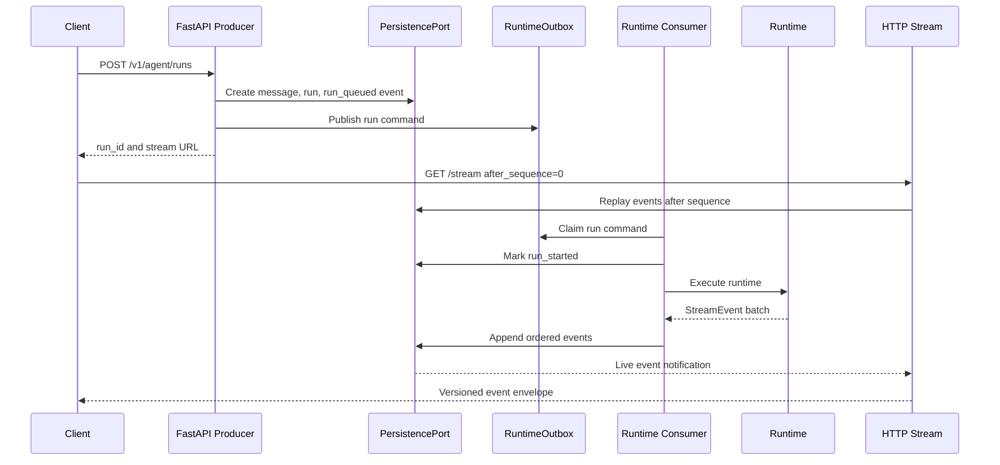

# PRD: Runtime Events Producer/Consumer

## Purpose

Define the event-based producer/consumer model for FastAPI runtime runs. The API should accept user input quickly, persist a durable run command, let workers execute the agent runtime, and stream ordered, replayable, redacted events to clients.

This PRD is documentation-only. Implementation comes in later rounds.

## Problem

Agent runs can be long-running, stream many intermediate events, launch subagents, wait for approvals, call external capabilities, and fail partially. A synchronous request/response API would tie client connections to runtime execution too tightly and make retries, reconnects, cancellation, and audit trails fragile.

The runtime needs durable state transitions and client-visible event history without exposing raw LangGraph internals.

## Goals

- Separate request acceptance from runtime execution.
- Persist all client-visible events before or as they are emitted.
- Support HTTP streaming first and WebSocket later with the same event protocol.
- Allow replay from `after_sequence` after reconnect or client resume.
- Support cancellation, timeout, retry, and worker recovery.
- Preserve `trace_id`, `run_id`, `conversation_id`, `parent_task_id`, and event sequence correlation.
- Keep producer, queue, worker, event store, and stream fanout behind typed ports.

## Non-Goals

- Choose a final distributed queue vendor in this PRD.
- Require WebSocket from day one.
- Use in-memory queues as durable production state.
- Let clients consume raw runtime chunks or raw LangGraph namespace tuples.
- Guarantee exactly-once external side effects. The design should provide idempotency and durable audit records, but connector behavior still needs connector-specific idempotency.

## Event Model

The runtime already normalizes LangGraph output into `StreamEvent`. The API layer wraps each `StreamEvent` in a transport envelope so clients receive ordered, replayable events.

Required envelope fields:

- `event_protocol_version`
- `event_id`
- `run_id`
- `conversation_id`
- `sequence_no`
- `source`
- `event_type`
- `trace_id`
- `parent_event_id`
- `span_id`
- `parent_span_id`
- `parent_task_id`
- `task_id`
- `subagent_id`
- `display_title`
- `summary`
- `status`
- `visibility`
- `redaction_state`
- `payload`
- `metadata`
- `created_at`

Design rules:

- `sequence_no` is monotonically increasing per `run_id`.
- `(run_id, sequence_no)` is unique.
- Events are append-only after emission.
- Payload and metadata are redacted before persistence and streaming.
- Unknown additive fields must not break older clients.
- Breaking changes require a new `event_protocol_version`.

## Activity Timeline UI Requirements

The long-term client should support a Claude App or Cursor-style activity timeline where users can see what the main agent, subagents, tools, approvals, and final response are doing while a run executes.

The event stream must therefore carry enough presentation semantics for clients to render a timeline without reverse-engineering raw payloads:

- `span_id` and `parent_span_id` group related events, such as a tool call lifecycle or a subagent task lifecycle.
- `parent_event_id` links follow-up updates to the event they refine.
- `task_id` and `subagent_id` identify delegated work without requiring clients to parse payload JSON.
- `display_title` is a short UI label, such as `Calling Google Drive`, `Researcher is checking Jira`, or `Drafting final answer`.
- `summary` is a one-phrase product-safe summary for a reasoning step, subagent update, tool status, approval, or observation.
- `status` is a stable UI lifecycle state such as `queued`, `started`, `running`, `waiting`, `completed`, `failed`, or `cancelled`.
- `visibility` distinguishes `user`, `internal`, and `audit` events so clients can hide internal-only details while operators can retain auditability.
- `redaction_state` tells clients whether the payload is `redacted`, `truncated`, or `offloaded`.

Reasoning visibility must use safe summaries only. The backend must not stream or persist raw chain-of-thought, hidden scratchpads, model provider reasoning tokens, or private prompt text as client-visible events. If the UI wants to show a thinking process, the runtime should emit explicit `reasoning_summary` or `reasoning_summary_delta` events whose payload contains concise, product-safe summaries generated for display.

The UI-oriented fields are additive and optional for older clients, but new producers should populate them whenever the event represents user-visible progress, a tool/function call, a subagent lifecycle change, an approval, or a final-response section.

## Producer/Consumer Roles

### FastAPI Producer

The FastAPI request handler is responsible for:

- Validating request input.
- Validating or receiving `AgentRuntimeContext`.
- Loading conversation state and recent message history.
- Persisting the user message.
- Creating the `agent_runs` record.
- Creating an initial `runtime_events` record such as `run_queued`.
- Writing a durable command to the queue or outbox.
- Returning `run_id`, `conversation_id`, and stream URL.

The request handler must not perform long-running runtime execution inline.

### Runtime Consumer

The runtime worker is responsible for:

- Claiming a queued run command.
- Marking the run `running`.
- Building runtime dependencies from ports.
- Invoking the runtime with scoped conversation history and `AgentRuntimeContext`.
- Persisting every normalized stream event.
- Updating run, message, tool invocation, subagent, memory, and approval state.
- Marking the run terminal: `completed`, `failed`, `cancelled`, or `timed_out`.

### Stream Adapter

The stream adapter is responsible for:

- Replaying persisted events after `after_sequence`.
- Subscribing to live events for the run.
- Sending heartbeats during idle periods.
- Closing after terminal events.
- Returning safe errors if the run or tenant scope is invalid.

The stream adapter does not own runtime execution.

## Lifecycle

Required run states:

- `queued`
- `running`
- `waiting_for_approval`
- `cancelling`
- `cancelled`
- `completed`
- `failed`
- `timed_out`

Required event types at the API layer:

- `run_queued`
- `run_started`
- `progress`
- `reasoning_summary`
- `reasoning_summary_delta`
- `tool_call`
- `tool_call_started`
- `tool_call_delta`
- `tool_result`
- `tool_call_completed`
- `subagent_update`
- `subagent_started`
- `subagent_progress`
- `subagent_completed`
- `approval_requested`
- `approval_resolved`
- `observation`
- `error`
- `final_response`
- `run_completed`
- `run_cancelled`
- `run_failed`
- `heartbeat`

These API event types should map to or wrap the existing runtime `StreamEventType` values without exposing raw runtime internals.

## Request And Stream Flow

## Reconnect And Replay

Clients must treat the event stream as resumable:

1. Store the highest `sequence_no` received per `run_id`.
2. Reconnect with `after_sequence` after a network drop, page refresh, app resume, or process restart.
3. Receive any missed persisted events first.
4. Continue with live events.

Server requirements:

- If `after_sequence` is older than retention allows, return a safe replay-window error and advise the client to refresh run state.
- If `after_sequence` is greater than the latest event, stream heartbeats until new events arrive or the run is terminal.
- If the run is terminal, replay remaining events and close cleanly.

## Cancellation

Cancellation is a command, not a direct mutation from the stream connection.

Flow:

1. Client calls `POST /v1/agent/runs/{run_id}/cancel`.
2. API verifies tenant/user scope and run state.
3. API persists a cancellation request and emits `run_cancelling`.
4. Worker observes cancellation through queue, run state polling, or runtime cancellation hook.
5. Worker stops runtime work when safe, marks `cancelled`, and emits `run_cancelled`.

If work already completed, cancellation should return the terminal run state without changing emitted events.

## Approval Pauses

When a tool invocation requires user approval:

- Worker persists `runtime_approval_requests`.
- Worker emits `approval_requested`.
- Run enters `waiting_for_approval`.
- Client posts an approval decision.
- API persists decision and emits `approval_resolved`.
- Worker resumes or cancels the blocked action based on the decision.

Approval requests must have expiration and audit records.

## Backpressure

The system must avoid unbounded memory growth when runtime events are faster than clients can consume them.

Required behavior:

- Persist events durably before fanout.
- Bound live in-memory subscriber buffers.
- Drop live fanout for slow clients only after events are durable and replayable.
- Let clients reconnect with `after_sequence` to catch up.
- Redact and truncate oversized payloads before event persistence.
- Store large payloads by reference in context payload storage.

## Worker Recovery

The queue/outbox must support claiming, lock expiration, retry attempts, and dead-letter handling.

Required behavior:

- A worker claim has `locked_by` and `lock_expires_at`.
- If a worker dies before terminal state, another worker may reclaim after lock expiration.
- Run commands are idempotent by `run_id`.
- Event append is idempotent by `(run_id, sequence_no)` or deterministic event IDs when retrying a known event.
- Failed retries eventually mark the run `failed` with a safe error envelope.

## Transport Decision

Use HTTP streaming first.

Reasons:

- The current flow is mostly server-to-client after the user submits input.
- Reconnect and replay are simpler with regular HTTP.
- Enterprise proxies and load balancers handle HTTP streaming more predictably than long-lived WebSockets.
- Web, macOS, and Windows clients can all consume streaming HTTP.

Add WebSocket later when the product needs bidirectional traffic on the same connection, such as live collaborative control, local desktop context uploads during a run, or frequent low-latency user interrupts. The WebSocket adapter must reuse the same event envelope, `sequence_no`, and replay semantics.

## Queue Options

The PRD should not lock the implementation to one queue. Acceptable implementation path:

- Start with a PostgreSQL-backed outbox for durability and simplicity.
- Add Redis Streams, Kafka, SQS, or another queue behind `RuntimeQueuePort` when scale or operational ownership requires it.
- Keep `runtime_outbox_events` as an audit and recovery mechanism even if a separate broker is introduced.

## Observability

Track:

- Queue lag from `run_queued` to `run_started`.
- Runtime duration and terminal state.
- Event append latency.
- Stream subscriber count.
- Stream disconnect count.
- Replay count and replay lag.
- Slow consumer drops.
- Worker retry count.
- Approval wait time.
- Cancellation latency.

## Acceptance Criteria

- Runs are accepted quickly and executed by consumers outside the request handler.
- Every streamable event is persisted with ordered per-run sequence numbers.
- Clients can replay after reconnect using `after_sequence`.
- Cancellation, approval, worker retry, and terminal failure flows are documented.
- HTTP streaming is the first transport, with a clear WebSocket upgrade path.
- Queue and fanout implementation details stay behind typed ports.
