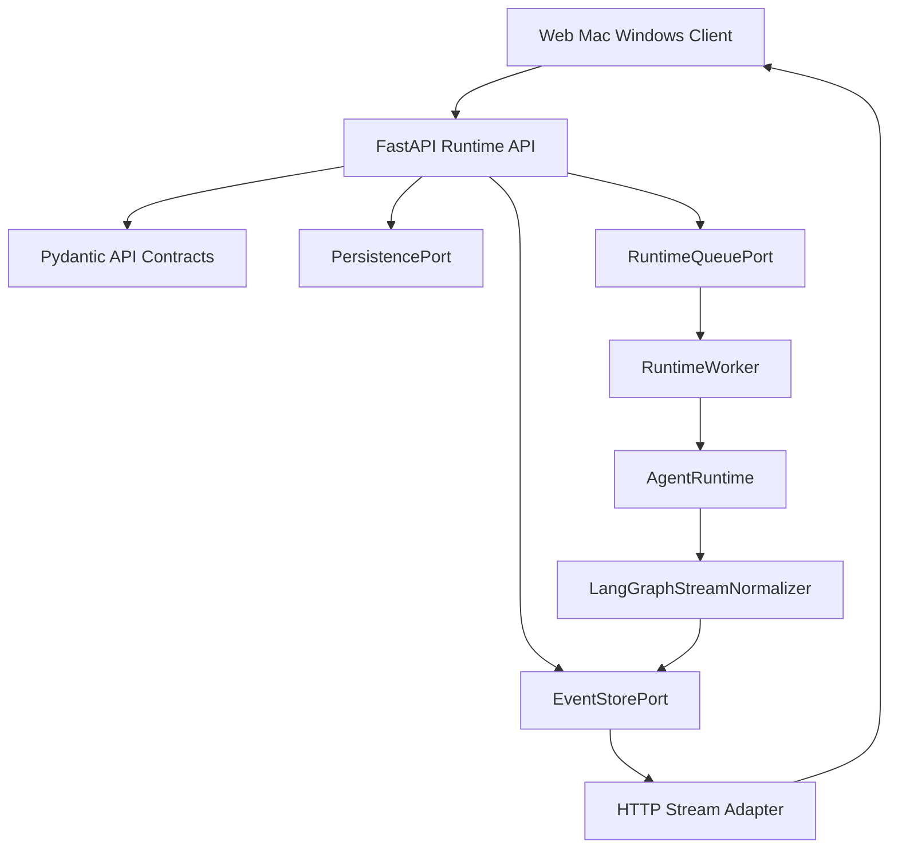

# Spec: FastAPI Runtime API

## Purpose

Define the technical contract for the FastAPI runtime API described by the runtime API, producer/consumer, and persistence PRDs.

This spec now has an initial in-process implementation for the FastAPI producer
surface. PostgreSQL repositories, durable worker claiming, and production queue
adapters remain later implementation rounds.

## Architecture

The FastAPI API is a narrow product-facing exception inside `services/ai-backend` until `backend-facade` exists. The API layer must stay thin: validate HTTP contracts, coordinate persistence and queue ports, adapt normalized runtime events to a transport envelope, and return safe errors.



## Module Ownership

Future implementation should use clear module boundaries:

- `api/app.py`: v1 route registration for conversation, message, run, stream, cancellation, and approval endpoints.
- `api/contracts.py`: API-specific Pydantic request and response contracts.
- `api/errors.py`: HTTP mapping for safe runtime error envelopes.
- `api/streaming.py`: HTTP stream transport adapter.
- `api/ports.py`: persistence, event store, and runtime queue protocols used by the API producer.
- `api/service.py`: thin orchestration over persistence, event store, and queue ports.
- `api/in_memory.py`: deterministic in-memory ports for unit tests and local development.
- `persistence/ports.py`: future payload, checkpoint, and PostgreSQL-specific persistence protocols.
- `persistence/postgres/`: PostgreSQL implementation in later implementation rounds.
- `workers/runtime_worker.py`: runtime consumer loop in later implementation rounds.

The API layer must not import connector SDKs directly.

## Endpoint Contracts

### `POST /v1/agent/conversations`

Creates a conversation shell or resumes one when an idempotency key maps to an existing conversation.

Request contract:

- `org_id`
- `user_id`
- `assistant_id`
- `title`
- `metadata`
- `idempotency_key`

Response contract:

- `conversation_id`
- `org_id`
- `user_id`
- `assistant_id`
- `status`
- `created_at`
- `updated_at`
- `schema_version`

### `GET /v1/agent/conversations/{conversation_id}`

Returns conversation metadata for the authenticated tenant scope.

Response contract:

- `conversation_id`
- `org_id`
- `user_id`
- `assistant_id`
- `title`
- `status`
- `created_at`
- `updated_at`
- `archived_at`
- `metadata`
- `schema_version`

### `GET /v1/agent/conversations/{conversation_id}/messages`

Returns paginated message history.

Query parameters:

- `before`
- `after`
- `limit`
- `include_deleted`

Response contract:

- `conversation_id`
- `messages`
- `next_cursor`
- `has_more`

### `POST /v1/agent/runs`

Creates a run for a user input.

Request contract:

- `conversation_id`
- `user_input`
- `content_format`
- `idempotency_key`
- `runtime_context`
- `request_options`

`runtime_context` must validate into the existing `AgentRuntimeContext` shape:

- `user_id`
- `org_id`
- `roles`
- `permission_scopes`
- `connector_scopes`
- `model_profile`
- `request_id`
- `run_id`
- `trace_id`
- `parent_trace_id`
- `trace_metadata`
- `feature_flags`

Response contract:

- `run_id`
- `conversation_id`
- `user_message_id`
- `trace_id`
- `status`
- `stream_url`
- `events_url`
- `created_at`

### `GET /v1/agent/runs/{run_id}`

Returns current run state.

Response contract:

- `run_id`
- `conversation_id`
- `org_id`
- `user_id`
- `status`
- `trace_id`
- `started_at`
- `completed_at`
- `cancelled_at`
- `safe_error`
- `latest_sequence_no`

### `GET /v1/agent/runs/{run_id}/events?after_sequence=N`

Returns persisted events after a sequence number.

Response contract:

- `run_id`
- `events`
- `latest_sequence_no`
- `run_status`
- `has_more`

### `GET /v1/agent/runs/{run_id}/stream?after_sequence=N`

Streams replayed and live runtime events over HTTP.

Transport requirements:

- Send events in ascending `sequence_no`.
- Replay persisted events before live events.
- Send heartbeat events during idle periods.
- Close after terminal run events.
- Surface safe replay-window errors when old events are no longer available.

### `POST /v1/agent/runs/{run_id}/cancel`

Requests cancellation.

Request contract:

- `reason`
- `requested_by_user_id`

Response contract:

- `run_id`
- `status`
- `cancel_requested_at`
- `latest_sequence_no`

### `POST /v1/agent/approvals/{approval_id}/decision`

Accepts or rejects a pending approval.

Request contract:

- `decision`
- `decided_by_user_id`
- `reason`

Response contract:

- `approval_id`
- `run_id`
- `status`
- `decided_at`

## Pydantic Contracts

Required API contracts:

- `CreateConversationRequest`
- `ConversationResponse`
- `MessageListResponse`
- `CreateRunRequest`
- `CreateRunResponse`
- `RunStatusResponse`
- `RuntimeEventEnvelope`
- `RuntimeEventReplayResponse`
- `CancelRunRequest`
- `CancelRunResponse`
- `ApprovalDecisionRequest`
- `ApprovalDecisionResponse`
- `ApiErrorResponse`

Required persistence contracts:

- `ConversationRecord`
- `MessageRecord`
- `RunRecord`
- `RuntimeEventRecord`
- `OutboxEventRecord`
- `ConsumerCursorRecord`
- `AsyncTaskRecord`
- `SubagentResultRecord`
- `ToolInvocationRecord`
- `ApprovalRequestRecord`
- `MemoryScopeRecord`
- `MemoryItemRecord`
- `ContextPayloadRecord`
- `CompressionEventRecord`
- `CapabilitySnapshotRecord`
- `AuditLogRecord`
- `CheckpointRecord`

Required command contracts:

- `CreateRunCommand`
- `CancelRunCommand`
- `ResumeRunCommand`
- `ApprovalResolvedCommand`
- `RuntimeWorkerClaim`
- `RuntimeWorkerResult`

All contracts should forbid unexpected fields unless the model explicitly defines an additive metadata object.

## Runtime Event Envelope

The transport envelope wraps a normalized runtime event:

- `event_protocol_version`
- `event_id`
- `run_id`
- `conversation_id`
- `sequence_no`
- `source`
- `event_type`
- `trace_id`
- `parent_event_id`
- `span_id`
- `parent_span_id`
- `parent_task_id`
- `task_id`
- `subagent_id`
- `display_title`
- `summary`
- `status`
- `visibility`
- `redaction_state`
- `payload`
- `metadata`
- `created_at`

Rules:

- `payload` and `metadata` must be redacted.
- `event_protocol_version` starts at `1`.
- `sequence_no` is per run.
- `event_id` should remain stable for replay.
- `span_id` groups lifecycle events for the same tool call, subagent task, approval, or reasoning step.
- `display_title` and `summary` are product-safe UI labels, not raw model reasoning.
- `reasoning_summary` and `reasoning_summary_delta` are allowed; raw chain-of-thought, provider reasoning tokens, and hidden scratchpads are not client-visible payloads.
- Tool and subagent lifecycle events should use granular API event types such as `tool_call_started`, `tool_call_completed`, `subagent_started`, `subagent_progress`, and `subagent_completed`.
- API clients must not rely on raw LangGraph event shape.
- WebSocket, if added later, must carry this same envelope.

## Port Contracts

### `PersistencePort`

Required operations:

- `create_conversation`
- `get_conversation`
- `list_messages`
- `create_run_with_user_message`
- `get_run`
- `request_cancel`
- `record_approval_decision`
- `write_audit_log`

### `EventStorePort`

Required operations:

- `append_event`
- `append_events`
- `list_events_after`
- `get_latest_sequence`
- `subscribe_run_events`

### `RuntimeQueuePort`

Required operations:

- `enqueue_run`
- `enqueue_cancel`
- `enqueue_approval_resolved`
- `claim_next`
- `mark_complete`
- `mark_retry`
- `mark_dead_letter`

### `PayloadStoragePort`

Required operations:

- `put_payload`
- `get_payload_ref`
- `delete_expired_payloads`

### `CheckpointStorePort`

Required operations:

- `save_checkpoint_ref`
- `load_checkpoint_ref`
- `list_thread_checkpoints`

## Error Handling

The API must return safe errors only.

HTTP mapping:

- Validation error: `400`
- Authentication missing: `401`
- Permission denied: `403`
- Conversation, run, approval, or event not found: `404`
- Idempotency conflict: `409`
- Replay window expired: `410`
- Rate or concurrency limit exceeded: `429`
- Runtime dependency failure: `503`
- Unexpected safe fallback: `500`

`ApiErrorResponse` must include:

- `code`
- `safe_message`
- `retryable`
- `correlation_id`
- `details`

Raw exceptions from model providers, connector SDKs, database drivers, queue drivers, and object stores must not cross the API boundary.

## Producer Transaction

`POST /v1/agent/runs` must be atomic from the client's point of view:

1. Validate `CreateRunRequest`.
2. Load conversation by `org_id` and `conversation_id`.
3. Validate no conflicting active run policy is violated.
4. Insert user message.
5. Insert run with `queued` status.
6. Insert `run_queued` event with `sequence_no=1`.
7. Insert outbox command for the runtime worker.
8. Commit.
9. Return run handle.

If the queue is external to PostgreSQL, use the outbox pattern so a committed run cannot be lost before worker execution.

## Runtime Worker Contract

The runtime worker must:

- Claim queued commands with lock expiration.
- Re-check current run status before starting.
- Build `AgentRuntimeContext` from persisted and request-scoped data.
- Load conversation history through `PersistencePort`.
- Invoke the runtime using injected `RuntimeDependencies`.
- Normalize runtime stream chunks through `LangGraphStreamNormalizer`.
- Append event envelopes in order.
- Persist tool calls, subagent tasks, approvals, memory refs, compression events, and audit records as they occur.
- Observe cancellation and approval state.
- Mark terminal run state exactly once.

## Streaming Contract

The stream endpoint should behave as:

1. Validate caller scope.
2. Load run by `org_id` and `run_id`.
3. Replay events where `sequence_no > after_sequence`.
4. Subscribe to live events.
5. Emit heartbeats while waiting.
6. Stop after terminal event and final replay.

If a live subscriber falls behind, the server may disconnect it after persisted events are safely available for replay.

## Database And Provider Requirements

The first concrete persistence adapter should target PostgreSQL. Supabase is supported as a managed PostgreSQL provider if it satisfies the same SQL schema, migration, connection pooling, backup, and network requirements.

Provider-specific APIs must stay outside domain contracts. The runtime should not require Supabase Auth, Supabase Realtime, or Supabase Storage to function, though those may be optional adapters later.

## Docker Requirements

Future implementation should provide a service-local Docker image for `services/ai-backend` named:

- `ghcr.io/<org>/agent-runtime-backend`

Required local commands to document when implementation exists:

```bash
python -m pip install -r requirements.txt
.venv/bin/python -m pytest
uvicorn agent_runtime.api.app:create_app --factory --host 0.0.0.0 --port 8000
docker build -t agent-runtime-backend -f services/ai-backend/Dockerfile services/ai-backend
docker run --rm -p 8000:8000 --env-file services/ai-backend/.env.local agent-runtime-backend
```

Docker rules:

- Do not bake secrets into images.
- Use runtime environment variables for database URLs, model provider credentials, and object storage credentials.
- Keep image build context scoped to `services/ai-backend` unless shared packages are introduced deliberately.
- Include health endpoints in the image once the FastAPI app exists.

## CI/CD Requirements

PR CI for `services/ai-backend` changes should run:

- Dependency installation.
- Lint.
- Typecheck.
- Unit tests.
- API contract tests.
- Migration validation.
- Docker build validation.

CD after merge should:

- Build production image.
- Push to GitHub Container Registry.
- Deploy staging automatically.
- Deploy production only with GitHub Environment approval.

Pull request CI must not require production secrets.

## Unit Tests

Future implementation must include tests for:

- Request contract validation.
- Runtime context validation.
- Idempotent run creation.
- Conversation history loading.
- Event append ordering.
- Replay from `after_sequence`.
- Stream heartbeat behavior.
- Cancellation state transitions.
- Approval accept/reject transitions.
- Safe error mapping.
- Worker retry and lock expiration.
- Redaction before event persistence.
- PostgreSQL repository behavior using fakes or ephemeral test databases.

## Edge Cases

- Duplicate `POST /runs` with same idempotency key.
- Client disconnects before worker starts.
- Client reconnects after terminal event.
- `after_sequence` points to compacted events.
- Worker dies after event append but before command completion.
- Cancellation arrives while approval is pending.
- Approval arrives after run timeout.
- Subagent event arrives before task metadata is visible to stream clients.
- Tool result exceeds payload size limits.
- Database commit succeeds but external queue publish fails.

## Acceptance Criteria

- The spec defines endpoint contracts, Pydantic contract names, event envelope shape, ports, error mapping, worker responsibilities, streaming behavior, Docker requirements, and CI/CD requirements.
- The API remains a thin adapter over runtime contracts and persistence, event store, and queue ports.
- HTTP streaming is the initial transport and WebSocket remains a future adapter over the same event envelope.
- PostgreSQL is the first database target, with Supabase-compatible managed deployment allowed through standard PostgreSQL contracts.
