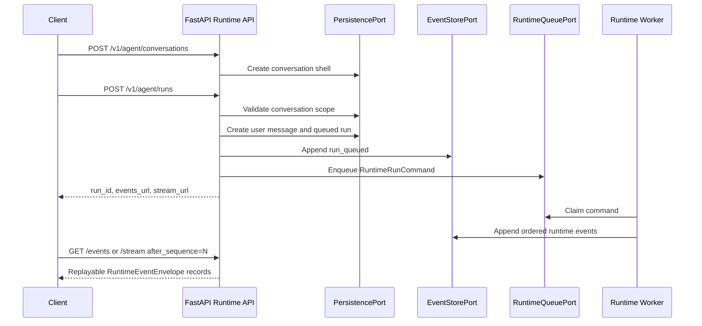

# Spec: FastAPI Runtime API

## Purpose

Document the implemented FastAPI runtime API surface for conversations, runs, event replay, streaming, cancellation, and approvals.

`services/ai-backend` is still primarily an AI orchestration service. The FastAPI API is a narrow accepted exception while `backend-facade` does not exist; it must stay limited to agent runtime workflows and must not become the tenant auth, billing, admin, or product-state API.

## Implemented Modules

- `src/agent_runtime/api/app.py`: v1 FastAPI router and application factory.
- `src/agent_runtime/api/contracts.py`: request, response, record, command, event, and error Pydantic contracts.
- `src/agent_runtime/api/errors.py`: safe HTTP error mapping.
- `src/agent_runtime/api/events.py`: runtime event projection and append helpers.
- `src/agent_runtime/api/in_memory.py`: deterministic in-memory persistence, event store, and queue ports for tests/local development.
- `src/agent_runtime/api/ports.py`: API persistence, event store, and runtime queue protocols.
- `src/agent_runtime/api/service.py`: thin orchestration over ports.
- `src/agent_runtime/api/streaming.py`: Server-Sent Events adapter over replayable runtime event envelopes.

The API layer depends on ports and typed runtime contracts. It does not import connector SDKs or execute long-running agent work inline.

## Endpoint Contract

Implemented endpoints under `/v1/agent`:

- `POST /conversations`: create or idempotently resume a conversation shell.
- `GET /conversations/{conversation_id}`: fetch conversation metadata for the caller's org/user scope.
- `GET /conversations/{conversation_id}/messages`: list active conversation messages in chronological order.
- `POST /runs`: persist a user message and queued run, append `run_queued`, and enqueue a runtime worker command.
- `GET /runs/{run_id}`: fetch current run state.
- `GET /runs/{run_id}/events?after_sequence=N`: replay persisted event envelopes after a client checkpoint.
- `GET /runs/{run_id}/stream?after_sequence=N`: stream replayed events and idle heartbeats as SSE.
- `POST /runs/{run_id}/cancel`: persist best-effort cancellation, append `run_cancelling`, and enqueue a cancel command.
- `POST /approvals/{approval_id}/decision`: persist approval decisions, append `approval_resolved`, and enqueue a worker resume command.

## Request Lifecycle

## Multi-Turn Behavior

Conversation state is cumulative. Each accepted run creates one persisted user message, so later turns can load prior messages through `GET /conversations/{conversation_id}/messages` and future workers can build scoped runtime history from the persistence port.

Example later-turn sequence:

1. User: `Find the latest launch plan and summarize unresolved risks.`
2. User: `Now focus only on risks that do not have owners yet.`
3. User: `Draft a Slack update from that list, but ask before sending.`
4. User: `Cancel that draft run; I want to rewrite the request.`

The API treats each turn as a distinct run in the same conversation, with separate run IDs, event sequences, approval decisions, cancellation commands, and replay cursors.

## Error And Security Rules

- Every request is scoped by `org_id` and `user_id` where the route exposes user-owned state.
- Runtime context must validate into `AgentRuntimeContext`.
- Metadata, request options, event payloads, and event metadata are redacted before persistence or streaming.
- Safe API errors use `ApiErrorResponse` and must not expose raw database, queue, connector, or model provider exceptions.
- Side-effecting actions must be represented by approval records and explicit decisions before workers resume the action.

## Test Coverage

Unit tests cover conversation scope, idempotent run submission, message history, event replay, SSE formatting, cancellation, approval decisions, queue claim/retry/dead-letter behavior, safe error mapping, and a multi-turn acceptance flow across the API, event store, queue, and in-memory persistence ports.
