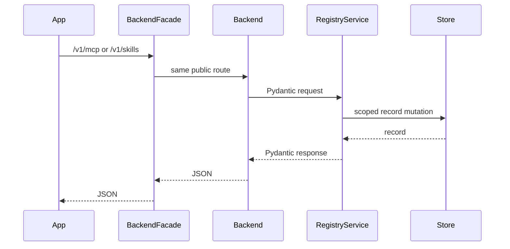

# Backend Architecture

`services/backend` is the core product backend. Its current implementation owns
MCP registry state, user skills, OAuth session state, token storage, and audit
events. Broader tenant/auth, permissions, billing, admin workflows, product
persistence, and jobs are target responsibilities, not fully implemented here
yet.

## Module Map

- `backend_app.app`: FastAPI app, route registration, and HTTP error mapping.
- `backend_app.contracts`: Pydantic request, response, record, and internal
  contract models.
- `backend_app.service`: MCP and skill registry domain services.
- `backend_app.store`: in-memory stores plus the PostgreSQL-backed skill store.
- `backend_app.migrations`: database initialization helpers for persistent
  skill storage.
- `backend_app.token_vault`: local token encryption boundary.

## Public API Surface

Public routes are intended to be reached by apps through `backend-facade`.

| Route family             | Responsibility                                               |
| ------------------------ | ------------------------------------------------------------ |
| `/v1/mcp/servers*`       | Register, list, update, delete, and authenticate MCP servers |
| `/v1/mcp/oauth/callback` | Complete MCP OAuth callback state                            |
| `/v1/skills*`            | Create, list, fetch, update, and delete user or org skills   |

These routes are typed with Pydantic models in `backend_app.contracts`.
Frontend-facing TypeScript shapes should stay aligned through
`packages/api-types`.

## Internal API Surface

Internal routes are not product-facing app routes. They are for trusted service
callers that need model-ready MCP cards, client sessions, or skill bundles.

| Route family                                          | Responsibility                                      |
| ----------------------------------------------------- | --------------------------------------------------- |
| `/internal/v1/mcp/cards`                              | List enabled MCP server cards for runtime selection |
| `/internal/v1/mcp/servers/{server_id}/auth/start`     | Start auth for an internal caller                   |
| `/internal/v1/mcp/servers/{server_id}/client-session` | Create a backend-only MCP client session            |
| `/internal/v1/mcp/servers/{server_id}/rpc`            | Proxy authenticated MCP JSON-RPC to a remote server |
| `/internal/v1/mcp/servers/{server_id}/test-token`     | Install a test token for local/test flows           |
| `/internal/v1/skills/cards`                           | List enabled skill cards for runtime selection      |
| `/internal/v1/skills/{skill_id}`                      | Fetch a model-consumable skill bundle               |
| `/internal/v1/skills/by-name/{name}`                  | Fetch a model-consumable skill bundle by name       |

See `docs/specs/internal-api.md` for the engineering contract and current
security expectations.

## Persistence Modes

MCP registry state currently uses `InMemoryMcpStore` by default. Skill state uses
`InMemorySkillStore` by default and can use `PostgresSkillStore` when
`DATABASE_URL` is configured by the service layer.

Token material is stored through `TokenVault`. The local implementation is only
for development and tests. Production must provide a managed token-vault adapter
and a persistent MCP registry store; the service fails closed rather than
falling back to local crypto-shaped storage or in-memory registry state.

Remote MCP OAuth is discovery-backed. The backend reads protected-resource and
authorization-server metadata, performs dynamic client registration when the
server advertises it, stores connector tokens in the vault, refreshes expiring
tokens when possible, and attaches bearer credentials only inside backend-owned
internal MCP JSON-RPC proxy calls.

## Request Flow

## Engineering Invariants

- Do not import sibling service modules.
- Keep public app-facing access behind `backend-facade`.
- Keep internal routes off the facade unless a spec explicitly changes that.
- Preserve org/user scoping in every registry lookup and mutation.
- Never expose encrypted or raw token values in public responses.
- Update this doc and `packages/api-types` when public contracts change.
