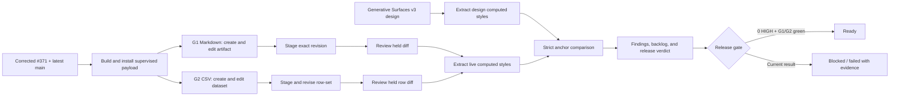

# Generative Workflows — Staging/Review Release Audit

This ledger records the real supervised-desktop and computed-style
design-parity release pass for Generative Surfaces staging and review. It is
append-only evidence: a skipped, blocked, or unimplemented case is never
reported as passing.

Secrets are out of scope for this file. Provider keys are loaded by the
journey harness from the ignored `services/ai-backend/.env`, entered through
the shipping UI, and never printed, copied, or committed.

## Audit identity

| Field             | Value                                                                                                                                     |
| ----------------- | ----------------------------------------------------------------------------------------------------------------------------------------- |
| Audit branch      | `codex/gensurf-staging-review-audit`                                                                                                      |
| Product baseline  | PR #371 corrected head `c66d3b30`, rebased on `origin/main` at `cd40aad5`                                                                 |
| Product PR        | `https://github.com/0x-copilot-dev/0x-copilot/pull/371`                                                                                   |
| Desktop posture   | Installed supervised Electron payload; embedded PostgreSQL and three staged services                                                      |
| Design source     | User-supplied `Generative Surfaces v3.dc.html` (`sha256:8f72d0e0…f5e86`) plus the independently vendored `chat-tool-call-shell` reference |
| Visual comparison | Playwright `getComputedStyle` extraction; no screenshot-diff acceptance                                                                   |
| External effects  | Forbidden; journey-owned temporary filesystem only                                                                                        |

## Workflow canvas



## Finish board

| Gate                       | Evidence required                                                               | Status  | Evidence / result                                                                                                                                                  |
| -------------------------- | ------------------------------------------------------------------------------- | ------- | ------------------------------------------------------------------------------------------------------------------------------------------------------------------ |
| #371 branch integrity      | Corrected PR history; latest main integrated; no uncommitted product change     | Passed  | Corrected head `c66d3b30`; every GitHub check passed; PR is `MERGEABLE` with `mergeStateStatus=CLEAN`                                                              |
| Supervised payload         | Branch desktop bundle and backend snapshot staged into installed payload        | Passed  | `copilot doctor` reports packaged app, staged host runtime, and valid ad-hoc signatures                                                                            |
| G1 Markdown lifecycle      | Real BYOK model; Studio artifact edit; held workspace stage; exact review state | Blocked | Real app reached signed-in/configured-model state, then host macOS Automation consent blocked the native folder picker                                             |
| G2 CSV lifecycle           | Real BYOK model; dataset edit; staged revision; row/diff review state           | Blocked | Shares the same mandatory app-owned native folder picker; not rerun to avoid another paid model request with the same unmet host consent                           |
| Staging safety             | No filesystem mutation before explicit native approval                          | Blocked | G1 never crossed the app-owned folder grant; no workspace file was seeded or written. Real apply-path validation still requires the native permission and a rerun. |
| Shared Studio shell parity | Six strict computed-style states, including held local write                    | Passed  | 0 HIGH, 6 MEDIUM, 232 LOW, 56 INFO; all design/live anchors matched                                                                                                |
| Markdown design parity     | Strict computed-style report for editor/diff/held approval                      | Failed  | `draft-held`: 9/9 anchors, 18 HIGH; `draft-edit`: 9/9 design vs 5/9 live, 16 HIGH                                                                                  |
| CSV design parity          | Strict computed-style report for dataset/row diff/partial-review state          | Failed  | `bulk-review`: 9/9 anchors, 15 HIGH; `bulk-partial`: 7/7 design vs 6/7 live, 8 HIGH                                                                                |
| Release handoff            | Commands, artifacts, findings, and blockers are reproducible                    | Passed  | Reusable v3 Playwright runner, computed-style reports, journey commands, findings, and blockers are captured here; Git evidence is recorded in branch history      |

## Findings

| ID       | Severity | State     | Area                       | Finding                                                                                                                                                                                                                                                                                             | Evidence                                                                                                         | Resolution / owner                                                                                                                                                                                      |
| -------- | -------- | --------- | -------------------------- | --------------------------------------------------------------------------------------------------------------------------------------------------------------------------------------------------------------------------------------------------------------------------------------------------- | ---------------------------------------------------------------------------------------------------------------- | ------------------------------------------------------------------------------------------------------------------------------------------------------------------------------------------------------- |
| GSQA-001 | Low      | Resolved  | CI / test data             | A high-entropy test idempotency token was classified as a generic API key by the PR secret scanner.                                                                                                                                                                                                 | PR #371 `lint-and-secrets`; `test_effect_stager.py`                                                              | Rewrote the introducing commit with a low-entropy test token and force-with-lease pushed the corrected history.                                                                                         |
| GSQA-002 | Medium   | Confirmed | Chat-surface release test  | `RunDestination.sourceOpen.test.tsx` calls `getByTestId("tc-tabs")` before any lifecycle or explicit source tab exists. Shipping `ThreadCanvas` intentionally omits the strip when `tabs.length === 0`, so the test fails before exercising source-open.                                            | Focused rerun: 1 failed; stack at `surfaceTabs()` line 137; shipping `TcTabs` mount condition                    | Test owner: assert the empty state with `queryByTestId`, then require `tc-tabs` only after the source-open response creates the ephemeral tab. No product behavior change is indicated by this failure. |
| GSQA-003 | Medium   | Resolved  | Desktop journey harness    | G1 queried `auth.get-posture` as soon as the Playwright control bridge existed, before the supervised runtime had finished booting and main had registered auth IPC. The real first attempt failed with `No handler registered for 'auth.get-posture'`.                                             | Real installed-payload G1 run; delayed IPC probe                                                                 | G1 now waits for the shipping sign-in gate (the supervised boot barrier) before inspecting main posture. No product behavior is bypassed.                                                               |
| GSQA-004 | Blocker  | Open      | Host test environment      | macOS has not granted the terminal/`osascript` process Automation or Accessibility access to System Events. The real folder chooser stayed open until the driver timed out; an independent `UI elements enabled` probe also hung awaiting OS consent.                                               | Second real installed-payload G1 run; native automation probe                                                    | User must grant the host permission once in System Settings. Do not replace the native grant with test seeding or a facade write. Then rerun G1 and G2 unchanged.                                       |
| GSQA-005 | High     | Open      | v3 review-surface fidelity | The supplied v3 draft/table design and shipping review components are not 1:1. Across four strict states the audit measured 57 HIGH, 125 MEDIUM, 140 LOW, and 25 INFO findings. The largest families are button typography/treatment, surface/card geometry, warning/status colors, and row layout. | `tools/design-parity/surfaces/generative-surfaces-v3/out/report.md` and four state reports                       | Product/design-system owners: converge through shared review-surface recipes and tokens; do not patch one state at a time. Re-run the single v3 parity command until HIGH=0.                            |
| GSQA-006 | High     | Open      | Draft edit safety context  | In the v3 design, the revision-pinned approval bar remains visible while editing with actions disabled. The shipping `TcStagedDraftSurface` removes the approval bar entirely during edit, leaving 4 strict anchors absent.                                                                         | `report-draft-edit.md`: `draft.approval`, `draft.approval-copy`, `draft.approve`, `draft.reject` missing in live | Preserve the revision/approval context during edit while preventing approval of unsaved content. Solve in the staged-draft interaction contract, not with decorative duplicate copy.                    |
| GSQA-007 | High     | Open      | Partial-apply recovery     | The v3 partial state provides a scoped “retry failed” action. Shipping `TcStagedTableSurface` treats `partially_applied` as terminal and removes the apply bar, so no retry control is present.                                                                                                     | `report-bulk-partial.md`: `bulk.retry` missing in live                                                           | Define a retry-failed command over the exact failed row keys and existing idempotency contract, then expose it through the shared staged-table surface.                                                 |
| GSQA-008 | Medium   | Open      | Desktop release preflight  | G1/G2 discover missing macOS assistive access only after supervised boot, BYOK entry, and a paid model run.                                                                                                                                                                                         | `osascript … UI elements enabled` returns `false`; real G1 stopped at the chooser                                | Add a non-secret host preflight before loading a key or making a model request. It must fail the release run explicitly, not mark it skipped/passed.                                                    |

## Backlog

These items are not silently expanded into the current release pass. New work
discovered during execution is added here with explicit priority and owner.

| ID      | Priority | State   | Task                                                                                                  | Why it remains                                                                        |
| ------- | -------- | ------- | ----------------------------------------------------------------------------------------------------- | ------------------------------------------------------------------------------------- |
| GSB-001 | P1       | Planned | Make G3 code-artifact lifecycle executable as a supervised desktop journey.                           | The required journey is specified in `JOURNEYS.md` but has no executable script.      |
| GSB-002 | P1       | Planned | Make G4 DOCX lifecycle executable.                                                                    | Specified but not executable.                                                         |
| GSB-003 | P1       | Planned | Make G5 local email triage executable against the fixture connector.                                  | Fixture scenario exists; end-to-end journey does not.                                 |
| GSB-004 | P1       | Planned | Make G6 local timeline/X workflow executable against the fixture connector.                           | Fixture scenario exists; end-to-end journey does not.                                 |
| GSB-005 | P1       | Planned | Make G7 local Discord moderation workflow executable against the fixture connector.                   | Fixture scenario exists; end-to-end journey does not.                                 |
| GSB-006 | P1       | Planned | Make G8 mixed multi-surface workflow executable.                                                      | Specified but not executable.                                                         |
| GSB-007 | P1       | Planned | Make G9 recovery/honesty workflow executable.                                                         | Specified but not executable.                                                         |
| GSB-008 | P1       | Planned | Make G10 close/reopen and retention workflow executable.                                              | Specified but not executable.                                                         |
| GSB-009 | P0       | Planned | Converge staged draft/table visual architecture with the v3 design via shared review-surface recipes. | Strict audit has 57 HIGH findings; per-screen CSS patches would be a band-aid.        |
| GSB-010 | P0       | Planned | Keep revision-pinned approval context visible during draft editing.                                   | Four required v3 anchors are absent in live edit state.                               |
| GSB-011 | P0       | Planned | Add idempotent retry-failed behavior and UI for partially applied row sets.                           | The v3 recovery action is absent; current client treats partial as terminal.          |
| GSB-012 | P1       | Planned | Correct the stale `RunDestination.sourceOpen` empty-tab assertion.                                    | Current focused release test is red before it reaches the behavior it claims to test. |
| GSB-013 | P1       | Planned | Add macOS Accessibility/Automation preflight to G1 and G2 before BYOK/model use.                      | Prevents avoidable paid calls when native dialog automation cannot run.               |

## Execution log

| Time (Asia/Kolkata) | Action                                                                               | Result                                                                                                                                                                                         |
| ------------------- | ------------------------------------------------------------------------------------ | ---------------------------------------------------------------------------------------------------------------------------------------------------------------------------------------------- |
| 2026-07-27          | Pulled latest `origin/main` into the main checkout.                                  | Fast-forwarded `4b2e75d6` → `cd40aad5`; no local user changes overwritten.                                                                                                                     |
| 2026-07-27          | Rebased PR #371 product work on latest main and corrected the secret-scan finding.   | Corrected PR head pushed; focused effects/runtime tests: 90 passed; `api-types` and `chat-surface` typechecks passed.                                                                          |
| 2026-07-27          | Built and installed the exact audit payload; force-refreshed the supervised runtime. | `copilot doctor`: app bundle present, host runtime staged, ad-hoc signatures valid; G1/G2 harness tests: 32 passed.                                                                            |
| 2026-07-27          | First real G1 launch.                                                                | Failed before sign-in because the journey raced supervised boot and called `auth.get-posture` before IPC registration; recorded as GSQA-003 and fixed in the harness.                          |
| 2026-07-27          | Second real G1 launch after the boot-barrier fix.                                    | Passed supervised boot, local sign-in, FTUE key entry, and model configuration; blocked at the app-owned folder chooser because macOS withheld Automation/Accessibility permission (GSQA-004). |
| 2026-07-27          | Rechecked PR #371 after corrected push.                                              | All GitHub checks passed; draft PR is mergeable and clean.                                                                                                                                     |
| 2026-07-27          | Re-ran `RunDestination.sourceOpen.test.tsx` under the package-owned Vitest config.   | 1 failed before source-open because the test requires an empty `tc-tabs` strip (GSQA-002).                                                                                                     |
| 2026-07-27          | Ran the existing six-state chat/tool-call shell parity command.                      | Playwright computed styles; 0 HIGH, 6 MEDIUM; all anchors matched, including held local write.                                                                                                 |
| 2026-07-27          | Added and ran the dedicated user-supplied v3 review-surface harness.                 | Four real component fixtures passed; strict comparison produced 57 HIGH / 125 MEDIUM / 140 LOW / 25 INFO with no waivers.                                                                      |
| 2026-07-27          | Rechecked host assistive access and opened the macOS Accessibility settings pane.    | `UI elements enabled` remains `false`; G1/G2 cannot honestly drive the native chooser yet.                                                                                                     |

## Reproduction commands

```bash
# Existing full Studio shell, including held local write
node tools/design-parity/lib/run-chat-tool-call-shell-parity.mjs

# User-supplied v3 draft/edit/bulk/partial review states
node tools/design-parity/lib/run-generative-surfaces-v3-parity.mjs

# Real installed supervised Desktop journeys (requires macOS assistive access)
G1_RELEASE=1 python3 tools/desktop-journeys/generative-workflows/g1_markdown_lifecycle.py
G2_RELEASE=1 python3 tools/desktop-journeys/generative-workflows/g2_csv_lifecycle.py
```

## Final verdict

**Not ready for release from this audit.** PR #371 is green and mergeable, and
the shared Studio shell meets the 0-HIGH threshold. The real G1/G2 journeys are
blocked by a host macOS permission that cannot be bypassed honestly. The
supplied v3 review-surface audit is complete and fails the fidelity gate with
57 HIGH findings, including two functional absences: approval context during
draft editing and retry of failed rows after a partial apply.
